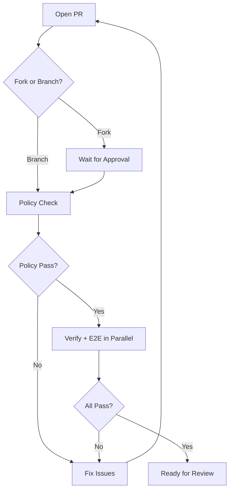

# CI/CD Troubleshooting Guide

This guide helps you diagnose and fix common CI/CD issues in Paperclip.

## Quick Diagnosis

| Error Message | Issue | Solution |
|---------------|-------|----------|
| `Do not commit pnpm-lock.yaml` | Lockfile committed in PR | See [Lockfile Policy Issues](#lockfile-policy-issues) |
| `ERR_PNPM_OUTDATED_LOCKFILE` | Package.json changed without lockfile | See [Lockfile Policy Issues](#lockfile-policy-issues) |
| `Dockerfile deps stage missing: COPY` | Package.json added but not in Dockerfile | See [Dockerfile Validation Failures](#dockerfile-validation-failures) |
| `failed to solve` (Docker build) | Dependency checksum mismatch | See [Docker Build Failures](#docker-build-failures) |
| Workflows not running on fork PR | Fork PRs require approval | See [Fork PR Workflows](#fork-pr-workflows-not-running) |

---

## Common Issues

### Lockfile Policy Issues

**Symptom:**
- Policy check fails with: `Do not commit pnpm-lock.yaml in pull requests. CI owns lockfile updates.`
- OR verify/e2e fails with: `ERR_PNPM_OUTDATED_LOCKFILE`

**Cause:**
Paperclip uses automated lockfile management. Manual lockfile commits are blocked by policy to ensure consistency.

**Solution:**

1. **Remove lockfile changes from your PR:**
   ```bash
   git checkout origin/master -- pnpm-lock.yaml
   git commit -m "chore: remove lockfile changes per CI policy"
   git push
   ```

2. **CI will automatically regenerate** the lockfile from your `package.json` changes during the policy check.

3. **For new dependencies:** Just update `package.json` - CI handles the rest.

**Why this works:**
- The policy job runs `pnpm install --lockfile-only` to regenerate the lockfile
- Subsequent jobs (verify, e2e) use the regenerated lockfile

**Reference:** See `CONTRIBUTING.md` section "CI/CD and Lockfile Policy"

---

### Dockerfile Validation Failures

**Symptom:**
```
::error::Dockerfile deps stage missing: COPY cli/package.json cli/
```

**Cause:**
You added a new package but didn't update the Dockerfile's deps stage to copy its `package.json`.

**Solution:**

1. Find the deps stage in `Dockerfile` (starts with `FROM base AS deps`)
2. Add a COPY line for your new package:
   ```dockerfile
   COPY your-package/package.json your-package/
   ```
3. Keep the COPY lines in the same order as workspace packages in `pnpm-workspace.yaml`

**Reference:** `.github/workflows/pr.yml` - "Validate Dockerfile deps stage" step

---

### Docker Build Failures

**Symptom:**
```
failed to solve
```
Or checksum mismatch errors during Docker build.

**Common Causes:**

1. **Upstream dependency checksum changed:**
   - GitHub CLI GPG keyring rotated (issue #3641)
   - Solution: Update the hardcoded SHA256 checksum in Dockerfile

2. **Network/cache issues:**
   - Solution: Retry the build or clear Docker cache

**Debugging:**
```bash
# Test Docker build locally
docker build -t paperclip-test .

# Build with no cache
docker build --no-cache -t paperclip-test .
```

---

### Fork PR Workflows Not Running

**Symptom:**
- Your PR shows no CI checks (policy, verify, e2e)
- Only Snyk/Greptile checks appear

**Cause:**
GitHub requires maintainer approval for workflows on fork PRs (security feature).

**What happens:**
1. You submit PR from your fork
2. External checks (Snyk, Greptile) run immediately
3. Internal workflows (policy, verify, e2e) wait for approval
4. Maintainer approves workflows
5. CI runs normally

**Action required:**
Wait for a maintainer to approve the workflow runs. You can add a comment asking for review if it's urgent.

**Reference:** This is GitHub's standard security model for fork PRs.

---

### Test Failures

**Symptom:**
```
FAIL @paperclipai/server src/__tests__/issues-service.test.ts
```

**Diagnosis:**
1. **Check if tests pass locally:**
   ```bash
   pnpm test:run
   ```

2. **Check for database/state issues:**
   - Tests may fail if they depend on specific database state
   - Check test isolation and cleanup

3. **Check for timing/race conditions:**
   - E2E tests especially prone to this
   - Look for `waitFor` or timeout issues

**Not a CI/CD issue if:**
- Tests fail consistently with the same error
- Error is in your changed code
→ This is a code bug, not infrastructure

---

### TypeScript Build Failures

**Symptom:**
```
error TS2305: Module has no exported member 'X'
error TS2339: Property 'Y' does not exist on type 'Z'
```

**Diagnosis:**
1. **Run typecheck locally:**
   ```bash
   pnpm -r typecheck
   ```

2. **Check for missing types:**
   - Did you add a new dependency without types?
   - Do you need `@types/*` package?

3. **Check for circular dependencies or import issues**

**Not a CI/CD issue if:**
- Typecheck fails locally with same errors
→ Fix the type errors in your code

---

## CI Workflow Overview

### Standard PR Flow



### Job Breakdown

1. **Policy** (~10s)
   - Validates Dockerfile dependencies
   - Blocks manual lockfile edits
   - Regenerates lockfile if package.json changed

2. **Verify** (~8min)
   - Typechecks all packages
   - Runs unit tests
   - Builds all packages
   - Tests canary release

3. **E2E** (~2-5min)
   - Runs end-to-end tests
   - Tests full application flow

---

## Getting Help

1. **Check this guide** for your specific error message
2. **Search existing issues** - someone may have hit this before
3. **Ask in #dev Discord** - community can help
4. **Tag maintainers** if it's a critical infrastructure issue

---

## Maintainer Section

### Approving Fork PR Workflows

When a trusted contributor submits a fork PR:

1. Review the code changes for safety
2. Go to the PR's "Checks" tab
3. Click "Approve and run" for the workflows

### Updating Lockfile for Merged PRs

The `refresh-lockfile` workflow runs automatically on master:
- Triggers on push to master
- Updates lockfile if needed
- Creates PR if lockfile changed
- Auto-merges when checks pass

### Troubleshooting CI Infrastructure

**Workflow failures on master:**
1. Check recent commits for workflow file changes
2. Verify secrets are set correctly
3. Check GitHub Actions status page

**Persistent test failures:**
1. Check for flaky tests (pass/fail intermittently)
2. Review test isolation
3. Consider if database seed data changed

**Docker build issues:**
1. Check for upstream dependency changes
2. Verify all checksums in Dockerfile
3. Test build locally before merging

---

*Last updated: 2026-04-15*
*Maintained by: DevOps team*
