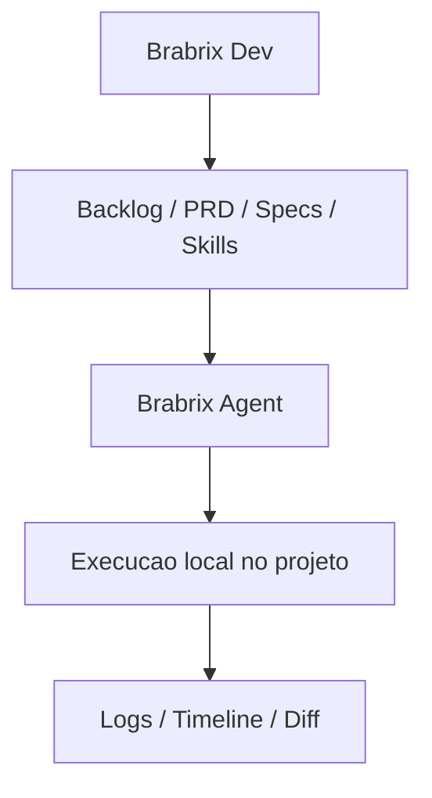

# Brabrix Agent

Plataforma de agentes de IA com execucao local, orientada a workflow de desenvolvimento e integrada ao ecossistema Brabrix Dev.


> [!IMPORTANT]
> Este projeto e um fork/modificacao do Paperclip. O objetivo do Brabrix Agent e evoluir o runtime para fluxos de engenharia assistida por IA no ecossistema Brabrix, sem remover os creditos e os termos da licenca MIT do projeto original.

## Status do projeto

- Em desenvolvimento ativo.
- Fork funcional com foco em execucao local, backlog orientado por IA e integracoes Brabrix.
- Mantem compatibilidade com conceitos e estruturas do upstream sempre que possivel.

## O que e o Brabrix Agent

O Brabrix Agent e uma plataforma para operar agentes de IA em projetos reais, com controle de contexto e execucao local no workspace.

Ele combina:

- runtime local para agentes (com board, goals/issues e execucoes)
- ingestao de contexto de produto e engenharia (PRD, specs, regras, skills)
- fluxo de backlog orientado por IA, conectado ao Brabrix Dev
- integracoes de skills via GitHub, `skills.sh` e Brabrix SkillHub
- workflow observavel com logs, timeline e visao de mudancas

## Fork do Paperclip

> "This project is based on the amazing open source project Paperclip."

O Brabrix Agent:

- e um fork do Paperclip
- preserva a licenca MIT e os creditos originais
- busca manter compatibilidade com o modelo de orquestracao do upstream
- adiciona integracoes e capacidades focadas no ecossistema Brabrix Dev

Links importantes:

- Projeto original Paperclip: [paperclipai/paperclip](https://github.com/paperclipai/paperclip)
- Licenca MIT original: [LICENSE upstream](https://github.com/paperclipai/paperclip/blob/master/LICENSE)
- Licenca deste fork: [LICENSE](LICENSE)

## Principais funcionalidades

Legenda:
- `✅` disponivel
- `🧪` em implementacao/evolucao
- `🗺️` roadmap

| Funcionalidade | Status | Observacao |
| --- | --- | --- |
| Agentes locais | ✅ | Adapters locais como `claude_local`, `codex_local`, `gemini_local`, `opencode_local` e outros |
| Execucao de tasks | ✅ | Fluxo por goals/issues com execucao no projeto local |
| Integracao com Brabrix Dev | ✅ | Importa task/contexto via endpoint de sincronizacao |
| SkillHub integration | ✅ | Provider `brabrix_skillhub` com busca/import de skills |
| Contexto persistente | ✅ | Estado, historico e contexto de execucao permanecem rastreaveis |
| Backlog orientado por IA | 🧪 | Pipeline `BrabrixTask -> AgentGoal -> Context` implementado e evoluindo |
| Multi-provider AI | ✅ | Modelo de adapters plugavel por provider/runtime |
| Workspace local | ✅ | Execucao ligada a workspaces de projeto e execucao |
| Timeline / logs | ✅ | Logs e eventos de execucao com visibilidade operacional |
| Diff preview | 🧪 | Fluxo de diff via recursos/plugins de workspace diff |
| Integracao VS Code | 🧪 | Integracao de ecossistema com Brabrix Dev VS Code extension |
| Suporte a multiplos idiomas | ✅ | UI com i18n e locale `pt-BR` disponivel |
| OpenAI / Claude / Gemini | ✅ | Suporte via adapters/configuracao de modelos |
| GitHub skills | ✅ | Importacao de skills por URL/repositorio GitHub |
| `skills.sh` | ✅ | Compatibilidade de importacao como provider de skills |
| Brabrix SkillHub | ✅ | Busca, categorias, destaque e import quando habilitado |

## Como funciona

```text
Brabrix Dev
  ↓
Backlog / PRD / Specs / Skills
  ↓
Brabrix Agent
  ↓
Execucao local no projeto
  ↓
Logs / Timeline / Diff
```



## Arquitetura

- **Brabrix Dev**: camada de orquestracao e contexto (backlog, PRD/spec, skills e organizacao do trabalho).
- **Brabrix Agent**: runtime local de execucao dos agentes no workspace do projeto.
- **Providers de IA**: seguem plugaveis via adapters, preservando flexibilidade do projeto base.

## Diferencas para o Paperclip Original

Principais diferencas deste fork:

- integracao com Brabrix Dev para ingestao de tarefas/contexto
- provider adicional Brabrix SkillHub para skills corporativas/publicas
- backlog orientado por IA com mapeamento de task para goal/contexto tecnico
- workflows de desenvolvimento focados em entrega de software
- foco em integracao com fluxos de IDE (incluindo VS Code no ecossistema Brabrix)
- interface com suporte a i18n, incluindo `pt-BR`
- branding e direcionamento de produto orientados ao ecossistema Brabrix

## Instalacao

### 1. Clonar o projeto

```bash
git clone <url-do-seu-fork>
cd brabrix-agent
```

### 2. Instalar dependencias

```bash
pnpm install
```

### 3. Configurar ambiente

```bash
cp .env.example .env
```

### 4. Configurar credenciais Brabrix

Preencha as variaveis de integracao no `.env` (detalhes na secao de configuracao abaixo).

### 5. Rodar o projeto

```bash
pnpm dev
```

Servidor/API em `http://localhost:3100`.

## Configuracao

Exemplo de configuracao base:

```env
# Convencao usada em pipelines/scripts do ecossistema
BRABRIX_API_KEY=
BRABRIX_API_URL=https://api.brabrix.com
WORKSPACE_PATH=

# Variaveis consumidas diretamente pelo runtime atual
BRABRIX_AGENT_TOKEN=
BRABRIX_PROJECT_ID=
BRABRIX_AGENT_ID=
BRABRIX_PROVIDER=

# Opcional (defaults internos do runtime)
BRABRIX_PROJECT_CONTEXT_ENDPOINT=
BRABRIX_NEXT_TASK_ENDPOINT=
BRABRIX_SEND_RUN_LOGS_ENDPOINT=
BRABRIX_COMPLETE_TASK_ENDPOINT=

BRABRIX_SKILLHUB_ENABLED=true
BRABRIX_SKILLHUB_API_URL=https://api.brabrix.com
BRABRIX_SKILLHUB_TOKEN=
BRABRIX_SKILLHUB_API_KEY=
BRABRIX_SKILLHUB_SEARCH_ENDPOINT=/api/public/dev-hub/items
BRABRIX_SKILLHUB_SKILL_DETAIL_ENDPOINT=/api/public/dev-hub/items/{skillId}
BRABRIX_SKILLHUB_CATEGORIES_ENDPOINT=/api/public/dev-hub/categories
BRABRIX_SKILLHUB_FEATURED_ENDPOINT=/api/public/dev-hub/featured

# Dados locais da instancia
PAPERCLIP_HOME=
PAPERCLIP_INSTANCE_ID=default
```

Observacoes tecnicas:

- O runtime usa `BRABRIX_AGENT_TOKEN` para autenticar na integracao Brabrix.
  - Se o valor começar com `bbx_`, o client envia `x-api-key` (mesma lógica da extensão VS Code Brabrix).
  - Caso contrário, envia `Authorization: Bearer ...`.
- Para endpoints que já carregam `{projectId}` no path (defaults), o sync evita enviar query params extras (`projectId`, `provider`, `agentId`) para manter compatibilidade com a API pública.
- Para sync de goals (`Import from Brabrix`), token e project ID podem ser configurados por empresa em **Company Settings → Brabrix** (via Secrets), com fallback legado para env.
- Para sync de goals, os endpoints default ja sao carregados pelo runtime; sobrescreva por env apenas se sua API usar paths customizados.
- `BRABRIX_API_KEY` pode ser usada como convencao de plataforma/gateway, desde que seja mapeada para o token esperado pelo runtime.
- Para SkillHub, os defaults publicos usam `api/public/dev-hub/*` e podem ser sobrescritos por env sem alterar código.
- Para SkillHub, a API key pode ser configurada por empresa em **Company Settings → Brabrix** (via Secrets), com fallback legado para env.
- `WORKSPACE_PATH` e uma variavel util de orquestracao; o runtime usa configuracoes de workspace do proprio projeto e caminhos de instancia.

## Providers suportados

Suporte via adapters (core e plugins), incluindo:

- OpenAI (ex.: fluxos com `codex_local`/modelos OpenAI)
- Anthropic Claude (`claude_local`)
- Gemini (`gemini_local`)
- Cursor / OpenCode e outros adapters existentes no projeto
- Adapters `process` e `http` para cenarios customizados

## Skill Providers

Providers de skills disponiveis:

- GitHub
- `skills.sh`
- Brabrix SkillHub

## Visao do projeto

O Brabrix Agent existe para fechar o loop entre planejamento e execucao:

- da ideia (PRD/spec) para tarefa executavel
- da tarefa para entrega tecnica no repositorio local
- da execucao para observabilidade e governanca de engenharia

Direcao de produto: manter base open source forte, compatibilidade com o upstream e especializacao progressiva para o ecossistema Brabrix Dev.

## Roadmap

Itens direcionais para proximas iteracoes:

- multi-agent orchestration mais avancada
- marketplace de skills/plugins do ecossistema
- agentes especializados por perfil (backend, frontend, qa, etc.)
- cloud sync e cenarios hibridos local+nuvem
- enterprise governance (auditoria, controle e compliance ampliados)
- VS Code deep integration com fluxos de backlog, specs e skills

Para backlog expandido, veja [ROADMAP.md](ROADMAP.md).

## Contribuindo

Contribuicoes sao bem-vindas.

Fluxo recomendado:

1. Abra uma issue (bug, melhoria ou proposta de feature).
2. Crie uma branch focada em uma entrega pequena e revisavel.
3. Mantenha compatibilidade com o upstream sempre que possivel.
4. Inclua validacao local minima (`pnpm test` e checks relevantes ao escopo).
5. Abra PR com contexto tecnico claro e trade-offs.

Guia completo: [CONTRIBUTING.md](CONTRIBUTING.md)

Filosofia do projeto:

- clareza antes de overengineering
- evolucao incremental com feedback real de uso
- governanca e observabilidade como partes do workflow, nao como anexos

## Licenca

Este projeto esta sob licenca MIT.

- Licenca local do fork: [LICENSE](LICENSE)
- Baseado no projeto Paperclip (MIT): [paperclipai/paperclip](https://github.com/paperclipai/paperclip)
- Aviso de copyright upstream mantido no arquivo de licenca (`Copyright (c) 2025 Paperclip AI`)
- Creditos upstream preservados conforme os termos da licenca

---

**Creditos**

- Projeto original: Paperclip AI
- Fork/evolucao: Brabrix Agent
