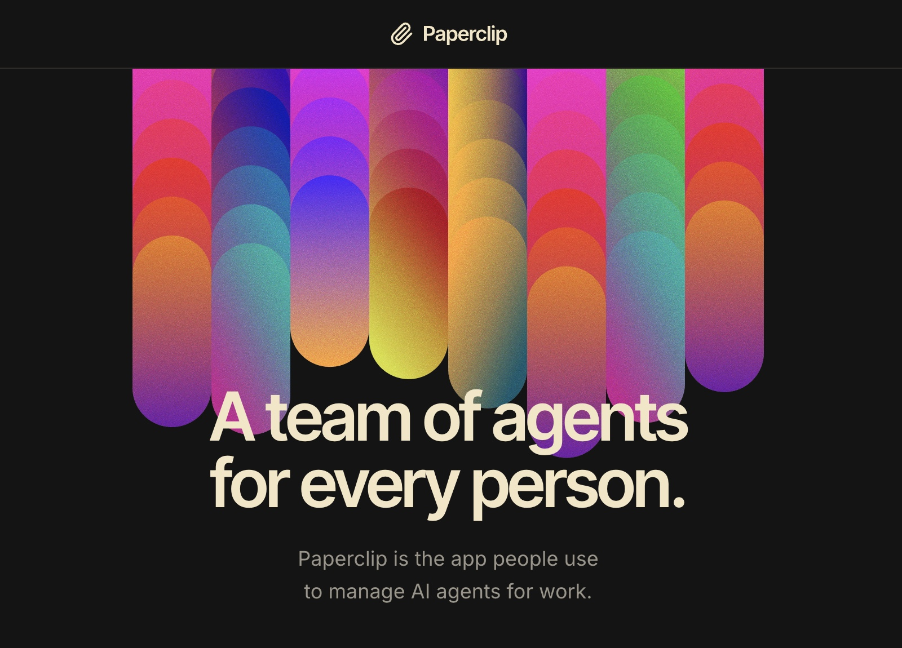

<p align="center">
  
</p>

<p align="center">
  <a href="README.md">English</a> | <a href="README.zh.md">中文版</a>
</p>

<p align="center">
  <a href="#快速开始"><strong>快速开始</strong></a> &middot;
  <a href="https://docs.paperclip.ing"><strong>文档</strong></a> &middot;
  <a href="https://github.com/paperclipai/paperclip"><strong>GitHub</strong></a> &middot;
  <a href="https://discord.gg/m4HZY7xNG3"><strong>Discord</strong></a> &middot;
  <a href="https://x.com/papercliping"><strong>Twitter</strong></a> &middot;
  <a href="https://paperclip.ing"><strong>官网</strong></a>
</p>

<p align="center">
  <a href="LICENSE"></a>
  <a href="https://github.com/paperclipai/paperclip/stargazers"></a>
  <a href="https://www.star-history.com/paperclipai/paperclip"></a>
  <a href="https://discord.gg/m4HZY7xNG3"></a>
</p>

<br/>

<div align="center">
  <video src="https://github.com/user-attachments/assets/773bdfb2-6d1e-4e30-8c5f-3487d5b70c8f" width="600" controls></video>
</div>

<br/>

# Paperclip 是人们用来管理 AI 智能体工作的应用程序。

面向 AI 智能体团队的开源编排引擎。

**如果说 OpenClaw 是“员工”，那么 Paperclip 就是“公司”。**

Paperclip 是一个基于 Node.js 服务器和 React 前端的系统，用于编排 AI 智能体团队来协同运行业务。你可以引入自己的智能体，分配业务目标，并在统一的控制面板中跟踪工作成果和 Token 成本。

它看起来像一个任务管理器 —— 但在底层，它拥有组织架构图、预算控制、治理机制、目标对齐和智能体协同能力。

**管理业务目标，而非 Pull Request。**

|        | 步骤            | 示例                                                            |
| ------ | --------------- | ------------------------------------------------------------------ |
| **01** | 定义目标 | _“构建排名第一的 AI 笔记应用，实现 100 万美元月经常性收入 (MRR)。”_ |
| **02** | 雇佣团队 | CEO、CTO、工程师、设计师、市场营销 —— 任何机器人、任何模型供应商。 |
| **03** | 批准并运行 | 审查策略。设置预算。点击运行。从控制台实时监控。 |

<br/>

<div align="center">
<table>
  <tr>
    <td align="center"><strong>兼容<br/>工具</strong></td>
    <td align="center"><br/><sub>OpenClaw</sub></td>
    <td align="center"><br/><sub>Claude Code</sub></td>
    <td align="center"><br/><sub>Codex</sub></td>
    <td align="center"><br/><sub>Cursor</sub></td>
    <td align="center"><br/><sub>Bash</sub></td>
    <td align="center"><br/><sub>HTTP</sub></td>
  </tr>
</table>

<em>只要能接收“心跳”，就能被雇佣。</em>

</div>

<br/>

## Paperclip 适合你，如果：

- ✅ 你想构建 **自主运行的 AI 组织**
- ✅ 你需要 **协调多个不同的智能体**（OpenClaw, Codex, Claude, Cursor）来达成共同目标
- ✅ 你同时开启了 **20 个 Claude Code 终端** 却无法追踪每个人的进度
- ✅ 你希望智能体 **24/7 自主运行**，但仍想在必要时审计工作并随时介入
- ✅ 你想 **监控成本** 并强制执行预算
- ✅ 你希望管理智能体的流程 **像使用任务管理器一样直观**
- ✅ 你想通过 **手机** 随时随地管理你的自主业务

<br/>

## 四大支柱

要让 AI 智能体组织真正高效产出，必须在四个维度上协同运作：任务、组织、培训和基础设施。Paperclip 正是围绕这四大支柱构建的。

<picture>
  <source media="(prefers-color-scheme: dark)" srcset="https://raw.githubusercontent.com/paperclipai/paperclip/1ec33ffd8b597f7e36aac3e2fbb4665b8c42dc3c/doc/assets/four-pillars-dark.png">
  <source media="(prefers-color-scheme: light)" srcset="https://raw.githubusercontent.com/paperclipai/paperclip/1ec33ffd8b597f7e36aac3e2fbb4665b8c42dc3c/doc/assets/four-pillars-light.png">
  
</picture>

| 支柱 | 适用对象 | 涵盖内容 |
| --- | --- | --- |
| **智能体任务管理器** — 声明意图，智能体工作，你来验证输出。 | 全体人员，日常使用 | 任务、审批流程与审查门槛 · 主动协作的智能体同事 · 可审计的常规事务与工作流 · 通过 diff、截图和测试进行验证 |
| **智能体组织架构图** — 为人类和智能体定义角色、权限与边界。 | 管理者 | 人机混合组织架构 · 职责分配、委派与专业分工 · 治理：谁能执行什么操作 · 作用域密钥与公司边界 |
| **智能体员工培训** — 设计、训练和评估你的 AI 员工。 | 赋能者 | 技能工作室（Skill Studio）与全公司共享技能 · 评估框架与测试集运行 · 主动学习循环与质量指标 · 智能体绩效评估 |
| **智能体操作系统 (Agentic OS)** — 让工作运转的底层基础设施。 | IT 与平台团队 | 跨供应商运行时：支持任何模型、任何智能体 · 沙箱、集成与 MCP 服务器 · 单点登录 (SSO)、GRC、基于角色的权限控制 (RBAC) 与成本控制 · 数据隐私、内部 Trace 收集与数据复利价值 |

<br/>

## 核心特性

<table>
<tr>
<td align="center" width="33%">
<h3>🔌 引入你的智能体</h3>
任何智能体，任何运行时，统一组织架构。只要能接收心跳，即可入职。
</td>
<td align="center" width="33%">
<h3>🎯 目标对齐</h3>
每个任务都可追溯到组织使命。智能体清楚地知道<em>做什么</em>以及<em>为什么做</em>。
</td>
<td align="center" width="33%">
<h3>💓 心跳机制</h3>
智能体按计划唤醒、检查工作并采取行动。任务委派在组织架构中上下流动。
</td>
</tr>
<tr>
<td align="center">
<h3>💰 成本控制</h3>
为每个智能体设置月度预算。一旦达到上限立即暂停，拒绝成本失控。
</td>
<td align="center">
<h3>🏢 多公司支持</h3>
一次部署，管理多家公司。完全的数据隔离，统一掌控你的投资组合。
</td>
<td align="center">
<h3>🎫 工单系统</h3>
每场对话皆可追溯，每个决策皆有解释。完整的工具调用追踪和不可篡改的审计日志。
</td>
</tr>
<tr>
<td align="center">
<h3>🛡️ 治理机制</h3>
批准招聘、覆盖策略、随时暂停或终止任何智能体 —— 尽在掌控。
</td>
<td align="center">
<h3>📊 组织架构图</h3>
层级、角色、汇报关系。你的智能体拥有上级、职位头衔和明确的工作职责描述。
</td>
<td align="center">
<h3>📱 移动端就绪</h3>
随时随地通过手机监控并管理你的自主业务。
</td>
</tr>
</table>

<br/>

## Paperclip 解决的痛点

| 没有 Paperclip                                                                                                                     | 使用 Paperclip                                                                                                                         |
| ------------------------------------------------------------------------------------------------------------------------------------- | -------------------------------------------------------------------------------------------------------------------------------------- |
| ❌ 你开了 20 个 Claude Code 标签页，无法追踪谁在做什么。重启后一切丢失。 | ✅ 任务基于工单，对话采用线程模式，会话在重启后依然持久化。 |
| ❌ 你需要手动从多个地方收集上下文，以提醒机器人你到底在做什么。 | ✅ 上下文从任务流向项目和公司目标 —— 你的智能体始终明白目标与意义。 |
| ❌ 智能体配置文件夹杂乱无章，你还在重复发明任务管理、通信和协作机制。 | ✅ Paperclip 开箱即用提供组织架构、工单、委派和治理 —— 让你运行公司，而非一堆脚本。 |
| ❌ 陷入死循环的智能体浪费了数百美元的额度，在你发现之前就刷爆了配额。 | ✅ 成本追踪实时显示预算，并在用尽时限制智能体。管理层通过预算决定优先级。 |
| ❌ 你有重复性工作（客服、社交媒体、报告），必须记住手动启动它们。 | ✅ 心跳机制按计划处理常规工作。管理层负责监督。 |
| ❌ 你有一个想法，必须找到仓库，启动 Claude Code，保持标签页开启并盯着它。 | ✅ 在 Paperclip 中添加任务。你的编程智能体会一直工作直到完成。管理层审查成果。 |

<br/>

## 为什么 Paperclip 与众不同

Paperclip 正确处理了编排中的底层细节。

|                                   |                                                                                                               |
| --------------------------------- | ------------------------------------------------------------------------------------------------------------- |
| **原子级执行** | 任务签出和预算执行是原子的，确保没有重复劳动和意外支出。 |
| **持久化智能体状态** | 智能体在心跳之间恢复相同的任务上下文，而非从头开始。 |
| **运行时技能注入** | 智能体可以在运行时学习 Paperclip 工作流和项目上下文，无需重新训练。 |
| **带回滚的治理** | 强制执行审批门槛，配置更改具备版本控制，错误更改可安全回滚。 |
| **目标感知执行** | 任务携带完整的业务目标溯源，让智能体始终看到“原因”，而不只是个标题。 |
| **便携式公司模板** | 导出/导入组织、智能体和技能，支持敏感信息清洗和冲突处理。 |
| **真正的多公司隔离** | 每个实体都以公司为作用域，一次部署即可运行多家公司，数据和审计轨迹完全独立。 |

<br/>

## 底层架构与系统组件

Paperclip 是一个完整的控制面板，而非简单的封装层：

```
┌──────────────────────────────────────────────────────────────┐
│                       PAPERCLIP SERVER                       │
│                                                              │
│  ┌───────────┐  ┌───────────┐  ┌───────────┐  ┌───────────┐  │
│  │Identity & │  │  Work &   │  │ Heartbeat │  │Governance │  │
│  │  Access   │  │   Tasks   │  │ Execution │  │& Approvals│  │
│  └───────────┘  └───────────┘  └───────────┘  └───────────┘  │
│                                                              │
│  ┌───────────┐  ┌───────────┐  ┌───────────┐  ┌───────────┐  │
│  │ Org Chart │  │Workspaces │  │  Plugins  │  │  Budget   │  │
│  │ & Agents  │  │ & Runtime │  │           │  │ & Costs   │  │
│  └───────────┘  └───────────┘  └───────────┘  └───────────┘  │
│                                                              │
│  ┌───────────┐  ┌───────────┐  ┌───────────┐  ┌───────────┐  │
│  │ Routines  │  │ Secrets & │  │ Activity  │  │  Company  │  │
│  │& Schedules│  │  Storage  │  │ & Events  │  │Portability│  │
│  └───────────┘  └───────────┘  └───────────┘  └───────────┘  │
└──────────────────────────────────────────────────────────────┘
         ▲              ▲              ▲              ▲
   ┌─────┴─────┐  ┌─────┴─────┐  ┌─────┴─────┐  ┌─────┴─────┐
   │  Claude   │  │   Codex   │  │   CLI     │  │ HTTP/web  │
   │   Code    │  │           │  │  agents   │  │   bots    │
   └───────────┘  └───────────┘  └───────────┘  └───────────┘
```

### 系统组件清单

<table>
<tr>
<td width="50%">

**身份与访问控制（Identity & Access）** — 提供两种部署模式（受信任的本地模式或认证模式）、董事会用户、智能体 API 密钥、短期运行 JWT、公司成员资格、邀请流程以及 OpenClaw 入职流程。每个变更请求都会精确追溯到操作主体。

</td>
<td width="50%">

**组织架构与智能体（Org Chart & Agents）** — 智能体拥有角色、头衔、汇报关系、权限和预算。适配器示例包含：Claude Code、Codex、CLI 智能体（如 Cursor/Gemini/bash）、HTTP/Webhook 机器人（如 OpenClaw）以及外部适配器插件。只要能接收心跳，即可入职。

</td>
</tr>
<tr>
<td>

**工作与任务系统（Work & Task System）** — 工单包含公司/项目/目标/父级关联、带执行锁的原子签出、一等阻塞依赖关系、评论、文档、附件、工作成果（Work Products）、标签以及收件箱状态。无重复工作，无丢失上下文。

</td>
<td>

**心跳执行调度（Heartbeat Execution）** — 基于数据库的唤醒队列，具备请求合并、预算检查、工作区解析、密钥注入、技能加载和适配器调用能力。每次运行都会生成结构化日志、成本事件、会话状态和审计追踪。自动处理并恢复孤儿任务。

</td>
</tr>
<tr>
<td>

**工作区与运行时（Workspaces & Runtime）** — 项目工作区、隔离执行工作区（Git Worktree、操作员分支）以及运行时服务（开发服务器、预览 URL）。智能体每次都能在正确的目录和正确的上下文中开展工作。

</td>
<td>

**治理与审批（Governance & Approvals）** — 董事会审批工作流、包含审查/批准阶段的执行策略、决策跟踪、预算硬限制、智能体暂停/恢复/终止控制以及完整的审计日志。未经您的确认，任何操作都不会发布。

</td>
</tr>
<tr>
<td>

**预算与成本控制（Budget & Cost Control）** — 按公司、智能体、项目、目标、工单、供应商和模型跟踪 Token 和成本。具备预警阈值和硬限制的作用域预算策略。超支时自动暂停智能体并取消排队任务。

</td>
<td>

**常规事务与计划任务（Routines & Schedules）** — 支持 Cron、Webhook 和 API 触发的周期性任务。具备并发与补录策略。每次常规任务执行都会创建受跟踪的工单并唤醒对应智能体 —— 无需手动启动。

</td>
</tr>
<tr>
<td>

**插件系统（Plugins）** — 实例级插件系统，包含进程外 Worker、能力门禁的主机服务、作业调度、工具暴露和 UI 扩展。无需 Fork 核心代码即可扩展 Paperclip。

</td>
<td>

**密钥与存储（Secrets & Storage）** — 实例和公司级密钥、加密本地存储、供应商对象存储、附件和工作成果。敏感值不会进入提示词，除非作用域内的单次运行明确需要。

</td>
</tr>
<tr>
<td>

**活动与事件审计（Activity & Events）** — 变更操作、心跳状态转换、成本事件、审批、评论和工作成果均记录为持久化活动，以便管理员全面审计事件详情与原因。

</td>
<td>

**公司便携性（Company Portability）** — 导出和导入整个组织（智能体、技能、项目、常规任务和工单），包含敏感信息擦除和命名冲突处理。一次部署，多家公司，数据完全隔离。

</td>
</tr>
</table>

<br/>

## Paperclip “不是”什么

|                              |                                                                                                                      |
| ---------------------------- | -------------------------------------------------------------------------------------------------------------------- |
| **不是聊天机器人** | 智能体有明确的工作职责，而不只是个聊天窗口。 |
| **不是智能体框架** | 我们不教你如何构建智能体，我们教你如何运营由它们组成的公司。 |
| **不是工作流构建器** | 没有拖拽式流水线。Paperclip 建模的是公司 —— 拥有组织架构、目标、预算和治理体系。 |
| **不是提示词管理器** | 智能体自带提示词、模型和运行时。Paperclip 管理它们工作的组织环境。 |
| **不是单智能体工具** | 这是为团队设计的。如果你只有一个智能体，你可能不需要 Paperclip；如果你有 20 个 —— 你绝对需要。 |
| **不是代码审查工具** | Paperclip 编排的是业务工作，而非 Pull Request。请继续使用你现有的代码审查流程。 |

<br/>

## 快速开始

开源。自托管。无需 Paperclip 账号。

```bash
curl -fsSLO https://paperclip.ing/install.sh
curl -fsSLO https://paperclip.ing/install.sh.sha256
if command -v sha256sum >/dev/null 2>&1; then
  sha256sum -c install.sh.sha256
else
  shasum -a 256 -c install.sh.sha256
fi
bash install.sh
```

安装脚本会确保 Node.js 24.11 或更高版本可用，并在 `~/.paperclip/cli` 下安装受管的 Paperclip CLI，随后启动交互式初始化向导。它还可以在受支持的 Linux 和 macOS 系统上将 Paperclip 安装为后台系统服务。

**非交互式受管安装：**

```bash
curl -fsSL https://paperclip.ing/install.sh | bash -s -- --no-prompt --no-onboard
paperclipai onboard --yes
```

**免安装临时体验：**

```bash
npx --registry https://registry.npmjs.org paperclipai onboard --yes
```

> **常见故障排查：私有 npm Registry `.npmrc`**
>
> 如果因全局 `~/.npmrc` 使用了私有 npm 镜像源而导致 `E404` 错误，请强制指定公共 npm 镜像源：
>
> ```bash
> npx --registry https://registry.npmjs.org paperclipai onboard --yes
> ```

默认情况下，快速启动会在本地信任模式（127.0.0.1）下运行。如需在私有/认证模式下启动，请显式指定绑定预设：

```bash
paperclipai onboard --yes --bind lan
# 或：
paperclipai onboard --yes --bind tailnet
```

如果已配置过 Paperclip，重新运行 `onboard` 会保留现有配置。使用 `paperclipai configure` 可随时修改设置。

详见 [`doc/INSTALLING.md`](doc/INSTALLING.md) 了解版本锁定、Canary 预览版安装、服务管理与卸载说明。

**手动从源码构建：**

```bash
git clone https://github.com/paperclipai/paperclip.git
cd paperclip
pnpm install
pnpm dev
```

这将在 `http://localhost:3100` 启动 API 服务器。系统会自动创建嵌入式 PostgreSQL 数据库 —— 无需额外安装配置。

> **环境要求：** Node.js 24.11+, pnpm 9.15+

<br/>

## 常见问题 (FAQ)

**典型的部署方案是怎样的？**
在本地，单个 Node.js 进程管理嵌入式 Postgres 和本地文件存储。生产环境下，将其指向你自己的 Postgres 数据库并按需部署。配置好项目、智能体和目标 —— 其余工作交给智能体处理。

独立开发者可以通过 Tailscale 随时随地连接访问本地 Paperclip。后续也可部署至云端平台（如 Vercel 等）。

**我可以运行多家公司吗？**
可以。单次部署可以运行无限数量的公司，且具备完全的数据隔离。

**Paperclip 与 OpenClaw 或 Claude Code 有什么不同？**
Paperclip **使用** 这些智能体。它将它们编排成一家公司 —— 具备组织架构、预算、目标、治理和问责机制。

**为什么我应该使用 Paperclip，而不是直接让 OpenClaw 对接 Asana 或 Trello？**
智能体编排在任务签出协调、会话维护、成本监控和治理建立方面有其独特性 —— Paperclip 为你处理了这些复杂细节。

**智能体是持续运行的吗？**
默认情况下，智能体根据预设的心跳和基于事件的触发器（任务分配、@-提到）运行。你也可以接入像 OpenClaw 这样持续运行的智能体。你负责提供智能体，Paperclip 负责协调。

<br/>

## 开发指令

```bash
pnpm dev              # 完整开发模式 (API + UI, 监听模式)
pnpm dev:once         # 完整开发模式，不监听文件更改
pnpm dev:server       # 仅服务器
pnpm dev:mobile       # 在 :3101 为移动端/平板提供预构建 UI 服务 (代理 /api → :3100)
pnpm dev:both         # 同时运行 `pnpm dev` 和 `pnpm dev:mobile`
pnpm build            # 构建全部
pnpm typecheck        # 类型检查
pnpm test             # 默认快速测试 (仅 Vitest)
pnpm test:watch       # Vitest 监听模式
pnpm test:e2e         # Playwright 浏览器端测试套件
pnpm db:generate      # 生成数据库迁移文件
pnpm db:migrate       # 执行数据库迁移
```

详见 [doc/DEVELOPING.md](doc/DEVELOPING.md) 获取完整开发指南。

<br/>

## 路线图 (Roadmap)

- ✅ 插件系统（添加知识库、自定义追踪、队列等）
- ✅ 接入 OpenClaw / claw 风格智能体员工
- ✅ companies.sh - 导出与导入整个组织架构
- ✅ 极简 AGENTS.md 智能体配置
- ✅ 技能管理器、技能工作室（Skill Studio）与技能商店（Skills Store）
- ✅ 计划常规任务（Scheduled Routines）
- ✅ 更完善的预算控制（Better Budgeting）
- ✅ 智能体审查与审批流程（Reviews & Approvals）
- ✅ 多人类用户协同（Multiple Human Users）
- ✅ 云端/沙箱智能体（e2b, Cloudflare, Daytona, Modal, Novita, 自建 K8s）
- ✅ Artifacts 与工作成果管理（Work Products）
- ✅ 深度规划机制（规划模式、版本化计划、计划审批）
- ✅ 执行结果守卫（Watchdog 监控、自动恢复、审查门槛）
- ✅ MCP 工具网关与应用（受监管的工具访问）
- ✅ 按智能体隔离的密钥管理器（Secrets Manager）
- ✅ 活动日志与操作归因（Activity log & attribution）
- ✅ 自愈运行与自动恢复（Self-healing runs）
- ✅ 智能体评估与反馈（Agent evals & feedback）
- ⚪ 记忆与知识库（Memory / Knowledge）
- ⚪ MAXIMIZER 效率模式
- ⚪ 工作队列（Work Queues）
- ⚪ 智能体自组织机制（Self-Organization）
- ⚪ 自动化组织学习（Automatic Organizational Learning）
- ⚪ CEO 对话窗口（CEO Chat）
- 🟡 云端多租户部署（已发布多租户隔离与公司导入/导出）
- ⚪ 桌面端应用（Desktop App）
- ⚪ 自带工单系统接入（Asana / Linear / Jira）
- ⚪ 一键集成应用（如 Vercel）

详见完整路线图 [ROADMAP.md](ROADMAP.md)。

<br/>

## 社区与插件

在 [awesome-paperclip](https://github.com/gsxdsm/awesome-paperclip) 发现更多社区插件与扩展。

## 可观测性 (Observability)

Paperclip 内置了可选的 OpenTelemetry 链路追踪（Traces）。当配置 `OTEL_EXPORTER_OTLP_ENDPOINT` 时自动激活，支持 `grpc`、`http/protobuf` 和 `http/json` 协议。详见 [doc/observability.md](doc/observability.md)。

Paperclip 还支持 Sentry 服务端与浏览器端错误监控。设置 `SENTRY_DSN` 即可激活，服务端与浏览器将上报至同一 Sentry 项目。详见 [doc/observability.md#sentry-error-monitoring](doc/observability.md#sentry-error-monitoring)。

## 遥测与隐私 (Telemetry)

Paperclip 收集匿名使用数据以改进产品质量。我们绝不收集任何个人信息、工单内容、提示词、文件路径或密钥。私有仓库引用会在发送前加盐哈希处理。

遥测**默认开启**，可通过以下任意方式禁用：

| 方式 | 配置方法 |
| -------------------- | ------------------------------------------------------- |
| 环境变量 | `PAPERCLIP_TELEMETRY_DISABLED=1` |
| 标准规范 | `DO_NOT_TRACK=1` |
| CI 环境 | 当 `CI=true` 时自动禁用 |
| 配置文件 | 在 Paperclip 配置中设置 `telemetry.enabled: false` |

## 参与贡献

我们欢迎任何形式的贡献。详见 [贡献指南](CONTRIBUTING.md)。

<br/>

## 社区与交流

- [Discord](https://discord.gg/m4HZY7xNG3) — 加入开发者社区
- [Twitter / X](https://x.com/papercliping) — 关注最新动态与公告
- [GitHub Issues](https://github.com/paperclipai/paperclip/issues) — 提交 Bug 与功能建议
- [GitHub Discussions](https://github.com/paperclipai/paperclip/discussions) — 交流想法与 RFC

<br/>

## 开源许可证

MIT &copy; 2026 [Paperclip Labs, Inc](https://paperclip.ing)

## ⭐ Star 历史

<a href="https://www.star-history.com/?repos=paperclipai%2Fpaperclip&type=date&legend=top-left">
  <picture>
    <source media="(prefers-color-scheme: dark)" srcset="https://api.star-history.com/chart?repos=paperclipai/paperclip&type=date&theme=dark&legend=top-left&sealed_token=hFjuwFq41bQD5cevvXVv5cTru2swWRZujwJYKlHhtBh6n0H5-VvJZW2SAlcQKB8u4KxhyEB9JqFg1yccJ8WLv9wPBcoWpWcak4gx0MYTWu_pOs2jKOaDluH7KsLeTKt6DHGkHiN3LsqV9s--MTDQcC6Xl7zV51W0-YezQXo-pVPgoFDFAGf2CY5fiP5Q" />
    <source media="(prefers-color-scheme: light)" srcset="https://api.star-history.com/chart?repos=paperclipai/paperclip&type=date&legend=top-left&sealed_token=hFjuwFq41bQD5cevvXVv5cTru2swWRZujwJYKlHhtBh6n0H5-VvJZW2SAlcQKB8u4KxhyEB9JqFg1yccJ8WLv9wPBcoWpWcak4gx0MYTWu_pOs2jKOaDluH7KsLeTKt6DHGkHiN3LsqV9s--MTDQcC6Xl7zV51W0-YezQXo-pVPgoFDFAGf2CY5fiP5Q" />
    
  </picture>
</a>

<br/>

---

<p align="center">
  <sub>基于 MIT 协议开源。专为想要高效完成工作、而非整天盯着智能体的人群打造。</sub>
</p>
---

> 💡 **文档维护说明**：本中文文档由社区志愿者（@JasonYeYuhe）翻译维护，最后同步更新于 2026年8月31日。如发现内容与官方英文原版存在差异或新特性滞后，欢迎提交 PR 共同完善！
