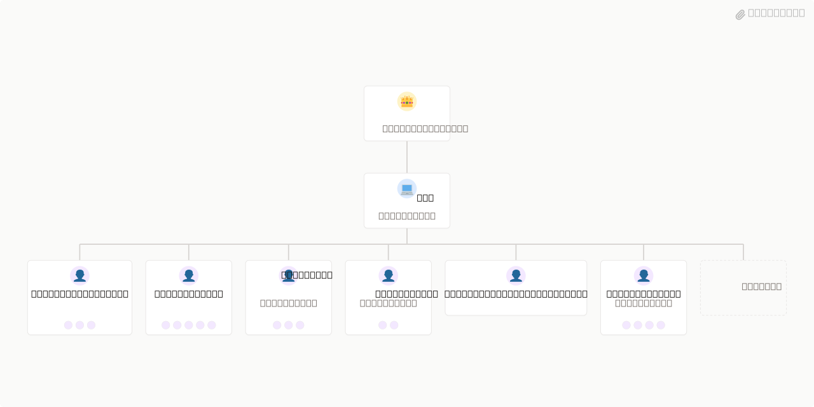

# BitBuilder Cloud



## What's Inside

> This is an [Agent Company](https://agentcompanies.io) package from [Paperclip](https://paperclip.ing)

| Content | Count |
|---------|-------|
| Agents | 49 |
| Projects | 1 |
| Skills | 90 |
| Tasks | 2 |

### Agents

| Agent | Role | Reports To |
|-------|------|------------|
| AI Engineer | Agent | data-lead |
| Angular Engineer | Agent | frontend-lead |
| API Engineer | Agent | architecture-lead |
| Architecture Lead | Agent | cto |
| Atlassian Engineer | Agent | platform-lead |
| Backend Lead | Agent | cto |
| CEO | Agent | — |
| Cloud Engineer | Agent | infrastructure-lead |
| Code Quality Specialist | Agent | qa-lead |
| CTO | Agent | ceo |
| Data Engineer | Agent | data-lead |
| Data Lead | Agent | cto |
| Database Engineer | Agent | infrastructure-lead |
| DevOps Engineer | Agent | devops-lead |
| DevOps Lead | Agent | cto |
| Distributed Systems Engineer | Agent | architecture-lead |
| E-Commerce Engineer | Agent | platform-lead |
| Embedded Systems Engineer | Agent | cto |
| Enterprise Backend Engineer | Agent | backend-lead |
| Frontend Lead | Agent | cto |
| Game Developer | Agent | cto |
| Go Engineer | Agent | language-engineering-lead |
| Infrastructure Lead | Agent | cto |
| JVM Engineer | Agent | language-engineering-lead |
| Kubernetes Engineer | Agent | infrastructure-lead |
| Language Engineering Lead | Agent | cto |
| Legacy Modernization Specialist | Agent | cto |
| MCP Engineer | Agent | architecture-lead |
| ML Engineer | Agent | data-lead |
| Mobile Engineer | Agent | frontend-lead |
| Mobile Language Engineer | Agent | language-engineering-lead |
| Node Backend Engineer | Agent | backend-lead |
| PHP Backend Engineer | Agent | backend-lead |
| Platform Lead | Agent | cto |
| Python Backend Engineer | Agent | backend-lead |
| Python Engineer | Agent | language-engineering-lead |
| QA Lead | Agent | cto |
| React Engineer | Agent | frontend-lead |
| Ruby Backend Engineer | Agent | backend-lead |
| Rust Engineer | Agent | language-engineering-lead |
| Salesforce Developer | Agent | platform-lead |
| Security Engineer | Agent | security-lead |
| Security Lead | Agent | cto |
| SRE Engineer | Agent | devops-lead |
| Systems Language Engineer | Agent | language-engineering-lead |
| Test Engineer | Agent | qa-lead |
| TypeScript Engineer | Agent | language-engineering-lead |
| Vue Engineer | Agent | frontend-lead |
| Web Language Engineer | Agent | language-engineering-lead |

### Projects

- **Snipx.sh** — # snipx

**snipx.sh · snipx.dev**

A local-first developer knowledge system. Snippets, docs, bookmarks, and interactive learning — searchable from your shell, extensible by the community, and designed to move knowledge from collection into muscle memory.

***

## The Problem

Learning is becoming increasingly difficult as the rate of technology accelerates. Every new language, framework, and CLI comes with its own DSL, schema, flags, and grammar, increasing both the surface area and cognitive burden beyond what any individual can absorb.

The instinctive response is hoarding — bookmarks, stars, open tabs — an accumulation of declarative knowledge that never converts into capability. You end up familiar with tools without having internalized them.

There are three distinct problems here, and they're worth keeping separate:

**Collection without absorption.** Recognition is cheap. Reproduction is what's missing. The gap between "I know this exists" and "I can reach for it without thinking" is enormous, and nothing in a typical developer's workflow bridges it.

**Availability with too much friction.** Even things genuinely learned are hard to reach in the moment. The retrieval cost is just high enough that you muddle through instead, and every slow retrieval is a missed chance to reinforce what you already know.

**No pipeline from syntax to muscle memory.** Reading docs doesn't build it. Bookmarking doesn't. Even using something occasionally doesn't get you there. The right kind of repetition, in context, at the right time, for developer tooling specifically — Vim motions, shell patterns, CLI flags, API idioms — doesn't exist yet.

snipx is an attempt to close that gap. v1 is a knowledge manager and retrieval tool. The longer arc is a system that moves knowledge from collection through procedural familiarity into tacit, automatic execution.

***

## Repositories

| Repo                                                          | Purpose                                                                           |
| ------------------------------------------------------------- | --------------------------------------------------------------------------------- |
| [`snipx-sh/snipx.sh`](https://github.com/snipx-sh/snipx.sh)   | Core — Tauri desktop app, HTTP API, Nushell module, dev scripts                   |
| [`snipx-sh/snipx.dev`](https://github.com/snipx-sh/snipx.dev) | Web app — the hosted interface, deployed on Cloudflare                            |
| [`snipx-sh/snipx`](https://github.com/snipx-sh/snipx)         | Official knowledge base — community-maintained knowledge for tools and frameworks |

Personal content repos follow the convention `github.com/[user]/snipx` and are served automatically at `https://snipx.dev/[username]`.

***

## What snipx Is

### Desktop App + CLI

A three-pane interface — sidebar, list, detail — for managing code snippets, documentation references, and bookmarks. Tokyo Night color system. Keyboard-driven. No cloud, no account, no subscription required to use the local app.

Everything is stored in a single SQLite file at `~/.local/share/snipx/snipx.db`. Portable, backupable, exportable.

### HTTP API

A Bun + Hono API running on `localhost:7878` as a Tauri sidecar. It is the single source of truth — the desktop app, the CLI, and the Nushell module all talk to it. The app works headlessly: the API can run as a systemd user service with no GUI.

### Nushell Module

`use snipx.nu *` brings the entire library into the shell with tab-completion backed by the live API. Snippets are pipeable:

```nushell
snipx get nu-pipeline | save my-script.nu
snipx list --lang rust | where fav == true | get id | each { snipx get $in }
snipx search "axum handler"
```

### REPL

An in-app terminal panel with command history, arrow-key navigation, and the full command set: `list`, `docs`, `bookmarks`, `show`, `search`, `copy`, `fav`, `run`, `open`, `tags`, `clear`. Drag-to-resize. Toggleable via keyboard.

### snipx.dev

The web interface is served at [`https://snipx.dev`.](https://snipx.dev.) No account is required to view a public repo:

```
https://snipx.dev/danielbodnar
  → serves github.com/danielbodnar/snipx (public, read-only, anonymous)

https://snipx.dev/danielbodnar/private-knowledge
  → requires snipx.dev account + repo access grant
```

The convention assumes `[user]/snipx` as the public repo name, but authenticated users can point snipx.dev at any repo they own.

***

## The Knowledge System

A knowledge entry — `bun`, `cloudflare/containers`, `dagger` — is a directory that simultaneously satisfies multiple contracts so it works across different contexts without duplication.

### The Structure

```
[tool]/
│
│   # Claude Code skill (agentskills.io open standard)
├── SKILL.md                  # frontmatter + instructions
├── agents/                   # subagent configs: tutor.md, reviewer.md, ingest.md
├── references/               # loaded on-demand into claude context
│   ├── overview.md           # curated summary of the tool
│   ├── api.md                # key APIs, flags, schemas
│   ├── patterns.md           # idioms, anti-patterns, gotchas
│   └── grammar.md            # from tree-sitter/pest grammar where available
├── scripts/                  # executable — only output enters context, not source
│   ├── fetch-docs.ts         # fetch + curate official docs into references/
│   ├── gen-completions.nu    # generate completions from live API/CLI
│   └── validate.nu           # smoke-test the overlay
├── assets/                   # templates, starter kits, icons
│
│   # Nushell overlay (nupm-compatible module)
├── nupm.nuon                 # { name, type, version, description, license }
├── mod.nu                    # overlay entry point — export-env + re-exports
├── completions/              # custom completions, private by default
├── commands/                 # exported commands — thin wrappers + help text
├── hooks/                    # env hooks: detect project, set SNIPX_[TOOL]_*
│
│   # snipx learning unit
├── snipx.nuon                # registry manifest — extends nupm.nuon
├── snippets/                 # tagged, searchable code snippets
│   └── index.nuon            # catalog: { id, title, lang, tags, file }
├── tutorials/                # typed examples sequenced by complexity
│   └── index.nuon            # sequence metadata: { id, title, level, deps }
│
│   # MCP server (optional, generated)
└── mcp/
    └── server.ts             # exposes this tool's knowledge as MCP tools
```

No Python. Scripts are TypeScript (Bun) for anything needing HTTP or parsing, Nushell for anything shell-native or overlay-integrated.

### Contribution Tiers

Knowledge entries can be contributed at any level of completeness:

| Tier | What's included                                    | What you get                 |
| ---- | -------------------------------------------------- | ---------------------------- |
| 1    | `SKILL.md` + `references/` + `scripts/`            | Claude context for this tool |
| 2    | Tier 1 + `mod.nu` + `completions/` + `hooks/`      | Full Nushell overlay         |
| 3    | Tier 2 + `snippets/` + `tutorials/` + `snipx.nuon` | Learning unit + MCP          |

`snipx add <tool>` checks which tier is available and activates accordingly.

### The Manifest

`snipx.nuon` is what tells snipx what an entry provides:

```nuon
{
  name:        "bun"
  version:     "1.2.0"
  type:        "module"
  license:     "MIT"
  description: "Bun runtime — scripts, tests, bundler, package manager"
  topics:      ["runtime", "typescript", "bundler", "testing"]
  deps:        []
  snippets:    "snippets/index.nuon"
  tutorials:   "tutorials/index.nuon"
  skill:       "SKILL.md"
  overlay:     "mod.nu"
  mcp:         "mcp/server.ts"
  difficulty:  1
}
```

***

## Adding Knowledge

Skills follow XDG + find-up resolution. When installing, snipx walks up from the current directory looking for a git root, then decides where to place the skill based on context. Both agent conventions are supported simultaneously via symlinks.

```
# Search order (first match wins):
./.agents/skills/[tool]/          # project-local (agentskills.io)
./.claude/skills/[tool]/          # project-local (claude-code)
                                  # ... walk up to fs root
~/.agents/skills/[tool]/          # user-level
~/.claude/skills/[tool]/          # user-level claude-code
~/.snipx/skills/[tool]/           # user-level snipx canonical
```

The skill directory at any of these locations is always thin — `SKILL.md` plus symlinks back to `~/.snipx/packages/[tool]/`. Content lives in exactly one place.

```
# Adding knowledge:
snipx add dagger
snipx add cloudflare/containers
snipx add danielbodnar/neovim
bunx snipx@latest add dagger
bunx skills add snipx-sh/snipx --skill dagger -a claude-code -y
```

***

## File Locations

```
~/.snipx/                         # SNIPX_HOME
  packages/                       # installed package content
  skills/                         # user-level skill dirs (thin + symlinked)
  data/                           # snipx.db, vector index, cache

~/.config/snipx/                  # SNIPX_CONFIG_DIR
  config.toml                     # SNIPX_CONFIG_FILE
  mcp.json
  activations.nuon
  packages.nuon
```

Each path is independently overridable:

```
SNIPX_HOME           overrides ~/.snipx/
SNIPX_CONFIG_DIR     overrides ~/.config/snipx/
SNIPX_CONFIG_FILE    overrides ~/.config/snipx/config.toml
SNIPX_CONFIG         alias for SNIPX_CONFIG_FILE
```

***

## The Longer Arc

snipx v1 is a knowledge manager and retrieval tool. The longer arc is a system that moves knowledge from collection through to muscle memory — three additional layers that build on the foundation:

**Doc corpus ingestion.** Automatic downloading, parsing, and vectorization of official docs, API schemas, and tree-sitter grammars into a local index. This feeds search, completions, and the tutorial layer — and doubles as the training corpus for whole-file suggestions.

**Auto-generated interactive tutorials.** Extract and sequence every code example from an ingested doc corpus into a typing interface where the learner produces each example rather than reads it. Ghost text provides scaffolding. Completions take the edge off the purely mechanical parts. When you finish typing an example, snipx saves it as a tagged snippet. Learning and building the personal library happen at the same time.

**Progressive speed-run challenges.** The same tutorial content, run at increasing difficulty, stripping away scaffolding with each pass until the learner can execute from a blank file at speed with no assistance. Scoring on speed, accuracy, and scaffold usage. Applies to Vim motions, shell patterns, CLI flags, Nushell pipelines, Emmet abbreviations — anything with a learnable motor pattern.

```
Level 1 — full ghost text, unlimited completions, no time pressure
Level 2 — partial ghost text, limited completions, relaxed par time
Level 3 — first line only, no completions, normal par time
Level 4 — blank file, no hints, tight par time
Level 5 — blank file, no hints, no errors, fast par time
```

A level 5 pass means it is genuinely second nature. That is the threshold the system is working toward.

***

## Tech Stack

| Layer            | Technology                                        |
| ---------------- | ------------------------------------------------- |
| Desktop shell    | Tauri v2                                          |
| Frontend         | React 19, Vite, TypeScript strict                 |
| Styling          | Inline styles, Tokyo Night palette                |
| API server       | Bun + Hono                                        |
| Validation       | Zod                                               |
| Database         | SQLite (`bun:sqlite`)                             |
| CLI / shell      | Nushell module (`snipx.nu`)                       |
| Package format   | nupm-compatible (`nupm.nuon` + `mod.nu`)          |
| Skill format     | agentskills.io open standard (`SKILL.md`)         |
| Web hosting      | Cloudflare (Pages, Workers, R2, KV)               |
| Content sync     | Cloudflare R2 + user GitHub repos                 |
| Package registry | `github.com/snipx-sh/snipx` + `bunx snipx@latest` |

***

## Philosophy

**Sane Defaults.** Be thin glue. Align with the upstream platform. Never compete with it. Data lives in native formats. The app is a viewer and organizer, not a walled garden.

**Local-first.** Everything works offline. The API is `127.0.0.1` only. No telemetry. No account required for the desktop app or the CLI.

**Files as the interface.** References, snippets, tutorials, overlays, skill manifests — everything is a file. Vectorizable, searchable, git-trackable, R2-syncable, human-readable without tooling.

**Compounding knowledge.** Some knowledge makes other knowledge cheaper to acquire. The package dependency graph (`deps` in `snipx.nuon`) encodes this — learning Nushell before jq, Unix pipes before Docker, touch typing before Vim. The order matters.

***

## Contributing

Knowledge entries live in [`snipx-sh/snipx`](https://github.com/snipx-sh/snipx) — or in your own `github.com/[user]/snipx`. Any tier of contribution is welcome. A well-curated `references/` and a good `SKILL.md` is already useful. A full tier-3 entry with tutorials and speed runs is the goal.

***

*snipx.sh · snipx.dev · MIT*

### Skills

| Skill | Description | Source |
|-------|-------------|--------|
| agents-sdk | Build AI agents on Cloudflare Workers using the Agents SDK. Load when creating stateful agents, durable workflows, real-time WebSocket apps, scheduled tasks, MCP servers, chat applications, voice agents, or browser automation. Covers Agent class, state management, callable RPC, Workflows, durable execution, queues, retries, observability, and React hooks. Biases towards retrieval from Cloudflare docs over pre-trained knowledge. | [github](https://github.com/cloudflare/skills) |
| cloudflare-email-service | Send and receive transactional emails with Cloudflare Email Service (Email Sending + Email Routing). Use when building email sending (Workers binding or REST API), email routing, Agents SDK email handling, or integrating email into any app — Workers, Node.js, Python, Go, etc. Also use for email deliverability, SPF/DKIM/DMARC, wrangler email setup, MCP email tools, or when a coding agent needs to send emails. Even for simple requests like "add email to my Worker" — this skill has critical config details. | [github](https://github.com/cloudflare/skills) |
| cloudflare-one-migrations | Plans migrations from Zscaler ZIA/ZPA, Palo Alto, legacy VPN, SWG, or SASE stacks to Cloudflare One. Use for migration assessments, policy mapping, rollout plans, and parity/gap analysis. | [github](https://github.com/cloudflare/skills) |
| cloudflare-one | Guides Cloudflare One Zero Trust and SASE work across Access, Gateway, WARP, Tunnel, Cloudflare WAN, DLP, CASB, device posture, and identity. Use when designing, configuring, troubleshooting, or reviewing Cloudflare One deployments. Retrieval-first: use current Cloudflare docs/API schemas instead of embedded product docs. | [github](https://github.com/cloudflare/skills) |
| cloudflare | Comprehensive Cloudflare platform skill covering Workers, Pages, storage (KV, D1, R2), AI (Workers AI, Vectorize, Agents SDK), feature flags (Flagship), networking (Tunnel, Spectrum), security (WAF, DDoS), and infrastructure-as-code (Terraform, Pulumi). Use for any Cloudflare development task. Biases towards retrieval from Cloudflare docs over pre-trained knowledge. | [github](https://github.com/cloudflare/skills) |
| durable-objects | Create and review Cloudflare Durable Objects. Use when building stateful coordination (chat rooms, multiplayer games, booking systems), implementing RPC methods, SQLite storage, alarms, WebSockets, or reviewing DO code for best practices. Covers Workers integration, wrangler config, and testing with Vitest. Biases towards retrieval from Cloudflare docs over pre-trained knowledge. | [github](https://github.com/cloudflare/skills) |
| sandbox-sdk | Build sandboxed applications for secure code execution. Load when building AI code execution, code interpreters, CI/CD systems, interactive dev environments, or executing untrusted code. Covers Sandbox SDK lifecycle, commands, files, code interpreter, and preview URLs. Biases towards retrieval from Cloudflare docs over pre-trained knowledge. | [github](https://github.com/cloudflare/skills) |
| agents-sdk Fork | Build AI agents on Cloudflare Workers using the Agents SDK. Load when creating stateful agents, durable workflows, real-time WebSocket apps, scheduled tasks, MCP servers, chat applications, voice agents, or browser automation. Covers Agent class, state management, callable RPC, Workflows, durable execution, queues, retries, observability, and React hooks. Biases towards retrieval from Cloudflare docs over pre-trained knowledge. | catalog |
| angular-architect | Generates Angular 17+ standalone components, configures advanced routing with lazy loading and guards, implements NgRx state management, applies RxJS patterns, and optimizes bundle performance. | [github](https://github.com/jeffallan/claude-skills/tree/3bf9a24b76a7c122f1fc05e83929fbc84e1c207a/skills/angular-architect/SKILL.md) |
| api-designer | Designs REST or GraphQL APIs, creates OpenAPI specifications, and plans API architecture including resource modeling, versioning strategies, pagination patterns, and error handling standards. | [github](https://github.com/jeffallan/claude-skills/tree/3bf9a24b76a7c122f1fc05e83929fbc84e1c207a/skills/api-designer/SKILL.md) |
| architecture-designer | Designs high-level system architecture, reviews existing designs, makes architectural decisions, creates architecture diagrams, writes ADRs, evaluates technology trade-offs, and plans for scalability. | [github](https://github.com/jeffallan/claude-skills/tree/3bf9a24b76a7c122f1fc05e83929fbc84e1c207a/skills/architecture-designer/SKILL.md) |
| atlassian-mcp | Integrates with Atlassian products to manage project tracking and documentation via MCP protocol, including Jira issue management, Confluence page editing, sprint and backlog management. | [github](https://github.com/jeffallan/claude-skills/tree/3bf9a24b76a7c122f1fc05e83929fbc84e1c207a/skills/atlassian-mcp/SKILL.md) |
| chaos-engineer | Designs chaos experiments, creates failure injection frameworks, and facilitates game day exercises for distributed systems with runbooks, experiment manifests, and rollback procedures. | [github](https://github.com/jeffallan/claude-skills/tree/3bf9a24b76a7c122f1fc05e83929fbc84e1c207a/skills/chaos-engineer/SKILL.md) |
| cli-developer | Builds CLI tools with argument parsing, interactive prompts, progress bars, spinners, and shell completion scripts using commander, click, typer, or cobra. | [github](https://github.com/jeffallan/claude-skills/tree/3bf9a24b76a7c122f1fc05e83929fbc84e1c207a/skills/cli-developer/SKILL.md) |
| cloud-architect | Designs cloud architectures, creates migration plans, generates cost optimization recommendations, and produces disaster recovery strategies across AWS, Azure, and GCP. | [github](https://github.com/jeffallan/claude-skills/tree/3bf9a24b76a7c122f1fc05e83929fbc84e1c207a/skills/cloud-architect/SKILL.md) |
| code-documenter | Generates and validates technical documentation including docstrings, OpenAPI/Swagger specs, JSDoc annotations, doc portals, and user guides. | [github](https://github.com/jeffallan/claude-skills/tree/3bf9a24b76a7c122f1fc05e83929fbc84e1c207a/skills/code-documenter/SKILL.md) |
| code-reviewer | Analyzes code diffs and files to identify bugs, security vulnerabilities, code smells, and architectural concerns, then produces a structured review report with prioritized, actionable feedback. | [github](https://github.com/jeffallan/claude-skills/tree/3bf9a24b76a7c122f1fc05e83929fbc84e1c207a/skills/code-reviewer/SKILL.md) |
| cpp-pro | Writes, optimizes, and debugs C++ applications using modern C++20/23 features, template metaprogramming, and high-performance systems techniques. | [github](https://github.com/jeffallan/claude-skills/tree/3bf9a24b76a7c122f1fc05e83929fbc84e1c207a/skills/cpp-pro/SKILL.md) |
| csharp-developer | Builds C# applications with .NET 8+, ASP.NET Core APIs, Blazor web apps, Entity Framework Core, async patterns, and CQRS via MediatR. | [github](https://github.com/jeffallan/claude-skills/tree/3bf9a24b76a7c122f1fc05e83929fbc84e1c207a/skills/csharp-developer/SKILL.md) |
| database-optimizer | Optimizes database queries and improves performance across PostgreSQL and MySQL systems including index design, query rewrites, configuration tuning, and partitioning strategies. | [github](https://github.com/jeffallan/claude-skills/tree/3bf9a24b76a7c122f1fc05e83929fbc84e1c207a/skills/database-optimizer/SKILL.md) |
| debugging-wizard | Parses error messages, traces execution flow through stack traces, correlates log entries, and applies systematic hypothesis-driven methodology to isolate and resolve bugs. | [github](https://github.com/jeffallan/claude-skills/tree/3bf9a24b76a7c122f1fc05e83929fbc84e1c207a/skills/debugging-wizard/SKILL.md) |
| devops-engineer | Creates Dockerfiles, configures CI/CD pipelines, writes Kubernetes manifests, and generates Terraform/Pulumi infrastructure templates for deployment automation and GitOps. | [github](https://github.com/jeffallan/claude-skills/tree/3bf9a24b76a7c122f1fc05e83929fbc84e1c207a/skills/devops-engineer/SKILL.md) |
| django-expert | Builds Django web applications and REST APIs with Django REST Framework, creates models with proper indexes, optimizes ORM queries, and configures JWT authentication. | [github](https://github.com/jeffallan/claude-skills/tree/3bf9a24b76a7c122f1fc05e83929fbc84e1c207a/skills/django-expert/SKILL.md) |
| dotnet-core-expert | Builds .NET 8 applications with minimal APIs, clean architecture, cloud-native microservices, Entity Framework Core, CQRS with MediatR, and AOT compilation. | [github](https://github.com/jeffallan/claude-skills/tree/3bf9a24b76a7c122f1fc05e83929fbc84e1c207a/skills/dotnet-core-expert/SKILL.md) |
| embedded-systems | Develops firmware for microcontrollers, implements RTOS applications, optimizes power consumption for STM32, ESP32, FreeRTOS, and bare-metal systems. | [github](https://github.com/jeffallan/claude-skills/tree/3bf9a24b76a7c122f1fc05e83929fbc84e1c207a/skills/embedded-systems/SKILL.md) |
| fastapi-expert | Builds high-performance async Python APIs with FastAPI and Pydantic V2 including REST endpoints, authentication flows, async SQLAlchemy, and WebSocket endpoints. | [github](https://github.com/jeffallan/claude-skills/tree/3bf9a24b76a7c122f1fc05e83929fbc84e1c207a/skills/fastapi-expert/SKILL.md) |
| feature-forge | Conducts structured requirements workshops to produce feature specifications, user stories, EARS-format functional requirements, acceptance criteria, and implementation checklists. | [github](https://github.com/jeffallan/claude-skills/tree/3bf9a24b76a7c122f1fc05e83929fbc84e1c207a/skills/feature-forge/SKILL.md) |
| fine-tuning-expert | Fine-tunes LLMs and trains custom models using LoRA/QLoRA adapters, JSONL training datasets, hyperparameter configuration, RLHF, DPO, and model quantization. | [github](https://github.com/jeffallan/claude-skills/tree/3bf9a24b76a7c122f1fc05e83929fbc84e1c207a/skills/fine-tuning-expert/SKILL.md) |
| flutter-expert | Builds cross-platform applications with Flutter 3+ and Dart including widget development, Riverpod/Bloc state management, GoRouter navigation, and platform-specific implementations. | [github](https://github.com/jeffallan/claude-skills/tree/3bf9a24b76a7c122f1fc05e83929fbc84e1c207a/skills/flutter-expert/SKILL.md) |
| fullstack-guardian | Builds security-focused full-stack web applications with integrated frontend and backend components implementing layered security including auth, validation, encoding, and parameterized queries. | [github](https://github.com/jeffallan/claude-skills/tree/3bf9a24b76a7c122f1fc05e83929fbc84e1c207a/skills/fullstack-guardian/SKILL.md) |
| game-developer | Builds game systems with Unity/Unreal Engine, implements ECS architecture, configures physics and multiplayer networking, optimizes frame rates, and develops shaders. | [github](https://github.com/jeffallan/claude-skills/tree/3bf9a24b76a7c122f1fc05e83929fbc84e1c207a/skills/game-developer/SKILL.md) |
| golang-pro | Implements concurrent Go patterns using goroutines and channels, designs microservices with gRPC or REST, optimizes performance with pprof, and enforces idiomatic Go. | [github](https://github.com/jeffallan/claude-skills/tree/3bf9a24b76a7c122f1fc05e83929fbc84e1c207a/skills/golang-pro/SKILL.md) |
| graphql-architect | Designs GraphQL schemas, implements Apollo Federation, builds real-time subscriptions, and optimizes queries with DataLoader and federation directives. | [github](https://github.com/jeffallan/claude-skills/tree/3bf9a24b76a7c122f1fc05e83929fbc84e1c207a/skills/graphql-architect/SKILL.md) |
| java-architect | Builds enterprise Java applications with Spring Boot 3.x, microservices, reactive programming, WebFlux, JPA optimization, and Spring Security with OAuth2/JWT. | [github](https://github.com/jeffallan/claude-skills/tree/3bf9a24b76a7c122f1fc05e83929fbc84e1c207a/skills/java-architect/SKILL.md) |
| javascript-pro | Writes, debugs, and refactors JavaScript code using modern ES2023+ features, async/await patterns, ESM module systems, and Node.js APIs. | [github](https://github.com/jeffallan/claude-skills/tree/3bf9a24b76a7c122f1fc05e83929fbc84e1c207a/skills/javascript-pro/SKILL.md) |
| kotlin-specialist | Provides idiomatic Kotlin patterns including coroutine concurrency, Flow streams, multiplatform architecture, Compose UI, Ktor servers, and type-safe DSL design. | [github](https://github.com/jeffallan/claude-skills/tree/3bf9a24b76a7c122f1fc05e83929fbc84e1c207a/skills/kotlin-specialist/SKILL.md) |
| kubernetes-specialist | Deploys and manages Kubernetes workloads with deployment manifests, pod security policies, RBAC, Helm charts, NetworkPolicies, and multi-cluster management. | [github](https://github.com/jeffallan/claude-skills/tree/3bf9a24b76a7c122f1fc05e83929fbc84e1c207a/skills/kubernetes-specialist/SKILL.md) |
| laravel-specialist | Builds Laravel 10+ applications with Eloquent models, Sanctum authentication, Horizon queues, RESTful APIs with API resources, and Livewire reactive interfaces. | [github](https://github.com/jeffallan/claude-skills/tree/3bf9a24b76a7c122f1fc05e83929fbc84e1c207a/skills/laravel-specialist/SKILL.md) |
| legacy-modernizer | Designs incremental migration strategies using strangler fig pattern, identifies service boundaries, produces dependency maps, and generates API facade designs for aging codebases. | [github](https://github.com/jeffallan/claude-skills/tree/3bf9a24b76a7c122f1fc05e83929fbc84e1c207a/skills/legacy-modernizer/SKILL.md) |
| mcp-developer | Builds, debugs, and extends MCP servers and clients that connect AI systems with external tools and data sources via stdio/HTTP/SSE transport layers. | [github](https://github.com/jeffallan/claude-skills/tree/3bf9a24b76a7c122f1fc05e83929fbc84e1c207a/skills/mcp-developer/SKILL.md) |
| microservices-architect | Designs distributed system architectures, decomposes monoliths into bounded-context services, recommends communication patterns, and produces resilience strategies. | [github](https://github.com/jeffallan/claude-skills/tree/3bf9a24b76a7c122f1fc05e83929fbc84e1c207a/skills/microservices-architect/SKILL.md) |
| ml-pipeline | Designs production-grade ML pipeline infrastructure with experiment tracking, Kubeflow/Airflow DAGs, feature store schemas, model registries, and automated retraining workflows. | [github](https://github.com/jeffallan/claude-skills/tree/3bf9a24b76a7c122f1fc05e83929fbc84e1c207a/skills/ml-pipeline/SKILL.md) |
| monitoring-expert | Configures monitoring systems, implements structured logging, creates Prometheus/Grafana dashboards, defines alerting rules, instruments distributed tracing, and performs load testing. | [github](https://github.com/jeffallan/claude-skills/tree/3bf9a24b76a7c122f1fc05e83929fbc84e1c207a/skills/monitoring-expert/SKILL.md) |
| nestjs-expert | Creates NestJS modules, controllers, services, DTOs, guards, and interceptors for enterprise-grade TypeScript backend applications with dependency injection. | [github](https://github.com/jeffallan/claude-skills/tree/3bf9a24b76a7c122f1fc05e83929fbc84e1c207a/skills/nestjs-expert/SKILL.md) |
| nextjs-developer | Builds Next.js 14+ applications with App Router, server components, server actions, middleware, streaming SSR, and Vercel deployment. | [github](https://github.com/jeffallan/claude-skills/tree/3bf9a24b76a7c122f1fc05e83929fbc84e1c207a/skills/nextjs-developer/SKILL.md) |
| pandas-pro | Performs pandas DataFrame operations for data analysis, manipulation, transformation, time series analysis, merging, aggregation, and performance optimization. | [github](https://github.com/jeffallan/claude-skills/tree/3bf9a24b76a7c122f1fc05e83929fbc84e1c207a/skills/pandas-pro/SKILL.md) |
| php-pro | Builds PHP applications with modern PHP 8.3+ features, Laravel or Symfony frameworks, strict typing, PHPStan, async patterns with Swoole, and PSR standards. | [github](https://github.com/jeffallan/claude-skills/tree/3bf9a24b76a7c122f1fc05e83929fbc84e1c207a/skills/php-pro/SKILL.md) |
| playwright-expert | Writes E2E tests with Playwright including test scripts, page objects, test fixtures, reporters, CI integration, API mocking, and visual regression testing. | [github](https://github.com/jeffallan/claude-skills/tree/3bf9a24b76a7c122f1fc05e83929fbc84e1c207a/skills/playwright-expert/SKILL.md) |
| postgres-pro | Optimizes PostgreSQL queries, configures replication, implements advanced features including EXPLAIN analysis, JSONB operations, extension usage, and VACUUM tuning. | [github](https://github.com/jeffallan/claude-skills/tree/3bf9a24b76a7c122f1fc05e83929fbc84e1c207a/skills/postgres-pro/SKILL.md) |
| prompt-engineer | Writes, refactors, and evaluates prompts for LLMs generating optimized templates, structured output schemas, evaluation rubrics, and test suites. | [github](https://github.com/jeffallan/claude-skills/tree/3bf9a24b76a7c122f1fc05e83929fbc84e1c207a/skills/prompt-engineer/SKILL.md) |
| python-pro | Builds Python 3.11+ applications with type safety, async programming, robust error handling, mypy strict mode, pytest suites, and code validation with black and ruff. | [github](https://github.com/jeffallan/claude-skills/tree/3bf9a24b76a7c122f1fc05e83929fbc84e1c207a/skills/python-pro/SKILL.md) |
| rag-architect | Designs production-grade RAG systems with document chunking, embedding generation, vector store configuration, hybrid search pipelines, reranking, and retrieval quality evaluation. | [github](https://github.com/jeffallan/claude-skills/tree/3bf9a24b76a7c122f1fc05e83929fbc84e1c207a/skills/rag-architect/SKILL.md) |
| rails-expert | Optimizes Active Record queries, implements Turbo Frames and Streams, configures Action Cable WebSockets, sets up Sidekiq workers, and writes RSpec test suites for Rails 7+. | [github](https://github.com/jeffallan/claude-skills/tree/3bf9a24b76a7c122f1fc05e83929fbc84e1c207a/skills/rails-expert/SKILL.md) |
| react-expert | Builds React 18+ applications with components, custom hooks, Server Components, Suspense boundaries, state management, and performance optimization. | [github](https://github.com/jeffallan/claude-skills/tree/3bf9a24b76a7c122f1fc05e83929fbc84e1c207a/skills/react-expert/SKILL.md) |
| react-native-expert | Builds cross-platform mobile applications with React Native and Expo including navigation, native modules, FlatList optimization, and platform-specific code. | [github](https://github.com/jeffallan/claude-skills/tree/3bf9a24b76a7c122f1fc05e83929fbc84e1c207a/skills/react-native-expert/SKILL.md) |
| rust-engineer | Writes idiomatic Rust code with memory safety, zero-cost abstractions, ownership patterns, lifetime management, trait hierarchies, and async applications with tokio. | [github](https://github.com/jeffallan/claude-skills/tree/3bf9a24b76a7c122f1fc05e83929fbc84e1c207a/skills/rust-engineer/SKILL.md) |
| salesforce-developer | Writes Apex code, builds Lightning Web Components, optimizes SOQL queries, implements triggers, batch jobs, platform events, and Salesforce DX CI/CD pipelines. | [github](https://github.com/jeffallan/claude-skills/tree/3bf9a24b76a7c122f1fc05e83929fbc84e1c207a/skills/salesforce-developer/SKILL.md) |
| secure-code-guardian | Implements authentication/authorization, secures user input, and prevents OWASP Top 10 vulnerabilities with bcrypt/argon2, parameterized queries, CORS/CSP, and JWT tokens. | [github](https://github.com/jeffallan/claude-skills/tree/3bf9a24b76a7c122f1fc05e83929fbc84e1c207a/skills/secure-code-guardian/SKILL.md) |
| security-reviewer | Identifies security vulnerabilities, generates structured audit reports with severity ratings, and provides actionable remediation guidance for SAST, DevSecOps, and compliance. | [github](https://github.com/jeffallan/claude-skills/tree/3bf9a24b76a7c122f1fc05e83929fbc84e1c207a/skills/security-reviewer/SKILL.md) |
| shopify-expert | Builds Shopify themes, develops custom apps with OAuth and webhooks, implements Storefront API integrations, and creates checkout UI extensions and Shopify Functions. | [github](https://github.com/jeffallan/claude-skills/tree/3bf9a24b76a7c122f1fc05e83929fbc84e1c207a/skills/shopify-expert/SKILL.md) |
| spark-engineer | Writes Spark jobs, debugs performance issues, configures cluster settings for distributed data processing, DataFrame transformations, and structured streaming analytics. | [github](https://github.com/jeffallan/claude-skills/tree/3bf9a24b76a7c122f1fc05e83929fbc84e1c207a/skills/spark-engineer/SKILL.md) |
| spec-miner | Reverse-engineers specifications from existing codebases, maps code dependencies, generates API documentation from source, and identifies undocumented business logic. | [github](https://github.com/jeffallan/claude-skills/tree/3bf9a24b76a7c122f1fc05e83929fbc84e1c207a/skills/spec-miner/SKILL.md) |
| spring-boot-engineer | Generates Spring Boot 3.x configurations, creates REST controllers, implements Spring Security 6, sets up Spring Data JPA, and configures reactive WebFlux endpoints. | [github](https://github.com/jeffallan/claude-skills/tree/3bf9a24b76a7c122f1fc05e83929fbc84e1c207a/skills/spring-boot-engineer/SKILL.md) |
| sql-pro | Optimizes SQL queries, designs database schemas, troubleshoots performance with window functions, CTEs, indexing strategies, and query plan analysis across database dialects. | [github](https://github.com/jeffallan/claude-skills/tree/3bf9a24b76a7c122f1fc05e83929fbc84e1c207a/skills/sql-pro/SKILL.md) |
| sre-engineer | Defines service level objectives, creates error budget policies, designs incident response procedures, develops capacity models, and produces monitoring configurations. | [github](https://github.com/jeffallan/claude-skills/tree/3bf9a24b76a7c122f1fc05e83929fbc84e1c207a/skills/sre-engineer/SKILL.md) |
| swift-expert | Builds iOS/macOS/watchOS/tvOS applications with Swift 5.9+, SwiftUI, async/await concurrency, actors, protocol-oriented programming, and Vapor. | [github](https://github.com/jeffallan/claude-skills/tree/3bf9a24b76a7c122f1fc05e83929fbc84e1c207a/skills/swift-expert/SKILL.md) |
| terraform-engineer | Implements infrastructure as code with Terraform across AWS, Azure, or GCP including module development, state management, provider configuration, and multi-environment workflows. | [github](https://github.com/jeffallan/claude-skills/tree/3bf9a24b76a7c122f1fc05e83929fbc84e1c207a/skills/terraform-engineer/SKILL.md) |
| test-master | Generates test files, creates mocking strategies, analyzes code coverage, designs test architectures, and produces test plans across functional, performance, and security testing. | [github](https://github.com/jeffallan/claude-skills/tree/3bf9a24b76a7c122f1fc05e83929fbc84e1c207a/skills/test-master/SKILL.md) |
| the-fool | Challenges ideas, plans, decisions, and proposals using structured critical reasoning as devil's advocate, pre-mortem, red team, or evidence audit. | [github](https://github.com/jeffallan/claude-skills/tree/3bf9a24b76a7c122f1fc05e83929fbc84e1c207a/skills/the-fool/SKILL.md) |
| typescript-pro | Implements advanced TypeScript type systems with custom type guards, utility types, branded types, discriminated unions, and full-stack type safety with tRPC. | [github](https://github.com/jeffallan/claude-skills/tree/3bf9a24b76a7c122f1fc05e83929fbc84e1c207a/skills/typescript-pro/SKILL.md) |
| vue-expert-js | Creates Vue 3 components with vanilla JS composables, configures Vite projects, and sets up routing and state management using JavaScript only with JSDoc typing. | [github](https://github.com/jeffallan/claude-skills/tree/3bf9a24b76a7c122f1fc05e83929fbc84e1c207a/skills/vue-expert-js/SKILL.md) |
| vue-expert | Builds Vue 3 components with Composition API, configures Nuxt 3 SSR/SSG, sets up Pinia stores, scaffolds Quasar/Capacitor mobile apps, and implements PWA features. | [github](https://github.com/jeffallan/claude-skills/tree/3bf9a24b76a7c122f1fc05e83929fbc84e1c207a/skills/vue-expert/SKILL.md) |
| websocket-engineer | Builds real-time communication systems with WebSockets or Socket.IO including bidirectional messaging, horizontal scaling with Redis, presence tracking, and room management. | [github](https://github.com/jeffallan/claude-skills/tree/3bf9a24b76a7c122f1fc05e83929fbc84e1c207a/skills/websocket-engineer/SKILL.md) |
| wordpress-pro | Develops custom WordPress themes and plugins, creates Gutenberg blocks, configures WooCommerce stores, implements REST API endpoints, and applies security hardening. | [github](https://github.com/jeffallan/claude-skills/tree/3bf9a24b76a7c122f1fc05e83929fbc84e1c207a/skills/wordpress-pro/SKILL.md) |
| doc-maintenance | Keep project docs aligned with recent code and feature changes — detect drift, update affected pages, and add release-relevant notes without rewriting unchanged sections. | catalog |
| issue-triage | Triage Paperclip inbox issues that are stale, blocked, in-review, or assigned-but-not-progressing, and decide a single next action per issue (resume, reassign, unblock, escalate, or close). | catalog |
| task-planning | Turn a Paperclip issue or request into a structured implementation plan with child task graph, blockers, owners, and acceptance criteria, then save it as the issue `plan` document. | catalog |
| paperclip-capsules | Generate, implement, or review Paperclip capsule visuals. Use for capsule art, agent capsules, heartbeat status capsules, identicons, capsule banks, or brand-usage validation. | catalog |
| wireframe | Produce low-fidelity black-and-white UI wireframes as SVGs or viewer pages. Use when asked to wireframe, sketch a screen, draft a layout, make a low-fi mockup, or publish wireframes. | catalog |
| qa-acceptance | Produce QA acceptance criteria and a manual validation plan for a feature change — golden path, edge cases, error states, performance limits, and explicit pass/fail evidence. | catalog |
| github-pr-workflow | Prepare a GitHub pull request from a feature branch — branch hygiene, commit shape, title/body, verification notes, screenshots for UI work, and replies to review comments. | catalog |
| agent-browser | Drive a real browser to inspect or interact with a web page or app — navigate, take screenshots, read console and network, fill simple forms — for verification tasks, not unattended automation. | catalog |
| release-announcement | Write a release announcement — changelog, blog post, in-app note, or social post — that leads with user impact, names the audience, and includes upgrade/migration steps without filler. | catalog |
| design-critique | Give a structured product design critique — user job clarity, hierarchy, affordance, error states, accessibility, and consistency — focused on what to change, in what order, and why. | catalog |
| last30days | Research what people actually say about any topic in the last 30 days. Pulls posts and engagement from Reddit, X, YouTube, TikTok, Hacker News, Polymarket, GitHub, and the web. | catalog |
| paperclip-board | Manage a Paperclip company as a board member via chat. Use when the user wants onboarding, company or agent management, approvals, task monitoring, cost oversight, or work product review in the Paperclip control plane. | [github](https://github.com/paperclipai/paperclip/tree/master/skills/paperclip-board) |
| paperclip-converting-plans-to-tasks | Convert Paperclip plans into executable issue graphs. Use when asked to plan, scope, or break down Paperclip company work into assigned tasks with specialty fit, dependencies, blockers, and parallelization. | [github](https://github.com/paperclipai/paperclip/tree/master/skills/paperclip-converting-plans-to-tasks) |
| paperclip-create-agent | Create new agents in Paperclip with governance-aware hiring. Use when you need to inspect adapter configuration options, compare existing agent configs, draft a new agent prompt/config, and submit a hire request. | [github](https://github.com/paperclipai/paperclip/tree/master/skills/paperclip-create-agent) |
| paperclip | Interact with the Paperclip control plane API for task coordination and governance. Use when checking assignments, updating issue status, posting comments, delegating work, managing routines, or calling Paperclip API endpoints. | [github](https://github.com/paperclipai/paperclip/tree/master/skills/paperclip) |
| para-memory-files | Use a file-based PARA memory system to store, retrieve, and organize durable knowledge across sessions. Trigger on saving facts, daily notes, entity records, weekly synthesis, recall, tacit user patterns, or plan memory. | [github](https://github.com/paperclipai/paperclip/tree/master/skills/para-memory-files) |

## Getting Started

```bash
pnpm paperclipai company import this-github-url-or-folder
```

See [Paperclip](https://paperclip.ing) for more information.

---
Exported from [Paperclip](https://paperclip.ing) on 2026-07-23
