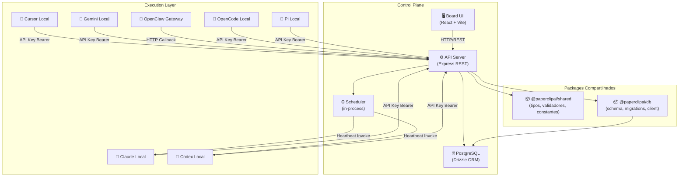
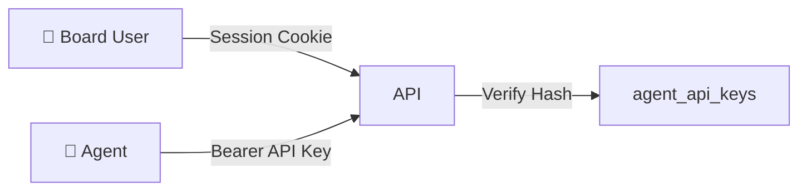

# 02 — Arquitetura Técnica

## Stack Tecnológica

| Camada | Tecnologia |
|---|---|
| **Backend** | Node.js 20+ · Express · TypeScript |
| **Frontend** | React · Vite · TypeScript |
| **Banco de Dados** | PostgreSQL (via Drizzle ORM) |
| **Monorepo** | pnpm workspaces |
| **Testes** | Vitest (unit) · Playwright (e2e) |
| **Deploy** | Docker · npm publish |

## Diagrama de Alto Nível

## Componentes Runtime

### 1. `server/` — API REST e Orquestração

Componentes principais:
- **Routes** (22 arquivos): CRUD para companies, agents, issues, goals, projects, approvals, costs, activity, dashboard, assets, plugins, secrets, health
- **Services** (57 arquivos): Lógica de negócios para heartbeat, budgets, plugins, workspace management, portabilidade de companies
- **Middleware**: Auth, CORS, logging, rate limiting
- **Adapters**: Process adapter e HTTP adapter para invocação de agents
- **Storage**: Local disk e S3 para assets
- **Secrets**: Gerenciamento criptografado de secrets por company
- **Realtime**: Eventos SSE/live

### 2. `ui/` — Interface do Board

32 páginas React incluindo:
- **Dashboard**: Visão geral com contagens e métricas
- **Companies**: CRUD e seletor global
- **Agents/AgentDetail**: Lista, criação, detalhes e estado dos agentes
- **Issues/IssueDetail**: Gerenciamento de tasks com checkout atômico
- **OrgChart**: Visualização da árvore organizacional
- **Approvals**: Fluxo de aprovação de hires e estratégias
- **Costs**: Dashboard financeiro com gastos por agente/projeto
- **Goals**: Hierarquia de metas
- **Projects**: Gerenciamento de projetos
- **Plugins**: Gerenciamento de plugins
- **Settings**: Configurações de instância e company

### 3. `packages/db/` — Schema e Migrations

- **54 arquivos de schema** Drizzle cobrindo todas as entidades
- **Migrations** versionadas
- **Client** com suporte a embedded PostgreSQL e external
- **Backup** automático com retenção configurável

### 4. `packages/shared/` — Tipos e Validadores

- Tipos TypeScript compartilhados entre server e UI
- Constantes de API paths
- Validadores (Zod ou similar)
- Config schema

### 5. `packages/adapters/` — Adapters de Agentes

7 adapters disponíveis:

| Adapter | Tipo | Descrição |
|---|---|---|
| `claude-local` | process | Claude Code rodando localmente |
| `codex-local` | process | Codex CLI local |
| `cursor-local` | process | Cursor editor local |
| `gemini-local` | process | Gemini CLI local |
| `opencode-local` | process | OpenCode local |
| `pi-local` | process | Pi local |
| `openclaw-gateway` | http | OpenClaw via webhook HTTP |

### 6. `cli/` — CLI Tool (`paperclipai`)

Comandos para:
- `run` — Bootstrap e start do servidor
- `doctor` — Health check e repair
- `onboard` — Onboarding inicial
- `configure` — Configuração interativa
- `db:backup` — Backup do banco
- `worktree` — Gerenciamento de worktrees isoladas
- `issue` — CRUD de issues via CLI
- `context set` — Perfis de contexto

### 7. Background Processing

Scheduler in-process que cuida de:
- Trigger de heartbeats por agente
- Detecção de runs travadas
- Verificação de thresholds de budget

## Data Stores

| Store | Uso |
|---|---|
| PostgreSQL (embedded PGlite) | Default dev, zero-config |
| PostgreSQL (Docker) | Dev com Postgres full |
| PostgreSQL (Supabase/hosted) | Produção |
| Local disk storage | Assets/attachments locais |
| S3-compatible | Assets/attachments em cloud |

## Auth Flow

- **Board**: Auth por session (local_trusted = implícito; authenticated = login)
- **Agents**: API keys com hash armazenado; escopo por company
