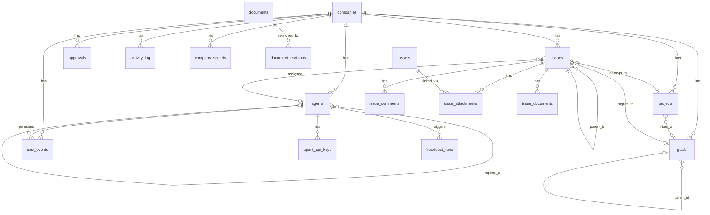

# 03 — Modelo de Dados

## Visão Geral

O Paperclip usa **PostgreSQL** via **Drizzle ORM** com 54 arquivos de schema. Todas as tabelas core incluem `id`, `created_at`, `updated_at`.

> **Invariante Global**: Toda entidade de negócio pertence a exatamente uma company.

## Diagrama Entidade-Relacionamento (Simplificado)



## Tabelas Core

### `companies`
| Coluna | Tipo | Descrição |
|---|---|---|
| `id` | uuid pk | ID único |
| `name` | text | Nome da empresa |
| `description` | text? | Descrição |
| `status` | enum | `active \| paused \| archived` |

### `agents`
| Coluna | Tipo | Descrição |
|---|---|---|
| `id` | uuid pk | ID único |
| `company_id` | uuid fk | Empresa do agente |
| `name` | text | Nome do agente |
| `role` | text | Papel (CEO, CTO, etc.) |
| `title` | text? | Título |
| `status` | enum | `active \| paused \| idle \| running \| error \| terminated` |
| `reports_to` | uuid fk? | Manager na árvore |
| `capabilities` | text? | Descrição de capacidades |
| `adapter_type` | enum | `process \| http` |
| `adapter_config` | jsonb | Config do adapter |
| `context_mode` | enum | `thin \| fat` |
| `budget_monthly_cents` | int | Orçamento mensal |
| `spent_monthly_cents` | int | Gasto mensal acumulado |
| `last_heartbeat_at` | timestamptz? | Último heartbeat |

**Invariantes**: Mesmo company que manager; sem ciclos na árvore; `terminated` é irreversível.

### `agent_api_keys`
| Coluna | Tipo | Descrição |
|---|---|---|
| `id` | uuid pk | ID |
| `agent_id` | uuid fk | Agente dono |
| `company_id` | uuid fk | Company |
| `name` | text | Nome descritivo |
| `key_hash` | text | Hash da chave (plaintext nunca armazenado) |
| `last_used_at` | timestamptz? | Último uso |
| `revoked_at` | timestamptz? | Quando revogada |

### `goals`
| Coluna | Tipo | Descrição |
|---|---|---|
| `id` | uuid pk | ID |
| `company_id` | uuid fk | Company |
| `title` | text | Título |
| `description` | text? | Descrição |
| `level` | enum | `company \| team \| agent \| task` |
| `parent_id` | uuid fk? | Goal pai |
| `owner_agent_id` | uuid fk? | Agente responsável |
| `status` | enum | `planned \| active \| achieved \| cancelled` |

### `projects`
| Coluna | Tipo | Descrição |
|---|---|---|
| `id` | uuid pk | ID |
| `company_id` | uuid fk | Company |
| `goal_id` | uuid fk? | Goal vinculada |
| `name` | text | Nome |
| `status` | enum | `backlog \| planned \| in_progress \| completed \| cancelled` |
| `lead_agent_id` | uuid fk? | Agent líder |
| `target_date` | date? | Data alvo |

### `issues` (core task entity)
| Coluna | Tipo | Descrição |
|---|---|---|
| `id` | uuid pk | ID |
| `company_id` | uuid fk | Company |
| `project_id` | uuid fk? | Projeto |
| `goal_id` | uuid fk? | Goal alinhada |
| `parent_id` | uuid fk? | Issue pai |
| `title` | text | Título |
| `status` | enum | `backlog \| todo \| in_progress \| in_review \| done \| blocked \| cancelled` |
| `priority` | enum | `critical \| high \| medium \| low` |
| `assignee_agent_id` | uuid fk? | Agente atribuído |
| `request_depth` | int | Profundidade de delegação |
| `started_at` | timestamptz? | Início |
| `completed_at` | timestamptz? | Conclusão |

**Invariantes**: Single assignee; traçar até company goal; `in_progress` requer assignee.

### `issue_comments`
| Coluna | Tipo | Descrição |
|---|---|---|
| `issue_id` | uuid fk | Issue |
| `author_agent_id` | uuid fk? | Autor (agent) |
| `author_user_id` | uuid fk? | Autor (user) |
| `body` | text | Corpo do comentário |

### `heartbeat_runs`
| Coluna | Tipo | Descrição |
|---|---|---|
| `agent_id` | uuid fk | Agente |
| `invocation_source` | enum | `scheduler \| manual \| callback` |
| `status` | enum | `queued \| running \| succeeded \| failed \| cancelled \| timed_out` |
| `error` | text? | Erro se falho |
| `context_snapshot` | jsonb? | Snapshot do contexto |

### `cost_events`
| Coluna | Tipo | Descrição |
|---|---|---|
| `agent_id` | uuid fk | Agente |
| `issue_id` | uuid fk? | Issue |
| `provider` | text | Provider (openai, anthropic, etc.) |
| `model` | text | Modelo usado |
| `input_tokens` | int | Tokens de entrada |
| `output_tokens` | int | Tokens de saída |
| `cost_cents` | int | Custo em centavos |

### `approvals`
| Coluna | Tipo | Descrição |
|---|---|---|
| `type` | enum | `hire_agent \| approve_ceo_strategy` |
| `status` | enum | `pending \| approved \| rejected \| cancelled` |
| `payload` | jsonb | Dados da solicitação |
| `decision_note` | text? | Nota da decisão |

### `activity_log`
Registro de auditoria para toda mutation.

### `company_secrets` + `company_secret_versions`
Armazenamento criptografado de secrets por company com versionamento.

### `documents` + `document_revisions` + `issue_documents`
Documentos markdown editáveis com histórico de revisões, vinculáveis a issues.

### `assets` + `issue_attachments`
Assets (arquivos) com metadata e links para issues/comments.

## Todas as Tabelas do Schema (54)

```
activity_log            agent_api_keys          agent_config_revisions
agent_runtime_state     agent_task_sessions     agent_wakeup_requests
agents                  approval_comments       approvals
assets                  auth                    budget_incidents
budget_policies         companies               company_logos
company_memberships     company_secret_versions company_secrets
cost_events             document_revisions      documents
execution_workspaces    finance_events          goals
heartbeat_run_events    heartbeat_runs          instance_settings
instance_user_roles     invites                 issue_approvals
issue_attachments       issue_comments          issue_documents
issue_labels            issue_read_states       issue_work_products
issues                  join_requests           labels
plugin_company_settings plugin_config           plugin_entities
plugin_jobs             plugin_logs             plugin_state
plugin_webhooks         plugins                 principal_permission_grants
project_goals           project_workspaces      projects
workspace_operations    workspace_runtime_services
```

## Índices Obrigatórios

- `agents(company_id, status)` / `agents(company_id, reports_to)`
- `issues(company_id, status)` / `issues(company_id, assignee_agent_id, status)` / `issues(company_id, parent_id)` / `issues(company_id, project_id)`
- `cost_events(company_id, occurred_at)` / `cost_events(company_id, agent_id, occurred_at)`
- `heartbeat_runs(company_id, agent_id, started_at desc)`
- `approvals(company_id, status, type)`
- `activity_log(company_id, created_at desc)`
- `assets(company_id, object_key)` unique
