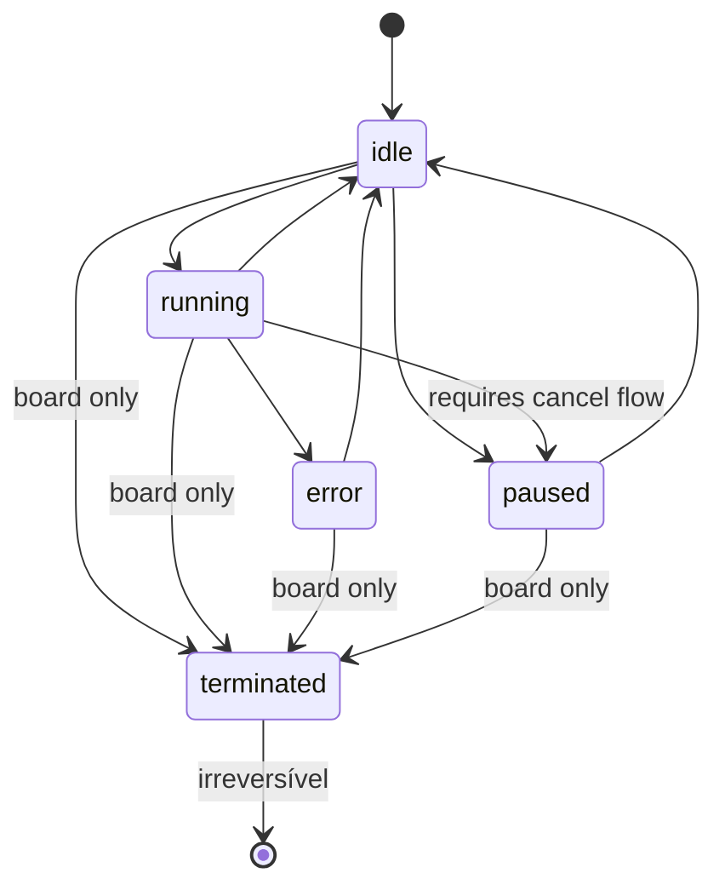
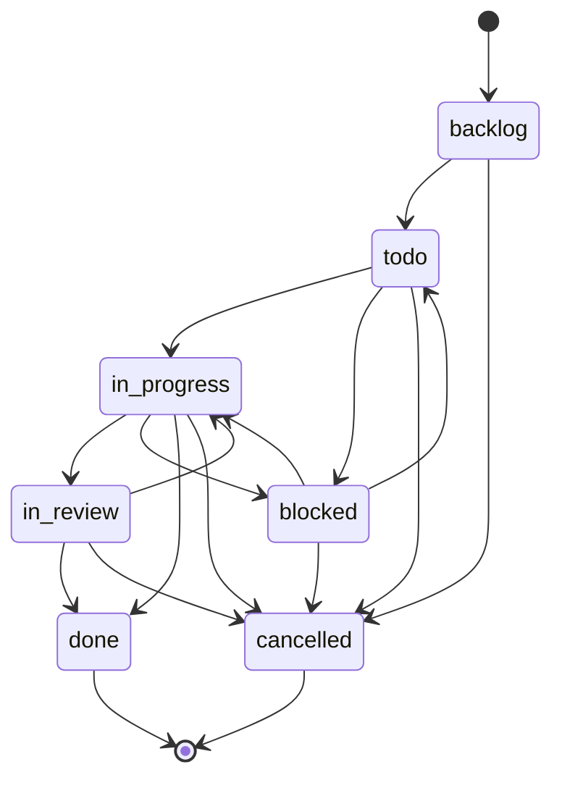
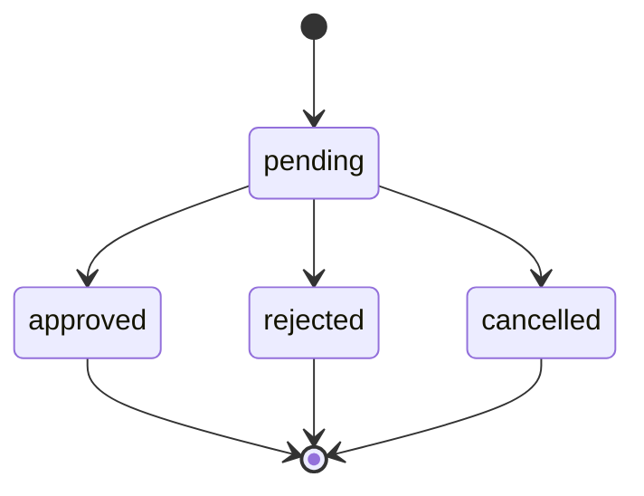
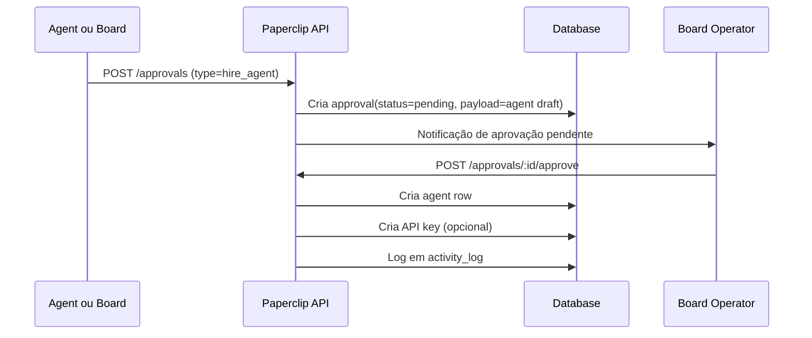
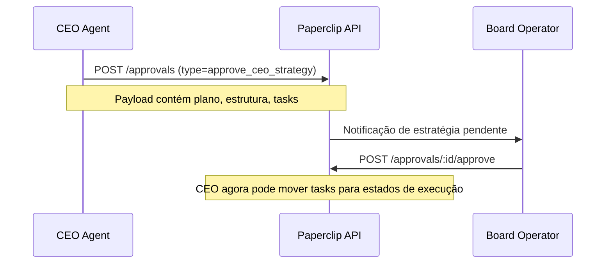
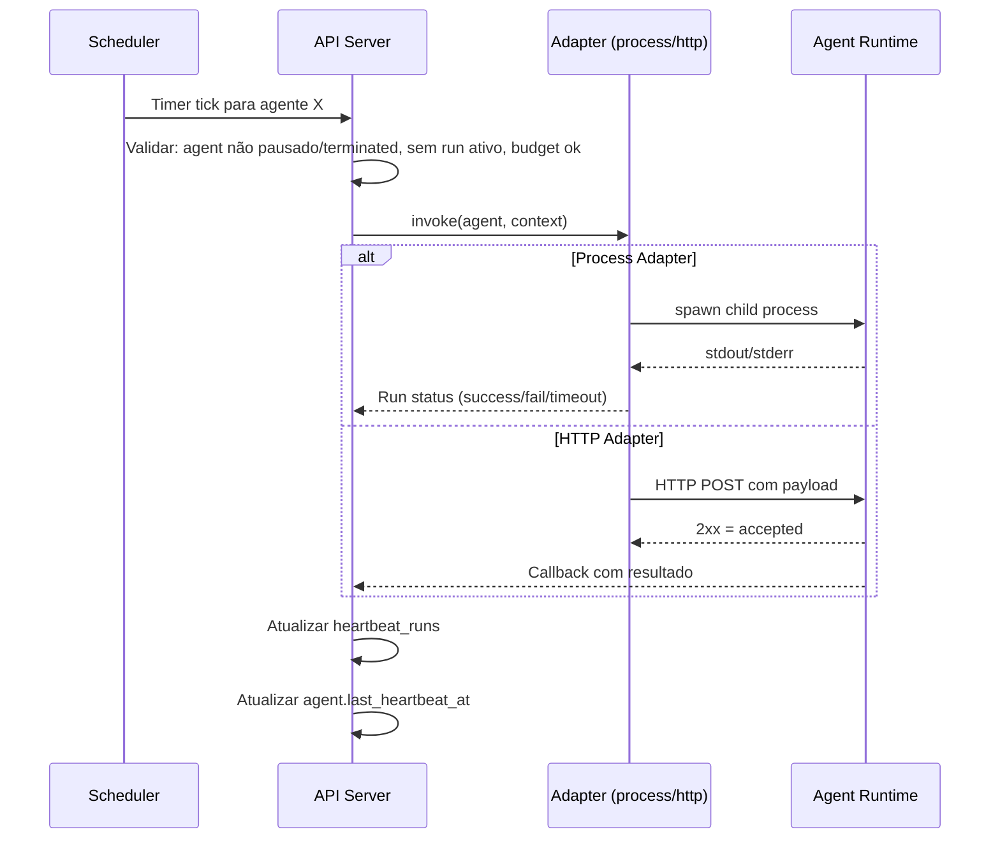
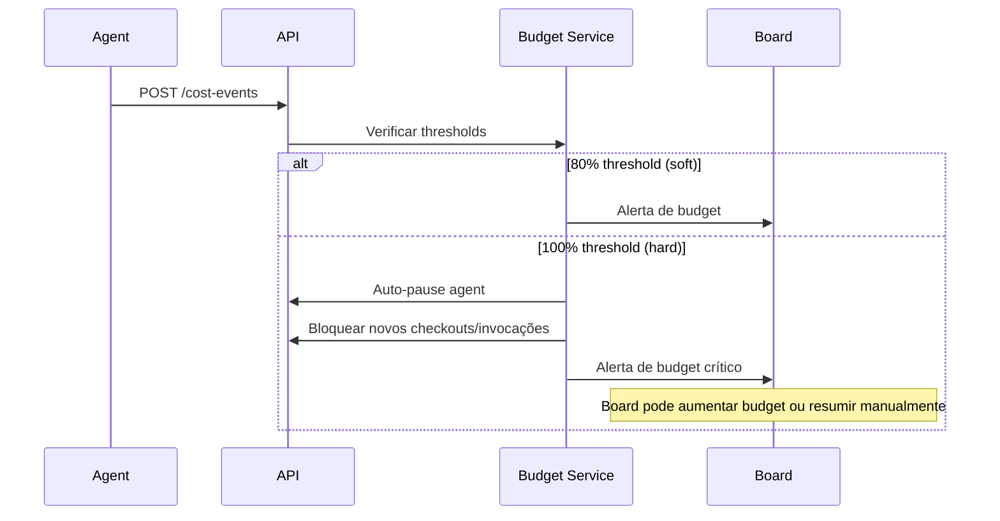
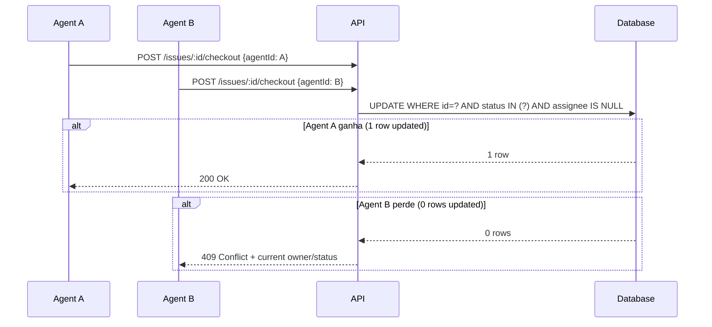

# 05 — Fluxos e Máquinas de Estado

## Máquinas de Estado

### Agent Status

### Issue Status

**Side Effects**:
- Entrar em `in_progress` → seta `started_at` (se null)
- Entrar em `done` → seta `completed_at`
- Entrar em `cancelled` → seta `cancelled_at`

### Approval Status

---

## Fluxos de Governança

### Fluxo de Hiring (Contratação de Agent)

> **Atalho**: Board pode criar agents diretamente pela UI sem passar pelo fluxo de aprovação.

### Fluxo de CEO Strategy Approval

> Antes da primeira aprovação de estratégia, o CEO só pode **rascunhar** tasks, não ativá-las.

### Fluxo de Heartbeat (Execução de Agent)

### Fluxo de Budget Enforcement

### Fluxo de Checkout Atômico

---

## Permissões (Board vs Agent)

| Ação | Board | Agent |
|---|---|---|
| Criar company | ✅ | ❌ |
| Contratar/criar agent | ✅ (direto) | Via aprovação |
| Pausar/resume agent | ✅ | ❌ |
| Criar/atualizar task | ✅ | ✅ |
| Force reassign task | ✅ | Limitado |
| Aprovar strategy/hires | ✅ | ❌ |
| Reportar custo | ✅ | ✅ |
| Definir budget company | ✅ | ❌ |
| Definir budget subordinado | ✅ | ✅ (sub-árvore) |

## Board Override Powers

O Board pode a qualquer momento:
- Pausar/resume/terminar qualquer agent
- Reassignar ou cancelar qualquer task
- Editar budgets e limites
- Aprovar/rejeitar/cancelar aprovações pendentes
