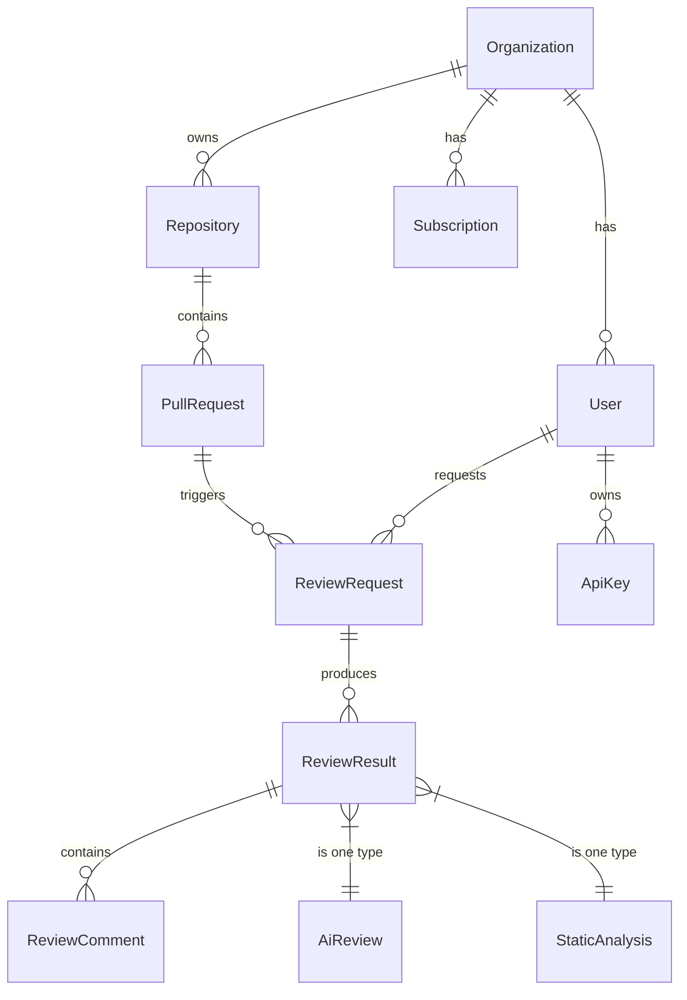

# AI Code Review Platform — Architecture

## 1. System Overview

The AI Code Review Platform is a multi-tenant SaaS that ingests pull requests/commits, runs static analysis and AI-powered reviews, and surfaces actionable feedback to developers. It is built as a set of loosely coupled services communicating over a message broker and REST/gRPC APIs.

**Tenancy model:** Isolated silo-per-org (dedicated DB schema/namespace) with shared infrastructure.

## 2. Service Design

### 2.1 Core Services

| Service | Responsibility | Tech |
|---|---|---|
| **API Gateway** | Auth, rate-limiting, request routing, TLS termination | Kong / Envoy |
| **Identity Service** | User auth (OAuth2/OIDC), org mgmt, RBAC | Go / Express + Passport |
| **Webhook Ingest** | Receive GitHub/GitLab/Bitbucket webhooks, validate, enqueue | Node.js (Fastify) |
| **Review Orchestrator** | Coordinate review pipeline: fetch diff → run analyzers → aggregate results | Node.js (Bull/BullMQ + Redis) |
| **AI Review Service** | Call LLM (GPT-4/Claude) for code review; includes prompt versioning, fallback chains, cost tracking | Python (FastAPI) |
| **Static Analysis Service** | Run linters, type-checkers, SAST tools on diff context | Node.js / isolated Docker runners |
| **Results API** | Serve review results to frontend and IDE extensions | Node.js (Fastify) |
| **Notification Service** | Send email, Slack, Discord webhooks on review complete | Node.js |
| **Billing Service** | Usage metering, subscription mgmt, Stripe integration | Node.js |
| **Admin Dashboard API** | Org settings, usage analytics, audit log | Node.js |

### 2.2 Supporting Services

| Service | Technology | Purpose |
|---|---|---|
| PostgreSQL (primary) | AWS RDS / CloudSQL | User data, orgs, review results |
| Redis | ElastiCache / Memorystore | Queue backend, rate limiting, session cache |
| S3 / GCS | Object storage | Code diffs, review artifacts, logs |
| RabbitMQ / Kafka | Message broker | Async review pipeline events |
| Prometheus + Grafana | Monitoring | Metrics dashboards, alerting |
| OpenTelemetry + Jaeger | Tracing | Distributed trace collection |

### 2.3 Communication Patterns

- **Synchronous:** REST (API Gateway ↔ Services) for user-facing operations; gRPC for high-throughput internal calls (Results API → AI Review)
- **Asynchronous:** Message queue for webhook ingestion → review pipeline → notification flow
- **Idempotency:** All state-mutating endpoints require `Idempotency-Key` header; queue consumers are idempotent by replaying dedup via Redis

## 3. Database Design

### 3.1 Data Model (Core Entities)



### 3.2 Database Technology

- **Primary DB:** PostgreSQL 16 — all transactional data
- **Caching:** Redis — session store, rate limit counters, queue state
- **Read replicas:** 2 per region for read-heavy queries (review history, dashboards)
- **Migrations:** Flyway (SQL-based, versioned, in-repo)

### 3.3 Scalability Strategy

- **Read replicas** for dashboard and historical queries
- **Table partitioning** by `organization_id` for large tables (review_results, review_comments)
- **Connection pooling** via PgBouncer sidecar per service
- **Archive policy:** Move review data > 90 days to cold storage (S3 parquet), hot data stays in PG

## 4. API Design

### 4.1 Public API (REST)

Base URL: `https://api.codereview.ai/v1`

| Method | Path | Purpose |
|---|---|---|
| POST | `/reviews` | Trigger review on a commit/PR |
| GET | `/reviews/:id` | Get review result |
| GET | `/reviews/:id/comments` | Get individual review comments |
| GET | `/repositories` | List connected repos |
| POST | `/repositories` | Connect a repository |
| GET | `/organizations/usage` | Billing usage metrics |
| GET | `/health` | Health check |
| POST | `/webhooks/github` | GitHub webhook receiver |
| POST | `/webhooks/gitlab` | GitLab webhook receiver |

### 4.2 API Contracts

- **Request validation:** JSON Schema (AJV) per endpoint
- **Response format:** Consistent envelope: `{ data, error, meta }`
- **Pagination:** Cursor-based (`?cursor=base64&limit=50`)
- **Versioning:** URL-prefix (`/v1/`); deprecation policy: 6-month overlap

### 4.3 Authentication

- **OAuth2** with GitHub App / GitLab App integration for repo access
- **API Keys** for CI/CD integration (scoped to org + read/write)
- **JWT** for user sessions (15-min access + 7-day refresh)
- **RBAC** — roles: `admin`, `developer`, `viewer`

## 5. Security Architecture

### 5.1 Network Security

- Services run in private subnets; only API Gateway and webhook endpoint are public
- WAF (CloudFront + AWS WAF) blocks OWASP Top 10 exploits
- VPC per environment (dev/staging/prod); no cross-environment peering
- Egress filtering: services call only whitelisted external endpoints (GitHub API, LLM API, Stripe)

### 5.2 Application Security

- Input validation at API Gateway and every service boundary
- CSRF tokens for browser sessions
- Rate limiting: 100 req/s per API key, 10 req/s per IP for unauthenticated
- SAST (Semgrep) and SCA (Dependabot) in CI pipeline
- Secrets via environment variable injection at deploy time — never in code or config files

### 5.3 Data Security

- All data encrypted at rest (AES-256) and in transit (TLS 1.3)
- API keys and tokens hashed with bcrypt before storage
- Source code diffs retained only for 90 days unless customer opts for extended retention
- Encryption keys managed via AWS KMS / GCP Cloud KMS with automatic rotation

## 6. AI Integration

### 6.1 Model Architecture

```
Webhook Ingest → Review Orchestrator → AI Review Service → Results API
                                        ↕
                               Prompt Template Registry
                                        ↕
                               LLM Provider (OpenAI / Anthropic)
                                        ↕
                               Fallback Chain (primary → secondary → fail-safe)
```

### 6.2 Prompt Management

- **Prompt versioning** via Git-tracked YAML files in `services/ai-review/prompts/`
- Each prompt includes: `version`, `model`, `temperature`, `max_tokens`, `template`
- Staged rollouts: canary → 10% → 50% → 100% per prompt version
- Cost tracking per model per org per review

### 6.3 Fallback Chain

1. Primary: GPT-4 (latest) — high quality, higher cost
2. Secondary: Claude 3 Opus — equivalent quality, different failure mode
3. Fail-safe: GPT-3.5 Turbo — reduced quality, always available
4. Circuit breaker: 5 consecutive failures → skip LLM, return static analysis only

### 6.4 Output Validation

- Schema validation on LLM output (expected JSON structure)
- Confidence scoring: if confidence < 0.6, flag as "suggestion" not "actionable"
- PII redaction: regex-based scan before storing or displaying

## 7. Scalability & Reliability

### 7.1 Horizontal Scaling

- All services are stateless (scale via K8s HPA based on CPU/memory/queue depth)
- API Gateway routes to least-loaded instance
- Queue consumers scale with queue backlog
- Read replicas absorb dashboard and reporting queries

### 7.2 Availability Targets

- **Uptime SLA:** 99.95% (planned downtime ~4 hrs/year)
- **Review latency p95:** < 60 seconds from webhook receipt to notification
- **AI review latency p95:** < 30 seconds (LLM inference)

### 7.3 Disaster Recovery

- Multi-region active-passive (primary us-east-1, DR us-west-2)
- RPO: 5 minutes (streaming WAL to DR region)
- RTO: 30 minutes (DNS failover + DB promote)
- Automated DR drill every quarter

## 8. Observability

### 8.1 Logging

- Structured JSON logs with correlation IDs per request
- Centralized in CloudWatch / GCP Logging
- Retention: 30 days hot, 1 year cold

### 8.2 Metrics

- RED metrics (Rate, Errors, Duration) per service
- Queue depth, DB connection pool usage, AI model latency/cost
- Dashboards in Grafana per service + org-level overview

### 8.3 Tracing

- OpenTelemetry SDK in every service
- Trace propagation via W3C trace context headers
- Sampled at 10% (100% for error traces)
- Stored in Jaeger / Grafana Tempo

## 9. CI/CD Pipeline

See [.github/workflows/ci.yml](../.github/workflows/ci.yml) and [.github/workflows/deploy.yml](../.github/workflows/deploy.yml).

### 9.1 Pipeline Stages

1. **Lint & Typecheck** — ESLint, Prettier, tsc
2. **Unit Tests** — Vitest / Pytest per service
3. **Integration Tests** — Docker Compose with test containers
4. **Security Scan** — Semgrep, Trivy (container scan), Dependabot
5. **Build & Package** — Docker image build, push to ECR/GAR
6. **Deploy to Staging** — Helm deploy to staging cluster
7. **Smoke Tests** — Health checks + critical path assertions
8. **Deploy to Production** — Gradual rollout via ArgoCD / Flux

### 9.2 Branch Strategy

- `main` — production-ready, deploys to staging automatically
- `release/*` — promotes staging → production after approval
- `feature/*` — feature branches, PR → `main`

## 10. Billing & Compliance

### 10.1 Billing

- **Metering:** Per-review and per-user seat counts tracked in Billing Service
- **Provider:** Stripe (subscriptions + usage-based billing)
- **Plans:** Free (100 reviews/mo), Pro (10k reviews/mo), Enterprise (custom)
- **Hard limits:** API rate limiting per plan tier
- **Soft limits:** Overage alert at 80% of plan quota

### 10.2 Compliance

- **SOC 2 Type II** — target within 12 months of launch
- **GDPR** — data export, deletion endpoints, DPA terms in ToS
- **Data retention** — configurable per org (default 90 days)
- **Audit log** — immutable log of all admin actions, stored 7 years

### 10.3 Privacy

- Source code diffs processed in memory only; not stored in LLM training data (per provider agreement)
- No raw code stored beyond the review window (max 90 days)
- User can request data deletion at any time via `/v1/account/deletion`
- SOC 2 / GDPR compliance built into data model from day one

## 11. Technology Stack Summary

| Layer | Technology |
|---|---|
| Runtime | Node.js 22 (primary), Python 3.12 (AI service) |
| Framework | Fastify (Node), FastAPI (Python) |
| Database | PostgreSQL 16, Redis 7 |
| Queue | BullMQ (Redis-backed) |
| Container | Docker + Kubernetes (EKS/GKE) |
| IaC | Terraform / Pulumi |
| CI/CD | GitHub Actions |
| CD | ArgoCD / Flux (GitOps) |
| Monitoring | Prometheus + Grafana + OpenTelemetry |
| AI | OpenAI + Anthropic APIs (abstracted) |
| Payments | Stripe |
| Auth | OAuth2 (GitHub App, GitLab App) + JWT |
