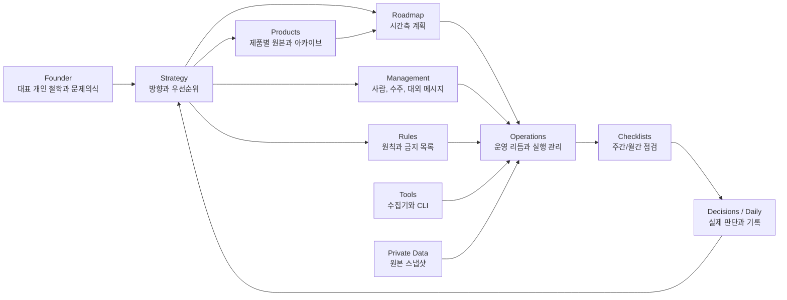

# Company Department Map

이 문서는 company repo를 `회사 운영 지침서`로 쓸 때,
각 폴더를 어떤 부서처럼 볼지와 서로 어떻게 연결되는지를 한 장으로 정리한 문서다.

핵심은 하나다.

`문서는 쌓는 것이 아니라, 누가 소유하고 어디로 넘기는지가 보여야 한다.`

## 부서 구조

### 1. Strategy

역할:

- 회사 방향
- 집중 순서
- 시장/고객 정의
- 제품 전략
- 가격 전략
- 중단 기준

질문:

- 무엇을 해야 하는가
- 무엇을 먼저 해야 하는가
- 무엇을 버려야 하는가

대표 문서:

- [../strategy/01-2026-03-tactical-priority.md](../strategy/01-2026-03-tactical-priority.md)
- [../strategy/04-north-star.md](../strategy/04-north-star.md)
- [../strategy/07-2026-execution-plan.md](../strategy/07-2026-execution-plan.md)

### 2. Products

역할:

- 제품별 원본 문서와 사업계획서 아카이브
- 제품 맥락과 현재 전략의 차이 보관

질문:

- Flotter 같은 제품 원본은 어디서 읽는가
- 현재 전략과 제품 원문이 어디서 갈리는가

대표 문서:

- [../products/flotter/03-current-product-brief.md](../products/flotter/03-current-product-brief.md)
- [../products/flotter/04-superbuilder-build-map.md](../products/flotter/04-superbuilder-build-map.md)
- [../products/flotter/05-2026-execution-plan.md](../products/flotter/05-2026-execution-plan.md)
- [../products/flotter/01-business-plan-archive.md](../products/flotter/01-business-plan-archive.md)
- [../products/flotter/02-source-pages.md](../products/flotter/02-source-pages.md)

### 3. Roadmap

역할:

- 시간축으로 풀어낸 계획
- 챕터 운영 방식
- 장기 투자 트랙

질문:

- 이번 챕터에 무엇이 달라져야 하는가
- 장기 비전을 어떻게 작은 단위로 쪼개는가

대표 문서:

- [../roadmap/01-game-investment-model.md](../roadmap/01-game-investment-model.md)
- [../roadmap/02-chapter-operating-model.md](../roadmap/02-chapter-operating-model.md)

### 4. Operations

역할:

- 대표 운영 리듬
- 팀 운영 방식
- 회의/캘린더/작업 상태
- 자금 보드와 측정 운영
- repo / Linear / Notion 운영체계

질문:

- 회사는 어떤 리듬으로 굴러가는가
- 오늘 실제로 무엇이 움직였는가

대표 문서:

- [./15-current-company-brief.md](./15-current-company-brief.md)
- [./16-source-of-truth-map.md](./16-source-of-truth-map.md)
- [./04-capital-board.md](./04-capital-board.md)
- [./08-meeting-notes-operating-model.md](./08-meeting-notes-operating-model.md)
- [./10-github-work-activity.md](./10-github-work-activity.md)
- [./11-google-calendar-operations.md](./11-google-calendar-operations.md)
- [./12-team-operating-model.md](./12-team-operating-model.md)
- [./13-company-os-linear-and-repo.md](./13-company-os-linear-and-repo.md)

### 5. Management

역할:

- HR
- 채용과 인재 운영
- 수주 판단
- 대외 메시지
- 외부 기회 관리
- 벤더/계정 레지스트리

질문:

- 누구와 일할 것인가
- 어떤 프로젝트를 받을 것인가
- 회사를 밖에 어떻게 설명할 것인가

대표 문서:

- [../management/01-hiring-post.md](../management/01-hiring-post.md)
- [../management/02-about-us.md](../management/02-about-us.md)
- [../management/06-active-opportunities.md](../management/06-active-opportunities.md)
- [../management/07-project-intake-matrix.md](../management/07-project-intake-matrix.md)
- [../management/08-hr-and-org-priority.md](../management/08-hr-and-org-priority.md)

### 6. Rules

역할:

- 운영 원칙
- 금지 목록
- 예외 허용 기준

질문:

- 무엇을 하지 않을 것인가
- 흔들릴 때 어디로 돌아갈 것인가

대표 문서:

- [../rules/01-operating-principles.md](../rules/01-operating-principles.md)
- [../rules/02-strategic-no-go.md](../rules/02-strategic-no-go.md)

### 7. Checklists

역할:

- 반복 점검
- 대표 리듬
- 월간/주간 운영 확인

질문:

- 이번 주 무엇을 끊어야 하는가
- 이번 달 숫자는 어떤가

대표 문서:

- [../checklists/01-monthly-scorecard.md](../checklists/01-monthly-scorecard.md)
- [../checklists/02-weekly-ceo-checklist.md](../checklists/02-weekly-ceo-checklist.md)

## 부서 연결 흐름

## 실무 해석

- Strategy가 방향을 정한다
- Founder가 장기 문제의식과 의미를 공급한다
- Products가 제품 원본과 맥락을 보존한다
- Roadmap이 그 방향을 챕터와 시간축으로 바꾼다
- Operations가 그걸 실제 리듬으로 굴린다
- Management가 사람, 수주, 대외 메시지를 붙인다
- Rules가 흔들릴 때 기준선이 된다
- Checklists가 매주/매달 운영을 닫아준다

## 지원 영역

### Founder

역할:

- 대표 개인의 철학과 장기 동기 보관
- 회사 전략의 출발점이 되는 개인 맥락 저장

대표 문서:

- [../founder/README.md](../founder/README.md)

### Tools

역할:

- 운영 데이터 수집
- 조회 CLI
- 자동화 보조

대표 문서:

- [../tools/README.md](../tools/README.md)

### Private Data

역할:

- 원본 스냅샷 보관
- 민감 데이터 저장

대표 문서:

- [../private-data/README.md](../private-data/README.md)

## 지금 가장 중요한 원칙

- 전략 문서를 운영 문서 대신 쓰지 않는다
- 운영 문제를 전략 논의로만 풀지 않는다
- HR 문서는 사람 이야기로 끝내지 않고 실제 배치와 연결한다
- 측정 문서는 반드시 주간 점검표와 이어지게 한다

## 한 줄 정리

이 repo는 폴더 모음이 아니라,
`부서별 책임과 연결이 보이는 회사 운영 시스템`이어야 한다.
