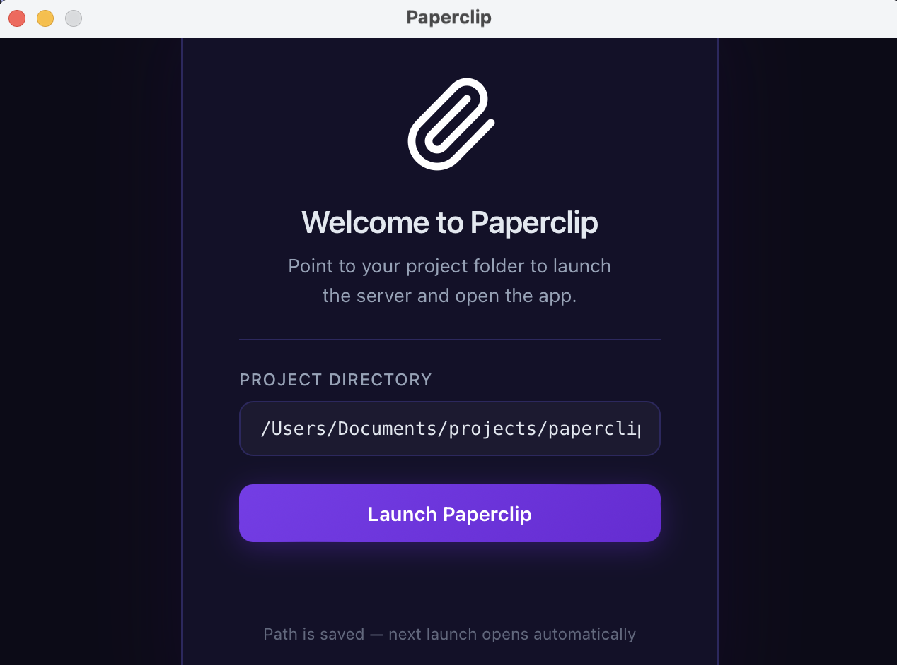

# Paperclip Desktop

A native desktop launcher for Paperclip, built with [Tauri v2](https://tauri.app/). It starts the local Paperclip server and displays the UI in a native window.

## How It Works

1. On launch, reads the saved project path. If none is found, shows a setup screen to enter one.
2. Runs `pnpm dev` in the background to start the Paperclip server.
3. Monitors stdout/stderr for a local URL, then navigates the window to the app automatically.
4. Kills the server process when the window is closed.

## Requirements

- [Rust](https://rustup.rs/) 1.75+
- [Node.js](https://nodejs.org/) 18+ (nvm recommended)
- [pnpm](https://pnpm.io/)
- macOS 10.15 (Catalina) or later

## Development

```bash
# from the desktop/ directory
pnpm dev
```

The first run will compile Rust dependencies, which may take a few minutes.

## Build

```bash
pnpm build
```

Output bundles are located in `src-tauri/target/release/bundle/`.

## Usage

### Installation

Double-click the `.dmg` file to install:

```
desktop/src-tauri/target/release/bundle/dmg/Paperclip_0.1.0_aarch64.dmg
```

Drag **Paperclip** into your Applications folder when prompted.

### First Launch

On the first run, a setup screen will appear asking for the absolute path to your Paperclip project directory. Enter the path and click **Launch Paperclip**.



The path is saved automatically — subsequent launches will start the server directly without any configuration.

### Launching the App

After the initial setup, you can open Paperclip at any time by:

- Double-clicking the **Paperclip** icon in Applications
- Using **Spotlight Search** (`Cmd+Space`) and typing `Paperclip`

## Regenerate Icons

```bash
pnpm icon
```

Converts `assets/icon.svg` into all required platform icon formats under `src-tauri/icons/`.

## Project Structure

```
desktop/
├── web/                    # Loading & setup UI (plain HTML, no build step)
│   └── index.html          # Splash screen, path config, server status
├── src-tauri/              # Tauri / Rust core
│   ├── src/
│   │   ├── lib.rs          # Server spawning, port detection, window navigation
│   │   └── main.rs         # Entry point
│   ├── icons/              # App icons
│   ├── capabilities/       # Tauri permission config
│   └── tauri.conf.json
├── assets/
│   └── icon.svg            # Icon source
└── scripts/
    └── generate-icon.mjs   # Icon generation script
```

## Configuration

The project path is persisted at:

```
~/.config/paperclip-desktop/config.json
```

Delete this file to reset to the initial setup screen.
