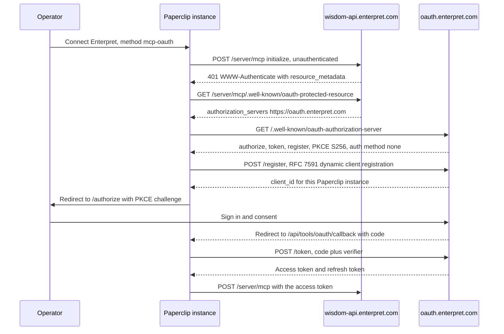

# Enterpret connection

Enterpret's hosted MCP server answers questions about an organization's customer
feedback — themes, accounts, sentiment, and verbatim quotes with citations back
to the source records.

This document follows the template in
[Connection Authoring Runbook](./CONNECTOR-PLAYBOOK.md) and records exactly what
was and was not verified.

**The connector has now been exercised against a real Enterpret account** — a
named account holder signed in through an isolated Paperclip runtime on
2026-09-25 (PAP-18538), and agent tool calls reached the live server. It still
ships unavailable — withheld from the Apps store *and* refusing setup — but now
for a reason the live test found rather than for want of testing:

> **Enterpret grants `mcp:write` against an `mcp:read` request, and omits
> `scope` from the token response, so nothing in the exchange itself says so.**
> See [Scope decision](#scope-decision). This is a release blocker.

Every other runbook scenario that a credential can reach now passes. See
[Validation Hook](#validation-hook) for the scenario-by-scenario record.

Authored against Paperclip App `fff410dfe777ae0427385e8297df992ba9aed4ce`, with
`CONNECTOR-PLAYBOOK.md` blob `5efd4cca05a1c94bb47d619833ba347f416bbbed` as the
authority. Provider metadata read 2026-09-23 and re-read unchanged 2026-09-25.
Live validation ran on App `ef1606f037a7828a7ba774949e811847c1a1d386`.

## Vendor

- App key: `enterpret`
- App name: Enterpret
- Owner: unassigned. No Paperclip maintainer currently owns an Enterpret account.
- Reuse classification: **MCP-direct**
- Reason for classification: Enterpret publishes an official hosted MCP server
  over Streamable HTTP whose authorization server is discoverable from the
  endpoint itself. No REST shim and no vendor-specific wrapper is needed; the
  tools map onto ordinary read grants.
- Security tier: **S3**
- Plugin needed? No. The provider is expressible as metadata plus a transport:
  no plugin tables, workers, webhooks, or dedicated UI.

### Why a catalog entry at all

An operator can already reach this server with no Paperclip code change, through
**Connect your own MCP server** or **Advanced → Paste a config**
([Generic remote MCP](./GENERIC-REMOTE-MCP.md)). The catalog entry adds only:
official artwork, two labelled methods with the correct client-ownership and
grant-identity shape, a reviewed scope allowlist narrower than the advertised
set, a recorded risk tier, and the provider docs link. Those are real but
incremental. Treat the generic path as the baseline, not as a lesser fallback.

## Transport And Auth

- Transport: `mcp_remote` (Streamable HTTP)
- Endpoint: `https://wisdom-api.enterpret.com/server/mcp`. The bare and
  trailing-slash forms behave identically — `401`, no redirect.
- Auth modes: **OAuth** (`mcp-oauth`) and **API key** (`mcp-api-key`). Both are
  documented by the provider.
- OAuth scopes: requested `mcp:read`. Advertised by the provider: `email`,
  `mcp:read`, `mcp:write`. See [Scope decision](#scope-decision).
- Key scope: the Enterpret auth token is generated per Enterpret organization
  and carries that organization's access. Enterpret does not document a
  restricted or read-only token variant.
- Credential owner: OAuth is user-delegated (`grantKinds: ["user"]`); the auth
  token is an organization credential (`grantKinds: ["organization"]`).
- Secret storage: `company_secrets` refs only. The definition records the header
  placement, never a value.
- Revocation behaviour: **no `revocation_endpoint` is advertised.** See
  [Revocation gap](#revocation-gap).

### Connection Flow (mandatory)



- Auth endpoints (exact paths), all read from provider metadata on 2026-09-23:
  - Authorize: `https://oauth.enterpret.com/authorize`
  - Token: `https://oauth.enterpret.com/token`
  - Registration (DCR): `https://oauth.enterpret.com/register`
  - Discovery: `https://wisdom-api.enterpret.com/server/mcp/.well-known/oauth-protected-resource`
    (RFC 9728) → `https://oauth.enterpret.com/.well-known/oauth-authorization-server`
    (RFC 8414). `https://oauth.enterpret.com/.well-known/openid-configuration`
    also resolves.
  - Also advertised: `/introspect`, `/userinfo`. `jwks_uri` points at AWS Cognito
    pool `us-east-2_kLiRrPBis`.
  - Paperclip callback: `/api/tools/oauth/callback`
- Redirect constraints: `https-or-loopback-http` in the definition. An HTTPS
  redirect URI was accepted by DCR and round-tripped through a real consent on
  2026-09-25. Whether Enterpret would also accept a loopback HTTP redirect
  remains **unprobed** — the live run used HTTPS.
- Paperclip ID / Paperclip Connect involvement: **none.** Enterpret is an
  RFC 7591 DCR provider, so registration is instance-local and Cloud and
  self-hosted use the same path. The only per-instance difference is the
  hostname inside the redirect URI.

The definition ships `serverUrl` only. A complete `authorizationEndpoint` +
`tokenEndpoint` pair would be authoritative and would suppress discovery
permanently, including endpoints a previous discovery had persisted. Discovery
resolves cleanly here — the `issuer` in the RFC 8414 document matches the issuer
used to build the URL — so there is nothing to hard-code and nothing to keep
current.

### Scope decision

The `401` challenge advertises `scope="mcp:read mcp:write"`. The definition
requests `mcp:read` alone.

Every documented tool is read-shaped, and nothing observed establishes a write
need. The narrower request is the reviewed minimum the runbook asks for.

`email` is deliberately not requested. A connector is a plane P2 resource
credential and never a sign-in authenticator ([README](./README.md)).

**The narrowing works on the request and is defeated at the grant.** Measured
2026-09-25 against the live provider:

```
Paperclip requested       scope=mcp:read           (on the authorization URL)
Enterpret token response  no `scope` parameter at all
Enterpret introspection   openid email profile mcp:read mcp:write
```

The token Paperclip holds is write-capable, and `email` — explicitly not
requested — is in the grant too. The request-side narrowing is real and still
worth having, but on its own it does **not** deliver a read-only token from this
vendor. Do not cite `scope=mcp:read` on the authorization URL as evidence of a
read-only grant.

How this was established, because the method matters for the next vendor:

- The access token is opaque, so it cannot be inspected. Enterpret advertises an
  `introspection_endpoint`, and RFC 7662 defines its `scope` field as the scope
  *of that token*.
- Negative control: a bogus token presented with the same `client_id` returned
  `{"active": false}` with **no** `scope` field. The scope is therefore bound to
  the token, not echoed back from the client registration.

Two consequences, one for this connector and one for the product:

1. **This connector.** Requesting `mcp:read` cannot be described to operators as
   obtaining read-only access to Enterpret. Until the vendor honours the
   narrowing, the honest description is "Paperclip asks for read-only; Enterpret
   issues a token that can also write", and the operator's containment control
   is Paperclip's own per-tool authorization, not the OAuth scope.
2. **The product.** Paperclip stored the grant as `["mcp:read"]`, because it
   fell back to the request when the provider omitted `scope`. RFC 6749 §5.1
   permits that omission only when the grant equals the request, so the fallback
   is the specified reading — but it means a provider that over-grants and omits
   `scope` makes Paperclip record a scope the provider never asserted. The
   widening guard runs on the request only; there is no matching check on the
   grant. Tracked as a separate blocking product change; the Enterpret entry must
   not go store-visible before it lands.

Whether to widen the request to `mcp:write` is **not** the question this raises.
Widening would change nothing about the token Enterpret issues and would only
make the request describe the over-grant. The open decision is whether Paperclip
accepts a write-capable token for a read-only connector at all.

### Revocation gap

The RFC 8414 document advertises no `revocation_endpoint` — re-read 2026-09-25
and still absent. Removing the connection in Paperclip clears local credential
material and gateway access, but there is no documented provider-side instrument
to invalidate an issued token. For the auth-token method, the equivalent action
is generating a replacement token in the Enterpret dashboard.

An `introspection_endpoint` *is* advertised, and Paperclip calls neither. That
is worth separating: introspection tells you what a token can do, which is how
the scope over-grant above was found, but it cannot take a token away.

Consequence: runbook scenario **Revoke and reconnect** cannot reach `verified`
on any deployment through a provider-side revocation call — confirmed by the
live run, not merely predicted. Local removal is testable and passes, and must
be recorded as exactly that rather than as full revocation.

**Operator instruction.** Disconnecting Enterpret in Paperclip is only half of
revoking it. The issued token stays valid at Enterpret until it expires, so the
operator must also revoke the authorization in the Enterpret dashboard as a
deliberate second step. Any runbook or teardown that omits this leaves a live
credential behind — and per the scope finding above, a write-capable one.

## Administrator Setup (mandatory)

- What the admin must register: **nothing.** Enterpret advertises RFC 7591
  dynamic client registration, so the Paperclip instance registers itself at
  connect time. No client ID, no client secret, no callback URL to pre-register.
- Where to register it: not applicable. For the auth-token method, an Enterpret
  admin generates a token at **Settings → Enterpret MCP → Generate** under
  **Auth Token**. Tokens expire six months after generation.
- Instance prerequisites: outbound HTTPS to `wisdom-api.enterpret.com` and
  `oauth.enterpret.com`. A public HTTPS base URL is **not** required — that
  applies to the Client ID Metadata Document tier only, and an instance without
  one falls through to DCR.
- How to verify the connection works: after connecting, the connection health
  and catalog check should list Enterpret's tools. `get_organization_details`
  is the narrowest read and identifies which Enterpret organization the
  credential resolves to — run that first, and confirm it is the organization
  you intended.

## Resource Filters

- Required filters: none expressible. Enterpret's MCP surface scopes every call
  to the organization behind the credential; the server documents no per-source,
  per-account, or per-workspace request parameter.
- Optional filters: none.
- Write-enabling filters: not applicable — no write action is exposed.
- Filters enforced by: **the credential itself.** The account boundary is the
  only boundary, which is why the organization a credential resolves to has to
  be confirmed at setup rather than assumed.

## Manifest

- schemaVersion: 1
- slug: `enterpret`
- name: Enterpret
- description: "Ask questions about your customer feedback and pull verbatim
  quotes with citations."
- categories: `["analytics"]`
- branding and provenance: `/brands/apps/enterpret.png`. The official Enterpret
  app icon, 256×256, retrieved 2026-09-23 from the `apple-touch-icon` linked by
  `https://www.enterpret.com/`, unmodified.
  SHA-256 `aca19ddae5f52a2caa4f3664286a76cd9439316e0fa3c39890f646536aebc522`.
  The provider's nav logo is a 120×24 light-on-dark wordmark, wrong shape for a
  square tile and unusable on a light frame; the app icon is the correct
  official mark and needs no dark variant.
- docsUrl: `https://enterpret.support.site/article/enterpret-mcp-server`
- Methods:

| | `mcp-oauth` | `mcp-api-key` |
| --- | --- | --- |
| label | Sign in with Enterpret | Use an auth token |
| transport | `mcp_remote` | `mcp_remote` |
| auth | `oauth` | `api_key` |
| ownershipModes | `["dcr"]` | `["customer"]` |
| grantKinds | `["user"]` | `["organization"]` |
| defaults | `serverUrl`, `scopesHint: ["mcp:read"]` | `serverUrl` |
| credentialFields | — | `authorization`, password, required, secret |
| keyPlacement | — | header `Authorization`, prefix `Bearer ` |
| riskTier | S3 | S3 |

  `ownershipModes` omits `customer` on the OAuth method on purpose: Enterpret
  documents no way for a customer to register their own OAuth application, and
  `ownershipModes` must reflect what the provider advertises rather than the
  `method()` helper's `["customer", "dcr"]` default.

- oauthStrategy and connectorProfile: not used. This is not a Paperclip-managed
  OAuth provider.
- capabilityProfile and variants: not needed.
- tenantFields and extensionFields: none. There is no tenant identifier to
  supply — the credential determines the organization.
- credentialSources: none. Not Vercel Connect eligible.
- configRequirements: none.
- guidanceMd, warnings, consoleLinks: see the generated definition at
  `packages/shared/src/app-definitions/enterpret.json`.
- riskTier: S3. Enterpret exposes broad content access — an organization's
  complete customer feedback corpus including verbatim quotes with speaker
  attribution. It is not S4: no payments, external sends, refunds, production
  deployment, deletion, or tenant-wide administration is documented.
- requiredResourceFilters: none, for the reason in
  [Resource Filters](#resource-filters).
- urlPatterns: `["https://wisdom-api.enterpret.com/*"]`
- setupPrerequisite: not used; the account requirement is carried in method
  warnings.
- redirectConstraints: `https-or-loopback-http` (unprobed).
- availability: `{ available: false, reason }`. Two separate guards, because
  they do different jobs. `APP_STORE_HIDDEN_SLUGS` removes the card from Browse
  but leaves the slug directly connectable by URL or slug lookup.
  `availability.available === false` is what actually refuses setup:
  `preflightGalleryAppMetadata` returns `App not found`
  (`server/src/services/tool-access.ts:16560`), and the setup flow and Browse
  both render the reason instead of a Connect action
  (`ui/src/features/connections/ConnectionSetupFlow.tsx:2857,2935,3464`,
  `ui/src/pages/apps/Browse.tsx:243`). Neither guard deletes the definition, so
  an existing connection would keep working if one existed.

## Actions

**Observed.** An authenticated `tools/list` ran against the live server on
2026-09-25 and returned **8** tools. Two corrections to the previously
documented table:

- `execute_cypher_query` is **absent** from the live server. The legacy alias is
  no longer served, so it cannot be called and does not need a policy.
- Every one of the 8 tools self-reports `readOnlyHint: true` — **including
  `run_graph_query`**. Paperclip trusts provider annotations to derive
  `riskLevel`, so a Cypher-executing tool self-certifies as `read` and lands on
  Allowed by default. That is the provider's claim, not a verified property, and
  it is exactly the case where a provider annotation should not be believed.

| Tool | Risk | Default status | Filters | Approval default | Audit fields | Negative case |
| --- | --- | --- | --- | --- | --- | --- |
| `get_organization_details` | read | active | credential org | allow | actor, run, connection, tool, outcome | ungranted actor is denied before dispatch |
| `get_graph_schema` | read | active | credential org | allow | same | same |
| `get_query_examples` | read | active | credential org | allow | same | same |
| `search_graph_fields` | read | active | credential org | allow | same | same |
| `search_graph_values` | read | active | credential org | allow | same | same |
| `run_graph_query` | **unclassified** | **deny** | credential org | deny | same, plus redacted query shape | same |
| `find_user_quote` | read | active | credential org | allow | same, plus quote redaction | same |

Legacy aliases `get_schema` and `search_knowledge_graph` remain served for the
lifetime of an existing session and are dropped when the host refreshes its tool
list. `execute_cypher_query` is no longer served at all.

`run_graph_query` stays unclassified and was held **denied** for the whole live
run. Four things say it cannot be assumed read-only: it is the rename of
`execute_cypher_query`, Cypher is not a read-only language, the advertised scope
set includes `mcp:write` — and the live run proved the issued token actually
carries `mcp:write`. Its own `readOnlyHint: true` annotation is the provider
asserting the opposite, which is not evidence. Do not infer a permission from a
tool name, and do not infer one from a self-reported annotation either.

Denial was verified on the live connection: a granted agent calling
`run_graph_query` through the gateway got **HTTP 403 `deny_default`**, and the
tool was absent from that agent's own `tools/list`.

Redaction plan: `find_user_quote` returns verbatim customer text with speaker
attribution, and `run_graph_query` can return feedback records. Neither result
should appear in an evidence artifact, a screenshot, a log, or a PR. Record tool
name, count, decision and outcome code — never payload content.

## Wizard Path

- User path (OAuth): gallery card → Connect → Enterpret consent in the browser →
  callback → access defaults.
- User path (auth token): gallery card → paste the token from
  **Settings → Enterpret MCP** → access defaults.
- Configuration steps: none beyond credentials. There is no tenant field to
  fill.
- Error states: expired auth token (six-month lifetime); an account with no
  access to the organization's feedback. A scope *rejection* turned out not to
  be one of them — Enterpret accepts the `mcp:read` request and then over-grants
  (see [Scope decision](#scope-decision)), so the flow completes and the failure
  is silent rather than visible in the wizard.
- Also observed on the live run, and not an Enterpret problem: a headless agent
  hits HTTP 409 `user_authorization_required` on this connection's `per_user`
  credential policy until the user grant is delegated to that agent.
- Redacted metadata shown: endpoint origin and path, method key, resolved
  Enterpret organization from `get_organization_details`, tool names and count.
  Never the token, the authorization code, or feedback content.

## Governance Defaults

- Default profile: the central `recommendedDefaultsForApp` — every discovered
  action enabled and Allowed. No provider-local override.
- Profile bindings: standard. Nothing Enterpret-specific.
- Policies: none added. Because `run_graph_query` is unclassified rather than
  proven read-only — and self-reports `readOnlyHint: true`, which is why it
  lands on Allowed by default — an operator connecting this provider should set
  that action to **Off** or **Ask first**. That is guidance, not a shipped
  policy, and it is guidance an operator has to apply by hand today.
- **Narrowing an install is not a containment control.** The gallery connect
  flow creates both a company install and a company-level binding of the
  `app:<connectionId>` profile. Restricting the install to named agents rewrites
  the install and adds an agent binding but leaves the company binding in place,
  which keeps authorizing every agent in the company. Installs gate runtime
  materialization; the *profile binding* is what authorizes. Containment becomes
  real only when the company binding is also removed. Verified on the live
  connection: both agents still resolved 7 allowed tools after the install was
  narrowed, and the ungranted control agent dropped to 0 of 8 only after the
  company binding was unbound.
- Quarantine rules: `quarantineNewEntries` is connection-level runtime setup,
  not an `AppDefinition` field, so this entry cannot declare it. Enterpret's
  catalog demonstrably drifts — it renamed three tools and kept the old names as
  session-scoped aliases, and `execute_cypher_query` has since disappeared
  entirely — so an operator should enable quarantine on the connection. The live
  run confirmed the default: the connection came up with
  `quarantineNewEntries: false`, so a newly advertised Enterpret tool would not
  be held for review.
- Rate limits: none set.

## Validation Hook

- Environment: an **isolated, issue-owned Paperclip runtime** on the maintainer
  host — its own `PAPERCLIP_HOME`, its own embedded Postgres, its own ports,
  reachable tailnet-only over HTTPS. It shared nothing with any other instance:
  no database, no credentials, no ports, no worktree. Torn down after the run.
- Deployment shape: **self-hosted, same machine.** Self-hosted VPS and Cloud
  remain untested, and nothing below is inferred for them.
- Method keys exercised: `mcp-oauth`. `mcp-api-key` remains untested.
- Date and tested commit: 2026-09-25, App
  `ef1606f037a7828a7ba774949e811847c1a1d386`
- Account: a named Enterpret account holder signed in personally through the
  isolated UI and consented. Paperclip never saw a password, an OTP or an
  authorization code, and no token value appears in any artifact.
- Client registration: dynamic. `registrationSource: "dcr"`, a **public** client
  (`token_endpoint_auth_method: none`, so there is no client secret). Nothing
  was pre-registered by hand.
- Provider metadata: re-read on the day of the test and unchanged from the
  2026-09-23 reading, field for field.

Unauthenticated reproduction — these need no account and are safe to re-run:

```sh
curl -s -i -X POST https://wisdom-api.enterpret.com/server/mcp \
  -H 'Content-Type: application/json' \
  -H 'Accept: application/json, text/event-stream' \
  -d '{"jsonrpc":"2.0","id":1,"method":"initialize","params":{"protocolVersion":"2025-06-18","capabilities":{},"clientInfo":{"name":"probe","version":"0"}}}'
curl -s https://wisdom-api.enterpret.com/server/mcp/.well-known/oauth-protected-resource
curl -s https://oauth.enterpret.com/.well-known/oauth-authorization-server
```

Reproducing the scope finding needs a live token. The shape of the check, with
the token withheld:

```sh
# RFC 7662. `scope` here is the scope OF THIS TOKEN, which is the only place
# the over-grant is visible: the token is opaque and the token response omitted
# `scope` entirely.
curl -s https://oauth.enterpret.com/introspect \
  -d "token=$ACCESS_TOKEN" -d "client_id=$DCR_CLIENT_ID"
# -> {"active": true, "scope": "openid email profile mcp:read mcp:write", ...}

# Negative control, same client_id, bogus token. Proves the scope is bound to
# the token rather than echoed back from the client registration.
curl -s https://oauth.enterpret.com/introspect \
  -d "token=not-a-real-token" -d "client_id=$DCR_CLIENT_ID"
# -> {"active": false, "rejection_reason": "invalid_token"}   (no `scope` field)
```

**Method note for the next connector.** Do not use
`POST /tool-connections/:id/test-calls` to show that an ungranted agent is
denied. It accepts an `agentId` and returns a `decision`, so it reads like an
agent-authorization probe, but it evaluates policy as the **board user**, which
is full-control by design. During this run it returned `decision: "allowed"` and
executed a real provider call for an agent that was denied on all 8 tools. Every
denial row below was instead produced through the real agent path: mint an agent
API key, open a gateway session, and call with the session token.

### Nine production-validation scenarios

Per deployment, self-hosted first. Cloud has no evidence of any kind and is
never inferred from a self-hosted result.

| Scenario | Self-hosted, same machine | Self-hosted, server/VPS | Cloud |
| --- | --- | --- | --- |
| Setup and consent | **pass** — account holder signed in; connection reached `active`, health `ok` | not run | not run — no Cloud instance |
| Authentication | **pass** — DCR public client registered against the live provider; token exchange succeeded | not run | not run |
| Catalog and configuration | **pass** — authenticated `tools/list` returned 8 tools; `execute_cypher_query` absent | not run | not run |
| Allowed execution | **pass** — `get_organization_details` resolved to the intended organization; one further bounded metadata read also succeeded | not run | not run |
| Denied execution | **pass** — ungranted agent got HTTP 403 `deny_default` and saw 0 tools; `run_graph_query` stayed 403 for the *granted* agent | not run | not run |
| Runtime delivery | **pass, with a caveat** — a headless agent on a `per_user` OAuth connection needs an explicit grant delegation; see below | not run | not run |
| Refresh and recovery | **not run** — refresh deliberately not exercised once the scope over-grant was found | not run | not run |
| Revoke and reconnect | **cannot pass** — no `revocation_endpoint` exists to call. Local disable verified: the connection was disabled and the gateway decision flips to deny | cannot pass — structural, not deployment-dependent | cannot pass |
| Activity and secret handling | **pass** — invocations audited with correct decisions and actor attribution; tokens AES-256-GCM at rest with no plaintext in secret storage; API returns `secretId` references only | not run | not run |
| **Granted scope** | **FAIL** — `mcp:write` granted against an `mcp:read` request. Release blocker | fails identically — provider-side, not deployment-dependent | fails identically |

Self-hosted VPS and Cloud are `not run`, not "probably fine". Nothing in the
same-machine column is carried across, and nothing here is carried over from the
PAP-18519 loopback mirror either.

Two further findings from the run, recorded because they change how an operator
should read this connector rather than what it does:

- **`per_user` credential policy blocks unattended agents.** A headless run has
  no acting user, so a `kind: user` grant yields HTTP 409
  `user_authorization_required`. The minimal fix is a delegation of that one
  grant to that one agent — narrower than promoting to an organization grant,
  and it widens nothing at the provider. The delegation path additionally
  requires the run's `invocationSource` to be `automation` or `timer`; an
  `on_demand` run stays 409. Note `credentialPolicy: per_user` is a runtime
  default here, not something this definition pins.
- **Tool results are persisted close to verbatim.** `result_summary` on an
  invocation stores the provider response body with an empty `redactedFields`.
  It stays in the instance database, but for Enterpret that means a
  `find_user_quote` result would write customer feedback text into the run log.
  `find_user_quote` was deliberately **not** called during validation.

### Deployment support matrix

Labels as defined in the connector skills' shared matrix.

| Capability | Self-hosted, same machine | Self-hosted, server/VPS | Cloud |
| --- | --- | --- | --- |
| Definition generates, validates and typechecks | `verified` | `verified` | `verified` — the checks are deployment-independent |
| Official branding passes the artwork checks | `verified` | `verified` | `verified` |
| Provider metadata discovery resolves (RFC 9728 → 8414) | `verified` against the provider, from this runtime | `verified` — same request, no deployment dependency | `untested` |
| Paperclip's discovery ladder resolves this shape | `verified` against the live provider | `untested` | `untested` |
| DCR client registration | `verified` — public client registered at connect time, nothing pre-registered | `untested` | `untested` |
| OAuth consent and token exchange | `verified` | `untested` | `untested` |
| Auth-token (header) connection | `untested` — the OAuth method was the one validated | `untested` | `untested` |
| Authenticated `tools/list` | `verified` — 8 tools, all self-annotated `readOnlyHint: true` | `untested` | `untested` |
| Agent execution through the gateway | `verified` — allowed and denied paths both exercised through a real agent session | `untested` | `untested` |
| Granted scope matches the requested scope | **`failed`** — `mcp:write` and `email` granted against an `mcp:read` request | `failed` — provider-side | `failed` — provider-side |
| Provider-side revocation | `unsupported` — the authorization server advertises no `revocation_endpoint` | `unsupported` | `unsupported` |
| Store visibility | `deferred` — withheld until the scope over-grant is resolved | `deferred` | `deferred` |

### What must happen before this is store-visible

Steps 1–3 below are **done** as of 2026-09-25 and are kept for the record. Steps
4 onward are what remains.

1. ~~An authorized Enterpret organization credential, held by a named owner.~~
   **Done** — a named account holder signed in personally.
2. ~~An authenticated `tools/list`, to replace the documented tool table with an
   observed one and to classify `run_graph_query`.~~ **Done** — 8 tools
   observed. `run_graph_query` is still not classifiable: its only annotation is
   the provider's own `readOnlyHint: true`, which the live evidence gives no
   reason to trust.
3. ~~Authorization to attempt DCR against `oauth.enterpret.com`.~~ **Done** —
   DCR succeeded; a public client, no pre-registration needed.
4. **The scope over-grant resolved.** This is the blocker. Three things have to
   happen, in this order:
   - The product change that stops recording a requested scope as the granted
     one must land, so an over-grant is at least visible rather than silently
     rewritten into a read-only-looking record. Tracked separately from this PR
     because it changes the shared OAuth completion path for every connector.
   - A reviewed decision on whether Paperclip ships a read-only connector whose
     provider issues a write-capable token, and what it tells operators if so.
   - Enterpret contacted about honouring `mcp:read`, or the limitation accepted
     and documented at the point of connection rather than only here.
5. Refresh and recovery exercised, which this run deliberately stopped short of.
6. `mcp-api-key` validated, or the method dropped from the definition.
7. Self-hosted VPS evidence, if the entry is to claim that deployment.
8. Clear `availability` in the Enterpret tuple in
   `scripts/ingest-app-definitions.mjs`, remove `"enterpret"` from
   `APP_STORE_HIDDEN_SLUGS` in `packages/shared/src/app-definitions.ts` and from
   the sorted list in `packages/shared/src/app-definitions.test.ts`, set
   `catalogVisible: true` in `ui/public/brands/apps/manifest.json`, drop the two
   `availability` assertions from the focused test, and bump the
   `APP_STORE_DEFINITIONS` length assertion by one (56 at the time of writing —
   read the current value rather than trusting this number).

Step 4 is a product and vendor decision, not engineering work on this entry.
Steps 5–7 are testing. Step 8 is the only mechanical change, and it must be last.
