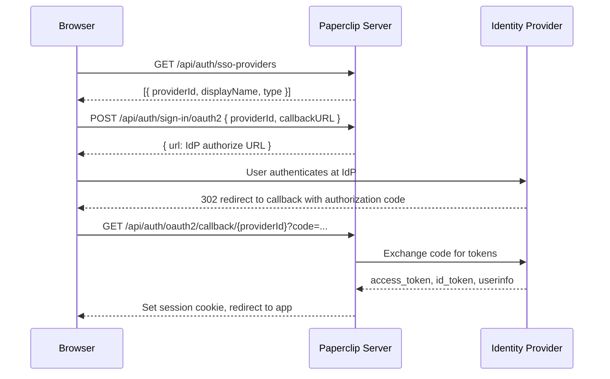

# Universal SSO / OIDC Support for Paperclip

Status: Implemented  
Date: 2026-04-07  
Owners: Server + UI + Shared + Docker

## 1. Context

Paperclip uses **Better Auth** for human authentication in `authenticated` deployment mode. Prior to this feature, only email/password sign-in was supported. The DB `account` table already stores OAuth-compatible fields (`provider_id`, `access_token`, `refresh_token`, `id_token`, `scope`). The [humans-and-permissions plan](2026-02-21-humans-and-permissions.md) explicitly calls out: *"keep implementation structured so social/SSO providers can be added later."*

Better Auth ships a [`genericOAuth` plugin](https://better-auth.com/docs/plugins/generic-oauth) that supports OAuth 2.0 / OIDC with pre-configured adapters for Keycloak, Auth0, Okta, Microsoft Entra ID, and a generic `discoveryUrl` path for any compliant IdP.

This plan adds universal SSO/OIDC support via configuration-only setup. Operators can connect any supported identity provider without code changes.

## 2. Design Decisions

| Topic | Decision |
|---|---|
| Activation scope | SSO is only active when `deploymentMode` is `authenticated`; ignored in `local_trusted` |
| Configuration surface | Env var (`PAPERCLIP_SSO_PROVIDERS`) or config file (`auth.ssoProviders`) |
| Supported provider types | `keycloak`, `auth0`, `okta`, `microsoft_entra_id`, `oidc` (generic) |
| Multiple providers | Supported; each renders as a separate button on the sign-in page |
| Account linking | Automatic by email match when SSO identity matches an existing email/password account |
| DB migration | None required; existing `account` table has all needed columns |
| SSO on sign-up page | No; SSO buttons appear only on sign-in |
| Actor model impact | None; SSO users receive the same `board` actor type as email/password users |

## 3. Architecture



## 4. Changes by Layer

### 4.1 Shared Types and Validation

**File:** `packages/shared/src/config-schema.ts`

- `SSO_PROVIDER_TYPES` constant: `["keycloak", "auth0", "okta", "microsoft_entra_id", "oidc"]`
- `ssoProviderConfigSchema` Zod schema with type-specific refinements:
  - `keycloak` / `okta`: require `issuer`
  - `auth0`: require `issuer` or `domain`
  - `microsoft_entra_id`: require `tenantId`
  - `oidc`: require `discoveryUrl`
- `SsoProviderConfig` exported type
- `authConfigSchema` includes `ssoProviders: z.array(ssoProviderConfigSchema).default([])`

### 4.2 Server Config

**File:** `server/src/config.ts`

- Reads `PAPERCLIP_SSO_PROVIDERS` env var as JSON array
- Falls back to `fileConfig.auth.ssoProviders`
- Validates each entry against `ssoProviderConfigSchema`; silently drops invalid entries
- Exposes `config.ssoProviders: SsoProviderConfig[]`

### 4.3 Server Auth Integration

**File:** `server/src/auth/better-auth.ts`

- Imports `genericOAuth`, `keycloak`, `auth0`, `okta`, `microsoftEntraId` from `better-auth/plugins`
- `mapSsoProviderToOAuthConfig()` maps each `SsoProviderConfig` to the corresponding Better Auth `GenericOAuthConfig`
- `createBetterAuthInstance()` conditionally adds the `genericOAuth` plugin when `ssoProviders` is non-empty
- Account linking enabled with `trustedProviders` set to configured provider IDs

### 4.4 Server API

**File:** `server/src/app.ts`

- `GET /api/auth/sso-providers` returns public metadata only (`providerId`, `displayName`, `type`); no secrets exposed
- Better Auth handles all OAuth endpoints under `/api/auth/*` including:
  - `POST /api/auth/sign-in/oauth2` (initiate flow)
  - `GET /api/auth/oauth2/callback/{providerId}` (authorization code exchange)

### 4.5 Server Startup Logging

**File:** `server/src/index.ts`

- When SSO providers are configured, logs provider IDs and expected callback URL pattern at startup:
  `{publicBase}/api/auth/oauth2/callback/{providerId}`

### 4.6 UI Auth Page

**File:** `ui/src/pages/Auth.tsx`

- Fetches SSO providers via `useQuery` on mount
- Renders provider buttons on the sign-in form only (not sign-up)
- Each button calls `authApi.signInSso(providerId, callbackURL)` which POSTs to Better Auth and follows the redirect
- After OAuth callback, existing session detection picks up the authenticated user

**File:** `ui/src/api/auth.ts`

- `SsoProvider` type: `{ providerId, displayName, type }`
- `getSsoProviders()`: fetches `/api/auth/sso-providers`
- `signInSso(providerId, callbackURL)`: POSTs to `/api/auth/sign-in/oauth2` and returns redirect URL

### 4.7 Docker Dev Environment

**File:** `docker/docker-compose.sso.yml`

Three-service Compose stack for local SSO development:
- `db`: Postgres 17 with healthcheck
- `keycloak`: Keycloak 26.2 with realm auto-import
- `server`: Paperclip in `authenticated` mode with SSO pre-configured

**File:** `docker/sso/keycloak-realm.json`

Pre-configured `paperclip` realm with:
- OIDC client `paperclip` (secret: `paperclip-sso-secret`)
- Redirect URI: `http://localhost:3100/api/auth/oauth2/callback/keycloak`
- Test users: `admin` / `admin`, `operator` / `operator`, `viewer` / `viewer` (no role — rejected)

**File:** `docker/sso/.env.sso.example`

Reference env vars for the SSO Compose stack.

**File:** `scripts/bootstrap-sso-dev.sh`

Bootstrap script that:
1. Waits for Paperclip to become healthy
2. Creates an admin user via Better Auth sign-up
3. Generates a bootstrap CEO invite via CLI
4. Accepts the invite to promote the user to instance admin

### 4.8 Documentation

**File:** `doc/SSO.md`

Operator-facing SSO configuration reference covering:
- Quick start with env var and config file
- Provider-specific examples (Keycloak, Auth0, Okta, Microsoft Entra ID, generic OIDC)
- Callback URL registration
- Multiple provider setup
- Account linking behavior
- Environment variable reference

## 5. Role-Based Access Restriction

SSO providers can be configured to require specific roles from the IdP token before allowing login. This is controlled by the optional `requiredRoles` field on each provider config.

### Config schema

```typescript
requiredRoles?: {
  claimPath: string;   // dot-separated path into id_token claims
  roles: string[];     // user must have at least one
};
```

### Implementation

**File:** `server/src/auth/better-auth.ts`

- `decodeJwtPayload()`: extracts the payload from a JWT without cryptographic verification (IdP already validated the token)
- `resolveClaimAtPath()`: traverses a dot-separated path into the claims object
- `userHasRequiredRole()`: checks whether the resolved claim (array or string) contains at least one required role
- `mapSsoProviderToOAuthConfig()`: when `requiredRoles` is present, wraps the provider's `getUserInfo` hook to check the `id_token` first, then falls back to the `access_token`; returns `null` to reject unauthorized users

### Keycloak example

Keycloak includes client roles in `resource_access.<clientId>.roles`. By default this claim is only in the access token; the realm config adds a protocol mapper to also include it in the `id_token`:

```json
{
  "requiredRoles": {
    "claimPath": "resource_access.paperclip.roles",
    "roles": ["human"]
  }
}
```

### Docker dev setup

- `docker/sso/keycloak-realm.json`: defines client role `human` on the `paperclip` client, adds a protocol mapper (`paperclip-client-roles-idtoken`) to include client roles in the `id_token`, and includes the `roles` scope in `defaultClientScopes`
- `admin` and `operator` users have the `human` role, `viewer` has none (used to test rejection)
- `docker/docker-compose.sso.yml`: server container uses `extra_hosts: ["localhost:host-gateway"]` so it can reach Keycloak via `localhost:8080`; SSO is configured via the Instance Settings UI after bootstrap

## 6. What Does NOT Change

- Agent API key authentication -- untouched
- Board API key authentication -- untouched
- `local_trusted` mode -- SSO configuration is ignored (no login required)
- DB schema / migrations -- `account` table already has all required columns
- Actor model / authz middleware -- SSO users get the same `req.actor = { type: "board", userId, source: "better_auth_session" }` as email/password users
- Company memberships / permissions -- work identically regardless of auth method
- Email/password authentication -- remains available alongside SSO

## 7. Risks and Mitigations

| Risk | Mitigation |
|---|---|
| Better Auth genericOAuth plugin API changes | Pin Better Auth version; verify imports from `better-auth/plugins` |
| Callback URL misconfiguration | Server logs the expected callback URL pattern at startup |
| Account linking email collisions | Linking uses `trustedProviders` list scoped to configured provider IDs |
| Secret exposure in env var JSON | Document config file with restricted permissions as preferred production path; reference Paperclip secrets provider for encryption at rest |
| IdP clock skew causing token validation failures | Standard OIDC libraries handle reasonable skew; document NTP requirement for production |
| Role claim path misconfiguration | Server logs a warning with the configured `claimPath` and `requiredRoles` when a user is rejected; include examples for all supported providers in docs |
| IdP does not include roles in id_token | Server falls back to checking the `access_token`; Keycloak realm config includes a protocol mapper and `roles` scope to ensure claims are present in both tokens |

## 8. Verification

### Manual end-to-end test

```sh
docker compose -f docker/docker-compose.sso.yml up --build -d
./scripts/bootstrap-sso-dev.sh
# Open http://localhost:3100, sign out, click "Keycloak SSO"
# Authenticate as admin/admin in Keycloak
# Verify redirect back to Paperclip with active session
```

### Build verification

```sh
pnpm -r typecheck
pnpm test:run
pnpm build
```

## 9. File Inventory

| Layer | File | Change |
|---|---|---|
| Shared | `packages/shared/src/config-schema.ts` | `SsoProviderConfig` type, Zod schema, validation |
| Server | `server/src/config.ts` | `PAPERCLIP_SSO_PROVIDERS` env parsing, config loading |
| Server | `server/src/auth/better-auth.ts` | `genericOAuth` plugin wiring, provider mapping |
| Server | `server/src/app.ts` | `GET /api/auth/sso-providers` endpoint |
| Server | `server/src/index.ts` | SSO startup logging |
| UI | `ui/src/api/auth.ts` | `getSsoProviders()`, `signInSso()` |
| UI | `ui/src/pages/Auth.tsx` | SSO provider buttons on sign-in page |
| Docker | `docker/docker-compose.sso.yml` | Keycloak + Postgres + Paperclip dev stack |
| Docker | `docker/sso/keycloak-realm.json` | Pre-configured OIDC realm |
| Docker | `docker/sso/.env.sso.example` | Reference env vars |
| Scripts | `scripts/bootstrap-sso-dev.sh` | Automated instance bootstrap for SSO dev |
| Docs | `doc/SSO.md` | Operator-facing configuration reference |
