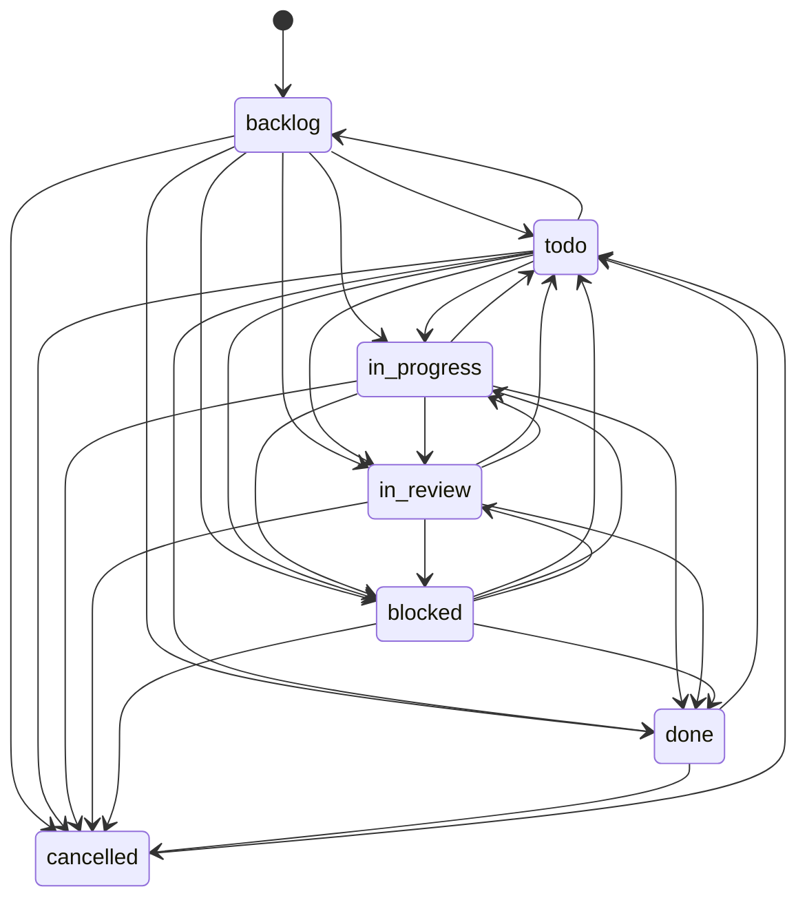
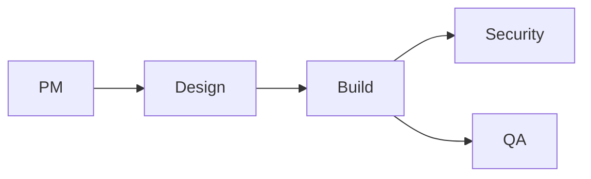
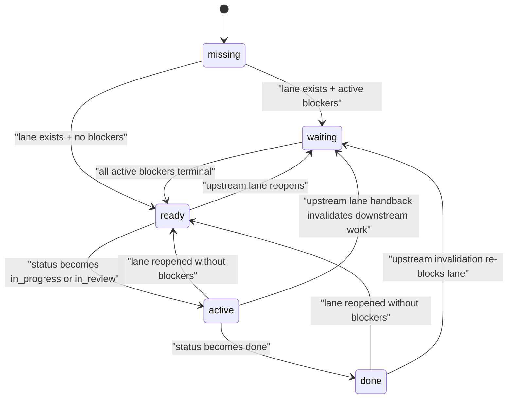

# Control Plane Workflow Map

Date: 2026-04-20
Scope: current implemented delivery workflow after the release-gate QA unblock work and the follow-up QA edge-case fixes.

## Sources checked

- `doc/GOAL.md`
- `doc/PRODUCT.md`
- `doc/SPEC-implementation.md`
- `doc/DEVELOPING.md`
- `doc/DATABASE.md`
- `packages/shared/src/release-gate-qa.ts`
- `packages/shared/src/types/issue.ts`
- `server/src/routes/issues.ts`
- `server/src/services/issue-workflows.ts`
- `server/src/services/workflow-qa-lane-gate.ts`
- `server/src/services/qa-gate.ts`
- `server/src/services/issue-qa-finalization.ts`
- `server/src/services/heartbeat.ts`
- `ui/src/components/IssueWorkflowPanel.tsx`
- `ui/src/pages/CompanySettings.tsx`
- `docs/api/issues.md`
- `docs/api/companies.md`

## What exists today

The delivery workflow is not one state machine. It is six stacked layers:

1. Base issue lifecycle
2. Specialist workflow lane DAG
3. Release-gate QA owner resolution
4. Same-issue QA and workflow-lane QA gates
5. Wakeup request lifecycle
6. Heartbeat run lifecycle

The important distinction is:

- standalone delivery issues use same-issue QA on the root issue
- workflow delivery uses specialist child lanes, including a QA lane with its own gate
- both paths now use the same release-gate QA owner resolver

## High-level flow

```mermaid
flowchart TD
    Create["Board creates issue"] --> Template{"Apply \"engineering_delivery_v1\"?"}

    Template -- "no" --> Single["Standalone delivery issue"]
    Template -- "yes" --> Root["Root workflow issue"]

    Root --> PM["PM lane"]
    PM --> Design["Design lane"]
    Design --> Build["Build lane"]
    Build --> Security["Security lane"]
    Build --> QA["QA lane"]

    Single --> StandaloneWork["Assignee works, comments, uploads docs, creates work products"]
    StandaloneWork --> ReadyForQa{"Completion truth or ready-for-QA truth comment?"}
    ReadyForQa -- "yes" --> StandaloneRoute["Resolve release-gate QA owner and move to in_review"]
    ReadyForQa -- "no" --> StandaloneWork
    StandaloneRoute --> StandaloneQa["Authorized QA comment on same issue"]
    StandaloneQa --> StandaloneClose{"Same-issue QA gate passes?"}
    StandaloneClose -- "yes" --> MergeOrClose["Auto-merge if applicable, then close issue"]
    StandaloneClose -- "no" --> StandaloneBlocked["Stay in_review or hand back via same-issue process"]

    PM --> Wake["Wakeup request + heartbeat run"]
    Design --> Wake
    Build --> Wake
    Security --> Wake
    QA --> Wake

    Wake --> LaneWork["Agent executes lane work"]
    LaneWork --> LaneDone{"Move lane to done?"}
    LaneDone -- "no" --> Wake
    LaneDone -- "yes" --> LaneGate{"Lane completion gate passes?"}
    LaneGate -- "yes" --> Promote["Promote newly unblocked dependents to todo and wake them"]
    LaneGate -- "no" --> LaneBlocked["Close rejected with blocking reasons"]

    Security --> SecurityFail{"Assigned Security comment has \"[SECURITY FAIL]\" or \"[SECURITY BLOCKED]\"?"}
    QA --> QaFail{"Assigned QA comment has failing review or verification?"}
    SecurityFail -- "yes" --> Handback["Hand back to Build"]
    QaFail -- "yes" --> Handback

    Handback --> Reopen["Reopen Build to todo"]
    Reopen --> Invalidate["Invalidate downstream lanes, stamp workflowInvalidatedAt, clear live execution state"]
    Invalidate --> WakeBuild["Wake Build assignee"]

    Promote --> RootClose{"Root issue requested to move to done?"}
    RootClose -- "yes" --> RootGate{"All lanes done?"}
    RootGate -- "yes" --> RootDone["Root closes"]
    RootGate -- "no" --> RootBlocked["Root close rejected"]
```

## 1. Base Issue Lifecycle

Persisted on `issues.status`.

States:

- `backlog`
- `todo`
- `in_progress`
- `in_review`
- `blocked`
- `done`
- `cancelled`



Important invariants:

- `blocked` requires at least one blocker relation
- `in_progress` requires an assignee
- `done` and `cancelled` are terminal for steady-state purposes, but reopen to `todo` is allowed
- close transitions are filtered by extra guards:
  - standalone delivery `done` uses same-issue QA
  - workflow lane `done` uses lane completion rules
  - workflow root `done` uses root completion rules

## 2. Specialist Workflow Lane DAG

Enabled by `issues.workflowTemplateKey = engineering_delivery_v1`.



Lane set:

| Lane | Depends on | Starts as | Workspace mode | Completion contract | Assignment rule |
|---|---|---|---|---|---|
| `pm` | nothing | `todo` | inherited | `plan` document | generic role routing |
| `designer` | `pm` | `blocked` | inherited | `design` document or design work product | generic role routing |
| `engineer` | `designer` | `blocked` | isolated | `implementation-summary` document or implementation work product | generic role routing |
| `security` | `engineer` | `blocked` | isolated | `threat-review` document | generic role routing |
| `qa` | `engineer` | `blocked` | isolated | non-stale `qa-verdict` document plus latest authorized QA verdict comment | shared release-gate QA resolver |

Current behavior:

1. Applying the template creates all five child lanes eagerly.
2. Only dependency-free lanes start in `todo`.
3. Dependency lanes start in `blocked`.
4. When the last active upstream blocker becomes terminal, `advanceWorkflowDependents()` promotes the dependent lane to `todo`.
5. On promotion, the QA lane re-resolves the authorized release-gate QA owner and auto-assigns it when one resolves.
6. If legacy workflow roots are missing blocker edges or have drifted waiting-lane status, the workflow service reconstructs the canonical blocker graph from template metadata before summary/promotion/handback logic runs.
7. Operators can also run the same sweep manually with `pnpm workflow-integrity:reconcile` and `pnpm workflow-integrity:reconcile -- --apply`.

## 3. Release-Gate QA Owner Resolution

This resolver is shared by:

- standalone delivery route-to-QA behavior
- standalone close-to-done QA gating
- workflow QA lane assignment
- workflow QA lane completion
- operations heartbeat QA ownership corrections

Resolution order:

```mermaid
flowchart TD
    Start["Resolve release-gate QA owner"] --> Configured{"Configured company owner exists and is eligible?"}
    Configured -- "yes" --> UseConfigured["Use configured owner"]
    Configured -- "no" --> Canonical{"Exactly one eligible canonical \"QA and Release Engineer\"?"}
    Canonical -- "yes" --> UseCanonical["Use canonical owner"]
    Canonical -- "no" --> Single{"Exactly one other eligible QA agent?"}
    Single -- "yes" --> UseSingle["Use single fallback QA"]
    Single -- "no" --> ConfigSet{"Configured owner was set?"}
    ConfigSet -- "yes" --> Unavailable["Resolution = configured_unavailable"]
    ConfigSet -- "no" --> AnyEligible{"Any eligible QA agents?"}
    AnyEligible -- "no" --> None["Resolution = none"]
    AnyEligible -- "yes" --> Ambiguous["Resolution = ambiguous"]
```

Current status rules:

- eligible QA: not `paused`, not `terminated`, not `pending_approval`, not `error`
- configurable QA owner: may be `active`, `idle`, `running`, or `paused`
- configurable QA owner may not be `terminated`, `pending_approval`, or `error`

Current exposed company fields:

- `releaseGateQaAgentId`
- `resolvedReleaseGateQaAgentId`
- `releaseGateQaResolutionSource`
- `releaseGateQaBlockingReason`

## 4. Workflow Lane Phase Model

Lane phase is derived, not persisted.

Rules:

- `missing`: lane issue absent
- `waiting`: blocked only by active upstream workflow blockers
- `ready`: actionable now, but not currently `in_progress` or `in_review`
- `active`: actionable now and currently `in_progress` or `in_review`
- `done`: lane status is `done`



Root workflow summary semantics:

- `activeRoles`: actionable now
- `waitingRoles`: dependency-gated lanes
- `ownerNeededRoles`: actionable lanes with no owner
- `blockingReasons`: actionable blockers now, not every eventual close-time blocker

## 5. Standalone Delivery QA

Used for non-workflow delivery issues.

Authoritative verdict source:

- latest comment from the resolved release-gate QA owner only

Route-to-QA behavior:

1. assignee comments with completion or ready-for-QA truth
2. issue must not already be a workflow issue
3. issue must not be under execution-policy review
4. assignee role must look delivery-scoped
5. resolver picks release-gate QA owner
6. issue moves to `in_review` and is assigned to that owner
7. if no owner resolves, the system posts a QA-assignment-required gate comment instead

Close-to-done requirements:

- issue is `in_review`
- issue is assigned to the resolved release-gate QA owner
- latest authorized QA comment includes full Smart Review summary:
  - `[CQ]`
  - `[EH]`
  - `[TC]`
  - `[CM]`
  - `[DOC]`
- latest authorized QA comment includes passing verification evidence:
  - `[TYPECHECK: pass]`
  - `[TESTS: pass]`
  - `[BUILD: pass]`
  - `[SMOKE: pass]` or `[SMOKE: na]`
- latest authorized QA comment includes:
  - `[QA PASS]`
  - `[RELEASE CONFIRMED]`

Extra standalone-only behavior:

- passing QA can auto-merge, then auto-close
- failing QA can trigger the same-issue QA auto-fix loop
- workflow issues are explicitly excluded from both of those behaviors

## 6. Workflow QA Lane Gate

Used only for `workflowLaneRole = qa`.

Authoritative verdict source:

- latest comment from the authorized release-gate QA owner only
- no cross-comment accumulation

Required evidence:

- lane assigned to the authorized release-gate QA owner
- non-stale `qa-verdict` document
- latest authorized QA comment contains full Smart Review summary
- latest authorized QA comment contains passing verification evidence
- latest authorized QA comment contains `[QA PASS]`
- latest authorized QA comment contains `[RELEASE CONFIRMED]`

```mermaid
flowchart TD
    Start["Workflow QA lane completion check"] --> Owner["Resolve authorized release-gate QA owner"]
    Owner --> HasOwner{"Authorized owner resolved?"}
    HasOwner -- "no" --> BlockOwner["Block lane on ownership reason"]
    HasOwner -- "yes" --> Assigned{"Lane assigned to that owner?"}
    Assigned -- "no" --> BlockOwner
    Assigned -- "yes" --> Doc["Check non-stale \"qa-verdict\" document"]
    Assigned --> Verdict["Load latest comment from authorized owner only"]
    Verdict --> Summary["Parse Smart Review summary"]
    Verdict --> Verify["Parse verification evidence"]
    Verdict --> Markers["Check \"[QA PASS]\" and \"[RELEASE CONFIRMED]\""]
    Doc --> Final{"All checks pass?"}
    Summary --> Final
    Verify --> Final
    Markers --> Final
    Final -- "yes" --> Complete["Lane may move to done"]
    Final -- "no" --> StayOpen["Lane stays unclosable"]
```

What does not happen for workflow QA lanes:

- no standalone auto-merge-on-pass behavior
- no same-issue QA auto-fix loop
- no generic operations fallback assignment outside the shared release-gate resolver

## 7. Handback, Invalidation, and Staleness

Workflow-native handback sources:

- Security lane assigned comment has `[SECURITY FAIL]` or `[SECURITY BLOCKED]`
- QA lane assigned comment has failing Smart Review
- QA lane assigned comment has failing verification

Handback behavior:

1. find the template-defined handback target
2. reopen that target lane to `todo`
3. invalidate downstream descendants to `blocked`
4. stamp `workflowInvalidatedAt` on reopened and invalidated lanes
5. clear live execution state on those lanes
6. emit workflow activity and ops events
7. wake the reopened target assignee

Staleness rule:

- if required evidence predates `workflowInvalidatedAt`, it becomes stale
- this applies to documents, work products, and the workflow QA verdict document

## 8. Root and Lane Close Guards

Lane close:

- non-QA lanes use generic workflow artifact evaluation
- QA lanes use the workflow QA lane gate
- route rejects `done` with `workflow.lane.close_blocked` when requirements are not satisfied

Root close:

- root summary is first decorated with current `workflowSummary`
- root close then appends broader close-time reasons:
  - missing lane
  - lane not `done`
  - any current actionable blockers already in `workflowSummary`
- route rejects `done` with `workflow.root.close_blocked` when any lane remains incomplete

Board-only override:

- `forceDone = true`
- `overrideReason` required

## 9. Execution-Policy Overlay

Independent from workflow templating.

Persisted in `issues.executionState.status`:

- `idle`
- `pending`
- `changes_requested`
- `completed`

This is a same-issue approval/review overlay. It can block standalone route-to-QA behavior, but it does not create or advance workflow lanes.

## 10. Wakeup Request Lifecycle

Persisted in `agent_wakeup_requests.status`.

States:

- `queued`
- `deferred_issue_execution`
- `claimed`
- `coalesced`
- `skipped`
- `completed`
- `failed`
- `cancelled`

Typical triggers:

- issue assignment
- workflow lane unblock
- workflow handback
- comment mention
- status change
- manual probe

## 11. Heartbeat Run Lifecycle

Persisted in `heartbeat_runs.status`.

States:

- `queued`
- `running`
- `succeeded`
- `failed`
- `cancelled`
- `timed_out`

Retry overlay:

- `none`
- `scheduled`
- `retrying`
- `recovered`
- `exhausted`
- `blocked`
- `non_retriable`

Wakeup state answers "did the system ask for work?".
Heartbeat state answers "what happened after execution started?".

## 12. Operator Visibility Today

Current good visibility:

- root workflow panel shows:
  - first blocking reason
  - `Actionable now`
  - `Waiting on dependencies`
  - `Needs owner`
- lane rows show:
  - role
  - assignee
  - workspace mode
  - artifact completion count
  - phase badge
  - status badge
- lane issues show artifact readiness cards
- Company Settings shows:
  - configured release-gate QA owner
  - resolved owner
  - resolution source
  - blocking reason
- activity and ops logs capture:
  - handback
  - invalidation
  - unblocked
  - root close blocked
  - lane close blocked

Current limits:

- UI is still snapshot-first, not history-first
- root panel still emphasizes only the first blocking reason
- stale artifact state is visible, but the next remediation step is still implicit

## Highest-confidence Improvement Opportunities

### 1. Make workflow completion policy declarative

Current gap:

- generic lanes read declarative artifact metadata
- workflow QA still relies on special-case gate code for latest-authorized-comment semantics, verification parsing, and ownership checks

Why it matters:

- the most important lane contract is still split between template metadata and code
- that is a long-term drift vector for docs, tests, and UI

Best next change:

- add an explicit lane completion policy/evaluator type to workflow metadata
- make workflow QA requirements declarative instead of partly implicit

### 2. Split steady-state summary from close-time completion state in the API

Current gap:

- `workflowSummary.blockingReasons` means actionable blockers now
- root close uses a broader "all lanes must be done" gate that is only visible at close time

Why it matters:

- the operator view and the close guard are both correct, but they answer different questions
- today that distinction lives in route behavior more than in the payload

Best next change:

- add explicit root completion fields such as `canClose` and `closeBlockingReasons`
- keep `workflowSummary` focused on operational state

### 3. Make workflow history first-class in the UI

Current gap:

- backend emits structured workflow events for handback, invalidation, and unblocked transitions
- UI mostly shows the current snapshot

Why it matters:

- when operators ask "why is QA waiting?" or "why did this lane reopen?" the answer is in logs, not in the main workflow surface

Best next change:

- add a workflow timeline to the root issue panel
- show handback target, invalidation time, and who triggered the event

### 4. Expose more precise release-gate QA blocking diagnostics

Current gap:

- `configured_unavailable` collapses multiple real-world causes into one blocked state
- the root issue and lane views still make the operator infer the fix

Why it matters:

- QA deadlocks are now rarer, but when they happen, the fix path should be obvious

Best next change:

- surface exact cause categories such as:
  - configured owner is paused
  - no eligible QA exists
  - multiple canonical candidates
  - multiple non-canonical eligible candidates

### 5. Remove resolver duplication between route-local and service-local paths

Current gap:

- there is a shared service resolver
- `server/src/routes/issues.ts` still carries a route-local resolution path for mocking and route composition reasons

Why it matters:

- ownership policy is important enough that duplicate resolution logic is risky even when currently aligned

Best next change:

- centralize resolution behind one injectable server-side service boundary
- keep tests mocking that service instead of rebuilding the resolution path in routes
