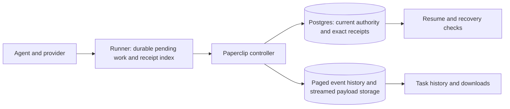

# Long-running agents without history limits

- Date: 2026-09-28
- Status: Target contract; indexed local Codex implementation in qualification, disabled for fresh sessions by default
- Scope: Paperclip native runner, controller persistence, continuation, recovery, and historical output
- Baseline: PR [#14312](https://github.com/paperclipai/paperclip/pull/14312), commit `e6bed1231ae286698d440fdfec4d19ce3362af42`
- Full lifetime contract: [state machines and activation requirements](../architecture/runner-history-lifetime.md)
- Related contracts: [runner architecture](../architecture/paperclip-runner.md), [compatibility](../architecture/paperclip-runner-compatibility.md), [database](../DATABASE.md#native-runner-persistence), [execution semantics](../execution-semantics.md)

**Current status, 2026-09-29:** the scalable Paperclip storage path is implemented
and remains opt-in. The latest native candidate passed its release suite and a
10 GiB receipt-growth test; the same native implementation also passed the
actual local Codex browser workflow, including active controller restart.
These are identified component/workflow measurements, not a full
unlimited-history qualification. Stock
Codex recovery/checkpoint interfaces, whole-session source-loss restoration,
enforced process containment and retained-session migration admission remain
open. The elapsed 72-hour requirement has not passed. Sections 59–64 record the
latest evidence; earlier measurements below retain their original scope.

**Product decision, 2026-09-29:** use stock Codex. Do not create or maintain a
Paperclip-specific Codex build. Keep provider replay/checkpoint limitations
explicit and keep the full lifetime contract unqualified while they remain.

## 1. Product requirement

An agent may work continuously for days, perform arbitrarily many sequential
operations, generate arbitrarily much historical output, and continue through
review turns. Accumulated work must not make its next operation or continuation
fail. A single long active turn is included; resetting history at turn boundaries
is insufficient.

There is no application-defined lifetime ceiling on journal bytes, completed
commands, completed tool calls, events, or review turns. Increasing storage
capacity must not require restarting the agent, changing its provider session,
or abandoning its task. Storage rotation is an internal operation, not a new
model turn or a request for the user to start over.

"Unlimited" means no cumulative application limit. Storage, network throughput,
and provider capacity still have physical limits. Explicit company budgets,
approvals, operator timeouts, retention policies, and provider restrictions still
apply. Finite limits on a message, concurrent operations, memory, and pending
delivery protect the service; completed work releases that capacity. Physical
storage exhaustion produces a recoverable resource condition, not an identity
mismatch or a corrupt-session classification.

## 2. The design in plain language

Keep three separate records:

1. **Current state:** which agent/session owns the work, where delivery has
   reached, what is unfinished, and whether completion was accepted. Read this
   to resume. Its size depends on current work, not the age of the task.
2. **History:** the events and output that people can inspect. Add records and
   read them in pages. Old output is never a prerequisite for ordinary resume.
3. **Action receipts:** exact identities and outcomes of previously handled
   commands and tool calls. Look up one receipt when a request is repeated;
   never load every past receipt into memory.

The existing "proof" becomes a typed view of current state and a few referenced
receipts. It is maintained as work happens. It is not reconstructed by searching
all historical output, and it is never an AI-generated summary.



## 3. Problems the implementation must eliminate

The reviewed PR makes large existing files readable with bounded worker memory.
It does not establish the product requirement above.

| Current mechanism | Consequence | Required replacement |
| --- | --- | --- |
| 192 MiB controller journal read limit | A sufficiently large valid history is unreadable | No aggregate journal file in the execution path |
| 8 MiB reconstructed evidence budget | Retained authority can exceed the reader budget | Typed current state plus bounded/paged active references |
| Full JSON scan/hash for identity and evidence | Continuation time grows with historical bytes | Indexed current-state read and generation verification |
| `DurableCoreStore.save()` rewrites and fsyncs all state | Each event can rewrite previous output and block the controller | Incremental durable transactions off the API event loop |
| 500 retained controller commands | A long run eventually cannot enqueue another command | Separate pending commands and disk-backed historical receipts |
| 4,096 controller event window | Historical authority can fall out of the window | Explicit current authority independent of event retention |
| Provider bridge receipt/identity ceilings | Active turns can be interrupted solely for accumulated receipts | Exact indexed receipts with no lifetime count/byte cap |
| Runner/provider JSON contains arrays and maps | Restore/save work grows with retained state | Transactional rows, paged outbox, and bounded caches |

The provider bridge currently has separate limits for 4,096 durable call
receipts, 65,536 settled call IDs, and retained result bytes. Removing only the
controller's JSON file does not solve these limits. Conversely, outbox limits
and maximum simultaneous pending calls are flow control and should remain.

The review reproduced a writer/read mismatch: loading a valid 191.6 MiB journal,
then enqueueing an 800 KiB command, produced a 192.4 MiB journal that the writer
could no longer reopen. The compatibility fix must not claim that all
writer-admitted histories are supported until this is addressed.

## 4. Storage decisions

### Controller: use the existing Postgres authority

Postgres already commits native events before the controller acknowledges them.
Extend that transaction to maintain current transport state, action receipts,
and recovery evidence. Do not introduce another authoritative controller
database that must be coordinated with Postgres for every event.

Replace `control-plane-state.json` as the v2 execution authority. A small local
locator may identify the store and format; it grants no execution authority.
The controller keeps a bounded cache of current rows. No API exposes the full
historical store as an in-memory `state` object.

Here, v2 means the new durable-store format, not the already existing PRP wire
version 2. Negotiate a separate versioned durability capability (proposed name:
`durability.indexed_state.v1`) and explicit payload/reference schemas. Never
change existing PRP message meaning merely because both peers speak PRP v2.

Preserve the runner package's dependency boundary: define an asynchronous
`DurableAuthorityStore` port in the package and implement the production
Postgres adapter in `server/`. Standalone/evaluation controllers use a qualified
SQLite implementation of that port without requiring a Paperclip server or
Postgres installation. A standalone fixture must supply its own real durable
event/effect commit boundary; it cannot acknowledge a mocked business commit.
Open stores asynchronously before accepting connections. Await every durable
mutation through transport and lifecycle callers; constructors and public
getters must not conceal blocking I/O or fire-and-forget persistence.

Proposed logical tables, finalized with the schema implementation:

| Table | Contents and primary access |
| --- | --- |
| `native_session_authorities` | Company/session/runner/environment binding, current run and authority epoch, controller fencing token, generation, delivery cursors, current lifecycle, transition reference. Point lookup by bound session. |
| `native_pending_commands` | Only commands that still need delivery or settlement; stable ID, sequence, input digest, payload reference, phase. Bounded by admission credits. |
| `native_command_receipts` | Exact completed command identity, canonical input digest, disposition, result/reference, original sequence and authority epoch. Unique scoped command ID; indexed sequence lookup. |
| `native_effect_receipts` | Semantic call identity, input digest, durable intent, application receipt, result/reference, and delivery state. Unique scoped call ID. Never infer completion from missing history. |
| `native_process_owners` | Live or not-yet-proven-stopped process owners, with host/sandbox identity, boot identity/start time, and stop evidence. Settled owner history is separate. |
| `native_run_evidence` | Validated completion/finish reference, terminal state, current provider binding, unresolved counts, and sticky bootstrap/effect facts. Updated with the facts it summarizes. |

Reuse `heartbeat_run_events`, native results/finalization tables, and existing
semantic-operation receipts rather than duplicating their business authority.
The proposed transport receipts reference those records. All new keys and
foreign keys enforce company/run/session consistency, not just globally unique
IDs. Actor authorization and mutation audit records remain in existing services.
Bootstrap/lease credentials remain access-controlled and use the existing
secret-storage rules; snapshots, historical output, and proof exports must not
expose plaintext credentials. Persist only necessary authentication material,
with explicit revocation and expiry independent of history retention.

Receipt storage is indexed on disk and may grow. Do not hide another lifetime
cap in a JSON column, an in-memory map, a checkpoint attachment, or a manifest.
Partitioning is storage administration behind stable receipt keys. A partition
locator must itself be indexed; a lookup cannot search every historical
partition. Do not time-partition an idempotency table in a way that permits the
same logical key to be accepted twice.

### Runner: transactional local state and receipt index

Use an embedded SQLite store for runner-owned state, pending events, command
receipts, and provider tool receipts. Keep it on the runner's durable local
volume, including inside a remote sandbox. The runner does not need direct
Postgres credentials. Controller and runner never concurrently mount the same
SQLite database over a network filesystem.

The initial engine policy is WAL mode with `synchronous=FULL`, short
transactions, bounded page caches, and a dedicated storage executor. Persist
before acknowledging or releasing an effect. Schedule checkpoints by WAL bytes
and elapsed time; cap reader transaction lifetimes so readers cannot pin an
ever-growing WAL. If checkpointing falls behind, apply admission backpressure
while preserving a reserved control/settlement lane. SQLite's WAL is not the
user's audit history and is not retained indefinitely.

All reads/writes in TypeScript run in a worker; Rust uses a dedicated storage
thread. The protocol/heartbeat loop must not serialize history or wait on a
synchronous filesystem call in its event loop. Binding choice and binary
packaging need a qualification spike, not a new hand-written transaction engine.
Pin and verify a SQLite build with the WAL-reset fix (3.51.3 or later, or a
documented fixed backport). A Node minimum version alone does not prove its
bundled SQLite is qualified.

SQLite and filesystems have finite per-file limits. Large historical bodies
live outside this database. The receipt-store interface supports online
partition relocation/splitting with stable logical keys before backend file
limits, without changing provider/session identity. Splits copy in bounded
batches, capture concurrent writes, verify them, then atomically switch the
authoritative locator; old readers retain the prior generation until drained.
Publish partition generations through the active store. A write admitted under
an old generation is fenced before cutover or captured in the migration delta;
it cannot succeed only in an abandoned shard. An indeterminate cutover holds
the affected key range for reconciliation rather than treating an empty lookup
in the new shard as a new command. No correctness step relies on an atomic
transaction across multiple SQLite WAL databases.
An arbitrary raised SQLite size limit is not the implementation of unlimited
history. Partition routing and crash-safe relocation belong in storage
qualification, including a test with deliberately tiny partition thresholds.

### History and large bodies

Keep the existing company-scoped run-log API as the user-facing history
contract. Use indexed cursor pagination. Move large bodies to the existing
local/object-storage abstraction and return authorized references through that
API; update shared types, server resolution, and UI consumers together.

Store immutable, independently verifiable chunks/segments (initial target:
32 MiB). Segment size is a rotation threshold, not a total-history limit.
Neither the current-state row nor a startup manifest contains an array of every
segment. Segment metadata and content references are indexed and paginated.
Reads fetch the requested range with at most a fixed-size segment verification
on a cache miss. Streaming upload/download/export cannot
assemble the complete object in memory or one `JSON.stringify` call.

A referenced body is durable before the metadata transaction commits. Orphan
bodies from failed transactions can be garbage-collected after a grace period;
metadata must never point to bytes that have not been committed. Local mode
uses private temporary files, sync, rename, and directory sync. Remote mode
requires a completed upload and verified size/digest before publication.

Content references include company/store scope, object identity, byte length,
digest, and media/schema type. They are not arbitrary paths or capability URLs.
New transport chunk/reference support is negotiated. Large historical output
does not imply arbitrarily large individual PRP frames; enforce existing frame
limits and stream or externalize oversized content without silently truncating
authority-bearing inputs/results.

## 5. Current evidence replaces history scanning

Maintain these facts when validating the event/command that establishes them:

- Exact company, issue, run, normalized session, runner, environment lease,
  provider/account, and authority epoch binding.
- Controller ownership/fencing token and monotonic state generation.
- Next command/event sequence and durable contiguous acknowledgment cursors.
- Pending commands, unacknowledged events, unresolved semantic effects, active
  provider turn, pending terminal delivery, and pending warm transition.
- Live/unresolved process owners, including provider and sidecar processes.
- Validated completion contract and accepted finish/result/receipt references.
- Sticky facts such as `providerEverStarted` and `externalEffectEverAdmitted`.
  An empty current queue does not establish that nothing ever happened.

Do not retain every former process as active authority forever. A process owner
leaves the active set only after exact stop evidence is persisted. PID alone is
insufficient; bind host/sandbox, boot identity, start identity, and process group
as appropriate. Failure to establish death preserves the unresolved owner and
prevents unsafe replacement. Resource limits cannot silently discard it.

Completion is materialized from validated structured finish input and the
server's accepted result, not from a last-event heuristic. Inputs/results that
need exact comparison use immutable references and canonical digests. Collections
of evidence are paged relations, not growing arrays inside a proof object.

Expose purpose-specific operations, for example:

```ts
readAuthority(binding): Promise<AuthoritySnapshot>
readContinuationState(binding, expectedGeneration): Promise<ContinuationState>
readCleanupOwners(binding, cursor): Promise<Page<ProcessOwner>>
getCommandReceipt(binding, commandId): Promise<CommandReceipt | null>
getEffectReceipt(binding, callId): Promise<EffectReceipt | null>
readPendingEvents(binding, after, byteBudget): Promise<EventPage>
```

There is deliberately no `readWholeJournal()` or history-sized `proof` return.
Cleanup can require all unresolved owners, but those are admitted live work,
not every process ever recorded. Read pages under a consistent generation and
recheck the owner fence/generation before the action.

## 6. Commit, acknowledgment, and replay rules

### Runner event delivery

1. Runner transaction commits the event, its identity/digest, updated state,
   and any provider-event receipt. Only then may it send the event.
2. Controller transaction validates identity and sequence, commits the raw
   inbox record/reference with current transport state, and advances its
   contiguous accepted cursor. Exact duplicates return the existing outcome;
   conflicting identities or gaps fail closed.
3. Only after that commit does it acknowledge the runner. This ACK proves raw
   inbox durability, not normalized run-log consumption. The driver commits
   each short reducer step, its raw position (epoch, frame, expansion ordinal),
   and its pending normalized events together before publishing those events.
   The run-log writer accepts their exact identities and bytes before the
   consumer removes them from the pending outbox. Interrupted delivery replays
   the original timestamp and sequence. A completed-frame marker prevents an
   epoch transition in the middle of one raw frame's expansion.
4. Runner commits the acknowledgment before freeing the corresponding outbox
   payload. A lost acknowledgment causes a safe duplicate delivery.

Keep server-side replay validation indexed even after old payloads are archived.
Do not compare only a high-water mark and silently accept conflicting old data.
If retention removes historical payloads, retain the exact ID/digest and
receipt needed for any still-valid replay namespace.

### Commands and semantic effects

Persist an accepted command before transmission. Persist a tool-call intent
with its exact idempotency key before invoking the existing business operation.
Persist the resulting receipt before returning success or delivering the result
to the provider. Update the pending set and current evidence in the same local
transaction as that durable outcome.

Across Postgres, a runner database, and an external application there is no
single atomic transaction. Use the existing business idempotency ledger and
explicit pending/settled/delivery phases. On a crash after an external effect
but before its receipt, query/reconcile using that same key. Where a provider
cannot establish the outcome, retain an indeterminate effect and require the
existing recovery decision. Never re-execute an uncertain operation because a
local receipt or historical payload is absent. This design does not claim
exactly-once execution for arbitrary external systems.

Command and provider-call keys include their authenticated namespace. Store
the original bounded identity and canonical input digest; a hash index alone
is not permission to conflate different IDs. Exact retries return the prior
outcome, conflicting reuse is rejected, and cache misses consult durable
storage. No Bloom filter, FIFO eviction, or rolling summary may decide that an
old call is safe to execute again.

Acknowledged event payloads may be reclaimed. Receipts remain while their
namespace can replay. Retiring a namespace requires a durable fence accepted by
both peers; stale messages are then rejected without execution. A provider's
arbitrary call IDs cannot be retired by inventing a turn boundary it does not
guarantee. Keep their exact on-disk receipts as long as necessary. Normal
storage maintenance must not force a provider-process restart to clear them.

## 7. Resume, restart, cleanup, and integrity

Normal continuation reads the authority/evidence rows and pending records,
then verifies the live runner or retained provider checkpoint using the current
ownership rules. Reconnect replays only the unacknowledged delivery range.
Crash recovery opens the transactional store and reconciles pending phases;
it does not replay the lifetime history to rebuild current state.

Warm transition keeps the existing prepare/activate/acknowledge semantics and
durable old/new identity binding. Persist every phase and the exact receipt.
Epoch rotation changes current authority; it does not erase historical receipts
or become necessary merely because a file or command counter filled up.

Replace byte-exact hashes of entire growing journals with a versioned digest
of the bounded authority snapshot, generation, cursors, active references, and
transition receipt. These digests detect changes; they are not authentication.
Trust comes from server-owned transactions, authenticated PRP bindings, protected
runner storage, and independently verified process ownership. An agent-written
checkpoint claiming "safe" never grants permission to resume or kill a process.

Validate data and update evidence at ingestion. On normal resume, validate the
current snapshot and referenced active records. A separate, resumable audit can
verify historical segments; it must not gate every new turn. Corruption of an
unreferenced archived output is a history-availability problem. Corruption or
absence of current authority, an unresolved effect, or a necessary checkpoint
blocks the corresponding operation with a specific reason.

Readers take short consistent snapshots. Before a destructive action, acquire
the appropriate ownership lease and compare the expected generation/fence in a
transaction. Do not hold a database read transaction open across remote process
inspection. Revalidate remote boot/start identity immediately before signaling.

## 8. Backpressure and capacity

No unbounded memory queue is introduced. Bound concurrent calls, unsent commands,
unacknowledged bytes, worker jobs, transaction size, record size, and open readers.
Reserve capacity for interruption, completion, acknowledgment, and cleanup.
Credits return as work settles. Group commit is allowed only when all callers
wait for durability before acknowledgment or effect release.

If the controller or storage cannot keep up, stop admitting new work and drain
what is already admitted. If provider output cannot be paused safely, use its
qualified interrupt/checkpoint path and retain ownership/evidence. Report
`storage_pressure`, `delivery_backpressure`, `storage_unavailable`, or an exact
provider limitation; do not report an identity mismatch. Once capacity returns,
resume through the existing owner with the same keys and cursors.

Archive acknowledged history continuously; do not wait for the agent to finish
or for a maintenance scan of its entire history. Local and hosted deployments
can add storage or relocate partitions behind stable references. If configured
retention deletes history, it must not remove active payloads, replay receipts,
or current authority. Audit retention and execution correctness are separate
contracts, both company-scoped.

Lease renewal and idle timeout remain distinct from active execution duration.
Long-running mode must not impose a hidden wall-clock cutoff through transport
defaults, sandbox TTL, or provider configuration. Audit and test those policies;
honor explicit operator limits and surface nonrenewable provider limits. Storage
work cannot bypass budgets, holds, approvals, or single-assignee ownership.

## 9. Performance contract

Let H be total historical bytes, R completed receipts, A admitted active work,
and D newly written/read bytes. With A held constant:

| Operation | Required cost |
| --- | --- |
| Accept an event/result | Work proportional to D plus indexed updates; never rewrite H |
| Resume current authority | Bounded current rows/active pages plus index access; never scan H or R |
| Retry an old command/call | Exact indexed lookup, generally O(log R), plus that result's bytes |
| Restart | Bounded WAL recovery plus current/pending state; not lifetime event replay |
| Inspect history | Requested page/range plus fixed-size segment verification on a cache miss; never scan H |
| Archive/compact | Incremental bounded batches, resumable off the execution path |

Do not promise mathematically constant latency regardless of database size,
cache state, or storage hardware. Require no linear dependence on lifetime
history, bounded memory, and bounded foreground work. A large unacknowledged
backlog can take time to deliver; it is live work, not an excuse to scan already
acknowledged history. Current-state reads have priority over archive work and
fair scheduling across companies so one busy agent cannot occupy every worker.

Sequence/cursor values must not silently overflow JavaScript safe integers.
Use exact database/Rust integers and decimal-string or negotiated exact wire
representations. Any protocol epoch rollover is transparent storage/protocol
maintenance and must not terminate the provider turn.

## 10. Migration and rollout

1. **Keep the immediate reader fix scoped.** PR #14312 remains a legacy
   compatibility improvement. Fix/reproduce the aggregate writer/read mismatch
   explicitly; do not remove every size guard and call that unlimited support.
2. **Introduce the store interfaces and v2 schemas.** Add Postgres migrations,
   typed evidence, the runner store, and golden cross-language contracts.
   Negotiate the new durability capability and persist the selected format on
   the session. Old peers stay on the legacy path with visible limits.
3. **Populate evidence alongside legacy writes in shadow mode.** Compare all
   admission/cleanup/recovery decisions with legacy classifiers. Legacy remains
   authoritative; any disagreement is a release failure. Shadow mode does not
   qualify long-running capacity while legacy writes remain.
4. **Enable v2 for fresh sessions with qualified peers.** Switch one authority
   path per session. Stop full-journal writes and projection scans on that path.
   Expand provider-by-provider after real-process and remote acceptance.
5. **Migrate retained sessions once under an exclusive ownership fence.** At a
   verified quiet boundary, stream the legacy journal/provider state into the
   new stores. Preserve exact commands, receipts, unresolved work, cursors,
   process owners, transition phases, and canonical identities. The lossy proof
   projection is not a migration source. Import even valid files above 192 MiB
   using bounded records/checkpoints and a resumable progress cursor; no whole
   file allocation or 30-second whole-job deadline.
6. **Commit migration with an explicit durable state machine.** Staging records
   are invisible until verified. Record source identity/digest and import
   generation. Prepare both controller/runner stores, then publish activation
   through an idempotent fenced handshake. An interrupted migration is resumed,
   not inferred complete from the presence of a directory. Preserve original
   files until activation and backup verification; unsupported/ambiguous legacy
   authority remains held rather than guessed.
7. **Retire legacy readers after qualification.** A v2 session cannot silently
   fall back to stale v1 JSON. Rollback disables new v2 starts but retains v2
   recovery/read support. An older binary must reject v2 explicitly. Stopping
   an active process to migrate requires the existing verified handoff; otherwise
   leave that session on v1 until its natural safe boundary.

Backup/restore must be transactionally consistent: use a database backup or
checkpoint/export protocol, not a copy of a live `.db` without its WAL. Bind
controller authority, runner state, required payloads, and provider checkpoints
to one verified recovery generation. Revalidate actual process ownership after
restore. Full historical backup is a streaming background operation and does
not enter the resume path.

## 11. Implementation slices and ownership boundaries

These are ordered engineering slices, not newly created Paperclip tasks.

| Slice | Principal code and outcome |
| --- | --- |
| A. Contracts and storage spike | `packages/paperclip-runner/src/control-plane/`, `runner/crates/runner-core/src/durable/`; qualify SQLite bindings/builds, async boundaries, corruption handling, and exact receipt API. Produce byte/read/write instrumentation. |
| B. Controller authority | `packages/db/src/schema/`, migrations/exports, `packages/shared/`, native event coordinator and semantic dispatcher; commit event + authority + receipts atomically with tenant constraints. |
| C. Runner and provider receipts | `durable/state.rs`, `durable/runner.rs`, `provider_bridge.rs`, `provider_backend.rs`, `acpx_provider_backend.rs`, and other qualified backends; remove history-sized maps/saves and receipt-triggered lifetime stops. |
| D. Recovery consumers | `native-session-executor.ts`, continuation, process-stop, replacement, chat, and maintenance callers; consume typed evidence rather than scanning `commands`/`committedEvents`. Preserve each current negative-evidence check. |
| E. Payload/history pipeline | Run-log payload storage, authenticated APIs, shared references, and transcript/download consumers; stream/chunk bodies and paginate catalogs without changing mutation authority. |
| F. Compatibility and qualification | Legacy importer, capability negotiation, binary/provider manifests, backup/restore, fault tests, and real local/Daytona long-running cells. |

Inventory every consumer of journal bytes/fingerprints and every provider's
retained receipt collection before removal. Include helpers used by cleanup,
hot restart, cold restart, backup restoration, and sandbox adoption. Do not
change only the primary continuation call site.

This is execution persistence and local run-log work. It is not first-party
Telemetry or the OpenTelemetry trace path. Add local capacity/latency diagnostics
without sending prompts, output, or credentials to a new endpoint.

## 12. Acceptance gates

Correctness and bounded I/O are mandatory. Wall-clock benchmarks supplement
them; fast machines cannot hide a full-history scan.

| Test | Required evidence |
| --- | --- |
| One long active run | At least 100,000 journaled commands and 100,000 settled semantic calls without a turn reset/provider restart, crossing all old count/byte thresholds. Exactly one application effect per logical key. |
| Large real history | At least 10 GiB physically written and ingested through normal bounded events, crossing 192 MiB repeatedly; streamed hashes and independent host counts agree. No sparse padding offered as growth evidence. |
| Larger storage qualification | 100 GiB scale lane plus tiny configured segment/partition thresholds; online rotation, partition split/relocation, and bounded startup work. A routing fixture alone is not a 100 GiB throughput result. |
| Many continuations | At least 1,000 review turns with stable task/workspace/provider session where the provider supports it; no archive count loaded into memory. |
| Multi-day soak | A real 72-hour session with periodic ordinary tool work, lease renewal, controller hot/hard restart, reconnect, and continued task output. Fake-time checks do not replace the elapsed soak. |
| Resume scaling | Compare 10 MiB, 1 GiB, and 10 GiB acknowledged histories at the same active set. Instrument zero historical-payload reads and no receipt-table scans; current-state bytes stay bounded. Test cold and warm caches. |
| Foreground latency | On a declared reference host, target p95 current-state read <250 ms and no >2x p95 regression between smallest/largest histories at fixed active work. Record provider/network time separately. Thresholds are qualification targets, not results already achieved. |
| Write amplification | Trace each append/commit; no previous history serialized or rewritten. Measure total bytes written and bounded WAL/segment checkpoint batches throughout growth. |
| Memory and fairness | Fixed active load plus growing history stays within configured caches and queues. A busy agent does not block another company's small continuation; control messages retain capacity. |
| Ancient replay | Replay the first call/command after 100,000 later operations, archive, compaction, restart, and partition relocation: original outcome, zero second effect. Changed input under the same identity is rejected. |
| Fault injection | Crash before/after payload durability, intent, external effect, receipt, DB commit, ACK, outbox removal, transition activation, partition cutover, migration cutover, and backup publication. Recover the correct phase without losing acknowledged work. |
| Resource failure | Disk full/read-only, DB unavailable, upload failure, WAL checkpoint starvation, worker crash, and long network partition: bounded queues, preserved ownership, explicit reason, recovery after capacity returns. |
| Integrity and governance | Corrupt active evidence, symlink/special-file swap, wrong tenant/account, stale fence, PID reuse, live mismatched owner, pause, budget exhaustion, and approval denial all remain denied. |
| Archive independence | Make unrelated old history unavailable; normal continuation still succeeds. Remove an active receipt/checkpoint/body; the dependent operation fails closed with a precise reason. |

Use deterministic credential-free processes for high-volume protocol tests.
Run the actual provider/remote cells separately with explicit cost and cleanup
accounting. A short three-turn test or synthetic scanner benchmark cannot satisfy
the long-running claim. Preserve the qualification artifacts with exact code,
runtime, provider, fixture, storage, and measured-byte provenance.

## 13. Delivery standard

The complete design is implemented only when the controller, runner, and
qualified provider paths meet these gates, including restart and cleanup.
The implementation status below distinguishes completed storage work from
remaining rollout requirements. A reader improvement or short successful
continuation must not be labeled unlimited continuation.

The board-facing promise is: **an agent can keep working and continue later;
the amount of completed work does not consume a hidden execution allowance.**

## 14. Implementation and qualification status (2026-09-28)

The worktree implements an **experimental local Codex lane**. Set
`PAPERCLIP_NATIVE_INDEXED_STATE=1` to select it for fresh sessions. Existing
legacy checkpoints remain legacy; they are not silently converted. Disabling
fresh activation preserves the indexed readers and format selection for an
already indexed local session, including its later runs.

Implemented:

- An asynchronous controller storage port, production Postgres authority and
  immutable receipt tables, and a worker-owned SQLite implementation for
  standalone controllers. Generation compare-and-set, binding checks, exact
  replay comparisons, bounded records/pages, and failed-write fencing apply.
  Credentials, event cursors, and delivery counters publish after commit. A
  retained locator with a missing current-state row fails without recreating
  authority or altering its surviving receipts.
- A runner SQLite WAL/FULL executor, bounded current checkpoint and in-memory
  receipt caches, exact command/event receipts, and paged pending outbox restore.
- Codex provider checkpoints and exact tool-call, completed-turn, and child-thread
  receipt indexes. Completed history no longer consumes the legacy 500-command,
  4,096-call/identity, or 65,536-settled-call budgets on this lane. Limits on
  current/pending work and individual records remain.
- Explicit `durability.indexed_state.v1` negotiation; a PRP version alone does
  not activate the format. SQLite is bundled and checked for the WAL-reset fix.
- Current-state proof reads, generation fingerprints, sticky bootstrap/effect
  facts, stale-writer rejection, transactional sealing of a verified stopped
  runner, and resumable movement of inactive SQLite files during cold rotation.
  A durable current-archive pointer avoids searching previous epochs after an
  interrupted indexed rotation. Canonical archive identities survive reordered
  JSON keys after reopening the indexed store; legacy archive names stay intact.
- Cached contiguous run-log source cursors. Existing runs pay one bootstrap
  scan; subsequent writes inspect only the indexed tail after that cursor.
- A legacy writer guard that refuses to publish a journal its own reader cannot
  reopen, instead preserving the last durable file and fencing the failed writer.
  The locator compatibility reader shares that same 192 MiB bound; a real
  65 MiB legacy-file regression prevents introducing a smaller reader limit.

**Two event sequences must stay separate.** Runner transport events and the
Codex driver's normalized Paperclip run-log events have different identities
and sequence numbers. The Postgres adapter atomically commits the original
protocol event into `native_authority_records` with current authority and the
ACK cursor. The driver continues to publish normalized `heartbeat_run_events`
through its existing writer. Inserting raw transport events into that table
caused a replay conflict in an initial live test and was removed. The indexed
lane now commits a driver checkpoint, raw consumer cursor and bounded normalized
outbox together, publishing only after commit. Run-log ACKs remove exact pending
events. Recovery restores unanswered questions and original event identities;
an explicit terminal fact covers a crash after terminal delivery ACK but before
orchestration checkpointing. Indexed driver recovery reads current provider
metadata rather than enumerating provider turn history. Rotation drains pending
normalized output through the prior run's writer. The driver history maps now use bounded exact caches. Remaining maintenance and
import activation consumers still require the work listed below.

The first live campaign for this handoff exposed optional `undefined` fields
that needed JSON wire normalization and an error handler writing to an already
failed writer. The next exposed ordering of deferred frames around provider
identity. Another exposed a PostgreSQL deadlock; the adapter now retries only
explicit PostgreSQL transaction-abort codes (`40P01`/`40001`), at most three
times, preserving the fence for unknown commit outcomes. Real database rollback
tests confirm one authority generation, receipt and run-log event. Campaigns
`local-2026-09-28T19-07-40-740Z`, `local-2026-09-28T19-11-38-105Z`, and
`local-2026-09-28T19-15-23-559Z` remain failed evidence. The first two also have
interrupted automatic retry attempts; their infrastructure labels do not
exonerate these implementation defects. Cursor-integrity failures now classify
as candidate failures. The subsequent campaign
`local-2026-09-28T19-20-22-653Z` passed on its first attempt: 124.7 seconds of
browser work, server restart, authenticated answer, retained child and final
document, with cleanup passed. Its final screenshot was inspected. It predates
the subsequent epoch-tagged cursor/completed-frame boundary hardening.

Additional checks during handoff implementation: 704 targeted runner tests
passed before that hardening; a real runner/fake-provider autonomous goal case
passed with a SQLite-backed normalized-event sink; nine Postgres coordinator
tests, 81 E2E support tests, and focused normalized writer/question/terminal
recovery tests pass. These results qualify this slice, not the remaining full
design or the 72-hour soak.

Evidence so far:

| Layer | Observed result | Limit of the evidence |
| --- | --- | --- |
| Product E2E | The actual browser → Paperclip → Postgres → runner → Codex completed-action-resume case passed four times on indexed storage. Latest campaign: `local-2026-09-28T17-45-04-268Z`, 87.3 seconds of browser work; parent/child work, authenticated question response, continuation, final document and completion. | A short local workflow; no multi-day or remote qualification. |
| Storage oracle | The final campaign independently inspected two indexed sessions: Postgres controller locators, valid runner/provider SQLite digests, positive generations and receipt counts. Runner current state was 12–27 KiB; provider state about 84 KiB. | Read-only format evidence, not a throughput measurement. |
| Controller protocol | 100,000 authenticated sequential commands, ancient exact replay after restart, conflicting replay rejection; current checkpoint under 8 KiB. The final-code rerun passed in 543 seconds during concurrent local test load (earlier run: 234 seconds). | Synthetic protocol peer; this does not represent 100,000 real business effects. |
| Provider bridge | 100,000 settled calls in one bridge without resetting the turn; current state under 2 KiB; first-call exact replay and changed-input rejection after reopen. Latest run passed in 45.1 seconds. | Storage/bridge test, not paid provider throughput. |
| Identity indexes | 5,000 completed turns plus 5,000 child identities, empty memory sets, first-identity lookup after reopen, corrupted-receipt rejection. | Identity storage, not 5,000 model continuations. |
| Physical history | 100 GiB of non-sparse receipt payload writes passed in 954 seconds (108,332,896,256-byte SQLite file). Current state stayed 21 bytes. At 100 GiB: reopen 0.467 ms, current-read p95 0.012 ms, 16 MiB batch-commit p95 193.9 ms. At 16 MiB: reopen 0.505 ms, read p95 0.018 ms. | SQLite executor benchmark with warm OS caches and concurrent local test load, not 100 GiB ingested through the full product. This earlier measurement predates range partitioning. |
| Fault boundaries | Stale generation, immutable receipt conflicts, rollback, missing activated store, damaged digest, readonly proof reader, stale/unsettled seal, interruption between DB move and locator publication, and direct archived-authority recovery with unavailable unrelated epochs are tested. | Does not cover every crash/failure point in section 12. |
| Startup compatibility | The standalone real Codex startup-failure qualification passed after updating its asynchronous controller calls; durable intent/spawn/failure evidence survived reopen and blocked a new launch. | Local Codex 0.156.0, no model turn; not a multi-day recovery test. |

An initial indexed live attempt failed on the raw/normalized sequence conflict.
A second attempt was interrupted after a storage-write failure and exposed a
missing awaited shutdown operation. Optional command fields are now serialized
according to their wire JSON before durable validation, writes publish only
after commit, and shutdown callers await their commands. Both subsequent indexed
campaigns passed. A subsequent rerun exposed a Postgres `40P01` deadlock;
its automatic retry completed the browser workflow but failed the persistence
scan when Postgres recycled a WAL segment. The authority adapter now acquires
issue/run locks before authority/receipt writes, with a regression that observes
the actual lock wait and verifies current authority stays accessible. The
scanner tolerates only a missing canonical WAL-segment filename; existing WAL
bytes are still scanned. Authority deadlocks now classify as candidate failures,
not retryable provider infrastructure. These attempts remain recorded as
failures. The fresh campaign after both fixes
passed its browser workflow, independent storage oracle, and cleanup on its first
attempt. Its final screenshot was visually inspected; no manual browser
walkthrough was performed. The interrupted fixture's four owned runner/provider
process groups were revalidated and stopped; its temporary directory was removed.
A final process audit also found two orphaned runner/provider pairs from the
deadlock attempt after the harness had reported cleanup success and removed its
fixture directory. All four exact process groups were revalidated and stopped.
The harness now observes exact descendant process identities while the wrapper
is alive and revalidates them on both normal and failed exits, including after
reparenting. A real-process regression starts a detached child, exits its wrapper,
then verifies and stops the retained child. Reused PIDs/groups are excluded.
The final campaign after the archive and cleanup fixes passed on its first
attempt and left no matching processes in the independent audit. A polling
observer can still miss a process created and orphaned entirely between
observations, so this does not replace production process-ownership recovery
qualification.

Local checks also pass: repository recursive typecheck and build; 299 Rust
library tests; 113 focused controller/storage/protocol tests; 482 server
registration/recovery tests; 20 transport settlement/current-state tests; seven
Postgres coordinator tests plus activation and cached-cursor gap regressions; and
554 Product E2E harness unit tests (including the real detached-child cleanup
regression), plus ten targeted cold-rotation/archive cases. The complete runner
TypeScript suite passed 2,100 tests across 152 files, with ten tests and one file
skipped; its protocol/script preparation passed another 38 tests. The separate
65 MiB compatibility regression passed. The initial runner-wide attempt exposed
test fixtures that used the checkout under sensitive `~/.codex` as provider CWD,
and fault hooks still intercepting the former synchronous constructor. Those
fixtures now own private temporary workspaces, and crash tests intercept/await
the asynchronous factory and command lookup. All 29 affected warm-recovery fault
cases passed before the complete rerun. The archive routing fixture was reduced
from 1,000 unrelated filesystem entries to 128 after a five-second test timeout;
it tests direct routing, not volume qualification. The complete rerun used four
workers. A broad
`pnpm test:run` attempt passed 25,141 tests before the company-import route suite
timed out while starting its embedded database; its assertions did not run.
Resuming the exact serialized-suite catalog completed all 149 suites (2,723
tests). Combined with the original general/workspace passes, all selected suites
have a passing result: 27,226 tests. Company-import, company-skills and inbox-agent
policy suites needed a retry after timeout failures. The original full command
did not pass; the continuation uses an explicit suite manifest and preserves
the failed attempts. Tests ran on macOS arm64 with
Node 26.4.0 (SQLite 3.53.2) and Cargo 1.97.1. The newly generated migration adds a
unique index on existing heartbeat runs, so deployment timing on a large
existing database still requires qualification.

The live report and screenshots are under
`tests/runner-e2e/results/local-2026-09-28T17-45-04-268Z/continuation/runner-codex/local/completed-action-resume/attempt-1/`.
Its `snapshots/indexed-storage.json` contains counts/sizes only. Local campaign
source fields are null in the existing harness; the accompanying external
provenance record captures the baseline SHA, tracked diff digest, and hashes of
new source files. These runs used the uncommitted worktree, not the baseline
commit alone. Billing data reported zero cost with unknown billing type; that
is not evidence that the provider execution was free.

Additional implementation (same worktree, subsequent qualification):

- The normalized Codex reducer now uses 128-entry exact receipt caches for
  completed turns, emitted file references, steering acknowledgments, and
  historical thread ancestry. Receipts commit with reducer state and its outbox.
  Session-scoped effect indexes survive run rotation; an uncached key requires
  a durable lookup. A 2,000-receipt SQLite test proves eviction, reopen, ancient
  replay, cross-run lookup, and rollback on conflicting identity reuse.
- New Rust indexed stores use a version-2 routing database and range-partitioned
  immutable receipt files. The default split threshold is 256 MiB; individual
  records remain bounded. A root transaction commits current authority and a
  bounded redo intent containing its new receipt bodies. Reopen completes that
  intent before serving the runner. Direct proof readers validate the matching
  current generation; verified stopped-runner sealing updates both the current
  row and any matching redo intent.
- Range copies use bounded pages, a fixed copy boundary, write mirroring, and
  count/size/content-fingerprint verification before atomic routing cutover.
  An indexed maintenance queue avoids scanning all partitions to choose work.
  Maintenance credits scale with admitted bytes so sequential output cannot
  indefinitely outrun splitting. Receipt keys stay stable during relocation to
  another private volume. Ordinary reads consult the routing index, not a file
  list. Relative local partition paths survive cold archive directory renames.
  Legacy version-1 indexed files are still opened in their original format.
- Tiny-threshold tests cover concurrent writes during split, cross-range pages,
  ancient replay after reopen, prepared-write recovery, a missing required
  partition, and restart during relocation. Reader/archive tests cover both
  local formats and sealing with a committed redo intent. These do not establish
  full backup, migration, corruption, or resource-failure qualification.
- After these changes, 558 driver/controller/transport tests, nine PostgreSQL
  coordinator tests, the selected real-runner Codex goal harness, and targeted
  cache/reader/archive tests pass. Rust indexed tests passed before the final
  redo-envelope checks; the three partition tests passed after those checks.
  New full-repository checks and large partition qualifications remain pending.
- The live browser campaign `local-2026-09-28T20-04-38-665Z` passed on its first
  attempt, including restart, structured answer, retained child, final document,
  indexed-storage evidence, and harness cleanup. A command-line process audit
  found no remaining processes naming its fixture. Source provenance is in
  `/tmp/paperclip-journal-indexed-e2e-source-13.json`. The earlier campaign
  `local-2026-09-28T19-58-55-384Z` was stopped after the model declared the parent
  blocked waiting for an already-completed child and produced no question.
  Both native runs had succeeded. Its mechanical interrupted result says
  infrastructure; the observed completed behavior is a model/product workflow
  failure, recorded separately in `/tmp/paperclip-indexed-e2e-12-observation.json`.
  It is not counted as a passing test or an infrastructure-only failure.

Latest storage and import work (same worktree):

- Range metadata now records the expected receipt count, bytes and content
  fingerprint. Lookups verify the routed receipt set before interpreting a miss.
  Prepared commits record each range's expected final set; recovery rejects a
  replaced/incomplete shard or missing routing intent instead of adopting it.
- Local indexed storage supports resumable online snapshots. A root snapshot
  pins its source partitions; bounded pages copy only receipt insertion ordinals
  present at the snapshot. Writes and splits continue between pages. Each target
  range must match the snapshot's expected receipt set before publication. A
  backup-in-progress marker prevents opening an unfinished snapshot as execution
  authority. Restart/concurrent-write tests verify exact restoration and absence
  of later receipts. This is a **single-store** snapshot primitive; the complete
  controller/runner/provider recovery-generation handshake remains required.
- Operator commands expose paged partition inspection, bounded maintenance,
  relocation and resumable backup (see the runner architecture document). Cleanup
  visits one retired range per step even when a backup pins many ranges. Write
  transactions disable intermediate cache spilling; dirty pages are bounded by
  the admitted transaction, while ordinary read caches remain bounded.
- A worker-owned, lossless legacy controller reader imports pages without a
  total file-size limit. Its checkpoint binds source inode/size/timestamps,
  byte offset, parser position and a chained prefix digest. Staging commits exact
  command/event rows with the import cursor, then resolves semantic inputs using
  indexed command receipts. A >192 MiB journal test resumes after interruption,
  preserves ancient receipts, keeps its current projection below 16 KiB, and
  rejects changed source/ownership. Source JSON remains untouched; staged rows
  cannot serve execution authority. Runner/provider staging and three-store activation were added subsequently;
  automatic production admission remains incomplete (see below).
- The real runner/fake-provider lane completed **1,000 run continuations** with
  unchanged runner/provider PIDs in 910.3 seconds. First/last 100-turn means were
  1,151.79/694 ms and p95 was 1,888 ms. The test uses real transport and stores,
  but a raw consumer rather than the complete Codex normalization/product path.
  A separate actual-driver test processes 300 child threads, evicts old cached
  ancestry and accepts a later descendant through an exact stored lookup while
  keeping current state below 100 KiB.
- The partitioned **10 GiB** lane passed in 701.8 seconds with 79 partitions;
  the largest file was 270,761,984 bytes and current state remained 21 bytes.
  At 1/10 GiB, current-read p95 was 0.038/0.032 ms and reopen was 0.548/0.650 ms.
  Batch-commit p95 was 4,872.7/1,847.4 ms under concurrent local test load.
  This predates the subsequent route fingerprints, backups and cache-spill
  change. A subsequent 100 GiB run on those changes passed (results below).
- 307 Rust library tests plus four runnerd binary tests passed before the cache
  spill setting changed. Fourteen focused TypeScript storage/import/archive
  tests passed; the additional actual-driver ancestry test also passed. The
  current package TypeScript and runner binary builds pass. Full-repository
  checks have not been rerun for these additions.
- A **72 real hour active-turn soak** started at `2026-09-28T21:04:30.450Z`.
  It uses a held fake Codex process, a real runner, real stores and a metadata
  probe every 30 seconds. It tests active-turn lifetime/lease behavior without
  paid inference; it does not qualify a hosted provider or sandbox TTL.
  Progress is in `/tmp/paperclip-indexed-72h-soak.json`; source provenance is in
  `/tmp/paperclip-indexed-72h-soak-source.json`. It is still running, not passed.

Remaining before the **full unlimited-history promise** or default activation:

1. Connect retained-session migration to automatic production recovery admission
   and resumption. Rust now stages exact runner/provider receipts in bounded
   batches; the controller coordinator rolls forward all three stores under one
   durable migration marker. Original files remain private and inspectable.
   Every phase checks the caller's exclusive process fence, and the production
   Postgres entry point checks its coordinator lease inside each commit. The
   executor does not yet supply/call that complete process-ownership admission.
   A real runner/fake-provider test interrupts eleven activation boundaries,
   rejects changed sources, imports a >192 MiB journal, and completes a cold
   continuation on the original provider thread. This is protocol evidence,
   not a hosted-provider migration result.
2. Separate validated completion references, process-owner retirement and all
   recovery/maintenance consumers. Current compatibility views retain selected
   current commands/events and unresolved startup ownership; they are not the
   complete typed-evidence contract in section 5. Copy-based retained maintenance
   is not qualified for indexed authority. The new bounded driver caches need
   broader long-running and recovery qualification beyond their targeted tests.
3. Durable raw-inbox/normalized-consumer handoff and crash/fault coverage across
   effect, ACK, transition, restart, cleanup, and backup boundaries.
4. End-to-end PRP payload references; large-volume and fault qualification of
   the new local partitions; production operator controls for relocation.
   Stdout/stderr now use fixed 32 MiB segments, an exact cursor API, bounded
   mirroring, and compatible board viewers. This does not externalize semantic
   command/event bodies. Fresh standalone SQLite controllers now reuse the partitioned native store
   through a bounded private stdio port; retained prototype v1 files stay in their
   original format. Production controller records live in Postgres.
5. Other providers and remote/Daytona activation; exact cursor epoch rollover;
   control/settlement admission reserve; operational backup/restore qualification.
6. Finish real elapsed-time qualification and live restart/resource-failure
   coverage. The 1,000 protocol continuation lane has passed; the active-turn
   72-hour soak is running and is not yet a passing result. Hosted-provider and
   remote lifetime qualification remain separate.

Further local results on 2026-09-28:

- Migration: ten focused Rust legacy tests, seven TypeScript import/gate/proof
  tests, eleven server Postgres fence/coordinator tests, and the real-process
  migration/continuation test pass. The latter writes >192 MiB of synthesized
  historical diagnostic events; those are not hosted model calls.
- Segmented stdout: 34 storage/compatibility tests and eight viewer/cursor tests
  pass; server/UI TypeScript and token gates pass. The scale lane physically
  writes 268,439,488 bytes through normal append, independently hashes the full
  paged output, and continues with an old segment unavailable. It produced nine
  segments, 268,439,552 allocated bytes and a 246-byte current head. Append time
  was 3,114 ms, reopen 1.49 ms and finalization 52.71 ms under concurrent local
  qualification load. This is a local storage result, not remote throughput.
  Report: `/tmp/paperclip-segmented-log-scale.json`; source hashes:
  `/tmp/paperclip-segmented-log-scale-source.json`.
- Segmented S3 behavior is tested against an in-memory provider with checksums,
  interrupted publication and local-volume-loss restoration. The remote tail
  mirror interval remains an explicit durability window. No live S3 service
  qualification has passed for this new format.
- Partitioned 100 GiB storage: passed in 5,555.0 seconds, 799 partitions,
  108,507,676,672 partition-file bytes, 121,366,106,112 allocated partition bytes,
  largest file 270,962,688 bytes. Current state stayed 21 bytes. At 100 GiB,
  reopen was 0.471 ms, current-read p95 0.030 ms and 16 MiB batch-commit p95
  1,616.4 ms. These are synthetic storage measurements under concurrent local
  load, not full-product throughput. Log: `/tmp/paperclip-partition-growth-100gib.log`;
  source provenance: `/tmp/paperclip-partition-growth-100gib-source.json`.
  This run predates the subsequent store-lifetime lock and standalone RPC port.
- Product campaign `local-2026-09-28T22-14-31-910Z` passed on its first attempt,
  including server restart, authenticated answer, continuation, retained child,
  final document and cleanup. Saved run records confirm `local_segments` storage.
  The screenshot was inspected. Provenance:
  `/tmp/paperclip-journal-indexed-e2e-source-15.json`. This predates the subsequent
  native archive/standalone-controller changes.
- Native archival and sealing now hold exclusive store-lifetime locks; every
  native SQLite connection holds a shared lock through its final close. Prepared
  archive intents fence new opens. A live or interrupted backup prevents archive
  publication until it is complete. Transfers retain a fixed file list and use
  atomic no-clobber renames; a test resumes after root movement before locator
  publication. Three backup tests, nineteen indexed Rust tests and six TypeScript
  archive/proof tests pass. Read-only proof snapshots remain advisory until the
  caller revalidates ownership/generation.
- Fresh standalone controllers use the same partition/redo engine through a
  bounded storage-only subprocess. Exact record identity, per-epoch sequence
  ownership and session-wide effect identity commit together with current state.
  Existing v1 controller files use their compatibility worker. The focused
  controller/cache/archive suite passed 101 tests, including tiny-partition
  rotation and ancient replay. The 100,000-command rerun passed in 421.03 seconds using the native partitioned RPC store.
- Runner binary staging now signs a temporary inode and atomically replaces the
  published path, preserving the executable mapped by already-running agents.
- Full-repository checks must be rerun after these additions.

Reproduce the credential-free qualifications explicitly:

```sh
pnpm --dir packages/paperclip-runner exec vitest run src/control-plane/sqlite-authority-store.test.ts src/control-plane/indexed-local-state-reader.test.ts src/live/indexed-authority-archive.test.ts
PAPERCLIP_HISTORY_QUALIFICATION_COMMANDS=100000 pnpm --dir packages/paperclip-runner exec vitest run src/control-plane/durable-prp-control-plane.test.ts -t 'keeps indexed command receipts'
cargo test --manifest-path packages/paperclip-runner/runner/Cargo.toml --locked -p paperclip-runner-core --lib indexed_receipts_allow_one_hundred_thousand_calls -- --ignored
cargo test --release --manifest-path packages/paperclip-runner/runner/Cargo.toml --locked -p paperclip-runner-core --test indexed_history_growth -- --ignored --nocapture
# Explicit larger disk lane; frees its temporary store after success:
PAPERCLIP_HISTORY_QUALIFICATION_GIB=100 cargo test --release --manifest-path packages/paperclip-runner/runner/Cargo.toml --locked -p paperclip-runner-core --test indexed_history_growth -- --ignored --nocapture
```

## 15. Subsequent implementation evidence (2026-09-28 evening)

The rollout remains explicit. The full acceptance gates above are unchanged.

- Lossless output now traverses real runner transport, the Codex driver and an
  independent durable normalized-event sink. Chunk and body digests are checked;
  message and command previews carry immutable download references. A mandatory
  authenticated `history.output_bodies.v1` capability prevents using an older
  runner that would silently truncate this output.
- The latest mixed-output 64 MiB lane passed in 152.35 seconds: 256 completed
  message/command items, 2,582 normalized events, 67,108,864 body bytes and
  252,183,481 physical bytes. Current controller/runner/provider states were
  37,285 / 1,954 / 23,510 bytes. Current-state reads took 39.89 ms; a warm
  continuation took 1,694.02 ms with the same runner and provider PIDs. Report:
  `/tmp/paperclip-command-history-pipeline-smoke-2.json`. This is a fake-provider
  protocol measurement; it is not paid provider throughput or the 10 GiB result.
- The earlier 10 GiB ordinary-message lane is still running, with separate source
  provenance. It predates mixed command-output coverage and is not a passing
  result yet: `/tmp/paperclip-history-pipeline-10gib.json`.
- The active-turn fixture now performs steering, generates real output events,
  durably consumes every chunk, verifies hashes and probes bounded current state.
  Its 60-second check passed with 45 output items, 369,351 bytes and unchanged
  processes. A separate 72-hour run began at `2026-09-29T00:58:32.494Z`; report
  `/tmp/paperclip-active-history-72h.json`, source hashes
  `/tmp/paperclip-active-history-72h-source.json`. It uses a fake provider and
  does not yet test controller restart, hosted provider lifetime or remote TTL.
  The older held-turn/metadata-only soak remains separate evidence.
- Hosted Codex campaign `local-2026-09-29T00-29-22-400Z` passed browser task
  creation, server restart, an authenticated answer, continuation, retained child,
  final document and cleanup. The storage oracle inspected both indexed sessions.
  The final screenshot was inspected. It did not exercise a large-output download.
- The new explicit `indexed-history.runner-codex.local.large-output-resume` cell
  tests that download before and after restart/continuation. Its first product
  run exposed an omitted tool-output schema reference: chunks committed, but the
  completed command event was rejected. Both PRP versions now validate the body
  reference; 55 provider/schema tests and 12 schema-contract tests pass. Failed
  campaigns remain recorded. A fresh live campaign is in progress.
- Indexed restart recovery no longer queries the latest historical provider
  events. It verifies the current binding/digest/sticky facts and reads unresolved
  owners in generation-fenced pages of 128. A 260-owner test proves that an
  unresolved intent on the last page blocks recovery. Thirteen coordinator tests
  pass. A prototype owner-index upgrade now resumes after an indeterminate page
  commit without replaying an older phase over a newer one.
- Server-observed process launch/stop checks use a current Postgres row; a new
  launch invalidates the stop atomically. Retained runs receive one compatibility
  backfill. Two PostgreSQL tests verify rollback, concurrent backfill, rejected
  provider claims, company scope, and positive/negative reads with the historical
  event table unavailable. This does not establish escaped-descendant retirement.
- Public chunk events omit raw fragments. Authorized downloads apply secret
  redaction to the assembled frame. Feedback event exports have both byte and
  row budgets; plan synchronization in the final result is a recent 128-entry
  display excerpt, with full activity/document revision receipts retained.
- Sealing rejects a pending migration before modifying state. Local RPC request
  IDs recycle only after settlement instead of growing a JavaScript lifetime
  counter. The controller/store/normalized-delivery suite passes 102 tests.
- Product E2E has an explicit isolated Docker PostgreSQL 17 backend with verified
  container ownership, loopback-only ports, recorded immutable image ID and exact
  cleanup. This bypasses the host's exhausted native Postgres semaphore pool; it
  does not qualify the embedded launcher. Five backend ownership tests pass.
- The full repository test command failed when Docker stopped during database
  suites (10,734 tests passed; many database suites never ran). Its earlier-loaded
  feedback module also failed the new redaction assertion; the later focused
  PostgreSQL/redaction runs pass. The failure is retained at
  `/tmp/paperclip-unbounded-full-tests-2.log`. Docker is running again; a new full
  run and recursive typecheck are underway. No full green hand-off is claimed.

These additions do not close automatic legacy migration admission, full typed
completion references, exact process-owner retirement, indexed maintenance and
whole-session backup/restore, arbitrary semantic payload references, remote and
other-provider activation, safe cursor epoch rollover, recoverable resource
pressure, or the elapsed-time gates listed in section 14.

## 16. Object-backed payloads and current evidence references

The next implementation slice adds immutable company/run-scoped payload storage
through the configured local/S3 provider. Output chunks and controller receipts
larger than 16 KiB are published only after upload and exact read-back
verification. Postgres migration `0290_broken_warbound` stores encoding and
original byte length, so pages are budgeted by resolved bytes rather than tiny
reference sizes. Failed metadata transactions leave reusable immutable objects,
not dangling references. Required missing/corrupt objects fail closed; automatic
orphan GC and hosted-S3 qualification remain open. Local publication fsyncs all
new ancestor directory entries as well as the file and its immediate directory.

Persisted current authority v2 replaces settled payload copies with a fixed set
of named command/event receipt references. Recovery resolves only those exact
IDs, validates scope/sequence/digest and slot, then rechecks generation. The
existing structured completion and server-accepted business-result checks are
preserved. Native read-only receipt lookup uses the same lifetime/operation
fences, routing index and partition fingerprints as the writer, without creating
or repairing storage. Old binaries reject the new current-state version.

Authenticated spawn failures that created no child now retire their current
intent, atomically with the immutable failure receipt. A direct-child exit after
successful spawn still does not establish whole-process-tree retirement.
Controller storage pressure can be retried on the same owner only when a fresh
read proves the durable generation and state did not change; uncertain commits
and unreadable storage remain fenced. This is not yet a complete runner/provider
resource-pressure recovery loop.

Validation at this slice:

- Live hosted Codex/browser campaigns 23, 24 and 25 passed the exact full-output
  download, server restart, continuation and repeat-download oracle. Campaign 24
  includes object-backed payloads; 25 also includes current receipt references.
  Campaign 25 is `local-2026-09-29T02-10-34-656Z`, with an 18,432-byte original-run
  download verified before and after continuation. Earlier failed campaigns
  remain recorded separately.
- Current reference/controller tests: 97 passed. Four focused server files:
  494 passed, including all 474 native-session tests. Payload/streaming fsync
  tests: 7 passed. The native read-only proof test passed.
- The full Rust workspace suite passed before the final read-only-reference
  addition (318 unit tests plus integration suites); that addition has its own
  passing focused test. Full TypeScript runner validation found three timeouts
  under concurrent load. Both migration tests passed on isolated retry; the
  2,000-receipt cache test received an explicit 30-second storage-test timeout.
  A final complete rerun is still required.
- Full recursive typecheck and build passed at the earlier campaign-23 snapshot.
  Current package build and server typecheck passed. The broad root test campaign
  remains underway and has failures; no full green hand-off is claimed.

The remaining rollout gates still include production legacy migration admission,
retirement of spawned process trees, indexed maintenance/whole-session backup,
remote/other-provider activation, cursor rollover, full resource-pressure
recovery, and elapsed-time qualification. Fresh indexed sessions remain opt-in.

## 17. Backup readers and current-state archive fencing

Harness backup verification now streams files in 64 KiB chunks and sorts
directory entries through bounded external merge pages. It preserves the
existing v1 digest format, checks file/directory identity across reads, and
never follows symlink targets. Manifest reads are limited to 64 KiB metadata
and the four supported provider directories. Verification yields to the event
loop and rechecks the manifest before accepting it. Full verification still
reads every backup byte; ordinary indexed continuation does not use this path.
This does not yet provide a consistent checkpoint across all session stores.

Cold archive now compares the materialized authority with the admitted state
but fences the native operation using the digest of the exact persisted v2
reference snapshot. Hashing the materialized compatibility view was incorrect.
The mixed-output qualification inventory tolerates SQLite removing a transient
WAL/SHM file between enumeration and stat; missing persistent files still fail.

Validation at this slice:

- Backup/executor tests: 477 passed. New cases preserve the independent v1
  digest oracle for over 4,000 files, stream a 128 MiB file while the event loop
  remains responsive, and reject a symlink root.
- Current-reference archive tests: 6 passed. Full recursive typecheck passed.
- A 64 MiB mixed-output pipeline passed with 2,582 events, 256 items, a peak
  current-state size of 50,643 bytes, and continuation using the same runner and
  provider processes. This uses a fake Codex fixture with real storage/delivery.
- A local MinIO qualification passed immutable 1 MiB upload/readback, exact
  replay, fresh-provider reopen, company-scope rejection, missing-object
  rejection, and verified owned-container cleanup. Hosted S3 remains unqualified.
- Hosted Codex/browser campaign 25 passed earlier with exact original output
  verified before and after restart/continuation. The 10 GiB and two 72-hour
  campaigns are still running on their recorded older source snapshots; none
  is reported as passed. The broad root suite had 19 failures and requires a
  clean final-candidate rerun; targeted retries do not replace that gate.

## 18. Streaming remote transfer and retained maintenance

The generic remote checkpoint fallback now spools archives on disk and transfers
192 KiB binary chunks through the command transport. Whole-archive byte counts
and SHA-256 must agree before extraction/publication. Archive validation streams
the member listing with a per-entry bound, rejects links and escaping paths, and
preserves the prior checkpoint on failure. There is no aggregate 64 MiB or
20,000-entry limit in this transfer. The remote host needs `tar`, `base64`, `dd`,
`wc`, and `sha256sum` or `shasum`. Archive operations request no total command
deadline; actual provider bulk-transfer limits still require qualification.
Native upload exclusion staging also uses disk spools rather than tar buffers.

Daytona archive validation now streams its listing, top-level file names are
spooled as NUL-delimited catalogs, and file counting uses bounded directory
iteration. These changes remove accumulated-list and process-argument limits;
they do not qualify remote lease renewal, provider bulk deadlines, or indexed
runner activation in Daytona. No live Daytona campaign is claimed here.

Retained local cleanup now hashes and copies files in bounded chunks and streams
the existing metadata/content fingerprint formats. It no longer builds an
array containing every provider-home entry or rejects homes above 64 MiB.
Rollout relocation reads only the session header. Stopped-text-turn recovery
streams JSONL records; its v2 receipt explicitly uses a raw-byte transcript
digest instead of hashing one giant JSON string. Current completion-call
identities bound the replay inventory. Large scans renew their exact cleanup
lease, including through the final transaction using that transaction's own
connection; a renewal failure is retained and rejects subsequent admission.

Backup construction syncs copied file contents and directory entries, then
syncs the manifest and backup rename before recording a lease backup stamp.
This strengthens durable publication; a cross-store point-in-time checkpoint
still needs the separate whole-session backup protocol described above.

Validation at this slice:

- 480 transfer/backup/executor tests passed, including a compressed archive
  over 64 MiB, 20,100 entries, bounded requests/responses below 300 KB,
  corruption, and rejection of unsafe links while preserving old state.
- 498 cleanup/recovery/executor tests passed, including retained fingerprint
  compatibility, a 3 GiB sparse rollout header, a transcript over 32 MiB,
  source mutation, lease-renewal serialization and persistent lease failure.
- Daytona file-sync/plugin tests: 285 passed, 6 skipped; this includes a
  streamed listing larger than 32 MiB and literal filename handling.
- The four TypeScript runner files that timed out under concurrent load passed
  sequentially (177 tests). Full runner/Rust reruns are still being completed.
  The Rust legacy receipt-limit fixture was corrected to retain all events in
  an acknowledged batch and verify either authoritative interruption or the
  documented conservative shutdown after its wall-clock deadline expires.

The production migration, complete owner retirement, whole-session checkpoint,
other-provider indexed activation, cursor rollover, resource-pressure control
lane and elapsed-time gates remain open. Indexed fresh sessions stay opt-in.

## 19. Recovering native writes when capacity returns

The active indexed native runner now suspends an exact storage operation on
SQLite `SQLITE_FULL` or filesystem full/quota errors. It applies backpressure
to provider output while continuing authenticated ping, lease renewal, revoke,
and stop handling. Restoring capacity resumes the original operation; it does
not execute the command or external effect again. Per-record and transaction
bounds remain admission failures, not indefinitely retried physical failures.

Each commit has a private operation UUID and a length-framed fingerprint of its
state, receipts and work changes. A bounded current-commit stamp is committed
with the root update and redo. An interrupted leaf materialization can resume
that same committed operation without applying a work CAS twice or incrementing
the authority generation again. A different owner, changed bytes or superseded
generation fails closed. Only idempotent storage steps use capacity retry.

The control lane admits at most 128 deferred commands/32 MiB and coalesces
consecutive cumulative ACKs without reordering commands or accepting regression.
Explicit deadlines and lease expiry still apply. A stop during disk exhaustion
stops owned work but does not fabricate a durable success receipt; a previously
admitted effect remains indeterminate for reconciliation. No unbounded output
queue or historical checkpoint clone is introduced.

Validation at this slice:

- Five encrypted-transport tests exercised actual SQLite `SQLITE_FULL`, capacity
  restoration, welcome-delivered commands, renewal/ping, revoke/stop, 20,000 ACKs,
  bounded control admission and indeterminate replay after cancellation.
- Indexed commit tests exercised root-commit/leaf-redo interruption, exact retry,
  conflicting receipts/work/body, changed owners and superseded generations.
- Full Rust workspace passed, including 327 library tests (1 ignored), 89 Codex
  integration tests (2 ignored), the other integration suites and doc tests.
- Full runner TypeScript suite passed: 2,134 tests across 161 files; 14 tests and
  5 files skipped. The full repository test rerun remains a separate gate.
- Hosted Codex/browser campaign `local-2026-09-29T04-07-32-008Z` passed with the
  rebuilt native binary. It downloaded the exact 18,432-byte original output
  before and after restart/continuation; SHA-256 was
  `61fe29fb637703eb94262fd93c91ebdb514ea71175ac85ffd4ed79de4034f9e0`.
  Its source record includes the runner binary hash and database image identity.

This closes the active local native storage-wait slice, not the whole resource
failure gate. Warm-attachment/disconnected writes, whole-session maintenance,
Postgres/object-store recovery and the vendor provider's own filesystem still
need qualification. Fresh indexed sessions remain opt-in.

## 20. Verified historical reads and real object-store restoration

Historical reads now validate each completed segment's bounded sidecar and
SHA-256 before exposing any page. Current tails validate the exact prefix and
digest from the head. Verification reads at most one 32 MiB segment at a time;
the store retains at most two verified segments and admits at most two distinct
verification jobs. Returned pages copy only their requested bytes. First-page
I/O therefore includes a bounded verification read; later pages can reuse the
cache. Neither path scans total historical output.

Validation at this slice:

- The log suites passed 33 tests including local and remote corruption outside
  the requested page, wrong bindings, bounded cached verification and the
  explicit 256 MiB growth qualification. That qualification wrote 268,439,488
  physical content bytes across nine segments, with a 246-byte head and a
  2.44 ms reopen on this host. These are measurements, not latency guarantees.
- A real loopback MinIO qualification passed 75,498,693 bytes of segmented output:
  two closed 32 MiB segments plus a current tail, a 330-byte head, local-volume
  loss, remote restoration, append, streamed whole-history verification,
  corruption rejection and missing-history independence of current work.
  Reopen fetched no historical segment. Owned-container cleanup was verified.
- The same qualification revalidated immutable payload upload/readback. MinIO
  image identity was
  `sha256:14cea493d9a34af32f524e538b8346cf79f3321eff8e708c1e2960462bd8936e`.
  A first fixture attempt hit MinIO's minimum-free-space protection; it was
  preserved as failed evidence and rerun with a sufficiently sized owned tmpfs.

This is a local real S3-compatible API result, not a hosted AWS or remote runner
qualification. Conditional head ownership and orphan/tail garbage collection
remain separate work. The successful hosted browser campaign above predates the
verified-segment reader change; the latter has its own storage qualifications.

## 21. Migration leases survive history-sized jobs

The already-quiesced migration service now renews a 60-second ownership lease
throughout streaming preparation and activation. Each renewal matches company,
issue, run, attempt, lease owner and the exact controller process identity, and
checks expiry using PostgreSQL wall-clock time. Publication transactions renew
on their own connection rather than awaiting a renewal blocked on their row
lock. A failed or timed-out renewal permanently cancels staging; late database
success cannot revive that owner. Cancellation waits for the owned storage-only
subprocess to exit before returning. It never launches provider work.

Four lease-control tests passed. Three targeted Postgres coordinator tests passed,
including a migration held beyond multiple original lease periods, exact owner
replacement, transaction-local wall-clock expiry and a background renewal blocked
on the publication transaction. This service still requires the caller's explicit
stopped-tree proof; this change does not invent such proof or wire automatic
legacy activation. That admission work remains a separate rollout gate.

## 22. Remote publication fencing and bounded tail cleanup

The segmented-log v2 head now requires an atomic conditional object write. A
writer claims a fresh UUID using the remote head's exact ETag before admission.
Every subsequent head publication uses that owner’s last ETag. An old writer's
delayed upload cannot roll the head back. Segment bodies use immutable
content-addressed keys. Their ordinal references are published with their own
ETag condition after checking the head owner. The reference includes the writer
UUID, so reusing identical bytes cannot create an ETag ABA across ownership.
An interrupted, unpublished segment may be replaced; published historical bytes
are never overwritten. The v1 format remains readable and upgrades explicitly
on write; an older reader rejects a v2 head.

Normal mirroring retains one current tail and one durable pending deletion,
not every historical tail revision. A reader that races deletion refreshes once
and verifies its original head's exact prefix against the newer content. An
ownership-only change avoids joining the reader's own identical cache key.
Cleanup failure fences further appends until reopen completes the deletion.
Unknown prepublication failures may still leave orphan objects for independent
maintenance. This protocol does not replace the caller's exclusive ownership of
local filesystem paths.

Validation: deterministic tests cover delayed old head publication, interrupted
segment recovery, competing segment writers, identical-content ETag ABA, reader
races during append and owner replacement, pending deletion recovery, and v1
compatibility. A real local MinIO campaign passed conditional owner replacement
and rejection of the delayed writer, along with the earlier 72 MiB restoration,
full-stream integrity and missing-history checks. The head remained bounded
(517 bytes with pending deletion in that campaign). Hosted S3 and remote runner
lifecycle qualification remain separate.

The latest real hosted Codex/browser campaign,
`local-2026-09-29T04-32-53-143Z`, passed its download/restart/continuation cell.
It predates the remote conditional-publication additions, which have their own
object-store qualifications. Full recursive typecheck and build passed before
those additions; a subsequent server typecheck passed after conditional writes.
The broad test campaign finished with 13,684 passed and five failures: its
long-lived module cache used old implementation modules with tests edited during
the run. Those five tests pass in fresh processes, but this mixed-source run is
not a coherent final-candidate full-suite pass. Temporary test configurations
were restored. A frozen-source full run remains required.

## References

- [SQLite WAL](https://sqlite.org/wal.html): local-host restriction, checkpoints,
  reader lifetime, and the fixed WAL-reset versions.
- [SQLite synchronous policy](https://sqlite.org/pragma.html#pragma_synchronous):
  durability configuration for acknowledged writes.
- [SQLite implementation limits](https://sqlite.org/limits.html): finite per-file
  limits are backend constraints, not a lifetime session quota.
- [Node 24.11 SQLite API](https://nodejs.org/download/release/v24.11.0/docs/api/sqlite.html):
  synchronous API requires an off-thread owner if selected for TypeScript tools.


## 23. Real-provider endurance workflow (2026-09-29)

The manual `history-endurance` suite now runs ordinary browser requests against
Paperclip, the native indexed runner, and the real Codex provider. Its short cell
performs three turns on one task/session. Its elapsed-time cell performs 73 turns
at hourly intervals over 72 hours. Every turn runs a shell diagnostic, appends an
exact reference to the same task document, and downloads both its new output and
the first turn's output through the browser. The oracle checks byte length,
digest, exact document contents, session identity, distinct successful runs,
terminal task state, and absence of unintended child work or pending interactions.

Scheduled controller restarts alternate graceful shutdown and SIGKILL of the
isolated supervisor's exact owned controller process. They occur between settled
turns; this is not qualification of a crash during an external effect. The harness
accepts no arbitrary PID, signal, or command in a restart request. The elapsed
cell has 12 restarts and no automatic retry. Idle browser polling, continuous
video, and continuous tracing are disabled for this suite; per-turn screenshots,
API snapshots, cost accounting, and partial observations remain available.

Qualification:

- 579 runner-E2E harness tests across 49 files and its TypeScript check passed.
- The first smoke's workflow checks passed but campaign packaging failed because
  the required API snapshot was absent. That attempt remains failed evidence.
- After fixing snapshot packaging and waiting for the final task page to render,
  the graceful-restart smoke passed as campaign
  `local-2026-09-29T05-14-37-065Z`.
- The frozen-build smoke with both graceful and hard restarts passed as campaign
  `local-2026-09-29T05-22-09-264Z` in five minutes. All 20 checks passed, including
  repeated browser download of the original 29,696-byte output after each
  restart. The final screenshot was inspected and shows the completed task and
  document revision 3.
- The same frozen candidate began its actual 72-hour cell at approximately
  05:29 UTC on September 29. It is **running, not a passing result**. Source and
  binary provenance are recorded in
  `/tmp/paperclip-journal-indexed-e2e-source-endurance-72h-1.json`; its log is
  `/tmp/paperclip-journal-indexed-live-e2e-endurance-72h-1.log`. Later development
  does not modify the frozen endurance worktree.

These results do not enable default activation or satisfy unfinished migration,
whole-session restoration, provider containment, hosted-provider, or elapsed-time
gates.

## 24. Remote checkpoint lifetime and controller capacity failures

Checkpoint tar, hashing, and extraction now use an owned duplex command channel
when a provider supports it. Only bounded completion metadata travels over that
channel. The archive remains on private disk and crosses the transport in verified
192 KiB chunks. This avoids the native bulk-sync archive cap and the provider's
single-execution RPC deadline for history-sized commands. Existing generic
workspace-upload guards remain in place. Providers without duplex support retain
their legacy transport restrictions and are not qualified as unlimited.

The focused transfer/executor run passed 481 tests across three files, including
an actual loopback duplex round trip, credential/scratch exclusions, refusal to
replace the prior good checkpoint with an unsafe archive, a >64 MiB archive and
more than 20,000 entries. The server TypeScript check passed. These tests exercise
real tar/streaming subprocesses but do not establish hosted-provider performance.

PostgreSQL machine-readable capacity errors and local ENOSPC/EDQUOT now produce
`storage_pressure`. The controller permits retry through the same owner only
when a fresh read proves the exact old generation and bytes are unchanged.
Connection loss, read-only storage and shutdown remain `storage_unavailable`;
unknown commit outcomes remain fenced. Error messages are not parsed as proof.
Nineteen focused tests passed, including real PostgreSQL transactions with
injected SQLSTATE 53100 before and after writes, exact rollback of receipts and
cursors, and a subsequent successful mutation through the same controller. This
is database fault injection, not a claim that the PostgreSQL disk was filled.

## 25. Bounded asynchronous transport admission

The durable controller's mutation queue does not by itself bound incoming frames:
frames can wait in a promise chain before reaching a mutation. Admission now
accounts for both frames and bytes before retaining that closure. Connections
pause reads at 16 frames or 4 MiB and resume after draining below the low watermark.
Hard per-connection and per-authority budgets close a peer that cannot respect
backpressure; its unacknowledged records replay from durable storage. Completed
processing returns all admission credit, independently of total historical work.

The raw socket parser stops consuming its buffered suffix while paused. Outbound
provider WebSockets keep a bounded already-received suffix, including frames
received before listener attachment. Both transports bound pending output to a
slow peer as well. Already admitted work remains part of the existing explicit
retirement drain. Qualification for this change is recorded after its focused
real-socket and encrypted-protocol checks; it is not part of the older frozen
72-hour candidate.

The bounded-ingress qualification passed 99 runner transport tests and nine
server WebSocket tests, including real encrypted traffic blocked on a durable
commit and then drained in order on the same connection. The runner package
build (including Rust and contract parity) and server typecheck passed. These
checks cover admission and buffering; they do not replace the elapsed soak.

## 26. Recovery while a real tool is running

The explicit `history-endurance.runner-codex.local.active-restart` fixture
requests two real Codex turns. It crashes only its owned controller after public
events show the unique diagnostic shell command running, requires completion
of that same tool execution on that same run after the crash, then requires
a second successful turn on the original provider session and exact original
output download. The fixture rejects extra runs, replacement tool identities,
failed exit codes, and missing output. Its fixed `sleep 45` exposes the crash
boundary; it does not alter production timeouts.

The credential-free E2E harness passed 581 tests in 50 files and typechecked.
The first live execution is in progress; no active-tool recovery pass is claimed
yet. The frozen multi-day candidate remains unchanged.

The first live active-tool crash attempt completed the original run but failed
the exact output oracle: the provider completion contained 993 repetitions of
the diagnostic rather than 1,024 (28,797 versus 29,696 bytes). That failed result
is retained in campaign `local-2026-09-29T05-53-05-814Z`; a successful run status
is insufficient evidence. A diagnostic attempt using the same burst of 1,024
shell writes passed all 15 checks in campaign
`local-2026-09-29T06-00-46-176Z`: same execution across SIGKILL, same provider
session for the continuation, and exact first/second browser downloads. Private
provider-frame inspection on that passing attempt confirmed 450 incremental
command-output notifications totaling exactly 29,696 bytes, matching the final
provider snapshot. Raw traces remain outside the published report.

That inspection exposed a separate Paperclip omission: the Rust normalizer
ignored `item/commandExecution/outputDelta`. The indexed path now retains these
as command-output deltas, with an external body for large admitted frames. The
TypeScript facade preserves their execution identity and channel. It does not
relabel shell output as assistant prose. Two focused Rust tests and 165 facade
tests passed; the E2E harness passed 583 tests. The endurance oracle now also
requires the independent stream's exact digest, byte count, and execution ID.

The stronger live attempt (`local-2026-09-29T06-09-01-643Z`) retained 436 deltas,
but both the complete stream and provider completion contained only 26,651
bytes and the same SHA-256. It failed the unchanged expected-output check.
This does not establish lossless generated stdout at the provider boundary.
The next fixture emits the same 29,696 bytes with one shell write after the same
45-second delay, removing the burst of tiny writes while preserving the crash,
stream, continuation, and browser-download assertions. Earlier frozen endurance
fixtures remain unchanged; their results belong to their own definition hashes.

## 27. Storage pressure with a disconnected control socket

Storage retries now distinguish an unavailable socket from invalid protocol or
authentication. A brief disconnect preserves the exact write/effect stack only
while its already-authenticated lease and execution deadline remain valid.
When capacity returns, the ordinary loop reconnects with the retained credential
and delivers the original durable result. No new effect is admitted during the
wait. Expiry, explicit stop, revocation, and invalid frames still stop the owned
execution without fabricating a successful receipt.

Seven encrypted-transport/real-SQLite pressure tests passed, including reconnect
after actual `SQLITE_FULL`, exactly one effect, stop/revocation while full, and
expiry while disconnected. The initial parallel run passed five and timed out
two existing connected-renewal cases; the isolated case and complete repeated
set passed. A broader Rust suite and updated production build are running;
those are not yet reported as passing.

## 28. Broad-test diagnosis and active-command crash qualification

The coherent frozen source-5 qualification completed: recursive build and
typecheck passed; the full suite had 13,689 passing tests, six failing tests and
74 skips (709 passing files, two failing files, six skipped). Five failures were
chat-control freshness assertions; rerunning their containing cases against the
same frozen source passed all 26 selected tests. This does not erase the full
run's failures or establish that their timing behavior is fixed. The sixth was
the new >64 MiB / 20,100-entry checkpoint test reaching its 240-second deadline.
Extraction now syncs files in bounded groups of eight, awaits every result, and
syncs the directory afterward. The unchanged byte/count oracle and checkpoint
command tests pass (six tests, 145 seconds including setup).

The full Rust run exposed pressure-fixture timing errors: a four-second test
lease expired under parallel synchronous writes, and the controller reused the
short authentication timeout while awaiting runtime messages. The fixture now
uses a bounded execution deadline for runtime reads, a 30-second lease for
recovery cases, and the original four-second lease for intentional expiry. Its
reconnect accept is bounded, so early runner failure cannot hang the test. An
intermediate timeout-loop mistake was also caught and corrected; failed runs
15–17 remain recorded. Full Rust run 18 passed, including all seven pressure
cases and 332 library tests (one ignored). This run predates the native
inspection addition below. Logs: `/tmp/paperclip-unbounded-rust-18.log`,
`/tmp/paperclip-pressure-disconnect-rust-3.log`,
`/tmp/paperclip-checkpoint-bounded-sync-tests-1.log`, and
`/tmp/paperclip-chat-routing-frozen-5.log`.

Live campaign `local-2026-09-29T06-24-27-447Z`, active-restart attempt 4,
passed all 15 checks in 4.8 minutes. The controller received SIGKILL during
execution `exec-29e2fdfe-64a5-4d75-807e-eabf053417fd` in run
`f3f16635-3470-40bc-9e0a-3bb046c3e945`: start event 39, completion event 85,
exit zero after restart. The next browser request completed in run
`80001cdc-5367-4d18-ad9d-401a1ec75841`, retaining the same provider session.
The first diagnostic's streamed bytes,
completion body and original browser download all contain exactly 29,696 bytes,
SHA-256 `f89dabb3c09ca859f2e0cc8d856f88660ae5f9f5ce42c785243edcb40ab13e7d`.
The final browser screenshot was visually inspected. Source/binary provenance:
`/tmp/paperclip-journal-indexed-e2e-source-active-restart-4.json`; exact evidence
is in the campaign's `snapshots/history-endurance.json` and
`snapshots/active-restart.json`. The single-write fixture passes; prior
burst-output failures remain unresolved provider/transport diagnostics and
are not reclassified as passes. The frozen 72-hour real-provider campaign has
completed two hourly turns and is still running, not qualified as a pass.

## 29. Native read-only inspection for remote indexed authority

`paperclip-runnerd storage inspect-state --path <locator>` reads exactly the
current runner/provider row using the bundled native SQLite engine, a shared
store lifetime fence, a read-only transaction and digest/generation checks. It
does not recover a prepared commit, enumerate receipts, or checkpoint the WAL.
Incomplete imports/backups, changed bindings, malformed cursors and conflicting
redo fail closed. An undelivered outbox is represented by a negative pending
fence rather than loaded as historical output. The snapshot has an exact decimal
generation and is streamed as ordered 192 KiB chunks with an overall length,
digest and required completion footer.

Remote runtime inspection, provider checkpoint inspection and reattachment now
resolve an indexed locator through this command and an owned duplex channel.
The decoder bounds individual frames and total *current-state* bytes, verifies
sequence/digest/clean exit, and closes its owned channel on every outcome.
Remote fresh indexed activation remains disabled pending the full remote
archive/backup and provider qualification; this adds a recovery primitive, not
a claim that hosted execution is qualified.

Four native inspection tests pass, including conflicting-redo rejection without
repair and a multi-frame Unicode snapshot. Eleven server inspection tests pass,
including the actual native binary reading a live WAL database through the
duplex transport, a generation above JavaScript's exact integer range, and
corruption/truncation/timeout rejection. The initial ten decoder tests and all
475 executor tests passed together; server typecheck passed before the final
remote checkpoint call-site addition. Logs:
`/tmp/paperclip-native-inspection-rust-2.log`,
`/tmp/paperclip-native-inspection-real-server-tests-1.log`,
`/tmp/paperclip-native-inspection-server-tests-1.log`, and
`/tmp/paperclip-native-inspection-typecheck-1.log`.


## 30. Consistent native session snapshots (2026-09-29)

Added `storage snapshot-session` and a remote checkpoint consumer. The native
operation owns exclusive lifetime fences for both the runner and Codex provider
stores, validates exact generations/digests and a settled session binding, and
uses the existing resumable partition backup with explicit portable database
filenames. An append-only request and assembly marker let a retry finish a
partial copy or directory publication. Original state, locators and receipts
remain authoritative until the completed snapshot is published. Existing
single-store backups keep their `authority.sqlite` layout.

The published artifact contains both current states and all exact receipts,
including partitions relocated away from the runner directory. A background
verification streams every receipt and checks its key, digest, range count,
accounted storage bytes and aggregate fingerprint. It rejects missing, corrupt,
external or incomplete partitions; ordinary inspection/resume does not invoke
this history scan. The server transfers the verified snapshot over the owned
checkpoint channel and removes its two exact remote job directories only after
the host backup has been durably published. Interrupted transfers retain their
native snapshot for retry.

Qualification and failures remain distinct:

- Full Rust run 19 passed before this snapshot implementation (including the
  native inspection addition); log `/tmp/paperclip-unbounded-rust-19.log`.
- Frozen source 5 is preserved in
  `/tmp/paperclip-unbounded-frozen-source-5.tar.gz`. Source 6 has 7,934 files and
  diff SHA-256 `30e44bc6dc296557e9143906d66bd456dd685b79f27e27c83121bda63b35e62a`.
  Its build passed. Recursive typecheck found Rust formatting differences;
  those are corrected in the working copy. Its full tests are running against
  the unchanged source, with provenance and configuration restoration retained.
  This is not a green whole-repository result.
- Snapshot unit run 1 exposed a test-path assertion that compared macOS's `/var`
  alias with the canonical `/private/var` relocation path. Run 2 passed four
  tests, including all copy/publication interruptions and relocation-volume
  loss; `/tmp/paperclip-native-session-snapshot-tests-2.log`.
- A real child-process SIGKILL after a durable partial receipt copy passed,
  resumed the same job, removed the source stores, and recovered exact old
  receipts from both snapshots:
  `/tmp/paperclip-native-session-snapshot-crash-tests-1.log`. That run preceded
  the additional full-receipt verification pass.
- Real server duplex snapshot/transfer/source-loss/receipt-reopen tests passed
  (two tests, `/tmp/paperclip-native-session-snapshot-server-tests-4.log`).
  Earlier attempts used an overbroad test RPC stub, then used the
  controller-only proof-receipt endpoint for a runner receipt; both fixture
  errors were corrected without changing the byte-preservation oracle.
- Full-receipt verification initially compared body bytes with stored accounting
  bytes (which also include key and row overhead). Snapshot run 3 and server
  run 5 caught that mismatch. The verifier now uses the same accounting as the
  receipt writer; final qualification is recorded below when complete.
- Full Rust run 20 caught a completed-snapshot retry creating lock files in an
  unrelated empty destination before rejecting it. Verification now requires
  existing lifetime fences and leaves a conflicting destination untouched.
  Fixed-source run 21 passed the full Rust suite, release build, 488 server
  tests and server typecheck. All source hashes remained unchanged;
  `/tmp/paperclip-native-session-snapshot-qualified-source-21.json`.
- Run 22 additionally qualifies immutable published files and outer manifest
  bindings: full Rust suite (including the real SIGKILL copy/restart test),
  release build, 489 server tests and server typecheck passed. The source hash
  check passed; `/tmp/paperclip-native-session-snapshot-qualified-source-22.json`.
  Tests include repeated non-mutating backup verification, changed generations,
  missing native markers, all copy/seal/publication interruptions and exact
  receipt restoration after source loss. Logs are
  `/tmp/paperclip-unbounded-rust-22.log`,
  `/tmp/paperclip-native-session-snapshot-server-tests-8.log` and
  `/tmp/paperclip-native-session-snapshot-typecheck-4.log`.

This closes the raw-SQLite-copy gap for the native snapshot component. It does
not yet qualify a whole-session recovery generation spanning Postgres, external
payloads, both native stores and provider files. Remote and other-provider
activation, production retained migration admission, full process retirement,
lifetime cursor rollover, and the elapsed-time gates remain open. Fresh indexed
activation stays opt-in.

## 31. Database snapshot boundary for coordinated backup (2026-09-29)

The existing JavaScript database exporter did not share a read snapshot across
its catalog, table and COPY reads. It now runs those reads in one repeatable-read,
read-only transaction using bounded row cursors. Row counts use
exact decimal text rather than a signed 32-bit cast.

`withDatabaseBackupSnapshot` owns an exported PostgreSQL snapshot while its
callback reads current authority and invokes a background exporter. Both native
`pg_dump` and the JavaScript exporter accept that exact `snapshotId`; an expired
or malformed snapshot must fail rather than silently use a newer database
point. The exporting transaction remains alive for the callback, then closes
on success or failure. The full history export stays outside execution
transactions and ordinary continuation.

Qualification run 1 caught a COPY stream stalling before its transaction's next
statement. Filtered JavaScript exports now use the existing bounded row cursor
as well. Runs 2 and 3 pass all 12 backup tests against isolated PostgreSQL 17,
including actual native `pg_dump`/`psql`, concurrent authority/receipt mutations,
large table payloads and exact restored generations beyond JavaScript's integer
range. Run 3 also tests expired snapshots through native export and automatic
fallback; neither may publish a newer database point. Database typecheck and
source hashes passed. Logs: `/tmp/paperclip-db-backup-snapshot-tests-3.log`,
`/tmp/paperclip-db-backup-snapshot-typecheck-2.log`; provenance:
`/tmp/paperclip-db-backup-snapshot-qualified-source-3.json`.

This supplies the database component; it does not yet connect a full
controller/native/provider/payload recovery coordinator or qualify a complete
volume-loss restore. PostgreSQL's [snapshot import rules](https://www.postgresql.org/docs/current/sql-set-transaction.html)
and [pg_dump snapshot option](https://www.postgresql.org/docs/current/app-pgdump.html)
define the database boundary.

## 32. Fenced local inspection and current validation (2026-09-29)

Local inspection now runs the qualified native `storage inspect-state` command,
including its shared store-lifetime fence. A bounded worker decodes the streamed
frames off the API event loop, with at most one unconsumed pipe chunk. The parent
owns and reaps the native child on malformed output, timeout or cancellation;
reader capacity is released only after that child closes. Local and remote
inspection share the exact length, digest, generation and footer decoder.
Migration publishes both lifetime and operation fence files with each native
store. Readers never create a missing lifetime fence as evidence of ownership.

Focused reader/migration/archive tests, including a large Unicode current state,
malformed multi-megabyte output and child cleanup, pass. Runner and server
TypeScript checks pass. The full Runner TypeScript run 14 failed five storage
cases; run 15 failed one receipt-completion wait. Fixture deadlines now allow
parallel durable I/O without changing receipt assertions or production policy.
Run 16 passes 2,139 tests in 161 files, with 14 tests in five qualification files
skipped. Non-Rust source and the exact native binary were unchanged during that
run: `/tmp/paperclip-native-local-reader-qualified-source-6.json` and
`/tmp/paperclip-unbounded-runner-tests-16.log`.

Live active-restart attempt 5 remains failed: the interrupted first command's
29,696 bytes survived, but the following fast command had a complete body and
zero recorded command-output deltas. The fixture now explicitly requests an
asynchronous shell invocation and delays ordinary diagnostics three seconds;
the interrupted command retains its 45-second delay. Stream assertions were
not weakened. Attempt 6 passes all 15 checks, exact streamed/completed/browser
output bytes in both turns, the active-command crash, and same-session
continuation. Campaign: `local-2026-09-29T08-38-23-764Z`; its final task screenshot
was inspected. Provenance: `/tmp/paperclip-journal-indexed-e2e-source-active-restart-6.json`.
This run uses the qualified source-22 native artifact and the newer TypeScript
reader. It does not qualify the subsequent ACPX native changes or reclassify the
prior small-write burst losses.

Retired harness backup cleanup is also asynchronous and uses the existing
external directory-name sorter. It no longer builds a directory-sized array or
blocks the API event loop through a synchronous recursive delete. The existing
128-level backup path contract still applies; file count has no aggregate bound.
The immutable-directory/symlink test and a 4,097-file cleanup test pass. The
related server run passes 483 tests and server typecheck:
`/tmp/paperclip-native-backup-cleanup-server-tests-2.log` and
`/tmp/paperclip-native-backup-cleanup-typecheck-1.log`.

## 33. Indexed ACPX receipt implementation (2026-09-29, qualification pending)

The ACPX session now has an opt-in indexed receipt ledger. Each admitted
`durability.indexed_state.v1` run keeps its current reducer, pending tool calls,
a single unacknowledged event batch and any uncertain tool-result delivery in
bounded current state. Completed dynamic and reserved tool receipts move into
separate exact indexed namespaces, scoped to run and turn. A settled-turn index
rejects ancient turn reuse after the in-memory ledger rotates. Receipt keys are
never probabilistic summaries.

A provider event batch and its receipt changes commit before the caller can
observe them. The executor saves the projected outbox and the batch identity
before acknowledging that batch. Tool results commit their exact receipt and
delivery intent before the sidecar receives `tool.resolve`; acknowledgement then
clears that intent. Unacknowledged batches, active turns and uncertain deliveries
hold replacement admission rather than being discarded on reopen. This does not
yet implement automatic recovery of those held ACPX lifetimes, and production
fresh-session activation remains local Codex only.

Three focused fault tests pass: no replacement spawn with an unacknowledged
batch, preservation of an unconfirmed result, and no provider delivery when a
real SQLite checkpoint transaction is rejected. The initial test run also had a
fixture validation failure and a SIGBUS crash. Full Rust run 23 reproduced the
crash in an isolated build, disproving the initial rebuilt-artifact hypothesis.
Neither run is passing qualification. Native builds use
`runner/target/history-development` to preserve artifacts used by the previously
started endurance processes.

The regression suite runs 64 calls by default. The separate qualification uses
`PAPERCLIP_ACPX_RECEIPT_QUALIFICATION=4200` to cross the former 4,096-call ceiling
with exactly the same byte and replay assertions. Current state is measured
against the initial tool-catalog checkpoint; the limit is initial size plus
4 KiB, independent of completed call count.


## 34. SQLite descriptor ownership and recovery admission (2026-09-29)

The long ACPX qualification exposed a real SIGBUS in SQLite's WAL index, repeated
in an isolated build. Preflight checks opened and closed the database and SHM
files outside SQLite. On POSIX this can cancel every advisory lock held by the
process for that file, including SQLite's dead-man switch; a separate reader can
then truncate SHM under a live writer. The fix uses metadata-only checks before
SQLite's own NOFOLLOW open and never probes those files with a separate file
descriptor. Snapshot sealing closes SQLite before opening its final fsync handle.
See [SQLite's documented descriptor hazard](https://www.sqlite.org/howtocorrupt.html#posix_advisory_locks_canceled_by_a_separate_thread_doing_close_)
and [WAL shared-memory locking](https://www.sqlite.org/walformat.html).

The new regression performs commits while opening a second same-process store,
reading exact receipts and repeatedly launching an external SQLite reader. The
writer runs in a subprocess so a regression reports a failed test rather than
losing the entire suite. Initial fixture attempts failed on an unsupported
unsigned SQLite decode and macOS's `/var` symlink under NOFOLLOW; the corrected
regression and all four ACPX tests pass in
`/tmp/paperclip-indexed-sqlite-locks-acpx-tests-4.log`. Full native run 24 passes
(`/tmp/paperclip-unbounded-rust-24.log`). The explicit 4,200-call lane also passes
in 426.15 seconds: current state starts at 36,686 bytes and peaks at 36,690 bytes,
with the original provider PID unchanged and exact ancient receipt/turn replay
checks passing (`/tmp/paperclip-acpx-indexed-4200-tests-5.log`). Source 24 is
preserved in `/tmp/paperclip-native-lock-fix-source-24.tar.gz` with the 78-file
hash manifest `/tmp/paperclip-native-lock-fix-qualified-source-24.json`. These
passes qualify the lock fix; they precede the subsequent outbox-failure guard.

Read-only indexed projections must not authorize legacy destructive maintenance.
The executor now refuses indexed current state in PID-only stopped-session
cleanup and quiescent recovery. An actual indexed process-tree admission is
still required; absence of individual PIDs or a process group cannot establish
that escaped descendants have stopped. Regression coverage includes both Codex
and ACPX cleanup and the cold recovery path. All 478 executor tests pass in
`/tmp/paperclip-native-indexed-recovery-gate-tests-1.log`. Server typecheck also
passes (`/tmp/paperclip-native-indexed-recovery-gate-typecheck-1.log`). Directory-emptiness
checks now read one entry rather than allocating the directory's full history.


The ACPX executor must additionally distinguish an in-memory projected batch
from its successful outbox publication. If the indexed provider checkpoint
write fails, the writer now retains a sticky persistence error: later polls,
drains and acknowledgements cannot publish or release that candidate. Shutdown
still reaps its owned provider but cannot claim successful durable retirement.
A regression injects an actual rename failure after syncing the candidate,
restores the filesystem and checks that retry cannot acknowledge the unpublished
batch. All 14 backend tests pass, including this injected publication failure:
`/tmp/paperclip-acpx-indexed-outbox-failure-tests-1.log`. Full Rust run 25 and
its release build are running. Binary staging now honors `CARGO_TARGET_DIR`,
so staging an isolated build cannot silently select an older default artifact.


## 35. Fixed-source qualification and suspension admission (2026-09-29)

Full native run 25 and its release build pass, including the SQLite descriptor
regression, session snapshot/source-loss tests and ACPX failed-publication guard.
Native source hashes stayed fixed for the run:
`/tmp/paperclip-native-outbox-qualified-source-25.json` and
`/tmp/paperclip-unbounded-rust-25.log`. The default and isolated release runner
binaries were byte-identical before staging. macOS staging now specifies the
stable signing identifier `paperclip-runnerd`; the previous random temporary
filename changed the signed artifact on every stage. Repeated staging produces
identical bytes and passes `codesign --verify --strict`:
`/tmp/paperclip-native-staging-repeatability-26.json`.

An additional recovery restriction initially rejected ordinary, successfully
committed indexed suspension. Live active-restart attempt 7 therefore failed its
second turn with `runner_state_identity_mismatch`. This was a product regression,
not an infrastructure failure. The corrected admission preserves the runner's
existing committed-suspension protocol while rejecting legacy PID-only indexed
cleanup, invented quiescence, and dead-runner warm-transition recovery. All 480
executor tests pass in
`/tmp/paperclip-native-indexed-recovery-gate-tests-4.log`.

Active-restart attempt 8 passes all 15 matchers. Two real Codex turns retain the
same provider session, the exact old and new tool-output downloads, and the
ordered task document. The first diagnostic survives a forced **controller**
crash in the same run. This does not kill the native runner or provider and does
not prove automatic recovery from either one's death. The final browser screen
was inspected and shows the completed task and two-line ledger. Campaign:
`local-2026-09-29T09-30-19-234Z`; provenance:
`/tmp/paperclip-journal-indexed-e2e-source-active-restart-8.json`.

Full Runner TypeScript run 17 failed one tiny-partition fixture deadline under
parallel I/O. Its assertions and production limits were unchanged; the fixture
now allows 60 seconds. Run 18 passes 2,139 tests in 161 files, with 14 tests in
five separate qualification files skipped:
`/tmp/paperclip-unbounded-runner-tests-18.log`. All 7,944 source-file hashes and
four native artifact hashes remained unchanged throughout run 18 and live
attempt 8. The source is preserved in `/tmp/paperclip-unbounded-source-26.tar.gz`
and `/tmp/paperclip-unbounded-source-26.json`. Subsequent documentation edits do
not extend that immutable-source claim.

The 10 GiB full-pipeline qualification also completed successfully. It persisted
409,622 events and 40,960 history items, 10,737,418,240 body bytes and
11,406,679,685 normalized bytes. Physical storage was 39,117,692,297 bytes in 262
files; peak current state was 1,146,649 bytes and final current states were
37,293 / 1,954 / 23,515 bytes. Current-state resume took 54.86 ms, and same-runner,
same-provider warm continuation took 2,039.57 ms. Total runtime was about 9.05
hours. Logs and provenance: `/tmp/paperclip-history-pipeline-10gib.json`,
`/tmp/paperclip-history-pipeline-10gib.log`,
`/tmp/paperclip-history-pipeline-10gib-source.json`. This job began on older source
and uses synthetic agent-message output; the working source changed while it
ran. It is evidence for that storage workload, not immutable qualification of
the latest mixed-output or ACPX implementation.

The real and synthetic 72-hour jobs remain in progress. Full repository run 6
also remains in progress on its separately frozen earlier source. These are not
passing gates. Whole-session coordinated recovery generations, safe process-tree
retirement after ambiguous crashes, production migration admission, remote and
other-provider activation, and lifetime cursor rotation remain open. Fresh
indexed activation remains opt-in.


## 36. Physical database exhaustion and browser history admission (2026-09-29)

Latest source-26 build and recursive typecheck both pass. Native artifact hashes
remain identical after both commands. Logs: `/tmp/paperclip-unbounded-build-26.log`
and `/tmp/paperclip-unbounded-typecheck-26.log`.

The separate opt-in PostgreSQL capacity lane now exhausts an actual 16 MiB tmpfs
tablespace in an isolated PostgreSQL 17 container. A real receipt relation
extension fails after updating current authority. The transaction preserves the
prior generation/current bytes and leaves no receipt. Releasing physical space
allows the exact transaction to succeed. A second case exercises the live
controller's in-memory rollback and subsequent bootstrap publication through the
same controller. The database logs confirm actual ENOSPC; there is no injected
SQL exception. Run 1 failed due to a test cleanup import typo; its exact owned
container was removed after the failure. Run 2 and server typecheck pass:
`/tmp/paperclip-history-pg-capacity-2.json`,
`/tmp/paperclip-history-pg-capacity-2.log`,
`/tmp/paperclip-history-pg-capacity-typecheck-2.log`.
This qualifies tablespace exhaustion with WAL on a separate available filesystem;
it does not claim qualification of a full WAL device or provider filesystem.

The frozen hosted-provider 72-hour attempt has exposed a browser history failure:
at 09:30:31 UTC on September 29, concurrent old-run log requests received
`500 run_log_storage_pressure`. The task page legitimately asks for several
retained logs at once, while the segment verifier rejected its third concurrent
read. This is a product failure in that attempt, even though later model turns
may continue. Its source and result evidence remain unchanged.

The current reader now admits two active verifications and a FIFO of at most 64
small waiting descriptors. Queued reads allocate no segment bodies and return
credits on success or failure. A queue overload/expiry returns HTTP 429 rather
than an internal error. An old remote tail can refresh using its existing credit;
it never waits for a queued replacement read that needs that same credit.
Twenty-seven log-store tests pass, including twelve simultaneous histories,
failure credit release, bounded overload and two concurrent retired-tail
refreshes with newer reads waiting:
`/tmp/paperclip-history-log-read-queue-tests-1.log`. Server typecheck passes.

History-endurance grading version 4 now fails on browser run-log HTTP errors and
retains only bounded public fixture run IDs/status codes as evidence. It cannot
mark a task's history healthy solely because its original and latest downloads
succeeded. All 584 E2E unit tests and E2E typecheck pass:
`/tmp/paperclip-history-endurance-unit-7.log` and
`/tmp/paperclip-history-endurance-typecheck-7.log`. This new criterion is not
retroactively applied to relabel the old campaign's machine result.


## 37. Near-term output counter and retained-history oracle correction (2026-09-29)

Source 27 is archived with 7,946 source hashes and four artifact hashes in
`/tmp/paperclip-unbounded-source-27.json` and `.tar.gz`. Its build passes
(`/tmp/paperclip-unbounded-build-27.log`), and 41 related server tests pass in
`/tmp/paperclip-history-log-read-server-tests-2.log`.

The first three-turn rerun with the new history HTTP criterion failed after two
otherwise successful turns: it counted a new run's temporary pre-output 404 as
lost retained history. This was an overbroad fixture oracle. Campaign
`local-2026-09-29T09-56-12-486Z` remains failed. The collector now watches only runs
already completed and independently byte-verified by the fixture. All 404, 429
and 500 responses for those retained runs still fail; tests distinguish them
from a new run without its first log. E2E unit run 8 passes 585 tests in 50 files,
and E2E typecheck passes. This correction does not excuse the old frozen
endurance attempt's 500 errors for previously completed runs.

The counter audit found `heartbeat_runs.last_output_seq` still used a signed
32-bit integer, unlike the existing bigint event cursors. Generated migration
0291 widens this output-progress field to bigint without changing its numeric
API representation. The physical PostgreSQL lane also crosses 2,147,483,647 and
reads back exactly 2,147,483,648. This removes the nearer output-count ceiling;
it does not implement the lifetime epoch transitions in the target contract.

## 38. Retained-history browser proof and opaque controller revisions (2026-09-29)

Source 28 (`/tmp/paperclip-unbounded-source-28.json` and matching archive)
passed the corrected three-turn real browser/Codex smoke campaign
`local-2026-09-29T10-02-54-095Z`. All three turns retained the provider session
through graceful and forced between-turn controller restarts; original and
current tool output downloaded byte-for-byte, and retained-history HTTP requests
succeeded. The final browser screenshot was inspected. The result and snapshots
are under `tests/runner-e2e/results/<campaign>/history-endurance/runner-codex/local/smoke/attempt-1/`.
Build 28 and repository typecheck 28 passed; the source and native artifact
hashes were unchanged after those checks and the browser run. This is a short
continuation proof, not an elapsed 72-hour result.

The PostgreSQL controller authority now commits opaque revision identities and
the exact predecessor atomically. Generated migration `0292_rainy_leader` retains
legacy decimals and removes the lifetime signed-64-bit increment. A real
PostgreSQL test seeds the old maximum, performs two more commits in the same
run/session, reopens the store, reads the earliest exact receipt, and rejects
both stale revisions. Legacy activation requires the immediate predecessor,
including when the new revision is opaque. Native revisions and transport
sequences still have separate work remaining; this does not claim their
rotation is implemented.

Focused verification after the revision change: 19 coordinator tests on isolated
Docker PostgreSQL 17, 20 shared revision/SQLite/migration tests, and the physical
PostgreSQL ENOSPC qualification all passed. Logs:
`/tmp/paperclip-history-opaque-revision-postgres-1.log`,
`/tmp/paperclip-history-opaque-revision-runner-1.log`, and
`/tmp/paperclip-history-pg-capacity-4.log` (report `.json`). The latter again proves
rollback and same-controller retry after real tablespace exhaustion, plus output
progress beyond signed 32-bit. Repository typecheck 29 passed. Full recovery,
production migration admission, remote activation, lifetime cursor rotation and
the coherent final qualification matrix remain open.

## 39. Native revision boundaries and end-to-end controller revision proof (2026-09-29)

The source-29 browser campaign `local-2026-09-29T10-22-19-988Z` passed all 21
checks in 203,316 ms with three real Codex turns, the same provider session,
graceful/hard controller restarts and exact old/new browser downloads. It used
the PostgreSQL opaque revisions and the prebuilt native-25 binary. Native source
edits began after the campaign had built its binary; TypeScript edits resumed
after the campaign finished. Its final screenshot was inspected. Logs and
provenance use the `smoke-opaque-revision-1` suffix under `/tmp`.

Native SQLite current-state revisions now have an explicit type: absent, exact
legacy integer, opaque UUID identity, or fenced writer. At the former signed-64-bit
maximum they switch permanently to opaque identities. Receipt order remains
independent. The root redo transaction stores an exact predecessor and a v2
commit fingerprint; retries of an old v1 fingerprint remain valid. Current-state
inspection, proof reads, archive/seal, backup and both provider ledgers use exact
equality. The predecessor is bounded metadata on one current commit row, never
a retained list. Opening a retained store adds its nullable predecessor column;
older binaries do not support writing this revised format and must not be used
for downgrade recovery.

Boundary tests cover prepare-before-leaf/reply interruption, stale writers,
changed retry content/predecessor, old commit-stamp upgrade, exact ancient
receipt reads, current owner pages, archive movement and two-store source-loss
restore. The Node proof-reader preflight also uses metadata only: probing and
closing SQLite descriptors could cancel another worker's POSIX locks. The
unchanged old `indexed-local-state-worker.ts` is retained for the running older
endurance jobs; new production reads use the owned native reader.

Focused native verification: 39 passed, one explicitly skipped 100,000-call
qualification (`/tmp/paperclip-native-opaque-revision-tests-2.log`). The first
TypeScript boundary run failed two sealing checks because that caller still
required decimal revisions; the caller and native archive-intent reader were
fixed. The corrected cross-language store/proof/seal/migration run passed all
15 tests (`/tmp/paperclip-history-opaque-revision-runner-3.log`). Typecheck 30
passed before the final reader correction; a later complete check is still
required.

Full Rust 30 failed the unchanged verified-launch test's one-second first-line
wait (no first line arrived). An isolated rerun passed in 0.22 seconds. The
identity assertion is unchanged; its initial startup allowance is now five
seconds because this is not a startup-performance test. Full Rust 31 is running
against the final native revision code. Rust 30 remains a failed attempt.
Transport/event/log cursor epochs, provider lifecycle ordinals and the other
full-contract gates remain independent and unfinished.


Source 31 qualification completed: full Rust suite, repository build, and
repository typecheck passed. Source archive `/tmp/paperclip-unbounded-source-31`
contains 7,950 files plus hashes for five native artifacts; all source and
artifact hashes were unchanged after the browser campaign. Actual local Codex
active-continuation campaign `local-2026-09-29T10-46-03-379Z` passed all 16
matchers in 227,475 ms. It used the isolated native-31 release binary, killed
the controller during the active turn, continued the same provider session, and
verified both turns' output through browser/public APIs. The final screenshot
was inspected. This qualifies controller crash recovery, not an ambiguous
runner/provider crash. Logs use the `active-restart-native-revisions-1` suffix.

## 40. Unordered driver receipts

Effects are immutable records addressed by semantic identity; no operation
pages them by a global sequence. New native-backed SQLite and PostgreSQL stores
now advertise unordered effect receipts, represented by sequence zero. The
controller drops its obsolete lifetime `driverReceiptSequence` when using that
capability. Legacy positive effect sequences remain exact and immutable.
Retained v1 SQLite files keep their original ordered format and explicitly
reject zero effects until migration; their capability remains false.
Migration `0293_dazzling_the_hood` removes only effects from the sequence
uniqueness index, retaining company/session effect identity uniqueness and
positive ordered command/event sequences. Boundary and rollback tests are
running; this is independent of transport and run-log cursor rotation.


Unordered effects verification passed: 119 runner tests across three files
(`/tmp/paperclip-history-unordered-effects-runner-1.log`) and 20 real PostgreSQL
coordinator tests (`/tmp/paperclip-history-unordered-effects-postgres-1.log`).
The migration ran through the normal DB generator and real database setup.

## 41. Non-ordering identities and encrypted connection renewal

Normalized delivery revisions now use opaque equality identities. The writer
captures reducer state when queued, then binds each commit to the exact revision
returned by the preceding commit. A retained numeric revision at JavaScript's
maximum can advance without changing event order. Boundary, queued-commit,
stale-writer and driver recovery tests passed: 106 tests across four files in
`/tmp/paperclip-history-delivery-revisions-1.log`.

Native provider outbox event IDs now use UUID identities. Queue order remains
in the bounded durable deque. The retained numeric upper bound validates old
pending IDs but no longer increases or limits new admission. Trace associations
use the appended bounded queue suffix. Native tests verify mixed old/new IDs at
`u64::MAX`, reopen, exact pending order, unchanged active turn, and duplicate ID
rejection. All 62 matching provider backend tests passed in
`/tmp/paperclip-history-provider-event-identities-2.log`; attempt 1 had an incorrect
Cargo package selector and ran no tests. Typecheck 32 stopped at Rust formatting
after TypeScript succeeded; formatting is corrected, with a new check pending.

Encrypted connections now renew before 1,048,576 frames per direction. New
challenge-derived keys reset only connection-local nonce counters. Existing
lease authentication and durable command/event reconciliation preserve work;
this is not PRP delivery-epoch rotation. The controller supports a smaller
interval for qualification but cannot raise the production bound. A real native
runner plus credential-free provider test forces at least four authenticated
connections during one active turn, verifies unchanged runner/provider PIDs,
exact first-receipt lookup, and no interrupt/resume/repeated turn start. It passed
in 3.38 seconds (`/tmp/paperclip-history-active-rekey-1.log`). The encrypted
controller lost-ACK/old-replay tests and delivery tests passed 104 tests; the
native nonce-boundary/old-ciphertext test passed separately. Logs use
`paperclip-history-secure-rekey*` under `/tmp`. Native release 32 built and staged.


Typecheck 33 passed after formatting. Connection and delivery envelope IDs now
use UUIDs instead of deriving identity from diagnostic counts. Diagnostic
totals saturate at the exact JSON integer maximum; saturation is a lower bound,
never authority. The boundary test authenticates repeatedly, replays an early
receipt, rejects malformed input, and reopens at the actual old maximum.
The revised encrypted controller and active native test run passed all 102
tests (`/tmp/paperclip-history-secure-rekey-2.log`).

Codex JSON-RPC correlation now uses opaque string IDs in both native and direct
Node transports. Runtime question identity uses a fresh random nonce, retaining
the exact existing pending identity on duplicate input. Neither path increments
a lifetime ordinal. The direct transport's 15 tests passed, including concurrent
out-of-order response matching. Native attempt 1 failed five tests because its
private shell JSON-RPC fixture replied with hardcoded IDs 1–4; the fixture now
echoes the actual request ID, preserving all reader/exit assertions. Attempt 2
and native transport settlement checks are recorded separately. Release 33
built successfully before this test-only fixture correction.

Native Codex request-identity attempt 2 passed all 24 tests in 55.88 seconds
(`/tmp/paperclip-history-provider-request-identities-native-2.log`). The source
now includes the corrected fixture; no production behavior changed in that
correction.


## 42. Source 34 qualification and failed attempts

Source archive `/tmp/paperclip-unbounded-source-34` captured 7,952 source files
and five native artifact hashes. Repository typecheck 34 passed. Full runner
attempt 19 failed: 2,145 passed, 11 failed, 14 skipped. macOS power logs record
a thermal-emergency sleep at 06:16:15 for 545 seconds and a maintenance sleep
at 06:26:05 for 995 seconds (America/Chicago). Several observed timeout durations
match these intervals. This is failed evidence, not a passing endurance run.
The timed-out fixture also exposed a recursive test spy: transport fixtures now
capture the original core opener once, rather than capturing another test's
lingering spy. No production ACK change was made: the isolated goal ACK cases
passed all three tests. Native rekey and transport settlement passed all 20
checks across two files in `/tmp/paperclip-history-native-request-settlement-1.log`.

Full Rust 34 failed one obsolete integration assertion: newly emitted provider
IDs no longer advance the legacy integer counter. The corrected assertion
checks the unchanged counter, three distinct exact IDs, one session-resumed
event and two durable startup diagnostics. Targeted retry 2 passed; retry 1
used an incorrect diagnostic event classification and is retained as failed.
Logs are `/tmp/paperclip-unbounded-rust-34.log` and
`/tmp/paperclip-history-provider-replay-identities-{1,2}.log`. Full qualification
must be repeated on a fixed final candidate with reduced concurrency.


## 43. Renewable command sequence namespaces

Implemented negotiated `transport.command_epochs.v1` across native PRP,
controller authority and PostgreSQL (generated migration 0294). The controller
journals its exact intent before pausing command admission. The runner drains
accepted commands, preserves semantic/provider work, commits the close receipt
and successor head atomically, then returns that exact receipt. Reconnecting
peers authenticate their command namespace and cursor; a peer lacking the
capability cannot resume a rotated namespace. Legacy command fingerprints stay
unchanged. Each closed namespace has an indexed immutable receipt, and old
command IDs remain unique across the run. Current recovery evidence resolves
only the latest transition and fixed proof slots, without following all epochs.

Qualification uses a four-command controller limit and an eight-command native
active-turn limit. Native boundary tests start at JavaScript's old maximum,
rotate repeatedly, reopen after receiver commit, retry old transitions, reject
conflicting successors/missing durable receipts/wrong namespaces and replay the
earliest command exactly. Controller tests restart after intent publication and
lose the receiver reply. Combined native connection rekey/command rotations
preserve the same live provider PID and turn, with no interrupt or resume.

Initial results: native boundary passed; controller/store/evidence tests passed
114 checks (`/tmp/paperclip-command-epochs-controller-3.log`); real PostgreSQL
passed 21 checks (`/tmp/paperclip-command-epochs-postgres-2.log`). Attempt 2 of the
controller test command used the wrong working directory and ran no tests.
Authenticated command-resume reconciliation was added afterward; its targeted
controller and native active tests passed (controller-4 and active-2 logs).
These results qualify the command lane only. Event, normalized delivery and
run-log/output namespaces still need independent rotation.


Source 35 (7,955 files/five native artifacts) passed repository typecheck and
build, with all captured hashes unchanged afterward. Runner suite 20 failed
five timed-out tests: 2,154 passed, 14 skipped. The 525-second thermal sleep and
148-/495-second maintenance sleeps in the host power log match these long
elapsed durations. The new command-epoch checks passed in that run. Full Rust
35 failed one existing direct-provider turn-identity rollover test (five-second
completion wait); its isolated retry is tracked separately and is not assumed
to be sleep-related. Log paths use `paperclip-unbounded-{typecheck,build,rust}-35`
and `paperclip-unbounded-runner-tests-20`. These attempts are not full green
qualification. The user has been asked to keep the host awake/ventilated for
live qualification; no power-management settings were overridden.

Before the next candidate, controller close-receipt keys were changed to a
fixed-length digest of run identity and predecessor namespace. This preserves
the protocol's full allowed run-ID length instead of exceeding the authority
key bound for long identities. There are no deployed rotated namespaces from
these development candidates.


Source 36 live browser/Codex campaign `local-2026-09-29T12-39-15-384Z` passed all
16 checks in 190,491 ms. It killed the controller during active output,
continued the same provider session, completed two
turns, and downloaded both original/new output byte-for-byte. The final browser
screenshot was inspected. All 7,955 source and five artifact hashes remained
unchanged. The encrypted-controller/store/proof tests passed 115 checks after
the close-key adjustment, including the maximum 240-character run ID. Controller
attempt 5 again used the wrong cwd and ran no tests; attempt 6 is the passing
run. The isolated native rollover retry passed in 82.46 seconds; it does not
turn full Rust 35 into a pass.

Review found a closed-namespace terminal replay edge: an old suspend/shutdown
receipt could return a lifecycle stop or fence the new controller connection.
The receipt must be returned unchanged while current execution continues.
Native and encrypted-controller regressions for both terminal command types
are added; same-namespace terminal cleanup/reconciliation remains unchanged.


Closed-epoch terminal replay regressions passed: four encrypted controller
cases and the native test covering both suspend/shutdown. Native storage
pressure checks passed eight cases. The pressure-control snapshot now carries
the command epoch, old receipt ordinals cannot raise the current stop cursor,
and rotation requests remain deferred until the active storage operation
settles. Rotation also rejects a successor namespace that was previously
closed, independently of UUID generation. The controller checks that exact
closed-namespace index before publishing a new intent. These checks are bounded
lookups, not scans of predecessor history.


### 44. Source 37 command epoch qualification

Frozen source 37 (7,955 source files and five native artifact hashes) passed the full release Rust workspace suite and all 21 native transport settlement/rekey cases. Every captured hash was checked unchanged after completion. Targeted controller/store/current-evidence tests passed 117 cases. These results qualify the command lane changes; raw and normalized event ordering, run-log/output cursors and whole-session recovery remain separate work. The real browser active-restart campaign described above ran on source 36, before the final historical terminal and pressure fixes.


### 45. Raw event delivery namespaces

Implemented independently negotiated PRP v2 raw event epochs with exact signed
resume cursors, a persisted sender intent, old-outbox drain and an atomic
receiver close/head receipt. Recovery repeats a lost reply. ACKs include their
namespace and old ones cannot discard new output. SQLite and PostgreSQL event
indexes page each namespace directly. The normalized reader explicitly commits
each raw boundary after the preceding final frame; its own output counter is
still a separate remaining lane. Current proof order is bounded and persisted,
so older epoch slots retain chronology after reopening. Warm run receipts bind
the old source epoch; native warm activation now retains indexed receipt access.

Validation before capturing source 38:
- Native old-safe-integer-boundary test passes through four rotations, reopen
  before and after commit, stale ACKs, conflicting intents, and earliest exact
  executor/event receipts.
- Receiver lost-reply/restart test passes three rotations with a lagging
  normalized consumer, earliest event replay and conflicting transition replay.
- 123 controller/storage/current-evidence/normalization tests pass.
- 22 real PostgreSQL coordinator tests pass, including sequence uniqueness and
  paging for both commands and raw events across namespaces (migration 0295).
- Two real native process/driver/storage tests pass in 13.58 seconds: sixteen
  exact output bodies during one held turn with repeated raw/command rotations,
  encrypted reconnects and unchanged process identity; and three warm run
  attachments with repeated event namespace changes.

The first live attempt exposed command admission during reconnect at an epoch
boundary. Persisting the previously authenticated capability now lets admission
record its exact rotation intent and wait for reconnection. The failed attempt
is retained. One receiver invocation used the wrong working directory and ran
no tests; only the corrected package invocation is counted. The prototype
process-owner backfill fixture needed its synthetic retained evidence order
updated; the full targeted set then passed. Broader checks and real provider
browser qualification on this candidate are pending.


### 46. Raw event checks and control-lane follow-through

Full native release workspace tests passed on frozen source 38; all 7,959 source
and five artifact hashes were unchanged afterwards. Repository typecheck first
caught Rust formatting, then a type narrowing error in the new PostgreSQL test;
both were corrected rather than bypassing either check. Source 39 additionally
scopes terminal/warm ACK handling by event namespace and keeps stop, revocation
and lease expiry effective during the rotation barrier. A normal stop waits for
the short transition to finish; if that wait cannot finish in ten seconds, owned
cleanup is requested without falsely acknowledging an uncommitted stop command.
The focused native boundary test and four actual native transport/driver tests
pass after those changes. Final recursive typecheck is being repeated after the
PostgreSQL fixture narrowing fix.

The older frozen full-repository run 6 stalled in its chat integration worker.
After more than an hour without test progress, an idle event-loop sample and a
process-tree inspection were saved. The owned invocation was terminated with
SIGTERM so its wrapper could restore configuration and verify source hashes.
This is an incomplete/failed broader check, not a green result. Evidence lives
in `/tmp/paperclip-full-tests-6-hang-termination.json` and the accompanying sample
and original test log. It is separate from the successful current history tests.


### 47. Raw event source 40 qualification

Recursive typecheck passes on source 40. Actual browser → Paperclip → native
runner → Codex active-restart campaign `local-2026-09-29T13-34-19-408Z` passes
all 16 checks in 196,062 ms across two turns, preserving the provider session.
The controller was killed during output;
both earlier and later output downloads remained exact. Final screenshot was
inspected. All 7,959 source files and five artifact hashes were unchanged after
completion. Tiny forced raw/command boundaries were separately exercised by
native process tests; this browser campaign used the default epoch limits.

### 48. Normalized source epochs

Implemented independent normalized source epochs in the durable reducer outbox,
exact pending-event ACKs, immutable close/head receipts and bounded proof reads
on reopen. The first event in a successor carries its predecessor transition;
the production PostgreSQL sink validates and commits that boundary with the
event. Ordinals never compare across namespaces. Checkpoint encoding, replay
paging, driver event IDs and goal projections retain the namespace. Body-local
chunk offsets permit output spanning the boundary. Trace correlation captures
actual emitted IDs in each asynchronous operation rather than reconstructing
IDs from a numeric interval. Steering/interrupt and synthetic item IDs use UUIDs.
The alternate native coordinator now accepts epoch-bearing normalized input
with preserved payload hashes and settlement-anchored ordering. Broader
qualification is still needed.

Development verification: 251 controller/recovery/normalization tests pass;
three native live cases (raw-only, raw plus normalized rollover every four
entries, and warm attachments) pass, preserving provider ownership; SQLite
question recovery passes with both default and tiny normalized epoch limits.
A real PostgreSQL test passes prefix-gap rejection, multiple epochs, lost ACK,
old replay, reused/conflicting epoch rejection, and a body spanning the boundary.
Recursive repository typecheck passes. The broader port/allocator suite passed
19 existing checks; its new body replay test initially failed because external
body references needed hydration and removal from the canonical envelope.
That bug was fixed and the new test passed on rerun. A recovery regression also
exposed retained sparse ledgers: recovery allocation high-water marks may skip
holes within the same epoch, while cross-epoch transitions remain exact. All
143 normalization/runtime regression cases pass after preserving that behavior.

Migration 0296 requires a one-time transactional replay-index rebuild; this is
explicitly recorded as maintenance cost, not constant-time legacy activation.
Public event identities and byte-positioned output cursors, plus provider
generation and goal-revision CAS tokens, are covered in §49. Whole-session
incremental recovery, admission and containment, retained-session migration admission,
other providers and final endurance qualification remain unfinished. These
checks do not enable indexed mode by default or declare the complete contract
delivered.

### 49. Public history cursors, goal CAS and bounded UI pages (2026-09-29)

The public runner history identity work is implemented in migrations 0298–0299.
Provider generations switch permanently to opaque identities before their legacy
numeric namespace is exhausted. Session-goal mutations use opaque equality
CAS tokens; retained numeric goal revisions remain readable until
first mutation and are never incremented. Provider source epochs/cursors remain
separate from this CAS token. Public run-event IDs are opaque text IDs;
safe legacy integer IDs retain their API number representation and larger IDs
remain exact decimal strings. `event_epoch` scopes the bounded
`seq`; indexed epoch heads and semantic-lane link rows preserve page order across
rollover without globally comparing `seq`. The alternate native coordinator now
accepts epoch-bearing normalized input while preserving payload hashes and
settlement-anchored order.

Run-event pages are bounded by serialized bytes as well as row count. When the
byte budget shortens a page, `historyAfter` on its last row tells clients to
continue; the API keeps one oversized row intact so the cursor can advance.
Tail reads identify omitted earlier history. Browser event projections retain a
bounded row/byte tail with a visible collapsed-history marker. Websocket event
messages are wake hints only; durable polling supplies event rows. Native
transcript catch-up is capped at four automatic pages before it jumps to the
latest tail, and RunnerInspector advances through explicit user-requested pages.

Run-log chunk identity and ordering use the exact decimal byte offset where each
record begins. UI cursor handling preserves values above JavaScript's safe
integer boundary, prefers the longer persisted payload on websocket/persisted
replay, and tracks pruned cursor floors. Transcript windows are bounded by row
count and roughly 2 MiB with a visible collapse marker; segmented tail reads
also identify when earlier output was omitted. New chunk identity does not use
numeric `seq`.

Migration 0299 backfills the public event epoch/link/head index from existing
rows. The O(history) link backfill and transactional index/constraint changes
are explicit deployment maintenance work for large databases, not foreground
continuation work.

Focused proof: public-event PostgreSQL tests pass 29 cases; byte-positioned log
and rollover tests pass 48; publication tests pass 73; the UI suite passes 51.
Source 41's Rust workspace passes 649 tests, and the actual browser campaign
passes all 16 checks. Two runner TypeScript failures found during qualification
were fixed on the primary checkout. The full-repository source-41 run still has
failures and is not green; these focused results do not imply full qualification.

The overall history-lifetime contract remains incomplete. Whole-session
incremental backup, admission and containment, retained-session migration admission,
remote operation and other provider implementations, and final endurance
qualification remain outstanding. Existing local indexed-path evidence does
not enable the format by default or qualify hosted/remote lifetime behavior.


### 50. Final-record paging and active-turn race (2026-09-29)

Segmented log heads now retain the exact start of their last record. A tail
request whose newest record is larger than the requested page begins at that
record and continues through ordinary bounded pages. Retained heads derive the
same position by scanning backwards through verified segments, bounded by one
maximum append; they never scan the lifetime log. The transcript reader follows
those pages for a terminal run, preserves cancellation and its display budget,
and rejects a stalled or backwards cursor before merging the page. The focused
transcript suite passes 23 cases. Fifty local/S3 log-store tests pass, including
UTF-8 records larger than the page and reopening retained heads:
`/tmp/paperclip-tail-record-pages-1.log`.

Websocket commit hints are no longer rendered as generic output. Event identity
uses the opaque row ID, cursor or epoch plus local sequence. Native chat progress
publication keys also preserve the event namespace. The real PostgreSQL cadence
and epoch-boundary regressions pass (two selected cases in
`/tmp/paperclip-chat-progress-epochs-2.log`). The first attempt exceeded its
30-second database setup hook; a separately prepared owned database allowed the
same assertions to run without changing production behavior.

Codex active-turn lookup now inspects at most four recent metadata pages. If a
turn settled between the status read and the page, it refreshes metadata and
accepts an exact idle status; an inconsistent active status remains an error.
It no longer accumulates old turns after that race. Three native integration
cases pass, including a fake provider with an indefinitely continuing completed
history: `/tmp/paperclip-lightweight-history-focused.log`. The release runner
and normal artifact staging pass in the isolated development target; no protected
long-run binary was replaced.

Before that narrow native change, the complete release Rust workspace passed
653 tests with four ignored, and all 82 runner source/Cargo hashes matched before
and after (`/tmp/paperclip-native-rust-release.log`). The runner TypeScript
package passed all 2,178 tests, with 14 skipped
(`/tmp/paperclip-primary-runner-vitest.log`). These are separate evidence sets;
they do not claim the old 72-hour processes cover the current candidate.

Source 43's browser attempt did not launch: Docker image preflight hung before
fixture creation, browser startup or model usage. The failure log is
`/tmp/paperclip-journal-indexed-live-e2e-public-history-byte-cursors-1.log`.
All 7,975 source files and five artifacts matched after that attempt. The daemon
was not restarted because other campaigns rely on it.

The frozen source-41 repository run completed with 13,578 passing and 156 failing
tests (75 skipped; eight failing files). Its worker failures were traced to
stale runner JavaScript artifacts: workers bypass Vitest's source alias and the
old package did not export `IndexedInspectionDecoder`. A coherent package build
and focused rerun are required; this is not a green repository result.

A fresh, isolated Codex 0.153.4 probe, without model generation, confirmed
`historyMode: paginated` and metadata-only thread reads. It did not test cold
resume: a never-started turn had no persisted rollout. The exact-version
provider loader still has a full-history fallback when no suitable model-context
checkpoint exists, as described in the architecture contract. Provider pagination
alone does not qualify that recovery guarantee. Whole-session recovery,
incremental provider persistence, enforced containment, retained admission and
final endurance remain open; fresh indexed activation remains opt-in.

Current repository typecheck and build both pass after these changes, using the
isolated native target: `/tmp/paperclip-history-typecheck.log` and
`/tmp/paperclip-history-build.log`.

Source 44's actual browser → Paperclip → runner → Codex campaign
`local-2026-09-29T16-05-32-736Z` passes all 16 checks. Both native turns succeed;
an active controller restart continues the same run, a second graceful restart
succeeds, and the same provider session persists
across turns. Both 29,696-byte outputs download byte-for-byte and both ledger
entries remain in order. The final screenshot was inspected. The campaign uses
an isolated embedded PostgreSQL instance; no shared Docker restart was needed.
All 7,975 source hashes and five artifact hashes still match the captured
manifest. Evidence: `tests/runner-e2e/results/local-2026-09-29T16-05-32-736Z/`
and `/tmp/paperclip-journal-indexed-live-e2e-public-history-tail-record-2.log`.

The source-41 qualification checkout rebuilt its generated runner JavaScript
without changing source. Seven of the eight originally failing files then
passed, including all native executor, continuation and cleanup regressions.
The combined rerun still failed 28 chat assertions. Three representative chat
failures subsequently passed unchanged in isolation: Slack callback ordering,
Discord fresh-batch selection, and Slack setup detection. Source/config hashes
were verified after each probe. This points to load/order contention but does
not establish its complete cause or turn the failed broad run green. A coherent
source-44 full-repository run is required. These checks do not replace the
outstanding whole-session recovery and final endurance evidence.

### 51. Provider history selection and controller reattachment (2026-09-29)

Indexed Codex sessions explicitly select `historyMode: paginated` on fresh
creation and verify the returned contract on both creation and cold resume.
Unsupported/missing mode fails before turn admission; retained sessions are
never replaced to hide the mismatch. Legacy Paperclip and other provider paths
retain their defaults. Four focused native regressions pass, followed by the
complete release Rust workspace: 658 passed, four ignored, zero failures across
34 result blocks. The 82 source/Cargo hashes match before and after. Evidence:
`/tmp/paperclip-provider-history-mode-retry-focused.log` and
`/tmp/paperclip-provider-history-mode-full-rust.log`. An initial fixture failure
was its temporary directory's 0755 permissions; private 0700 fixtures corrected
that setup without weakening storage ownership checks. Normal artifact staging
passes using the isolated native target.

Controller ownership continues to use exact random lease identities and
controller identities. Its diagnostic integer generation now saturates safely
instead of overflowing PostgreSQL's integer type. Exact surviving local runner
reattachment reads current authority without paging historical unresolved
process owners. It only authorizes authenticated transport reattachment; dead
or ambiguous runner recovery retains the owner checks. Six real PostgreSQL
checks pass, including concurrent claimants at the integer limit, stale lease
rejection at that same generation, and reattachment with the historical owner
table exclusively locked. Evidence:
`/tmp/paperclip-controller-generation-live-owners-1.log`. The initial
parameterized counter test reused a unique issue identifier; each case now has
its own identifier. Server typecheck passes.

The installed Codex 0.153.4 limitation is version-specific. Official release
0.159.0 includes upstream commit
`e7bbc79f482acf285e50a09a9f898aeb2ce3881c`, which stops cold reconstruction at
the latest complete compaction checkpoint and persists companion resume state,
including mid-turn compaction. Its release source matches the inspected bounded
scanner. An isolated official macOS ARM64 binary was downloaded and verified
against the release asset digest; the global installation was untouched.
Credential-free startup and metadata reads report 0.159.0 with paginated
history. This is a candidate for live qualification, not proof that every cold
recovery or incremental backup requirement is satisfied. Incomplete checkpoints
still fall back to full replay. A custom Codex fork is not currently required
for this particular upstream fix.

The isolated native debug build and targeted transport cases pass: the first
three-file run passed 22/24 cases; two epoch cases exposed a mechanically broken
fixture `.split` expression, and the repaired epoch file passes 3/3. Recursive
typecheck and the sequential repository build pass with the isolated target
(`/tmp/paperclip-provider-history-typecheck.log`,
`/tmp/paperclip-provider-history-build.log`). All native test fixtures now honor
`CARGO_TARGET_DIR`, including absolute and workspace-relative paths.

The coherent source-44 full run exposed stale exact websocket hint assertions.
The updated safe-progress test checks the committed database row identity plus
all cursor/commit-hint fields while still forbidding event payload forwarding;
its focused case and server typecheck pass. Four external-chat crash-boundary
cases pass after their expected commit hint is updated. Original broad-run
failures remain recorded; these focused repairs do not relabel that run green.

Product E2E can select an absolute Codex executable with
`PAPERCLIP_RUNNER_E2E_CODEX_COMMAND`. It records the resolved executable digest
and whether it came from this override or the pinned default in private
evidence. Wrapper digests do not establish the wrapped binary version. The
three helper tests and Product E2E typecheck pass. This permits testing the
isolated released Codex without changing global configuration.

### 52. Released-provider recovery and packaging checks (2026-09-29)

Source 45 captured 7,981 source files and eight artifacts. Its actual Codex
0.159.0 campaign `local-2026-09-29T16-52-25-218Z` failed before the requested
active-tool crash boundary: the standalone binary lacked its required
`codex-code-mode-host`. The model made no shell/tool executions, reported that
blocker, and ended the turn. No restart or second continuation was exercised.
All source/artifact hashes remained unchanged. The failed result, screenshot
and provider provenance remain retained; reported zero cost is not evidence
that the model calls were free (76,132 input and 914 output tokens).

The complete official 0.159.0 package contains the native entrypoint, companion
host, package metadata and resources. The release archive and npm package
integrities were checked in an isolated installation. Credential-free startup
checks pass. The installed user/global Codex and repository dependency pins
were not changed. Future qualification must bind the full package, not only
the entrypoint hash. Artifact details are in the ignored native target's
`qualification/codex-0.159.0/companion-host-findings.txt`.

A credential-free cold-resume probe uses valid contiguous rollout ordinals, a
complete same-turn compaction and the tagged upstream settings fixture. It
separates metadata indexing, the first resume with no projected history, and
a third fresh app-server with the projection already materialized. On complete
checkpoints, that third process resumed 1/64/512 MiB histories in approximately
33/29/40 ms with 36/37/35 MB resident-memory growth. The incomplete-checkpoint
64 MiB control remained more expensive (186 ms, 231 MB resident growth).
These are cached local measurements, not a worst-case latency promise or proof
of logical read bytes; macOS rusage only measured physical disk reads.
Malformed historical-line tolerance does not prove that line was skipped.
Corrected and initial attempts are preserved under `/tmp/codex0159_*`; the
final structured evidence is
`/tmp/codex0159_cold_resume_projection_complete_evidence.jsonl`.

The tagged source explains the first-resume cost: model-context reconstruction
stops at the compaction, but `thread_history_materialization.rs` allocates and
reads the complete unprojected suffix before applying its SQLite projection.
A missing/lagging projection therefore remains an unbounded recovery case;
healthy projected resume and missing-index rebuild must not share a guarantee.
The pinned older 0.156.0 scanner also still requires a prior turn boundary, so
its same-active-turn recovery remains different from this 0.159.0 result.

Additional full-suite fixture repairs preserve their original guarantees:
the compact attention query now explicitly checks that a foreign-company
insert is rejected (26/26 tests); cleanup uses a transaction-local legacy-row
fixture and confirms normal writes still reject it (4/4); the historical
0227/0235 migration test reconstructs the original event table and uses raw SQL
assertions rather than current-schema columns (1/1). All 15 safe-progress
conformance cases and their two importing suites (34 cases) pass. Server
typecheck and diff whitespace checks pass. These are focused repairs to the
source-44 failures, not a relabeling of that in-progress broad run.

### 53. Complete-package browser evidence and provider boundary (2026-09-29)

Source 46's actual browser → Paperclip → native runner → Codex campaign
`local-2026-09-29T17-10-39-968Z` passes all 16 checks across two successful
turns. The active controller restart recovers the in-flight run, the later
continuation retains the same provider session,
and both 29,696-byte outputs match their browser and streamed downloads.
The ledger retains both rounds. The final screenshot was inspected, and the
evidence manifest reports neither missing files nor credential leaks. All
7,981 source hashes and 50 artifact hashes, including the complete provider
package, match the frozen source-46 manifest after the run. Results are under
`tests/runner-e2e/results/local-2026-09-29T17-10-39-968Z/`; the launcher log is
`/tmp/paperclip-journal-indexed-live-e2e-provider-01590-complete-package-source46.log`.
The two turns report 600,353/2,030 and 227,706/1,014 input/output tokens. Reported
zero cost with unknown billing type is not a claim that they were free.

The coherent source-44 full suite finished with 710 passing, eight failing and
six skipped files; 13,726 tests passed, eight failed and 71 were skipped. Its
failures are preserved in `/tmp/paperclip-unbounded-full-tests-44.log`. The
eight assertions are the fixture failures repaired above. A further suite
could not collect because its database mock omitted `heartbeatRunEvents`, now
needed by the imported history service. Adding only those mock columns makes
all 20 startup-feedback-export cases pass. Source 47 captures these repairs
for a new coherent qualification; source 44 is not relabeled green.

Local Codex continuation reuses its durable provider home directly; it does not
copy that home on every turn. Remote settlement still copies and hashes all
provider persistence directories. Inspection of tagged Codex 0.159.0 protocol
and implementation confirms that paged history and `thread/fork` do not provide
an immutable same-session checkpoint: a fork creates a new provider identity.
There is no provider checkpoint/pinning API to bind an incremental backup.
Together with the missing/lagged projection rebuild described above, this is
a provider implementation gap, not something that a Paperclip history cursor
or an always-successful checkpoint callback can close. The full contract and
default activation remain unqualified. The subsequent product decision is to
retain stock Codex and state its limitations, without a maintained provider build.

### 54. Small-receipt maintenance and remaining routing capacity (2026-09-29)

A further native-store regression admits eight batches of 4,096 empty-body
receipts with a 64 KiB partition target. It checks live shard size immediately
after each commit, without idle maintenance, then reopens and reads the oldest
receipt. The prior byte-only maintenance budget fails on batch one with an
802,816-byte shard: each copy page can stop at 128 rows even when it has not
used its byte budget. New admission could therefore outrun partition splitting.

Maintenance now reserves work using the larger of the admitted byte and row
budgets, with fourfold copy headroom. Each operation's work remains bounded by
its own admitted transaction. The exact new regression passes (9.29 seconds);
before/after logs are `/tmp/paperclip-tiny-receipt-maintenance-{before,after}.log`.
The complete native release suite passed: 656 top-level tests, zero failures
and four ignored across 31 Cargo harnesses, plus three passing nested subprocess
fixture invocations. This predates the subsequent routing-tree
change; its log is `/tmp/paperclip-tiny-receipt-maintenance-full-rust.log`.

This fixes leaf-maintenance throughput, not the separate root-routing gap.
`receipt_routes` still grows inside one SQLite root file; no implemented
hierarchy subdivides that index. Indexed lookup is logarithmic but does not
remove that eventual per-file capacity limit. Routing-level subdivision remains
required by the target contract. Run-log segments use arithmetic paths and a
bounded head, so they do not have this growing catalog structure.

The earlier frozen real-provider 72-hour campaign
`local-2026-09-29T05-29-00-733Z` ended as a candidate failure after approximately
10.4 hours, with 10/73 rounds complete. Its eleventh scheduled execution applied
the document update but never reached terminal run state before the fixture
deadline. Separately, browser reads exposed the known historical log-read
storage-pressure failure. The later log fix does not establish that the missing
terminal transition is fixed. Neither that failed campaign nor the two still
running older fake-provider soaks qualifies the current candidate for 72 hours.


### 55. Business receipts and bounded routing candidate (2026-09-29)

Business tool actions now commit individual company/issue/run-bound receipt rows
with their actual effects. The run JSON no longer grows with every tool action.
The exact original idempotency key is retained and verified after SHA-256 index
lookup; damaged/colliding records fail closed. Publication and source-attachment
reuse have indexed references. A malformed reuse result retains its input-tuple
fence so another idempotency key cannot repeat that known effect. Validated
server-issued comment references set a comment flag atomically; a partial index
finds the final response without scanning all progress/preparation comments.

Migrations 0300/0301 preserve every legacy receipt value, including malformed
values and long keys, then remove only the old map. The comment backfill checks
company, issue and run. Register/reuse command identities are validated before
excluding any generated file-preparation comment. Malformed receipts cannot
exclude an unrelated real response. These one-time migrations require a
maintenance window. The receipt/file/reuse suites pass 30 tests; the added
malformed-reuse-fence regression passes all six receipt integration cases.
Server typechecking and the database migration build passed. Their logs are
`/tmp/paperclip-native-tool-receipts-guard-{tests,typecheck}.log`,
`/tmp/paperclip-receipts-damaged-reuse-fence.log` and
`/tmp/paperclip-native-tool-receipts-db-build-final.log` (the last build predates
the final damaged-reuse-fence refinement).

The routing candidate replaces flat `receipt_routes`, split-queue and retired
file tables with bounded B+tree pages and two root heads. The top page remains
inside the SQLite transaction; it splits into separately verified immutable
pages after 32 entries. Each child binds its key range, digest and largest
splittable receipt range. Thus root subdivision, range lookup and split
selection never enumerate all old receipt files. Updates publish child pages
before atomically changing the root. Rollback retains the old root. Unreachable
staged/old index pages remain on disk for now; background reclamation is still
needed to reduce that storage amplification.

Backup preparation captures one immutable routing root, retains retired source
files while copying, and stores one resumable copy cursor. It no longer creates
a historical pin list or copies every route row under the foreground fence.
Copying replaces references a bounded page at a time; publication verifies that
all reachable routing pages are local. Native archives, two-store snapshots and
legacy staging carry the `.sqlite.routing` directory before locator publication.
Retained flat indexed preview roots require explicit maintenance migration;
ordinary continuation never performs a hidden full routing conversion.

The first routing implementation created a new root file on every receipt;
its focused test run was stopped as an obsolete candidate after revealing the
extra filesystem overhead. The corrected root-in-SQLite candidate passes four
routing tests (including 1,200 ranges, multi-level subdivision, rollback, corrupt
and missing pages, and source-independent snapshot roots) and three concurrent
backup tests. Logs: `/tmp/paperclip-routing-tree-new-tests.log` and
`/tmp/paperclip-routing-tree-backup-tests.log`. Broader native qualification is
still running. These component results do not qualify the full recovery design.

History-endurance failures now collect up to 2,000 terminal trace frame headers
from the existing redacted inspection endpoint, with explicit missing,
unavailable and truncated states. The artifact omits raw/parsed payloads and
free-form reasons. The fixture opts into provider tracing only for this flow.
Its 17 focused tests and E2E TypeScript check pass. No new paid model campaign
has run for this changed candidate yet.

Source 47 full qualification was interrupted when the business-receipt changes
superseded it. Its typecheck and runner TypeScript build passed; its partial
full-suite log is `/tmp/paperclip-unbounded-full-tests-47-interrupted.log`.
It has no complete test/build result and is not labeled green.

### 56. Bounded backup verification and current qualification (2026-09-29)

The native backup's final verification now advances a durable cursor over one
routing path per step. It no longer walks the entire routing tree while holding
the live source operation lock. Concurrent-write/restart tests exercise this
verification phase. The snapshot fault matrix obtains its interruption count
from a complete baseline run instead of assuming a fixed number of boundaries.
Archive admission now accepts canonical opaque revisions and preserves older
archives that predate the routing directory; native validation still requires
that directory when the store's format needs it.

The source-49 native suite passed 661 top-level tests, with four ignored, across
31 Cargo harnesses. Three additional passing summaries came from nested
subprocess fixtures. All 83 captured Rust/Cargo inputs matched before and after
the run.
Source 50 changes only rustfmt in two native files; whitespace-stripped content
is identical. Its format check, TypeScript build, debug/release native builds
and atomic staging passed. Archive and retained-migration checks passed eight
tests. This qualifies those component checks, not the entire lifetime contract.

The source-50 live browser test using the complete official Codex 0.159.0
package passed all 16 behavioral matchers. It continued the same provider
session across an active controller restart, completed both runs, preserved the
ledger, and downloaded matching 29,696-byte outputs. All 7,988 source hashes and
3,655 artifact hashes matched the frozen baseline. Primary visual inspection
of the final screenshot confirmed the completed task and readable result; that
single screenshot does not assess every transition. The campaign remains
failed: its post-run storage oracle queried the removed flat `receipt_routes`
table. The failed report is preserved under campaign
`local-2026-09-29T18-59-05-679Z`; fixing the oracle does not retroactively make
that report green. Reported usage was 783,319 input and 3,096 output tokens.
Reported cost was zero with unknown billing type, not evidence of free usage.

The preceding embedded-PostgreSQL campaign failed during bootstrap, before any
provider calls. Its buffered log did not establish the underlying cause. The
Docker-backed retry above reached the real browser/provider flow. Subsequently
the Docker daemon socket became unavailable. Starting the installed Docker app
restored the test daemon without resetting it or changing host settings.

The broader source-49 test run was interrupted after five assertion failures
in the chat integration file and a later worker stopped making progress. Those
five cases passed in isolation; the complete chat file then passed 1,043 tests.
Their failing durations were below one second, so the standalone run's larger
timeout does not explain those failures. Their cause is still unresolved. The
current runner TypeScript suite passed 2,182 tests, skipped 14, and failed one
5-second encrypted-rekey timeout; all 480 captured runner source/binary hashes
matched before and after. Neither result is a green whole-repository check.

### 57. Constant-size recovery admission with unretired owners (2026-09-29)

An indexed launch remains unresolved until its process tree has a qualified
retirement proof. The previous admission path enumerated all such launches and
could allow replacement after their recorded PIDs disappeared. Neither a dead
PID nor a dead process group proves that an escaped descendant stopped.
Admission now asks whether any unresolved owner exists for the exact company,
issue and normalized session, using one indexed query. Presence prevents
replacement with `provider_process_tree_retirement_unproven`. Reattachment to
the exact surviving local runner, or separately verified original remote
runner, retains its existing authority and does not require retirement.

The classification checks passed 22 tests. Three database integration cases
passed with isolated Docker PostgreSQL, covering zero, one and 260 unresolved
owners with vanished recorded PIDs. Earlier attempts with unavailable Docker
and embedded PostgreSQL skipped the file and do not count as passes. Server
typecheck passed. This change bounds admission and preserves the ownership
hold; it does not implement
containment, retire old owners, or complete automatic source-loss recovery.

### 58. Test oracle repair and environment diagnosis (2026-09-29)

The storage evidence oracle now walks the immutable routing tree read-only,
using bounded page reads and depth state. It validates digests, child summaries,
levels, ranges, private non-symlink files, and Rust/SQLite UTF-8 key ordering.
It accepts the canonical opaque authority revisions and exports receipt totals
as exact decimal strings in evidence schema v2. Malformed-page diagnostics do
not echo private page contents. Thirteen focused tests and E2E typecheck pass.
The standalone SQLite partition test now uses the public native partition
inspection command; its eleven tests pass.

The sole runner-suite rekey failure was a 5-second test timeout under the full
parallel workload. Unchanged isolated and whole-file runs passed promptly. A
15-second budget on that real TCP/SQLite integration test, consistent with
other integration tests in the file, leaves the global timeout unchanged.
The subsequent complete runner suite passed 2,183 tests, with 14 skipped;
480 runner source/binary hashes matched before and after. The original failed
run remains recorded; CPU/scheduling contention is consistent with the timing,
not a directly measured root cause.

A direct, disposable embedded-PostgreSQL initialization probe captured the
previously missing error: `could not create semaphores: No space left on device`
at `semget(..., 17, 03600)`. Host inspection found 5,136 of 5,152 System V
semaphore sets and 87,280 of 87,381 semaphore elements in use. This is IPC
resource pressure, not disk exhaustion. An isolated copy started with
`max_connections=8`, but that startup probe does not qualify the application
under a smaller connection budget. Application checks continue using isolated
Docker PostgreSQL. No host IPC settings or unrelated resources were changed.

### 59. Source-51 live and scale qualification (2026-09-29)

Campaign `local-2026-09-29T19-24-40-799Z` passed all 16 browser matchers and
the corrected indexed-storage oracle. The actual Codex 0.159.0 provider retained
the same session across an active controller restart
and a subsequent run. Both runs completed, the ledger preserved its earlier
line, and downloadable outputs matched at 29,696 bytes. The primary inspected
the final screenshot. All 7,988 source and 3,655 selected artifact hashes matched
before and after. This was a roughly three-minute test, not a days-long result.
Reported usage was 781,667 input and 3,073 output tokens; cached input is a subset
of that input count. Zero reported cost with unknown billing is not a free-use
claim. The earlier failed source-50 campaign remains failed.

The routing-tree release benchmark retained 10,737,418,240 actual receipt bytes
in 79 partitions and verified the oldest receipt after reopening. Current state
remained 21 bytes; the root SQLite file was 17,010,688 bytes. Physical receipt
files occupied 10,909,970,432 bytes and routing pages 3,301,728 bytes. At 10 GiB,
reopen took 0.681 ms, current-state read p95 was 0.046 ms and 16 MiB batch-commit p95 was
1,460.611 ms. These are local warm-cache component measurements under concurrent
test load, not cold provider recovery or a full-product 10 GiB measurement.
The run took 579.83 seconds. The exact log and provenance are
`/tmp/paperclip-routing-tree-10gib-release-final.log` and
`/tmp/paperclip-routing-tree-10gib-release-provenance.json`. The previous 100 GiB
result used flat routing and does not qualify this tree implementation.

Source-51 recursive typecheck, build and token gates passed. The full test run
passed all 1,043 chat integration tests at the original test budgets. Docker
then exited during the tool-gateway file, causing 54 database failures; those
results remain infrastructure-interrupted. After the installed Docker app was
restarted, the run continued. The native-session-executor file exposed 100
failures caused by coordinator mocks omitting the required database default
`controllerGeneration: 0`. The test fixtures now supply that value; production
validation was unchanged. The corrected file passed all 480 tests at the
original 15-second test and 30-second hook budgets; its logged result is
`/tmp/paperclip-controller-generation-native-session-executor.log`. The complete
repository run and infrastructure-affected rerun are still pending, so this is
not a green whole-repository hand-off.

### 60. Routing-page reclamation candidate (2026-09-29)

The native store now reclaims obsolete immutable index pages in bounded steps
between operations and during idle maintenance. It keeps at most three open
directory iterators. For each page, its immutable lower key and level permit
point reachability checks in both current roots. The same partition operation
lock covers the current-root checks and unlink. No historical mark set, growing
deletion queue or full-tree scan is loaded on continuation. Restarting a scan
only repeats work; a deletion decision is always made against fresh roots.

Unfinished writes and backups prevent collection. Exact unpublished temporary
names are reclaimable under the writer fence. Unknown roots, invalid pages and
symlinks fail closed. This is index-page reclamation only; exact action receipts
remain retained. Complete sweep time still depends on the number of files, and
space reclamation can lag writes or a long-lived backup pin.

Five focused tests passed, covering a 1,200-range multi-level tree, rolled-back
writes, both live roots, concurrent root changes, source-independent backup
publication, restart, corrupt pages, owned temporaries and symlinks. The large
tree test permits at most seven page reads in one cleanup step. The source-52
release workspace suite then passed 666 top-level tests, with four ignored,
across 31 Cargo harnesses, plus three nested subprocess fixture invocations.
Logs are `/tmp/paperclip-source52-routing-gc-focused-final.log` and
`/tmp/paperclip-source52-full-rust.log`. The scale rerun is still pending. This
does not close the separate provider checkpoint, enforced process retirement,
migration admission or whole-session restore gaps described above.

### 61. Cleanup latency and UI qualification follow-up (2026-09-29)

The source-52 release benchmark passed at 10 GiB in 617.98 seconds. Current
state remained 21 bytes and the root database 17,010,688 bytes across 79
partitions. Obsolete index cleanup reduced physical routing-page bytes from
3,301,728 in the previous run to 1,999,498. Reopen took 0.543 ms; current-state read p95 was
4.888 ms and 16 MiB commit p95 was 1,643.191 ms. These are warm-cache measurements
under concurrent test load, not controlled comparative performance claims.

Code inspection explains a concrete source of extra read latency: the first
collector integration performed two cleanup steps after every reply, including
reads. The next queued read could wait for those filesystem operations. The
source-53 candidate charges those steps to write maintenance before its reply
and performs none after reads. Idle collection checks for queued foreground
requests between pages. Cleanup errors cannot rewrite a committed action's
outcome. The changed scheduling requires its own native suite and 10 GiB rerun;
source-52 timings are not used to qualify it.

The first complete UI run passed 6,701 tests and failed 62. A mocked native
transcript hook omitted the new always-present collapsed-history set, causing
component crashes. The test fixture now supplies and resets that set. A new
component assertion verifies that the history-collapse notice appears. The
protocol surface registry also now classifies `output.body.chunk` as diagnostic
transport data; normalized messages/tools own the visible content. Both affected
files passed 161 tests, and token gates passed. The complete UI rerun passed
6,764 tests across all 640 files with two workers and unchanged test budgets.
All 2,140 UI/shared source hashes matched before and after; its log is
`/tmp/paperclip-source52-ui-vitest-final.log`.
The original failed log is `/tmp/paperclip-source52-ui-vitest.log`; the focused
result is `/tmp/paperclip-source52-ui-focused-vitest-retry.log`.

### 62. Native cleanup scheduling and broad-check recovery (2026-09-29)

The source-53 release workspace passed 666 top-level Rust tests across 31 Cargo
harnesses, with four ignored; three nested subprocess fixture invocations also
passed. Its explicit 10 GiB benchmark then passed in 673.641 seconds. The final
measurement retained 10,737,418,240 receipt bytes in 79 partitions, verified an
old exact receipt after reopening, and held current state at 21 bytes. The root
database occupied 17,010,688 bytes; routing pages occupied 2,301,302 physical
bytes, with a largest page of 9,295 bytes. Reopen took 2.617 ms, current-state
read p95 was 0.103 ms and 16 MiB commit p95 was 1,812.353 ms. The measured read
is the small current-state read, not a benchmark of ancient-receipt latency.
Concurrent host load and warm caches preclude a controlled speedup claim.

All 5,232 captured runner source hashes matched before and after. The release
runner was rebuilt and staged in the isolated development target; staging
applies the macOS signature, so the staged and Cargo-output hashes differ.
The exact binaries, test totals and logs are recorded in
`/tmp/paperclip-source53-final-provenance.json`. The source-51 browser campaign
does not qualify these subsequent native cleanup changes as a product E2E run.

Broad verification also exposed macOS temporary-path aliases in fixtures:
`/tmp` resolves to `/private/tmp`, so exact-path mocks and assertions may miss
the canonical path. All 89 sandbox-managed-runtime tests pass using a canonical,
test-owned temporary root, with source hashes unchanged. CLI coverage comprises
the 62 initially green files and the worktree file's corrected environment:
61 tests passed with canonical temporary paths and an isolated source database;
the remaining two real embedded-PostgreSQL target tests passed after a
test-owned TCP listener reserved the stale-lock port and exercised normal port
fallback. The listener was closed afterward. No global lock or unrelated
process was removed. The original failed suite attempts remain failed records;
these results are composite coverage, not a successful original full command.

Logs are `/tmp/paperclip-sandbox-managed-runtime-rerun.log`,
`/tmp/paperclip-source52-cli-vitest.log`,
`/tmp/paperclip-source52-cli-worktree-focused.log`, and
`/tmp/paperclip-source52-cli-worktree-portfallback.log`. Remaining serialized
routes, the interrupted tool-gateway file and a database foreign-key assertion
are still being checked. No whole-repository green result is claimed.

The two approval-route failures were stale database fixtures that implemented
the previous direct history query. The fixture now supplies the indexed lane
ID lookup and bounded row hydration, while executing the real request reader
and authorization code. Both ordinary-member denial and administrator approval
assert the canonical request-lane binding; all 74 file tests pass at the original
budgets. Server typecheck passes after the fixture repair. The final UI-only
production build also passes with unchanged source hashes. Logs are
`/tmp/paperclip-source52-agent-live-run-routes.log`,
`/tmp/paperclip-source53-server-typecheck.log` and
`/tmp/paperclip-source53-ui-build.log`.

### 63. Latest actual-provider workflow and database version diagnosis (2026-09-29)

Source-54 campaign `local-2026-09-29T20-46-09-880Z` ran the final source-53 native
implementation through browser → Paperclip → runner → actual Codex 0.159.0.
Its single active-restart attempt passed all 16 matchers, the indexed-storage
oracle and cleanup in 181,399 ms. The controller was killed during active output;
that execution completed with exit zero, and the following run retained the
same provider session. Both 29,696-byte outputs matched their browser downloads,
including a later download of the original output. The ledger retained both
rounds. The primary inspected the final browser screenshot.

All 7,989 source entries and 3,655 selected artifact entries matched before and
after. The executed Cargo release runner hash was
`2504efd6e7a36e6c3540eb68c018fae3732651ce24ebd627efea6fa6c1c61961`;
the complete official Codex executable hash was
`e89718aa1969bfc4a471277bdc4679a3a3529293de0a309909822dfd67ddb77a`.
The storage oracle observed current runner/provider states of 38,150/83,586
bytes and 415/13 receipts. These are short-workflow measurements, not scale or
elapsed-endurance results. Reported usage was 876,192 input and 3,126 output
tokens; 775,542 cached input tokens are already included in input. The generic
report's summed token field also adds cached input, so it must not be used as
the actual total for this provider. Reported zero cost with unknown billing
type remains unverified cost.

Evidence is under
`tests/runner-e2e/results/local-2026-09-29T20-46-09-880Z/history-endurance/runner-codex/local/active-restart/attempt-1/`;
the launcher/provenance use the
`provider-01590-complete-package-source54-docker` suffix in `/tmp`. Exact
provider session identities remain in private evidence, not this design record.
Subsequent changes are the OpenAPI contract registration and matching test
inventory described in section 64, plus documentation updates. They are not
retroactively included in this campaign's source fingerprint.

The interrupted tool-gateway file passed all 71 tests with its original budgets
and clean teardown in `/tmp/paperclip-source53-tool-gateway.log`. The apparent
foreign-key regression came from the test fallback's PostgreSQL major version:
the same RESTRICT deletion produces `23503` on 17 and `23001` on 18, consistent
with the [upstream error-code change](https://github.com/postgres/postgres/commit/086c84b23).
The repository pins embedded PostgreSQL 18. Its unmodified foreign-key test
passes on isolated Docker PostgreSQL 18 in
`/tmp/paperclip-source51-fk-pg18-unchanged.log`. No schema or assertion was changed.
The initial Docker 18 probe used the old data-directory layout and skipped after
startup failure; it is not passing evidence. Corrected probes preserve their
separate logs and verify source restoration. Serialized route coverage is still
being completed; the original aggregate test command remains a failed attempt.

### 64. Final contract synchronization and suite follow-ups (2026-09-29)

The remaining 134 serialized suites completed with 2,443 passing tests and two
failures. The OpenAPI inventory exposed a missing registration for the new
company-scoped output-body download. The registry now describes the redacted
text attachment, digest-shaped body identifier, access/errors and bounded frame
size. Event and log routes also document their exact string cursors and paging
parameters. The existing run-ID coverage assertion now expects 13 endpoints.
All 11 OpenAPI tests pass after that update, and direct server TypeScript emit
passes. Logs are `/tmp/paperclip-source55-openapi-routes-final.log` and
`/tmp/paperclip-source55-server-compile.log`. The first focused attempt, before
updating the endpoint count, remains in `/tmp/paperclip-source55-openapi-routes.log`.

The other failure was Chinese issue search under the Docker stand-in's
`en_US.utf8` locale. The repository's embedded-database helper explicitly requests
`--encoding=UTF8 --locale=C --lc-messages=C`; the stand-in had ignored these
flags. The unchanged eight-test file passes on PostgreSQL 18.6 with both database
collation and ctype confirmed as `C`. The earlier `en_US.utf8` run still fails
and remains recorded: the unchanged search code's short-term POSIX character
boundary depends on locale. This work does not repair that separate behavior.
The passing log is `/tmp/paperclip-source54-multilingual-pg18-c-rerun.log` and
the failed comparison is `/tmp/paperclip-source54-multilingual-pg18-rerun-v2.log`.
Both runs restored their owned database resources and preserved source hashes.

The initial general-server run's 16 unhandled errors were also reconciled:
15 came from the missing controller-generation fixture default and one was an
injected checkpoint failure in that same affected file. Its corrected 480-test
rerun has no unhandled errors. The intentionally failing synthetic chat module
used by the test-runner's own fixture is not an additional aggregate regression.
The original full command exited unsuccessfully; passing follow-ups establish
composite coverage without changing that recorded result.

The reconciled ledger is `/tmp/paperclip-unbounded-final-coverage.json`.
All requested general-server, workspace and serialized-route groups have run;
no requested catalog entries remain unrun. Its per-group totals retain skips
and distinguish the frozen candidate from corrected follow-ups. UI coverage is
6,764 passing tests, CLI composite coverage is 502, and the separate runner
TypeScript suite has 2,183 passing tests with 14 skipped. The selected Product
E2E result is one case with 16 matchers, not 16 separate cases or the whole live
catalog. These completed checks do not close the implementation and elapsed
endurance gates in the current status at the top of this record.
