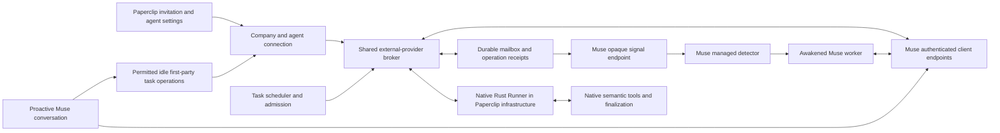

# Bring personal Muse onto the shared external Runner

Date: 2026-10-09. Status: historical investigation and implementation plan.
Implementation continued on October 10 using the [accepted architecture](2026-10-10-muse-runner-architecture.md)
and `origin/master` at `0e37a385e678d1a568f483c31ae1c19024d2df98`.
The baseline table below records the original investigation. Live qualification
has not started; see the [current compatibility limit](../muse-personal-agent.md#current-compatibility-limit).

## Recommendation

Keep Muse's proven receiver transport, but move task execution onto the external-provider Runner path now used by OpenAI Dot. Reuse Dot's invitation experience, durable operation receipts, controller recovery, native completion, and Cloud execution support. Do not restore a second Muse-specific Runner lifecycle.

This connects the user's existing **personal Muse at muse.ai**, not a coding CLI or a model API. Muse keeps its own tools and permission system. Paperclip supplies company identity, task collaboration, execution authority, and durable delivery.

The work needs a selective port onto current master. The prior Muse implementation predates the merged MCP foundation, the new agent lifecycle, and several Dot improvements. A wholesale merge produces 82 conflicted files, including generated contracts and migration metadata.

## Baseline and evidence

| Source | Inspected state | What it establishes |
| --- | --- | --- |
| Paperclip | `origin/master` at `417db14e7dfce7109e254a6f2cf410b6103fd037` | Current implementation baseline; new worktree/branch `codex/muse-dot-refresh` starts here. |
| Earlier Muse work | `codex/muse-runner` preserved at snapshot `1dfdc7b7dbae9debe8ca86bbcdb4492dc2b277d1` | Recoverable implementation, tests, synthetic task evidence, and qualification tooling. It has **not** been merged into this baseline. |
| Paperclip Cloud | `origin/master` at `282f5b2f` | Current tenant routing and Dot protocol ingress; inspected without changing the existing Cloud checkout. |
| Dot implementation | [#15402](https://github.com/paperclipai/paperclip/pull/15402), [#15414](https://github.com/paperclipai/paperclip/pull/15414), [#15581](https://github.com/paperclipai/paperclip/pull/15581), [#15691](https://github.com/paperclipai/paperclip/pull/15691), [#15722](https://github.com/paperclipai/paperclip/pull/15722), [#15734](https://github.com/paperclipai/paperclip/pull/15734) | Merged delivery, governed tools, invitations, managed Cloud execution, pairing fixes, and provider-native tool guidance. |
| Dot live evidence | [Current Dot documentation](../openai-dot-runner.md) and the existing Dot integration chat | Previously recorded real Dot assignment, document, proactive intake, and Cloud walkthrough. This investigation did not rerun those live tests. |
| Muse live evidence | Stopped personal-agent experiment | Four unattended replies with a 60-second hook. Connectivity proof only; no five-second, full-task, or 24-hour qualification. |

The old Muse worktree was removed by startup cleanup. Its Git snapshot was recovered and the branch moved forward to preserve it. Primary Paperclip and Cloud checkout edits were left untouched. Older Muse test results describe that snapshot only; they do not validate the proposed port.

## What Dot has that Muse should inherit

| Area | Current Dot implementation | Muse decision |
| --- | --- | --- |
| Invitation | New Agent → Invite an external agent; server-owned unfinished invitation, normal hire approvals, live verification | Add a Muse preset to the real shared flow. Keep Muse's name/role and its three distinct verification milestones. |
| Identity | Dedicated agent grant/resource, authorizing user recorded, company and agent binding | Reuse the authorization boundaries and credential primitives. Keep Muse's ticket-to-private-client setup; do not require ChatGPT plugin/OAuth UI. |
| Delivery | Durable assignment, ordered mailbox, stable operation IDs and payload digests | Share the lifecycle and receipt logic; adapt mailbox notification to Muse's opaque hook signal. |
| Execution | Rust Runner owns acceptance, tools, checkpoint recovery, and canonical completion | Replace the old Muse HTTP-polling Runner backend with this external-provider bridge. |
| Native authority | Run/session/turn, assignment revision, controller lease, task ownership, approvals, pause, and budgets checked | Use the current authority checks, including private task/project visibility. The old Muse ownership checks alone are insufficient. |
| Follow-up | Comments reach the current assignment; delivery is consumed only after an exact task-history receipt | Reuse for ordinary comments; retain structured clarification answers through the existing interaction contracts. |
| Proactive work | Idle capability discovery and `request_turn`, admitted through ordinary task/Runner scheduling | Add this admission path while retaining the original Muse requirement for permitted idle read/search/create/comment operations. |
| Cloud | Managed Runner sandbox, artifact capability checks, authenticated reconnect, bounded tenant protocol ingress | Extend the same paths for Muse; no local-process fallback on a Cloud control-plane host. |
| Tool guidance | Explicitly permits the external agent's own apps/tools; setup restrictions do not become permanent | Reuse generic external-agent guidance. Muse first release exposes only first-party Paperclip capabilities. |
| Usage | Unknown provider usage/cost remain unavailable | Keep this behavior; Paperclip budget gates do not imply control over Muse's independent spending. |

Two Dot policies must **not** become Muse defaults:

- Dot now uses rotating, non-expiring refresh credentials. Muse retains 15-minute access and rotating refresh credentials with a 30-day inactivity expiry.
- Dot can fence a terminal assignment and admit later work even when external stopping is unconfirmed. Muse must retain an overlap block after uncertain claimed work. A fence revokes authority; it does not prove the remote work stopped.

Dot's MCP Events webhook is its own transport capability. Nothing inspected proves personal Muse supports the same event subscription. Use the demonstrated managed-hook mechanism unless a separate capability test establishes an equivalent push path.

## Target architecture

A signal contains no task content or worker credential. An empty check never wakes the model. The authenticated worker claims one assignment, accepts it through the Runner, and submits operations with stable identities. Transport receipt, worker progress, accepted result, and native task finalization remain separate facts.

Runner infrastructure is allocated for admitted work, not for an idle connection. A managed Runner sandbox does not itself grant Muse workspace commands or third-party Paperclip tools.

### A small shared core, with provider-specific transport

1. Generalize the existing [external-provider contract](../../packages/paperclip-runner/src/contracts/external-provider.ts), [Dot Runner driver](../../packages/paperclip-runner/src/drivers/dot/runnerd-dot-driver.ts), and [Rust backend](../../packages/paperclip-runner/runner/crates/runner-core/src/dot_provider_backend.rs). Extract the common acceptance/tool/progress/finish/recovery state machine. Keep Dot's existing driver kind, command IDs, wire revision, and checkpoint reader compatible.
2. Extract authority validation, durable operation admission/settlement, mailbox ordering, and follow-up handling from the [Dot broker](../../server/src/services/dot-runner-broker.ts) behind explicit provider binding/storage adapters. Do not build a general plugin framework or generic ORM. Shared code receives a validated agent principal; the transport remains responsible for authenticating its own credential type.
3. Keep Dot's existing tables and deployed OAuth grants intact. Port Muse connection/token and delivery records additively, with the fields needed for binding generation, assignment revision, controller generation, semantic digest, source event, and consumed-input receipts. Both providers exercise the same broker invariants through their storage adapters. No bulk rename or migration of live Dot assignments is required for this release.
4. Supply a Muse adapter for signal, pairing, refresh, authenticated claim, operations, input/control reads, and connection health. Retain the old detector/client assets where appropriate, but update them to the shared operation protocol. Remove the old separate Muse Runner transport credential and HTTP-polling backend where the existing PRP command lane replaces them.
5. Register `provider: "muse"` in the current native contract generation, provider resolver, capability manifest, artifact selection, recovery, and accounting projections. Generate current contracts; do not copy the old V5 contract edits or old generated artifacts. Remote Runner artifacts must explicitly advertise Muse support before launch.

Provider policy is explicit and server-controlled: credential inactivity, run lease bounds, stop confirmation, and readiness differ. Muse credentials must not authenticate as Dot or through the human `/mcp/paperclip` connection. Dot credentials must not access a Muse binding.

### Authorization and lifecycle details

- **Pairing:** operator creates an agent/company-bound invitation through the agent lifecycle module. Preserve hire approval and the authorizing user. Use a ten-minute, single-use ticket; Muse exchanges it directly into private storage. No durable secret in clipboard instructions, browser persistence, model-visible output, hook code, or logs.
- **Refresh:** rotate atomically; replay revokes the credential family. Serialize refresh in the client so concurrent Muse conversations do not accidentally reuse a rotated token. A public detector poll does not extend authenticated inactivity. After 30 inactive days, reconnect is required.
- **Idle authority:** identify the connection; list/search/read authorized company work; create tasks and comment under normal agent permissions. Stable write receipts prevent duplicates. Task creation does not authorize execution. A proactive request to perform work uses normal admission and returns a visible task/run receipt.
- **Active authority:** validate company, agent, binding generation, assignment revision, run/session/turn, current controller lease, checkout/review ownership, pause/approval/budget gates, and task/project ACLs on every execution operation. Do not let idle endpoints complete work, publish run deliverables, or change execution state.
- **Claim versus accept:** claim reserves the sole assignment; Runner acceptance grants execution. If the acceptance response is lost, retry the same operation. Never treat a repeated wake as permission to repeat prior effects.
- **Completion:** Muse invokes the native completion operation, observes the accepted canonical report, then submits that report through the external finish operation. A webhook/HTTP callback cannot directly complete the task. Pending semantic tools block completion.
- **Stopping:** revoke run authority immediately and deliver a durable best-effort stop. Keep an uncertain assignment blocked across server restart, reconnect, and credential rotation. Clear it only after a run-specific worker stop confirmation with defined semantics, or a separately recorded operator attestation. Display those evidence types distinctly; neither claims all private Muse activity stopped. Merely seeing the stop message is not confirmation.
- **Disconnect:** revoke access, refresh, and active authority immediately. The signal tells the detector to disable itself; cleanup remains unconfirmed until observed. Turning off the experimental flag must still permit bounded cleanup/status handling without admitting new work.
- **Wake suppression:** new assignments, unanswered inputs, and external follow-ups may wake Muse. Its own progress, comments, acceptance, and completion acknowledgements do not create loops. Read/consumption receipts, not signal delivery, retire inputs.

## User journey and UI changes

Use [ExternalAgentInviteContent](../../ui/src/components/new-agent/ExternalAgentInviteContent.tsx), [ExternalAgentInviteDialog](../../ui/src/components/new-agent/ExternalAgentInviteDialog.tsx), and the existing [guided Storybook journeys](../../ui/storybook/stories/external-agent-invite/journeys.stories.tsx). Generalize their provider presentation and connection watcher; do not duplicate the dialog or revive the earlier standalone Muse wizard.

| Moment | Muse experience | Required change |
| --- | --- | --- |
| Choose | New Agent → Invite an external agent → **Muse — Personal agent** | Add a gated preset explaining that it connects the user's existing Muse and capabilities. Keep Dot/Hermes/Other behavior unchanged. |
| Identify | Name and role, then Continue | A compact step using existing fields; company-scoped non-secret draft survives navigation/reload. No model, computer, repo, or API-key fields. |
| Connect | Copy setup instructions; Open Muse; paste in the current conversation | Ticket is transient. Server owns the resumable invitation and normal approval state. An expired prompt can be renewed without revoking a concurrent successful pairing. |
| Approve | Muse requests its normal hostname approval | Explain the standing approval covers the hostname. Paperclip cannot grant it or infer it from silence. |
| Verify | **Muse paired → Receiver detected → Background reply verified** | Start one idempotent background challenge after receiver detection. Require a separate authenticated worker reply. Agent lifecycle readiness must also succeed. |
| Work | Assign an ordinary task; **Waiting for Muse** until claimed | Show submitted progress, structured questions, documents, and native run outcome in the existing task thread. No invented private tool trace. |
| Maintain | Connection status, Test connection, Repair setup, Pause, Disconnect | Show last signal contact, authenticated worker activity, last verified reply, installed version, and current assignment/stop status. |

Reuse the current server-owned invitation recovery pattern from [dot-invitations.ts](../../server/src/services/dot-invitations.ts), parameterized by provider and operator/company. Resume only that operator's unfinished invitation. Preserve the exact connection reference and configuration revision when rotating setup. Secrets must not enter query caches or draft persistence. The footer remains one row, with Back/Save & exit on the left and the primary action on the right.

For errors, distinguish a failed UI status request, unreachable Paperclip hostname, expired credentials, stale detector, and missing worker reply. Show **Open Muse** for a reported permission request. Otherwise show **No recent response**; do not label a silent worker as a permission failure. Explain stop-unconfirmed and cleanup-unconfirmed states with one clear repair action.

Reuse [external-agent-guidance.ts](../../packages/shared/src/external-agent-guidance.ts): Paperclip's catalog describes this connection, not everything Muse can do. Muse may use its own approved apps and tools. Installation must register discoverable client instructions in Muse's supported persistent environment; prove proactive use from another conversation rather than assuming installation establishes discoverability.

## Cloud and protocol routing

Extend Cloud's existing exact method/path tenant protocol allowlist, next to `isTenantDotProtocolRequest` in `paperclip-cloud/src/service/app.ts`. Route only the versioned receiver assets and bounded pairing/refresh/signal/claim/operation/control/agent-gateway endpoints that the final Muse protocol needs. Keep board management behind normal tenant browser authentication.

Host resolution selects the tenant; tenant-issued credentials select the company/agent. Strip spoofed Cloud identity headers. Do not add an arbitrary `/api/muse/*` proxy exemption, route through the human MCP identity, or require a logged-in Cloud browser for receiver calls. Test invalid methods, encoded path variants, cross-tenant credentials, revoked access, unavailable tenants, and reconnect after a Cloud rollout.

Use current managed remote execution and artifact verification from [native-session-executor.ts](../../server/src/services/native-runtime/native-session-executor.ts). Preserve target-owned provider checkpoints, process identity checks, and controller reconnect grace. Missing state after dispatch requires reconciliation, not a fresh remote run.

Five-second polling is 17,280 empty checks per day per continuously idle connection. Measure ingress load, database writes, health timestamp accuracy, and interaction with Cloud sleep/wake behavior. Bound and coalesce health persistence without hiding stale contact; empty checks must not allocate Runner sandboxes. A capacity or sleep conflict is a release decision, not a reason to silently substitute a slower hook.

## Delivery sequence

### 1. Extract and protect the current Dot path

Scope: shared external-provider contracts, Rust state machine, TS driver, broker authority/receipts, and provider policy. Add Muse-compatible extension points while keeping Dot's public tools, OAuth policy, storage, and checkpoint compatibility unchanged.

Acceptance: existing Dot protocol/onboarding/invitation/driver tests plus Rust tests pass; a captured Dot checkpoint and in-flight operation recover across the extraction; no new duplicated execution state machine. Include a regression proving Dot retains its own refresh/stop policy.

### 2. Port the Muse vertical slice

Scope: selective source recovery from `codex/muse-runner`; new migrations generated against current master; Muse binding/token and transport adapter; updated receiver/client; native provider registration and feature gate. Port test intent and fixtures, not historical migration numbers/journals or generated snapshots.

Acceptance: simulated receiver pairs, passes an independent background challenge, claims a real task, publishes a document through native tools, and finalizes through the same Runner used by Dot. Verify both local and managed-launch fixtures. A submitted result without native completion must fail. Receiver polling alone must never make setup ready.

### 3. Complete collaboration, recovery, and stopping

Scope: permitted idle operations, proactive `request_turn`, structured clarification, current-assignment follow-ups, reconnect, credential rotation, cancellation, revocation, and uncertain-stop blocking. Reuse [Dot follow-up handling](../../server/src/services/dot-assignment-follow-up.ts) and native question response delivery.

Acceptance: two sequential task assignments; a question answered in Paperclip resumes the original assignment; comments consumed once; agent attribution and authorizing-user audit; a cancelled claimed assignment cannot be replaced while stopping is unconfirmed. Restart, controller takeover, and lost responses never duplicate uncertain side effects.

### 4. Finish invitation, settings, and Cloud integration

Scope: real shared invitation components, Muse connection settings, API/shared contract synchronization, lifecycle integration, guided Storybook, current Cloud allowlist, and managed Runner artifact support.

Acceptance: hire approval, name/role draft, reload/resume, concurrent setup windows, unreachable host, reported permission request, expired connection, stale receiver, and unconfirmed stopping all have tested states. Verify exact Cloud tenant ingress and sandbox cleanup. No old local-only launch fallback, secret persistence, or extra wizard footer.

### 5. Qualify personal Muse before enabling it

First prove a real research/document task, a clarification answered in Paperclip, a follow-up assignment, and proactive read/create/comment from a fresh Muse conversation. Then run a new bounded 24-hour qualification with at least 20 unattended samples and sustained idle periods. The previous experiment remains stopped; none of its replies count toward this run.

Use the recovered qualification tooling after adapting it to the new receipts and generation identities. Schedule deterministic sample slots; never enqueue over active or uncertain work. A simulated worker or direct chat intervention cannot make an unattended sample pass. Preserve intervention and outage classifications in secret-free evidence.

Record requested hook interval and actual signal-contact gaps separately. Predeclare the five-second qualification threshold (the earlier harness used at least 90% of steady-state gaps at seven seconds or less); retain a sustained idle window of at least two hours. Separate scheduler queue-to-offer, queue-to-authenticated-claim, claim-to-accepted-result, and queue-to-native-finalization latency. Report counts, tails, missing claims, pending results, and failures, not only averages.

At the deadline, revoke qualification authority and request detector cleanup even after a watcher error or restart. Persist the deadline and cleanup state; retry failed cleanup and show unconfirmed remote cleanup honestly. Failure to sustain faster polling blocks release pending an explicit product decision; there is no hidden 60-second fallback.

## Verification and release gates

| Boundary | Required proof |
| --- | --- |
| Identity | Cross-company/agent/provider/tenant denial; expired/replayed pairing; refresh rotation and replay; removed operator access; hire approvals; agent attribution; private task/project ACLs. |
| Delivery | Duplicate signals; competing claims; one active assignment; reordered mailbox commits; multiple HTTP replicas; stable input/operation IDs; bounded payloads; no model wake on empty/error polls. |
| Recovery | Server restart and controller takeover; delayed results; lost acceptance/tool response; missing checkpoint; disconnect/reconnect; no automatic replay of claimed uncertain work. |
| Lifecycle | Reassignment, pause, company pause, budget stop, cancellation, disconnect, feature disable; authority immediately fenced; stopping blocks overlap until the required evidence exists. |
| Completion | Native semantic receipt and canonical report required; no completion through idle API or bare callback; questions/documents/deliverables use existing contracts. |
| UI | Real-component Storybook journeys, setup reload/resume, concurrent pairing, approval pending, receiver-only contact, expired credentials, missing reply, stop/cleanup unconfirmed. |
| Cloud | Bounded anonymous protocol routes, no browser-session dependency or identity spoofing, correct tenant, verified Muse-capable Runner artifact, reconnect and sandbox cleanup. |
| Personal Muse | Research/document, clarification, follow-up, fresh-conversation proactive use, then 24 hours / ≥20 unattended samples with measured faster cadence. |

Run targeted server protocol, receiver/client, native Runner/Rust, UI, and Cloud routing tests first. Before implementation handoff, run repository-required `pnpm -r typecheck`, `pnpm test:run`, `pnpm build`, token gates, and Storybook; run the companion Cloud checks for changed ingress. Record any failures and their scope. Re-run Dot's relevant tests alongside Muse throughout the extraction.

Keep the Muse provider experimental and off until the live gates pass. Do not include third-party Paperclip tool grants, workspace command access, a Muse cookie login, or a new public model API in this release. Dot's additional capabilities can be evaluated later without broadening this port.

## Next concrete step

Start with the shared external-provider extraction and Dot regression fixtures, then port the Muse vertical slice. This plan does not install a receiver, provision new personal Muse access, or restart a live test. Make the receiver assets, permissions, qualification schedule, and cleanup reviewable before the later live-installation step.
