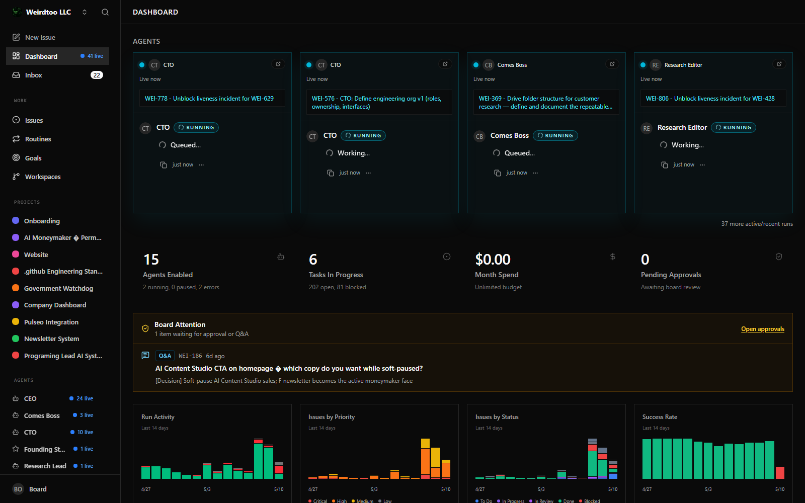
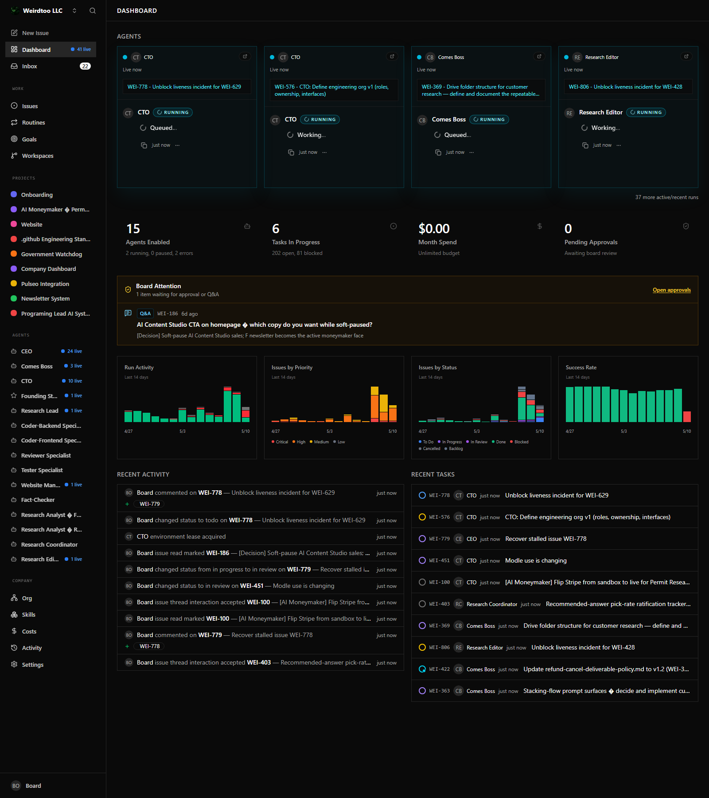

# Automated Dashboard Attention Update

This is an automated update prepared from the Paperclip fork branch `wei-446-stale-checkout-runid-broaden` for review against upstream `master`.

## What changed

- Added a `DashboardSummary.attention` payload that surfaces board-facing work needing human approval, confirmation, or Q&A.
- Added a Board Attention panel to the company dashboard.
- Linked attention rows back to their Paperclip issue or approval target.
- Updated Codex local defaults so GPT-5.5 is the primary model path, with mini/cheap model support retained.
- Kept the prior stale execution recovery and Windows symlink fallback fixes in the same branch.

## Screenshots

I forgot to capture before screenshots. These are after-only screenshots from the current local run.

## Related issues

- `WEI-446` - stale checkout/run ownership recovery work on this branch.
- `WEI-456` - Windows symlink fallback for Codex local home/plugin setup.
- `WEI-186` - visible in the captured dashboard as a board attention/Q&A item.
- Live attention examples from the dashboard API during verification included `WEI-739`, `WEI-717`, `WEI-563`, `WEI-521`, `WEI-611`, and `WEI-588`.

## Testing status

This is an automated push/update and has not been fully or properly tested in accordance with the project docs.

Completed checks:

- `corepack pnpm --filter @paperclipai/shared typecheck`
- `corepack pnpm --filter @paperclipai/server typecheck`
- `corepack pnpm --filter @paperclipai/ui typecheck`
- `corepack pnpm exec vitest run server/src/__tests__/dashboard-service.test.ts`
- `corepack pnpm --filter @paperclipai/ui build`
- Local Paperclip server health check at `http://127.0.0.1:3100/api/health`
- Live dashboard attention API check against the local company dashboard endpoint

Known caveats:

- No before screenshots were captured.
- Browser screenshot verification was after-only.
- This was not exercised through the full project release/test procedure from the docs.
