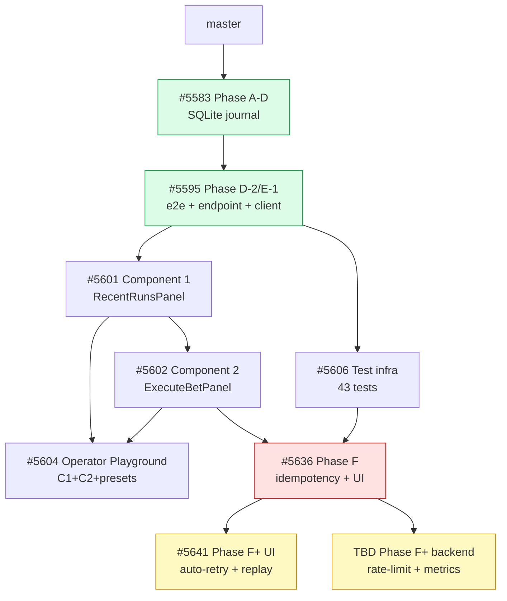

# BBA Memory — Tactical Merge Runbook

**Author**: Claude Sonnet (release coordinator)  
**Date**: 2026-05-10  
**Audience**: Maintainer (cryppadotta, devinfoley) executing the BBA merge sequence  
**Last verified**: All PR statuses checked via `gh pr list` on 2026-05-10

---

## PR Inventory

| PR | Branch | Title | State | Notes |
|----|--------|-------|-------|-------|
| [#5583](https://github.com/paperclipai/paperclip/pull/5583) | `feat/bba-memory-phase-a` | Phase A-D — SQLite run journal + instrumentation | Open | Base PR, must merge first |
| [#5595](https://github.com/paperclipai/paperclip/pull/5595) | `feat/bba-memory-phase-d-2-e2e-route` | Phase D-2 e2e + E-1 endpoint + UI client + route discovery | Open | Stacked on #5583 |
| [#5601](https://github.com/paperclipai/paperclip/pull/5601) | `feat/bba-memory-ui-component-1` | Component 1 — BbaMemoryRecentRunsPanel (no tests) | Open | Stacked on #5595 |
| [#5602](https://github.com/paperclipai/paperclip/pull/5602) | `feat/bba-memory-ui-component-2` | Component 2 — execute bet panel (HIGH RISK) | Open | Stacked on #5601 |
| [#5604](https://github.com/paperclipai/paperclip/pull/5604) | `feat/bba-memory-ui-operator-playground` | BbaOperatorPlayground — combines C1+C2 with presets | Open | Parallel with C2, merge after C2 |
| [#5606](https://github.com/paperclipai/paperclip/pull/5606) | `feat/bba-memory-ui-tests-infra` | Testing infra + 43 tests + useBbaMemoryRuns hook | Open | Can merge anytime after #5601; needed before demo |
| [#5636](https://github.com/paperclipai/paperclip/pull/5636) | `feat/bba-memory-phase-f-hardening` | Phase F backend hardening + UI follow-ups | Open, **REQUEST CHANGES** | Needs scope-creep split first — see split plan |
| [#5641](https://github.com/paperclipai/paperclip/pull/5641) | `feat/bba-memory-phase-f-ui-plus` | Phase F+ UI — auto-retry + replay banner + docs | Draft | Stacked on #5636 |
| TBD | `feat/bba-memory-phase-f-backend-plus` | Phase F+ backend — rate limiter + metrics + DELETE + tests | Draft (Codex branch) | Parallel with #5641, merge after #5636 |
| [#5641 docs](https://github.com/paperclipai/paperclip/pull/TBD) | `docs/bba-memory-phase-f-closure` | Split plan + merge runbook + demo readiness | Draft | Docs only, can merge anytime |

---

## Dependency Graph



**ASCII fallback** (if Mermaid not rendered):

```
master
  └─ #5583 (Phase A-D)
       └─ #5595 (Phase D-2/E-1)
            ├─ #5601 (Component 1)
            │    ├─ #5602 (Component 2)  ←── also needs #5606
            │    │    ├─ #5604 (Playground)
            │    │    └─ #5636 (Phase F)  [BLOCKED: scope-creep split required]
            │    │         ├─ #5641 (Phase F+ UI)
            │    │         └─ TBD (Phase F+ backend / Codex)
            │    └─ #5604 (Playground)
            └─ #5606 (Test infra)  ─────────┘ (also unblocks #5636)
```

---

## Recommended Merge Order

Follow this sequence. **Do not merge out of order** — each step resolves a dependency for the next.

### Pre-merge: Split #5636 first

Before touching any PRs, execute the scope-creep split per [`docs/bba-memory-pr-5636-split-plan.md`](bba-memory-pr-5636-split-plan.md). This creates:
- `chore/extract-cdp-and-migration-idempotency` PR (new, fast review)
- Cleaned-up #5636 (force-pushed, ~200 line diff)

| Step | PR | Action | Estimated review time | Notes |
|------|-----|--------|----------------------|-------|
| 0 | Split extraction PR | Create + review + merge | 20 min | Straightforward; no BBA stack dependency |
| 1 | #5583 Phase A-D | Review + squash merge | 30 min | Foundation — SQLite schema, seeds, repo layer |
| 2 | #5595 Phase D-2/E-1 | Review + squash merge | 45 min | After #5583 merges; e2e tests + server routes |
| 3 | #5606 Test infra | Review + squash merge | 30 min | Can parallelize with #5601; needed before #5636 |
| 4 | #5601 Component 1 | Review + squash merge | 20 min | After #5595; UI read-only component |
| 5 | #5602 Component 2 | Review + squash merge | 45 min | HIGH RISK — execute bet. Needs careful review |
| 6 | #5604 Operator Playground | Review + squash merge | 20 min | After #5601 + #5602 |
| 7 | #5636 Phase F | Review + squash merge | 30 min | After split + #5602 + #5606 |
| 8 | TBD Phase F+ backend | Review + squash merge | 45 min | After #5636; Codex's rate-limit + metrics PR |
| 9 | #5641 Phase F+ UI | Review + squash merge | 20 min | After #5636 |
| 10 | Closure docs PR | Squash merge | 5 min | After #5641; docs only |

**Rationale for ordering**:
- #5583 before everything: BBA Memory SQLite schema must exist before any service code.
- #5606 before #5636: Phase F tests (when written) depend on the test-infra PR's `@testing-library/react` setup.
- #5602 before #5604: Playground embeds both C1 and C2 components.
- #5636 before Phase F+ PRs: Phase F+ branches are stacked on Phase F.
- Split extraction PR can merge at any time independently.

---

## Conflict-Risk Matrix

| PR pair | Risk | What conflicts | Mitigation |
|---------|------|----------------|-----------|
| #5601 + #5606 | Medium | `ui/src/components/bba-memory/` directory — both add files | Merge #5601 first; #5606 likely rebases cleanly |
| #5595 + #5636 | Low | `server/src/routes/betting-browser-automation.ts` — both touch route registration | #5595 merges first; #5636 will have minor rebase conflict on route registration line |
| #5636 + TBD backend | Medium | `server/src/routes/betting-browser-automation.ts` — rate-limiter middleware insertion point | Codex should rebase TBD after #5636 merges; review diff carefully before merge |
| #5641 + master drift | Low | `ui/src/api/bbaMemory.ts` — unlikely to be touched by unrelated master PRs | Rebase before merge if master has diverged >1 week |
| Any BBA PR + master merges | Low | `pnpm-lock.yaml` — frequent lockfile updates | Run `pnpm install` after rebase, add lockfile update to commit |

---

## Rollback Plan

Each PR merged via squash creates a single revertible commit. For any PR N that causes a production issue after merge:

```bash
# 1. Find the merge commit SHA
git log --oneline master | grep "PR #N"

# 2. Create a revert branch
git checkout -b revert/bba-memory-pr-N origin/master
git revert <merge-commit-sha>
git push -u origin revert/bba-memory-pr-N

# 3. Open emergency PR
gh pr create --repo paperclipai/paperclip \
  --base master \
  --title "revert(bba-memory): revert PR #N — <reason>" \
  --body "Emergency revert. Original PR: #N."

# 4. After merge, notify team and update bba-memory.md
```

**PR-specific rollback notes**:

| PR | Rollback complexity | Data migration concern |
|----|--------------------|-----------------------|
| #5583 | Low | SQLite DB created but can be deleted (`~/.paperclip/bba-memory/bba-memory.db`). No Postgres migration. |
| #5595 | Medium | Removes API routes; clients will 404. Acceptable brief outage. |
| #5601, #5602, #5604 | Low | UI-only; no data side-effects. |
| #5606 | Low | Test-only; no runtime impact. |
| #5636 | Medium | `idempotency_keys` table stays in SQLite after revert (schema not rolled back). Harmless orphan table. Route revert means no new keys written. |
| #5641 | Low | UI-only changes to `executeBbaBet` + `BbaMemoryExecuteBetPanel`. |

---

## ARM (Auto-Merge) Eligibility

Auto-merge via GitHub's merge queue is appropriate when: CI passes + at least 1 reviewer approval + no pending review requests.

| PR | ARM eligible? | Reason |
|----|--------------|--------|
| #5583 | ✅ Yes | Schema + repo layer; no runtime risk |
| #5595 | ✅ Yes | E2E tests pass; no UI or route risk beyond BBA routes |
| #5601 | ✅ Yes | Read-only UI component |
| #5606 | ✅ Yes | Test-only PR |
| #5602 | ⚠️ Manual recommended | HIGH RISK — bet execution. Require human sign-off. |
| #5604 | ✅ Yes | UI composition of already-reviewed C1+C2 |
| #5636 | ⚠️ Manual recommended | Backend route change; request changes outstanding |
| #5641 | ✅ Yes (after #5636) | UI client refactor + docs |
| TBD backend | ⚠️ Manual recommended | Rate-limiter middleware + new endpoints |
| Closure docs | ✅ Yes | Docs only |

---

## Pre-Merge Checklist per PR

Run before clicking Merge on each PR:

```bash
# 1. CI is green
gh pr checks <PR-number> --repo paperclipai/paperclip

# 2. Branch is up to date with master
git fetch origin
git log origin/master..origin/<branch-name> --oneline  # should be empty after rebase

# 3. Diff makes sense (no accidental files)
gh pr diff <PR-number> --repo paperclipai/paperclip | head -50

# 4. No pending review requests
gh pr view <PR-number> --repo paperclipai/paperclip --json reviewRequests

# 5. For HIGH RISK PRs (#5602, #5636): confirm with Costel before merging
```

---

## Merge Window Recommendation

- Avoid merging on Friday afternoons or Saturday (no monitoring coverage).
- Merge #5583 → #5595 → #5606 → #5601 → #5602 in one session (order matters, ~3h).
- Allow 24h of production soak on #5602 before merging Phase F (#5636).
- Merge Phase F+ PRs (#5641, TBD backend) after Phase F has soaked 24h.
