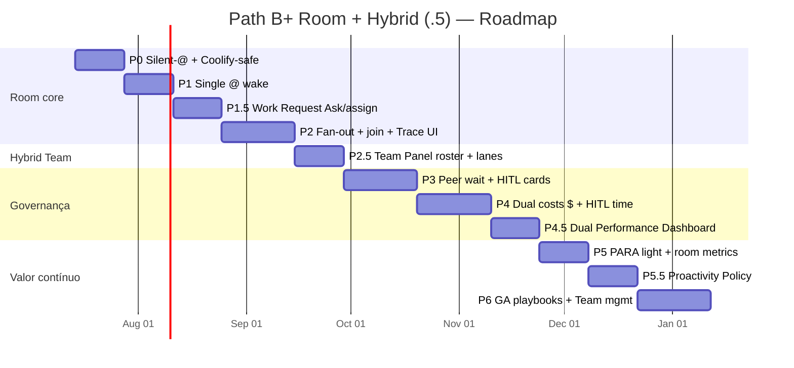

# Paperclip Conference Room (Slack + @agents + A2A) — Implementation Plan

> **For agentic workers:** REQUIRED SUB-SKILL: Use superpowers:subagent-driven-development (recommended) or superpowers:executing-plans to implement this plan phase-by-phase. Checkboxes (`- [ ]`) in each phase DoD are the tracking surface. **Do not start coding until Cycle 5 / 5B / 5C tech specs exist.** Room: `cycle-5-tech-specs/`. Hybrid `.5`: `cycle-5b-clickup-tech-specs/` (e, quando existir, `cycle-5c-hybrid-tech-specs/`).

**Goal:** Entregar no fork `QuadriniL/paperclip` Path **B+** (canônico): Conference Room estilo Slack (silent-until-@, wake real, fan-out/join A2A, HITL) **mais** Hybrid Team & Performance (P1.5 Work Request, P2.5 Team Panel, P4.5 Dual Performance, P5.5 Proactivity Policy) — beachhead Software Houses.

**Architecture:** Path **B+** (Slack+@ **+** Team/Insights) só no fork Paperclip (BizCursor desktop pausado). Mentions/Ask orquestram `paperclipDelegate` / `wait:false`+`waitAllSec`; A2A fan-out é app-level. Team Panel unifica humano+AI (gap ClickUp). Feature flag Coolify-safe; DelegationTrace Board-first; performance **fora** do stream.

**Tech Stack:** Paperclip fork (Board Web + control plane), adapters `opencode_local` / `cursor_cloud`, Coolify deploy, A2A task states nativos, cost-events, membership humano+agente.

**Path canônico:** **B+** (D-09…D-13 travadas).  
**Produto autoritativo (quando existir):** [`docs/research/slack-a2a-room/cycle-4c-hybrid-plan/00-PRODUCT-PLAN-HYBRID-V2.md`](../research/slack-a2a-room/cycle-4c-hybrid-plan/00-PRODUCT-PLAN-HYBRID-V2.md) — *escrito em paralelo; se o arquivo ainda não existir, usar 4B abaixo até o V2 aterrissar.*  
**Fallback híbrido (4B):** [`docs/research/slack-a2a-room/cycle-4b-clickup-plan/00-PRODUCT-PLAN-HYBRID.md`](../research/slack-a2a-room/cycle-4b-clickup-plan/00-PRODUCT-PLAN-HYBRID.md)  
**Sala (Cycle 4):** [`docs/research/slack-a2a-room/cycle-4-plan/00-PRODUCT-PLAN.md`](../research/slack-a2a-room/cycle-4-plan/00-PRODUCT-PLAN.md)  
**Nota espelho:** [`docs/research/slack-a2a-room/cycle-4c-hybrid-plan/04-plan-mirror-note.md`](../research/slack-a2a-room/cycle-4c-hybrid-plan/04-plan-mirror-note.md)

---

## UPDATE 2026-07-09 C — Path B+ canônico + fases `.5` + árvore 1c…5c

> **Status:** **Path B+ é canônico** para agentes. Este arquivo é o **plano espelho executável** (checkboxes / DoD).  
> **Autoridade de produto:** preferir Cycle **4C** V2 quando existir; senão 4B. Em conflito 4C ≻ 4B ≻ 4 (sala).  
> **Autoridade técnica:** Room P0–P6 → `cycle-5-tech-specs/`; híbrido P1.5 / P2.5 / P4.5 / P5.5 → `cycle-5b-clickup-tech-specs/` (e `cycle-5c-hybrid-tech-specs/` quando existir).

### O que mudou vs UPDATE B+

| Antes (UPDATE B / 4B) | Agora (UPDATE C / alinhado 3C+5B) |
|---------------------|--------------------------------|
| Work Request “dentro” de P1 | **P1.5** fase própria (Ask / assign-delegate / templates) |
| Dual Performance “dentro” de P5 | **P4.5** Dual Performance Dashboard (fora do stream) |
| Proatividade só como princípio D-10 | **P5.5** Proactivity Policy (whitelist; Room silent) |
| P2.5 único `.5` explícito | **P1.5 + P2.5 + P4.5 + P5.5** no roadmap |
| Pesquisa 1–5 + 1B–5B | Árvore completa também com **cycle-1c…5c** |
| Canônico = 4B | Canônico produto = **4C V2** (path abaixo); espelho = este arquivo |

### Ordem canônica de entrega (agentes)

```text
P0 → P1 → P1.5 → P2 → P2.5 → P3 → P4 → P4.5 → P5 → P5.5 → P6
```

Paralelismo permitido (ver DAG 5B): P2.5 ∥ P1.5 após P1; P5.5 pode iniciar após P0; P4.5 espera P4 (+ telemetria P5-R).

### Árvore de pesquisa (três linhas)

| Linha | Pastas | Uso |
|-------|--------|-----|
| **A — Room/A2A** | `cycle-1` … `cycle-5-tech-specs` | P0–P6 sala |
| **B — ClickUp** | `cycle-1b` … `cycle-5b-clickup-tech-specs` | SPECs `.5` atuais |
| **C — Hybrid consolidado** | `cycle-1c` … `cycle-5c-hybrid-tech-specs` | Discovery→plan V2→specs (4C/5C em escrita) |

**Paths âncora 4C / 5C (podem estar vazios até o parallel land):**

- [`cycle-4c-hybrid-plan/00-PRODUCT-PLAN-HYBRID-V2.md`](../research/slack-a2a-room/cycle-4c-hybrid-plan/00-PRODUCT-PLAN-HYBRID-V2.md)
- [`cycle-5c-hybrid-tech-specs/`](../research/slack-a2a-room/cycle-5c-hybrid-tech-specs/)

### Remapeamento de conteúdo legado neste arquivo

Seções P1/P4/P5 abaixo ainda descrevem affordances híbridas “embutidas” (UPDATE B). **Para execução, preferir as seções P1.5 / P2.5 / P4.5 / P5.5** e as SPECs 5B. Não apagar o legado — serve de contexto.

---

## UPDATE 2026-07-09 B+: Hybrid Team & Performance

> **Status:** histórico — merge B+ (D-09…D-13). **Superseded em autoridade por UPDATE C** (fases `.5` explícitas + 4C V2).  
> **Fonte canônica do produto híbrido (legado 4B):** [`docs/research/slack-a2a-room/cycle-4b-clickup-plan/00-PRODUCT-PLAN-HYBRID.md`](../research/slack-a2a-room/cycle-4b-clickup-plan/00-PRODUCT-PLAN-HYBRID.md)  
> **Descoberta:** [`docs/research/slack-a2a-room/cycle-1b-clickup-discovery/00-INDEX.md`](../research/slack-a2a-room/cycle-1b-clickup-discovery/00-INDEX.md)

### O que mudou vs Cycle 4 (só sala)

| Antes (Path B) | Agora (Path B+) |
|----------------|-----------------|
| P0–P6 = Room/A2A | **Mantém P0–P3** Room/A2A core |
| P1 = single `@` + cost pill | **P1 expandido:** Ask button + assign-as-delegate (D-12) |
| — | **NOVO P2.5:** Team Panel hybrid roster + workload lanes (D-13) |
| P4 = $/thread | **P4 expandido:** dual costs ($ agentic + tempo HITL humano) |
| P5 = PARA + weekly KPIs | **P5 expandido:** Dual Performance Dashboard (humano \| agente \| room) (D-11) |
| P6 = playbooks GA | **P6 expandido:** + Team management para Sofia |
| ~17 semanas | ~**20 semanas** |

### Decisões novas (travadas)

| ID | Decisão |
|----|---------|
| **D-09** | Path **B+**: Room + Hybrid Team & Performance |
| **D-10** | Proatividade governada (whitelist); Room = silent-until-@ |
| **D-11** | Performance **fora do stream** (Team / Insights) |
| **D-12** | Assign-as-delegate: humano = owner; agente = delegate |
| **D-13** | Roster AI Hub-like + Workload lanes no mesmo produto |

### Ordem de fases B+ (legado UPDATE B — ver UPDATE C)

```text
P0 → P1 (+Work Request) → P2 → P2.5 (Team Panel) → P3 → P4 (dual cost) → P5 (Dual Performance) → P6 (GA + Team mgmt)
```

> **UPDATE C:** ordem canônica agora inclui **P1.5 / P4.5 / P5.5** explícitos — ver topo do arquivo.

Agentes de implementação: produto → **4C V2** (se existir) senão **4B**; tech → SPECs 5 / 5B / 5C. Em conflito: **4C ≻ 4B ≻ 4**.

---

# Plano de Produto — Paperclip Path B+ (Room + Hybrid Team)

> **Ciclo:** 4 + 4B + **4C** — Planning  
> **Data:** 2026-07-09  
> **Produto:** Conference Room Slack + `@agents` + A2A **e** Hybrid Team & Performance (lente ClickUp / consolidado 1c–5c)  
> **Repo de implementação:** `QuadriniL/paperclip` (fork-only)  
> **BizCursor desktop:** **pausado**  
> **Fonte canônica híbrida (preferida):** [`docs/research/slack-a2a-room/cycle-4c-hybrid-plan/00-PRODUCT-PLAN-HYBRID-V2.md`](../research/slack-a2a-room/cycle-4c-hybrid-plan/00-PRODUCT-PLAN-HYBRID-V2.md) *(em escrita paralela)*  
> **Fallback híbrido:** [`docs/research/slack-a2a-room/cycle-4b-clickup-plan/00-PRODUCT-PLAN-HYBRID.md`](../research/slack-a2a-room/cycle-4b-clickup-plan/00-PRODUCT-PLAN-HYBRID.md)  
> **Fonte canônica sala (Cycle 4):** [`docs/research/slack-a2a-room/cycle-4-plan/00-PRODUCT-PLAN.md`](../research/slack-a2a-room/cycle-4-plan/00-PRODUCT-PLAN.md)

**NotebookLM (pré-plano):** overlap Villa CD/Stock/Financial/Sales = **não** · **GO** para planejar fora do processo Villa.

---

## 0. Sumário executivo

Construir, no Board do Paperclip (Coolify), um **sistema híbrido** onde:

1. Humanos e agentes coexistem em canais/threads (UX Slack / Claude Tag / Linear Agents).
2. Agentes ficam **silent-until-@** — só acordam quando mencionados (ou via Ask / assign-delegate).
3. `@A @B` dispara **fan-out A2A app-level** com **join** — não “mentions mágicas”.
4. Aba **Team** unifica roster + workload lanes (humano + AI) — gap que o ClickUp não fechou.
5. Custo **dual** ($ agentic + tempo HITL), Dual Performance (humano \| agente \| room) e owner humano — anti-hype Gartner.

**Não** vendemos autonomia 80%, ROAS mágico, “substitui o time”, nem AI Hub clone. Vendemos **ciclo de trabalho híbrido auditável**.

---

## 1. Contexto e decisões travadas

### 1.1 Decisões de produto (Decision Log)

| ID | Decisão | Status | Rationale (pesquisa) |
|----|---------|--------|----------------------|
| **D-01** | **Path B** — Slack + `@agents` (não Manus 1:1 puro) | Travada | Cycle 1: UX Linear/Slack/Teams; Cycle 2: Claude Tag / multiplayer async |
| **D-02** | **Fork-only** — implementação em `QuadriniL/paperclip` | Travada | Cycle 1 D4; BizCursor desktop pausado |
| **D-03** | **A2A fan-out é app-level** — orquestração Paperclip sobre N SendMessage/delegate; A2A ≠ sala | Travada | Cycle 1 D1 (spec v1.0.0); Cycle 2 claim confirmado |
| **D-04** | Reusar `run-delegation` + MCP `paperclipDelegate` + `wait:false` / `waitAllSec` | Travada | Cycle 2: fan-out+join **já existe**; falta bridge sala → A2A |
| **D-05** | Beachhead **Software Houses**; Support **secundário**; Marketing **não beachhead** (FLUFF ROAS) | Travada | Cycle 3 §2–§5 |
| **D-06** | Default **SAS → cascade MAS**; paralelo só com **quorum** (não barrier cego) | Travada | Cycle 2 (Gao / Aegean) |
| **D-07** | Humano owner sempre visível; silent-until-@ | Travada | Cycle 2 UX; Cycle 3 DoD beachhead |
| **D-08** | Wake via path **Coolify-safe** (`adapter_wake` / flag feature) — sem quebrar deploy | Travada | Cycle 1/2 gaps BoardChat + Coolify |
| **D-09** | Path **B+**: Room + Hybrid Team & Performance | Travada | Cycle 1B ClickUp; Cycle 4B |
| **D-10** | Proatividade **governada**; Room = silent-until-@ | Travada | Cycle 1B; anti-spam Gartner |
| **D-11** | Performance **fora do stream** (Team / Insights); dual Humano \| Agente \| Room | Travada | Cycle 1B |
| **D-12** | Assign-as-delegate: humano = owner; agente = delegate | Travada | Linear pattern; Cycle 1B |
| **D-13** | Roster AI Hub-like + Workload lanes no mesmo produto | Travada | Gap ClickUp capacity híbrida |

### 1.2 O que já existe vs. o que falta

| Capacidade | Estado no fork | Gap de produto |
|------------|----------------|----------------|
| `paperclipDelegate` / `run-delegation` | Implementado | Bridge a partir da sala |
| Fan-out `wait:false` + `waitAllSec` | Implementado | Trigger por `@A @B` no BoardChat |
| Mentions em issues | Wakeup independente | ≠ A2A join |
| BoardChat | Sempre concierge, sem `@` | Mentions + silent-until-@ + Ask |
| Humano POST delegate | Bloqueado (só agent JWT) | Room orchestrator no servidor (não Board JWT “fake agent”) |
| Modelo de sala + peer wait | Ausente | P0–P3 |
| Cost pill / budget na sala | Parcial (F3-ish no ecossistema) | P1 / P4 |
| DelegationTrace na sala Board | Ausente (existe rascunho no BizCursor pausado) | P2 no Board UI |
| Work Request (Ask / assign-delegate) | **Ausente** | **P1.5** |
| Workforce unificado (humano+AI) | **Ausente** | **P2.5** Team Panel |
| Dual cost ($ + HITL time) | **Ausente** | **P4** |
| Dual Performance Dashboard | **Ausente** | **P4.5** |
| Proactivity Policy (whitelist) | **Ausente** | **P5.5** |
| Team management Operator | **Ausente** | **P6** |

### 1.3 Princípios de entrega (anti-hype)

> Gartner (25 jun 2025): **>40%** dos projetos agentic cancelados até fim de 2027 — custos, valor unclear, risk controls fracos, “agent washing”.  
> McKinsey Agentic Mesh: orquestração + governança + trust humano; evitar agent sprawl.  
> ClickUp: AI Hub ≠ Workload unificado — oportunidade Paperclip B+.

**Tradução em DoD de produto:** escopo estreito por fase · KPIs de ciclo **e** capacidade híbrida · human gate · custo dual visível · performance fora do stream · sem claim de autonomia plena.

---

## 2. Roadmap visual (P0–P6 + P1.5 / P2.5 / P4.5 / P5.5)



```text
P0 → P1 → P1.5 → P2 → P2.5 → P3 → P4 → P4.5 → P5 → P5.5 → P6
```

| Fase | Nome | Duração alvo | Valor de negócio (1 linha) | SPEC |
|------|------|--------------|----------------------------|------|
| **P0** | Foundation — Silent-until-@ & Coolify path | **2 sem** | Sala segura sem spam; deploy não quebra | `cycle-5` P0 |
| **P1** | Single `@` wake real + cost pill base | **2 sem** | Wake do agente nomeado (não concierge) | `cycle-5` P1 |
| **P1.5** | **Work Request** — Ask / assign-delegate / templates | **2 sem** | Pedir trabalho à IA sem decorar slug; owner humano | `cycle-5b` P1.5 |
| **P2** | Fan-out & Join — `@A @B` + DelegationTrace | **3 sem** | Spike paralelo auditável (diferencial A2A) | `cycle-5` P2 |
| **P2.5** | **Team Panel** — roster híbrido + lanes | **2 sem** | EM vê carga humano+AI no mesmo painel | `cycle-5b` P2.5 |
| **P3** | Peer Wait & HITL — quorum + input-required | **3 sem** | Governança enterprise (approvals no thread) | `cycle-5` P3 |
| **P4** | **Dual costs** — $ agentic + tempo HITL + density | **3 sem** | ROI honesto (máquina + atenção humana) | `cycle-5` P4 |
| **P4.5** | **Dual Performance** — Humano \| Agente \| Room | **2 sem** | Insights fora do stream (D-11) | `cycle-5b` P4.5 |
| **P5** | PARA light + room metrics / weekly | **2 sem** | Memória scoped + KPIs de sala | `cycle-5` P5 |
| **P5.5** | **Proactivity Policy** — whitelist; Room silent | **2 sem** | Triggers fora do chat (D-10) | `cycle-5b` P5.5 |
| **P6** | Polish GA — playbooks + **Team mgmt Sofia** | **3 sem** | Pacotes vendáveis + gestão de time híbrido | `cycle-5` P6 |

**Horizonte total:** ~**22 semanas** (~5,5 meses) até GA B+ com fases `.5` explícitas — sujeito a Coolify/ops e design partners.

---

## 3. Personas e superfícies

| Persona | Precisa ver | Densidade UI |
|---------|-------------|--------------|
| **Operator** (Sofia / tech lead) | Narrativa, Ask, cards, custo resumido, **gestão leve do Team** | Baixa–média |
| **Board / EM** (founder / eng manager) | Trace, **carga humano+AI**, dual cost, Dual Performance, risco | Alta |
| **Humano IC** | Ask / assign, owner badge, cards | Baixa |
| **Agente** | Prompt + contexto da thread + tools MCP | N/A (runtime) |

**Superfícies:** Board Web — Room (stream) + **Team** + **Insights** (fora do stream, D-11). BizCursor desktop = fora de escopo.

---

## 4. Fases detalhadas

---

### P0 — Foundation: Silent-until-@, Mentions no BoardChat, Coolify-safe

**Duração:** 2 semanas  
**Goal:** Fazer o BoardChat respeitar `@mentions` com agentes **silent-until-@**, via path de wake **seguro no Coolify** (`adapter_wake` + feature flag), sem fan-out ainda.

#### Business value
Elimina o anti-padrão “concierge responde tudo” e o risco de acordar agentes em loop no deploy. Sem P0, qualquer demo Slack vira spam e custo — exatamente o que Gartner aponta como cancelamento.

#### Cenários por vertical (mais fortes)

| Vertical | Cenário P0 | Por que importa agora |
|----------|------------|------------------------|
| **Software House (obrigatório)** | Canal `#eng-bugs`: humano posta sem `@` → nenhum agente responde; só log humano | Prova silent-until-@ no beachhead |
| **Support** | `#support-l1`: ticket webhook posta resumo; agentes silenciosos até lead `@triage-support` | Evita auto-reply sem owner |
| **Content/Marketing (guardrail)** | `#campaign-ops`: drafts humanos sem acordar `@copy` | Gate de brand desde o dia 1 |
| **Supply chain (early)** | `#procurement-exceptions`: alerta ERP na sala, sem wake automático | War room passiva até limiar humano |
| **Finance AP** | `#ap-exceptions`: fatura na fila, silent até `@extract` | Compliance: nada executa sozinho |

#### Functional scope
- Feature flag `conference_room_v1` (default off em prod Coolify; on em staging).
- Parser de `@agentSlug` / `@agentName` no BoardChat (composer + render).
- Política **silent-until-@**: mensagem sem mention → zero wakeup de agente.
- Path de wake Coolify-safe: `adapter_wake` (ou equivalente documentado no fork) — **não** reintroduzir paths que quebram allowlist/HTTP.
- Persistência de membership: canal ↔ agentes mencionáveis.
- Telemetria mínima: `mention_parsed`, `wake_skipped_silent`, `wake_attempted`.
- Docs de ops: como ligar flag no Coolify sem downtime.

#### Out of scope
- Fan-out `@A @B`, join, peer wait.
- Cost pill, DelegationTrace UI.
- Conectores ERP/CRM.
- Qualquer mudança no BizCursor desktop.
- Autonomia de merge/publish.

#### DoD checklist (testável)
- [ ] Flag off → comportamento legado (concierge) inalterado em smoke Coolify.
- [ ] Flag on + mensagem sem `@` → **0** heartbeat runs criadas (assert em API/logs).
- [ ] Flag on + `@ceo olá` → **1** wake do agente CEO (não concierge genérico), run visível no thread.
- [ ] `@nome-inexistente` → erro UX claro, sem wake.
- [ ] Deploy Coolify staging verde; healthcheck + BoardChat load < regressão acordada.
- [ ] Teste unitário do parser de mentions (slug, case, multi-byte).
- [ ] Runbook P0 publicado no fork (`docs/` do Paperclip).

#### Dependencies
- Acesso deploy Coolify do Paperclip fork.
- Inventário de agentes reais (CEO `opencode_local`, Dev `cursor_cloud`) no company de staging.
- Decisão D-08 (adapter_wake) implementável sem fork upstream.

#### Risks
| Risco | Mitigação |
|-------|-----------|
| Wake path quebra allowlist Coolify | Feature flag + canary; rollback = flag off |
| Parser ambíguo (`@dev` vs user humano) | Namespaces / autocomplete só de agentes membership |
| Concierge legado ainda “rouba” a mensagem | Gate explícito: se mention válida → bypass concierge |

#### Success metrics
| Métrica | Alvo P0 |
|---------|---------|
| False wakes (sem `@`) | **0** em suite de regressão |
| Time-to-wake após `@` (p50 staging) | < 5s até run `running` |
| Incidentes de deploy ligados à flag | **0** em staging |

---

### P1 — Single @agent wake + cost pill base

**Duração:** 2 semanas  
**Goal:** Humano acorda agente real via `@mention` — cost pill, cancel, rate limit, owner visível. **Work Request (Ask / assign-delegate / templates) = P1.5.**

#### Business value
Primeiro “aha” técnico: wake do agente nomeado (não concierge). Intake híbrido fácil fica em **P1.5**.

#### Cenários por vertical

| Vertical | Cenário P1 | Valor |
|----------|------------|-------|
| **Software House (obrigatório)** | `@triage` em issue “checkout 500” | Time-to-first-triage |
| **Software House** | `@coder` “implemente spec” → draft + link PR | Time-to-first-diff |
| **Support** | `@triage-support` no ticket | 1ª resposta estruturada |
| **Content (guardrail)** | `@brief` — **proibido** KPI ROAS | Ops only |
| **SC early** | `@triage-sc` read-only | Exception triage |
| **Finance AP** | `@extract` sem approve automático | STP prep |

#### Functional scope
- Resolve mention → `agentId` membership; wake do agente nomeado (não concierge).
- Resposta no mesmo thread; cost pill; cancel; rate limit; autocomplete `@`.

#### Out of scope
- Ask button / assign-delegate / templates → **P1.5**.
- `@A @B` / join (P2); Team Panel (P2.5); Dual Performance (P4.5); cards HITL ricos (P3).

#### DoD checklist (testável)
- [ ] ST: `@ceo` / `@dev` → wake real; concierge **não** responde.
- [ ] Cost pill (ou `pending`); cancel < 10s; rate limit 4º wake/min.
- [ ] ≥5 threads SE staging; messaging sem SWE-Bench 90%.

#### Dependencies
- P0 completo; agentes CEO/Dev saudáveis; endpoint custo/run (ou stub).

#### Risks
| Risco | Mitigação |
|-------|-----------|
| Wake cai no concierge | Assert `agentId` no DoD |
| Custo indisponível | Pill `pending`; não bloquear P1 |

#### Success metrics
| Métrica | Alvo P1 (piloto 2 semanas) |
|---------|----------------------------|
| Threads com wake real | ≥ **20** |
| Mediana time-to-first-agent-message | < **90s** |
| NPS tech leads (1–5) | ≥ **4** (n≥5) |

---

### P1.5 — Work Request: Ask / assign-as-delegate / templates

**Duração:** 2 semanas  
**Goal:** Qualquer company member pede trabalho à IA com fricção mínima — botão **Ask / Pedir ao agente**, **assign-as-delegate** (D-12: humano owner + agente delegate), templates (triage / research / draft / review).

**SPEC:** [`cycle-5b-clickup-tech-specs/P1.5-work-request-SPEC.md`](../research/slack-a2a-room/cycle-5b-clickup-tech-specs/P1.5-work-request-SPEC.md)

#### Business value
Intake híbrido (Cycle 1B/1C): tech lead não precisa lembrar sintaxe `@`; EM vê owner ≠ delegate. Alinha Linear/ClickUp **com** accountability humana.

#### Cenários por vertical

| Vertical | Cenário P1.5 | Valor |
|----------|--------------|-------|
| **Software House (obrigatório)** | Ask em issue → picker `@triage`; assign-delegate: Sofia owner + `@coder` delegate | Carga ownership clara |
| **Support** | Ask `@triage-support`; owner = lead humano | 1ª resposta estruturada |
| **Content (guardrail)** | Ask `@brief` — **proibido** KPI ROAS | Ops only |
| **SC / AP** | Ask read-only / extract sem approve auto | Exception / STP prep |

#### Functional scope
- CTA Ask em Issue / Room / (opcional) Team row.
- Modal Work Request + templates; `ownerUserId` + `delegateAgentId` na UI.
- Reusa wake P1 / assignment-wakeup; respeita P5.5 quando existir (sem ambient).

#### Out of scope
- Fan-out N agentes (P2); Dual Performance (P4.5); ambient Autopilot na Room.

#### DoD checklist (testável)
- [ ] Botão Ask → picker → 1 wake; owner humano gravado.
- [ ] Assign-delegate: owner humano + delegate agente visíveis.
- [ ] Templates triage/research/draft/review disparam wake com prompt preenchido.
- [ ] Smoke ST-P15 (ver SPEC 5B) verde em staging.
- [ ] % wakes via Ask medido (telemetria).

#### Dependencies
- P1 (single wake); opcional P2.5 membership; opcional P5.5 policy gate.

#### Risks
| Risco | Mitigação |
|-------|-----------|
| Ask sem adoção | Medir % wakes via Ask; iterar CTA |
| Owner some na UI | Assert D-12 no DoD |

#### Success metrics
| Métrica | Alvo P1.5 (piloto 2 semanas) |
|---------|------------------------------|
| % wakes via Ask | ≥ **30%** |
| % delegações com owner+delegate | ≥ **50%** |

---

### P2 — Fan-out & Join: `@A @B` + waitAllSec + DelegationTrace UI

**Duração:** 3 semanas  
**Goal:** `@A @B` na sala dispara fan-out A2A app-level (`wait:false` + join `waitAllSec`) e o Board mostra **DelegationTrace** (árvore parent/children) no thread.

#### Business value
Diferencial competitivo vs. “só chatbot com mentions”: spike paralelo com auditoria (quem rodou, status, join). Desbloqueia SH-2 (OAuth spike) e Support L1 multi-agent — valor Cycle 3 §2.3 / §3.2.

#### Cenários por vertical

| Vertical | Cenário | A2A pattern |
|----------|---------|-------------|
| **Software House** | SH-2: `@researcher @coder @security` avaliar OAuth; join; humano decide | Paralelo + join |
| **Software House** | SH-1: `@triage @coder` bug prod; triage pode cascade antes de coder (SAS→MAS) | Cascade default |
| **Support** | CS-1: `@triage-support @policy @refund-agent` | Paralelo + limiar $ |
| **Content** | `@brief @copy @brand-check` — brand-check **sempre** no join antes de publish | Paralelo + gate |
| **SC early** | `@triage-sc @buyer @planner` | Paralelo read-mostly |
| **Finance AP** | `@extract @match` (approver só em P3) | Paralelo 2-way |

#### Functional scope
- Parser multi-mention ordenado; política: **todos mencionados veem o mesmo prompt de sala**.
- Orquestrador de sala → N `paperclipDelegate` / equivalent com `wait:false`.
- Join: `waitAllSec` configurável por canal (default documentado, ex. 600s).
- Política default: **cascade** quando dependência explícita (`wait @coder after @triage`); senão paralelo.
- **DelegationTrace** no Board: status agregado, children, expand Board / narrativa Operator.
- Cancel pai → cancel cascata (já no fork; expor na UI da sala).
- Eventos de sala: `fanout_started`, `child_completed`, `join_done`, `join_timeout`.

#### Out of scope
- Quorum parcial (N-of-M) — isso é P3.
- Peer wait agente↔agente sem humano.
- Budget hard-stop (P4).
- Reimplementar cliente A2A JSON-RPC no browser.

#### DoD checklist (testável)
- [ ] `@A @B` → **2** child runs com `parentRunId` comum; ambos recebem contexto da mensagem.
- [ ] Join completa quando ambos `completed` → mensagem de síntese/estado no thread.
- [ ] `waitAllSec` expirado → estado `join_timeout` visível; children canceláveis.
- [ ] DelegationTrace lista children com status ao vivo (poll).
- [ ] Cascade: `@triage then @coder` (sintaxe acordada) → coder só após triage terminal.
- [ ] ST Software House SH-2 em staging com 3 agentes.
- [ ] Zero heurística “detect delegation no texto” — só estado nativo `GET …/delegation` (ou equivalente Board).
- [ ] Testes de contrato do orquestrador (unit + 1 integration staging).

#### Dependencies
- P1 (single wake confiável).
- APIs de delegation já no fork (Cycle 2 confirmado).
- UI Board capaz de embutir painel de trace (design tokens existentes).

#### Risks
| Risco | Mitigação |
|-------|-----------|
| Barrier cego (espera o mais lento sempre) | Default cascade; paralelo só com timeout + UI |
| Custo 3× em fan-out | Soft warning no composer (“3 agentes ≈”); hard budget em P4 |
| Trace diverge do runtime | Fonte única: API delegation; sem parser de markdown |

#### Success metrics
| Métrica | Alvo P2 |
|---------|---------|
| Fan-outs bem-sucedidos (join ok) / tentativas | ≥ **85%** em staging |
| Threads SH com fan-out documentado | ≥ **10** |
| Tempo mediano join (2 agentes opencode/cursor mix) | baseline medido + relatório |
| % traces com 100% children refletidos | **100%** |

---

### P2.5 — Team Panel: Hybrid roster + Workload lanes

**Duração:** 2 semanas  
**Goal:** Aba **Team** com roster híbrido (humanos + agentes) e **lanes de workload** no mesmo painel (D-13), fora do stream (D-11).

**SPEC:** [`cycle-5b-clickup-tech-specs/P2.5-hybrid-team-panel-SPEC.md`](../research/slack-a2a-room/cycle-5b-clickup-tech-specs/P2.5-hybrid-team-panel-SPEC.md)

#### Business value
Fecha o gap ClickUp (AI Hub ≠ Workload unificado). Diferencial B+: EM responde “quem está carregado — pessoas e agentes?” sem sair do Board.

#### Cenários por vertical

| Vertical | Cenário P2.5 | Por que importa |
|----------|--------------|-----------------|
| **Software House (obrigatório)** | EM: lane Sofia (issues + HITL); lane `@coder` (runs active, avg $); `@triage` idle | EM **vê carga humano+AI** |
| **Support** | Agentes L1 saturados vs humanos VIP | Balanceamento híbrido |
| **Content** | `@brand-check` com role gate no roster | Papel visível |
| **SC / AP** | Read-only agents vs approver humano | Segregação de deveres |

#### Functional scope
- Lista unificada `kind: human | agent`; status, jobs, avg cost, adapter, routines (read-only).
- Lanes: humano (issues owned, HITL abertos) + agente (runs active/queued).
- Deep-link lane → thread/run; filtros canal/role/status.
- Sem ambient Autopilot na Room (D-10).

#### Out of scope
- Dual Performance trends (**P4.5**); HRIS; capacity drag-and-drop avançado.

#### DoD checklist (testável)
- [ ] Team lista ≥1 humano + ≥1 agente staging.
- [ ] Lanes alinhadas à API (assert IDs); deep-link correto.
- [ ] Filtro por canal; stream **sem** widgets de performance.
- [ ] EM script “quem está saturado?” < **60s**.
- [ ] Smoke ST-P25 (ver SPEC 5B) verde em staging.

#### Dependencies
- P2 (runs/delegation reais para popular lanes de agentes).

#### Risks
| Risco | Mitigação |
|-------|-----------|
| Roster vira página morta | Deep-links + uso semanal no DoD |
| Confundir com Insights | P2.5 = capacity **agora**; trends = **P4.5** |

#### Success metrics
| Métrica | Alvo P2.5 |
|---------|-----------|
| Tempo EM “quem está livre?” | < **60s** |
| % agentes membership no roster | **100%** |
| Discrepância lane vs API | **0** |
| Uso Team por EM piloto | ≥ **3×/semana** |

---

### P3 — Peer Wait & HITL: input-required + quorum policy

**Duração:** 3 semanas  
**Goal:** Agentes podem **esperar peers** e **pedir input humano** via cards no thread; join usa **quorum**; timestamps HITL alimentam P4; Team lane mostra “waiting on {human}”.

#### Business value
Torna o produto enterprise-safe: Klarna-híbrido (Support), AP approvals, brand gates. Sem HITL cards, o Board não compra — Gartner “risk controls inadequados”. Sem instrumentação de tempo, dual cost (P4) fica cego.

#### Cenários por vertical

| Vertical | Cenário | HITL / quorum |
|----------|---------|---------------|
| **Software House (obrigatório)** | `@coder` pede approve; EM vê card **e** lane Team “HITL waiting on Sofia” | Card approve/reject/revise |
| **Support** | CS-2: escalation VIP; refund > limiar pede card | Always-human option |
| **Content** | `@brand-check` **bloqueia** publish até humano | Gate obrigatório |
| **SC early** | PO > $10k → card buyer humano | $ threshold |
| **Finance AP** | variance > limiar → `@approver` + card | **0** ações acima limiar sem humano |

#### Functional scope
- `input-required` → Human Card; peer wait; quorum `all` \| `n_of_m` \| `any_primary`.
- Re-silent após escalation; audit log; limiares ferramentas perigosas.
- Instrumentação: `hitl_card_opened_at`, `hitl_card_resolved_at`.
- Team Panel: badge waiting on human.

#### Out of scope
- BPMN; SOX pack; voice recruiting; autonomia merge em `main`.

#### DoD checklist (testável)
- [ ] Card obrigatório em `input-required`; approve/reject/revise.
- [ ] Quorum `2_of_3` testado; refund simulado > limiar sem approve = bloqueado.
- [ ] Timestamps HITL persistidos; lane Team reflete card aberto.
- [ ] Audit JSON; CS-1+CS-2 smoke; doc quorum por vertical.

#### Dependencies
- P2 + P2.5 (lanes); membership/roles approver.

#### Risks
| Risco | Mitigação |
|-------|-----------|
| Cards ignorados | SLA reminder + escalate-to-owner |
| Deadlock peer wait | Ciclo detect + break com card humano |
| Over-engineering BPM | Só 3 ações de card; YAGNI |

#### Success metrics
| Métrica | Alvo P3 |
|---------|---------|
| % ações perigosas com approve | **100%** |
| Tempo mediano card → decisão | < **4h** horário comercial |
| Deadlocks peer-wait / semana | **0** |
| Support: % escalations com resumo | ≥ **90%** |

---

### P4 — Dual costs: $ agentic + tempo HITL + density

**Duração:** 3 semanas  
**Goal:** Cada thread/sala mostra **custo dual** — (1) **$ / tokens** agentic; (2) **minutos-humano HITL** — budgets, densidade Operator/Board, CSV.

#### Business value
Resposta direta ao Gartner (custos / valor unclear). Tokens sozinhos **subestimam** o preço (atenção do EM). Dual cost = pitch honesto para renovar piloto.

#### Cenários por vertical

| Vertical | Uso dual cost |
|----------|---------------|
| **Software House (obrigatório)** | Spike: $12 agentic + 45 min HITL Sofia — EM corta PoC caro em atenção | Decisão baseada em dual cost |
| **Support** | $/ticket + min humano VIP vs L1 | Escala híbrida |
| **Content** | $/campanha ops + min brand-check | Ops only (não ROAS) |
| **SC / AP** | $/exception + tempo approver no audit | Compliance |

#### Functional scope
- Agregar cost-events → `$/thread`, `$/canal`.
- Agregar HITL wait/resolve → `hitl_minutes` por thread/canal/semana.
- Pill dual Operator; tabela Board com colunas separadas.
- Budget $ soft/hard; alerta soft se HITL p50 > limiar.
- Export CSV dual; toggle densidade Operator/Board.
- **Não** monetizar salário — só tempo.

#### Out of scope
- FinOps multi-cloud; chargeback; auto-otimização de modelo.

#### DoD checklist (testável)
- [ ] Thread mostra $ (ou partial) **e** HITL minutes (0 se nenhum card).
- [ ] Hard budget bloqueia wake; CSV com `$` + `hitl_minutes`.
- [ ] Toggle densidade persiste; DoD “Board vê custo + HITL” = true.

#### Dependencies
- P1 cost pill; P3 timestamps HITL; P2 para fan-out $ fazer sentido.

#### Risks
| Risco | Mitigação |
|-------|-----------|
| Custos incompletos por adapter | Marcar `partial`; não inventar |
| Hard stop frustra demo | Bypass admin auditado |

#### Success metrics
| Métrica | Alvo P4 |
|---------|---------|
| % threads com $ known/partial | **100%** |
| % threads com HITL time known (incl. 0) | **100%** |
| Canais SE com budget $ | ≥ **1** |
| Decisão de corte PoC com dual cost | ≥ **1** documentada |

---

### P4.5 — Dual Performance Dashboard: Humano \| Agente \| Room

**Duração:** 2 semanas  
**Goal:** Dashboard **Dual Performance** (filtros **Humano \| Agente \| Room**) fora do stream (D-11) — Insights Board + digest Sofia.

**SPEC:** [`cycle-5b-clickup-tech-specs/P4.5-dual-performance-SPEC.md`](../research/slack-a2a-room/cycle-5b-clickup-tech-specs/P4.5-dual-performance-SPEC.md)

#### Business value
Sem métricas dual, o EM não governa o sistema híbrido. Fecha capacidade (P2.5) + custo (P4) + **resultado** sem vanity no stream.

#### Cenários por vertical

| Vertical | Métrica |
|----------|---------|
| **Software House (obrigatório)** | Insights: Humano (HITL p50 Sofia) · Agente (`@coder` success/$) · Room (time-to-first-diff, join %, HITL %) |
| **Support** | KPI 1ª resposta < 2 min (híbrido Klarna) |
| **Content** | % brand-check — sem ROAS |
| **SC / AP** | Exceptions / queue time (compliance) |

#### Functional scope
- Insights: Outcome + Collaboration + Reliance + Agent health + Cost + Human orchestration + Risk — só acionáveis.
- Digest Sofia (baixa densidade) vs Board (denso); deep-link Team lanes.
- Empty states honestos (`null`) se P5-R / P1.5 ausentes — nunca inventar `0`.
- **Proibido:** productivity score único opaco humano+AI; widgets de perf no stream.

#### Out of scope
- PARA / memória (P5); proactivity editor (P5.5); FinOps multi-cloud.

#### DoD checklist (testável)
- [ ] Três filtros Humano \| Agente \| Room com dados staging (ou empty honesto).
- [ ] EM compara Sofia vs `@coder` em < **2 min**.
- [ ] Sem widgets de perf no stream; smoke ST-P45 verde.
- [ ] Sem PII Support em agregados.

#### Dependencies
- P4 (costs) + telemetria P5-R (pode stub); útil P2.5 capacity feed; opcional P1.5 work requests.

#### Risks
| Risco | Mitigação |
|-------|-----------|
| Vanity charts | Só KPIs Cycle 3C/2C CONFIRMED |
| Dados incompletos | `null` + empty state; não inventar |

#### Success metrics
| Métrica | Alvo P4.5 (piloto) |
|---------|---------------------|
| Weekly Insights aberto pelo EM/Board | ≥ **1×/semana** |
| Tempo EM comparar humano vs agente | < **2 min** |

---

### P5 — PARA light + room metrics / weekly value

**Duração:** 2 semanas  
**Goal:** PARA light scoped por canal + métricas de sala / weekly value. **Dual Performance Dashboard = P4.5.**

#### Business value
Sem PARA, cada `@` reexplica o repo. Room metrics alimentam P4.5 e o weekly.

#### Cenários por vertical

| Vertical | Memória / métrica |
|----------|-------------------|
| **Software House (obrigatório)** | PARA no canal eng; weekly value sem slideware |
| **Support** | Macros/KB; KPI 1ª resposta |
| **Content** | Brand voice — sem ROAS |
| **SC / AP** | Playbook limiares $ / vendor prefs |

#### Functional scope
- PARA light scoped por canal; teto tokens; baseline wizard; opt-out.
- Weekly report exportável; telemetria room (P5-R) para P4.5.
- **Proibido:** productivity score único opaco; widgets de perf no stream (já P4.5).

#### Out of scope
- Dual Performance UI (**P4.5**); RAG enterprise completo; auto-tuning.

#### DoD checklist (testável)
- [ ] PARA no próximo `@`; opt-out; weekly 1 semana real.
- [ ] Telemetria room disponível para Insights (ou stub documentado).
- [ ] Sem PII Support em agregados.

#### Dependencies
- P1–P4 + P2.5; design partner SE para baseline; P4.5 consome métricas.

#### Risks
| Risco | Mitigação |
|-------|-----------|
| Memória polui prompt | Teto tokens + pin manual |

#### Success metrics
| Métrica | Alvo P5 (piloto 30–60d) |
|---------|-------------------------|
| Time-to-first-diff vs baseline | **−40%** (n≥10) |
| Handoffs fora do canal | **−50%** |
| % PRs com testes citados | ≥ **70%** |

---

### P5.5 — Proactivity Policy: whitelist; Room silent-until-@

**Duração:** 2 semanas  
**Goal:** `ProactivityPolicyEditor` + whitelist de triggers; Room permanece **silent-until-@** (D-10); routines/webhooks/Autopilot-like **fora** da Room.

**SPEC:** [`cycle-5b-clickup-tech-specs/P5.5-proactivity-policy-SPEC.md`](../research/slack-a2a-room/cycle-5b-clickup-tech-specs/P5.5-proactivity-policy-SPEC.md)

#### Business value
Anti-spam Gartner: proatividade governada sem ambient chat. Sofia documenta o que pode acordar agentes fora da sala.

#### Cenários por vertical

| Vertical | Policy |
|----------|--------|
| **Software House** | Cron nightly triage **fora** da Room; chat só com `@` |
| **Support** | Webhook ticket → routine; sem auto-reply no canal |
| **Content** | Brand-check só sob Ask/`@` (gate) |
| **SC / AP** | Alerta ERP → fila; wake só com limiar + humano |

#### Functional scope
- Schema + editor de policy; gate Room (nenhum ambient).
- Deep-links Routines / cron / webhooks; integração com Ask (P1.5) quando existir.
- Documentação ops Coolify.

#### Out of scope
- Ambient Autopilot na Room; novos adapters; BizCursor.

#### DoD checklist (testável)
- [ ] Policy default: Room silent; whitelist vazia ou só routines documentadas.
- [ ] Tentativa de ambient wake na Room → bloqueada + log.
- [ ] Editor UX + smoke ST-P55 verde.
- [ ] Playbook D-10 citado no GA (P6).

#### Dependencies
- P0 silent-until-@; routines existentes; integração Ask fecha com P1.5.

#### Risks
| Risco | Mitigação |
|-------|-----------|
| Policy ignorada | Gate no room-orchestrator + teste regressão |
| Over-config | Defaults seguros; YAGNI |

#### Success metrics
| Métrica | Alvo P5.5 |
|---------|-----------|
| False ambient wakes na Room | **0** |
| % companies piloto com policy documentada | **100%** |

---

### P6 — Polish GA + Vertical Playbooks + Team management (Sofia)

**Duração:** 3 semanas  
**Goal:** Endurecer GA (a11y, vazios, i18n) + playbooks SE/Support (+ early SC/AP) **incluindo gestão de Team** para Operator/Sofia + proatividade governada documentada (D-10).

#### Business value
Oferta empacotável: montar **time híbrido** (sala + roster + budgets + Ask templates + Insights) em < 1 dia — não só “ligar chat”.

#### Cenários por vertical (playbooks)

| Playbook | Inclui | Não inclui |
|----------|--------|------------|
| **Software House GA** | Canais, agentes, **Team seed**, budgets dual, quorum, Ask templates, Insights baseline | Autonomia merge; “−FTE” |
| **Support Ops** | L1/VIP, always-human, Team lanes | “−700 FTE” |
| **Content Ops (guardrail)** | brand-check; KPIs ops | ROAS/ROI mídia |
| **SC Exceptions (early)** | limiares $; read-only planner | Autonomia PO |
| **Finance AP** | extract/match/approver; 0 above-threshold sem humano | STP 100% claim |

#### Functional scope
- Onboarding Room + **Team**: membership humano; attach agente; roles (owner, approver, operator).
- Sofia: budget, quorum, templates Ask; **pausar agente** (no new wakes).
- Whitelist triggers proativos **fora** da Room (routines/webhooks) — **P5.5** documentada no playbook.
- A11y AA; i18n PT-BR/EN; ST-ROOM + ST-TEAM + ST-P15/25/45/55 no CI; seed JSON executável.
- Flag default on novos companies; anti-hype no playbook (D-09…D-13).

#### Out of scope
- Marketplace; mobile nativo; reativar BizCursor; HRIS sync completo; Marketing ROAS pack.

#### DoD checklist (testável)
- [ ] Playbook SE: company limpa → Room+Team+Insights < **30 min**.
- [ ] Sofia pausa agente → Ask/wakes bloqueados.
- [ ] ST-ROOM + ST-TEAM CI verdes; a11y teclado Team+Ask+HITL.
- [ ] Claims FLUFF = 0 no material; BizCursor continua pausado (explícito).

#### Dependencies
- P0–P5 estáveis; 1 design partner SE (+ Support ou 2º SE).

#### Risks
| Risco | Mitigação |
|-------|-----------|
| Playbook slideware | Seed JSON no DoD |
| Scope creep vertical | Early SC/AP = appendix |

#### Success metrics
| Métrica | Alvo P6 |
|---------|---------|
| Time-to-first-value (SE + Team) | < **1 dia** |
| Bugs P0/P1 no GA | **0** |
| Design partners ativos | ≥ **2** |
| Claims FLUFF | **0** |

---

## 5. Matriz fase × vertical (desbloqueio B+)

| Fase | Software House | Support Ops | Content (guardrails) | SC early | Finance AP |
|------|----------------|-------------|----------------------|----------|------------|
| P0 | silent demo | silent fila | silent drafts | alerta passivo | fila passiva |
| P1 | **@ wake real** | triage @ | brief @ | triage @ | extract @ |
| **P1.5** | **Ask + assign-delegate** | Ask triage | brief Ask | triage Ask | extract Ask |
| P2 | **spikes paralelos** | L1 multi-agent | brief+copy+brand | triage paralelo | extract+match |
| **P2.5** | **EM vê humano+AI load** | balance L1/VIP | roles gate | segregação | approver visível |
| P3 | review gates + lane HITL | **híbrido VIP** | **brand block** | $ cards | **approver cards** |
| P4 | **dual $ + HITL min** | $/ticket + min | $/campanha ops | $/exception | audit dual |
| **P4.5** | **Dual Performance** | KPI <2 min | % brand-check | playbooks | queue −30% |
| P5 | PARA + room metrics | macros/KB | brand voice | limiares $ | vendor prefs |
| **P5.5** | **policy whitelist** | webhook≠ambient | brand só sob @ | alerta→fila | limiar+humano |
| P6 | **playbook + Team mgmt** | **playbook GA** | appendix guardrail | early appendix | appendix pós-gov |

---

## 6. Métricas norte (produto B+)

Alinhadas a Cycle 3 / 3C + 1B/1C/4B/4C — **não** autonomy theater:

| Norte | Definição | Onde vive |
|-------|-----------|-----------|
| Time-to-first-diff | humano bug → 1º PR link no thread | P5 Room |
| EM capacity clarity | tempo para “quem está livre (humano+AI)?” | P2.5 |
| Dual cost coverage | % threads com $ **e** HITL time known | P4 |
| Dual performance cadence | Insights aberto ≥1×/semana pelo EM | **P4.5** |
| Human gate integrity | % ações perigosas com approve | P3 |
| Work request adoption | % wakes via Ask / assign-delegate | **P1.5** |
| Join reliability | fan-out join ok / tentativas | P2 |
| False wake rate | wakes sem `@` | P0 |
| Ambient wake rate | wakes proativos na Room | **P5.5** (= **0**) |

---

## 7. Anti-hype Gartner / McKinsey / ClickUp (obrigatório em pitch)

### 7.1 Gartner — >40% projetos agentic cancelados até 2027
- **Fonte:** [Gartner PR, 25 jun 2025](https://www.gartner.com/en/newsroom/press-releases/2025-06-25-gartner-predicts-over-40-percent-of-agentic-ai-projects-will-be-canceled-by-end-of-2027)
- **Motivos:** custo, valor unclear, risk controls, hype/PoC, agent washing.
- **Nosso antídoto:** P0 flag/canary · P1 Ask+owner · P2.5 capacity honesta · P3 HITL · P4 **dual** cost · P5 Dual Performance · P6 playbooks sem FLUFF · D-10 sem ambient spam.

### 7.2 McKinsey — Agentic mesh + gen-AI paradox
- **Fontes:** [Seizing the agentic AI advantage](https://www.mckinsey.com/capabilities/quantumblack/our-insights/seizing-the-agentic-ai-advantage) · [Agentic AI Mesh](https://medium.com/quantumblack/how-we-enabled-agents-at-scale-in-the-enterprise-with-the-agentic-ai-mesh-architecture-baf4290daf48)
- **Antídoto:** poucos agentes com owner · A2A + Team roster como mesh · trust via cards · sem sprawl antes de P4/P6 pause.

### 7.3 ClickUp — lição competitiva
- Não copiar AI Hub **separado** do Workload; unificar roster + lanes (D-13).

### 7.4 Frase de pitch (única B+)
> “Sala Slack com `@agents` auditáveis **e** painel onde o EM vê carga, custo ($ + tempo humano) e performance de pessoas e agentes — porque >40% dos projetos agentic morrem por hype, custo e risco; não vendemos autonomia, vendemos ciclo híbrido visível.”

### 7.5 Claims proibidos
- “Resolve 80% dos bugs sozinho”
- “Substitui 700 agentes” / “−700 FTE” / “substitui o EM”
- “+X% ROAS com agentes”
- “Gartner 50% SCM” como proof of value Phase 1
- “SWE-Bench 90% = produção”
- “Productivity score” único opaco humano+AI
- Autopilot ambient na Room como default
- Jabarian voice lift como feature Slack

---

## 8. Citações de pesquisa (Cycles 1–5c)

| Doc | Uso neste plano |
|-----|-----------------|
| [`cycle-4c-hybrid-plan/00-PRODUCT-PLAN-HYBRID-V2.md`](../research/slack-a2a-room/cycle-4c-hybrid-plan/00-PRODUCT-PLAN-HYBRID-V2.md) | **Canônico B+ (quando existir)** — produto V2 |
| [`cycle-4c-hybrid-plan/04-plan-mirror-note.md`](../research/slack-a2a-room/cycle-4c-hybrid-plan/04-plan-mirror-note.md) | Relação espelho ↔ research |
| [`cycle-4b-clickup-plan/00-PRODUCT-PLAN-HYBRID.md`](../research/slack-a2a-room/cycle-4b-clickup-plan/00-PRODUCT-PLAN-HYBRID.md) | Fallback híbrido até 4C V2 |
| [`cycle-4-plan/00-PRODUCT-PLAN.md`](../research/slack-a2a-room/cycle-4-plan/00-PRODUCT-PLAN.md) | Base sala P0–P6 |
| [`cycle-1c-hybrid-discovery/00-INDEX.md`](../research/slack-a2a-room/cycle-1c-hybrid-discovery/00-INDEX.md) | Discovery híbrido consolidado |
| [`cycle-2c-hybrid-confirmation/00-INDEX.md`](../research/slack-a2a-room/cycle-2c-hybrid-confirmation/00-INDEX.md) | Claims híbridos CONFIRMED |
| [`cycle-3c-hybrid-deep-dive/00-INDEX.md`](../research/slack-a2a-room/cycle-3c-hybrid-deep-dive/00-INDEX.md) | Ordem P0…P6 + `.5`; gap matrix |
| [`cycle-1b-clickup-discovery/00-INDEX.md`](../research/slack-a2a-room/cycle-1b-clickup-discovery/00-INDEX.md) | D-09…D-13; ClickUp PRIMARY |
| [`cycle-5-tech-specs/00-INDEX.md`](../research/slack-a2a-room/cycle-5-tech-specs/00-INDEX.md) | SPECs Room P0–P6 |
| [`cycle-5b-clickup-tech-specs/00-INDEX.md`](../research/slack-a2a-room/cycle-5b-clickup-tech-specs/00-INDEX.md) | SPECs P1.5 / P2.5 / P4.5 / P5.5 |
| [`cycle-5c-hybrid-tech-specs/`](../research/slack-a2a-room/cycle-5c-hybrid-tech-specs/) | SPECs híbridas V2 (quando existir) |
| [`cycle-1-discovery/00-INDEX.md`](../research/slack-a2a-room/cycle-1-discovery/00-INDEX.md) | Path B; fork-only; A2A app-level |
| [`docs/handoffs/2026-07-07-f2-native-delegation.md`](../../handoffs/2026-07-07-f2-native-delegation.md) | Contrato delegation; BizCursor pausado |

**Próximo:** implementar após SPECs 5/5B (e 5C se V2 exigir). Não reabrir D-01…D-13 sem ADR.

---

## 9. Governança de execução

| Papel | Responsabilidade |
|-------|------------------|
| Product / founder | Prioridade B+, design partners, claims |
| Eng fork Paperclip | P0–P6 + P1.5/P2.5/P4.5/P5.5 no Board; Coolify |
| Ops Coolify | Flags, canary, rollback |
| Design partner SE (EM) | Baseline carga + Insights semanais |
| Operator Sofia | Team mgmt no GA; templates Ask; policy P5.5 |
| Agentes de implementação | Seguir este espelho + **4C V2** (ou 4B); **não** reabrir D-01…D-13 sem ADR |

**Commits / PRs:** só no fork Paperclip para este roadmap. BizCursor: freeze salvo hotfixes críticos pré-acordados.

**Critério para pausar o roadmap:** se P1 não atingir wakes reais em staging em 3 semanas → stop e reavaliar adapter_wake.  
**Critério pausa B+:** se P2.5 não permitir ao EM “quem está livre?” em < 60s → não marketingar “híbrido ClickUp”.

---

## 10. Veredito Cycle 4 + 4B + 4C

1. Path **B+** (~22 semanas com `.5`) entrega GA beachhead **Software House** com Room **e** Hybrid Team — playbook Support secundário.
2. Valor Room em **P1**; intake fácil em **P1.5**; diferencial A2A em **P2**; diferencial ClickUp-gap em **P2.5**; enterprise gate em **P3**; sobrevivência comercial em **P4** + **P4.5**; memória em **P5**; governança proativa em **P5.5**; Team mgmt em **P6**.
3. BizCursor desktop permanece **pausado**; DelegationTrace e Team/Insights são **Board-first**.
4. Cycle 5/5B/5C detalha contratos sem reabrir Path B+ / fork-only / app-level fan-out / D-09…D-13.
5. Em conflito: **4C V2 ≻ 4B ≻ 4 (sala)**; este arquivo = espelho executável.

---

*Documento atualizado UPDATE C · Cycle 4C Hybrid V2 mirror · 2026-07-09 · PT-BR*

---

## Execution handoff

**Plan complete (B+ canônico, UPDATE C).** Duas opções de execução (após Cycle 5/5B/5C tech specs):

1. **Subagent-Driven (recomendado)** — um subagent fresco por fase/tarefa; review entre fases (`superpowers:subagent-driven-development`).
2. **Inline Execution** — executar na sessão com checkpoints (`superpowers:executing-plans`).

**Ordem:** P0 → P1 → **P1.5** → P2 → **P2.5** → P3 → P4 → **P4.5** → P5 → **P5.5** → P6. Não pular fases. Não reabrir D-01…D-13 sem ADR.  
**Canônico produto:** `cycle-4c-hybrid-plan/00-PRODUCT-PLAN-HYBRID-V2.md` (quando existir; senão 4B).  
**Canônico tech `.5`:** `cycle-5b-clickup-tech-specs/` (e 5C quando existir).
