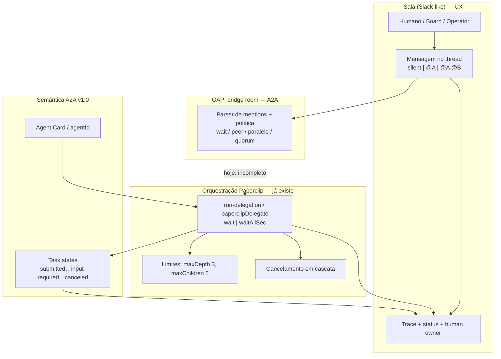
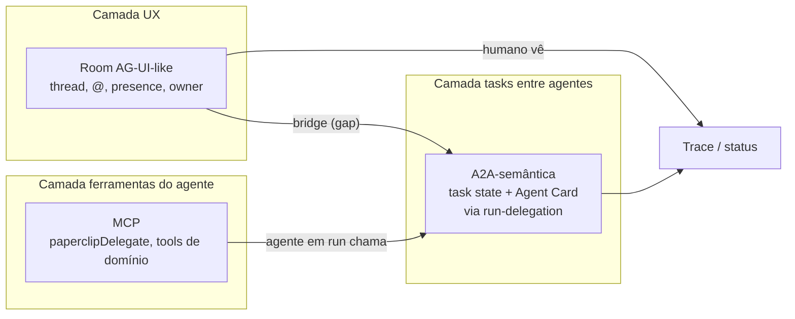

# Protocolo e Orquestração — A2A + Paperclip Room

> **Ciclo:** 3 — Deep dive  
> **Data:** 2026-07-09  
> **Produto-alvo:** Paperclip Conference Room (modo Slack: humanos + `@agente`, A2A fan-out + wait/join)  
> **Repo de implementação:** fork `QuadriniL/paperclip`  
> **Base:** Cycle 1 D1–D4 + Cycle 2 confirmação (A2A ≠ sala; fan-out+join já no fork)  
> **Confiança geral:** Alta no protocolo A2A v1.0 e no código do fork; média nas analogias AG-UI / Co-Gym (padrões, não APIs idênticas)

---

## 1. Escopo

Este documento fixa o **contrato conceitual** entre três camadas que o time tende a misturar:

| Camada | O que é | Onde vive |
|--------|---------|-----------|
| **Sala (Room / Conference)** | UX multiplayer tipo Slack: thread, `@mention`, silent-until-@, human owner | Produto Paperclip (fork) — ainda incompleto |
| **Orquestração Paperclip** | `run-delegation`, `wait` / `waitAllSec`, limites `maxDepth` / `maxChildren`, cancelamento em cascata | Control plane já no fork (`feat/a2a-native-delegation`) |
| **Protocolo A2A v1.0** | Task lifecycle, Agent Card, SendMessage / streaming, estados (`submitted`…`canceled`) | Spec Linux Foundation / a2a-protocol.org — **não** é Slack |

### 1.1 Dentro do escopo

- Separar **o que A2A cobre** do **que a sala cobre** (e o gap de bridge).
- Mapear padrões de mensagem Slack → eventos de orquestração (silent, `@single`, fan-out, wait, input-required, human owner).
- Posicionar a stack **MCP → A2A-semântica → room AG-UI-like**.
- Convergências/divergências: academia (Co-Gym, Gao, Aegean, MAST) + indústria (Claude Tag, Linear, Teams) + fork Paperclip.
- NFRs de latência, custo e depth limits (`maxDepth 3`, `maxChildren 5`).
- Anti-padrões que o produto deve recusar explicitamente.

### 1.2 Fora do escopo

- GTM / verticais (ver `03-verticals-and-value.md`).
- Spec de API HTTP detalhada da Room (Cycle 5).
- Cliente A2A JSON-RPC no BizCursor desktop — **descontinuado** em favor de delegação nativa no Paperclip + leitura `GET .../delegation` (handoff F2).
- Implementação de adapters além de `cursor_cloud` e `opencode_local`.

### 1.3 Decisão de produto já tomada (não reabrir aqui)

1. Path **B / Slack+@** (não Manus 1:1 puro).
2. Produto **só no fork Paperclip** (BizCursor desktop pausa para Room).
3. `@A @B` → ambos veem a mensagem; a orquestração decide wait/peer ou paralelo via A2A-semântica nativa.
4. **Gap confirmado:** falta **bridge room → A2A** (mentions e BoardChat hoje ≠ join A2A).

---

## 2. O que A2A cobre vs o que a sala cobre

### 2.1 Princípio central

> **A2A v1.0 não é Slack.**  
> A spec define *como um agente envia uma task a outro agente* (card, mensagem, estado, stream).  
> **Fan-out multi-agente (`@A @B`) é app-level** — responsabilidade do orquestrador Paperclip (ou de qualquer app que implemente N SendMessage/delegate + política de join), **não** de um primitivo nativo “broadcast” na spec A2A.

A sala é a **superfície social**; A2A (ou a delegação nativa Paperclip que espelha estados A2A) é o **motor de task entre agentes**.

### 2.2 Matriz de responsabilidades

| Concern | A2A v1.0 / delegação nativa | Sala (Room) |
|---------|-----------------------------|-------------|
| Identidade do agente | Agent Card / `agentId` | `@handle` na UI, avatar, presença |
| Ciclo de vida da task | `submitted` → `working` → `completed` / `failed` / `canceled` / `input-required` | Status legível no thread (“trabalhando…”, “precisa de você”) |
| Uma mensagem → um agente | SendMessage / `paperclipDelegate` | `@A` acorda A; A vê contexto da thread |
| Fan-out `@A @B` | **App-level:** N delegates + política `wait` / `waitAllSec` | Ambos veem a mesma mensagem; UI mostra N hops |
| Join / barreira | `wait:true` (1 filho) ou `wait:false` + `waitAllSec` (N filhos) | Indicador “aguardando A e B…”; não inventa protocolo |
| Silent-until-@ | Fora da spec | Regra de sala: agentes **não** respondem sem menção (exceto concierge configurado) |
| Human owner / assignee | Fora da spec (HITL via `input-required`) | Dono humano da thread; **delegate ≠ assignee** (padrão Linear) |
| Memória social do canal | Fora | Histórico da room, pins, threads filhas |
| Custo / budget | Correlacionável via `runId` / `sessionId` | Pill de custo na UI (F3+), não no protocolo A2A |

### 2.3 Diagrama — camadas e gap



### 2.4 O que já existe vs o que falta

| Peça | Status Cycle 2 | Implicação |
|------|----------------|------------|
| `paperclipDelegate` + `POST/GET .../delegate\|delegation` | **Implementado** no fork | Motor A2A-semântico pronto |
| `wait:false` + `waitAllSec` (fan-out + join) | **Implementado** | Não reinventar barreira no cliente |
| BoardChat / mentions em issues | Mentions = wakeup **independente** | **≠** A2A join |
| Silent-until-@ + peer wait na room | **Ausente** | Requisito de produto Room |
| Bridge: mensagem da sala → N delegates com política | **Gap** | Único bloqueio estrutural para “Slack + A2A” |

---

## 3. Mapeamento mensagem Slack → eventos

Convenção: a **mensagem na sala** é o evento de UX; o **orquestrador** traduz em 0..N operações de delegação / wakeup. Agentes **não** interpretam `@` como primitivo A2A — isso é parsing da Room.

### 3.1 Tabela canônica

| Padrão na sala | Evento(s) de orquestração | Semântica A2A / Paperclip | Notas de produto |
|----------------|---------------------------|---------------------------|------------------|
| **Silent** (sem `@agente`) | Nenhum delegate; opcional log de presença | — | Agentes permanecem quietos. Concierge (se existir) é **config explícita**, não default “todo mundo responde”. |
| **`@single`** (`@A`) | 1× `paperclipDelegate` / SendMessage → A | Task A: `submitted` → `working` → terminal | A vê a mensagem + contexto da thread. Humano continua **owner**. |
| **`@A @B` fan-out** | N× delegate com `wait:false` + `waitAllSec` **ou** N× com wait individual + política peer | N tasks paralelas; join app-level | Ambos **veem** a mesma mensagem. Default recomendado: paralelo + join com timeout (`waitAllSec`), não barreira infinita. |
| **`waitAllSec`** | Parâmetro do fan-out no control plane | Join com deadline; filhos atrasados → `failed`/`canceled` parcial ou política de quorum | Já no fork; Room só **expõe** o timeout e o resultado agregado. |
| **`input-required`** | Filho (ou pai) entra em estado A2A `input-required` | Task pausada até input humano/agente | UI: banner “A precisa de você”; **não** acordar B automaticamente. |
| **Human owner** | Metadado da room/thread (`ownerUserId`); não é assignee de issue | HITL gate; approvals | Espelha Linear: **delegate ≠ assignee**. Agente executa; humano permanece responsável. |

### 3.2 Fluxos detalhados

#### 3.2.1 Silent

```
humano → mensagem sem @
       → Room: persiste no histórico
       → Orquestrador: no-op para agentes
       → UI: só humanos (e bots de sistema) veem atividade
```

**Anti-default:** “qualquer mensagem acorda o CEO”. Isso vira agent washing e custo explosivo.

#### 3.2.2 `@single`

```
humano → "@A revise o PR #42"
       → Bridge: resolve @A → agentId
       → 1× paperclipDelegate({ targetAgentId: A, task, wait: true|false })
       → Trace: hop A
       → Se wait:true: pai bloqueia até A terminal
       → Se input-required: UI pede humano; owner notificado
```

#### 3.2.3 `@A @B` fan-out

```
humano → "@A @B comparem abordagens X vs Y"
       → Bridge: [A, B]
       → Política (produto):
            (a) paralelo: wait:false em ambos + waitAllSec = T
            (b) peer: A e B veem; um pode WaitTeammateContinue no outro
            (c) cascata SAS→MAS: só A primeiro; B se A pedir (Gao)
       → Join: agregado na run pai / mensagem de sistema na room
```

**Regra Cycle 2:** se paralelo → preferir **quorum** (Aegean) ou timeout (`waitAllSec`), **não** barrier cego “todos devem completar 100%”.

#### 3.2.4 `waitAllSec`

| Valor | Comportamento sugerido |
|-------|------------------------|
| `waitAllSec = T` | Aguarda todos os filhos até T segundos; depois agrega o que completou |
| Filho ainda `working` após T | Marca parcial / cancela conforme política; Room mostra “B timeout” |
| `wait:true` em filho único | Equivale a join 1:1 sem fan-out |

Paperclip **já** expõe `wait:false` + `waitAllSec` em run-delegation — a Room não deve reimplementar timer no WebView.

#### 3.2.5 `input-required`

| Origem | UX na sala | Orquestração |
|--------|------------|--------------|
| Agente A precisa de dado humano | Banner + composer habilitado só para owner/approver | Task A permanece `input-required`; sem auto-fan-out |
| Agente A precisa de B | Pode virar `@B` interno (delegate) **ou** mensagem peer na room | Preferir delegate explícito (auditável) a “sussurro” lateral |

#### 3.2.6 Human owner

- Toda room/thread tem **owner humano** (Board ou Operator).
- Delegação muda **executor**, não **accountability**.
- Cancelamento da mensagem/run do owner cancela filhos em cascata (já no Paperclip via `POST .../cancel`).

### 3.3 Pseudocontrato Bridge (alvo Cycle 5)

```ts
type RoomMessageEvent =
  | { kind: "silent"; text: string; ownerUserId: string }
  | { kind: "mention"; text: string; targets: AgentId[]; ownerUserId: string };

type OrchestrationPlan =
  | { mode: "noop" }
  | { mode: "single"; target: AgentId; wait: boolean }
  | {
      mode: "fanout";
      targets: AgentId[];
      waitAllSec: number;
      join: "all" | "quorum";
      quorum?: number; // Aegean-style
    }
  | { mode: "cascade"; first: AgentId; allowEscalateTo: AgentId[] }; // Gao SAS→MAS
```

---

## 4. Stack MCP / A2A / AG-UI-like room

Três protocolos/papéis empilhados — **não** substituíveis um pelo outro.



### 4.1 MCP (Model Context Protocol)

- **Papel:** ferramentas que o *agente em execução* chama durante a heartbeat run.
- **No Paperclip:** `paperclipDelegate` é a ferramenta MCP que cria child runs com vínculo `parentRunId`.
- **Quem chama:** o agente (JWT de run) — **não** o Board humano via Board API key (Cycle 2: humano não pode `POST .../delegate`).
- **Não é:** protocolo de chat multiplayer nem fan-out de sala.

### 4.2 A2A v1.0 (semântica de task)

- **Papel:** contrato de *task* agente↔agente (card, mensagem, estados, streaming).
- **No fork:** delegação nativa **espelha** estados A2A (`a2aTaskState`) sem exigir que o BizCursor implemente JSON-RPC/SSE.
- **Fan-out:** app-level (Paperclip), não primitivo da spec.
- **Não é:** modelo de sala, mentions, silent-until-@, human owner.

### 4.3 Room AG-UI-like

- **Papel:** superfície multiplayer (inspiração AG-UI / chat agents-as-colleagues): thread, streaming de status, menções, ownership.
- **Analogias de indústria:** Claude Tag (Slack), Linear Agents, Teams agentic — multiplayer, async, `@` como gatilho.
- **Não substitui** MCP nem A2A: a Room **orquestra a entrada**; MCP/A2A **executam e rastreiam**.

### 4.4 Fluxo ponta a ponta (alvo)

1. Humano posta `@A @B …` na Room.  
2. Bridge monta `OrchestrationPlan` (fan-out + `waitAllSec`).  
3. Control plane cria N child runs (mesma semântica de `paperclipDelegate`).  
4. Agentes podem, *dentro* da run, chamar MCP de novo (profundidade ≤ `maxDepth`).  
5. Room renderiza trace + estados A2A; owner humano resolve `input-required`.

### 4.5 O que BizCursor faz vs Paperclip Room

| Superfície | Responsabilidade atual / alvo |
|------------|-------------------------------|
| **BizCursor (F2)** | Lê `GET .../delegation` e mostra `DelegationTrace` — **não** é a Room Slack |
| **Paperclip Room (este research)** | É a sala; deve consumir o **mesmo** motor de delegação |
| **Agente via MCP** | Único que dispara `POST .../delegate` hoje |

---

## 5. Convergências e divergências

### 5.1 Academia

| Fonte / ideia | Convergência com Paperclip Room | Divergência / cuidado |
|---------------|----------------------------------|------------------------|
| **Co-Gym — `WaitTeammateContinue`** | Peer wait: A pode esperar B sem barrier global | Não copiar API de pesquisa; copiar *padrão* “esperar colega” como política de join |
| **Gao — SAS → MAS cascade** | Default barato: um agente (SAS); escalar para multi (MAS) só se necessário | Fan-out `@A @B` imediato é o *modo caro*; deve ser opt-in consciente |
| **Aegean — quorum** | Join parcial sob timeout / quorum > barreira 100% | `waitAllSec` sozinho não é quorum — Room precisa política explícita |
| **MAST (taxonomia de falhas multi-agente)** | Checklist de anti-padrões (§7) | Academia descreve falhas; produto precisa *gates* (depth, custo, owner) |
| **Budget-matched MAS ≠ upgrade universal** | Mais agentes ≠ melhor outcome | NFR de custo e default SAS |

### 5.2 Indústria

| Produto / padrão | Convergência | Divergência |
|------------------|--------------|-------------|
| **Claude Tag (Slack)** | `@` multiplayer, agente como colega, async | Tag ≠ orquestração A2A com join; é UX de menção |
| **Linear Agents** | **delegate ≠ assignee**; humano owner; async | Issues Linear ≠ heartbeat runs Paperclip |
| **Teams / Slack “agentic”** | Canal como locus de trabalho | Marketing “agentic OS” (Cycle 2: parcial) — não copiar hype |
| **AG2 / Semantic Kernel GroupChat** | Group chat com turn-taking | Frequentemente barrier/round-robin; Paperclip prefere fan-out+timeout + cascade |

### 5.3 Fork Paperclip + BizCursor

| Claim | Status | Nota |
|-------|--------|------|
| `run-delegation` + MCP `paperclipDelegate` | Confirmado | Base do motor |
| `wait:false` + `waitAllSec` | Confirmado | Fan-out+join **já existe** |
| BoardChat sempre concierge, sem `@` | Gap UX | Room nova, não patch cosmético |
| Mentions em issues = wakeup independente | ≠ A2A join | Bridge obrigatória |
| Humano não POST delegate | Confirmado | Bridge pode precisar de **run de sistema/concierge** ou extensão de auth — decisão Cycle 4/5 |
| BizCursor cliente A2A JSON-RPC | Descontinuado | Desktop só lê delegation |

### 5.4 Síntese

```
Converge:  @mention UX (indústria) + task states A2A + wait/join no fork
Diverge:   A2A spec (sem Slack)  ≠  Room (sem task protocol)
Gap:       bridge room → A2A   ← único “must build” estrutural
Default:   SAS / cascade (Gao) ; paralelo só com waitAllSec ou quorum (Aegean)
```

---

## 6. NFRs (latência, custo, depth limits)

### 6.1 Depth e fan-out (hard limits do control plane)

| Limite | Valor | Racional |
|--------|-------|----------|
| **`maxDepth`** | **3** | Evita cascata infinita CEO→Dev→X→Y; alinhado a organograma curto Villa/Biz |
| **`maxChildren`** | **5** | Cap de fan-out por run pai; `@A @B @C @D @E` ok; além disso → rejeitar ou pedir confirmação humana |

Violação → erro explícito na Room (“limite de delegação”), não retry silencioso.

### 6.2 Latência

| Cenário | Alvo UX | Mecânica |
|---------|---------|----------|
| `@single` ack | &lt; 1–2 s até “A trabalhando…” | Criar child run + primeiro evento de status |
| Fan-out `@A @B` ack | &lt; 2–3 s para N hops visíveis | N creates paralelos; UI não espera join |
| Join (`waitAllSec`) | Determinístico no timeout T | Não bloquear UI thread; poll/`delegation` / WS futuro |
| `input-required` | Notificação imediata ao owner | Estado A2A propagado para a Room |

**Nota:** latência de *modelo* (minutos em `cursor_cloud`) é esperada; NFR é de **orquestração e feedback**, não de inferência.

### 6.3 Custo

| Regra | Detalhe |
|-------|---------|
| Silent = custo zero de agente | Sem `@` → sem run |
| Default SAS | Um agente; cascade MAS só sob pedido/escalonamento |
| Fan-out é multiplicador | N menções ≈ até N runs; UI deve mostrar estimativa/aviso quando N≥3 |
| Timeout economiza | `waitAllSec` evita filhos zumbi consumindo budget |
| Rastreio | Cada hop com `runId` correlacionável a cost-events (F3) |

### 6.4 Confiabilidade e cancelamento

- Cancel da run/mensagem do owner → **cascata** nos children (já no Paperclip).
- Filho `failed` não derruba automaticamente irmãos no fan-out (join parcial / quorum).
- Idempotência: reenvio da mesma mensagem da Room não deve criar árvore duplicada sem `clientMessageId`.

### 6.5 Observabilidade

- Trace por hop (status, `a2aTaskState`, `resultJson` resumido).
- Operator: narrativa humana; Board: JSON expandível (padrão F2 DelegationTrace).
- Métricas: depth médio, children/run, taxa de timeout `waitAllSec`, taxa `input-required`.

---

## 7. Anti-padrões (MAST, barrier cego, agent washing)

### 7.1 MAST — falhas multi-agente a evitar no desenho

A taxonomia MAST (e correlatas) agrupa falhas típicas de sistemas multi-agente. Tradução para requisitos negativos da Room:

| Família de falha | Como aparece na Room | Mitigação de produto |
|------------------|----------------------|----------------------|
| Spec / goal drift | `@A @B` com prompt vago; cada um resolve outra coisa | Template de task; exigir outcome na mensagem |
| Inter-agent miscommunication | Peer “sussurro” fora do thread | Todo handoff via delegate auditável ou mensagem na room |
| Termination / loop | Ping-pong A↔B sem owner | `maxDepth`, timeout, human owner obrigatório |
| Verification gap | Todos “completam” sem critério | Quorum + checklist; não aceitar `completed` vazio |
| Over-delegation | CEO delega tudo sempre | Default SAS (Gao); fan-out opt-in |

### 7.2 Barrier cego

**Anti-padrão:** “`@A @B @C` → esperar 100% dos filhos para sempre”.

Por quê falha:

- Um filho lento/travado bloqueia valor dos outros.
- Custo e latência explodem.
- Contradiz Aegean (quorum) e o próprio `waitAllSec` do fork.

**Padrão correto:**

- `waitAllSec = T` + agregação parcial; **ou**
- `join: "quorum"` (ex. 2 de 3); **ou**
- cascade SAS→MAS em vez de fan-out inicial.

### 7.3 Agent washing

**Anti-padrão:** colocar “agentes” no canal que só são macros / webhooks / LLM sem task state, sem budget, sem owner — e vender como A2A.

Sinais:

- Menção acorda bot sem `runId` / sem estado A2A.
- Sem limites de depth/children.
- Sem distinção delegate vs assignee.
- “Group chat de LLMs” sem join policy.

**Regra:** se não há task state + run no control plane + owner humano, **não** é Paperclip A2A Room — é cosplay.

### 7.4 Outros anti-padrões explícitos

| Anti-padrão | Por que banir |
|-------------|----------------|
| Toda mensagem acorda todos os agentes | Custo + ruído; quebra silent-until-@ |
| Humano perde ownership ao delegar | Contradiz Linear / HITL |
| Reimplementar wait/join no WebView | Duplica `waitAllSec`; drift de verdade |
| Cliente A2A JSON-RPC no desktop “porque a spec existe” | Obsoleto no path nativo Paperclip |
| Marketing “autonomia 80%” sem audit trail | Cycle 2/3 verticais: anti-hype |

---

## 8. Fontes (URLs)

### 8.1 Protocolo A2A

- https://a2a-protocol.org/latest/specification/
- https://a2a-protocol.org/
- https://github.com/a2aproject/A2A
- https://google.github.io/A2A/ *(histórico / espelho)*
- https://www.wwt.com/blog/agent-2-agent-protocol-a2a-a-deep-dive
- https://tyk.io/learning-center/a2a-protocol-architecture-and-technical-specification/

### 8.2 MCP / AG-UI / stack de agentes

- https://modelcontextprotocol.io/
- https://github.com/modelcontextprotocol/specification
- https://docs.ag-ui.com/ *(AG-UI — padrões de UI agente; analogia, não dependência)*

### 8.3 Academia (wait, cascade, quorum, falhas)

- Co-Gym / WaitTeammateContinue — buscar paper “Co-Gym” multi-agent teammate wait (Cycle 1 D2)
- Gao et al. — SAS→MAS cascade / when to scale single-agent to multi-agent (Cycle 1–2 academia)
- Aegean — quorum / partial join em multi-agent coordination (Cycle 1 D2)
- MAST — Multi-Agent System failure Taxonomy (Cycle 1 D2; checklist §7)

### 8.4 Indústria (UX multiplayer)

- https://www.anthropic.com/ *(Claude / Tag em Slack — agente como colega)*
- https://linear.app/docs/agents *(Linear Agents — delegate ≠ assignee)*
- https://slack.com/blog *(Slack agentic / platform agents — UX de canal)*
- Microsoft Teams agents / Copilot agents — docs Microsoft Learn (async + channel)

### 8.5 Paperclip / BizCursor (interno + upstream)

- https://github.com/paperclipai/paperclip/tree/master/docs/api
- Fork: `QuadriniL/paperclip` — branch com `feat/a2a-native-delegation` (mergeada)
- `docs/handoffs/2026-07-07-f2-native-delegation.md`
- `docs/phases/f2-a2a-orchestrator/SPEC.md` *(§7.6 path nativo)*
- `docs/research/slack-a2a-room/cycle-1-discovery/00-INDEX.md`
- `docs/research/slack-a2a-room/cycle-2-confirmation/00-INDEX.md`

### 8.6 Claims âncora deste deep dive (rastreio Cycle 2)

| Claim | Veredito Cycle 2 |
|-------|------------------|
| A2A v1.0 ≠ Slack; fan-out é app-level | Confirmado |
| Paperclip já tem `wait:false` + `waitAllSec` | Confirmado |
| Falta bridge room → A2A | Confirmado (gap) |
| UX: Claude Tag / Linear — multiplayer, async, delegate≠assignee | Confirmado |
| Default SAS→cascade; paralelo → quorum, não barrier cego | Confirmado (academia) |

---

*Ciclo 3 — Deep dive · Protocolo e Orquestração · 2026-07-09*
