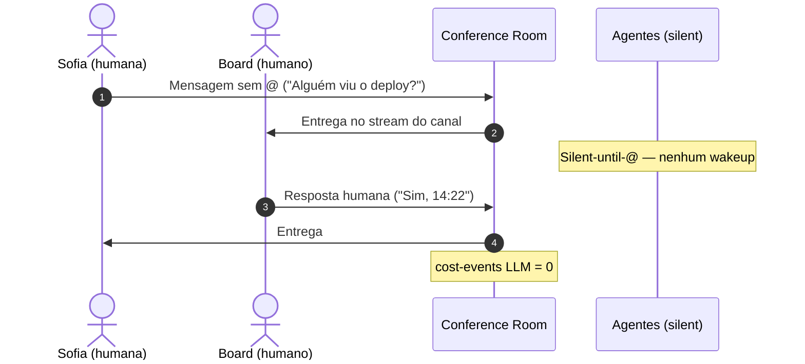
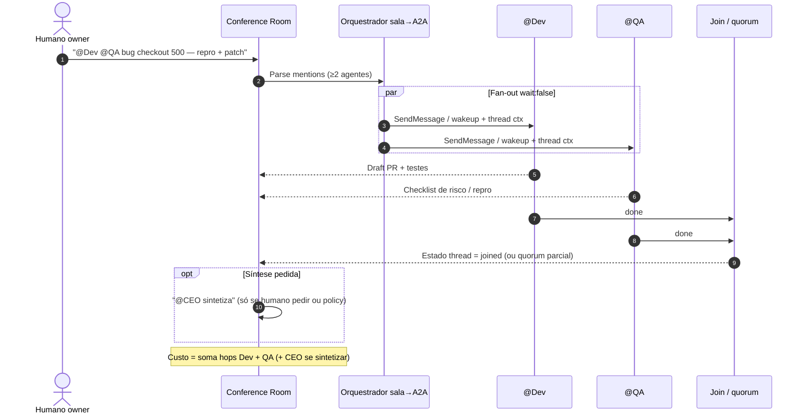
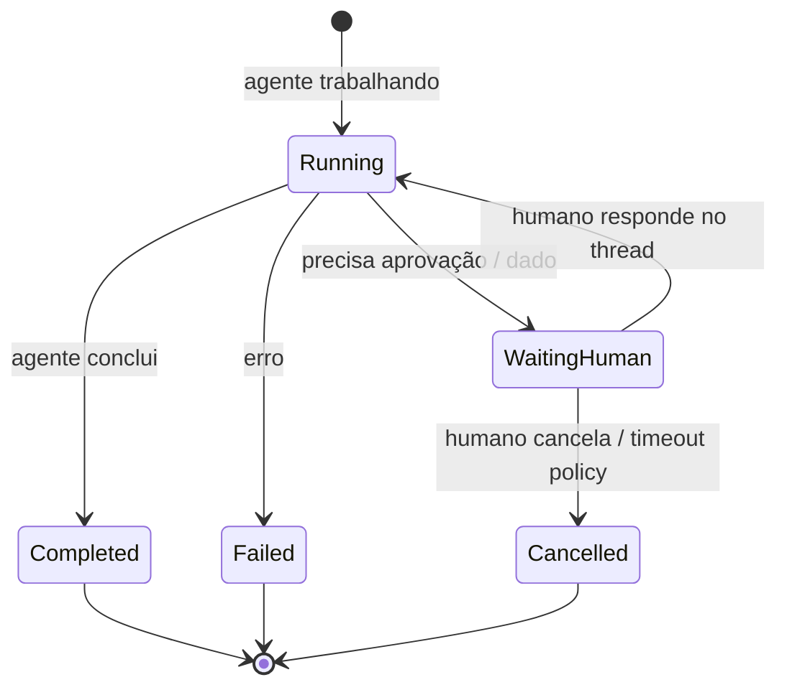
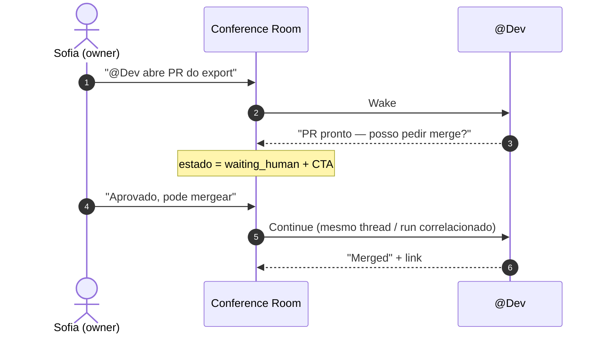
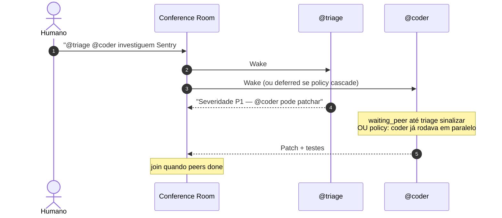

# UX — Conference Room Slack-mode

> **Ciclo:** 3 — Deep dive  
> **Data:** 2026-07-09  
> **Produto-alvo:** Paperclip Conference Room (modo Slack: humanos + `@agente`, A2A fan-out + wait/join)  
> **Repo de implementação:** fork `QuadriniL/paperclip` (BizCursor desktop pausa neste path)  
> **Base:** decisões Cycle 1 (path B/Slack+@) + requisitos Cycle 2 (Claude Tag / Linear / Teams; silent-until-@; human owner)  
> **Confiança:** Alta em princípios e anti-padrões (fontes primárias confirmadas); média em wireframes detalhados (ainda research)

---

## 1. Personas (Sofia, Board, Agentes)

Três classes de ator compartilham a **mesma sala**. A densidade de UI muda; o modelo mental não.

### 1.1 Sofia — Operator (humana, leiga técnica)

| Atributo | Detalhe |
|----------|---------|
| **Quem** | Co-fundadora / ops / tech lead de negócio que “conversa com a empresa” |
| **Job-to-be-done** | Pedir trabalho, acompanhar progresso em linguagem natural, aprovar ou pedir ajuste |
| **Gatilho natural** | Digitar no canal e `@mencionar` quem deve agir (igual Slack) |
| **O que vê** | Nomes de agentes (CEO, Dev, QA), status “Pensando… / Pronto / Precisa de você”, custo em linguagem simples (“esta conversa ≈ R$ X”) |
| **O que NÃO vê (default)** | `runId`, JSON-RPC, Agent Card, adapter type, stack traces crus |
| **Sucesso** | Entende *quem* está fazendo *o quê*, sem abrir outro app; nunca fica sem dono humano da decisão |

**Frase de design:** Sofia trata agentes como colegas no canal — não como “assistente mágico sempre ligado”.

### 1.2 Board — técnico / admin

| Atributo | Detalhe |
|----------|---------|
| **Quem** | Engenheiro, admin Paperclip, quem configura agentes e orçamento |
| **Job-to-be-done** | Auditar hops A2A, custo por thread/run, falhas, adapters, retries |
| **Gatilho natural** | Mesma sala; toggle **Board density** ou painel “Detalhes técnicos” |
| **O que vê** | Trace expandível, `runId` / hop status, adapter (`cursor_cloud` / `opencode_local`), tokens/custo, erros tipados |
| **Sucesso** | Debuga sem sair do thread; não precisa de Manus 1:1 separado para operar o dia a dia |

**Frase de design:** Board é a mesma UX com *mais camadas*, não um produto paralelo.

### 1.3 Agentes (colegas `@mencionáveis`)

| Papel típico | Adapter Paperclip | Comportamento na sala |
|--------------|-------------------|------------------------|
| `@CEO` | `opencode_local` | Orquestra, sintetiza, pode delegar; só fala se `@` ou se for join de um fan-out que o inclui |
| `@Dev` / `@coder` | `cursor_cloud` | Implementa, posta diff/PR no thread |
| `@QA` / `@reviewer` | `cursor_cloud` | Checklist, repro, risco — só quando mencionado ou join explícito |
| `@triage` / `@ops` | conforme org | Classifica, linka issue, pede wait em peer |

**Contrato de presença (obrigatório):**

1. **Silent-until-`@`** — agente não responde a mensagens humanas genéricas no canal.
2. **Visibilidade do fan-out** — se a mensagem humana contém `@A @B`, ambos recebem o mesmo contexto de thread.
3. **Human owner** — toda ação agentic relevante tem um humano responsável visível (aprovar / rejeitar / revisar).
4. **Custo atribuído** — cada run/hop conta no custo do thread (F3 / equivalente no fork).

### 1.4 Matriz de expectativas

| Situação | Sofia espera | Board espera | Agente faz |
|----------|--------------|--------------|------------|
| Mensagem sem `@` | Só humanos veem / respondem | Log de “no wakeup” | **Silêncio** |
| `@CEO` pergunta | Resposta narrativa + possível “vou pedir ao Dev” | Trace hop se houver delegação | Wake + resposta; pode `delegate` |
| `@Dev @QA` juntos | Dois colegas trabalhando; depois um join | Fan-out `wait:false` + `waitAllSec` / quorum | Paralelo; postam no thread |
| “Espera o humano” | Badge “Precisa de você” | Estado `waiting_human` no run | Pausa; não inventa aprovação |
| “Espera o peer” | “Dev aguardando QA…” | Estado `waiting_peer` + hop correlacionado | Não fecha join cedo |

---

## 2. Princípios (multiplayer, async, thread, silent-until-@, human owner, cost visible)

Princípios derivados das fontes Cycle 2 (Claude Tag, Linear Agents, Teams agents, ClickUp, AG2 GroupChat, Semantic Kernel) e dos gaps confirmados no fork (BoardChat concierge; mentions ≠ A2A join).

### 2.1 Multiplayer (sala, não DM mágico)

- A unidade de trabalho é o **canal / sala**, não um chat 1:1 com um “concierge” invisível.
- Humanos e agentes coexistem no mesmo stream de mensagens.
- Identidade visual clara: avatar + nome + papel (`humano` | `agente`) em cada bolha.
- **Implicação:** `@mention` é o roteador social; A2A é o roteador de execução por baixo.

### 2.2 Async first

- Agentes podem demorar minutos/horas; a UI não bloqueia o canal.
- Threads permitem continuar outras conversas enquanto um run roda.
- Notificações (F5 / equivalente) avisam conclusão ou “precisa de você” — não spinner modal global.
- **Implicação:** estados de mensagem/run são first-class (§5); “Pensando…” é local à bolha/thread.

### 2.3 Thread como unidade de auditoria

- Cada pedido relevante vira (ou vive em) um **thread**.
- Hops A2A, aprovações e custo agregam **no thread**, não em DMs dispersos.
- Join / síntese do `@CEO` (quando pedido) aparece no mesmo thread.
- **Implicação:** “sumiu no DM” é anti-métrica (ver vertical Software Houses).

### 2.4 Silent-until-`@`

- Default: agentes **não** falam.
- Wake / SendMessage / delegate só após menção explícita **ou** participação em fan-out/`delegate` já autorizado no grafo daquele thread.
- Mensagens só-humanas (alinhamento, piada, “ok”) **não** disparam custo de agente.
- **Implicação:** corrige o gap Cycle 2 “BoardChat sempre concierge”.

### 2.5 Human owner

- Todo thread agentic tem **owner humano** visível (Sofia ou Board assignee).
- Gates: merge, gasto acima de limiar, ação externa irreversível → aprovação humana.
- Agente pode **pedir** (“Preciso que você aprove o PR”); não pode **assumir** o sim.
- **Implicação:** alinha Claude Tag / Linear e anti-hype Gartner (risk controls).

### 2.6 Cost visible

- Custo por mensagem agentic, por hop e **totais do thread** sempre acessíveis.
- Operator: linguagem simples + alerta de orçamento.
- Board: tokens, modelo/adapter, breakdown por hop.
- Humanos **não** geram cost-events de LLM (só agentes).
- **Implicação:** DoD de valor beachhead exige 100% visibilidade (F3 / fork).

### 2.7 Resumo operacional (checklist de design)

| Princípio | Teste rápido na UI |
|-----------|-------------------|
| Multiplayer | Dá para ver ≥2 agentes e ≥1 humano no mesmo thread? |
| Async | Posso mandar outra msg enquanto um run roda? |
| Thread | Trace + custo estão no thread, não em modal órfão? |
| Silent-until-@ | Msg sem `@` → zero wakeup? |
| Human owner | Badge de owner + CTA de aprovação quando `waiting_human`? |
| Cost visible | Totais do thread atualizam após cada hop? |

---

## 3. Fluxos F1–F5 with mermaid

Convenção: **F1–F5** aqui são **fluxos de UX da sala** (não as fases F1–F5 do roadmap BizCursor). Onde houver dependência de fase de produto, anota-se entre parênteses.

### 3.1 F1 — Humanos no canal (sem custo de agente)

**Objetivo:** canal funciona como Slack humano-humano; agentes observam só se tiverem membership, mas **não** respondem.



**Regras UX:**

- Composer **não** sugere auto-enviar a um agente default.
- Indicador discreto: “Nenhum agente mencionado — só humanos”.
- Board pode ver membership da sala; Sofia só vê “quem está na sala” em linguagem simples.

---

### 3.2 F2 — `@CEO` (orquestração / resposta única)

**Objetivo:** um `@` acorda um agente; resposta narrativa; delegação opcional aparece como trace no thread.

```mermaid
sequenceDiagram
  autonumber
  actor Sofia as Sofia
  participant Room as Conference Room
  participant CEO as @CEO
  participant A2A as A2A / delegate
  participant Dev as @Dev

  Sofia->>Room: "@CEO implementa export CSV de vendas"
  Room->>CEO: Wake + contexto do thread
  CEO-->>Room: "Entendi — vou pedir ao Dev…"
  opt Delegação nativa
    CEO->>A2A: POST delegate (wait conforme política)
    A2A->>Dev: Run filho
    Dev-->>Room: Progresso / artefato no thread
    A2A-->>CEO: Resultado hop
    CEO-->>Room: Síntese final
  end
  Note over Room: Custo: hops CEO (+ Dev se delegou)
  Note over Sofia: Operator vê narrativa; Board expande trace
```

**Regras UX:**

- Bolha do CEO mostra estado do run (`queued` → `running` → `completed` / `failed`).
- Se houver hop: componente **Delegation Trace** colapsável (Operator = narrativa; Board = JSON/IDs).
- Sofia **não** precisa saber JSON-RPC; vê “CEO pediu ajuda ao Dev”.

---

### 3.3 F3 — `@Dev @QA` paralelo + join

**Objetivo:** fan-out multiplayer; ambos veem a mesma mensagem; join quando política satisfeita (não barrier cego).



**Regras UX:**

- Composer destaca chips `@Dev` `@QA` antes do send.
- Thread header: “2 agentes em paralelo” + progress (0/2, 1/2, 2/2).
- Join **não** esconde as bolhas individuais — síntese é opcional e explícita.
- Política de join (todos / quorum / timeout) configurável pelo Board; Operator vê só o resultado (“Aguardando QA…”).

---

### 3.4 F4 — Wait human (HITL gate)

**Objetivo:** agente pausa e pede dono humano; canal continua usável.





**Regras UX:**

- Banner sticky no thread: **Precisa de você** + botões primários (`Aprovar` / `Pedir ajuste` / `Cancelar`).
- Notificação Operator (F5 product) quando `waiting_human`.
- Timeout: mensagem clara (“Expirou — mencione de novo para retomar”); sem auto-approve.

---

### 3.5 F5 — Wait peer (agente espera outro agente)

**Objetivo:** cascade / dependência peer sem acordar o humano cedo demais.



**Variante cascade (SAS → MAS):** humano `@triage` primeiro; triage `@coder` via delegate/mention agentic; coder entra em `waiting_peer` só se precisar de artefato do triage.

**Regras UX:**

- Badge na bolha: “Aguardando @triage”.
- Board vê edge no trace (`fromHop → toHop`, `waiting_peer`).
- Se peer falhar: estado `blocked` + CTA humano (“Desbloquear / Reatribuir / Cancelar”).

---

### 3.6 Mapa rápido F1–F5

| Fluxo | Mentions | Custo LLM | Join | HITL |
|-------|----------|-----------|------|------|
| F1 Humanos | 0 | Não | — | N/A |
| F2 `@CEO` | 1 | Sim | Opcional (delegate) | Se CEO pedir |
| F3 `@Dev @QA` | ≥2 | Sim (N hops) | Sim (paralelo) | Se policy |
| F4 Wait human | ≥1 | Pausado | — | **Obrigatório** |
| F5 Wait peer | ≥1–N | Sim | Sim (dependência) | Só se peer falhar / timeout |

---

## 4. Componentes UI

Vertical slice sugerido no fork (nomes estáveis para SPEC futura). Preferir **≤6 arquivos** por slice; co-locar.

### 4.1 Shell da sala

| Componente | Responsabilidade |
|------------|------------------|
| `RoomHeader` | Nome do canal (`#eng-bugs`), membros (humanos + agentes), custo do thread ativo, toggle Operator/Board |
| `RoomMemberStrip` | Avatares; agentes mostram adapter só em Board density |
| `MessageStream` | Lista virtualizada de mensagens + system lines (“join completo”, “custo atualizado”) |
| `ThreadPanel` | Painel lateral ou nested view do thread selecionado |
| `Composer` | Texto + autocomplete `@` + preview de fan-out + send |

### 4.2 Mensagem e menção

| Componente | Responsabilidade |
|------------|------------------|
| `MessageBubble` | Autor, timestamp, corpo, attachments; variante `human` / `agent` / `system` |
| `MentionChip` | `@CEO` clicável; hover = papel + “mencionar de novo” |
| `MentionAutocomplete` | Lista agentes da sala; teclado ↑↓ Enter; anuncia no live region |
| `FanOutPreview` | Antes do send: “Acordará Dev e QA em paralelo” |

### 4.3 Run / orquestração

| Componente | Responsabilidade |
|------------|------------------|
| `RunStatusBadge` | `queued` / `running` / `waiting_human` / `waiting_peer` / `completed` / `failed` / `cancelled` |
| `DelegationTrace` | Árvore de hops colapsável (alinha F2 nativo `GET .../delegation`) |
| `HopRow` | Um hop: agente, status, duração, custo (Board: IDs) |
| `JoinProgress` | `1/2 agentes concluíram` + timeout restante |
| `HumanGateBanner` | CTA sticky de aprovação |
| `CostPill` | Custo da msg / thread; Operator = moeda simplificada; Board = tokens |

### 4.4 Densidade e a11y wrappers

| Componente | Responsabilidade |
|------------|------------------|
| `DensityToggle` | Operator ↔ Board (persiste por usuário) |
| `TechDetailsDisclosure` | `<details>` / accordion com `runId`, adapter, raw error (só Board ou expandido) |
| `LiveRegion` | Anúncios SR: “Dev concluiu”, “Precisa da sua aprovação” |

### 4.5 Hierarquia visual (anti-dashboard)

Uma composição de sala — **não** um cockpit de métricas:

1. Stream (âncora)
2. Composer (ação)
3. Trace/custo como **camadas** sob demanda, não cards competindo no hero do canal

Evitar: stat strips, pill clusters de KPIs, “agent concierge” flutuante.

### 4.6 Wireframe textual (thread com fan-out)

```
┌─ #eng-bugs · owner: Sofia · custo thread: R$ 1,20 ──────── Board ▢ ─┐
│                                                                      │
│  Sofia  10:02                                                        │
│  @Dev @QA checkout 500 após deploy 14:22 — Sentry #8821              │
│  ┌ fan-out: Dev + QA · join 1/2 ───────────────────────────────┐     │
│                                                                      │
│  Dev  10:03  [running ●]                                             │
│  Reproduzindo…                                                       │
│                                                                      │
│  QA   10:04  [completed ✓]  custo R$ 0,40                            │
│  Repro OK em staging. Risco: sessão.                                 │
│                                                                      │
│  Dev  10:07  [waiting_human ⏸]                                       │
│  PR #441 pronto. Posso mergear?                                      │
│  ┌ Precisa de você: [Aprovar] [Pedir ajuste] [Cancelar] ───────┐     │
│                                                                      │
│  ▼ Trace (Board)                                                     │
│     hop1 QA completed · hop2 Dev waiting_human                       │
│                                                                      │
├─ Composer ───────────────────────────────────────────────────────────┤
│  Mensagem…  @                                                         │
│  [Nenhum agente] ou chips selecionados · Enviar                      │
└──────────────────────────────────────────────────────────────────────┘
```

---

## 5. Estados mensagem/run

### 5.1 Estados de mensagem (UI)

| Estado | Significado | Aparência Operator | Aparência Board |
|--------|-------------|--------------------|-----------------|
| `draft_local` | Ainda não enviado | Composer only | + validação mentions |
| `sent` | No stream | Bolha estável | + messageId |
| `delivering_to_agents` | Fan-out em andamento | “Enviando para Dev, QA…” | + per-target ACK |
| `agent_typing` / `running` | Run ativo ligado à bolha | “Pensando…” / progresso | + runId, heartbeat |
| `waiting_human` | Gate HITL | Banner CTA | + reason code |
| `waiting_peer` | Dependência A2A | “Aguardando @X” | + edge hop |
| `joined` | Política de join ok | “Todos concluíram” / síntese | + join policy used |
| `completed` | Terminal ok | Check discreto | + latência, custo |
| `failed` | Terminal erro | “Falhou — tentar de novo?” | + error tipado |
| `cancelled` | Humano/policy cancelou | “Cancelado” | + who/when |

### 5.2 Estados de run / hop (domínio)

Alinhar ao Paperclip heartbeat-run + delegation nativa:

| Estado | Quem pode transicionar | Custo acumula? |
|--------|------------------------|----------------|
| `queued` | Orquestrador | Não (ainda) |
| `running` | Runtime agente | Sim |
| `waiting_human` | Agente → humano → runtime | Pausa billing ativo; hop já gasto permanece |
| `waiting_peer` | Orquestrador / peer done | Hop atual pode estar idle |
| `completed` | Runtime | Congela custo do hop |
| `failed` | Runtime / timeout | Congela; retry = novo hop |
| `cancelled` | Humano / admin | Congela |

**Regra TypeScript:** switches sobre esses estados devem ser exaustivos (`never` no `default`).

### 5.3 Mapeamento mensagem ↔ run

```
Message (humana com @)
  └─ RunGroup (fan-out id)
       ├─ Hop/Run @Dev
       ├─ Hop/Run @QA
       └─ JoinRecord (policy, deadline, result)
```

UI nunca mostra JSON-RPC cru no Operator; Board pode abrir `TechDetailsDisclosure`.

### 5.4 Transições proibidas (produto)

| De → Para | Por quê |
|-----------|---------|
| `sent` (sem `@`) → `running` agente | Viola silent-until-@ |
| `waiting_human` → `completed` sem input humano | Viola human owner |
| `waiting_peer` → `joined` com peer `failed` sem policy | Join mentiroso |
| Qualquer → auto-`@CEO` concierge | Viola path B (não Manus/concierge) |

---

## 6. A11y + Operator vs Board density

### 6.1 Acessibilidade (WCAG 2.1 AA — sala)

| Área | Requisito |
|------|-----------|
| **Teclado** | Composer, autocomplete `@`, CTAs do HumanGate, expand/collapse do Trace — tudo sem mouse |
| **Foco** | Ordem: stream → gate banner (se ativo) → composer; trap só em modais raros |
| **Live regions** | `aria-live="polite"` para conclusão de hop; `assertive` para `waiting_human` |
| **Nomes** | Botões com nome acessível (“Aprovar merge do Dev”, não só “OK”) |
| **Contraste** | Badges de estado com texto + ícone (não só cor) |
| **Motion** | Respeitar `prefers-reduced-motion`; spinners têm texto equivalente |
| **Mentions** | Autocomplete anuncia opção ativa; chips removíveis por teclado |

### 6.2 Operator density (default Sofia)

| Mostrar | Esconder / adiar |
|---------|------------------|
| Nome do agente, status em PT, narrativa | `runId`, adapter, JSON |
| Custo em moeda / “baixa–média–alta” | Tokens brutos |
| Trace em 1 linha (“CEO → Dev → pronto”) | Árvore completa |
| CTA humano grande | Códigos de erro internos |

Copy: “Pensando…”, “Pronto”, “Precisa de você”, “Dev pediu ajuda ao QA”.

### 6.3 Board density

| Mostrar | Extra |
|---------|-------|
| Tudo do Operator | + hop IDs, adapter, model, tokens in/out |
| Trace completo | + raw error, retry count, wait policy |
| Custo | + breakdown por hop e por agente |
| Membership | + agentId copiável |

Toggle persistente; atalho sugerido: `Cmd+.` (documentar na SPEC de implementação).

### 6.4 Densidade ≠ dois produtos

- Mesmos fluxos F1–F5.
- Mesmos componentes; props `density: 'operator' | 'board'`.
- Proibido: rota `/board-chat` concierge paralela que ignore `@`.

---

## 7. O que NÃO fazer (Manus-only, always-on concierge, default agent without @)

Anti-padrões confirmados pelos gaps Cycle 2 e pelas decisões Cycle 1 (path **B/Slack+@**, não Manus 1:1 puro).

### 7.1 Manus-only (chat 1:1 como único modo)

| Não fazer | Fazer em vez disso |
|-----------|-------------------|
| Produto = um assistente único em DM | **Sala multiplayer** com N agentes `@mencionáveis` |
| Esconder outros agentes atrás do “orquestrador invisível” | Orquestração **visível** no thread (trace) |
| Forçar Sofia a abrir N janelas 1:1 | Fan-out `@A @B` no mesmo composer |

Manus-like pode existir como *atalho* (“mensagem direta ao CEO”), nunca como **único** modelo mental.

### 7.2 Always-on concierge

| Não fazer | Fazer em vez disso |
|-----------|-------------------|
| Toda mensagem do canal acorda um bot | **Silent-until-`@`** |
| BoardChat stream sem parse de mentions | Composer com mentions obrigatórias para custo |
| “Assistente da sala” que comenta tudo | System lines só para eventos de orquestração (join, custo), não opinião |

### 7.3 Default agent without `@`

| Não fazer | Fazer em vez disso |
|-----------|-------------------|
| Seletor “agente padrão” que engole msgs sem `@` | Exigir `@` para wakeup; hint no composer |
| Inferir “provavelmente era pro CEO” | Ambiguidade → perguntar ao humano (“Quem deve responder?”) **sem** cobrar run |
| Mentions em issue ≠ join A2A (estado atual do fork) | Bridge explícita sala → fan-out/delegate |

### 7.4 Outros anti-padrões de UX

- **Autonomy theater:** agente mergeia em `main` sem `waiting_human`.
- **Barrier cego:** esconder respostas parciais até todos terminarem — preferir bolhas ao vivo + join badge.
- **Custo opaco:** hops sem CostPill.
- **Dashboard no canal:** KPIs competindo com o stream.
- **Dois mundos Operator/Board:** forks de fluxo; só densidade muda.
- **Marketing fluff na UI:** badges “80% autonomia” — proibido (ver anti-hype verticais).

### 7.5 Teste de regressão de produto (smoke UX)

1. Msg sem `@` → zero runs.  
2. `@CEO` → um run (+ hops se delegar).  
3. `@Dev @QA` → dois runs + join progress.  
4. `waiting_human` → sem auto-complete.  
5. Toggle Board → IDs aparecem; Operator → somem.  
6. Custo thread > 0 só após hops agentic.

---

## 8. Fontes (Claude Tag, Linear, Teams, ClickUp, AG2, SK)

Fontes de **UX multiplayer / agente-como-colega** e orquestração de grupo. Grades no espírito Cycle 2 (A = primário forte; B = produto/docs úteis; C = claim interno / marketing).

### 8.1 Produtos — agente como colega no canal

| ID | Fonte | O que copiar | Grade | URL |
|----|-------|--------------|-------|-----|
| UX-01 | **Anthropic — Claude Tag** | `@` no Slack/Linear-like; agente no fluxo de PR; human review; silent até chamado | B (UX); C se usar “65% PRs” sozinho | https://www.anthropic.com/news/introducing-claude-tag |
| UX-02 | **Linear — Agents** | Agente como assignee/coleganos issues; async; owner humano | B | https://linear.app/docs/agents · https://linear.app/changelog |
| UX-03 | **Microsoft Teams — Agents** | Agente em chat/team; menções; governança enterprise | B | https://learn.microsoft.com/en-us/microsoftteams/platform/bots/how-to/teams-conversational-ai/teams-agentic-ai |
| UX-04 | **ClickUp — AI / Agents** | Autocomplete de menção; tarefas + comentários; cuidado com hype de autonomia | B/C | https://clickup.com/blog · docs ClickUp Brain/Agents |
| UX-05 | **Slack — agentic collaboration** | Canal como OS de trabalho; apps/agentes no stream | B | https://slack.com/blog/news/powering-agentic-collaboration |
| UX-06 | **Cursor / Slack `@` patterns** (indústria SE) | Dev menciona bot no canal de eng; thread = auditoria | B | (práticas de mercado; cruzar com beachhead Software Houses) |

### 8.2 Frameworks — GroupChat / orquestração (inspiração de join, não de UI pixel)

| ID | Fonte | O que copiar | Grade | URL |
|----|-------|--------------|-------|-----|
| UX-07 | **AG2 (AutoGen)** — GroupChat / speaker selection | Turn-taking, speaker selection, human-in-the-loop patterns | B | https://docs.ag2.ai/ |
| UX-08 | **Semantic Kernel (SK)** — Agent Group Chat | Group chat orchestration, termination, human approval hooks | B | https://learn.microsoft.com/en-us/semantic-kernel/frameworks/agent/agent-chat |
| UX-09 | **A2A Protocol** | Task/Message streaming; fan-out é **app-level** (sala Paperclip) | A (protocolo) | https://a2a-protocol.org/latest/specification/ |

### 8.3 Academia / anti-hype (guardrails de UX)

| ID | Fonte | O que copiar | Grade | URL |
|----|-------|--------------|-------|-----|
| UX-10 | Co-Gym / WaitTeammateContinue | Padrão wait peer explícito | B | (catálogo Cycle 1 D2) |
| UX-11 | Aegean quorum | Join ≠ barrier cego; quorum | B | (catálogo Cycle 1 D2) |
| UX-12 | Gao — SAS→MAS cascade | Default single-agent; escalar para multi | B | (catálogo Cycle 1 D2) |
| UX-13 | Gartner — cancelamentos agentic | Escopo estreito; cost + risk na UX | B | https://www.gartner.com/en/newsroom/press-releases/2025-06-25-gartner-predicts-over-40-percent-of-agentic-ai-projects-will-be-canceled-by-end-of-2027 |

### 8.4 Interno (repo)

| ID | Fonte | Uso |
|----|-------|-----|
| UX-I1 | `docs/research/slack-a2a-room/cycle-1-discovery/00-INDEX.md` | Path B; `@A @B` ambos veem |
| UX-I2 | `docs/research/slack-a2a-room/cycle-2-confirmation/00-INDEX.md` | Gaps BoardChat; UX a copiar |
| UX-I3 | `docs/research/slack-a2a-room/cycle-3-deep-dive/03-verticals-and-value.md` | Beachhead SE; DoD silent-until-@ |
| UX-I4 | `docs/phases/f2-a2a-orchestrator/SPEC.md` + handoff delegação nativa | Trace UI; Operator vs Board |
| UX-I5 | `docs/phases/f0-foundation/SPEC.md` / F1 chat | Personas Sofia/Board; densidade |

### 8.5 Síntese: o que cada fonte manda na UI

| Princípio | Fonte âncora |
|-----------|--------------|
| Multiplayer + `@` | Claude Tag, Slack, Linear, Teams |
| Async + thread | Linear, Slack, Teams |
| Silent-until-@ | Claude Tag + gap Cycle 2 |
| Human owner | Claude Tag, Linear, Gartner |
| Cost visible | Gartner + DoD vertical SE + F3 |
| Parallel + join | AG2 / SK patterns + A2A app-level + fork `wait:false` / `waitAllSec` |
| Wait peer / human | Co-Gym, Aegean, SK approval hooks |

---

## Apêndice A — Glossário rápido

| Termo | Significado neste doc |
|-------|----------------------|
| **Sala / Conference Room** | Canal multiplayer Paperclip (Slack-mode) |
| **Silent-until-@** | Agente só age se mencionado ou incluído em fan-out/delegate |
| **Fan-out** | Uma msg humana com ≥2 `@agentes` → N wakes/runs |
| **Join** | Política que fecha o grupo de hops (todos / quorum / timeout) |
| **Human owner** | Humano responsável por gates do thread |
| **Operator / Board density** | Duas densidades da mesma UI |
| **Hop** | Um passo de delegação / run filho no trace |

## Apêndice B — Próximos artefatos sugeridos

1. SPEC de implementação no fork: `RoomComposer` + bridge mentions → A2A.  
2. Protótipo de estados (`waiting_human` / `waiting_peer`) com fixtures.  
3. Checklist ST-UX-01…06 espelhando §7.5.  
4. Cruzar com `03-verticals-and-value.md` para copy de beachhead Software Houses.

---

*Fim do deep dive UX — Conference Room Slack-mode (Cycle 3).*
