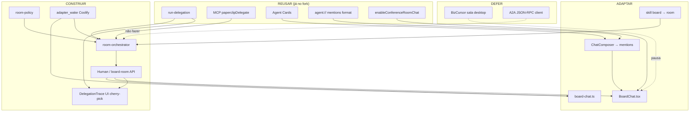

# Gap Analysis — Fork Paperclip → Slack Room + A2A

> **Ciclo:** 3 — Deep dive  
> **Data:** 2026-07-09  
> **Fork de implementação:** `/Users/macbook/Projects/paperclip` (`QuadriniL/paperclip`)  
> **Produto-alvo:** Conference Room modo Slack (humanos + `@agente`) com A2A nativo (fan-out paralelo + wait/join)  
> **Decisão de produto (Cycle 1–2):** Path B/Slack+@; produto **só no fork**; BizCursor desktop **pausa** (cherry-pick do trace UI)  
> **Confiança:** Alta nos gaps de código (lidos no fork); média em `adapter_wake` Coolify (precisa spike de deploy)

---

## Sumário executivo

O fork **já tem** o motor A2A de delegação (`run-delegation`, MCP `paperclipDelegate`, Agent Cards, `wait:false` + `waitAllSec`). O que **não existe** é a ponte **sala → A2A**: o BoardChat continua sendo um concierge Claude CLI sem `@mentions`, e o humano **não pode** `POST .../delegate` (só agent JWT de run). Mentions em issues disparam wakes independentes — **não** são join A2A.

| Bucket | Veredito |
|--------|----------|
| **REUSAR** | Motor de delegação + discovery + flag experimental + formato `agent://` |
| **ADAPTAR** | BoardChat / board-chat / ChatComposer / skill board→room |
| **CONSTRUIR** | `room-orchestrator`, `room-policy`, human API, trace UI, `adapter_wake` Coolify |
| **NÃO FAZER / defer** | Cliente A2A JSON-RPC no desktop; Manus 1:1 puro; marketing beachhead; cross-company A2A |

---

## Fatos confirmados (Cycle 2 → requisitos)

| # | Fato | Evidência no fork | Implicação de produto |
|---|------|-------------------|------------------------|
| F1 | `wait:false` fan-out + `waitAllSec` **existem** | `run-delegation.ts`, spec `agent-delegation-a2a.md`, MCP tools | Não reinventar Promise.allSettled; bridge sala → essas APIs |
| F2 | BoardChat = **claude CLI concierge**, sem mentions | `board-chat.ts` spawna `claude` + skill `paperclip-board`; `BoardChat.tsx` usa `ChatComposer` bare | UX Slack+@ exige adaptar UI + trocar/estender o relay |
| F3 | Humano **não** pode `POST .../delegate` | `agents.ts`: `req.actor.type !== "agent"` → 403 | Precisa human API / room-orchestrator server-side com identidade de run |
| F4 | Mentions em issues = wakes **independentes** ≠ A2A join | Skill: `[@Name](agent://id)` → heartbeat; sem `parentRunId` / `waitAllSec` | `@A @B` na sala **não** pode só postar mentions; precisa orquestrar delegate |

---

## 1. REUSAR

Componentes maduros o suficiente para consumir **sem reescrever**. Extensões pontuais OK; redesign não.

### 1.1 `run-delegation` (control plane)

| Item | Detalhe |
|------|---------|
| **Path** | `/Users/macbook/Projects/paperclip/server/src/services/run-delegation.ts` |
| **Wired em** | `heartbeat.ts` → `delegateFromRun` / `getDelegationState` |
| **Contrato** | `wait: true` (barrier até 300s) · `wait: false` (fan-out) · join via `waitAllSec` · `clientKey` idempotente · `followUpToChildRunId` · cancel seletivo · org chart `reportsTo` · caps depth/children |
| **Spec** | `/Users/macbook/Projects/paperclip/doc/spec/agent-delegation-a2a.md` |
| **Testes** | `/Users/macbook/Projects/paperclip/server/src/__tests__/run-delegation-integration.test.ts` |

**Reuso na sala:** o `room-orchestrator` deve chamar o mesmo serviço (ou a mesma rota interna) que o MCP já usa — não duplicar waiter registry / sweeper.

### 1.2 MCP `paperclipDelegate` (+ join / cancel / cards)

| Tool | Path | Papel |
|------|------|-------|
| `paperclipDelegate` | `/Users/macbook/Projects/paperclip/packages/mcp-server/src/tools.ts` | Fan-out / wait a partir do heartbeat do agente |
| `paperclipGetDelegation` | idem | Join com `waitAllSec` |
| `paperclipCancelDelegation` | idem | Cancel de um child |
| `paperclipGetAgentCard` / `paperclipListAgentCards` | idem | Discovery A2A-style |

**Reuso:** agentes na sala (CEO, triage, coder) continuam delegando **entre si** via MCP durante a run. A sala humana **não** substitui isso — ela **dispara** a primeira orquestração (ou um agent-of-record).

### 1.3 Agent Cards (discovery)

| Endpoint | Auth | Uso na sala |
|----------|------|-------------|
| `GET /api/agents/:id/agent-card` | Board / agent | Card do `@mencionado` |
| `GET /api/companies/:id/agent-cards` | Board / agent | Autocomplete de `@` + validação de alvo |

Implementação: `/Users/macbook/Projects/paperclip/server/src/routes/agents.ts` (OpenAPI em `openapi.ts`).

**Reuso:** popular `MentionOption` no composer da sala a partir de `agent-cards` (mesmo diretório que o MCP já lista).

### 1.4 Mentions `agent://` (formato canônico)

Formato machine-authored já documentado:

```markdown
[@Display Name](agent://<agent-id>)
```

| Onde | Path |
|------|------|
| Skill agente | `/Users/macbook/Projects/paperclip/skills/paperclip/SKILL.md` |
| API ref | `/Users/macbook/Projects/paperclip/skills/paperclip/references/api-reference.md` |
| UI chips | `/Users/macbook/Projects/paperclip/ui/src/lib/mention-chips.ts`, `mention-aware-link-node.ts` |
| Editor | `/Users/macbook/Projects/paperclip/ui/src/components/MarkdownEditor.tsx` (`MentionOption`) |

**Reuso:** persistir mensagens da sala com o **mesmo** href `agent://` que issues já usam — um parser, um chip, um audit trail.

**Atenção (F4):** emitir `agent://` sozinho **só** acorda o agente (mention wake). Para fan-out+join, o orchestrator deve **além** disso chamar `delegate` / human API.

### 1.5 Flag `enableConferenceRoomChat`

| Camada | Path |
|--------|------|
| Settings UI | `/Users/macbook/Projects/paperclip/ui/src/pages/InstanceExperimentalSettings.tsx` |
| Hook | `/Users/macbook/Projects/paperclip/ui/src/hooks/useConferenceRoomChatEnabled.ts` |
| Sidebar gate | `/Users/macbook/Projects/paperclip/ui/src/components/Sidebar.tsx` |
| OpenAPI | `POST /api/board/chat/stream` — “requires enableConferenceRoomChat” |
| Teste flag | `/Users/macbook/Projects/paperclip/server/src/__tests__/board-chat-route-feature-flag.test.ts` |

**Reuso:** manter a flag experimental como kill-switch da sala Slack+A2A até o DoD de Phase 1. Não criar segundo feature flag paralelo sem necessidade.

### 1.6 Leitura de estado (Board já pode)

`GET /api/heartbeat-runs/:runId/delegation` — Board lê qualquer run; agent só a própria.

**Reuso direto** para Delegation Trace na UI do fork (e para o cherry-pick do BizCursor).

---

## 2. ADAPTAR

Código existente que **precisa mudar de contrato/UX**, sem jogar fora.

### 2.1 `BoardChat.tsx` — de concierge 1:1 para sala multiplayer

| Hoje | Alvo Slack+@ |
|------|----------------|
| Placeholder “Ask anything about your company…” | Composer com `@` multi-agente |
| `ChatComposer` bare (textarea, sem mentions) | Mentions + preview de fan-out |
| Stream único do concierge | Timeline multi-autor (humano + N agentes) + silent-until-@ |
| Sem trace de delegação | Painel/inline `DelegationTrace` por mensagem/orquestração |

**Path:** `/Users/macbook/Projects/paperclip/ui/src/pages/BoardChat.tsx`  
**Testes:** `/Users/macbook/Projects/paperclip/ui/src/pages/BoardChat.test.tsx`

**Adaptação mínima sugerida:**

1. Trocar input para superfície com mentions (ver §2.3).
2. Ao enviar com ≥1 `@agent`, chamar **human/room API** (não só `board/chat/stream`).
3. Renderizar bolhas por `authorAgentId` / humano (padrão visual já referenciado em `IssueChatThread`).
4. Anexar trace quando houver `parentRunId` / delegation state.

### 2.2 `board-chat.ts` — de spawn Claude CLI para relay + orquestração

| Hoje | Problema |
|------|----------|
| Spawna `claude` CLI com skill `paperclip-board` | Single-actor; sem A2A; acoplado a binário local |
| Persiste em issue “Board Operations” + user `board-concierge` | OK como storage, insuficiente como orquestrador |
| SSE `start/status/chunk/done` | Manter protocolo se possível; estender eventos (`delegation_*`) |

**Path:** `/Users/macbook/Projects/paperclip/server/src/routes/board-chat.ts`

**Adaptação:**

- **Manter** SSE + persistência em standing issue (histórico sobrevive reload).
- **Extrair** a lógica de “quem responde” para `room-orchestrator` (§3.1).
- **Concierge Claude** vira um **modo fallback** (zero `@` → comportamento atual) **ou** é deprecado em favor de agent-of-record (`opencode_local` CEO) — decisão de produto Phase 1.
- Em Coolify, spawn de `claude` CLI no container **não** é confiável → reforça §3.5 `adapter_wake`.

### 2.3 `ChatComposer` → `MarkdownEditor` mentions

| Componente | Path | Capacidade |
|------------|------|------------|
| `ChatComposer` | `/Users/macbook/Projects/paperclip/ui/src/components/ChatComposer.tsx` | Textarea plain; **sem** `@` |
| `MarkdownEditor` | `/Users/macbook/Projects/paperclip/ui/src/components/MarkdownEditor.tsx` | Autocomplete `@` + skills; emite `agent://` |
| Issue composers | `IssueChatThread.tsx` / `IssueChatThreadClassic.tsx` | Já usam `MarkdownEditor` + `MentionOption` |

**Adaptação (duas opções):**

| Opção | Prós | Contras |
|-------|------|---------|
| **A.** BoardChat passa a usar `MarkdownEditor` (como issues) | Reusa chips/parser | Perde shell “glass” bare do ChatComposer; mais peso MDX |
| **B.** Estender `ChatComposer` com prop `mentions?: MentionOption[]` reusando plugins de mention | Mantém dock PAP-131 | Mais código no composer compartilhado |

**Recomendação:** **B** se o dock translucente for sagrado; **A** se quiser paridade total com issue comments. Em ambos os casos, **não** reinventar `mention-chips`.

### 2.4 Skill `paperclip-board` → skill de **room**

| Hoje | Path |
|------|------|
| Skill concierge | `/Users/macbook/Projects/paperclip/skills/paperclip-board/SKILL.md` |

**Adaptar para:**

- Papel: **facilitador de sala** (não “responde tudo sozinho”).
- Regras: silent-until-@; quando `@A @B`, preferir `paperclipDelegate` fan-out + join (não N mentions soltas).
- Default SAS → cascade; paralelo só com quorum/join explícito (Cycle 2 / Gao / Aegean).
- Budget: mentions custam; fan-out A2A também — skill deve ensinar trade-off.

Possível rename: `paperclip-room` (novo skill) mantendo `paperclip-board` como alias deprecated por 1 ciclo.

### 2.5 Mentions em issues (comportamento legado)

**Não quebrar** o wake por mention em issues — continua válido para “ping avulso”.

**Adaptar documentação/skill** para deixar explícito:

> Mention wake ≠ A2A join. Para trabalho coordenado com resultado agregado, use `paperclipDelegate` / room orchestrator.

---

## 3. CONSTRUIR

Net-new no fork. Vertical slices; ≤6 arquivos por slice quando possível.

### 3.1 `room-orchestrator` (servidor)

**Responsabilidade:** dado um post humano na sala com zero ou N `@agents`, decidir e executar:

```
0 mentions  → concierge / agent-of-record (modo atual ou CEO)
1 mention   → wake+chat run daquele agente (ou delegate se já há parent run)
N mentions  → fan-out A2A (wait:false × N) + política de join (waitAllSec | continuation wake)
```

| Artefato sugerido | Path absoluto proposto |
|-------------------|------------------------|
| Serviço | `/Users/macbook/Projects/paperclip/server/src/services/room-orchestrator.ts` |
| Testes | `/Users/macbook/Projects/paperclip/server/src/__tests__/room-orchestrator.test.ts` |
| Tipos/validators | `/Users/macbook/Projects/paperclip/packages/shared/src/validators/room-orchestration.ts` |

**Depende de:** `run-delegation` (REUSAR), `room-policy` (§3.2), identidade de run (§3.3).

**Não fazer:** reimplementar waiter registry; chamar adapters direto sem passar pelo heartbeat.

### 3.2 `room-policy`

Regras de produto codificadas (não só prompt):

| Política | Default sugerido Phase 1 |
|----------|--------------------------|
| Quem pode `@` quem | Agentes da company + org chart (mesmo `reportsTo` que delegate) **ou** allowlist da sala |
| Silent-until-@ | Agentes não falam na sala sem mention (exceto agent-of-record se configurado) |
| Fan-out max | Cap ≤ `DELEGATION_MAX_CHILDREN_PER_RUN` (já no fork) |
| Join | `waitAllSec` configurável por sala; fallback continuation wake |
| Cascade vs paralelo | Default cascade (SAS); paralelo só se UI/API marcar `mode: parallel` |
| Humano owner | Sempre; agentes não fecham thread sem ack humano em beachhead SH |

| Artefato sugerido | Path |
|-------------------|------|
| Serviço | `/Users/macbook/Projects/paperclip/server/src/services/room-policy.ts` |
| Testes | `/Users/macbook/Projects/paperclip/server/src/__tests__/room-policy.test.ts` |

### 3.3 Human API (bridge auth)

**Gap F3:** `POST /api/heartbeat-runs/:runId/delegate` exige `actor.type === "agent"` + `X-Paperclip-Run-Id` matching.

Humanos (Board session / board API key) precisam de um endpoint **novo**, por exemplo:

```http
POST /api/board/rooms/:roomId/messages
Authorization: Bearer <board-api-key | session>
{
  "body": "… markdown com [@A](agent://…) [@B](agent://…)",
  "orchestration": { "mode": "parallel" | "cascade" | "auto" }
}
```

Internamente:

1. Persiste mensagem na standing issue / room thread.
2. Resolve mentions → agent IDs.
3. Abre (ou reutiliza) uma **run de orquestração** com identidade de serviço/agent-of-record.
4. Chama `runDelegationService` com essa identidade (não com JWT do browser).
5. Retorna `{ messageId, parentRunId, childRunIds[] }` + SSE de progresso.

| Artefato sugerido | Path |
|-------------------|------|
| Rotas | `/Users/macbook/Projects/paperclip/server/src/routes/board-room.ts` (ou estender `board-chat.ts`) |
| OpenAPI | entradas em `/Users/macbook/Projects/paperclip/server/src/routes/openapi.ts` |
| Authz | reusar `/Users/macbook/Projects/paperclip/server/src/routes/authz.ts` + `assertCompanyAccess` |

**Segurança:** nunca expor agent JWT ao WebView; a run de orquestração nasce no servidor.

### 3.4 Delegation-trace UI (cherry-pick BizCursor)

Já existe no BizCursor (F2 nativo):

| Arquivo BizCursor | Path absoluto |
|-------------------|---------------|
| Trace root | `/Users/macbook/Projects/bizcursor/apps/bizcursor/src/features/delegation-trace/DelegationTrace.tsx` |
| Hop row | `/Users/macbook/Projects/bizcursor/apps/bizcursor/src/features/delegation-trace/HopRow.tsx` |
| Hook poll | `/Users/macbook/Projects/bizcursor/apps/bizcursor/src/features/delegation-trace/use-delegation-trace.ts` |
| Client Zod | `/Users/macbook/Projects/bizcursor/apps/bizcursor/src/lib/paperclip-client/delegation.ts` |
| Handoff | `/Users/macbook/Projects/bizcursor/docs/handoffs/2026-07-07-f2-native-delegation.md` |

**Construir no fork (UI Paperclip):**

| Artefato sugerido | Path |
|-------------------|------|
| Feature | `/Users/macbook/Projects/paperclip/ui/src/features/delegation-trace/` (ou `components/DelegationTrace.tsx` se slim) |
| API client | hook que chama `GET .../delegation` com credencial Board da sessão web |

**Cherry-pick:** portar modelo Zod + UX de hops; **não** portar Tauri/poller Rust. Adaptar tokens CSS do design system Paperclip.

### 3.5 `adapter_wake` para Coolify

| Problema | Detalhe |
|----------|---------|
| BoardChat spawna `claude` no processo do server | Em Coolify (container remoto) o CLI pode não existir / não ter auth / não ver workspace |
| Adapters oficiais BizCursor | `cursor_cloud` + `opencode_local` — já com `paperclipChatWake` |
| Chat wake já parcialmente wired | `heartbeat.ts` (`wakeMode: "chat"`, `paperclipChatWake`); adapters `cursor-cloud` e `opencode-local` renderizam o prompt |

**Construir:**

1. Path de sala que **não** depende de `spawn("claude")`.
2. Wake via heartbeat + adapter (`opencode_local` para CEO/ops; `cursor_cloud` para dev) com `wakeMode: "chat"`.
3. Documentar env Coolify (keys, bind, `deploymentMode`) — ver riscos §6.
4. Spike: `/Users/macbook/Projects/paperclip/packages/adapters/opencode-local/src/server/execute.ts` + `cursor-cloud/.../execute.ts` já leem `paperclipChatWake` — reusar, não fork paralelo.

| Docs úteis | Path |
|------------|------|
| Dual adapter | `/Users/macbook/Projects/paperclip/docs/bizcursor/DUAL-ADAPTER-INTEGRATION.md` |
| Cursor gambiarra chat | `/Users/macbook/Projects/paperclip/docs/architecture/CURSOR-CLOUD-GAMBIARRAS.md` |
| Cursor README chat wake | `/Users/macbook/Projects/paperclip/packages/adapters/cursor-cloud/README.md` |

---

## 4. NÃO FAZER / defer

| Item | Motivo | Quando revisitar |
|------|--------|------------------|
| Cliente A2A JSON-RPC 2.0 + SSE no BizCursor | Obsoleto pelo control plane nativo (handoff F2) | Nunca para Phase 1 sala |
| Desktop BizCursor como orquestrador de sala | Decisão: produto **só no fork**; desktop pausa | Após sala estável no web |
| Emular fan-out só com N mentions `agent://` | Wakes independentes ≠ join; race e sem agregado | — |
| `POST .../delegate` direto do browser com agent JWT | Vazamento de credencial de run; viola auth atual | — |
| Interop externo `/.well-known/agent.json` | Non-goal da spec A2A do fork | Pós Phase 1 |
| Cross-company delegation | Non-goal spec | — |
| Beachhead Marketing/Content | Cycle 2 = FLUFF / grade C | Não |
| Manus 1:1 puro (Path A) | Path B escolhido | Só se pivot de produto |
| Substituir issue-based long-running work | Spec A2A: non-goal v1 | Workstreams longos ficam em issues |
| Segundo motor de wait/join | Já existe `waitAllSec` | — |
| Reescrever `MarkdownEditor` / mention chips | Já funcionam em issues | — |
| Suportar adapters além de `cursor_cloud` / `opencode_local` no beachhead BizCursor | AGENTS.md BizCursor | Outros adapters Paperclip existem mas fora do contrato Operator |

---

## 5. Mapa de arquivos absolutos

### 5.1 REUSAR (ler / chamar)

| Área | Path absoluto |
|------|---------------|
| Delegação core | `/Users/macbook/Projects/paperclip/server/src/services/run-delegation.ts` |
| Heartbeat wiring | `/Users/macbook/Projects/paperclip/server/src/services/heartbeat.ts` |
| Rotas delegate/delegation/cards | `/Users/macbook/Projects/paperclip/server/src/routes/agents.ts` |
| OpenAPI | `/Users/macbook/Projects/paperclip/server/src/routes/openapi.ts` |
| Validators | `/Users/macbook/Projects/paperclip/packages/shared/src/validators/delegation.ts` |
| MCP tools | `/Users/macbook/Projects/paperclip/packages/mcp-server/src/tools.ts` |
| Spec A2A | `/Users/macbook/Projects/paperclip/doc/spec/agent-delegation-a2a.md` |
| Skill agente | `/Users/macbook/Projects/paperclip/skills/paperclip/SKILL.md` |
| API reference skill | `/Users/macbook/Projects/paperclip/skills/paperclip/references/api-reference.md` |
| Guide board | `/Users/macbook/Projects/paperclip/docs/guides/board-operator/delegation.md` |
| Flag conference room | `/Users/macbook/Projects/paperclip/ui/src/hooks/useConferenceRoomChatEnabled.ts` |
| Experimental settings | `/Users/macbook/Projects/paperclip/ui/src/pages/InstanceExperimentalSettings.tsx` |
| Mention chips | `/Users/macbook/Projects/paperclip/ui/src/lib/mention-chips.ts` |
| MarkdownEditor | `/Users/macbook/Projects/paperclip/ui/src/components/MarkdownEditor.tsx` |
| Integration tests | `/Users/macbook/Projects/paperclip/server/src/__tests__/run-delegation-integration.test.ts` |

### 5.2 ADAPTAR

| Área | Path absoluto |
|------|---------------|
| UI sala | `/Users/macbook/Projects/paperclip/ui/src/pages/BoardChat.tsx` |
| Teste UI | `/Users/macbook/Projects/paperclip/ui/src/pages/BoardChat.test.tsx` |
| Rota concierge | `/Users/macbook/Projects/paperclip/server/src/routes/board-chat.ts` |
| Teste flag rota | `/Users/macbook/Projects/paperclip/server/src/__tests__/board-chat-route-feature-flag.test.ts` |
| Composer | `/Users/macbook/Projects/paperclip/ui/src/components/ChatComposer.tsx` |
| Teste composer | `/Users/macbook/Projects/paperclip/ui/src/components/ChatComposer.test.tsx` |
| Skill board | `/Users/macbook/Projects/paperclip/skills/paperclip-board/SKILL.md` |
| App mount | `/Users/macbook/Projects/paperclip/server/src/app.ts` |
| Referência mentions em issues | `/Users/macbook/Projects/paperclip/ui/src/components/IssueChatThread.tsx` |

### 5.3 CONSTRUIR (proposto)

| Área | Path absoluto proposto |
|------|------------------------|
| Room orchestrator | `/Users/macbook/Projects/paperclip/server/src/services/room-orchestrator.ts` |
| Room policy | `/Users/macbook/Projects/paperclip/server/src/services/room-policy.ts` |
| Human/room routes | `/Users/macbook/Projects/paperclip/server/src/routes/board-room.ts` |
| Validators room | `/Users/macbook/Projects/paperclip/packages/shared/src/validators/room-orchestration.ts` |
| Trace UI (fork) | `/Users/macbook/Projects/paperclip/ui/src/features/delegation-trace/` |
| Skill room | `/Users/macbook/Projects/paperclip/skills/paperclip-room/SKILL.md` |
| Testes orchestrator/policy | `/Users/macbook/Projects/paperclip/server/src/__tests__/room-*.test.ts` |

### 5.4 Cherry-pick (fonte BizCursor)

| Área | Path absoluto |
|------|---------------|
| DelegationTrace | `/Users/macbook/Projects/bizcursor/apps/bizcursor/src/features/delegation-trace/DelegationTrace.tsx` |
| HopRow | `/Users/macbook/Projects/bizcursor/apps/bizcursor/src/features/delegation-trace/HopRow.tsx` |
| use-delegation-trace | `/Users/macbook/Projects/bizcursor/apps/bizcursor/src/features/delegation-trace/use-delegation-trace.ts` |
| Client delegation | `/Users/macbook/Projects/bizcursor/apps/bizcursor/src/lib/paperclip-client/delegation.ts` |
| Handoff F2 | `/Users/macbook/Projects/bizcursor/docs/handoffs/2026-07-07-f2-native-delegation.md` |

### 5.5 Infra / adapters (Coolify + wake)

| Área | Path absoluto |
|------|---------------|
| Deployment modes | `/Users/macbook/Projects/paperclip/packages/shared/src/constants.ts` |
| Config schema | `/Users/macbook/Projects/paperclip/packages/shared/src/config-schema.ts` |
| Server boot auth | `/Users/macbook/Projects/paperclip/server/src/index.ts` |
| Chat wake key | `/Users/macbook/Projects/paperclip/packages/adapter-utils/src/server-utils.ts` |
| opencode_local execute | `/Users/macbook/Projects/paperclip/packages/adapters/opencode-local/src/server/execute.ts` |
| cursor_cloud execute | `/Users/macbook/Projects/paperclip/packages/adapters/cursor-cloud/src/server/execute.ts` |
| cursor wake-env | `/Users/macbook/Projects/paperclip/packages/adapters/cursor-cloud/src/server/wake-env.ts` |

---

## 6. Riscos

### 6.1 `local_trusted`

| Risco | Detalhe | Mitigação |
|-------|---------|-----------|
| Modo default assume loopback + exposure private | `index.ts` / `config-schema.ts` / `network-bind.ts` | Coolify **não** pode ficar em `local_trusted` exposto; usar `authenticated` |
| Auth “pronta” sem login em local_trusted | `authReady = deploymentMode === "local_trusted"` | Em produção: Better Auth / board keys obrigatórios |
| Confusão dev vs prod | Dev local OK; sala Slack com humanos reais em `local_trusted` = incidente | Checklist de deploy: mode + bind + exposure |

### 6.2 Auth (delegate / human / Board)

| Risco | Detalhe | Mitigação |
|-------|---------|-----------|
| Humano tenta `POST .../delegate` | 403 agent-only (F3) | Human API server-side (§3.3) |
| Vazamento de run JWT no WebView | Quebra modelo Paperclip/BizCursor | Nunca emitir `X-Paperclip-Run-Id` de agente ao browser |
| Board lê delegation de qualquer run | Poderoso; OK para Operator | Escopo por `assertCompanyAccess`; audit log |
| Agent-of-record com poder demais | Orquestrador pode delegar a reports | `room-policy` + mesmos caps `maxDepth` / `maxChildren` |
| Mentions forjam wakes caros | Skill já avisa budget | Rate-limit room posts; debounce mentions |

### 6.3 Coolify

| Risco | Detalhe | Mitigação |
|-------|---------|-----------|
| `spawn(claude)` no board-chat | CLI ausente/auth quebrada no container | `adapter_wake` (§3.5); deprecar spawn em `authenticated` remoto |
| `opencode_local` no mesmo host | Precisa runtime OpenCode no server Coolify | Documentar imagem/deps; senão só `cursor_cloud` para chat wake |
| Secrets no WebView | Proibido | Keys só no server / Stronghold no desktop (desktop pausado) |
| Rede allowlist | HTTP remoto restrito | Manter allowlist Coolify URL |
| Restart mid-fan-out | Spec já tem sweeper de delegation pending | Validar sweeper após room-orchestrator |

### 6.4 Produto / UX

| Risco | Detalhe | Mitigação |
|-------|---------|-----------|
| Usuário acha que `@A @B` = join | Hoje seria 2 wakes soltos | UI: chip “Paralelo · aguardando 2/2” via trace |
| Barrier cego | Academia: quorum > barrier | Policy `mode` + timeouts visíveis |
| Concierge vs multi-agente confunde | Dois modos na mesma tela | Empty state + toggle “Concierge” vs “Sala” na Phase 1 |

---

## 7. Relação BizCursor

### 7.1 Pausar desktop (produto sala)

| Decisão | Consequência |
|---------|--------------|
| Sala Slack+A2A vive no **fork Paperclip** (web Board) | Não implementar Conference Room no Tauri nesta fase |
| BizCursor F2 (trace) | Continua válido como **cliente de leitura** Board → `GET .../delegation`, mas **não** é o orquestrador |
| Roadmap F2 “cliente A2A completo” | Já obsoleto (handoff 2026-07-07) |

### 7.2 Cherry-pick do trace

1. Portar `delegation-trace` + Zod client para UI Paperclip (§3.4).
2. Manter BizCursor slice como referência / possível sync posterior — **sem** feature nova de sala no desktop.
3. Qualquer melhoria de contrato `GET .../delegation` beneficia **ambos**; mudanças de write path ficam só no fork.

### 7.3 O que o desktop **não** faz nesta fase

- Disparar fan-out da sala  
- Human delegate API  
- Substituir BoardChat  
- Emular join com polling de issues  

---

## 8. Ordem de dependências



### Sequência de implementação sugerida

| Ordem | Entrega | Depende de | Critério de pronto |
|-------|---------|------------|--------------------|
| 0 | Checklist Coolify `authenticated` + adapters | — | Board sobe sem `local_trusted` exposto |
| 1 | `room-policy` + testes | Spec Cycle 2 | Regras unit-tested |
| 2 | `room-orchestrator` sobre `run-delegation` | 1, RD | Fan-out N agents com `wait:false` + join |
| 3 | Human/board-room API | 2 | Board session cria parentRunId sem agent JWT no browser |
| 4 | `adapter_wake` (substituir/bypass spawn claude remoto) | 0, 3 | Mensagem na sala acorda `opencode_local`/`cursor_cloud` |
| 5 | ChatComposer/MarkdownEditor mentions na BoardChat | AC, AG | `@A @B` serializa `agent://` |
| 6 | BoardChat + board-chat adaptados | 3–5 | Timeline multi-autor + silent-until-@ |
| 7 | Skill room | 2, 6 | Agentes usam delegate, não mention storm |
| 8 | DelegationTrace cherry-pick | RD, 3 | UI mostra 2/2 join |
| 9 | Flag + docs + smoke ST | 6–8 | `enableConferenceRoomChat` + beachhead SH-1 |

---

## Apêndice A — Matriz gap × fato

| Fato | Gap principal | Bucket |
|------|---------------|--------|
| F1 wait:false + waitAllSec | Bridge sala → API | CONSTRUIR orchestrator |
| F2 BoardChat concierge | UX + relay | ADAPTAR |
| F3 humano ≠ delegate | Auth bridge | CONSTRUIR human API |
| F4 mentions ≠ join | Policy + orchestrator | CONSTRUIR + docs skill |

## Apêndice B — Glossário rápido

| Termo | Significado neste doc |
|-------|----------------------|
| **Sala** | Conference Room (BoardChat) modo Slack |
| **Concierge** | Relay atual Claude CLI + skill board |
| **Fan-out** | N× `delegate` com `wait: false` |
| **Join** | `waitAllSec` ou wake `delegation_child_completed` |
| **Mention wake** | Heartbeat por `agent://` sem parent/child A2A |
| **Agent-of-record** | Agente servidor que possui a run de orquestração humana |

---

## Próximo artefato sugerido

- `05-implementation-plan.md` — fatias semanais Phase 1 (Software Houses SH-1/SH-2) com smoke tests e owners por arquivo da §5.3.
)
