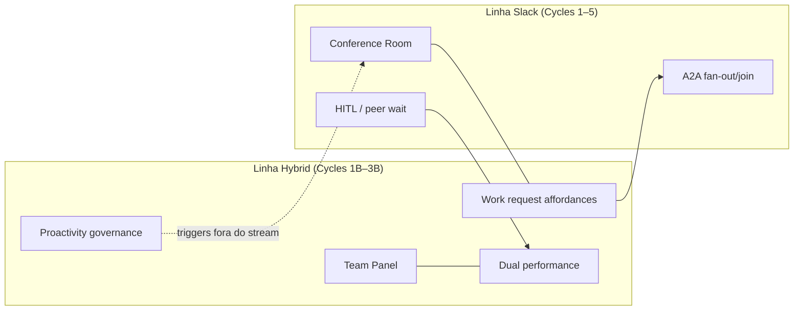

# Ciclo 3B — Deep Dive ClickUp Hybrid (Humanos + IA)

> **Data:** 2026-07-09  
> **Foco:** Transformar achados do [Ciclo 1B](../cycle-1b-clickup-discovery/00-INDEX.md) em especificação concreta de produto: matriz ClickUp↔Paperclip, UX do Hybrid Team Panel, affordances de pedido à IA, métricas dual, governança de proatividade e gap analysis atualizado no fork.  
> **Implementação:** fork `/Users/macbook/Projects/paperclip` (`QuadriniL/paperclip`)  
> **Relação com Ciclo 3:** o deep dive Slack+A2A ([cycle-3-deep-dive](../cycle-3-deep-dive/00-INDEX.md)) cobre a **Room**; este ciclo cobre o **painel híbrido** (D-09 Path B+).

---

## 1. Por que este ciclo existe

Cycles 1–5 (linha Slack) fecharam Conference Room + A2A. O Ciclo 1B mostrou o gap de produto que ClickUp **não** unificou:

| ClickUp tem | ClickUp **não** unifica | Oportunidade Paperclip |
|-------------|-------------------------|------------------------|
| Super Agents como users (`@` / assign / DM) | Capacity humano + AI no mesmo Workload | Roster + lanes híbridas |
| Autopilot (triggers) | Proatividade governada na mesma UX da Room | Routines ≠ Room (D-10) |
| AI Hub (jobs, avg cost, schedules) | Dual performance humano\|agente | Insights fora do stream (D-11) |
| Workload (humanos) | Owner humano + delegate agente | Assign-as-delegate (D-12) |

**Decisão âncora (D-09):** Path **B+** = Conference Room **+** Hybrid Team & Performance — não só chat.

---

## 2. Índice dos documentos

| # | Arquivo | Escopo |
|---|---------|--------|
| 01 | [01-clickup-concept-matrix.md](./01-clickup-concept-matrix.md) | Matriz Brain / Super Agents / Autopilot / AI Hub / Workload / Dashboards ↔ Paperclip: **COPY / ADAPT / REJECT** |
| 02 | [02-hybrid-team-panel.md](./02-hybrid-team-panel.md) | UX do Team Panel: roster, capacity lanes, status, roles (humanos + agentes) |
| 03 | [03-work-request-affordances.md](./03-work-request-affordances.md) | Como qualquer humano pede IA: `@mention`, assign-delegate, Ask, templates, forms |
| 04 | [04-dual-performance-metrics.md](./04-dual-performance-metrics.md) | Taxonomia dual humano\|agente + layout Board vs Sofia |
| 05 | [05-proactivity-governance.md](./05-proactivity-governance.md) | Quando IA é proativa vs silent-until-@; catálogo de triggers; Room vs Routines |
| 06 | [06-paperclip-hybrid-gap.md](./06-paperclip-hybrid-gap.md) | Gap analysis atualizado: **REUSE / ADAPT / BUILD** no fork (paths absolutos) |

---

## 3. Decisões herdadas (D-09 … D-13)

| ID | Decisão | Doc que detalha |
|----|---------|-----------------|
| **D-09** | Path B+: Room + Hybrid Team & Performance | 02, 06 |
| **D-10** | Proatividade governada (whitelist); Room default = silent-until-@ | 05 |
| **D-11** | Performance **fora** do stream (aba Team / Insights); dual Humano \| Agente | 04 |
| **D-12** | Assign-as-delegate: humano = owner; agente = delegate | 03 |
| **D-13** | AI Hub-like roster + Workload-like lanes no mesmo produto | 01, 02 |

---

## 4. Achados-chave (síntese operacional)

1. **Não copiar ClickUp 1:1** — copiar o *modelo mental* (agentes como colegas + hub de jobs + workload); rejeitar Brain genérico e Autopilot sem whitelist.
2. **Fork hoje:** forte em agentes (`Agents`, `OrgChart`, `Costs`, `Routines`, `run-delegation`); fraco em humanos unificados (Members via `CompanyAccess` / `UserProfile`); **sem** painel workforce híbrido; `BoardChat` ≠ gestão.
3. **Pedido fácil = stack de 4 camadas:** `@mention` (Room) → assign-as-delegate (issue) → botão “Pedir ao agente” → templates/forms — ver doc 03.
4. **Proatividade fora da Room:** schedule / event / threshold / ambient vivem em Routines + webhooks; ambient **nunca** posta no canal sem `@` (D-10).
5. **Métricas dual** alimentam Insights, não o stream — Outcome, Collaboration, Reliance, Agent health, Cost, Human orchestration, Risk.

---

## 5. Relação com a linha Slack (Cycles 1–5)

| Entrega Slack (P0–P6) | Entrega Hybrid (este ciclo → specs futuras) |
|-----------------------|---------------------------------------------|
| Mensagens, `@`, fan-out, custo na room | Roster, lanes, Insights, intake templates |
| `room-orchestrator` | `hybrid-roster` + `capacity-lanes` + `insights-api` |
| silent-until-@ na Room | Whitelist de triggers em Routines |

---

## 6. Confiança e lacunas

| Tema | Confiança | Lacuna |
|------|-----------|--------|
| Gap de código no fork (Agents/Costs/Routines/Members) | **Alta** — paths lidos | — |
| Claims ClickUp AI Hub / Workload / Autopilot | **Média** — Ciclo 1B; Cycle 2B ainda não confirmou docs oficiais | Validar URLs/docs ClickUp no 2B se ainda aberto |
| Wireframes pixel-perfect | **Média** — research UX | Spec P-hybrid futura |
| Métricas enterprise (McKinsey/Deloitte/…) | **Média** — taxonomia 1B | Instrumentação real no fork |

---

## 7. Próximo

1. Specs técnicas Hybrid (sugerido: `P-H0` roster → `P-H1` lanes → `P-H2` Insights → `P-H3` intake templates) no Cycle 5 ou pacote paralelo.  
2. Implementação no fork seguindo [06-paperclip-hybrid-gap.md](./06-paperclip-hybrid-gap.md) **depois** (ou em paralelo controlado) de P1–P2 da Room.  
3. Não bloquear Room MVP por Hybrid Panel — D-09 é Path B+, mas Room P1/P2 continua beachhead.

---

## Apêndice — Glossário rápido

| Termo | Significado neste ciclo |
|-------|-------------------------|
| **Hybrid Team Panel** | Superfície única: humanos + agentes (roster + lanes + status) |
| **Capacity lane** | Faixa de carga (WIP / horas / runs) por pessoa ou agente |
| **Assign-as-delegate** | Humano owner; agente delegate (padrão Linear) |
| **AI Hub-like** | Roster de agentes com jobs, custo médio, schedules |
| **Silent-until-@** | Agente não fala na Room sem menção / fan-out autorizado |
| **Routines** | Proatividade schedule/event no Paperclip (≠ chat ambient) |
