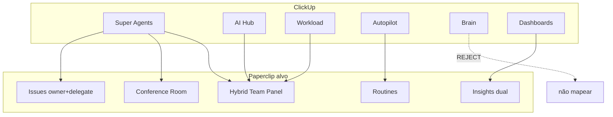

# Matriz de conceitos — ClickUp ↔ Paperclip

> **Ciclo:** 3B — ClickUp deep dive  
> **Data:** 2026-07-09  
> **Base:** [Ciclo 1B](../cycle-1b-clickup-discovery/00-INDEX.md) (D-09…D-13)  
> **Fork:** `/Users/macbook/Projects/paperclip`  
> **Legenda de veredito:** **COPY** = trazer o modelo mental quase intacto · **ADAPT** = mesma intenção, contrato Paperclip · **REJECT** = não implementar / anti-padrão

---

## 1. Sumário executivo

ClickUp é a **referência PRIMARY** de UX híbrida (agentes como users + hub de AI + workload humano). Paperclip **não** deve virar um clone: deve ser o produto que ClickUp **não** unificou — roster AI + capacity humana + custo + dual performance **no mesmo painel**, com Room silent-until-@ e proatividade em Routines.

| Conceito ClickUp | Veredito | Motivo em 1 linha |
|------------------|----------|-------------------|
| Super Agents como users | **COPY** | `@` / assign / presença = colega |
| AI Hub (roster AI) | **ADAPT** | Virar fatia do Hybrid Team Panel + Agents |
| Workload (humanos) | **ADAPT** | Lanes híbridas humano\|agente (D-13) |
| Autopilot (triggers) | **ADAPT** | = Routines + whitelist (D-10); **não** ambient na Room |
| Dashboards / Insights | **ADAPT** | Dual performance fora do stream (D-11) |
| ClickUp Brain (assistente genérico) | **REJECT** | Conflita com silent-until-@ e human owner |
| DM-first com Super Agent | **REJECT** (como default) | Thread/sala é unidade de auditoria (Cycle 3 UX) |
| Autonomia sem gate | **REJECT** | HITL + budget caps obrigatórios |

---

## 2. Matriz detalhada

### 2.1 Super Agents (agentes como users)

| Dimensão | ClickUp (modelo) | Paperclip hoje | Veredito | Ação concreta |
|----------|------------------|----------------|----------|---------------|
| Identidade | Agente aparece como membro (`@`, avatar, assign) | Agentes first-class em `Agents` / `OrgChart`; mentions `agent://` em issues | **COPY** | Manter `agent://`; estender roster híbrido |
| Menção | Autocomplete `@` em comentários/tarefas | `MarkdownEditor` + chips; `ChatComposer` da BoardChat **sem** mentions | **ADAPT** | Mentions na Room (Cycle 3 gap) + Team Panel “Pedir” |
| Assign | Assign tarefa ao Super Agent | Assign de issue a **agente** (`agent-assignability`); humano via membership | **ADAPT** | Introduzir **owner humano + delegate agente** (D-12) |
| DM | Conversa 1:1 com agente | BoardChat = concierge 1:1 (legado) | **REJECT** como default | Preferir Room/thread; DM só como atalho → cria thread |
| Status | Online / working | `active` / `running` / `paused` / `error` | **COPY** | Expor no Hybrid Panel (não só em Agents) |

**Paths REUSE:**

- `/Users/macbook/Projects/paperclip/ui/src/pages/Agents.tsx`
- `/Users/macbook/Projects/paperclip/ui/src/pages/OrgChart.tsx`
- `/Users/macbook/Projects/paperclip/ui/src/lib/mention-chips.ts`
- `/Users/macbook/Projects/paperclip/ui/src/components/MarkdownEditor.tsx`
- `/Users/macbook/Projects/paperclip/server/src/services/agent-assignability.ts`

---

### 2.2 AI Hub (roster do time AI)

| Dimensão | ClickUp AI Hub | Paperclip hoje | Veredito | Ação concreta |
|----------|----------------|----------------|----------|---------------|
| Lista de agentes | Jobs, avg cost, schedules | `Agents.tsx` (status/filter) + `Costs.tsx` (por agente) + `Routines.tsx` (schedules) — **telas separadas** | **ADAPT** | Unificar leitura no Hybrid Team Panel (D-13) |
| Jobs em andamento | Contagem / lista | Heartbeats / runs via `heartbeatsApi`; sem “jobs strip” no roster | **ADAPT** | Card por agente: runs ativos + última conclusão |
| Custo médio | Avg cost por agente | `costs` + `budgets` ricos, UI Board-density | **ADAPT** | Rail de custo Operator-friendly no panel; detalhe em Costs |
| Schedules | Visíveis no hub | Routines por agente/projeto | **ADAPT** | Link “N routines” → RoutineDetail; não duplicar editor |
| Hire / pause | Gestão do time AI | `AgentActionButtons`, pause, NewAgent | **COPY** | Reusar ações; embutir no panel |

**Não fazer:** segunda página “AI Hub” paralela a `Agents` — o panel **compõe** Agents + Costs summary + Routines count.

**Paths:**

- REUSE UI: `/Users/macbook/Projects/paperclip/ui/src/pages/Agents.tsx`, `Costs.tsx`, `Routines.tsx`
- REUSE API: `/Users/macbook/Projects/paperclip/server/src/services/costs.ts`, `budgets.ts`, `routines.ts`, `agents.ts`
- BUILD: `/Users/macbook/Projects/paperclip/ui/src/features/hybrid-team/` (ver doc 06)

---

### 2.3 Workload (capacity)

| Dimensão | ClickUp Workload | Paperclip hoje | Veredito | Ação concreta |
|----------|------------------|----------------|----------|---------------|
| Eixo humano | Horas / tasks por pessoa | Members em `CompanyAccess` / invites; **sem** workload UI | **ADAPT** | Lane humana: issues abertas (owner) + WIP |
| Eixo AI | **Ausente / separado** (gap ClickUp 1B) | Runs/heartbeats por agente; sem lane unificada | **ADAPT** | Lane agente: runs ativos + queue + budget window |
| Unificação | Gap do mercado | Oportunidade Paperclip | **COPY** (intenção) | Mesmo canvas: toggle Humano \| Agente \| Ambos |
| Drag capacity | Rebalancear carga | Não existe | **REJECT** Phase 1 | Só leitura + deep-link; drag = Phase 2+ |
| Overload visual | Barras vermelhas | Budget incidents em Costs | **ADAPT** | Overload = WIP>cap **ou** budget≥80% |

**Métricas de lane (mínimo Phase 1):**

| Lane type | Capacidade | Carga | Overload |
|-----------|------------|-------|----------|
| Humano | `wipLimit` (default 5 issues owner) | Issues `todo`+`in_progress` onde `ownerUserId=X` | carga > cap |
| Agente | `maxConcurrentRuns` (default 2) + budget window | Heartbeat runs `running`/`queued` | runs>cap **ou** spend≥80% |

---

### 2.4 Autopilot (proatividade por trigger)

| Dimensão | ClickUp Autopilot | Paperclip hoje | Veredito | Ação concreta |
|----------|-------------------|----------------|----------|---------------|
| Schedule | Cron / recorrência | `routines.ts` + UI Routines | **ADAPT** | Autopilot ≡ Routine com trigger schedule |
| Event | Webhook / mudança de status | Webhooks + plugin jobs + issue wakes | **ADAPT** | Catalogar triggers (doc 05); whitelist |
| Ambient chat | Agente “sempre ligado” no canal | BoardChat concierge (anti-padrão) | **REJECT** | Room = silent-until-@ (D-10) |
| Threshold | Ex.: budget / SLA | Budgets + quota windows | **ADAPT** | Trigger `budget_threshold` → wake **fora** da Room ou post estruturado com policy |
| UI de criação | Wizard Autopilot | Routine editor (variáveis, concurrency) | **ADAPT** | Não renomear para Autopilot; copy “Rotina proativa” |

**Regra de ouro:** Autopilot **nunca** implica “falar no canal sem `@`”. Output padrão: issue / Inbox / Routine run transcript — Room só se a rotina **mencionar** agentes ou postar com `orchestration` explícita.

**Paths:**

- `/Users/macbook/Projects/paperclip/server/src/services/routines.ts`
- `/Users/macbook/Projects/paperclip/ui/src/pages/Routines.tsx`
- `/Users/macbook/Projects/paperclip/ui/src/pages/RoutineDetail.tsx`
- `/Users/macbook/Projects/paperclip/server/src/services/webhook-trigger-rate-limit.ts`

---

### 2.5 ClickUp Brain

| Dimensão | ClickUp Brain | Paperclip | Veredito | Motivo |
|----------|---------------|-----------|----------|--------|
| Assistente onipresente | Responde em qualquer contexto | Concierge BoardChat | **REJECT** | Quebra silent-until-@; custo opaco; “mágico” |
| Busca / resumo | Cross-workspace Q&A | `Search.tsx` + company search | **ADAPT** (busca) | Busca sim; “Brain chat” não |
| Auto-write em tasks | Gera descrição | Skills / agents sob pedido | **ADAPT** | Só via `@` ou template “Pedir ao agente” |
| Knowledge base | Docs indexados | Documents / artifacts | **ADAPT** (F4/memória depois) | Fora do Hybrid Panel Phase 1 |

---

### 2.6 Dashboards

| Dimensão | ClickUp Dashboards | Paperclip hoje | Veredito | Ação concreta |
|----------|--------------------|----------------|----------|---------------|
| Widgets livres | Drag-and-drop | `Dashboard.tsx` / `DashboardLive.tsx` operacionais | **ADAPT** | Insights dual fixos (doc 04); não builder genérico Phase 1 |
| Board vs Operator | Mesmo dashboard | Costs = Board-heavy | **ADAPT** | Duas densidades: Sofia (Outcome/Reliance) vs Board (Cost/Health/Risk) |
| Fora do stream | Sim | N/A | **COPY** | D-11: aba Team / Insights, nunca poluir Room |
| Real-time | Parcial | `DashboardLive` + WS | **ADAPT** | Live só para Agent health / runs; métricas diárias batch OK |

**Paths:**

- `/Users/macbook/Projects/paperclip/ui/src/pages/Dashboard.tsx`
- `/Users/macbook/Projects/paperclip/ui/src/pages/DashboardLive.tsx`
- `/Users/macbook/Projects/paperclip/server/src/services/dashboard.ts`
- `/Users/macbook/Projects/paperclip/server/src/routes/dashboard.ts`

---

## 3. Matriz condensada (copy/adapt/reject)

| Conceito | COPY | ADAPT | REJECT |
|----------|:----:|:-----:|:------:|
| Agente como user (`@`, avatar, status) | ✓ | | |
| Assign a agente | | ✓ (owner+delegate) | |
| AI Hub roster unificado | | ✓ | |
| Workload humano | | ✓ | |
| Workload híbrido (humano+AI) | ✓ (intenção) | ✓ (impl) | |
| Drag-and-drop capacity | | | ✓ Phase 1 |
| Autopilot = Routines | | ✓ | |
| Ambient Autopilot na Room | | | ✓ |
| ClickUp Brain chat | | | ✓ |
| Dashboards dual Insights | | ✓ | |
| Widget builder livre | | | ✓ Phase 1 |
| DM-first agent | | | ✓ default |
| Cost rail no roster | | ✓ | |
| Schedules linkados a routines | | ✓ | |

---

## 4. Mapeamento ClickUp → superfície Paperclip alvo

| ClickUp | Superfície Paperclip | Prioridade |
|---------|----------------------|------------|
| Super Agents | Room + Issues + Hybrid roster | P0–P2 Room; P-H0 Panel |
| AI Hub | Hybrid Team Panel (aba Agentes) | P-H0 |
| Workload | Hybrid Team Panel (aba Capacidade) | P-H1 |
| Autopilot | Routines (+ trigger catalog) | Já existe; governar P-H0 |
| Dashboards | Insights (Team) | P-H2 |
| Brain | — | Nunca como default |

---

## 5. Anti-padrões a rejeitar explicitamente

1. **“Brain no canto”** que responde a tudo sem `@`.  
2. **Autopilot que posta no canal** como se fosse colega falando sozinho.  
3. **Workload só humano** (repetir o gap ClickUp).  
4. **AI Hub separado** do painel de humanos (dois produtos mentais).  
5. **Métricas no meio do chat** (D-11).  
6. **Agente como owner** da issue sem humano responsável (quebra D-12 / HITL).

---

## 6. Critérios de aceite da matriz (research → produto)

- [ ] Cada conceito ClickUp tem veredito COPY/ADAPT/REJECT documentado.  
- [ ] Nenhum REJECT vira feature “escondida” na Room.  
- [ ] Hybrid Panel cobre AI Hub + Workload na **mesma** navegação (D-13).  
- [ ] Autopilot mapeado para Routines com whitelist (doc 05).  
- [ ] Paths de BUILD listados no [06-paperclip-hybrid-gap.md](./06-paperclip-hybrid-gap.md).

---

## 7. Fontes

| ID | Fonte | Uso |
|----|-------|-----|
| 1B | `cycle-1b-clickup-discovery/00-INDEX.md` | Decisões D-09…D-13, gap unificação |
| C3-UX | `cycle-3-deep-dive/02-ux-slack-room.md` | Silent-until-@, human owner, anti-Brain |
| C3-GAP | `cycle-3-deep-dive/04-paperclip-gap-analysis.md` | Room/A2A (complementar, não substituído) |
| Fork | pages Agents/Costs/Routines/Dashboard/CompanyAccess | Estado atual |
