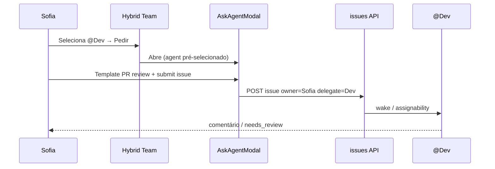

# Affordances — como qualquer humano pede trabalho à IA

> **Ciclo:** 3B — ClickUp deep dive  
> **Data:** 2026-07-09  
> **Decisões:** D-12 (assign-as-delegate), D-10 (silent-until-@ na Room)  
> **Referências UX:** Linear Agents, Claude Tag, ClickUp Super Agents, Cycle 3 Room UX  
> **Fork:** `/Users/macbook/Projects/paperclip`

---

## 1. Princípio

Pedir IA deve ser **tão fácil quanto pedir a um colega** — e **mais seguro** (owner humano, custo visível, silent-until-@).

Stack obrigatória (Ciclo 1B): **quatro camadas**, não uma só.

```
① @mention (Room)  →  ② assign-as-delegate (Issue)  →  ③ Ask button  →  ④ templates/forms
```

Qualquer humano `member+` usa as quatro. Viewer só lê.

---

## 2. Camada ① — `@mention` na Conference Room

| Aspecto | Spec |
|---------|------|
| **Onde** | BoardChat / Room composer |
| **Como** | Digitar `@` → autocomplete agentes (Agent Cards) + humanos |
| **Serialização** | `[@Nome](agent://<id>)` (canônico) |
| **Efeito** | 0 `@` → silêncio agentes; 1 `@` → wake; N `@` → fan-out A2A (P2) |
| **Owner** | Autor humano da mensagem = owner do thread |
| **Custo** | Só após wake; pill na bolha (P4) |

**Não é:** substitute de gestão de capacidade (isso é Team Panel).

**Paths ADAPT:**

- `/Users/macbook/Projects/paperclip/ui/src/pages/BoardChat.tsx`
- `/Users/macbook/Projects/paperclip/ui/src/components/ChatComposer.tsx`
- `/Users/macbook/Projects/paperclip/ui/src/components/MarkdownEditor.tsx`
- `/Users/macbook/Projects/paperclip/server/src/services/room-orchestrator.ts` (BUILD Cycle 3)

**Quando usar:** conversa rápida, fan-out, alinhamento multiplayer.

---

## 3. Camada ② — Assign-as-delegate (Linear-style)

### 3.1 Modelo de dados

| Campo | Significado | Obrigatório |
|-------|-------------|-------------|
| `ownerUserId` | Humano responsável (HITL, SLA, “precisa de você”) | **Sim** em trabalho agentic |
| `assigneeAgentId` **ou** `delegateAgentId` | Agente que executa | Sim se pedido à IA |
| `assigneeUserId` | Humano executor (trabalho só-humano) | Opcional |

**Regra D-12:** agente **nunca** é o único “dono”. Se UI hoje só tem `assignee` agente, Phase Hybrid introduz:

```
owner = human
delegate = agent
```

Compat: issues antigas só com `assigneeAgentId` → UI mostra owner = criador / Board fallback + banner “definir owner”.

### 3.2 UX na Issue

```
Owner:     [Sofia ▾]     (humano)
Delegate:  [@Dev ▾]      (agente)   ← “Quem executa”
```

Atalhos:

- “Assign to me + delegate @X”  
- “Só humano” (limpa delegate)  
- “Só eu no loop” (owner=me, sem delegate — trabalho manual)

### 3.3 Efeito no runtime

| Evento | Comportamento |
|--------|---------------|
| Criar/atualizar com delegate | Wake / checkout policy existente (`agent-assignability`) |
| Comentário com `@` | Menciona **além** do delegate (não substitui) |
| Delegate termina | Owner notificado; estado `needs_review` se policy |

**Paths:**

- ADAPT: `/Users/macbook/Projects/paperclip/server/src/services/agent-assignability.ts`
- ADAPT: `/Users/macbook/Projects/paperclip/server/src/services/issues.ts`
- ADAPT: issue UI (`IssueDetail.tsx`, assignee selectors)
- BUILD validators: `/Users/macbook/Projects/paperclip/packages/shared/src/validators/issue-ownership.ts`

**Quando usar:** trabalho durável, auditável, com SLA — beachhead Software Houses.

---

## 4. Camada ③ — Botão “Pedir ao agente” (Ask)

### 4.1 Onde aparece

| Superfície | Label | Destino |
|------------|-------|---------|
| Hybrid Team drawer | **Pedir ao agente** | Modal Ask |
| AgentDetail | **Pedir trabalho** | Modal Ask |
| Issue (sem delegate) | **Delegar a agente** | Mesmo modal, pré-liga issue |
| Room empty state | **Pedir a um agente** | Modal → posta na Room **ou** cria issue |
| Inbox / MyIssues | Ação rápida | Modal |

### 4.2 Modal Ask — campos

| Campo | Tipo | Default |
|-------|------|---------|
| Agente | select (roster agentes available/busy) | pré-selecionado do contexto |
| Owner | select humanos | usuário atual |
| Modo | `issue` \| `room` | `issue` (durável) |
| Título | string | template |
| Brief | markdown | template body |
| Prioridade | enum | normal |
| Projeto | optional | último usado |
| Orçamento máx. | optional cents | company default |

**Submit `issue`:** cria issue `owner=me`, `delegate=agent`, opcional wake.  
**Submit `room`:** navega Room com draft `[@agent](agent://…) brief`.

### 4.3 Microcopy (Sofia)

- Título modal: “Pedir trabalho a {@Dev}”  
- Helper: “Você continua responsável. O agente executa.”  
- Footer: “Custo estimado: depende do tamanho do pedido — você verá o gasto na issue/sala.”

**Paths BUILD:**

- `/Users/macbook/Projects/paperclip/ui/src/features/work-request/AskAgentModal.tsx`
- `/Users/macbook/Projects/paperclip/ui/src/features/work-request/use-ask-agent.ts`
- `/Users/macbook/Projects/paperclip/server/src/routes/work-requests.ts` (opcional; pode compor issues API existente)

**Quando usar:** usuário não quer “saber Slack”; um clique a partir do Team Panel.

---

## 5. Camada ④ — Templates e forms

### 5.1 Templates (biblioteca mínima beachhead)

| ID | Nome | Uso | Campos extras |
|----|------|-----|---------------|
| `tpl-pr-review` | Revisar PR | SH | `prUrl`, `risk` |
| `tpl-bug-repro` | Reproduzir bug | SH | `steps`, `env` |
| `tpl-status-digest` | Resumo de status | Ops | `since`, `projectId` |
| `tpl-draft-reply` | Rascunho de resposta | Support | `ticketRef`, `tone` |
| `tpl-research` | Pesquisa curta | Research | `question`, `sources` |
| `tpl-blank` | Em branco | geral | — |

Cada template preenche título + brief markdown + agente sugerido (role match).

### 5.2 Forms (structured intake)

Para pedidos repetíveis com validação:

```
Form "Revisão de PR"
  prUrl: url required
  checklist: multi-select
  agent: default @QA
  → issue + labels + delegate
```

**Phase 1:** templates markdown estáticos no client.  
**Phase 2:** forms Zod no server (`work-request-templates`).

**Não copiar:** ClickUp Brain “escreve a task por você” sem owner — template **exige** owner + confirmação.

### 5.3 Onde editar templates

| Role | Pode |
|------|------|
| Board admin | CRUD templates da company |
| Member | Usar |
| Agent | Não edita templates |

Path BUILD (Phase 2): `/Users/macbook/Projects/paperclip/server/src/services/work-request-templates.ts`

---

## 6. Matriz de decisão — qual affordance?

| Situação | Preferir | Evitar |
|----------|----------|--------|
| “Olha isso rápido, @Dev” | ① Room mention | Form pesado |
| Bug com SLA e histórico | ② Issue owner+delegate | Só DM/Room sem issue |
| Sofia no Team Panel | ③ Ask button → issue | Configurar assignee manual cru |
| Pedido semanal idêntico | ④ Template / Routine | Digitar brief do zero |
| Fan-out Dev+QA | ① Room `@Dev @QA` | Duas issues sem join |
| Trabalho 100% humano | Issue owner+assignee humano | Mentions de agente |

---

## 7. Fluxos ponta a ponta

### F-W1 — Ask a partir do Team Panel



### F-W2 — Mention na Room vira trabalho durável

1. Sofia `@Dev` na Room.  
2. Após resposta útil, CTA na bolha: **“Promover a issue”** (owner=Sofia, delegate=Dev, link thread).  
3. Trabalho longo sai do chat efêmero.

### F-W3 — Assign delegate em issue existente

1. Issue humana sem agente.  
2. Sofia seta Delegate `@QA`.  
3. Sistema valida assignability; wake; Inbox de Sofia recebe updates.

---

## 8. Permissões e segurança

| Regra | Detalhe |
|-------|---------|
| Quem pede | `member+` da company |
| Quem é delegate | Agente da mesma company, não terminated, assignable |
| Human API | Browser **nunca** manda agent JWT; wakes via server (Cycle 3) |
| Budget | Se policy bloqueia, Ask mostra erro acionável |
| Rate limit | Mentions/Ask por user (anti storm) |

---

## 9. Estados de UI do pedido

| Estado | Onde mostra | Sofia |
|--------|-------------|-------|
| `draft` | Modal | Editando |
| `queued` | Issue / Room | “Na fila do agente” |
| `running` | Lane + issue | “Em execução” |
| `needs_you` | Inbox + badge | CTA aprovar/responder |
| `done` | Issue closed / thread | Resumo |
| `failed` | Issue + Team error | “Falhou — ver detalhes / Board” |

---

## 10. Anti-padrões

1. Ask que **só** abre chat sem owner.  
2. Assign agente **sem** owner humano.  
3. Template que auto-executa Autopilot sem confirmação.  
4. Mencionar 8 agentes “por garantia” (UI deve avisar custo/fan-out).  
5. Forms com 20 campos no beachhead (máx ~5).  

---

## 11. Critérios de pronto

- [ ] As 4 camadas documentadas e ligadas a paths.  
- [ ] D-12 refletido no modelo owner+delegate.  
- [ ] Ask modal usável a partir do Team Panel sem conhecer Room.  
- [ ] Templates mínimos SH/Support listados.  
- [ ] Matriz de decisão cobre Sofia leiga e Board técnico.
