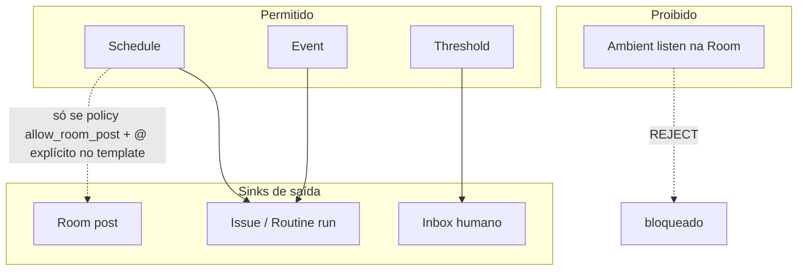

# Governança de proatividade — Room vs Routines

> **Ciclo:** 3B — ClickUp deep dive  
> **Data:** 2026-07-09  
> **Decisão:** D-10 — proatividade **governada** (whitelist); default Room = **silent-until-@**  
> **Analogia ClickUp:** Autopilot → Paperclip **Routines** (+ webhooks); **não** ambient chat  
> **Fork:** `/Users/macbook/Projects/paperclip/server/src/services/routines.ts`

---

## 1. Regra de ouro

| Superfície | Default do agente | Pode ser proativo? |
|------------|-------------------|--------------------|
| **Conference Room** | Silent-until-`@` (ou fan-out já autorizado) | **Não** — salvo exceção whitelist **explícita** e rara |
| **Routines / cron / webhook** | Dispara run fora do stream | **Sim** — dentro do catálogo |
| **Issue assign/delegate** | Wake por assignability | **Sim** — é pedido humano estruturado |
| **Inbox / Approvals** | Notifica humano | N/A (sistema → humano) |

> Ambient “sempre ouvindo o canal” = **REJECT** (matriz ClickUp Brain/Autopilot ambient).

---

## 2. Modelo mental: quatro classes de trigger

Do Ciclo 1B:

| Classe | Definição | Exemplo | Onde vive |
|--------|-----------|---------|-----------|
| **Schedule** | Tempo / cron | “Todo dia 9h digere Inbox” | Routines |
| **Event** | Fato no sistema ou webhook | “PR opened”, “issue labeled `urgent`” | Routines / webhooks / plugins |
| **Threshold** | Métrica cruzou limiar | “Budget 80%”, “fila > 10” | Budgets + routine/policy hook |
| **Ambient** | Observa conversa sem `@` | “Responde qualquer msg na Room” | **PROIBIDO** na Room |



---

## 3. Catálogo de triggers (whitelist)

Cada trigger tem: `id`, classe, sink default, requer aprovação Board?, Phase.

### 3.1 Schedule

| ID | Descrição | Sink default | Board approve? | Phase |
|----|-----------|--------------|----------------|-------|
| `sched.cron` | Cron expression + timezone (já em Routines) | Routine run → issue/transcript | Não (admin cria) | **Agora** |
| `sched.weekday_digest` | Preset “dias úteis HH:MM” | Issue digest + Inbox | Não | P-H0 |
| `sched.monthly_cost_report` | 1º dia útil do mês | Inbox Board + Costs snapshot | Não | P-H2 |

### 3.2 Event

| ID | Descrição | Sink default | Board approve? | Phase |
|----|-----------|--------------|----------------|-------|
| `event.issue_created` | Nova issue (filtros label/project) | Wake delegate se set | Não | ADAPT routines |
| `event.issue_labeled` | Label ∈ set | Wake / comment | Não | P-H0 |
| `event.pr_opened` | Webhook GitHub/GitLab | Issue + delegate `@QA` | Sim (conectar webhook) | P-H1 |
| `event.approval_timeout` | HITL sem resposta > N h | Reminder Inbox owner | Não | P3 Room |
| `event.delegation_child_failed` | Hop A2A failed | Inbox owner + Board | Não | P2 |
| `event.cursor_webhook` | Já existe ingest | Continuar policy atual | Já | **Agora** |

**Paths REUSE event-ish:**

- `/Users/macbook/Projects/paperclip/server/src/services/routines.ts`
- `/Users/macbook/Projects/paperclip/server/src/services/cursor-webhook-ingest.ts`
- `/Users/macbook/Projects/paperclip/server/src/services/webhook-trigger-rate-limit.ts`
- `/Users/macbook/Projects/paperclip/server/src/services/plugin-job-scheduler.ts`

### 3.3 Threshold

| ID | Descrição | Sink default | Board approve? | Phase |
|----|-----------|--------------|----------------|-------|
| `thr.budget_80` | Spend ≥ 80% window | Inbox + BudgetIncident | Policy já | **Agora** (Costs) |
| `thr.budget_100` | Spend ≥ 100% | Block / incident | Policy | **Agora** |
| `thr.agent_error_rate` | Erros > X% em 24h | Inbox Board; opcional pause | Sim para auto-pause | P-H2 |
| `thr.human_wip` | Owner WIP > cap | Inbox humano (não wake agente) | Não | P-H1 |
| `thr.queue_depth` | Agent queue > N | Inbox Board | Não | P-H1 |

### 3.4 Ambient — lista negra explícita

| ID | Comportamento | Status |
|----|---------------|--------|
| `ambient.room_listen` | Agente responde msg sem `@` | **BLOCK** |
| `ambient.boardchat_concierge_always` | Concierge sempre ligado | **DEPRECATE** (fallback só se 0 `@` **e** flag legado; beachhead SH: off) |
| `ambient.dm_unsolicited` | Agente inicia DM | **BLOCK** Phase 1 |
| `ambient.rewrite_others_messages` | Edita posts alheios | **BLOCK** |

---

## 4. Room vs Routines — contrato

### 4.1 Room

| Pode | Não pode |
|------|----------|
| Responder a `@` | Falar sem `@` |
| Participar de fan-out autorizado | “Ouvir” o canal |
| Postar join/síntese do grafo daquele thread | Cron postar “Bom dia time” no canal |
| Pedir HITL (`needs_you`) | Auto-aprovar |

**Exceção controlada `allow_room_post`:** Routine pode **criar** uma mensagem na Room **somente se**:

1. Template inclui ≥1 `agent://` mention **ou** `orchestration` explícita; **e**  
2. Company setting `routines.canPostToRoom = true`; **e**  
3. Rate limit por routine/dia; **e**  
4. Mensagem marcada `source: routine:<id>` (audit).

Default de `routines.canPostToRoom` = **false**.

### 4.2 Routines (Autopilot Paperclip)

| Pode | Não pode |
|------|----------|
| Cron / event / threshold da whitelist | Triggers fora do catálogo sem review Board |
| Criar/atualizar issues | Bypass budget |
| Acordar agente assignable | Spawn Claude CLI no Coolify (usar adapters) |
| Notificar Inbox | Ambient Room |

**UI copy:** evitar a palavra “Autopilot” se confundir com ambient; preferir **“Rotina”** / **“Agendamento proativo”**.

**Paths:**

- UI: `/Users/macbook/Projects/paperclip/ui/src/pages/Routines.tsx`, `RoutineDetail.tsx`
- Server: `/Users/macbook/Projects/paperclip/server/src/services/routines.ts`
- Routes: `/Users/macbook/Projects/paperclip/server/src/routes/routines.ts`
- Plugins: `/Users/macbook/Projects/paperclip/server/src/services/plugin-managed-routines.ts`

---

## 5. Policy engine (BUILD)

Codificar whitelist — não só prompt de skill.

| Artefato | Path proposto |
|----------|---------------|
| Catálogo + tipos | `/Users/macbook/Projects/paperclip/packages/shared/src/validators/proactivity-triggers.ts` |
| Serviço | `/Users/macbook/Projects/paperclip/server/src/services/proactivity-policy.ts` |
| Testes | `/Users/macbook/Projects/paperclip/server/src/__tests__/proactivity-policy.test.ts` |
| Integração Room | chamado por `room-policy.ts` (Cycle 3) |
| Integração Routines | gate antes de enqueue run |

### 5.1 Pseudocontrato

```ts
type TriggerClass = "schedule" | "event" | "threshold" | "ambient";

type ProactivityDecision =
  | { allow: true; sink: "issue" | "inbox" | "room"; triggerId: string }
  | { allow: false; reason: "not_whitelisted" | "ambient_forbidden" | "rate_limited" | "budget_blocked" | "room_post_disabled" };
```

`ambient_*` → sempre `allow: false`.

### 5.2 Relação com `room-policy`

| Camada | Responsabilidade |
|--------|------------------|
| `room-policy` | Quem pode `@` quem; silent-until-@; fan-out caps |
| `proactivity-policy` | Se um **wake sem menção humana** é legítimo (routine/threshold) |
| `run-delegation` | Execução A2A após wake legítimo |

---

## 6. UX de governança (Board)

### 6.1 Tela “Proatividade” (company settings)

| Seção | Conteúdo |
|-------|----------|
| Room | Toggle “Concierge sem `@`” default **OFF**; help D-10 |
| Routines → Room | `canPostToRoom` default OFF |
| Whitelist | Lista read-only dos trigger IDs ativos + link docs |
| Audit | Últimos 50 wakes proativos (triggerId, agent, sink) |

Path ADAPT: `/Users/macbook/Projects/paperclip/ui/src/pages/CompanySettings.tsx`  
ou BUILD: `/Users/macbook/Projects/paperclip/ui/src/pages/CompanyProactivitySettings.tsx`

### 6.2 Sofia

Não configura triggers. Vê:

- Routines do time em linguagem simples (“Todo dia o @Ops resume a fila”).  
- Na Room: nunca é “surpreendida” por agente sem `@`.

---

## 7. Matriz de decisão rápida

| Quero… | Use | Não use |
|--------|-----|---------|
| Agente responde no canal agora | `@mention` / Ask→Room | Routine |
| Relatório diário | Routine schedule → issue/Inbox | Post ambient Room |
| Alerta de verba | Threshold budget (já Costs) | Agente spam no chat |
| Revisar todo PR | Event webhook → issue+delegate | Brain ambient |
| “IA que escuta tudo” | — | **REJECT** |

---

## 8. Métricas de governança (liga ao doc 04)

| KPI | Meta beachhead |
|-----|----------------|
| K4 Ambient wake count | **0** |
| Routine runs com sink Room | 0 se `canPostToRoom=false` |
| Wakes com `triggerId` null (legado) | → 0 após migração |
| Rate-limit hits | monitorar; não silenciar |

---

## 9. Migração do concierge BoardChat

| Hoje | Alvo |
|------|------|
| `board-chat.ts` spawna Claude sempre | 0 `@` → **no agent reply** (SH) **ou** agent-of-record só se flag `legacyConcierge` |
| Skill `paperclip-board` | Skill room: silent-until-@ + delegate |

Alinha Cycle 3 gap §2.2 / §2.4.

---

## 10. Critérios de pronto

- [ ] Quatro classes documentadas; ambient na blacklist.  
- [ ] Catálogo com IDs estáveis e phases.  
- [ ] Room vs Routines com `canPostToRoom` default false.  
- [ ] Paths BUILD `proactivity-policy` definidos.  
- [ ] Meta K4 = 0 explícita.  
- [ ] Copy UI evita “Autopilot ambient”.
