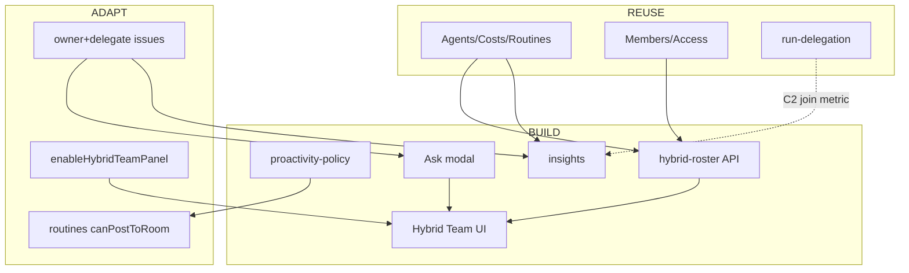

# Gap Analysis — Hybrid Team Panel no fork Paperclip

> **Ciclo:** 3B — ClickUp deep dive  
> **Data:** 2026-07-09  
> **Fork:** `/Users/macbook/Projects/paperclip` (`QuadriniL/paperclip`)  
> **Produto-alvo:** Hybrid Team & Performance (D-09) **além** da Conference Room  
> **Complementa:** [cycle-3-deep-dive/04-paperclip-gap-analysis.md](../cycle-3-deep-dive/04-paperclip-gap-analysis.md) (Room/A2A) — **não substitui**  
> **Base:** Ciclo 1B + docs 01–05 deste pacote  
> **Confiança:** Alta nos gaps de código (páginas/serviços listados); média em schema exato de `ownerUserId` (validar migration)

---

## Sumário executivo

O fork é **forte em agentes** (Agents, OrgChart, Costs, Routines, run-delegation) e **fraco em workforce híbrido**: humanos vivem em Access/Invites/Profile; **não há** canvas único roster+lanes+insights; pedido à IA está fragmentado (assign agente ≠ owner+delegate; BoardChat ≠ Ask).

| Bucket | Veredito Hybrid |
|--------|-----------------|
| **REUSE** | Agents, OrgChart, Costs/Budgets, Routines, heartbeats, member roles, mention chips, TeamCatalog patterns |
| **ADAPT** | Issues assignee → owner+delegate; CompanyAccess feed do roster; BoardChat/Ask entrypoints; Dashboard → Insights density |
| **BUILD** | Hybrid Team UI, roster merge API, capacity lanes, Ask modal, insights service, proactivity-policy, issue-ownership validators |
| **DEFER** | Drag workload, widget builder, presence Slack-like, Brain chat, import ClickUp |

---

## 0. Relação com o gap da Room (Cycle 3)

| Tema | Cycle 3 (Room) | Cycle 3B (Hybrid) |
|------|----------------|-------------------|
| Mentions / A2A | BUILD room-orchestrator | Consome; Ask pode abrir Room |
| BoardChat | ADAPT multiplayer | Entry “Pedir” → Room draft |
| Costs na bolha | P4 | Insights agrega Costs |
| Routines | Mencionado de passagem | **Centro** da proatividade |
| Humans | HITL owner na thread | Roster + WIP lanes |

**Ordem sugerida:** não bloquear P1–P2 Room. Hybrid P-H0 pode começar em paralelo após Agents/Costs estáveis (já estão).

---

## 1. REUSE

Componentes maduros — consumir sem redesign.

### 1.1 Agentes e org

| Item | Path |
|------|------|
| Lista agentes | `/Users/macbook/Projects/paperclip/ui/src/pages/Agents.tsx` |
| Org chart | `/Users/macbook/Projects/paperclip/ui/src/pages/OrgChart.tsx` |
| Agent detail | `/Users/macbook/Projects/paperclip/ui/src/pages/AgentDetail.tsx` |
| Status/actions | `/Users/macbook/Projects/paperclip/ui/src/components/AgentActionButtons.tsx`, `StatusBadge` |
| Active panel | `/Users/macbook/Projects/paperclip/ui/src/components/ActiveAgentsPanel.tsx` |
| Agents service | `/Users/macbook/Projects/paperclip/server/src/services/agents.ts` |
| Assignability | `/Users/macbook/Projects/paperclip/server/src/services/agent-assignability.ts` |

**Reuso:** status filters (`active`/`paused`/`error`), hide terminated, role labels, pause/resume no drawer do Hybrid Panel.

### 1.2 Custos e budgets

| Item | Path |
|------|------|
| UI Costs | `/Users/macbook/Projects/paperclip/ui/src/pages/Costs.tsx` |
| Costs service | `/Users/macbook/Projects/paperclip/server/src/services/costs.ts` |
| Budgets | `/Users/macbook/Projects/paperclip/server/src/services/budgets.ts` |
| Routes | `/Users/macbook/Projects/paperclip/server/src/routes/costs.ts` |

**Reuso:** rail de $ nas lanes + cards Insights; **não** duplicar ledger.

### 1.3 Routines (Autopilot)

| Item | Path |
|------|------|
| UI | `/Users/macbook/Projects/paperclip/ui/src/pages/Routines.tsx`, `RoutineDetail.tsx` |
| Service | `/Users/macbook/Projects/paperclip/server/src/services/routines.ts` |
| Routes | `/Users/macbook/Projects/paperclip/server/src/routes/routines.ts` |
| Plugin-managed | `/Users/macbook/Projects/paperclip/server/src/services/plugin-managed-routines.ts` |

**Reuso:** schedules no card do agente (“N routines”); proatividade = Routines + policy (doc 05).

### 1.4 Humanos / membership (parcial)

| Item | Path |
|------|------|
| Company access | `/Users/macbook/Projects/paperclip/ui/src/pages/CompanyAccess.tsx` |
| Invites | `/Users/macbook/Projects/paperclip/ui/src/pages/CompanyInvites.tsx` |
| User profile | `/Users/macbook/Projects/paperclip/ui/src/pages/UserProfile.tsx` |
| Profile settings | `/Users/macbook/Projects/paperclip/ui/src/pages/ProfileSettings.tsx` |
| Member roles | `/Users/macbook/Projects/paperclip/server/src/services/company-member-roles.ts` |
| Resource memberships | `/Users/macbook/Projects/paperclip/server/src/services/resource-memberships.ts` |
| Access routes | `/Users/macbook/Projects/paperclip/server/src/routes/access.ts` |
| User profiles routes | `/Users/macbook/Projects/paperclip/server/src/routes/user-profiles.ts` |
| Mentions members helper | `/Users/macbook/Projects/paperclip/ui/src/lib/company-members.ts` |

**Reuso:** popular lado humano do roster; roles; invites empty-state.

### 1.5 Runs / liveness / activity

| Item | Path |
|------|------|
| Heartbeat / runs | `/Users/macbook/Projects/paperclip/server/src/services/heartbeat.ts` |
| Run liveness | `/Users/macbook/Projects/paperclip/server/src/services/run-liveness.ts` |
| Activity | `/Users/macbook/Projects/paperclip/ui/src/pages/Activity.tsx` |
| Delegation | `/Users/macbook/Projects/paperclip/server/src/services/run-delegation.ts` |

**Reuso:** carga das lanes de agente; health Insights (A1–A4); join success (C2).

### 1.6 Mentions e composer

| Item | Path |
|------|------|
| Chips | `/Users/macbook/Projects/paperclip/ui/src/lib/mention-chips.ts` |
| MarkdownEditor | `/Users/macbook/Projects/paperclip/ui/src/components/MarkdownEditor.tsx` |
| Recent assignees | `/Users/macbook/Projects/paperclip/ui/src/lib/recent-assignees.ts` |

**Reuso:** Ask modal e Room draft; não reinventar `agent://`.

### 1.7 Dashboard shell

| Item | Path |
|------|------|
| Dashboard | `/Users/macbook/Projects/paperclip/ui/src/pages/Dashboard.tsx` |
| Dashboard live | `/Users/macbook/Projects/paperclip/ui/src/pages/DashboardLive.tsx` |
| Service | `/Users/macbook/Projects/paperclip/server/src/services/dashboard.ts` |

**Reuso:** padrões de cards/live; Insights é superfície **nova** (não inchando Dashboard genérico).

### 1.8 Team catalog (padrão de UI densa)

| Item | Path |
|------|------|
| TeamCatalog | `/Users/macbook/Projects/paperclip/ui/src/pages/TeamCatalog.tsx` |

**Reuso:** padrões de lista/install — **não** confundir com Hybrid Team (catálogo ≠ workforce).

---

## 2. ADAPT

### 2.1 Issues: assignee agente → owner humano + delegate agente

| Hoje | Alvo (D-12) |
|------|-------------|
| Assignability foca `assigneeAgentId` | `ownerUserId` + `delegateAgentId` (nomes finais na migration) |
| UI assignee único | Dois seletores (doc 03) |

**Paths:**

- `/Users/macbook/Projects/paperclip/server/src/services/agent-assignability.ts`
- `/Users/macbook/Projects/paperclip/server/src/services/issues.ts`
- `/Users/macbook/Projects/paperclip/server/src/routes/issues.ts`
- `/Users/macbook/Projects/paperclip/ui/src/pages/IssueDetail.tsx`
- OpenAPI: `/Users/macbook/Projects/paperclip/server/src/routes/openapi.ts`

**Migração:** issues só com agente → owner = `createdBy` humano se existir; senão flag orphan (K3).

### 2.2 CompanyAccess → feed de roster (não substituir ACL)

Access continua sendo ACL. Hybrid Team **lê** membros ativos via mesmas APIs; não mover invites para o panel (só deep-link).

### 2.3 BoardChat / entry points de pedido

| Hoje | Alvo |
|------|------|
| Concierge always-on | silent-until-@ (Cycle 3) |
| Sem Ask | CTAs Ask no Team / AgentDetail / Issue |

ADAPT mínimo: botões que abrem Ask ou draft Room — sem esperar Hybrid page completa.

### 2.4 Dashboard density → preferência Sofia|Board

Reusar toggle de densidade da Room (quando existir) para Insights. Se ainda não houver preference store, ADAPT `sidebar-preferences` / instance settings.

- `/Users/macbook/Projects/paperclip/server/src/services/sidebar-preferences.ts`
- `/Users/macbook/Projects/paperclip/ui/src/pages/InstanceExperimentalSettings.tsx` (flag hybrid)

### 2.5 Routines UI — governança

ADAPT copy + settings `canPostToRoom` (doc 05); não renomear produto para Autopilot.

### 2.6 Skill board → room (já no Cycle 3)

Mantém: silent-until-@; proatividade aponta para Routines.

---

## 3. BUILD

Net-new. Vertical slices; paths absolutos propostos.

### 3.1 Hybrid Team UI

| Artefato | Path |
|----------|------|
| Feature root | `/Users/macbook/Projects/paperclip/ui/src/features/hybrid-team/` |
| Page | `/Users/macbook/Projects/paperclip/ui/src/pages/HybridTeam.tsx` |
| Roster | `.../hybrid-team/RosterList.tsx` |
| Lanes | `.../hybrid-team/CapacityLanes.tsx` |
| Drawer | `.../hybrid-team/PrincipalDetailDrawer.tsx` |
| Hook | `.../hybrid-team/use-hybrid-roster.ts` |
| Insights UI | `.../hybrid-team/InsightsPanel.tsx` |
| Types/Zod | `.../hybrid-team/hybrid-team.types.ts` |

**Flag:** `enableHybridTeamPanel` em experimental settings (espelhar `enableConferenceRoomChat`).

### 3.2 Roster merge API

| Artefato | Path |
|----------|------|
| Service | `/Users/macbook/Projects/paperclip/server/src/services/hybrid-roster.ts` |
| Route | `/Users/macbook/Projects/paperclip/server/src/routes/hybrid-roster.ts` |
| Validator | `/Users/macbook/Projects/paperclip/packages/shared/src/validators/hybrid-roster.ts` |
| Tests | `/Users/macbook/Projects/paperclip/server/src/__tests__/hybrid-roster.test.ts` |

**Contrato sugerido:**

```http
GET /api/companies/:companyId/hybrid-roster
→ { principals: HybridPrincipal[], generatedAt }
```

`HybridPrincipal` = human|agent + status unificado + wip/runs + budget snippet.

### 3.3 Capacity / WIP aggregation

Pode viver dentro de `hybrid-roster.ts` Phase 1 (evitar serviço extra). Se crescer:

- `/Users/macbook/Projects/paperclip/server/src/services/capacity-lanes.ts`

### 3.4 Work request / Ask

| Artefato | Path |
|----------|------|
| Modal UI | `/Users/macbook/Projects/paperclip/ui/src/features/work-request/AskAgentModal.tsx` |
| Hook | `/Users/macbook/Projects/paperclip/ui/src/features/work-request/use-ask-agent.ts` |
| Templates static | `/Users/macbook/Projects/paperclip/ui/src/features/work-request/templates.ts` |
| Route opcional | `/Users/macbook/Projects/paperclip/server/src/routes/work-requests.ts` |

Phase 1 pode só compor `POST /issues` existente.

### 3.5 Issue ownership validators

| Artefato | Path |
|----------|------|
| Zod/shared | `/Users/macbook/Projects/paperclip/packages/shared/src/validators/issue-ownership.ts` |
| Migration | sob `/Users/macbook/Projects/paperclip/server/` (seguir convenção de migrations do fork) |

### 3.6 Insights

| Artefato | Path |
|----------|------|
| Service | `/Users/macbook/Projects/paperclip/server/src/services/insights.ts` |
| Route | `/Users/macbook/Projects/paperclip/server/src/routes/insights.ts` |
| Validator | `/Users/macbook/Projects/paperclip/packages/shared/src/validators/insights.ts` |
| Tests | `/Users/macbook/Projects/paperclip/server/src/__tests__/insights.test.ts` |

Agrega issues + costs + runs; **não** reimplementa finance.

### 3.7 Proactivity policy

| Artefato | Path |
|----------|------|
| Service | `/Users/macbook/Projects/paperclip/server/src/services/proactivity-policy.ts` |
| Triggers | `/Users/macbook/Projects/paperclip/packages/shared/src/validators/proactivity-triggers.ts` |
| Tests | `/Users/macbook/Projects/paperclip/server/src/__tests__/proactivity-policy.test.ts` |
| Settings UI | `/Users/macbook/Projects/paperclip/ui/src/pages/CompanyProactivitySettings.tsx` (ou seção em CompanySettings) |

Wire em:

- `/Users/macbook/Projects/paperclip/server/src/services/routines.ts` (enqueue gate)
- `/Users/macbook/Projects/paperclip/server/src/services/room-policy.ts` (quando existir — Cycle 3)

### 3.8 Sidebar + routing

| Artefato | Path |
|----------|------|
| Sidebar entry | `/Users/macbook/Projects/paperclip/ui/src/components/Sidebar.tsx` |
| App routes | router mount (onde `Agents` / `BoardChat` são registrados — tipicamente sob `ui/src`) |
| Server mount | `/Users/macbook/Projects/paperclip/server/src/routes/index.ts`, `app.ts` |

---

## 4. DEFER / NÃO FAZER

| Item | Motivo | Quando |
|------|--------|--------|
| Drag-and-drop workload | Complexidade UX; Phase 1 = read+CTA | Pós P-H1 estável |
| ClickUp Brain chat | D-10 / REJECT matriz | Nunca como default |
| Ambient Autopilot na Room | D-10 | Nunca |
| Widget builder dashboards | Vanity; Insights fixo primeiro | Pós taxonomia estável |
| Presence realtime humano | Infra; pouco valor beachhead | Depois |
| Import ClickUp | Fora de escopo | Nunca Phase 1 |
| Segundo ledger de custos | Costs já existe | Nunca |
| Substituir OrgChart / Agents | Telas especializadas permanecem | — |
| BizCursor desktop Hybrid Panel | Produto no fork web | Alinhado pausa desktop Room |
| Time tracking horas humanas | Sem fonte confiável | Depois |

---

## 5. Mapa consolidado REUSE / ADAPT / BUILD

### 5.1 REUSE (ler / chamar)

| Área | Path absoluto |
|------|---------------|
| Agents UI | `/Users/macbook/Projects/paperclip/ui/src/pages/Agents.tsx` |
| OrgChart | `/Users/macbook/Projects/paperclip/ui/src/pages/OrgChart.tsx` |
| Costs UI | `/Users/macbook/Projects/paperclip/ui/src/pages/Costs.tsx` |
| Routines UI | `/Users/macbook/Projects/paperclip/ui/src/pages/Routines.tsx` |
| CompanyAccess | `/Users/macbook/Projects/paperclip/ui/src/pages/CompanyAccess.tsx` |
| Costs service | `/Users/macbook/Projects/paperclip/server/src/services/costs.ts` |
| Budgets | `/Users/macbook/Projects/paperclip/server/src/services/budgets.ts` |
| Routines service | `/Users/macbook/Projects/paperclip/server/src/services/routines.ts` |
| Agents service | `/Users/macbook/Projects/paperclip/server/src/services/agents.ts` |
| Assignability | `/Users/macbook/Projects/paperclip/server/src/services/agent-assignability.ts` |
| Member roles | `/Users/macbook/Projects/paperclip/server/src/services/company-member-roles.ts` |
| Heartbeat | `/Users/macbook/Projects/paperclip/server/src/services/heartbeat.ts` |
| Run liveness | `/Users/macbook/Projects/paperclip/server/src/services/run-liveness.ts` |
| Run delegation | `/Users/macbook/Projects/paperclip/server/src/services/run-delegation.ts` |
| Mention chips | `/Users/macbook/Projects/paperclip/ui/src/lib/mention-chips.ts` |
| company-members | `/Users/macbook/Projects/paperclip/ui/src/lib/company-members.ts` |

### 5.2 ADAPT

| Área | Path absoluto |
|------|---------------|
| Issues service/UI | `.../server/src/services/issues.ts`, `.../ui/src/pages/IssueDetail.tsx` |
| Assignability | `.../server/src/services/agent-assignability.ts` |
| BoardChat CTAs | `.../ui/src/pages/BoardChat.tsx` |
| Routines + room post flag | `.../server/src/services/routines.ts`, CompanySettings |
| Experimental flags | `.../ui/src/pages/InstanceExperimentalSettings.tsx` |
| Sidebar | `.../ui/src/components/Sidebar.tsx` |
| OpenAPI | `.../server/src/routes/openapi.ts` |

### 5.3 BUILD

| Área | Path absoluto proposto |
|------|------------------------|
| Hybrid Team feature | `/Users/macbook/Projects/paperclip/ui/src/features/hybrid-team/` |
| HybridTeam page | `/Users/macbook/Projects/paperclip/ui/src/pages/HybridTeam.tsx` |
| Work request feature | `/Users/macbook/Projects/paperclip/ui/src/features/work-request/` |
| hybrid-roster service | `/Users/macbook/Projects/paperclip/server/src/services/hybrid-roster.ts` |
| hybrid-roster route | `/Users/macbook/Projects/paperclip/server/src/routes/hybrid-roster.ts` |
| insights service/route | `/Users/macbook/Projects/paperclip/server/src/services/insights.ts`, `.../routes/insights.ts` |
| proactivity-policy | `/Users/macbook/Projects/paperclip/server/src/services/proactivity-policy.ts` |
| validators | `/Users/macbook/Projects/paperclip/packages/shared/src/validators/hybrid-roster.ts`, `insights.ts`, `proactivity-triggers.ts`, `issue-ownership.ts` |

---

## 6. Ordem de dependências (Hybrid)



### Sequência sugerida

| Ordem | Entrega | Depende de | Pronto quando |
|-------|---------|------------|---------------|
| H0 | Flag + proactivity-policy + `canPostToRoom=false` | Routines | Ambient wakes = 0 testados |
| H1 | `issue-ownership` owner+delegate | Issues schema | K3 orphans detectáveis |
| H2 | `hybrid-roster` API | Agents+Members+Costs | GET retorna ambos kinds |
| H3 | Hybrid Team UI (roster+lanes+drawer) | H2, flag | Sofia vê overload |
| H4 | Ask modal + templates | H1, H3 | Pedido 1-click → issue |
| H5 | Insights dual Sofia/Board | H1, Costs, runs | O/C/R/A/$/H/K mínimos |
| H6 | Wire CTAs AgentDetail/Issue/Room | H4 | Affordances 4 camadas |

**Paralelo com Room:** H0–H2 ∥ P1; H3–H4 após P1 mentions; H5 beneficia P4 costs.

---

## 7. Riscos

| Risco | Detalhe | Mitigação |
|-------|---------|-----------|
| Schema owner ausente | Issues só assignee agente | Migration + orphan banner |
| Duplicar Costs | Insights recalcula errado | Só agrega APIs costs |
| Panel vira God page | >400 linhas / >6 files | Slice `hybrid-team` + `work-request` |
| Concierge vs silent | Regressão ambient | Policy + teste K4 |
| Coolify | Mesmos riscos Cycle 3 adapters | Não spawn Claude; routines via heartbeat |
| ACL leak | Roster expõe agents cross-company | `assertCompanyAccess` |
| Sofia overload cognitivo | Board density default | Default Sofia; Board opt-in |

---

## 8. Relação BizCursor

| Item | Ação |
|------|------|
| Desktop Hybrid Panel | **Não** nesta fase (produto no fork) |
| Delegation trace BizCursor | Continua cherry-pick Room (Cycle 3); Insights no web |
| Docs research | Permanecem em `bizcursor/docs/research/...` |

---

## 9. Apêndice — checklist gap × decisão

| Decisão | Gap principal | Bucket |
|---------|---------------|--------|
| D-09 Path B+ | Sem Team Panel | BUILD UI+API |
| D-10 Proatividade | Concierge ambient; sem whitelist service | BUILD policy + ADAPT routines |
| D-11 Insights fora stream | Sem dual dashboard | BUILD insights |
| D-12 Owner+delegate | Assignability só agente | ADAPT issues |
| D-13 Roster+lanes | Agents ≠ Workload humano | BUILD hybrid-roster |

---

## 10. Próximo artefato sugerido

- Specs `P-H0`…`P-H6` (espelhando tabela §6) em `cycle-5-tech-specs/` **ou** pacote `cycle-5b-hybrid-specs/`.  
- Smoke tests: `ST-H-01` roster híbrido; `ST-H-02` Ask→issue owner+delegate; `ST-H-03` ambient wake = 0; `ST-H-04` Insights Sofia carrega 7d.
