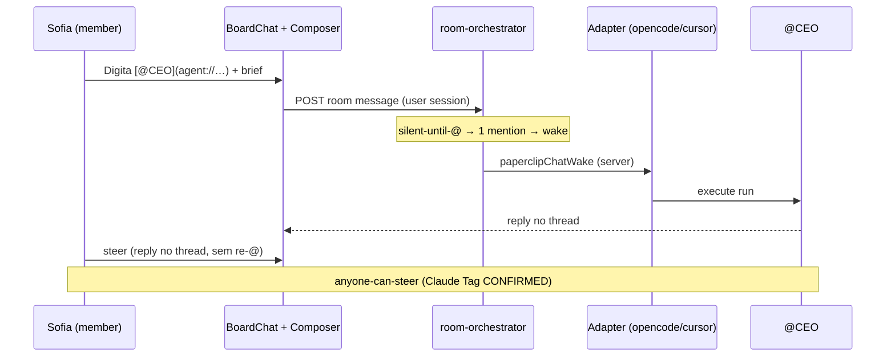
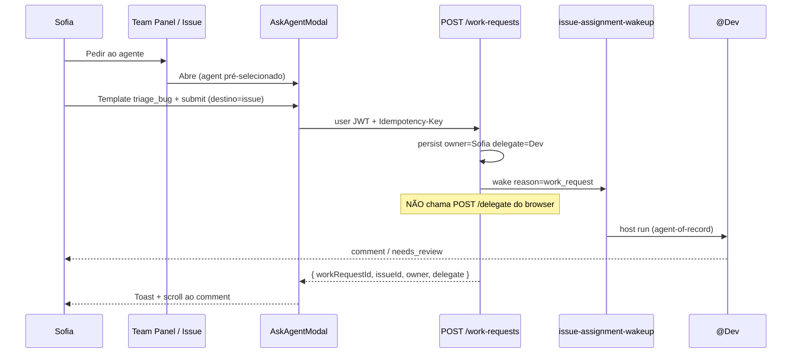
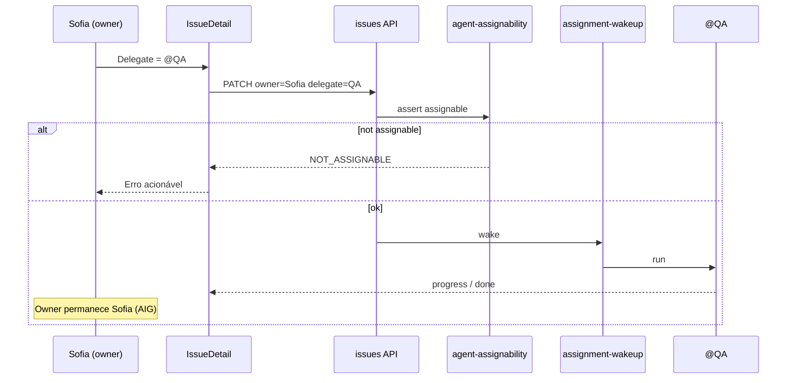
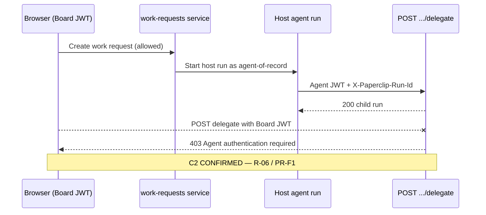
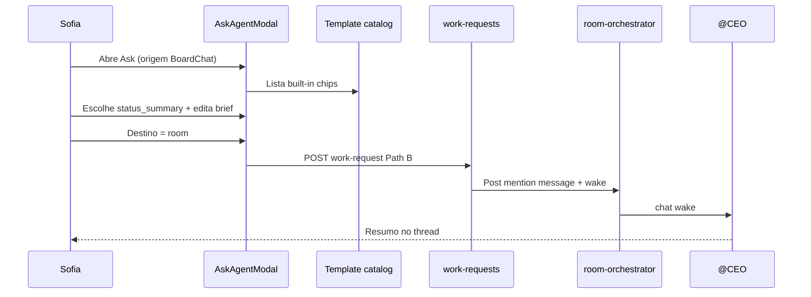

# Human → AI Work Request Flows (Path B+)

> **Ciclo:** 3C — Hybrid deep dive · Agent #2  
> **Data:** 2026-07-09  
> **Produto-alvo:** Paperclip Conference Room + Issues (Path B+)  
> **Repo de implementação:** fork `/Users/macbook/Projects/paperclip`  
> **Decisões travadas:** D-09 Path B+ · D-10 silent-until-@ · D-12 assign-as-delegate  
> **NotebookLM:** skip (non-Villa) — Path B+ hybrid work-request UX research  
> **Confiança:** Alta em padrões CONFIRMED (Cycle 2C); média em wireframes de modal (ainda design)

---

## 0. Propósito deste doc

Transformar evidência **Cycle 2C** em design acionável de **como qualquer humano** (incluindo Sofia não-técnica) pede trabalho a um agente — sem decorar JWT, `runId` ou A2A.

**Não é SPEC de implementação** (isso é P1.5). É o deep dive de fluxos, auth, empty/error states e MoSCoW que alimenta Cycle 4/5.

### Fontes Cycle 2C (obrigatórias)

| Artefato | O que promove |
|----------|---------------|
| [`../cycle-2c-hybrid-confirmation/00-INDEX.md`](../cycle-2c-hybrid-confirmation/00-INDEX.md) | R-01…R-07, D-12 LOCKED |
| [`../cycle-2c-hybrid-confirmation/01-clickup-claims-confirm.md`](../cycle-2c-hybrid-confirmation/01-clickup-claims-confirm.md) | Super = teammate; intake progressivo; Cursor human-responsible |
| [`../cycle-2c-hybrid-confirmation/02-competitor-hitl-confirm.md`](../cycle-2c-hybrid-confirmation/02-competitor-hitl-confirm.md) | Claude Tag anyone-@; Linear owner+delegate; Plane anti-padrão |
| [`../cycle-2c-hybrid-confirmation/03-fork-code-confirm.md`](../cycle-2c-hybrid-confirmation/03-fork-code-confirm.md) | C2 human≠POST delegate; C5 mentions; C6 mention≠A2A; PR-F1 bridge |

### Relação com docs irmãos

| Doc | Relação |
|-----|---------|
| Cycle 3B [`03-work-request-affordances.md`](../cycle-3b-clickup-deep-dive/03-work-request-affordances.md) | Stack 4 camadas (pré-2C); este doc **re-ancora** em grades 2C |
| Cycle 3 [`02-ux-slack-room.md`](../cycle-3-deep-dive/02-ux-slack-room.md) | Room multiplayer / silent-until-@ |
| Cycle 5B `P1.5-work-request-SPEC.md` | SPEC implementável; MoSCoW aqui é input |

---

## 1. Princípio de produto

> Pedir IA deve ser **tão fácil quanto pedir a um colega** — e **mais seguro**: owner humano sempre visível, custo atribuído, silent-until-@, humano **nunca** autentica como agent.

### 1.1 Requisitos promovidos (CONFIRMED only)

| ID | Requisito | Fonte 2C |
|----|-----------|----------|
| **R-01** | AI as teammate: `@` / assign / DM-like Ask | ClickUp 8/8 · INDEX |
| **R-04** | Owner humano + delegate agente (não Plane-style) | Linear Claims 1–2 · D-12 |
| **R-05** | Anyone-can-@ / steer no thread (acessibilidade) | Claude Tag Claims 3–4 |
| **R-06** | Human NÃO POST delegate → bridge server-side | Fork C2 · PR-F1 |
| **R-07** | Mentions no composer; mention ≠ A2A join | Fork C5/C6 · PR-F4/F5 |

### 1.2 Stack de affordances (ordem de acessibilidade)

```
① @agent na Room (Claude Tag)     ← power + multiplayer
② Ask button / modal (intent unificado)  ← baixa fricção, Sofia leiga
③ Assign-as-delegate (Linear D-12)       ← trabalho durável + audit
④ Templates / catalog (ClickUp Super)    ← pedidos repetíveis
```

ClickUp **confirma** intake progressivo DM → @ → assign → schedule, **sem** CTA único “Request work from AI” (Claim 8 CONFIRMED). Path B+ **adiciona** Ask como diferencial de acessibilidade — não substitui a stack.

---

## 2. Camada ① — `@agent` na Room (Claude Tag pattern) — CONFIRMED

### 2.1 Evidência

| Claim 2C | Grade | Implicação UX |
|----------|-------|---------------|
| Claude Tag: anyone tags | **CONFIRMED** | Qualquer `member+` na Room pode `@CEO` |
| Claude Tag: anyone steers no thread | **CONFIRMED** | Reply no thread = steer; sem re-`@` obrigatório |
| Capabilities seguem o canal | **CONFIRMED** | Agent identity da Room, não do tagger |
| Fork C5: ChatComposer sem mentions | **CONFIRMED** | **ADAPT** → MarkdownEditor / mention chips |
| Fork C6: mention issue ≠ A2A join | **CONFIRMED** | Room multi-`@` precisa `room-orchestrator` (BUILD) |
| D-10 silent-until-@ | **LOCKED** | 0 `@` → agentes silenciosos |

### 2.2 Contrato de UX (Sofia)

| Passo | O que Sofia faz | O que o sistema faz |
|-------|-----------------|---------------------|
| 1 | Abre Conference Room | Stream multiplayer; agentes no roster |
| 2 | Digita `@` | Autocomplete agentes + humanos (Agent Cards) |
| 3 | Envia `[@CEO](agent://…) olha o backlog` | `room-orchestrator` wake single (P1) |
| 4 | Vê “Pensando…” / resposta | Owner = autora da mensagem |
| 5 | Colega responde no thread | Steer coletivo (Claude Tag) — **não** owner-only Cursor Slack |

**Serialização canônica:** `[@Nome](agent://<agentId>)`  
**Owner do thread:** autor humano da mensagem que iniciou o wake.  
**Custo:** só após wake; pill na bolha (P4) — fora do stream denso (D-11).

### 2.3 Quando usar ①

- Alinhamento rápido multiplayer  
- Fan-out `@Dev @QA` (P2 — fora do modal Ask)  
- Steer coletivo no mesmo thread  

### 2.4 Quando NÃO usar ① sozinho

- Trabalho com SLA / histórico → promover a issue (②+③)  
- Sofia fora da Room → Ask (②)  
- Pedido semanal idêntico → template (④)

### 2.5 Microcopy Room

| Estado | Copy (PT-BR) |
|--------|--------------|
| Empty Room | “Mencione um agente com @ para pedir trabalho. Sem @, só humanos falam.” |
| Autocomplete vazio | “Nenhum agente disponível nesta company.” |
| Fan-out N≥3 | “Vários agentes = custo maior. Continuar?” |
| Silent (sem @) | Sem badge de agente; Board density pode logar “no wakeup” |

---

## 3. Camada ② — Ask button / modal (intent unificado)

### 3.1 Por que existe

ClickUp **não** documenta CTA único (Claim 8 CONFIRMED). Asana confirma assign + @mention + rules (Claim 6). Path B+ unifica o **intent** “quero que um agente faça X” num modal — Sofia não precisa saber se o destino é Room ou Issue.

### 3.2 Superfícies do CTA

| Superfície | Label | Pré-contexto |
|------------|-------|--------------|
| IssueDetail | **Pedir ao agente** | `issueId` ligado |
| BoardChat header / composer toolbar | **Pedir** | `roomThreadId` / Path B |
| Hybrid Team Panel (P2.5) | **Pedir ao agente** | `targetAgentId` pré-selecionado |
| AgentDetail | **Pedir trabalho** | agente fixo |
| Room empty state | **Pedir a um agente** | abre modal |
| Inbox / MyIssues | Ação rápida | Path A default |

**Permissão:** `member+` com `work_request:create` (ou role ≥ operator). Guest → CTA oculto.

### 3.3 Modal — campos (intent unificado)

| Campo | Tipo | Default | Notas |
|-------|------|---------|-------|
| Agente | select (invokable + assignable) | do contexto | obrigatório |
| Owner | select humanos | usuário atual | **sempre** humano (D-12) |
| Destino | `issue` \| `room` | `issue` se veio de Issue; `room` se BoardChat | unifica intent |
| Template | chips | Blank | ver §5 |
| Título | string | do template | Path A |
| Brief / prompt | markdown | do template + user | min 1 char |
| Prioridade | enum | normal | Path A |
| Orçamento máx. | optional | company default | Should (P4) |

**Helper fixo (Sofia):**  
> “Você continua responsável. O agente executa.”

**Footer:**  
> “Custo estimado depende do pedido — você verá o gasto na issue/sala.”

### 3.4 Submit semantics

| Destino | Efeito server-side |
|---------|-------------------|
| **issue** | Cria/atualiza issue: `ownerUserId=me`, `delegateAgentId=agent`; comment do pedido; wake via `issue-assignment-wakeup` / reason `work_request` |
| **room** | Posta mensagem formatada com mention `agent://`; `room-orchestrator` (P1) |

**Bloqueio P1.5:** multi-agent no modal → `400 FANOUT_USE_ROOM` + CTA “Abrir Room e mencionar @A @B”.

### 3.5 Pós-sucesso

1. Toast: “Pedido enviado a @CEO”  
2. Navega/scroll para comment (issue) ou bolha (Room)  
3. Chip visível: `Owner: Sofia` · `Delegate: @CEO`  
4. Activity: `work_request.created`

---

## 4. Camada ③ — Assign-as-delegate (Linear D-12) — LOCKED

### 4.1 Evidência

| Claim 2C | Grade | Citação-chave |
|----------|-------|---------------|
| Linear assignee humano vs delegate agente | **CONFIRMED** | “assignee remains responsible… agent contributes on their behalf” |
| AIG “An agent cannot be held accountable” | **CONFIRMED** | Princípio + campo API `delegate` |
| ClickUp Cursor: humano responsável | **CONFIRMED** | “a human teammate remains responsible for its completion” |
| Plane agent-as-assignee | **CONFIRMED** (contraste) | **Anti-padrão** para Path B+ — UI pode *parecer* assign, modelo = delegate |

### 4.2 Modelo de dados

| Campo | Significado | Obrigatório |
|-------|-------------|-------------|
| `ownerUserId` | Humano accountable (HITL, SLA, Inbox) | **Sim** em trabalho agentic |
| `delegateAgentId` | Agente executor | Sim se pedido à IA |
| `assigneeUserId` | Humano executor (só-humano) | Opcional |

**Regra D-12:** agente **nunca** é o único dono.  
**Compat legado:** issue só com `assigneeAgentId` → UI mostra owner = criador / Board fallback + banner “Definir owner humano”.

### 4.3 UX na Issue

```
Owner:     [Sofia ▾]      ← humano
Delegate:  [@Dev ▾]       ← “Quem executa”
```

Atalhos:

| Ação | Resultado |
|------|-----------|
| Assign to me + delegate @X | owner=me, delegate=X, wake |
| Só humano | limpa delegate |
| Só eu no loop | owner=me, sem delegate (manual) |
| Trocar delegate | owner **não** muda sem ação explícita |

### 4.4 Efeito runtime

| Evento | Comportamento |
|--------|---------------|
| Set/update delegate | Assignability check → wake (`work_request` / assignment) |
| Comentário com `@` | Menciona **além** do delegate (não substitui) |
| Delegate termina | Owner notificado; `needs_review` se policy |
| Reassign delegate | Activity log; owner estável |

### 4.5 Anti-padrão Plane (explícito)

| Plane (docs) | Path B+ |
|--------------|---------|
| “Same as any teammate” / “step in as owners” | Agente = **delegate**, nunca owner |
| Agente no picker de Assignees como dono | Picker de **Delegate** separado do Owner |

---

## 5. Camada ④ — Templates / catalog (ClickUp Super inspiration)

### 5.1 Evidência e nuance

ClickUp Super Agents: triggers Mention / DM / Assign (Claim 1 CONFIRMED); intake progressivo (Claim 8). **Não** copiar “Brain escreve a task por você” sem owner. Catalog Path B+ = **biblioteca de intents** com owner obrigatório + confirmação.

### 5.2 Built-in catalog (beachhead Software Houses + Support)

| ID | Título (humano) | Vertical | Campos extras | Agente sugerido |
|----|-----------------|----------|---------------|-----------------|
| `triage_bug` | Triagem de bug | SH | `steps`, `env` | @CEO / @triage |
| `code_review` | Revisar PR | SH | `prUrl`, `risk` | @QA / @Dev |
| `research_brief` | Pesquisa curta | Research | `question` | @research |
| `draft_reply` | Rascunho de resposta | Support | `ticketRef`, `tone` | @ops |
| `status_summary` | Resumo de status | Ops | `since`, `projectId` | @CEO |
| `blank` | Em branco | generic | — | — |

Cada template: `{ id, title, description, defaultPromptMarkdown, suggestedAgentRole?, vertical? }`.

### 5.3 UX do catálogo

1. Modal Ask → chips de template (`aria-pressed`)  
2. Selecionar preenche título + brief  
3. Sofia edita brief (sempre editável)  
4. Confirma → owner + delegate persistidos  

**Phase 1 (P1.5 Must):** templates estáticos no server/client.  
**Phase 2 (Should):** CRUD company (Board admin); forms Zod com ≤5 campos.

### 5.4 O que NÃO entra no catalog P1.5

- Autopilot / schedule / Automation ambient na Room (D-10 + P5.5)  
- Templates que auto-executam sem confirmação  
- Forms com 20 campos  
- Fan-out multi-agent embutido no template  

---

## 6. Auth — agent-of-record bridge (CONFIRMED fork)

### 6.1 Evidência fork (C2 / PR-F1)

```
POST /heartbeat-runs/:runId/delegate
→ 403 se actor.type !== "agent"
→ exige X-Paperclip-Run-Id == runId
```

**Grade:** CONFIRMED ([`03-fork-code-confirm.md`](../cycle-2c-hybrid-confirmation/03-fork-code-confirm.md) C2).

**Implicação de produto (R-06 / PR-F1):** o browser humano **nunca** chama `POST .../delegate` com Board JWT. Orquestração usa identidade de **agent run** server-side (agent-of-record / host run).

### 6.2 Arquitetura do bridge

```
┌─────────────┐   session user JWT    ┌──────────────────────┐
│ Web UI      │ ─────────────────────▶│ POST /work-requests  │
│ (Sofia)     │                       │ (board/user auth)    │
└─────────────┘                       └──────────┬───────────┘
                                                 │
                    ┌────────────────────────────┼────────────────────────────┐
                    ▼                            ▼                            ▼
           issue-assignment-wakeup     room-orchestrator (P1)        host agent run
           (user-authorized)           (server wake)                 (agent JWT interno)
                    │                            │                            │
                    └────────────────────────────┴────────────────────────────┘
                                                 │
                                                 ▼
                                      POST .../delegate  ← só agent-of-record
                                      (nunca do browser)
```

### 6.3 Regras de segurança

| Regra | Detalhe |
|-------|---------|
| Human API | Só `POST /work-requests`, issues, comments — auth user/board |
| Agent API | `POST /delegate` só com agent JWT + runId match |
| Board read | `GET .../delegation` permitido (C3 CONFIRMED) — UI polishes trace |
| Secrets | Nunca no WebView (BizCursor Rust / Paperclip server) |
| Idempotency | `Idempotency-Key` no work-request → 1 wake |
| Rate limit | Mentions + Ask por user (anti storm) |

### 6.4 Paths de wake (sem fake agent JWT)

| Path | Trigger | Serviço |
|------|---------|---------|
| **A** Issue-centric | Ask / set delegate | `issue-assignment-wakeup` + reason `work_request` |
| **B** Room-centric | Ask room / `@` composer | `room-orchestrator` + `paperclipChatWake` |
| **C** Host já em run | Agent delega peer | `run-delegation` (agent-only) — P2+ |

---

## 7. Error / empty states e permissões

### 7.1 Matriz de permissões

| Role | `@` Room | Ask modal | Set delegate | CRUD templates | Ver trace Board |
|------|----------|-----------|--------------|----------------|-----------------|
| Guest | — | — | — | — | — |
| Viewer | ler | — | — | — | limitado |
| Member / Operator | ✓ | ✓ | próprios issues | usar | básico |
| Board admin | ✓ | ✓ | qualquer | CRUD | completo |

Flag `enableWorkRequestV1` (ou herdar Room flag): **off** → CTA ausente, API 404.

### 7.2 Empty states

| Contexto | Empty | CTA |
|----------|-------|-----|
| Room sem mensagens | “Mencione @agente ou use Pedir.” | Pedir a um agente |
| Autocomplete agentes vazio | “Nenhum agente invokable.” | Ir ao roster / pedir ao Board |
| Templates só Blank | “Comece em branco ou peça templates ao Board.” | — |
| Meus pedidos vazio | “Você ainda não pediu trabalho à IA.” | Abrir Ask |
| Issue sem owner (legado) | Banner “Definir owner humano” | Set owner |

### 7.3 Error states (acionáveis)

| Código | Quando | UX Sofia |
|--------|--------|----------|
| `AGENT_NOT_INVOKABLE` | paused / sem adapter | “Este agente está pausado ou sem adapter.” |
| `NOT_ASSIGNABLE` | policy company | “Agente não pode ser delegate nesta company.” |
| `FANOUT_USE_ROOM` | N>1 no modal | “Para vários agentes, use a Room com @A @B.” |
| `BUDGET_EXCEEDED` | 100% créditos | “Budget esgotado — peça ao Board.” |
| `POLICY_BLOCKED` | P5.5 | “Política bloqueia este trigger.” |
| `FORBIDDEN_DELEGATE` | tentativa client de POST delegate | Nunca expor; se vazar: “Ação não permitida.” |
| `AGENT_BUSY` | jobs in progress alto | “Agente ocupado — enfileirar ou escolher outro?” |
| `NETWORK` / 5xx | infra | “Falha ao enviar — tentar de novo.” + retry |

### 7.4 Estados do ciclo de vida do pedido

| Estado | Onde | Sofia vê |
|--------|------|----------|
| `draft` | Modal | Editando |
| `queued` | Issue / Room | “Na fila do agente” |
| `running` | Lane + issue | “Em execução” |
| `needs_you` | Inbox + badge | CTA aprovar / responder |
| `done` | Issue closed / thread | Resumo |
| `failed` | Issue + Team error | “Falhou — ver detalhes” |

### 7.5 Acessibilidade (não-técnicos + a11y)

- Modal: `role="dialog"`, focus trap, Escape fecha, label “Pedir trabalho a {@agent}”  
- Template chips: `aria-pressed`  
- Owner/delegate: texto + chip (não só cor)  
- Composer `@`: anunciar opção selecionada no autocomplete  
- Erros: `role="alert"` / live region  
- Densidade Sofia: sem `runId` no default; Board density revela IDs  

---

## 8. Sequence diagrams (Mermaid)

### 8.1 F1 — `@agent` na Room (Claude Tag)



### 8.2 F2 — Ask modal → issue (intent unificado Path A)



### 8.3 F3 — Assign-as-delegate em issue existente (D-12)



### 8.4 F4 — Auth bridge: human blocked from POST delegate



### 8.5 F5 — Template catalog → Ask → Room (Path B)



---

## 9. Matriz de decisão — qual affordance?

| Situação | Preferir | Evitar |
|----------|----------|--------|
| “Olha isso rápido, @Dev” | ① Room mention | Form pesado |
| Bug com SLA e histórico | ③ Issue owner+delegate | Só Room efêmera |
| Sofia no Team Panel, sem Slack mental model | ② Ask → issue | Configurar assignee cru |
| Pedido semanal idêntico | ④ Template (+ Routine fora da Room) | Digitar brief do zero |
| Fan-out Dev+QA | ① Room `@Dev @QA` (P2) | Multi-select no Ask P1.5 |
| Trabalho 100% humano | Owner + assignee humano | Mentions de agente |
| Colega quer steer o mesmo run | ① Thread Room (anyone steers) | Owner-only Cursor Slack na Room |
| Issue agent session assíncrona | ③ D-12 + comments | Assumir anyone-steers no issue |

---

## 10. MoSCoW para P1.5

> Escopo: Ask + assign-as-delegate + templates built-in.  
> Pré-requisitos: P0 silent-until-@ + P1 room-orchestrator single `@`.  
> Fora: fan-out no modal, ambient Autopilot, BizCursor desktop UI, fake agent JWT.

### 10.1 Must

| ID | Item | Evidência 2C |
|----|------|--------------|
| M1 | CTA Ask em IssueDetail + BoardChat (+ Team Panel se P2.5) | R-01 · Claim 8 diferencial |
| M2 | Modal: agent + prompt + template + destino issue\|room | Intent unificado |
| M3 | Persist `ownerUserId` + `delegateAgentId` (D-12) | Linear Claims 1–2 CONFIRMED |
| M4 | Chip Owner / Delegate visível na Issue/Room | AIG accountability |
| M5 | Wake Path A (issue) + Path B (room) **sem** browser POST delegate | C2 / PR-F1 CONFIRMED |
| M6 | 5 templates built-in + Blank | Catalog mínimo beachhead |
| M7 | Authz member+; guest oculto; feature flag | Segurança |
| M8 | Bloquear multi-agent no modal (`FANOUT_USE_ROOM`) | P2 boundary |
| M9 | Composer Room com `@` mentions (ADAPT C5) | PR-F4 |
| M10 | Empty/error states acionáveis (§7) | Acessibilidade Sofia |
| M11 | Activity `work_request.created` | Audit |
| M12 | Idempotency-Key no create | RNF |

### 10.2 Should

| ID | Item |
|----|------|
| S1 | CRUD templates company (Board) |
| S2 | Reassign delegate policies finas (Board vs Operator) |
| S3 | Budget gate mensagem (`BUDGET_EXCEEDED`) alinhada P4 |
| S4 | `GET /work-requests?mine=1` |
| S5 | CTA “Promover a issue” a partir de bolha Room útil |
| S6 | Rate limit mentions/Ask por user |

### 10.3 Could

| ID | Item |
|----|------|
| C1 | i18n títulos PT-BR por locale |
| C2 | Forms estruturados Zod (≤5 campos) Phase 2 |
| C3 | Orçamento máx. no modal |
| C4 | Lista avançada de pedidos com filtros |

### 10.4 Won't (P1.5)

| ID | Item | Por quê |
|----|------|---------|
| W1 | Fan-out N agentes no modal | P2 Room |
| W2 | Ambient / Autopilot na Room | D-10 · P5.5 |
| W3 | Board JWT fingindo agent / POST delegate do client | C2 CONFIRMED |
| W4 | Plane-style agent-as-owner | Anti-padrão D-12 |
| W5 | BizCursor desktop UI deste fluxo | Fork Paperclip first |
| W6 | Magentic / autonomia sem human gate | Princípios Path B+ |
| W7 | Owner-only steer na Room (Cursor Slack) | Conflita Claude Tag R-05 |

### 10.5 Resumo MoSCoW

| Must | Should | Could | Won't |
|------|--------|-------|-------|
| Ask + modal + D-12 persist + bridge auth + 5 templates + flag + errors + mentions Room | CRUD templates · budget · mine list · promote-to-issue | Locale · forms · budget field | Fan-out modal · ambient · fake JWT · Plane owner · BizCursor |

---

## 11. Critérios de pronto deste deep dive

- [x] Quatro affordances desenhadas com personas Sofia / Board  
- [x] `@agent` Room ancorado em Claude Tag CONFIRMED  
- [x] Ask modal como intent unificado (diferencial vs ClickUp Claim 8)  
- [x] D-12 owner+delegate vs Plane anti-padrão  
- [x] Catalog templates beachhead  
- [x] Auth bridge C2 / PR-F1 com diagramas  
- [x] Error/empty/permissions  
- [x] ≥5 sequence diagrams Mermaid  
- [x] MoSCoW P1.5  
- [x] Citações Cycle 2C (INDEX, 01, 02, 03)

---

## 12. Handoff

| Próximo artefato | Usa deste doc |
|------------------|---------------|
| Cycle 3C INDEX | Link + resumo affordances |
| Cycle 4 plan Path B+ | Fase P1.5 + deps P0/P1 |
| Cycle 5B / P1.5 SPEC | MoSCoW §10 + fluxos §8 como RF |

**Paths absolutos citados (fork):**

- `/Users/macbook/Projects/paperclip/server/src/routes/agents.ts` (C2 gate)  
- `/Users/macbook/Projects/paperclip/ui/src/components/ChatComposer.tsx` / `MarkdownEditor.tsx` (C5)  
- `/Users/macbook/Projects/paperclip/server/src/services/issue-assignment-wakeup.ts`  
- `/Users/macbook/Projects/paperclip/server/src/services/agent-assignability.ts`  
- BUILD: `room-orchestrator`, `work-request` service/routes, `AskAgentModal`

---

## Metadados

| Item | Valor |
|------|-------|
| Agente | Cycle 3C Deep Dive #2 — human work-request flows |
| Método | Síntese Cycle 2C CONFIRMED → design de fluxos |
| Quotes inventadas | 0 (grades herdados de 2C) |
| Linhas-alvo | ≥200 |
