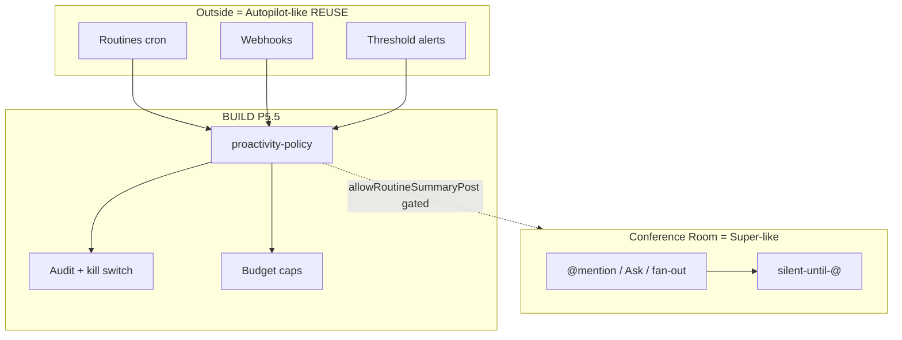

# Governança de proatividade — Path B+ (Room silent + Routines REUSE)

> **Ciclo:** 3C — Hybrid deep dive (Path B+)  
> **Agente:** #4 Proactivity & governance  
> **Data:** 2026-07-09  
> **Âncora:** **D-10** LOCKED (Cycle 2C INDEX) — Room = **silent-until-@**; proatividade **governada** (whitelist)  
> **Evidência:** Cycle 2C ClickUp Claim 2 **CONFIRMED** (Autopilot ≠ Super) + Fork C10 **CONFIRMED** (routines REUSE; `proactivity-policy` ausente → BUILD)  
> **Fase de implementação alvo:** **P5.5** (`cycle-5b-clickup-tech-specs/P5.5-proactivity-policy-SPEC.md`)  
> **Fork:** `/Users/macbook/Projects/paperclip`

`NotebookLM: skip (non-Villa) — Paperclip Path B+ proactivity research`

---

## 0. Veredito em 30 segundos

| Superfície | Modo | Analogia ClickUp (2C) | Paperclip |
|------------|------|----------------------|-----------|
| **Conference Room** | Teammate adaptativo, só quando pedido | **Super Agents** (human-like) | Silent-until-`@` / Ask / fan-out autorizado |
| **Routines / cron / webhook** | Trigger/condition-driven, fora do stream | **Autopilot Agents** | **REUSE** `routines.ts` + ingest |
| **Policy** | Whitelist + audit + kill switch | Brain usage alerts (80/90/100) | **BUILD** `proactivity-policy` (C10 gap) |

**Não colapsar** Autopilot na Room. Ambient listen = **REJECT**. Agent-of-record para posts proativos na Room = **opcional, gated, default OFF**.

---

## 1. Evidência Cycle 2C (obrigatória)

### 1.1 ClickUp — Autopilot ≠ Super (**CONFIRMED**)

Fonte: [`../cycle-2c-hybrid-confirmation/01-clickup-claims-confirm.md`](../cycle-2c-hybrid-confirmation/01-clickup-claims-confirm.md) Claim 2.

| Quote (Help Center) | Implicação Path B+ |
|---------------------|--------------------|
| “Autopilot Agents run in specific locations… Only take action when triggered by specific events, and only if the specified conditions are met.” | Proatividade = **scoped + trigger/condition**, não “sala pensante”. |
| “Autopilot Agents perform actions based on defined triggers and conditions, rather than adaptive, human-like interactions.” | Room = adaptive (Super-like); Autopilot-like **fora** do chat. |
| “If you need an Agent to do intelligent work across locations with more flexibility, try building a Super Agent!” | Super ↔ Room teammate; Autopilot ↔ Routines. |

**R-02 promovido (2C INDEX):** Autopilot ≠ Super → Room silent-until-@; routines fora.

### 1.2 ClickUp — thresholds de custo (**CONFIRMED**)

Claim 5: admins notificados em **80% / 90% / 100%** do uso AI. Path B+ espelha em **budget caps** + Inbox Board (não spam na Room).

### 1.3 Fork — routines REUSE; policy BUILD (**CONFIRMED** C10)

Fonte: [`../cycle-2c-hybrid-confirmation/03-fork-code-confirm.md`](../cycle-2c-hybrid-confirmation/03-fork-code-confirm.md).

| Claim | Grade | Fato |
|-------|-------|------|
| C10 Routines cron+webhook; sem `proactivity-policy` | **CONFIRMED** | `routines.ts` tem cron + webhook; serviço policy **ausente** |
| C4 BoardChat spawna `claude` + skill | **CONFIRMED** | Risco de “concierge sempre ligado” se não migrar |
| C2 POST delegate só agent | **CONFIRMED** | Posts/orquestração proativa na Room precisam **agent-of-record** server-side (PR-F1) |
| C9 sem room-orchestrator | **CONFIRMED** | Bridge Room ↔ wakes ainda BUILD |

**PR-F9:** Routines (cron/webhook) = **REUSE**; **BUILD** `proactivity-policy` para ambient vs silent-until-@.

### 1.4 Decisões travadas

| ID | Status | Uso neste doc |
|----|--------|---------------|
| **D-09** Path B+ | LOCKED | Room + Hybrid; proatividade é fatia Hybrid |
| **D-10** silent-until-@ + whitelist | LOCKED | Regra de ouro §2 |
| **D-11** performance fora do stream | LOCKED | KPIs de governança fora do chat |
| **R-02** | PROMOTED | Autopilot ≠ Super |

---

## 2. Regra de ouro (D-10)

| Superfície | Default do agente | Pode ser proativo? |
|------------|-------------------|--------------------|
| **Conference Room** | Silent-until-`@` (ou fan-out já autorizado no thread) | **Não** — salvo exceção whitelist **explícita** e rara (§6) |
| **Routines / cron / webhook** | Dispara run fora do stream | **Sim** — dentro do catálogo + policy |
| **Issue assign / work-request** | Wake por pedido humano estruturado | **Sim** — é intake, não ambient |
| **Inbox / Approvals / Costs** | Sistema → humano | N/A (não é “agente falando sozinho”) |

> Ambient “sempre ouvindo o canal” = **REJECT** (matriz ClickUp Autopilot ambient + D-10).



---

## 3. Quatro classes de trigger

Herdado Cycle 1B/3B; reafirmado com grades 2C.

| Classe | Definição | Exemplo | Onde vive | Status Room |
|--------|-----------|---------|-----------|-------------|
| **Schedule** | Tempo / cron | Digest 9h | Routines | Fora (default) |
| **Event** | Fato sistema / webhook | PR opened, label | Routines / webhook ingest | Fora (default) |
| **Threshold** | Métrica cruzou limiar | Budget 80/90/100 | Costs + policy | Inbox — **não** auto-chat |
| **Ambient** | Observa conversa sem `@` | Responde qualquer msg | — | **PROIBIDO** |

---

## 4. REUSE no fork — Routines / cron / webhook

Não reinventar Autopilot. Paths confirmados Cycle 2C C10 + SPEC P5.5 §2.1:

| Capacidade | Path absoluto | Papel Path B+ |
|------------|---------------|---------------|
| Routines service | `/Users/macbook/Projects/paperclip/server/src/services/routines.ts` | Motor schedule + webhook fire |
| Routines routes | `/Users/macbook/Projects/paperclip/server/src/routes/routines.ts` | API CRUD / fire |
| Routines UI | `/Users/macbook/Projects/paperclip/ui/src/pages/Routines.tsx`, `RoutineDetail.tsx` | Superfície Autopilot-like oficial |
| Plugin routines | `/Users/macbook/Projects/paperclip/server/src/services/plugin-managed-routines.ts` | Extensão |
| Cron | `/Users/macbook/Projects/paperclip/server/src/services/cron.ts` | Scheduler |
| Cursor webhook ingest | `/Users/macbook/Projects/paperclip/server/src/services/cursor-webhook-ingest.ts` | Event proactivity |
| Webhook rate limit | `/Users/macbook/Projects/paperclip/server/src/services/webhook-trigger-rate-limit.ts` | Anti-abuso (já existe) |
| Heartbeat / wakeup | `/Users/macbook/Projects/paperclip/server/src/services/heartbeat.ts` | Hot path do `assertTriggerAllowed` |

**UI copy:** preferir **“Rotina”** / **“Agendamento proativo”** — evitar “Autopilot na sala” (agent washing).

**Won't P5.5:** segunda UI de cron; motor Autopilot ML; ambient na Room.

---

## 5. Whitelist policy — o que agentes podem fazer sem prompt humano

### 5.1 Princípio

Codificar whitelist **no servidor** — não só prompt de skill. Default: **deny unknown** + **deny ambient Room** (fail-closed; RNF-P55-04).

### 5.2 `TriggerKind` v1 (fechado — P5.5)

| Kind | Humano pediu? | Sink default | Default seed |
|------|---------------|--------------|--------------|
| `mention` | Sim (`@` / Ask) | Room reply | Allow |
| `work_request` | Sim (P1.5) | Issue / run | Allow |
| `issue_assignment` | Sim (assign-as-delegate) | Wake agent | Allow |
| `routine_schedule` | Admin criou rotina | Issue / transcript | Allow |
| `webhook_event` | Admin conectou webhook | Issue + optional wake | Allow |
| `threshold_alert` | Policy limiar | Inbox / incident | **Notify-only** (auto-run off) |
| `manual_wakeup` | Board button | Run | Allow |
| `delegation_child` | Grafo A2A | Parent join | Allow |

**Sempre proibidos (não aparecem como allow):**

| Kind | Comportamento |
|------|---------------|
| `room_ambient` | Responde msg sem `@` |
| `room_auto_reply` | Concierge sempre ligado |

### 5.3 Pseudocontrato

```ts
type TriggerClass = "schedule" | "event" | "threshold" | "ambient";

type ProactivityDecision =
  | { allow: true; sink: "issue" | "inbox" | "room"; triggerId: string; kind: TriggerKind }
  | {
      allow: false;
      reason:
        | "not_whitelisted"
        | "ambient_forbidden"
        | "rate_limited"
        | "budget_blocked"
        | "kill_switch"
        | "room_post_disabled"
        | "aor_disabled";
    };
```

`ambient_*` → sempre `allow: false`. Policy corrupt → deny unknown + keep room silent (RF-P55-22).

### 5.4 Camadas

| Camada | Responsabilidade |
|--------|------------------|
| `room-policy` / P0 BoardChat | Quem pode `@` quem; silent-until-@; fan-out caps |
| `proactivity-policy` (**BUILD**) | Se wake **sem** menção humana no momento é legítimo |
| `run-delegation` (**REUSE**) | Execução A2A após wake legítimo |
| Agent-of-record (§6) | Identidade server-side para post/orquestração (C2 / PR-F1) |

---

## 6. Agent-of-record para posts proativos na Room (opcional, gated)

### 6.1 Por que existe

Cycle 2C **C2 CONFIRMED:** `POST .../delegate` exige actor = agent. Humano no browser **não** pode orquestrar A2A direto (PR-F1). Qualquer post/orquestração “em nome do sistema” na Room precisa de um **agent-of-record (AOR)** — host run server-side.

Isso **não** autoriza ambient. AOR é identidade de execução, não licença para falar sozinho.

### 6.2 Quando AOR pode postar na Room

Somente se **todas** as condições forem verdadeiras:

1. Company setting `routines.canPostToRoom` / `room.allowRoutineSummaryPost` ≠ `never`; **e**
2. Template da rotina inclui ≥1 `agent://` mention **ou** `allowRoutineSummaryPost = as_human_owner_comment` (comentário sem wake); **e**
3. Policy whitelist contém `routine_schedule` (ou kind mapeado); **e**
4. Feature flag `enableProactiveRoomPostViaAor` = **true** (default **false**); **e**
5. Rate limit por routine/dia + budget cap OK; **e**
6. Kill switch global **off**; **e**
7. Mensagem marcada `source: routine:<id>` + `aorAgentId` (audit).

Default de posts proativos na Room = **OFF** (`never` ou `with_explicit_mention_only` sem AOR ambient).

### 6.3 Matriz AOR

| Cenário | AOR | Post Room? |
|---------|-----|------------|
| Sofia `@Ops` | Agent Ops (wake mention) | Sim — pedido humano |
| Routine digest → issue | Agent da rotina | Não na Room (default) |
| Routine digest → Room com `@CEO` no template | AOR = agent da rotina | Sim — gated §6.2 |
| Webhook PR → issue + delegate | AOR no child run | Não posta ambient na Room |
| “Concierge responde tudo” | — | **BLOCK** |

### 6.4 Migração BoardChat concierge (C4)

| Hoje (C4 CONFIRMED) | Alvo Path B+ |
|---------------------|--------------|
| `board-chat.ts` spawna `claude` + skill sempre | 0 `@` → **no agent reply** |
| Skill `paperclip-board` | Skill room: silent-until-@ + delegate |
| Coolify remoto | **Não** depender de CLI local (PR-F3); adapters `cursor_cloud` / `opencode_local` |

Flag legado `legacyConcierge` só se Board optar-in explícito — **fora** do beachhead SH default.

---

## 7. Audit log, kill switch, budget caps

### 7.1 Audit log (Must P5.5)

| Evento | Quando | Campos mínimos |
|--------|--------|----------------|
| `proactivity_policy.updated` | PUT policy | companyId, version, actorUserId, diff summary |
| `proactivity.trigger_denied` | assert falhou | kind, reason, agentId?, sink, sourceId |
| `proactivity.trigger_allowed` | wake passou | kind, sink, triggerId, aorAgentId? |
| `proactivity.room_post` | Post gated na Room | routineId, aorAgentId, mentionCount |
| `proactivity.kill_switch` | Toggle | on/off, actorUserId |
| `proactivity.budget_blocked` | Cap atingido | window, spend, cap |

UI Board: últimos 50 wakes proativos (triggerId, agent, sink, allow/deny) — alinhado 3B §6.1.

### 7.2 Kill switch

| Nível | Escopo | Efeito |
|-------|--------|--------|
| **L0 Room ambient** | Sempre | Impossível ligar ambient (código) |
| **L1 Company kill** | `proactivity.enabled = false` | Bloqueia **todos** wakes de kinds não-humanos (`routine_schedule`, `webhook_event`, threshold auto-run); **mantém** `mention` / `work_request` / `issue_assignment` |
| **L2 Hard freeze** | Incident Board | Bloqueia também manual_wakeup + routines fire; só Board reabre |
| **L3 Adapter pause** | Por agent | Pause agent queue (já Costs/ops) |

Kill L1 deve ser **um clique** em Company Settings → Proactivity (acima da whitelist). Fail-safe: se settings ilegíveis → tratar como L1 para kinds Autopilot-like; Room permanece silent.

### 7.3 Budget caps (espelho Claim 5)

| Limiar | Ação Path B+ | Sink |
|--------|--------------|------|
| **80%** | Banner + Inbox Board; badge Team Panel | Fora do stream |
| **90%** | Idem + rate-limit routines (ex.: max N runs/h) | Fora |
| **100%** | Block novos `routine_schedule` / `webhook_event` wakes; `budget_blocked` audit | Fora |
| Soft per-routine | Cap diário de runs / tokens | Routines |

Threshold **não** auto-roda agente na Room (RF-P55-20). `thresholdAlertAutoRun` default **false**.

### 7.4 Rate limits

Reusar `/Users/macbook/Projects/paperclip/server/src/services/webhook-trigger-rate-limit.ts` + limites por routine. Hits de rate-limit → audit `trigger_denied` reason `rate_limited` — **não** silenciar sem log.

---

## 8. Catálogo operacional (whitelist IDs estáveis)

### 8.1 Schedule

| ID | Descrição | Sink | Board approve? | Phase |
|----|-----------|------|----------------|-------|
| `sched.cron` | Cron + timezone (já Routines) | Routine run | Admin cria | **Agora** REUSE |
| `sched.weekday_digest` | Dias úteis HH:MM | Issue + Inbox | Não | P5.5 / P-H0 |
| `sched.monthly_cost_report` | 1º dia útil | Inbox + Costs | Não | P-H2 |

### 8.2 Event

| ID | Descrição | Sink | Phase |
|----|-----------|------|-------|
| `event.issue_labeled` | Label ∈ set | Wake / comment | ADAPT |
| `event.pr_opened` | GitHub/GitLab webhook | Issue + delegate | P-H1 |
| `event.approval_timeout` | HITL > N h | Inbox owner | P3 Room |
| `event.delegation_child_failed` | Hop failed | Inbox + Board | P2 |
| `event.cursor_webhook` | Ingest existente | Policy atual | **Agora** |

### 8.3 Threshold

| ID | Sink | Phase |
|----|------|-------|
| `thr.budget_80` / `_90` / `_100` | Inbox + BudgetIncident | **Agora** Costs + P5.5 |
| `thr.agent_error_rate` | Inbox; opcional pause | P-H2 |
| `thr.queue_depth` | Inbox Board | P-H1 |

### 8.4 Ambient — blacklist

| ID | Status |
|----|--------|
| `ambient.room_listen` | **BLOCK** |
| `ambient.boardchat_concierge_always` | **DEPRECATE** (só `legacyConcierge`) |
| `ambient.dm_unsolicited` | **BLOCK** Phase 1 |
| `ambient.rewrite_others_messages` | **BLOCK** |

---

## 9. MoSCoW para P5.5

Síntese alinhada a [`../../cycle-5b-clickup-tech-specs/P5.5-proactivity-policy-SPEC.md`](../../cycle-5b-clickup-tech-specs/P5.5-proactivity-policy-SPEC.md) + gaps 2C.

### 9.1 Must

| ID | Item | Evidência |
|----|------|-----------|
| M1 | Schema `ProactivityPolicy` company-scoped + version | RF-P55-01/08 |
| M2 | Whitelist `TriggerKind` fechado; ambient kinds nunca allow | RF-P55-03/04; D-10 |
| M3 | `postWithoutMentionWakesAgent: false` imutável | RF-P55-06; R-02 |
| M4 | `allowRoutineSummaryPost` enum; default mention-only ou never | RF-P55-07 |
| M5 | Editor Board + callout “Room silent until @/Ask” | RF-P55-09–13 |
| M6 | Enforce `assertTriggerAllowed` em heartbeat / routines / webhooks / Ask | RF-P55-16–21; C10 |
| M7 | Fail-closed Room ambient | RF-P55-22 |
| M8 | Audit `policy.updated` + `trigger_denied` | RF-P55-23 |
| M9 | Deep-links Routines/Webhooks como canal Autopilot-like; **não** segunda UI cron | RF-P55-24/27; Claim 2 |
| M10 | Kill switch L1 company (kinds Autopilot-like) | Este doc §7.2 |
| M11 | Budget thresholds 80/90/100 → Inbox (não Room spam) | Claim 5 CONFIRMED |
| M12 | AOR para orquestração server-side; posts Room gated default OFF | C2 / PR-F1; §6 |

### 9.2 Should

| ID | Item |
|----|------|
| S1 | Preview “desligar routine_schedule bloqueia N routines” |
| S2 | `GET .../effective-triggers` debug Board |
| S3 | Team Panel badge `proactiveOutsideRoom` (P2.5) |
| S4 | Rate-limit dashboard (hits / 24h) |
| S5 | Soft freeze L2 com reason obrigatória |

### 9.3 Could

| ID | Item |
|----|------|
| C1 | Diff visual de versões de policy |
| C2 | AOR post Room com template mention (flag opt-in) |
| C3 | Auto-pause agent em `thr.agent_error_rate` |
| C4 | Export audit CSV |

### 9.4 Won't (P5.5)

| ID | Item | Por quê |
|----|------|---------|
| W1 | Ambient agents na Conference Room | D-10; Autopilot ≠ Super |
| W2 | Autopilot ML “quando ser proativo” | Fora de escopo; whitelist estática |
| W3 | Substituir Routines CRUD | REUSE C10 |
| W4 | Fail-open Room se policy corrupt | Segurança |
| W5 | Claim marketing “sala pensante” | Agent washing |
| W6 | Spawn `claude` CLI como runtime Coolify da Room | PR-F3 / C4 |
| W7 | Humano browser `POST delegate` | C2 |

### 9.5 Resumo MoSCoW

| Must | Should | Could | Won't |
|------|--------|-------|-------|
| Policy + deny ambient + enforce + audit + kill + budget alerts + AOR gated | Preview, effective-triggers, badge, rate UI | Diff, AOR opt-in post, auto-pause | Ambient Room, ML Autopilot, replace Routines, fail-open, CLI concierge |

---

## 10. UX de governança

### 10.1 Board — Company Settings → Proactivity

```
┌ Proactivity ─────────────────────────────────────┐
│ ⚠ Conference Room: silent until @ / Ask          │
│   (não configurável — D-10)                      │
│                                                  │
│ [ Kill switch: Proactive wakes OFF ]  ← L1       │
│                                                  │
│ Allowed triggers (whitelist)                     │
│ [x] @mention / Room Ask                          │
│ [x] Work Request                                 │
│ [x] Issue assignment                             │
│ [x] Routine schedule      → Gerenciar Routines   │
│ [x] Webhook events        → Adapters             │
│ [x] Manual wakeup                                │
│ [x] Delegation child                             │
│ [ ] Threshold → auto-run (alerts always on)      │
│                                                  │
│ Routine → Room post:                             │
│  ( ) never  (•) only with @mention               │
│  ( ) as owner comment (no wake)                  │
│                                                  │
│ Agent-of-record Room post: [ ] enable (advanced) │
│                                                  │
│ Budget: 80% / 90% / 100% alerts → Inbox          │
│ Audit: últimos 50 eventos                        │
│ [Save policy]                                    │
└──────────────────────────────────────────────────┘
```

Só Board/admin edita; Operator read-only (RF-P55-13).

### 10.2 Sofia

- Não configura triggers.  
- Help Room: “Agentes só falam se você pedir (@ ou Pedir ao agente). Automações ficam em Routines.”  
- Nunca “surpreendida” por agente sem `@` (meta K4 = 0).

### 10.3 Matriz rápida

| Quero… | Use | Não use |
|--------|-----|---------|
| Resposta agora no canal | `@` / Ask | Routine ambient |
| Relatório diário | Routine → issue/Inbox | Post ambient Room |
| Alerta de verba | Threshold 80/90/100 | Agente spam no chat |
| Revisar todo PR | Webhook → issue+delegate | Brain ambient |
| “IA que escuta tudo” | — | **REJECT** |

---

## 11. Paths BUILD (P5.5)

| Peça | Path |
|------|------|
| Service | `/Users/macbook/Projects/paperclip/server/src/services/proactivity-policy.ts` |
| Types/Zod | colado no service se &lt; 400 linhas, senão `proactivity-policy.types.ts` |
| Route | `/Users/macbook/Projects/paperclip/server/src/routes/proactivity-policy.ts` |
| Editor | `/Users/macbook/Projects/paperclip/ui/src/components/proactivity/ProactivityPolicyEditor.tsx` |
| Hook | `/Users/macbook/Projects/paperclip/ui/src/hooks/useProactivityPolicy.ts` |
| Tests | `/Users/macbook/Projects/paperclip/server/src/services/proactivity-policy.test.ts` |

Hooks de enforce: `heartbeat.ts`, `routines.ts`, `cursor-webhook-ingest.ts`, `board-chat.ts` (+ room-orchestrator), work-request.

Slice ≤ 6 arquivos core (RNF-P55-03) + edits pontuais nos hot paths.

---

## 12. Métricas de governança (fora do stream — D-11)

| KPI | Meta beachhead |
|-----|----------------|
| K4 Ambient wake count | **0** |
| Routine runs com sink Room | 0 se post disabled |
| Wakes com `triggerId` / kind null (legado) | → 0 após migração |
| `trigger_denied` rate | monitorar; investigar spikes |
| Kill switch activations | auditável |
| Budget block events | correlacionar com Costs |

---

## 13. Critérios de pronto (Cycle 3C → Cycle 4)

- [x] Autopilot ≠ Super citado com Claim 2 CONFIRMED.  
- [x] D-10 / R-02 / C10 / PR-F9 amarrados.  
- [x] Routines/cron/webhook paths REUSE listados.  
- [x] Whitelist + blacklist ambient.  
- [x] Agent-of-record opcional gated (§6).  
- [x] Audit + kill switch + budget caps (§7).  
- [x] MoSCoW P5.5 Must/Should/Could/Won't (§9).  
- [ ] Cycle 4 plan referencia este doc na fase P5.5.  
- [ ] Cycle 5 SPEC P5.5 permanece autoritativa para RF IDs.

---

## 14. Relação com docs irmãos

| Doc | Relação |
|-----|---------|
| Cycle 3B `05-proactivity-governance.md` | Antecessor ClickUp-line; este doc **Path B+ 3C** reforça 2C + AOR + kill/budget MoSCoW |
| Cycle 2C `01` / `03` / `00-INDEX` | Fonte de grades CONFIRMED |
| P5.5 SPEC | Contrato de implementação; este deep dive = design de produto |
| Dual performance (doc 04 métricas) | KPIs fora do stream; budget liga Costs |

---

## Metadados

| Item | Valor |
|------|-------|
| Agente | Cycle 3C Deep Dive #4 |
| Path | `docs/research/slack-a2a-room/cycle-3c-hybrid-deep-dive/04-proactivity-governance.md` |
| Quotes inventadas | 0 (reusa quotes 2C) |
| Confiança | Alta — 2C ClickUp 8/8 + fork C10 CONFIRMED |
