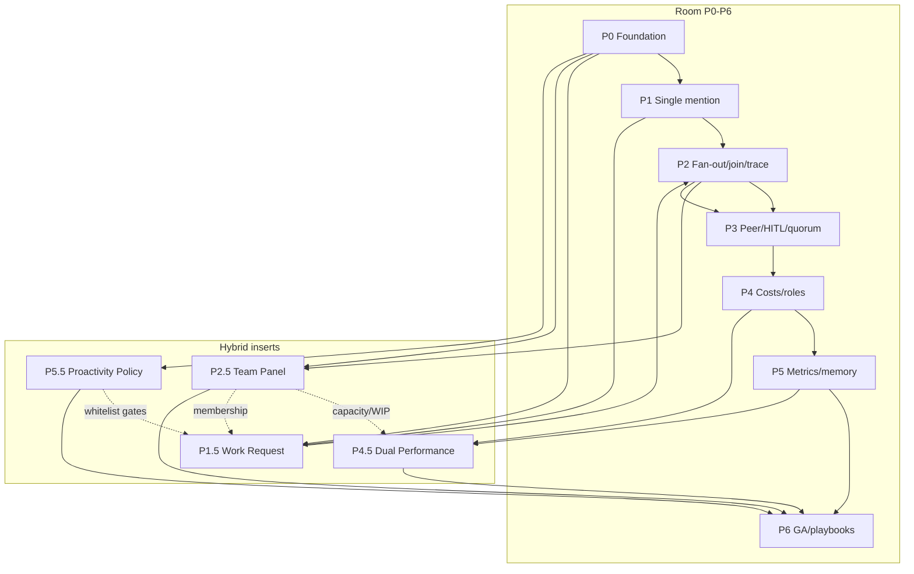

# Cycle 3C — Implementation Gap Matrix (Path B+)

> **Ciclo:** 3C — Hybrid deep dive  
> **Agente:** #5 implementation gap  
> **Path:** **B+** = Conference Room Slack+@+A2A **e** Hybrid Team & Performance  
> **Data:** 2026-07-09  
> **Fork:** `/Users/macbook/Projects/paperclip` (`QuadriniL/paperclip`)  
> **Fontes primárias:**  
> - [`cycle-2c-hybrid-confirmation/03-fork-code-confirm.md`](../cycle-2c-hybrid-confirmation/03-fork-code-confirm.md) (9/10 CONFIRMED)  
> - [`cycle-1c-hybrid-discovery/03-paperclip-fork-capability-catalog.md`](../cycle-1c-hybrid-discovery/03-paperclip-fork-capability-catalog.md)  
> **SPECs Room (já existem):** [`cycle-5-tech-specs/`](../cycle-5-tech-specs/) P0–P6  
> **SPECs Hybrid (já existem):** [`cycle-5b-clickup-tech-specs/`](../cycle-5b-clickup-tech-specs/) P1.5 / P2.5 / P4.5 / P5.5  
> **Complementa (não substitui):** [`cycle-3-deep-dive/04-paperclip-gap-analysis.md`](../cycle-3-deep-dive/04-paperclip-gap-analysis.md), [`cycle-3b-clickup-deep-dive/06-paperclip-hybrid-gap.md`](../cycle-3b-clickup-deep-dive/06-paperclip-hybrid-gap.md)

`NotebookLM: skip (non-Villa) — Path B+ gap matrix docs`

---

## 0. Legenda e regras de classificação

| Tag | Significado | Critério operacional |
|-----|-------------|----------------------|
| **REUSE** | Consumir sem redesign | Código + contrato estáveis; Cycle 2C CONFIRMED (ou PARTIAL só em dívida de teste) |
| **ADAPT** | Existe; mudar contrato/UX/deploy | Paths presentes; comportamento atual ≠ produto B+ |
| **BUILD** | Ausente no fork | Glob/grep Cycle 2C C9/C10 — zero implementação de produção |
| **DEBT** | Dívida técnica, não gap de produto | Ex.: teste `waitAllSec` (C1 PARTIAL) |
| **FORBIDDEN** | Não construir de propósito | Viola auth, Coolify, ou anti-washing |

**Promoted requirements (Cycle 2C → esta matriz):** PR-F1…PR-F9. Cada linha da matriz cita o PR ou o ID do catálogo 1C quando aplicável.

---

## 1. Sumário executivo

O fork **já entrega** o control plane A2A (`run-delegation`, MCP fan-out/join, Agent Cards, `GET .../delegation` board-readable) e primitives de membership/costs/routines. Path B+ **não** reinventa A2A.

O que falta é a **ponte produto**:

| Camada | Veredito |
|--------|----------|
| Motor A2A + MCP + adapters chat-wake | **REUSE** |
| BoardChat / composer / skill / Coolify runtime | **ADAPT** |
| `room-orchestrator`, human-delegate bridge, DelegationTrace, Hybrid Panel, dual insights, `proactivity-policy` | **BUILD** |
| Expor run JWT ao browser; ambient Autopilot na Room; ledger paralelo | **FORBIDDEN** |

**Ordem canônica de entrega (esta matriz):**

```
P0 → P1 → P1.5 → P2 → P2.5 → P3 → P4 → P4.5 → P5 → P5.5 → P6
```

> Nota: Cycle 5B INDEX permite paralelismo (ex.: P2.5 ∥ P1.5 após P1). A ordem acima é a **sequência sugerida de fechamento de DoD** para Path B+ completo; paralelismo seguro está na §3.

---

## 2. Matriz por fase (P0 Room → P6 + inserts híbridos)

Cada fase lista capacidades com **REUSE | ADAPT | BUILD**, paths âncora no fork, e vínculo às SPECs Cycle 5 / 5B.

### 2.0 P0 — Room foundation

> SPEC: [`P0-foundation-SPEC.md`](../cycle-5-tech-specs/P0-foundation-SPEC.md)  
> Objetivo: auth, agentes listáveis, flag Conference Room, baseline 1:1, silent-until-@ normativo.

| Capacidade | Tag | Paths / evidência | Notas Path B+ |
|------------|-----|-------------------|---------------|
| Flag `enableConferenceRoomChat` | **REUSE** | `ui/src/hooks/useConferenceRoomChatEnabled.ts`, `InstanceExperimentalSettings.tsx`, teste feature-flag | Gate de nav + rota; não recriar flag |
| Auth board + `assertCompanyAccess` | **REUSE** | `server/src/services/access.ts`, `authz.ts` | PR-F2 depende disto |
| Agents listáveis + Agent Cards | **REUSE** | `Agents.tsx`, `GET .../agent-cards` | Autocomplete futuro |
| Standing issue “Board Operations” | **REUSE** | `board-chat.ts` find/create | Persistência da sala |
| Rota `POST /api/board/chat/stream` | **ADAPT** | `server/src/routes/board-chat.ts` | Hoje só concierge; P0 pode manter 1:1 mas planejar saída do spawn |
| BoardChat UI 1:1 | **ADAPT** | `ui/src/pages/BoardChat.tsx` | Timeline multi-autor parcial; stream = concierge |
| Spawn `claude` CLI + skill `paperclip-board` | **ADAPT** → Coolify | C4 CONFIRMED; `board-chat.ts` L247 | **PR-F3:** não depender disto em remoto |
| Adapters `paperclipChatWake` | **REUSE** | `cursor-cloud` / `opencode-local` `execute.ts` | **PR-F7** — caminho alvo do ADAPT |
| Silent-until-@ (política produto) | **BUILD** *(regra)* | Ausente como serviço; só intenção P0 | Documentar + enforce em P0/P5.5 |
| `room-policy` caps | **BUILD** | Ausente (catálogo 2.12) | Caps env-only hoje |

**DoD P0 (gap view):** flag on staging; 1:1 board↔concierge; lista de agentes; **plano escrito** de migração `claude`→`adapter_wake` (implementação pode fechar em P1/P2).

---

### 2.1 P1 — Single `@mention` + silent-until-@ + human owner

> SPEC: [`P1-single-mention-SPEC.md`](../cycle-5-tech-specs/P1-single-mention-SPEC.md)

| Capacidade | Tag | Paths / evidência | Notas |
|------------|-----|-------------------|-------|
| Formato `agent://` + chips | **REUSE** | `project-mentions.ts`, `mention-chips.ts` | Catálogo 1.7 |
| `MarkdownEditor` + `MentionOption` | **REUSE** | `MarkdownEditor.tsx`, `IssueChatThread.tsx` | **PR-F4** |
| `ChatComposer` plain | **ADAPT** | `ChatComposer.tsx` — zero mentions (C5) | Trocar/compor com MarkdownEditor na Room |
| Mention wake em issues | **REUSE** *(≠ join)* | `issues.ts` `issue_comment_mentioned` sem `parentRunId` (C6) | **PR-F5** — não usar como fan-out |
| Single-mention orchestrator | **BUILD** | `room-orchestrator*` ausente (C9) | **PR-F8** (subset P1) |
| Human post → wake server-side | **BUILD** | Sem `POST /api/board/rooms/...` (catálogo 1.10) | Board session → host run |
| Skill board → skill sala | **ADAPT** | `skills/paperclip-board/SKILL.md` | Ensinar silent-until-@ + single wake |
| Human owner na thread | **ADAPT** | Issues / memberships | Owner humano explícito (prepara D-12 / P1.5) |

**DoD P1:** Sofia `@CEO` na Room → um wake orquestrado; sem ambient; composer com `@`.

---

### 2.1.5 P1.5 — Work Request (hybrid insert)

> SPEC: [`P1.5-work-request-SPEC.md`](../cycle-5b-clickup-tech-specs/P1.5-work-request-SPEC.md)  
> Pré: P0 + P1. Soft-deps: P2.5 membership, P5.5 policy gate.

| Capacidade | Tag | Paths / evidência | Notas |
|------------|-----|-------------------|-------|
| Agents list / assignability | **REUSE** | `Agents.tsx`, `agent-assignability.ts` | Discovery de alvo |
| Issue assignment wakeup | **REUSE** | `issue-assignment-wakeup.ts` | Base de “pedir trabalho” |
| Mentions / Ask draft → Room | **ADAPT** | BoardChat entry + chips | Ask abre draft Room ou issue |
| Assign-as-delegate (owner humano + delegate agente) | **BUILD** | Sem slice unificado (catálogo 3.9) | **D-12** |
| Ask / Pedir button + templates | **BUILD** | Ausente (Hybrid gap 3B) | Intake PM/CS |
| Human → delegate via browser JWT | **FORBIDDEN** | C2 / PR-F1 | Sempre bridge server-side |

**DoD P1.5:** qualquer member dispara pedido à IA sem decorar slug; owner≠delegate.

---

### 2.2 P2 — Fan-out `@A @B` + join + bridge room→A2A + trace

> SPEC: [`P2-fanout-join-SPEC.md`](../cycle-5-tech-specs/P2-fanout-join-SPEC.md)

| Capacidade | Tag | Paths / evidência | Notas |
|------------|-----|-------------------|-------|
| `run-delegation` `wait:false` | **REUSE** | `run-delegation.ts` + integration test (C1 fan-out) | Não reinventar |
| `getDelegationState` + `waitAllSec` | **REUSE** + **DEBT** | Implementado; **0** testes `waitAllSec` (C1 PARTIAL) | Smoke ST join; não rebuild waiter |
| MCP `paperclipDelegate` / `GetDelegation` | **REUSE** | `packages/mcp-server/src/tools.ts` (C7) | **PR-F6** |
| `POST .../delegate` agent-only | **REUSE** *(constraint)* | `agents.ts` 403 se ≠ agent (C2) | **PR-F1** |
| `GET .../delegation` board reads any | **REUSE** | `agents.ts` (C3) | Trace poll |
| Human-delegate bridge (agent-of-record) | **BUILD** | Ausente (catálogo 7.5) | Host run server-side |
| `room-orchestrator` fan-out+join | **BUILD** | C9 | **PR-F8** |
| Rotas `board-room` / human API | **BUILD** | C9 / catálogo 1.10 | Mensagem + orquestração |
| DelegationTrace UI | **BUILD** | 0 em `ui/src` (C9) | API read = REUSE |
| `room-policy` (depth/children/budget) | **BUILD** | Catálogo 2.12 | Caps explícitos |
| Runtime Coolify sem `claude` spawn | **ADAPT** | PR-F3 / C4 | Obrigatório antes de GA |

**DoD P2:** `@A @B` → fan-out + join; trace visível; humano nunca chama delegate no browser.

---

### 2.2.5 P2.5 — Hybrid Team Panel (hybrid insert)

> SPEC: [`P2.5-hybrid-team-panel-SPEC.md`](../cycle-5b-clickup-tech-specs/P2.5-hybrid-team-panel-SPEC.md)  
> Pré: P0 (agents + members). Pode começar cedo; fecha após P2 se Ask-on-row depender da Room.

| Capacidade | Tag | Paths / evidência | Notas |
|------------|-----|-------------------|-------|
| Agents / OrgChart / ActiveAgentsPanel | **REUSE** | `Agents.tsx`, `OrgChart.tsx`, `ActiveAgentsPanel.tsx` | Lado IA |
| CompanyAccess / invites / roles | **REUSE** | `CompanyAccess.tsx`, `company-member-roles.ts` | Lado humano |
| Resource memberships board\|agent | **REUSE** | `resource-memberships.ts` | Membership |
| `company-members` helper UI | **REUSE** | `ui/src/lib/company-members.ts` | Roster feed |
| TeamCatalog patterns | **REUSE** | `TeamCatalog.tsx` | Packs ≠ hybrid roster |
| Roster merge API + Hybrid Team UI | **BUILD** | Glob Hybrid* → 0 (catálogo 3.8 / 6.6) | **D-09 / D-13** |
| Capacity lanes | **BUILD** | Ausente (6.7) | Heurística v1 OK |
| Ask modal no row | **BUILD** | Fragmentado (6.8) | Liga P1.5 |

**DoD P2.5:** um painel humanos+agentes; status; lanes v1; deep-link Ask/Room.

---

### 2.3 P3 — Peer wait, HITL, quorum

> SPEC: [`P3-peer-wait-hitl-SPEC.md`](../cycle-5-tech-specs/P3-peer-wait-hitl-SPEC.md)

| Capacidade | Tag | Paths / evidência | Notas |
|------------|-----|-------------------|-------|
| Child completed / heartbeat events | **REUSE** | `heartbeat.ts` `delegation_child_completed` | Peer wait event-driven |
| `waitAllSec` barrier | **REUSE** | Já P2 | Quorum ≠ substituir barrier |
| Issue thread interactions / approvals | **REUSE** / **ADAPT** | `issue-thread-interactions.ts` | HITL cards na Room |
| `join: "all" \| "quorum"` | **BUILD** | Ausente no motor | Opt-in Aegean-style |
| HITL cards UX na sala | **BUILD** / **ADAPT** | UI Room | Reusa interactions |
| Magentic turn policy | **BUILD** *(leve)* | Política, não port de framework | Doc + caps |

**DoD P3:** peer wait; card `input-required`; quorum opt-in documentado.

---

### 2.4 P4 — Costs / roles / density

> SPEC: [`P4-costs-roles-SPEC.md`](../cycle-5-tech-specs/P4-costs-roles-SPEC.md)

| Capacidade | Tag | Paths / evidência | Notas |
|------------|-----|-------------------|-------|
| cost-events / by-agent / budgets | **REUSE** | `costs.ts`, `budgets.ts`, `Costs.tsx` | Sem ledger paralelo |
| Finance rollup | **REUSE** | `finance.ts` | Agregações |
| Cost pill hop/session na Room | **BUILD** | Catálogo 4.6 — sem link room-message→cost | P4 core |
| Alerts 80/100 na Room | **ADAPT** / **BUILD** | Budgets existem; surface Room não | Wire alerts |
| Operator vs Board density | **ADAPT** | `access` / memberships | Roles já existem |
| Cost metadata parsers | **REUSE** | `cost-metadata.ts`, cursor parser | Ingestão |

**DoD P4:** pill por hop + session; alertas na Room; density por role.

---

### 2.4.5 P4.5 — Dual Performance (hybrid insert)

> SPEC: [`P4.5-dual-performance-SPEC.md`](../cycle-5b-clickup-tech-specs/P4.5-dual-performance-SPEC.md)  
> Pré: P4 + P5-R (métricas room). Útil: P2.5 capacity.

| Capacidade | Tag | Paths / evidência | Notas |
|------------|-----|-------------------|-------|
| Dashboard / LiveUpdates / Activity | **REUSE** | `Dashboard.tsx`, `dashboard.ts`, Activity feed | Shell |
| Costs + room metrics (P4/P5) | **REUSE** | Após P4/P5 | Inputs |
| Productivity review heuristics | **REUSE** | `productivity-review.ts` | Agent health proxy |
| Dual insights human\|agent\|room | **BUILD** | Catálogo 4.7 / 8.4 | **D-11** fora do stream |
| Sofia digest vs Board dense | **BUILD** | — | Duas densidades |
| Capacity → orchestration KPIs | **ADAPT** | Consome P2.5 | Soft-dep |

**DoD P4.5:** dashboard dual + digest Sofia; sem claim de RH/performance humana absoluta.

---

### 2.5 P5 — Room metrics + memory spike

> SPEC: [`P5-memory-metrics-SPEC.md`](../cycle-5-tech-specs/P5-memory-metrics-SPEC.md)

| Capacidade | Tag | Paths / evidência | Notas |
|------------|-----|-------------------|-------|
| Instrumentação mentions/fan-out/join/$ | **BUILD** | Métricas room ausentes como produto | Must P5-R |
| Dashboard Board surface | **ADAPT** | `Dashboard.tsx` | Cards room |
| Memória PARA | **BUILD** *(spike)* | BizCursor F4 / fork TBD | GO/NO-GO timeboxed |
| Anti-claim se NO-GO | **REUSE** *(processo)* | P6 anti-washing | Não vender memória |

**DoD P5:** métricas must verdes; spike memória com veredito explícito.

---

### 2.5.5 P5.5 — Proactivity Policy (hybrid insert)

> SPEC: [`P5.5-proactivity-policy-SPEC.md`](../cycle-5b-clickup-tech-specs/P5.5-proactivity-policy-SPEC.md)  
> Pré: P0 silent + Routines. Integra P1.5 / P2.5 / P6.

| Capacidade | Tag | Paths / evidência | Notas |
|------------|-----|-------------------|-------|
| Routines CRUD + cron | **REUSE** | `routines.ts`, UI Routines (C10) | **PR-F9** |
| Webhook triggers + rate limit | **REUSE** | public fire routes (C10) | Fora da Room |
| Plugin-managed / Cursor webhook | **REUSE** | `plugin-managed-routines.ts`, `cursor-webhook*` | |
| `proactivity-policy` service + editor | **BUILD** | Ausente (C10 / catálogo 5.6) | **PR-F9** |
| Bridge routine → Room ambient | **FORBIDDEN** | — | Room silent-until-@ (**D-10**) |
| Whitelist trigger kinds | **BUILD** | — | Gates Ask/routines |
| Badge “proactive outside room” | **ADAPT** / **BUILD** | P2.5 row | UX honesty |

**DoD P5.5:** policy JSON + editor; Room não recebe ambient; routines deep-link fora do chat.

---

### 2.6 P6 — GA, Coolify, playbooks, anti-washing

> SPEC: [`P6-ga-playbooks-SPEC.md`](../cycle-5-tech-specs/P6-ga-playbooks-SPEC.md)

| Capacidade | Tag | Paths / evidência | Notas |
|------------|-----|-------------------|-------|
| Graduar flag Conference Room | **ADAPT** | Experimental → GA policy | |
| Deploy modes local_trusted vs authenticated | **ADAPT** | `index.ts`, `config-schema.ts` (catálogo 8.6) | Coolify = authenticated |
| Checklist Coolify (sem `claude` CLI) | **BUILD** *(ops)* | PR-F3 | Gate de GA |
| Playbooks SH / Support | **BUILD** *(docs)* | — | Beachhead |
| Guia Sofia PT-BR + anti-washing | **BUILD** *(docs)* | Herda Cycle 5 §9 | |
| Hybrid GA (panel + dual + policy) | **ADAPT** | Fecha P2.5/P4.5/P5.5 | Path B+ completo |

**DoD P6:** flag graduável; Coolify checklist verde; playbooks + anti-washing; hybrid surfaces documentadas.

---

## 3. Dependency DAG (Room + Hybrid)

Ordem sugerida de **fechamento** (sólida) e arestas soft (tracejado).



### 3.1 Arestas (motivo)

| Aresta | Motivo |
|--------|--------|
| P0→P1 | Flag, agents, auth, standing issue |
| P1→P1.5 | Ask reusa single-mention / owner |
| P1.5→P2 | Intake não substitui fan-out; P2 precisa bridge madura |
| P0→P2.5 | Roster read-only pode começar cedo |
| P2→P2.5 | Trace/status de runs alimenta lanes “busy” |
| P2→P3 | Peer/quorum estendem join |
| P3→P4 | Hops estáveis → cost pill |
| P4→P4.5 | Dual agrega costs |
| P5→P4.5 | Room metrics must |
| P0→P5.5 | Policy reforça silent; routines já REUSE |
| P5.5⇢P1.5 | Ask ≠ ambient |
| *→P6 | GA exige Room + hybrid honesty + Coolify |

### 3.2 Paralelismo seguro

| Paralelo | Condição |
|----------|----------|
| P2.5 skeleton ∥ P1 | Após P0; sem Ask-on-row ainda |
| P5.5 schema ∥ P1–P2 | Gate Room cedo; editor UX depois |
| P1.5 ∥ P2.5 | Após P1; membership mínima via Agents+Access |
| P5-A memory spike ∥ P5-B metrics | Já no INDEX Cycle 5 |
| Docs P6 rascunho ∥ P5 | DoD P6 espera métricas + Coolify |

### 3.3 Ordem canônica (fechamento DoD)

```
P0 → P1 → P1.5 → P2 → P2.5 → P3 → P4 → P4.5 → P5 → P5.5 → P6
```

Justificativa curta:

1. **P1.5 antes de P2** — beachhead SH precisa Ask sem esperar fan-out.  
2. **P2.5 após P2** — lanes “busy” e deep-links de trace ficam honestos.  
3. **P4.5 após P4+P5** — dual sem telemetria é vanity.  
4. **P5.5 perto de P6** — policy + anti-washing fecham o claim de proatividade.

---

## 4. Riscos críticos

### 4.1 Coolify / deploy remoto (PR-F3, C4)

| Risco | Severidade | Mitigação |
|-------|------------|-----------|
| BoardChat spawna `claude` CLI local — **quebra** em Coolify | **Alta** | Migrar stream para `adapter_wake` + `paperclipChatWake` nos adapters já REUSE (C8) |
| Skill path filesystem relativo ao spawn | **Alta** | Skills via adapter context / packaged prompt, não `spawn("claude")` |
| `local_trusted` vs `authenticated` | **Média** | P6 checklist: Coolify = authenticated; smoke auth board |
| Timeout SSE / proxy Coolify | **Média** | Healthchecks; timeouts alinhados a `waitAllSec` max 300s |
| Secrets no WebView | **Alta** | Nunca; só server/Rust-equivalent no fork | 

**Gate:** P2 DoD remoto **não** pode depender de CLI local; P6 GA **bloqueia** se spawn ainda for path crítico.

### 4.2 Claude CLI spawn (C4 CONFIRMED)

| Fato | Implicação |
|------|------------|
| `board-chat.ts` documenta e executa `spawn("claude", ...)` + `paperclip-board` skill | Path de desenvolvimento local OK; **não** é runtime de produto B+ |
| Adapters já normalizam `paperclipChatWake` | ADAPT = trocar relay, não reinventar chat-mode |
| Skill board não ensina fan-out | ADAPT skill sala (P1/P2) em paralelo à migração runtime |

**Anti-padrão:** “funciona na minha máquina com Claude Code instalado” como evidência de P0/P1 em staging.

### 4.3 Human-delegate bridge (PR-F1, C2, catálogo 7.x)

| Fato | Implicação |
|------|------------|
| `POST .../delegate` → 403 se `actor.type !== "agent"` | Browser board **nunca** chama delegate direto |
| Também exige `X-Paperclip-Run-Id` == runId | Bridge deve nascer **run** server-side (agent-of-record / host) |
| `GET .../delegation` board OK | Trace UI pode polir com auth board (REUSE) |
| Expor run JWT ao WebView | **FORBIDDEN** (catálogo 7.6) |

**Desenho obrigatório:**

```
Human (board session)
  → POST /api/board/rooms/.../messages  (BUILD)
  → room-orchestrator (BUILD)
  → heartbeat / delegateFromRun com identidade de agent run (REUSE)
  → children + waitAllSec (REUSE)
  → UI DelegationTrace via GET delegation (REUSE + BUILD UI)
```

**Riscos de implementação:**

| Risco | Severidade | Mitigação |
|-------|------------|-----------|
| Orquestrador “fake agent” sem audit | **Alta** | Agent-of-record nomeado; audit trail em standing issue |
| Confundir mention wake com join | **Alta** | PR-F5: mentions ≠ A2A; testes ST-P2 | 
| Race fan-out sem `wait:false` | **Média** | Contrato MCP/skill alinhado PR-F6 |
| Join flaky sem teste `waitAllSec` | **Média** | **DEBT:** adicionar integration test (C1) no mesmo PR do bridge |
| Depth/children overflow | **Média** | `room-policy` BUILD + caps existentes no motor |

### 4.4 Riscos híbridos (P1.5–P5.5)

| Risco | Fase | Mitigação |
|-------|------|-----------|
| Assign clássico = executor (sem owner/delegate) | P1.5 | Validators ownership; D-12 |
| Roster vira segundo OrgChart sem ação | P2.5 | Ask + deep-link Room obrigatórios no DoD |
| Dual performance = “RH de humanos” | P4.5 | Proxy de orchestration; anti-washing |
| Routines postam na Board Operations | P5.5 | Policy whitelist; Room silent |
| Claim “Autopilot na sala” | P5.5/P6 | Docs Sofia + checklist P6 |

---

## 5. What NOT to build (non-goals)

Escopo negativo explícito para Path B+ — evita diluição e agent-washing.

### 5.1 Protocolo / A2A

| Não construir | Por quê |
|---------------|---------|
| Segundo motor de fan-out/join | `run-delegation` + MCP já REUSE |
| Cliente A2A JSON-RPC no BizCursor desktop | Produto só no fork; desktop pausado |
| Cross-company A2A | Fora de beachhead |
| Port Magentic-One / AutoGen como runtime | Só política de turns (P3) |
| Tratar mention wake como join | C6 / PR-F5 |

### 5.2 Auth / segurança

| Não construir | Por quê |
|---------------|---------|
| Expor agent/run JWT ao browser | FORBIDDEN 7.6; PR-F1 |
| `POST delegate` com actor board | 403 by design (C2) — bridge server-side |
| Bypass `assertCompanyAccess` no GET delegation | Board já lê; manter company scope |

### 5.3 Runtime / UX Room

| Não construir | Por quê |
|---------------|---------|
| Dependência permanente de `claude` CLI no Coolify | PR-F3 |
| Ambient Autopilot / routines postando no stream da Room | D-10 / P5.5 |
| Manus-style 1:1 puro como produto final | Path B+ é Slack+@ multiplayer |
| Cards de marketing / vanity metrics no hero da Room | Anti-hype Cycle 5 |

### 5.4 Hybrid / ClickUp parity

| Não construir (v1) | Por quê |
|--------------------|---------|
| Drag-and-drop workload completo | DEFER 3B |
| Widget builder / presence Slack-like | DEFER |
| Import ClickUp / Brain chat | Fora |
| Ledger de custo paralelo a `costs.ts` | REUSE costs |
| Performance humana tipo RH/PDI | P4.5 = orchestration proxy |
| Substituir CompanyAccess / Agents pages no dia 1 | Panel agrega; não delete |

### 5.5 BizCursor desktop

| Não construir agora | Por quê |
|---------------------|---------|
| Room completa no Tauri | Decisão: produto no fork |
| Duplicar DelegationTrace só no desktop | Cherry-pick seletivo depois |
| Novo adapter além de `cursor_cloud` / `opencode_local` | AGENTS.md |

---

## 6. Matriz consolidada REUSE / ADAPT / BUILD (contagem Path B+)

Agrupado por domínio do catálogo 1C + inserts híbridos.

| Domínio | REUSE | ADAPT | BUILD | DEBT / FORBIDDEN |
|---------|-------|-------|-------|------------------|
| Board / Room foundation | Flag, standing issue, agent://, cards | board-chat stream, BoardChat UI, ChatComposer, skill board, deploy mode | room-orchestrator, board-room API, room-policy | — |
| A2A control plane | run-delegation, MCP, validators, heartbeat wiring, GET delegation | — | — | waitAllSec test **DEBT** |
| Delegate auth | Agent-only POST, board GET, cancel agent-only | — | Human-delegate bridge | Expose JWT **FORBIDDEN** |
| Trace / observability | GET delegation | Activity split | DelegationTrace UI | — |
| Work Request P1.5 | Agents, assignment wakeup | Ask→Room entry | Ask UI, templates, owner+delegate | Browser delegate **FORBIDDEN** |
| Hybrid Panel P2.5 | Agents, Access, OrgChart, ActiveAgents, roles | Dashboard density | Roster merge, lanes, Ask-on-row | Drag workload **DEFER** |
| Costs P4 | costs, budgets, finance | Alerts surface Room | Cost pill room-message link | Parallel ledger **FORBIDDEN** |
| Dual P4.5 | Dashboard, costs, productivity-review | Capacity feed | Insights dual + digests | RH metrics **FORBIDDEN** |
| Routines / P5.5 | Routines, cron, webhooks | Deep-links / badges | proactivity-policy + editor | Ambient in Room **FORBIDDEN** |
| P5 metrics / memory | — | Dashboard cards | Room metrics; PARA spike | Claim memória se NO-GO **FORBIDDEN** |
| P6 GA | — | Flag graduate, auth mode | Coolify checklist, playbooks, Sofia docs | CLI-only GA **FORBIDDEN** |

---

## 7. Mapa claim Cycle 2C → fase de implementação

| Claim / PR | Grade | Fase que consome | Ação |
|------------|-------|------------------|------|
| C1 fan-out `wait:false` | CONFIRMED (parcial join) | P2 | REUSE; + teste waitAllSec |
| C2 POST delegate agent-only | CONFIRMED | P1–P2, P1.5 | Constraint REUSE; bridge BUILD |
| C3 GET delegation board | CONFIRMED | P2 trace, P4.5 | REUSE poll |
| C4 claude CLI BoardChat | CONFIRMED | P0–P2, P6 | ADAPT off Coolify |
| C5 ChatComposer vs MarkdownEditor | CONFIRMED | P1 | ADAPT composer |
| C6 mention ≠ join | CONFIRMED | P1–P2 | Orchestrator BUILD |
| C7 MCP fan-out+join docs | CONFIRMED | P2 skill/sala | Alinhar contrato |
| C8 paperclipChatWake adapters | CONFIRMED | P0–P2 | REUSE target runtime |
| C9 sem room-orchestrator/trace | CONFIRMED | P1–P2 | BUILD |
| C10 routines; sem policy | CONFIRMED | P5.5 | REUSE routines; BUILD policy |
| PR-F1…F9 | Promoted | Ver §2 | Checklist Cycle 4/5 |

---

## 8. Checklist de implementação por sprint (espelho ordem canônica)

| Sprint | Fases | Saída gap-fechada | Smoke âncora |
|--------|-------|-------------------|--------------|
| S0 | P0 → P1 | Flag + `@` single + composer mentions | ST-P0 / ST-P1 |
| S0.5 | P1.5 | Ask + owner/delegate | ST-P15 |
| S1 | P2 | Bridge + fan-out + join + Trace | ST-P2 (+ waitAllSec debt) |
| S1.5 | P2.5 | Hybrid roster + lanes v1 | ST-P25 |
| S2 | P3 | Peer / HITL / quorum opt-in | ST-P3 |
| S3 | P4 → P4.5 | Cost pills + dual dashboard | ST-P4 / ST-P45 |
| S4 | P5 → P5.5 | Metrics + policy editor | ST-P5 / ST-P55 |
| S5 | P6 | Coolify GA + playbooks + anti-washing | ST-P6 |

**Repo de código:** somente fork Paperclip paths das SPECs. BizCursor: cherry-pick seletivo de trace/HITL **depois**, fora do caminho crítico B+.

---

## 9. Veredito Path B+

| Pergunta | Resposta |
|----------|----------|
| Precisamos reescrever A2A? | **Não** — REUSE motor + MCP (C1/C7) |
| Qual é o gap #1? | **BUILD** `room-orchestrator` + human-delegate bridge (C9, PR-F1/F8) |
| Qual é o risco #1 de deploy? | **ADAPT** fora do spawn `claude` (C4, PR-F3) |
| Hybrid é paralelo ou série? | Inserts `.5` com soft-deps; **fechamento** na ordem §3.3 |
| O que nunca fazer? | JWT no browser; ambient na Room; segundo ledger; segundo waiter A2A |

**Próximo artefato natural:** Cycle 4 plan Path B+ espelhando esta matriz + links P0–P6 / P1.5–P5.5 já escritos.

---

## 10. Referências rápidas (paths absolutos)

| Concern | Path |
|---------|------|
| run-delegation | `/Users/macbook/Projects/paperclip/server/src/services/run-delegation.ts` |
| board-chat (claude spawn) | `/Users/macbook/Projects/paperclip/server/src/routes/board-chat.ts` |
| agents delegate/delegation routes | `/Users/macbook/Projects/paperclip/server/src/routes/agents.ts` |
| MCP tools | `/Users/macbook/Projects/paperclip/packages/mcp-server/src/tools.ts` |
| ChatComposer | `/Users/macbook/Projects/paperclip/ui/src/components/ChatComposer.tsx` |
| MarkdownEditor | `/Users/macbook/Projects/paperclip/ui/src/components/MarkdownEditor.tsx` |
| BoardChat UI | `/Users/macbook/Projects/paperclip/ui/src/pages/BoardChat.tsx` |
| routines | `/Users/macbook/Projects/paperclip/server/src/services/routines.ts` |
| costs / budgets | `/Users/macbook/Projects/paperclip/server/src/services/costs.ts`, `budgets.ts` |
| Confirm Cycle 2C | `/Users/macbook/Projects/bizcursor/docs/research/slack-a2a-room/cycle-2c-hybrid-confirmation/03-fork-code-confirm.md` |
| Catalog Cycle 1C | `/Users/macbook/Projects/bizcursor/docs/research/slack-a2a-room/cycle-1c-hybrid-discovery/03-paperclip-fork-capability-catalog.md` |
| Room SPECs | `/Users/macbook/Projects/bizcursor/docs/research/slack-a2a-room/cycle-5-tech-specs/` |
| Hybrid SPECs | `/Users/macbook/Projects/bizcursor/docs/research/slack-a2a-room/cycle-5b-clickup-tech-specs/` |
