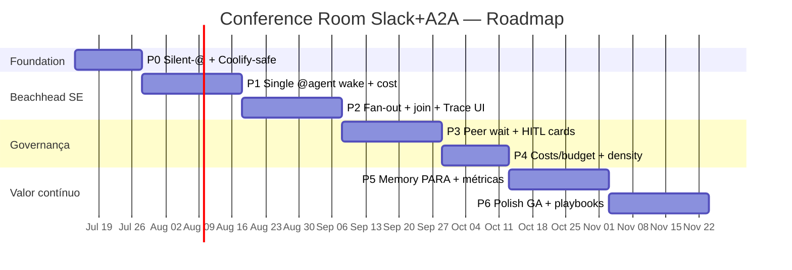

# Plano de Produto — Paperclip Conference Room (Slack + @agents + A2A)

> **Ciclo:** 4 — Planning  
> **Data:** 2026-07-09  
> **Produto:** Conference Room estilo Slack no fork `QuadriniL/paperclip` — humanos + `@agents` + fan-out/wait A2A nativo  
> **Repo de implementação:** `QuadriniL/paperclip` (fork-only)  
> **BizCursor desktop:** **pausado** (não é superfície de entrega deste roadmap)  
> **Beachhead:** Software Houses (evidência **A**) · **Secundário:** Support Ops (evidência **B**)  
> **Cópia operacional para agentes:** [`docs/superpowers/plans/2026-07-09-paperclip-slack-room-a2a.md`](../../../superpowers/plans/2026-07-09-paperclip-slack-room-a2a.md)  
> **Extensão B+ (híbrido ClickUp — autoritativa se conflito):** [`../cycle-4b-clickup-plan/00-PRODUCT-PLAN-HYBRID.md`](../cycle-4b-clickup-plan/00-PRODUCT-PLAN-HYBRID.md)

**NotebookLM (pré-plano):** overlap Villa CD/Stock/Financial/Sales = **não** · **GO** para planejar fora do processo Villa.

---

## 0. Sumário executivo

Construir, no Board do Paperclip (Coolify), uma **sala de conferência** onde:

1. Humanos e agentes coexistem em canais/threads (UX Slack / Claude Tag / Linear Agents).
2. Agentes ficam **silent-until-@** — só acordam quando mencionados.
3. `@A @B` dispara **fan-out A2A app-level** (N delegates) com **join** (`waitAllSec` / quorum), não “mentions mágicas”.
4. Custo, owner humano, approvals e trace ficam **visíveis no thread** — anti-hype Gartner.

**Não** estamos vendendo autonomia 80%, ROAS mágico, nem “substitui 700 agentes”. Vendemos **ciclo de trabalho auditável** (latência, handoff, custo, gate humano).

---

## 1. Contexto e decisões travadas

### 1.1 Decisões de produto (Decision Log)

| ID | Decisão | Status | Rationale (pesquisa) |
|----|---------|--------|----------------------|
| **D-01** | **Path B** — Slack + `@agents` (não Manus 1:1 puro) | Travada | Cycle 1: UX Linear/Slack/Teams; Cycle 2: Claude Tag / multiplayer async |
| **D-02** | **Fork-only** — implementação em `QuadriniL/paperclip` | Travada | Cycle 1 D4; BizCursor desktop pausado |
| **D-03** | **A2A fan-out é app-level** — orquestração Paperclip sobre N SendMessage/delegate; A2A ≠ sala | Travada | Cycle 1 D1 (spec v1.0.0); Cycle 2 claim confirmado |
| **D-04** | Reusar `run-delegation` + MCP `paperclipDelegate` + `wait:false` / `waitAllSec` | Travada | Cycle 2: fan-out+join **já existe**; falta bridge sala → A2A |
| **D-05** | Beachhead **Software Houses**; Support **secundário**; Marketing **não beachhead** (FLUFF ROAS) | Travada | Cycle 3 §2–§5 |
| **D-06** | Default **SAS → cascade MAS**; paralelo só com **quorum** (não barrier cego) | Travada | Cycle 2 (Gao / Aegean) |
| **D-07** | Humano owner sempre visível; silent-until-@ | Travada | Cycle 2 UX; Cycle 3 DoD beachhead |
| **D-08** | Wake via path **Coolify-safe** (`adapter_wake` / flag feature) — sem quebrar deploy | Travada | Cycle 1/2 gaps BoardChat + Coolify |

### 1.2 O que já existe vs. o que falta

| Capacidade | Estado no fork | Gap de produto |
|------------|----------------|----------------|
| `paperclipDelegate` / `run-delegation` | Implementado | Bridge a partir da sala |
| Fan-out `wait:false` + `waitAllSec` | Implementado | Trigger por `@A @B` no BoardChat |
| Mentions em issues | Wakeup independente | ≠ A2A join |
| BoardChat | Sempre concierge, sem `@` | Mentions + silent-until-@ |
| Humano POST delegate | Bloqueado (só agent JWT) | Room orchestrator no servidor (não Board JWT “fake agent”) |
| Modelo de sala + peer wait | Ausente | P0–P3 |
| Cost pill / budget na sala | Parcial (F3-ish no ecossistema) | P1 / P4 |
| DelegationTrace na sala Board | Ausente (existe rascunho no BizCursor pausado) | P2 no Board UI |

### 1.3 Princípios de entrega (anti-hype)

> Gartner (25 jun 2025): **>40%** dos projetos agentic cancelados até fim de 2027 — custos, valor unclear, risk controls fracos, “agent washing”.  
> McKinsey Agentic Mesh: orquestração + governança + trust humano; evitar agent sprawl.

**Tradução em DoD de produto:** escopo estreito por fase · KPIs de ciclo medidos · human gate · custo visível · sem claim de autonomia plena.

---

## 2. Roadmap visual (P0 → P6)



```text
P0 Foundation ──► P1 Single @ ──► P2 Fan-out/Join ──► P3 Peer+HITL
                                                         │
                         Software House beachhead ◄──────┤
                         Support secundário ◄────────────┤
                                                         ▼
                                              P4 Costs ──► P5 Memory/Metrics ──► P6 GA
```

| Fase | Nome | Duração alvo | Valor de negócio (1 linha) |
|------|------|--------------|----------------------------|
| **P0** | Foundation — Silent-until-@ & Coolify path | **2 semanas** | Sala segura sem spam de agentes; deploy não quebra |
| **P1** | Single @agent — Wake real + cost pill | **3 semanas** | 1º valor beachhead: tech lead acorda CEO/Dev de verdade |
| **P2** | Fan-out & Join — `@A @B` + DelegationTrace | **3 semanas** | Spike paralelo auditável (diferencial A2A) |
| **P3** | Peer Wait & HITL — quorum + input-required | **3 semanas** | Governança enterprise (approvals no thread) |
| **P4** | Costs & Density — budget + Operator/Board | **2 semanas** | Board vê $/thread; mata PoCs sem ROI |
| **P5** | Memory & Metrics — PARA light + weekly value | **3 semanas** | Retenção de contexto + prova semanal de valor |
| **P6** | Polish GA — playbooks verticais | **3 semanas** | Pacotes vendáveis SE + Support (+ early SC/AP) |

**Horizonte total:** ~**17 semanas** (~4 meses) até GA com playbooks — sujeito a Coolify/ops e design partners.

---

## 3. Personas e superfícies

| Persona | Precisa ver | Densidade UI |
|---------|-------------|--------------|
| **Operator** (Sofia / tech lead) | Narrativa humana, @mentions, cards de aprovação, custo resumido | Baixa — “colega no Slack” |
| **Board** (founder / EM) | Trace expandível, $/thread, budget, flags de risco | Alta — observabilidade |
| **Agente** | Prompt + contexto da thread + tools MCP | N/A (runtime) |

**Superfície única deste plano:** Board Web do Paperclip (fork). BizCursor desktop = fora de escopo até reativação explícita.

---

## 4. Fases detalhadas

---

### P0 — Foundation: Silent-until-@, Mentions no BoardChat, Coolify-safe

**Duração:** 2 semanas  
**Goal:** Fazer o BoardChat respeitar `@mentions` com agentes **silent-until-@**, via path de wake **seguro no Coolify** (`adapter_wake` + feature flag), sem fan-out ainda.

#### Business value
Elimina o anti-padrão “concierge responde tudo” e o risco de acordar agentes em loop no deploy. Sem P0, qualquer demo Slack vira spam e custo — exatamente o que Gartner aponta como cancelamento.

#### Cenários por vertical (mais fortes)

| Vertical | Cenário P0 | Por que importa agora |
|----------|------------|------------------------|
| **Software House (obrigatório)** | Canal `#eng-bugs`: humano posta sem `@` → nenhum agente responde; só log humano | Prova silent-until-@ no beachhead |
| **Support** | `#support-l1`: ticket webhook posta resumo; agentes silenciosos até lead `@triage-support` | Evita auto-reply sem owner |
| **Content/Marketing (guardrail)** | `#campaign-ops`: drafts humanos sem acordar `@copy` | Gate de brand desde o dia 1 |
| **Supply chain (early)** | `#procurement-exceptions`: alerta ERP na sala, sem wake automático | War room passiva até limiar humano |
| **Finance AP** | `#ap-exceptions`: fatura na fila, silent até `@extract` | Compliance: nada executa sozinho |

#### Functional scope
- Feature flag `conference_room_v1` (default off em prod Coolify; on em staging).
- Parser de `@agentSlug` / `@agentName` no BoardChat (composer + render).
- Política **silent-until-@**: mensagem sem mention → zero wakeup de agente.
- Path de wake Coolify-safe: `adapter_wake` (ou equivalente documentado no fork) — **não** reintroduzir paths que quebram allowlist/HTTP.
- Persistência de membership: canal ↔ agentes mencionáveis.
- Telemetria mínima: `mention_parsed`, `wake_skipped_silent`, `wake_attempted`.
- Docs de ops: como ligar flag no Coolify sem downtime.

#### Out of scope
- Fan-out `@A @B`, join, peer wait.
- Cost pill, DelegationTrace UI.
- Conectores ERP/CRM.
- Qualquer mudança no BizCursor desktop.
- Autonomia de merge/publish.

#### DoD checklist (testável)
- [ ] Flag off → comportamento legado (concierge) inalterado em smoke Coolify.
- [ ] Flag on + mensagem sem `@` → **0** heartbeat runs criadas (assert em API/logs).
- [ ] Flag on + `@ceo olá` → **1** wake do agente CEO (não concierge genérico), run visível no thread.
- [ ] `@nome-inexistente` → erro UX claro, sem wake.
- [ ] Deploy Coolify staging verde; healthcheck + BoardChat load < regressão acordada.
- [ ] Teste unitário do parser de mentions (slug, case, multi-byte).
- [ ] Runbook P0 publicado no fork (`docs/` do Paperclip).

#### Dependencies
- Acesso deploy Coolify do Paperclip fork.
- Inventário de agentes reais (CEO `opencode_local`, Dev `cursor_cloud`) no company de staging.
- Decisão D-08 (adapter_wake) implementável sem fork upstream.

#### Risks
| Risco | Mitigação |
|-------|-----------|
| Wake path quebra allowlist Coolify | Feature flag + canary; rollback = flag off |
| Parser ambíguo (`@dev` vs user humano) | Namespaces / autocomplete só de agentes membership |
| Concierge legado ainda “rouba” a mensagem | Gate explícito: se mention válida → bypass concierge |

#### Success metrics
| Métrica | Alvo P0 |
|---------|---------|
| False wakes (sem `@`) | **0** em suite de regressão |
| Time-to-wake após `@` (p50 staging) | < 5s até run `running` |
| Incidentes de deploy ligados à flag | **0** em staging |

---

### P1 — Single @agent: Wake real (CEO/Dev) + cost pill + thread

**Duração:** 3 semanas  
**Goal:** Um humano `@menciona` um agente real (CEO ou Dev) e recebe resposta **no thread**, com **cost pill** resumido e owner humano visível — beachhead Software House usável.

#### Business value
Primeiro “aha” vendável: o tech lead para de abrir 3 UIs e trata o agente como colega no canal. Alinha Peng/Copilot (aceleração em tarefa especificada) **com** METR nuance (review humano) — pitch honesto.

#### Cenários por vertical

| Vertical | Cenário P1 | Valor |
|----------|------------|-------|
| **Software House** | SH-1 reduzido: `@triage bug checkout 500` → classificação + issue link no thread; humano aprova próximo passo | Time-to-first-triage |
| **Software House** | `@coder implemente webhook idempotente — spec /docs/…` → draft + link PR | Time-to-first-diff |
| **Support** | `@triage-support ticket #4412` → intent + risco + rascunho (sem executar refund) | 1ª resposta estruturada |
| **Content (guardrail)** | `@brief lançamento SKU-X` → brief ops; **proibido** KPI ROAS | Ops only |
| **SC early** | `@triage-sc PO #8891 +18%` → classificação read-only | Exception triage |
| **Finance AP** | `@extract invoice ACME` → campos + confiança; sem approve automático | STP prep |

#### Functional scope
- Resolve mention → `agentId` membership do canal.
- Wake **do agente nomeado** (CEO/`opencode_local`, Dev/`cursor_cloud`) — **não** concierge.
- Resposta agentic posta **no mesmo thread** (reply/thread model Slack-like).
- **Cost pill** Operator: `$` ou tokens estimados da run (quando cost-events disponíveis; senão “pending”).
- Badge **human owner** na thread (quem disparou / quem deve aprovar).
- Cancel run a partir do thread (Board).
- Rate limit por canal/agente (anti-loop).
- Autocomplete `@` no composer.

#### Out of scope
- `@A @B` paralelo / join.
- Peer wait entre agentes.
- Cards `input-required` ricos (stub mínimo ok).
- Memory PARA.
- Playbooks empacotados.

#### DoD checklist (testável)
- [ ] ST: `@ceo` em `#eng-bugs` → run do agente CEO; texto no thread; concierge **não** responde.
- [ ] ST: `@dev` (cursor_cloud) → run Dev; adapter correto nos logs.
- [ ] Cost pill renderiza para run completed (ou estado `pending` explícito).
- [ ] Human owner id visível na UI Operator e no payload Board.
- [ ] Cancel mid-run → status terminal no thread < 10s.
- [ ] Rate limit: 4º wake/min no mesmo agente → 429/UX bloqueio.
- [ ] Piloto interno: ≥5 threads reais Software House em staging com agente real.
- [ ] Messaging doc: sem claim SWE-Bench 90%; cita Pro ~23% + METR nuance.

#### Dependencies
- P0 completo (flag + parser + silent).
- Agentes CEO/Dev provisionados e saudáveis no Coolify.
- Endpoint de custo/run (ou stub versionado se F3 incompleto no fork).

#### Risks
| Risco | Mitigação |
|-------|-----------|
| “Wake” ainda cai no concierge | Teste de regressão obrigatório no DoD; assert `agentId` |
| Custo indisponível | Pill `pending` + issue tracking; não bloquear P1 inteiro |
| Cursor Cloud lento/caro | Timeout UX + cancel; budget soft warning |

#### Success metrics
| Métrica | Alvo P1 (piloto 2 semanas) |
|---------|----------------------------|
| Threads com wake real (não concierge) | ≥ **20** |
| % respostas no thread correto | **100%** |
| Mediana time-to-first-agent-message | < **90s** (depende adapter) |
| NPS interno tech leads (1–5) | ≥ **4** em amostra ≥5 |

---

### P2 — Fan-out & Join: `@A @B` + waitAllSec + DelegationTrace UI

**Duração:** 3 semanas  
**Goal:** `@A @B` na sala dispara fan-out A2A app-level (`wait:false` + join `waitAllSec`) e o Board mostra **DelegationTrace** (árvore parent/children) no thread.

#### Business value
Diferencial competitivo vs. “só chatbot com mentions”: spike paralelo com auditoria (quem rodou, status, join). Desbloqueia SH-2 (OAuth spike) e Support L1 multi-agent — valor Cycle 3 §2.3 / §3.2.

#### Cenários por vertical

| Vertical | Cenário | A2A pattern |
|----------|---------|-------------|
| **Software House** | SH-2: `@researcher @coder @security` avaliar OAuth; join; humano decide | Paralelo + join |
| **Software House** | SH-1: `@triage @coder` bug prod; triage pode cascade antes de coder (SAS→MAS) | Cascade default |
| **Support** | CS-1: `@triage-support @policy @refund-agent` | Paralelo + limiar $ |
| **Content** | `@brief @copy @brand-check` — brand-check **sempre** no join antes de publish | Paralelo + gate |
| **SC early** | `@triage-sc @buyer @planner` | Paralelo read-mostly |
| **Finance AP** | `@extract @match` (approver só em P3) | Paralelo 2-way |

#### Functional scope
- Parser multi-mention ordenado; política: **todos mencionados veem o mesmo prompt de sala**.
- Orquestrador de sala → N `paperclipDelegate` / equivalent com `wait:false`.
- Join: `waitAllSec` configurável por canal (default documentado, ex. 600s).
- Política default: **cascade** quando dependência explícita (`wait @coder after @triage`); senão paralelo.
- **DelegationTrace** no Board: status agregado, children, expand Board / narrativa Operator.
- Cancel pai → cancel cascata (já no fork; expor na UI da sala).
- Eventos de sala: `fanout_started`, `child_completed`, `join_done`, `join_timeout`.

#### Out of scope
- Quorum parcial (N-of-M) — isso é P3.
- Peer wait agente↔agente sem humano.
- Budget hard-stop (P4).
- Reimplementar cliente A2A JSON-RPC no browser.

#### DoD checklist (testável)
- [ ] `@A @B` → **2** child runs com `parentRunId` comum; ambos recebem contexto da mensagem.
- [ ] Join completa quando ambos `completed` → mensagem de síntese/estado no thread.
- [ ] `waitAllSec` expirado → estado `join_timeout` visível; children canceláveis.
- [ ] DelegationTrace lista children com status ao vivo (poll).
- [ ] Cascade: `@triage then @coder` (sintaxe acordada) → coder só após triage terminal.
- [ ] ST Software House SH-2 em staging com 3 agentes.
- [ ] Zero heurística “detect delegation no texto” — só estado nativo `GET …/delegation` (ou equivalente Board).
- [ ] Testes de contrato do orquestrador (unit + 1 integration staging).

#### Dependencies
- P1 (single wake confiável).
- APIs de delegation já no fork (Cycle 2 confirmado).
- UI Board capaz de embutir painel de trace (design tokens existentes).

#### Risks
| Risco | Mitigação |
|-------|-----------|
| Barrier cego (espera o mais lento sempre) | Default cascade; paralelo só com timeout + UI |
| Custo 3× em fan-out | Soft warning no composer (“3 agentes ≈”); hard budget em P4 |
| Trace diverge do runtime | Fonte única: API delegation; sem parser de markdown |

#### Success metrics
| Métrica | Alvo P2 |
|---------|---------|
| Fan-outs bem-sucedidos (join ok) / tentativas | ≥ **85%** em staging |
| Threads SH com fan-out documentado | ≥ **10** |
| Tempo mediano join (2 agentes opencode/cursor mix) | baseline medido + relatório |
| % traces com 100% children refletidos | **100%** |

---

### P3 — Peer Wait & HITL: input-required + quorum policy

**Duração:** 3 semanas  
**Goal:** Agentes podem **esperar peers** e **pedir input humano** via cards no thread; join usa **quorum** (Aegean-style), não só “todos ou timeout”.

#### Business value
Torna o produto enterprise-safe: Klarna-híbrido (Support), AP approvals, brand gates. Sem HITL cards, o Board não compra — Gartner “risk controls inadequados”.

#### Cenários por vertical

| Vertical | Cenário | HITL / quorum |
|----------|---------|---------------|
| **Software House** | `@coder` pede approve do diff; `@reviewer` opcional (quorum 1-of-2 reviewers) | Card approve/reject/revise |
| **Support** | CS-2: escalation VIP — agente silent até humano `@` de novo; refund > limiar pede card | Always-human option |
| **Content** | `@brand-check` **bloqueia** publish até humano confirmar | Gate obrigatório |
| **SC early** | PO > $10k → card aprovação buyer humano | $ threshold |
| **Finance AP** | variance > 2% ou > $500 → `@approver` + card | **0** ações acima limiar sem humano |

#### Functional scope
- Estado A2A `input-required` → **Human Card** no thread (approve / reject / revise + texto).
- Peer wait: agente A declara wait em B (Co-Gym-like `WaitTeammateContinue` semântico).
- **Quorum policy** por canal: `all` \| `n_of_m` \| `any_primary` (config).
- Re-silent: após escalation, agente só volta com novo `@`.
- Audit log: quem aprovou, quando, qual run.
- Limiares por ferramenta perigosa (refund, merge, PO) — allowlist.

#### Out of scope
- Workflow engine genérico (BPMN).
- Assinatura digital / SOX pack completo.
- Voice recruiting (Jabarian) — produto aparte.
- Autonomia de merge em `main`.

#### DoD checklist (testável)
- [ ] Run em `input-required` renderiza card; sem card → DoD falha.
- [ ] Approve → run retoma; Reject → terminal `canceled`/`failed` com razão.
- [ ] Quorum `2_of_3`: join libera com 2 completed mesmo com 1 timeout (política explícita).
- [ ] Refund simulado > limiar **não** executa sem approve (assert).
- [ ] Audit log exportável (JSON) para 1 thread de teste.
- [ ] CS-1 + CS-2 smoke em staging.
- [ ] Doc de políticas de quorum por vertical (SE / Support / AP).

#### Dependencies
- P2 (fan-out + trace).
- Modelo de membership + roles mínimos (approver).
- Cycle 2 academia: quorum ≠ barrier.

#### Risks
| Risco | Mitigação |
|-------|-----------|
| Cards ignorados (humano some) | SLA reminder + escalate-to-owner; timeout policy |
| Deadlock peer wait A↔B | Ciclo detect + break com card humano |
| Over-engineering BPM | Só 3 ações de card; YAGNI |

#### Success metrics
| Métrica | Alvo P3 |
|---------|---------|
| % ações perigosas com approve registrado | **100%** |
| Tempo mediano card → decisão (piloto) | < **4h** horário comercial |
| Deadlocks peer-wait em prod staging | **0** / semana |
| Support: % escalations com resumo no thread | ≥ **90%** |

---

### P4 — Costs & Density: budget na sala + Operator/Board

**Duração:** 2 semanas  
**Goal:** Cada thread/sala mostra **custo real**, budgets por canal, e duas densidades UI (Operator vs Board) — matar PoCs sem ROI.

#### Business value
Resposta direta ao Gartner (custos crescentes / valor unclear). Board só renova piloto se vir `$/thread` e teto. Desbloqueia Support em escala e prepara Finance AP.

#### Cenários por vertical

| Vertical | Uso de custo |
|----------|--------------|
| **Software House** | Budget `#eng-spike-*` = $X/dia; soft-stop no 4º fan-out |
| **Support** | Custo/ticket L1 vs VIP; alertar se agentic > humano histórico |
| **Content** | Custo/campanha **ops** (não ROAS) |
| **SC / AP** | Custo/exception; AP exige custo no audit |

#### Functional scope
- Agregar cost-events → **$/thread** e **$/canal** (dia/semana).
- Budget: soft warning + hard stop (não cria novos wakes).
- Toggle densidade: Operator (narrativa + pill) vs Board (tabela runs, tokens, modelo).
- Export CSV semanal para Board.
- Alertas: 80% budget, join_timeout caro, fan-out > N agentes.

#### Out of scope
- FinOps multi-cloud completo.
- Chargeback contábil.
- Otimização automática de modelo.

#### DoD checklist (testável)
- [ ] Thread com 1 run completed mostra $ (ou tokens + taxa configurada).
- [ ] Hard budget: wake bloqueado com UX clara ao exceder.
- [ ] Toggle Operator/Board persiste por usuário.
- [ ] CSV semanal gera 7 dias de staging com colunas documentadas.
- [ ] DoD beachhead Cycle 3 item “Board vê custo por thread” = **true**.

#### Dependencies
- P1 cost pill; idealmente cost-events confiáveis no fork (session payload se aplicável).
- P2 para custo de fan-out fazer sentido.

#### Risks
| Risco | Mitigação |
|-------|-----------|
| Custos incompletos por adapter | Marcar `partial`; não inventar número |
| Hard stop frustra demo | Bypass role admin auditado |

#### Success metrics
| Métrica | Alvo P4 |
|---------|---------|
| % threads com custo known ou partial explícito | **100%** |
| Canais com budget configurado no piloto SE | ≥ **1** |
| Decisões de corte de PoC baseadas em $ | ≥ **1** documentada |

---

### P5 — Memory & Metrics: PARA light + weekly value

**Duração:** 3 semanas  
**Goal:** Memória **PARA light** (prefs de canal/agente) + **painel semanal de valor** (KPIs de ciclo) para provar beachhead com dados.

#### Business value
Sem memória, cada `@` reexplica o repo; sem métricas semanais, o piloto morre no slide. Fecha o loop Cycle 3 DoD beachhead (time-to-first-diff, handoffs, custo).

#### Cenários por vertical

| Vertical | Memória / métrica |
|----------|-------------------|
| **Software House** | Prefs: repo default, style guide, “sempre citar testes”; KPI time-to-first-diff |
| **Support** | Macros/KB prefs; KPI 1ª resposta < 2 min |
| **Content** | Brand voice bullets; KPI % assets com brand-check |
| **SC** | Playbook limiares $ |
| **AP** | Vendor prefs; KPI tempo em exception queue |

#### Functional scope
- PARA light: Projects / Areas como **scoped notes** por canal (não DMS completo).
- Injeção de contexto no wake (resumo + links), com teto de tokens.
- Dashboard semanal: time-to-first-diff, #fan-outs, $/thread p50, % HITL, join_timeout rate.
- Baseline capture wizard (1× no onboarding do piloto).
- Opt-out de memória por canal (compliance).

#### Out of scope
- RAG enterprise multi-tenant completo.
- Auto-tuning de agentes.
- Voice memory / recruiting transcripts como claim causal.

#### DoD checklist (testável)
- [ ] Nota PARA no canal aparece no prompt do próximo `@` (assert em log de wakeup redacted).
- [ ] Dashboard semanal renderiza com dados sintéticos + 1 semana real staging.
- [ ] Piloto SE: baseline vs semana 4 comparado em relatório exportável.
- [ ] Opt-out: canal sem memória → prompt sem notas PARA.
- [ ] Nenhum PII de clientes Support em métricas agregadas (só IDs).

#### Dependencies
- P1–P4 (eventos de ciclo + custo).
- Design partner Software House disposto a baseline.

#### Risks
| Risco | Mitigação |
|-------|-----------|
| Memória polui prompt | Teto tokens + “pin” manual |
| Métricas vãoas | Só KPIs Cycle 3; YAGNI vanity charts |

#### Success metrics
| Métrica | Alvo P5 (piloto 30–60d) |
|---------|-------------------------|
| Time-to-first-diff mediana vs baseline | **−40%** (amostra ≥10) |
| Handoffs fora do canal | **−50%** |
| % PRs com testes citados no thread | ≥ **70%** |
| Weekly report aberto pelo Board | ≥ **1×/semana** |

---

### P6 — Polish GA + Vertical Playbooks

**Duração:** 3 semanas  
**Goal:** Endurecer para GA (a11y, vazios, i18n PT-BR/EN) e publicar **playbooks** Software House + Support Ops (+ early SC/AP, Content com guardrails).

#### Business value
Transforma capacidade técnica em **oferta empacotável**: checklist de piloto, agentes sugeridos, KPIs, anti-claims. Reduz time-to-value do próximo cliente.

#### Cenários por vertical (playbooks)

| Playbook | Inclui | Não inclui |
|----------|--------|------------|
| **Software House GA** | Canais `#eng-bugs`, `#eng-spike-*`; agentes triage/coder/reviewer/ceo; DoD Cycle 3 §2.5 | Autonomia de merge |
| **Support Ops** | `#support-l1`, `#support-vip`; híbrido Klarna-honest; always-human | “−700 FTE” como KPI |
| **Content Ops (guardrail)** | brand-check gate; KPIs ops only | ROAS/ROI mídia |
| **SC Exceptions (early)** | limiares $; read-only planner | Autonomia PO |
| **Finance AP** | extract/match/approver; 0 above-threshold sem humano | STP 100% claim |

#### Functional scope
- Empty states, onboarding de sala, templates de canal.
- A11y: teclado no composer `@`, cards HITL, contraste AA.
- i18n PT-BR / EN das strings da sala.
- Playbook markdown + JSON de seed (agentes, budgets, quorum).
- Smoke GA: ST-ROOM-01…N automatizáveis no CI do fork.
- Changelog e migration guide flag → GA (flag default on em novos companies).

#### Out of scope
- Marketplace público de agentes.
- Mobile app nativo.
- Reativar BizCursor desktop (decisão separada).
- Marketing ROAS pack.

#### DoD checklist (testável)
- [ ] Todos ST-ROOM críticos verdes no CI staging.
- [ ] Playbook SE aplicado em company limpa em < **30 min** (cronometrado).
- [ ] Playbook Support aplicado; always-human documentado.
- [ ] A11y spot-check: composer + card approve só com teclado.
- [ ] Flag default on para **novos** companies; existentes opt-in.
- [ ] Doc anti-hype no playbook (Gartner 40% + claims proibidos).
- [ ] Decisão explícita sobre BizCursor: continua pausado ou spike pós-GA.

#### Dependencies
- P0–P5 estáveis.
- 1 design partner SE + 1 Support (ou SE interno + Support simulado).

#### Risks
| Risco | Mitigação |
|-------|-----------|
| Playbook vira slideware | Seed JSON executável = parte do DoD |
| Scope creep vertical | Early SC/AP = appendix; não bloqueia GA SE |

#### Success metrics
| Métrica | Alvo P6 |
|---------|---------|
| Time-to-first-value novo company (SE playbook) | < **1 dia** |
| Bugs P0/P1 abertos no GA | **0** |
| Design partners ativos | ≥ **2** (SE + Support ou 2 SE) |
| Claims FLUFF no material de vendas | **0** (review) |

---

## 5. Matriz fase × vertical (desbloqueio)

| Fase | Software House | Support Ops | Content (guardrails) | SC early | Finance AP |
|------|----------------|-------------|----------------------|----------|------------|
| P0 | silent demo | silent fila | silent drafts | alerta passivo | fila passiva |
| P1 | **beachhead 1:1 @** | triage 1 agente | brief ops | triage read | extract |
| P2 | **spikes paralelos** | L1 multi-agent | brief+copy+brand | triage paralelo | extract+match |
| P3 | review gates | **híbrido VIP** | **brand block** | $ cards | **approver cards** |
| P4 | $/PR thread | $/ticket | $/campanha ops | $/exception | audit $ |
| P5 | KPI diff −40% | KPI <2 min | % brand-check | playbooks | queue −30% |
| P6 | **playbook GA** | **playbook GA** | appendix guardrail | early appendix | appendix pós-gov |

---

## 6. Métricas norte (produto inteiro)

Alinhadas a Cycle 3 — **não** autonomy theater:

| Norte | Definição | Onde vive |
|-------|-----------|-----------|
| Time-to-first-diff | humano bug → 1º PR link no thread | P5 dashboard |
| Handoff hygiene | % trabalho que fica na sala | P5 |
| Cost transparency | % threads com $ known/partial | P4 |
| Human gate integrity | % ações perigosas com approve | P3 |
| Join reliability | fan-out join ok / tentativas | P2 |
| False wake rate | wakes sem `@` | P0 |

---

## 7. Anti-hype Gartner / McKinsey (obrigatório em pitch)

### 7.1 Gartner — >40% projetos agentic cancelados até 2027
- **Fonte:** [Gartner PR, 25 jun 2025](https://www.gartner.com/en/newsroom/press-releases/2025-06-25-gartner-predicts-over-40-percent-of-agentic-ai-projects-will-be-canceled-by-end-of-2027)
- **Motivos:** custo, valor unclear, risk controls, hype/PoC, agent washing.
- **Nosso antídoto no plano:** P0 flag/canary · P1 valor de ciclo · P3 HITL · P4 budget · P5 métricas · P6 playbooks sem FLUFF.

### 7.2 McKinsey — Agentic mesh + gen-AI paradox
- **Fontes:** [Seizing the agentic AI advantage](https://www.mckinsey.com/capabilities/quantumblack/our-insights/seizing-the-agentic-ai-advantage) · [Agentic AI Mesh](https://medium.com/quantumblack/how-we-enabled-agents-at-scale-in-the-enterprise-with-the-agentic-ai-mesh-architecture-baf4290daf48)
- **Antídoto:** poucos agentes com owner · A2A como mesh operacional · trust via cards · sem sprawl antes de P4.

### 7.3 Frase de pitch (única)
> “Scoped agents, clear cycle metrics, human gate — porque >40% dos projetos agentic morrem por hype, custo e risco; vendemos a sala onde o trabalho e a aprovação ficam visíveis.”

### 7.4 Claims proibidos
- “Resolve 80% dos bugs sozinho”
- “Substitui 700 agentes” / “−700 FTE”
- “+X% ROAS com agentes”
- “Gartner 50% SCM” como proof of value Phase 1
- “SWE-Bench 90% = produção”
- Jabarian voice lift como feature Slack

---

## 8. Citações de pesquisa (Cycles 1–3)

| Doc | Uso neste plano |
|-----|-----------------|
| [`cycle-1-discovery/00-INDEX.md`](../cycle-1-discovery/00-INDEX.md) | Path B; fork-only; A2A app-level; catálogos D1–D5; `paperclipDelegate` já existe |
| [`cycle-2-confirmation/00-INDEX.md`](../cycle-2-confirmation/00-INDEX.md) | Claims confirmados; gaps BoardChat; `waitAllSec`; UX Claude/Linear/Teams; SAS→MAS; quorum |
| [`cycle-3-deep-dive/03-verticals-and-value.md`](../cycle-3-deep-dive/03-verticals-and-value.md) | Beachhead SE A; Support B; Marketing FLUFF; cenários SH/CS; DoD valor; anti-hype; matriz fase×vertical |
| [`docs/handoffs/2026-07-07-f2-native-delegation.md`](../../../handoffs/2026-07-07-f2-native-delegation.md) | Contrato delegation; BizCursor pausado consome só GET; POST delegate = agent JWT |

**Próximo ciclo sugerido:** Cycle 5 — Tech specs (contratos de API da sala, schemas de mention/fan-out/quorum, ST-ROOM numerados) em `docs/research/slack-a2a-room/cycle-5-tech-specs/`.

---

## 9. Governança de execução

| Papel | Responsabilidade |
|-------|------------------|
| Product / founder | Prioridade vertical, design partners, claims |
| Eng fork Paperclip | P0–P6 no Board; Coolify |
| Ops Coolify | Flags, canary, rollback |
| Design partner SE | Baseline + threads reais P1+ |
| Agentes de implementação | Seguir este plano + tech specs Cycle 5; **não** reabrir D-01…D-08 sem ADR |

**Commits / PRs:** só no fork Paperclip para este roadmap. BizCursor: freeze salvo hotfixes críticos pré-acordados.

**Critério para pausar o roadmap:** se P1 não atingir wakes reais em staging em 3 semanas → stop e reavaliar adapter_wake (não “compensar” com mais UI).

---

## 10. Veredito Cycle 4

1. Roadmap **P0→P6** (~17 semanas) é suficiente para GA beachhead **Software House** + playbook **Support**, com governança anti-hype.
2. Valor entra em **P1**; diferencial A2A em **P2**; enterprise gate em **P3**; sobrevivência comercial em **P4–P5**.
3. BizCursor desktop permanece **pausado**; DelegationTrace deste plano é **Board-first**.
4. Cycle 5 deve detalhar contratos e ST-ROOM sem reabrir Path B / fork-only / app-level fan-out.

---

*Documento gerado no Cycle 4 Planning · 2026-07-09 · PT-BR*
