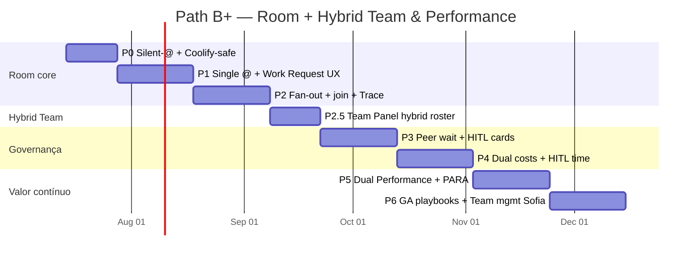

# Plano de Produto Híbrido — Conference Room + Team & Performance (ClickUp lens)

> **Ciclo:** 4B — Planning (extensão híbrida)  
> **Data:** 2026-07-09  
> **Produto:** Path **B+** — Conference Room (Slack + `@agents` + A2A) **e** Hybrid Team & Performance (roster + workload + dual costs + dual performance)  
> **Repo de implementação:** `QuadriniL/paperclip` (fork-only)  
> **BizCursor desktop:** **pausado**  
> **Beachhead:** Software Houses (evidência **A**) · **Secundário:** Support Ops (evidência **B**)  
> **Base Cycle 4 (sala):** [`../cycle-4-plan/00-PRODUCT-PLAN.md`](../cycle-4-plan/00-PRODUCT-PLAN.md)  
> **Descoberta ClickUp:** [`../cycle-1b-clickup-discovery/00-INDEX.md`](../cycle-1b-clickup-discovery/00-INDEX.md)  
> **Cópia operacional para agentes:** [`../../../superpowers/plans/2026-07-09-paperclip-slack-room-a2a.md`](../../../superpowers/plans/2026-07-09-paperclip-slack-room-a2a.md)

**NotebookLM (pré-plano):** overlap Villa CD/Stock/Financial/Sales = **não** · **GO** para planejar fora do processo Villa.

---

## 0. Sumário executivo

O Cycle 4 entregou o roadmap da **sala** (P0–P6 Slack+A2A). O Cycle 4B **não substitui** a sala — **estende** o produto para o gap que o ClickUp deixou aberto:

| ClickUp tem | ClickUp **não** unifica | Paperclip B+ |
|-------------|-------------------------|--------------|
| Super Agents como users (`@` / assign / DM) | Capacity humano + AI no **mesmo** Workload | Roster híbrido + lanes |
| AI Hub (jobs, avg cost, schedules) | Performance dual no mesmo painel | Dual Performance Dashboard |
| Workload humano | Pedido fácil humano→IA no fluxo de trabalho | Ask + assign-as-delegate |
| Autopilot por trigger | Proatividade **dentro** do chat sem spam | Triggers whitelist **fora** da Room |

**Vendemos:** ciclo de trabalho auditável **entre humanos e agentes** — carga, custo ($ + tempo HITL), performance e gate humano — na mesma superfície Board.

**Não vendemos:** autonomia 80%, “substitui o time”, ROAS mágico, agent washing, nem “AI Hub clone”.

---

## 1. Contexto e decisões travadas

### 1.1 Decision Log — Cycle 1–4 (D-01…D-08) — herdadas

| ID | Decisão | Status |
|----|---------|--------|
| **D-01** | Path **B** — Slack + `@agents` | Travada |
| **D-02** | Fork-only `QuadriniL/paperclip` | Travada |
| **D-03** | A2A fan-out = app-level | Travada |
| **D-04** | Reusar `run-delegation` + `paperclipDelegate` + `wait:false` / `waitAllSec` | Travada |
| **D-05** | Beachhead Software Houses; Support secundário; Marketing ≠ beachhead | Travada |
| **D-06** | Default SAS → cascade MAS; paralelo só com quorum | Travada |
| **D-07** | Humano owner sempre visível; silent-until-@ | Travada |
| **D-08** | Wake Coolify-safe (`adapter_wake` / flag) | Travada |

### 1.2 Decision Log — Cycle 1B / 4B (D-09…D-13) — **novas, travadas**

| ID | Decisão | Status | Rationale |
|----|---------|--------|-----------|
| **D-09** | Path **B+**: Conference Room **+** Hybrid Team & Performance (não só chat) | Travada | Cycle 1B: ClickUp = PRIMARY; gap = unificar humano+AI |
| **D-10** | Proatividade **governada** (triggers whitelist); default Room = silent-until-@ | Travada | Ambient/Autopilot **fora** do stream; evita spam Gartner |
| **D-11** | Painéis de performance **fora do stream** (aba Team / Insights); dual Humano \| Agente \| Room | Travada | Stream = narrativa; Insights = comando |
| **D-12** | **Assign-as-delegate** (Linear): humano = **owner**; agente = **delegate** | Travada | Owner nunca some; agente executa sob accountability humana |
| **D-13** | AI Hub-like **roster** + Workload-like **lanes** no mesmo produto | Travada | Oportunidade vs ClickUp (não unificou capacity) |

### 1.3 O que já existe vs. o que falta (híbrido)

| Capacidade | Estado | Gap B+ |
|------------|--------|--------|
| Org de agentes, runs, costs, routines | Forte no fork | Expor em roster unificado |
| Members + UserProfile | Fraco (só membership) | Lanes de carga humana + tempo HITL |
| BoardChat / Room (Cycle 4) | Em roadmap P0–P3 | Bridge Ask / assign-delegate |
| Painel workforce unificado | **Ausente** | **P2.5** |
| Dual performance (humano \| agente \| room) | **Ausente** | **P5 expandido** |
| Custo $ + tempo humano HITL | Parcial ($ em P4 sala) | **P4 expandido** |
| Team management Operator (Sofia) | **Ausente** | **P6** |

### 1.4 Princípios de entrega (anti-hype)

> Gartner (25 jun 2025): **>40%** dos projetos agentic cancelados até fim de 2027 — custos, valor unclear, risk controls fracos, “agent washing”.  
> McKinsey Agentic Mesh: orquestração + governança + trust humano; evitar agent sprawl.  
> ClickUp lesson: AI Hub e Workload **separados** = EM não vê carga total.

**Tradução em DoD B+:**

1. Escopo estreito por fase (sala primeiro; Team panel depois do fan-out mínimo).
2. KPIs de ciclo **e** de capacidade (humano + AI) medidos.
3. Human gate + owner sempre visível (D-07, D-12).
4. Custo dual: **$ agentic** + **tempo HITL humano** (não só tokens).
5. Performance **fora do chat** (D-11) — sem vanity widgets no stream.
6. Sem claim de “substitui o EM / o time”.

---

## 2. Roadmap visual (P0 → P6 com B+)



```text
P0 Foundation
  └─► P1 Single @ + Work Request (Ask / assign-delegate)
        └─► P2 Fan-out / Join / Trace
              └─► P2.5 Team Panel (roster + lanes)     ← NOVO B+
                    └─► P3 Peer + HITL
                          └─► P4 Dual costs ($ + HITL time)
                                └─► P5 Dual Performance Dashboard
                                      └─► P6 GA + playbooks + Team mgmt
```

| Fase | Nome | Duração alvo | Valor de negócio (1 linha) |
|------|------|--------------|----------------------------|
| **P0** | Foundation — Silent-until-@ & Coolify | **2 sem** | Sala sem spam; deploy seguro |
| **P1** | Single @ + **Work Request** affordances | **3 sem** | Pedir trabalho à IA sem fricção (Ask / assign) |
| **P2** | Fan-out & Join + DelegationTrace | **3 sem** | Spike paralelo auditável |
| **P2.5** | **Team Panel** — roster híbrido + lanes | **2 sem** | EM vê humano + AI no mesmo painel |
| **P3** | Peer Wait & HITL | **3 sem** | Approvals no thread; enterprise-safe |
| **P4** | **Dual costs** — $ agentic + tempo HITL | **3 sem** | ROI honesto (máquina + atenção humana) |
| **P5** | **Dual Performance** + PARA light | **3 sem** | Dashboard humano \| agente \| room |
| **P6** | GA playbooks + **Team management Sofia** | **3 sem** | Oferta empacotável + gestão de time |

**Horizonte total:** ~**20 semanas** (~5 meses) até GA B+ — +~3 semanas vs Cycle 4 puro (P2.5 + expansão P1/P4/P5/P6).

**Dependência de ordem:** P2.5 **depois** de P2 (precisa de runs/delegation reais para popular lanes de agentes). P1 Work Request pode shipar **antes** do Team Panel (affordances na Room/issue).

---

## 3. Personas e superfícies (B+)

| Persona | Precisa ver | Superfície | Densidade |
|---------|-------------|------------|-----------|
| **Operator / Sofia** (tech lead) | Narrativa, Ask, cards, custo resumido, **gestão leve do time** | Room + Team (ops) | Baixa–média |
| **EM / Board** (founder, eng manager) | **Carga humano+AI**, $/thread, tempo HITL, dual performance, risco | Team + Insights + Room expand | Alta |
| **Humano IC** | Pedir trabalho (Ask / assign), owner badge, cards | Room / issue | Baixa |
| **Agente** | Prompt + contexto + tools | Runtime | N/A |

**Superfície única:** Board Web Paperclip (fork).  
**Aba Team / Insights:** fora do stream (D-11).  
BizCursor desktop = fora de escopo.

---

## 4. Fases detalhadas (B+)

---

### P0 — Foundation: Silent-until-@, Mentions, Coolify-safe

**Duração:** 2 semanas  
**Goal:** BoardChat respeita `@mentions` com agentes **silent-until-@**, wake **Coolify-safe**, sem fan-out e sem Team Panel ainda.

#### Business value
Sem P0, Room e Team Panel viram spam de custo — exatamente o padrão que Gartner associa a cancelamento. Fundação obrigatória para B+.

#### Cenários por vertical

| Vertical | Cenário P0 | Por que importa |
|----------|------------|-----------------|
| **Software House (obrigatório)** | `#eng-bugs`: post sem `@` → 0 wakes; EM confia que chat humano não acorda AI | Base de carga real (só humano no stream) |
| **Support** | Ticket webhook na sala; silent até `@triage-support` | Evita auto-reply sem owner |
| **Content (guardrail)** | Drafts humanos sem acordar `@copy` | Brand gate dia 1 |
| **SC early** | Alerta ERP passivo | War room até limiar humano |
| **Finance AP** | Fatura na fila, silent | Compliance |

#### Functional scope
- Flag `conference_room_v1` (off prod / on staging).
- Parser `@agentSlug` / `@agentName`.
- Política silent-until-@ (D-07, D-10 default Room).
- `adapter_wake` Coolify-safe (D-08).
- Membership canal ↔ agentes.
- Telemetria: `mention_parsed`, `wake_skipped_silent`, `wake_attempted`.

#### Out of scope
- Fan-out, Team Panel, Ask button, dual costs, dual performance.
- Proatividade ambient no chat.
- BizCursor desktop.

#### DoD checklist (testável)
- [ ] Flag off → legado inalterado (smoke Coolify).
- [ ] Flag on + msg sem `@` → **0** heartbeat runs.
- [ ] Flag on + `@ceo` → **1** wake do agente nomeado.
- [ ] `@inexistente` → erro UX, sem wake.
- [ ] Deploy staging verde; parser unitário.
- [ ] Runbook P0 no fork.

#### Success metrics
| Métrica | Alvo P0 |
|---------|---------|
| False wakes (sem `@`) | **0** |
| Time-to-wake p50 após `@` | < **5s** até `running` |
| Incidentes deploy pela flag | **0** |

---

### P1 — Single @agent + Work Request affordances

**Duração:** 3 semanas  
**Goal:** Humano acorda agente real **e** pede trabalho com fricção mínima: botão **Ask / Pedir ao agente**, **assign-as-delegate** (humano owner + agente delegate), cost pill, owner visível.

#### Business value
Cycle 1B: “pedido fácil” = stack `@mention` + assign-delegate + Ask + templates. Sem isso, a Room é só chat — não compete com Linear/ClickUp no intake. Primeiro aha beachhead **e** ponte para Team Panel.

#### Cenários por vertical

| Vertical | Cenário P1 | Valor |
|----------|------------|-------|
| **Software House (obrigatório)** | EM/tech lead: botão **Ask** em issue “checkout 500” → escolhe `@triage` → wake + owner = EM; assign-delegate: humano Sofia owner, `@coder` delegate | Time-to-first-triage; EM vê owner≠delegate |
| **Software House** | `@coder` via Ask com template “implemente spec” → draft + link PR | Time-to-first-diff |
| **Support** | Ask `@triage-support` no ticket; owner = lead humano | 1ª resposta estruturada |
| **Content** | Ask `@brief` — **proibido** KPI ROAS | Ops only |
| **SC early** | Ask `@triage-sc` read-only | Exception triage |
| **Finance AP** | Ask `@extract` sem approve auto | STP prep |

#### Functional scope
- Wake do agente nomeado (não concierge) + resposta no thread.
- **Ask / Pedir ao agente:** CTA no composer e/ou issue → picker de agente membership → mensagem template opcional → wake.
- **Assign-as-delegate (D-12):** campo `ownerUserId` (humano) + `delegateAgentId` (agente); UI mostra ambos.
- Cost pill Operator; cancel run; rate limit; autocomplete `@`.
- Templates leves (3–5) Software House: triage bug, implement spec, review draft.

#### Out of scope
- Fan-out `@A @B` (P2).
- Team Panel / lanes (P2.5).
- Dual performance (P5).
- Cards HITL ricos (P3; stub ok).

#### DoD checklist (testável)
- [ ] `@ceo` / `@dev` → wake real; concierge não responde.
- [ ] Botão Ask → picker → 1 wake do agente escolhido; owner humano gravado.
- [ ] Assign-delegate: issue com owner humano + delegate agente; ambos visíveis na UI.
- [ ] Cost pill (ou `pending` explícito).
- [ ] Cancel mid-run < 10s; rate limit 4º wake/min.
- [ ] ≥5 threads SE reais em staging.
- [ ] Doc messaging: sem SWE-Bench 90%; cita METR nuance.

#### Success metrics
| Métrica | Alvo P1 (piloto 2 sem) |
|---------|------------------------|
| Threads com wake real | ≥ **20** |
| % wakes via Ask (vs só digitar `@`) | ≥ **30%** (adoção affordance) |
| % issues com owner humano + delegate agente | ≥ **50%** das delegações P1 |
| Mediana time-to-first-agent-message | < **90s** |
| NPS tech leads (1–5) | ≥ **4** (n≥5) |

---

### P2 — Fan-out & Join: `@A @B` + waitAllSec + DelegationTrace

**Duração:** 3 semanas  
**Goal:** `@A @B` dispara fan-out A2A app-level; Board mostra DelegationTrace; join com `waitAllSec`.

#### Business value
Diferencial vs chatbot-com-mentions. Desbloqueia spikes SE e multi-agent Support. Alimenta lanes de agentes no P2.5 com dados reais de runs paralelas.

#### Cenários por vertical

| Vertical | Cenário | Pattern |
|----------|---------|---------|
| **Software House (obrigatório)** | SH-2: `@researcher @coder @security` OAuth; EM acompanha join no Trace; carga AI aparece depois no Team | Paralelo + join |
| **Software House** | SH-1: cascade `@triage` then `@coder` | SAS→MAS |
| **Support** | CS-1 multi-agent + limiar $ | Paralelo |
| **Content** | brief+copy+brand-check no join | Gate |
| **SC / AP** | triage paralelo / extract+match | Read-mostly |

#### Functional scope
- Multi-mention → N `paperclipDelegate` `wait:false` + join `waitAllSec`.
- Cascade default quando dependência explícita.
- DelegationTrace Board (fonte = API delegation).
- Eventos: `fanout_started`, `child_completed`, `join_done`, `join_timeout`.
- Soft warning de custo N agentes no composer (hard budget em P4).

#### Out of scope
- Quorum N-of-M (P3); Team Panel (P2.5); hard budget (P4).

#### DoD checklist (testável)
- [ ] `@A @B` → 2 children + `parentRunId`; join ok / timeout visível.
- [ ] Trace 100% children; cascade sintaxe acordada.
- [ ] ST SH-2 staging 3 agentes.
- [ ] Zero heurística “detect delegation no texto”.

#### Success metrics
| Métrica | Alvo P2 |
|---------|---------|
| Join ok / tentativas | ≥ **85%** |
| Threads SH com fan-out | ≥ **10** |
| % traces completos | **100%** |

---

### P2.5 — Team Panel: Hybrid roster + Workload lanes

**Duração:** 2 semanas  
**Goal:** Entregar aba **Team** com roster híbrido (humanos + agentes) e **lanes de workload** no mesmo painel — AI Hub-like + Workload-like (D-13), sem misturar métricas no stream (D-11).

#### Business value
**Gap ClickUp:** não unifica capacity humano+AI. Este é o diferencial B+ vendável ao EM: “quem está carregado — pessoas e agentes — agora?” Sem P2.5, Path B é só sala; com P2.5, vira **sistema de trabalho híbrido**.

#### Cenários por vertical

| Vertical | Cenário P2.5 | Por que importa |
|----------|--------------|-----------------|
| **Software House (obrigatório)** | EM abre Team: lane Sofia (3 issues + 2 cards HITL pendentes); lane `@coder` (2 runs active, avg $/run); lane `@triage` idle; roster mostra status/adapters | EM **vê carga humano+AI** antes de pedir mais spike |
| **Software House** | EM filtra por canal `#eng-spike-*` → só membros + agentes daquele spike | Evita agent sprawl |
| **Support** | Lead vê agentes L1 saturados vs humanos VIP | Balanceamento Klarna-honest |
| **Content** | Roster com `@brand-check` sempre “gate” role | Visibilidade de papel |
| **SC / AP** | Agentes read-only vs approver humano na mesma lista | Segregação de deveres |

#### Functional scope
- Aba **Team** (fora do stream): lista unificada `kind: human | agent`.
- **Roster AI Hub-like:** agente → status (idle/running/error), jobs recentes, avg cost (se disponível), adapter, schedule/routine flag (read-only se já existir).
- **Workload lanes:** por membro humano (issues owned, HITL cards abertos) e por agente (runs active, queue).
- Deep-link: lane → Room/thread/run.
- Filtros: canal, role, status; busca por nome/slug.
- Empty states: company sem agentes / sem humanos.
- **Não** executar Autopilot ambient na Room (D-10) — só exibir routines existentes se houver.

#### Out of scope
- Dual Performance charts completos (P5) — P2.5 = capacity **agora**, não trends.
- Edição rica de org chart / HRIS.
- Proatividade nova (só whitelist futura em P6).
- Drag-and-drop capacity planning avançado (YAGNI).

#### DoD checklist (testável)
- [ ] Aba Team lista ≥1 humano + ≥1 agente do company staging.
- [ ] Lane humana mostra count de issues owned + cards HITL abertos (0 ok se nenhum).
- [ ] Lane agente mostra runs `running`/`queued` alinhadas à API (assert IDs).
- [ ] Click na lane agente → abre run/thread correto.
- [ ] Filtro por canal `#eng-bugs` reduz roster ao membership.
- [ ] Stream/Room **não** ganha widgets de performance (assert UX).
- [ ] Smoke SE: EM script “identificar quem está saturado” em < **60s**.

#### Success metrics
| Métrica | Alvo P2.5 |
|---------|-----------|
| Tempo EM para responder “quem está livre?” (teste guiado) | < **60s** |
| % agentes membership visíveis no roster | **100%** |
| Discrepância lane vs API runs (amostra) | **0** |
| Uso semanal aba Team por EM piloto | ≥ **3×/semana** |

---

### P3 — Peer Wait & HITL: input-required + quorum

**Duração:** 3 semanas  
**Goal:** Cards HITL no thread; peer wait; quorum; re-silent após escalation. Tempo em card alimentará P4 (HITL time).

#### Business value
Enterprise-safe (Gartner risk controls). Sem HITL, Board não compra; sem medição de espera humana, dual cost em P4 fica cego.

#### Cenários por vertical

| Vertical | Cenário | HITL |
|----------|---------|------|
| **Software House (obrigatório)** | `@coder` pede approve diff; EM vê card **e** lane Team com “HITL waiting on Sofia” | Approve/reject/revise |
| **Support** | Refund > limiar; VIP always-human | Card + silent |
| **Content** | Brand block até humano | Gate |
| **SC / AP** | $ / variance thresholds | Approver |

#### Functional scope
- `input-required` → Human Card; peer wait; quorum `all` \| `n_of_m` \| `any_primary`.
- Audit: quem/quando/run.
- Instrumentação: `hitl_card_opened_at`, `hitl_card_resolved_at` (para P4).
- Team Panel: badge “waiting on {human}” na lane (leitura dos cards abertos).

#### Out of scope
- BPMN; SOX pack; merge autonomia em `main`.

#### DoD checklist (testável)
- [ ] Card obrigatório em `input-required`; approve/reject/revise.
- [ ] Quorum `2_of_3` documentado e testado.
- [ ] Timestamps HITL persistidos.
- [ ] Lane Team reflete card aberto.
- [ ] 100% ações perigosas simuladas com approve.

#### Success metrics
| Métrica | Alvo P3 |
|---------|---------|
| % ações perigosas com approve | **100%** |
| Mediana card → decisão (piloto) | < **4h** horário comercial |
| Deadlocks peer-wait / semana | **0** |

---

### P4 — Dual costs: $ agentic + tempo HITL humano + density

**Duração:** 3 semanas (+1 vs Cycle 4)  
**Goal:** Mostrar **custo dual** por thread/canal: (1) **$ / tokens** agentic; (2) **tempo humano HITL** (espera em cards + tempo de resolução); budgets; densidade Operator/Board.

#### Business value
Gartner mata PoCs por custo **e** valor unclear. Custo só de tokens **subestima** o preço real (atenção do EM). Dual cost = pitch honesto: “máquina barata, humano caro — meça os dois.”

#### Cenários por vertical

| Vertical | Uso dual cost |
|----------|---------------|
| **Software House (obrigatório)** | Thread spike: $12 agentic + 45 min HITL Sofia; EM compara “barato em $ / caro em atenção” | Decisão de cortar PoC |
| **Support** | $/ticket + min humano VIP vs L1 agentic | Escala híbrida |
| **Content** | $/campanha ops + min brand-check humano | Ops only |
| **SC / AP** | $/exception + tempo approver no audit | Compliance |

#### Functional scope
- Agregar cost-events → `$/thread`, `$/canal`.
- Agregar HITL: `wait_time` (opened→first action) + `resolve_time` (opened→terminal); somar **minutos-humano** por thread/canal/semana.
- UI: pill dual ` $12 · 45m HITL ` (Operator); tabela Board com colunas separadas.
- Budget $ soft/hard; alerta se HITL p50 > limiar canal (soft).
- Export CSV: $ + HITL minutes.
- Toggle densidade Operator/Board.

#### Out of scope
- Chargeback contábil; salary-cost em $ (não monetizar salário — só **tempo**).
- Auto-otimização de modelo.

#### DoD checklist (testável)
- [ ] Thread completed mostra $ (ou partial) **e** minutos HITL (0 se nenhum card).
- [ ] Hard budget $ bloqueia wake com UX clara.
- [ ] CSV semanal com colunas `$` e `hitl_minutes`.
- [ ] Board density mostra ambas as colunas.
- [ ] DoD Cycle 3 “Board vê custo” = true **e** “vê HITL time” = true.

#### Success metrics
| Métrica | Alvo P4 |
|---------|---------|
| % threads com $ known/partial | **100%** |
| % threads com HITL time known (incl. 0) | **100%** |
| Canais SE com budget $ | ≥ **1** |
| Decisão de corte PoC documentada com dual cost | ≥ **1** |

---

### P5 — Dual Performance Dashboard + PARA light

**Duração:** 3 semanas  
**Goal:** Dashboard **Dual Performance** (filtros **Humano \| Agente \| Room**) fora do stream (D-11) + PARA light + weekly value — prova beachhead com dados de ciclo **e** de colaboração híbrida.

#### Business value
Sem métricas dual, o EM não governa o sistema híbrido; sem PARA, cada `@` reexplica o repo. Fecha o loop: capacidade (P2.5) + custo (P4) + **resultado** (P5).

#### Cenários por vertical

| Vertical | Dashboard / memória |
|----------|---------------------|
| **Software House (obrigatório)** | EM: aba Insights → filtro **Humano**: lead time review Sofia; **Agente**: success rate `@coder`, $/run; **Room**: time-to-first-diff, join ok %, HITL % | Weekly value sem slideware |
| **Support** | 1ª resposta < 2 min; reliance vs always-human | Híbrido Klarna |
| **Content** | % brand-check; sem ROAS | Guardrail |
| **SC / AP** | Queue time; above-threshold = 0 sem humano | Compliance |

#### Functional scope
- **Dual Performance Dashboard** (Insights):
  - **Humano:** issues completed, HITL response p50, orchestration load (cards/semana), handoffs.
  - **Agente:** runs completed/failed, avg cost, join participation, error rate, idle ratio.
  - **Room:** time-to-first-diff, fan-outs, $/thread p50, HITL %, join_timeout rate, false wake = 0.
- Métricas alinhadas Cycle 1B: Outcome + Collaboration + Reliance + Agent health + Cost + Human orchestration + Risk — **só as acionáveis**; sem vanity.
- PARA light por canal + teto tokens; baseline wizard; opt-out.
- Weekly report exportável; deep-link para Team lanes.

#### Out of scope
- RAG enterprise completo; auto-tuning; “productivity score” único que mistura humano e AI numa nota opaca (anti-hype).

#### DoD checklist (testável)
- [ ] Três filtros Humano \| Agente \| Room renderizam com dados staging.
- [ ] EM script: “comparar carga Sofia vs `@coder` na semana” em < **2 min**.
- [ ] PARA injeta no próximo `@`; opt-out funciona.
- [ ] Weekly report 1 semana real + sintético.
- [ ] Nenhum PII Support em agregados.
- [ ] Nenhum widget de performance **dentro** do stream.

#### Success metrics
| Métrica | Alvo P5 (piloto 30–60d) |
|---------|-------------------------|
| Time-to-first-diff vs baseline | **−40%** (n≥10) |
| Handoffs fora do canal | **−50%** |
| Weekly Insights aberto pelo EM/Board | ≥ **1×/semana** |
| % PRs com testes citados no thread | ≥ **70%** |

---

### P6 — Polish GA + Playbooks + Team management (Sofia)

**Duração:** 3 semanas  
**Goal:** GA endurecido (a11y, i18n, vazios) + playbooks verticais **incluindo gestão de Team** para Operator/Sofia (convidar humano, registrar agente no roster, budgets, quorum, templates Ask) + proatividade governada documentada (D-10).

#### Business value
Oferta empacotável: não só “ligar a sala”, mas **montar o time híbrido** em < 1 dia. Sofia opera sem ticket de eng para cada agente novo.

#### Cenários por vertical (playbooks)

| Playbook | Inclui | Não inclui |
|----------|--------|------------|
| **Software House GA** | Canais, agentes, **Team seed**, budgets dual, quorum, Ask templates, Insights baseline | Autonomia merge; “−FTE” |
| **Support Ops** | L1/VIP, always-human, Team lanes support | “−700 agentes” |
| **Content guardrail** | brand-check; KPIs ops | ROAS |
| **SC / AP early** | limiares; approver humano no roster | Autonomia PO / STP 100% |

#### Functional scope
- Onboarding sala + **Team**: add/remove membership humano; attach agente ao company/canal; roles mínimas (owner, approver, operator).
- Sofia: editar budget canal, quorum, templates Ask; pausar agente no roster (no new wakes).
- Whitelist de triggers proativos **fora** da Room (routines/webhooks) — UI read+enable, sem ambient chat (D-10).
- A11y AA; i18n PT-BR/EN; ST-ROOM + ST-TEAM no CI.
- Playbook MD + seed JSON (agentes, humans stub, budgets, quorum, dashboard defaults).
- Flag default on para **novos** companies; anti-hype no playbook.

#### Out of scope
- Marketplace agentes; mobile nativo; reativar BizCursor; HRIS sync completo.

#### DoD checklist (testável)
- [ ] Playbook SE: company limpa → Room+Team+Insights usáveis em < **30 min** (cronometrado).
- [ ] Sofia pausa agente no Team → novos Ask/wakes bloqueados com UX.
- [ ] ST-ROOM + ST-TEAM críticos verdes no CI.
- [ ] A11y: Team + Ask + HITL só teclado.
- [ ] Doc D-09…D-13 + claims proibidos no playbook.
- [ ] Decisão BizCursor: continua pausado (explícito).

#### Success metrics
| Métrica | Alvo P6 |
|---------|---------|
| Time-to-first-value (SE playbook incl. Team) | < **1 dia** |
| Bugs P0/P1 no GA | **0** |
| Design partners ativos | ≥ **2** |
| Claims FLUFF em material | **0** |

---

## 5. Matriz fase × vertical (desbloqueio B+)

| Fase | Software House | Support | Content | SC early | Finance AP |
|------|----------------|---------|---------|----------|------------|
| P0 | silent demo | silent fila | silent drafts | alerta passivo | fila passiva |
| P1 | **@ + Ask + assign-delegate** | Ask triage | brief Ask | triage Ask | extract Ask |
| P2 | **spikes + Trace** | L1 multi | brand no join | paralelo | extract+match |
| **P2.5** | **EM vê humano+AI load** | balance L1/VIP | roles gate | segregação | approver visível |
| P3 | review gates + lane HITL | VIP híbrido | brand block | $ cards | approver cards |
| P4 | **dual $ + HITL min** | $/ticket + min | ops $ | exception $ | audit dual |
| P5 | **Dual Performance** | KPI <2 min | % brand | playbooks | queue KPI |
| P6 | **playbook + Team mgmt** | playbook GA | appendix | early appendix | appendix |

---

## 6. Métricas norte (produto B+)

| Norte | Definição | Onde |
|-------|-----------|------|
| Time-to-first-diff | bug humano → 1º PR no thread | P5 Room |
| EM capacity clarity | tempo para “quem está livre (humano+AI)?” | P2.5 |
| Dual cost coverage | % threads com $ **e** HITL time known | P4 |
| Human gate integrity | % ações perigosas com approve | P3 |
| Work request adoption | % wakes via Ask / assign-delegate | P1 |
| Join reliability | fan-out join ok / tentativas | P2 |
| False wake rate | wakes sem `@` | P0 |
| Dual performance cadence | Insights aberto ≥1×/semana pelo EM | P5 |

---

## 7. Anti-hype Gartner / McKinsey / ClickUp (obrigatório)

### 7.1 Gartner — >40% cancelados até 2027
- **Fonte:** [Gartner PR, 25 jun 2025](https://www.gartner.com/en/newsroom/press-releases/2025-06-25-gartner-predicts-over-40-percent-of-agentic-ai-projects-will-be-canceled-by-end-of-2027)
- **Motivos:** custo, valor unclear, risk controls, hype, agent washing.
- **Antídoto B+:** P0 silent · P1 Ask com owner · P3 HITL · P4 **dual** cost · P5 dual performance · P6 playbooks sem FLUFF · D-10 sem ambient spam.

### 7.2 McKinsey — Agentic mesh
- Poucos agentes com owner; mesh = A2A + Team roster; trust via cards; sem sprawl antes de budget (P4) e Team pause (P6).

### 7.3 ClickUp — lição competitiva
- Não copiar AI Hub **separado** do Workload.
- Unificar roster + lanes (D-13) **sem** fingir que ClickUp “já resolveu” capacity híbrida.

### 7.4 Frase de pitch (única B+)
> “Sala Slack com `@agents` auditáveis **e** painel onde o EM vê carga, custo ($ + tempo humano) e performance de pessoas e agentes — porque >40% dos projetos agentic morrem por hype, custo e risco; não vendemos autonomia, vendemos ciclo híbrido visível.”

### 7.5 Claims proibidos
- “Resolve 80% dos bugs sozinho” / “substitui o time / o EM”
- “−700 FTE” / “+X% ROAS”
- “SWE-Bench 90% = produção”
- “Productivity score” único opaco humano+AI
- “Gartner 50% SCM” como proof Phase 1
- Autopilot ambient na Room como default

---

## 8. Citações de pesquisa

| Doc | Uso |
|-----|-----|
| [`cycle-1b-clickup-discovery/00-INDEX.md`](../cycle-1b-clickup-discovery/00-INDEX.md) | D-09…D-13; ClickUp PRIMARY; gap unificado; Ask stack; dual metrics |
| [`cycle-4-plan/00-PRODUCT-PLAN.md`](../cycle-4-plan/00-PRODUCT-PLAN.md) | Base P0–P6 sala; anti-hype; beachhead SE |
| [`cycle-3-deep-dive/03-verticals-and-value.md`](../cycle-3-deep-dive/03-verticals-and-value.md) | Verticais; DoD valor; FLUFF Marketing |
| [`cycle-2-confirmation/00-INDEX.md`](../cycle-2-confirmation/00-INDEX.md) | `waitAllSec`; UX Linear/Claude; quorum |
| [`cycle-1-discovery/00-INDEX.md`](../cycle-1-discovery/00-INDEX.md) | Path B; fork-only; A2A app-level |

**Próximo:** Cycle 5B (ou extensão Cycle 5) — tech specs P2.5 / P1 Work Request / P4 dual cost / P5 Dual Performance em `cycle-5-tech-specs/` (ou pasta `cycle-5b-`).

---

## 9. Governança de execução

| Papel | Responsabilidade |
|-------|------------------|
| Product / founder | Prioridade B+; design partners; claims |
| Eng fork Paperclip | P0–P6 + P2.5 no Board; Coolify |
| Ops Coolify | Flags, canary, rollback |
| Design partner SE (EM) | Baseline carga + Insights semanais |
| Operator Sofia | Team mgmt no GA; templates Ask |
| Agentes de implementação | Seguir este plano; **não** reabrir D-01…D-13 sem ADR |

**Critério de pausa:** se P1 não tiver wake real em 3 semanas → stop (igual Cycle 4).  
**Critério de pausa B+:** se P2.5 não permitir ao EM responder “quem está livre?” em < 60s no piloto → não avançar marketing de “híbrido ClickUp”.

---

## 10. Veredito Cycle 4B

1. Path **B+** (D-09) estende — não substitui — o roadmap da sala.
2. **P2.5** é a fatia de produto que fecha o gap ClickUp (roster + lanes).
3. **P1** ganha Work Request (Ask + assign-delegate); **P4** dual cost; **P5** Dual Performance; **P6** Team management Sofia.
4. Anti-hype permanece lei: silent-until-@, owner humano, métricas de ciclo, sem agent washing.
5. Horizonte ~**20 semanas**; tech specs híbridas são o próximo artefato.

---

*Documento gerado no Cycle 4B Planning · 2026-07-09 · PT-BR*
