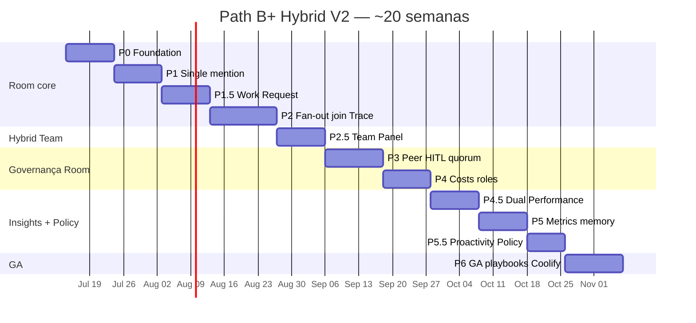
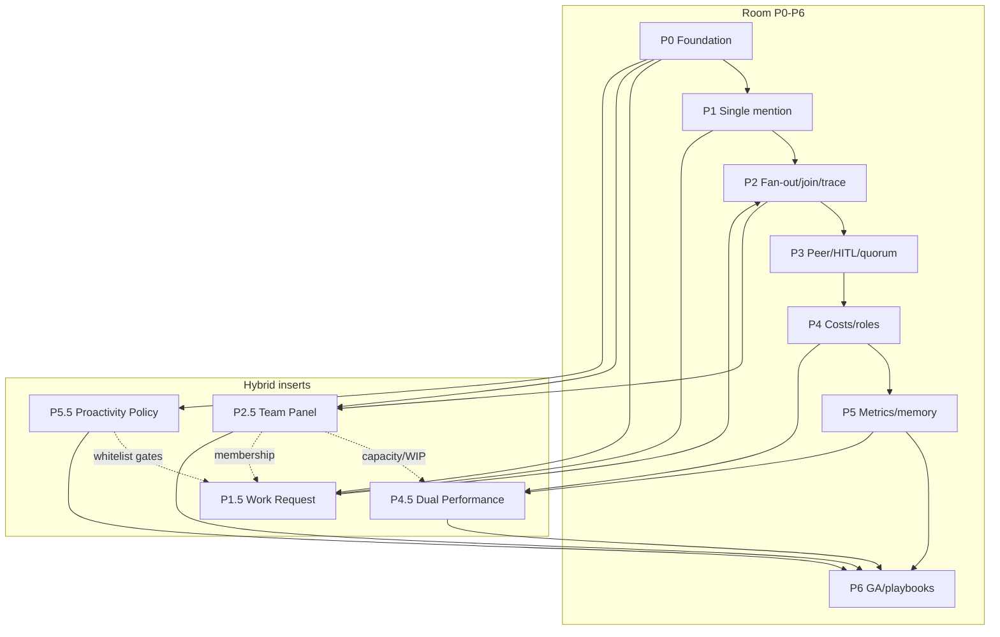

# Plano de Produto Canônico — Path B+ Hybrid V2

> **Ciclo:** 4C — Planning (lead planner #1)  
> **Data:** 2026-07-09  
> **Status:** **CANÔNICO** — supersede [`../cycle-4b-clickup-plan/00-PRODUCT-PLAN-HYBRID.md`](../cycle-4b-clickup-plan/00-PRODUCT-PLAN-HYBRID.md)  
> **Produto:** Path **B+** = Conference Room (Slack + `@agents` + A2A) **e** Hybrid Team & Performance  
> **Repo de implementação:** `QuadriniL/paperclip` (fork-only)  
> **BizCursor desktop:** **pausado** (cherry-pick seletivo pós-GA, fora do caminho crítico)  
> **Beachhead:** Software Houses · **Secundário:** Support Ops · **Non-goals:** Marketing/ROAS, “80% autonomia”, Plane-style agent-as-assignee  
> **Ordem canônica de fechamento DoD (Cycle 3C gap matrix):**  
> `P0 → P1 → P1.5 → P2 → P2.5 → P3 → P4 → P4.5 → P5 → P5.5 → P6`  
> **Horizonte:** ~**20 semanas** até GA B+

`NotebookLM: skip (non-Villa) — Path B+ product plan (Paperclip/A2A research)`

---

## 0. Sumário executivo

Path **B+** não é “mais um chat com bots”. É o sistema de trabalho híbrido que o ClickUp deixou aberto: **sala multiplayer** (mentions + fan-out A2A + HITL) **e** **painel de time + performance dual** (humanos e agentes no mesmo canvas), com accountability humana explícita.

| Camada | O que entregamos | O que NÃO reinventamos |
|--------|------------------|------------------------|
| **Room** | Silent-until-@, `@` single/fan-out, join, Trace, peer/HITL, costs na bolha | Motor `run-delegation` + MCP (REUSE) |
| **Hybrid** | Work Request (Ask + assign-delegate), Team Panel, Dual Performance, Proactivity Policy | OrgChart/Agents/Access/Routines como fontes (REUSE + merge) |
| **Runtime** | Coolify-safe `adapter_wake` / `paperclipChatWake` | Spawn permanente de `claude` CLI (FORBIDDEN em GA) |

**Vendemos:** ciclo de trabalho auditável entre humanos e agentes — quem pediu, quem é owner, quem executa, quanto custa ($ + intervenção), quanto tempo o ciclo híbrido leva — na superfície Board do fork.

**Não vendemos:** autonomia 80%, “substitui o time”, ROAS mágico, agent washing, clone de AI Hub, ambient Autopilot no stream da Room, nem Plane-style “agente = assignee único”.

### 0.1 Por que V2 (4C) supersede 4B

| Aspecto | Cycle 4B | Cycle 4C V2 (este doc) |
|---------|----------|------------------------|
| Ordem de fases | P1 absorvia Work Request; P5 absorvia Dual; P6 absorvia policy | Inserts explícitos **P1.5 / P2.5 / P4.5 / P5.5** (SPECs 5B + gap 3C) |
| Evidência | Cycle 1B + 4 | **Cycle 2C CONFIRMED** + **3C deep dive** como âncora |
| Fechamento DoD | Gantt simplificado | Ordem §3.3 da [`05-implementation-gap-matrix.md`](../cycle-3c-hybrid-deep-dive/05-implementation-gap-matrix.md) |
| Decisões D-09…D-13 | Travadas com rationale 1B | **LOCKED** com **citações Cycle 2C** (quotes/grades) |

Agentes de implementação e Cycle 5C devem tratar **este arquivo** como plano de produto autoritativo. O 4B permanece histórico.

### 0.2 Veredito de pesquisa (1 frase)

> Motor A2A já existe no fork; o gap #1 é **BUILD** `room-orchestrator` + human-delegate bridge; o diferencial comercial é **unificar** roster AI Hub-like + Workload-like (D-13) com performance **fora** do stream (D-11) e owner humano sempre visível (D-12).

---

## 1. Contexto e artefatos âncora

### 1.1 Cadeia de evidência

```
Cycle 1C Discovery  →  Cycle 2C Confirmation (CONFIRMED only)  →  Cycle 3C Deep Dive
                                                                      ↓
                                                              Cycle 4C Plan (este doc)
                                                                      ↓
                                                              Cycle 5 / 5B SPECs (já existem; 5C se necessário)
```

### 1.2 Links obrigatórios (Cycle 1C–3C)

| Ciclo | Artefato | Uso neste plano |
|-------|----------|-----------------|
| **1C** | [`../cycle-1c-hybrid-discovery/00-INDEX.md`](../cycle-1c-hybrid-discovery/00-INDEX.md) | Catálogos; hipóteses iniciais |
| **1C** | [`../cycle-1c-hybrid-discovery/03-paperclip-fork-capability-catalog.md`](../cycle-1c-hybrid-discovery/03-paperclip-fork-capability-catalog.md) | Paths REUSE/ADAPT/BUILD |
| **1C** | [`../cycle-1c-hybrid-discovery/04-dual-performance-sources.md`](../cycle-1c-hybrid-discovery/04-dual-performance-sources.md) | Fontes métricas |
| **1C** | [`../cycle-1c-hybrid-discovery/05-verticals-hybrid-panel-sources.md`](../cycle-1c-hybrid-discovery/05-verticals-hybrid-panel-sources.md) | Fontes beachhead |
| **2C** | [`../cycle-2c-hybrid-confirmation/00-INDEX.md`](../cycle-2c-hybrid-confirmation/00-INDEX.md) | R-01…R-10 · D-09…D-13 LOCKED · P0 metrics |
| **2C** | [`../cycle-2c-hybrid-confirmation/01-clickup-claims-confirm.md`](../cycle-2c-hybrid-confirmation/01-clickup-claims-confirm.md) | 8/8 ClickUp |
| **2C** | [`../cycle-2c-hybrid-confirmation/02-competitor-hitl-confirm.md`](../cycle-2c-hybrid-confirmation/02-competitor-hitl-confirm.md) | Linear D-12 · Plane anti-padrão |
| **2C** | [`../cycle-2c-hybrid-confirmation/03-fork-code-confirm.md`](../cycle-2c-hybrid-confirmation/03-fork-code-confirm.md) | 9 CONFIRMED · bridge/auth |
| **2C** | [`../cycle-2c-hybrid-confirmation/04-dual-performance-confirm.md`](../cycle-2c-hybrid-confirmation/04-dual-performance-confirm.md) | P0 metric set |
| **2C** | [`../cycle-2c-hybrid-confirmation/05-verticals-confirm.md`](../cycle-2c-hybrid-confirmation/05-verticals-confirm.md) | Beachhead LOCK |
| **3C** | [`../cycle-3c-hybrid-deep-dive/00-INDEX.md`](../cycle-3c-hybrid-deep-dive/00-INDEX.md) | Síntese + ordem canônica |
| **3C** | [`../cycle-3c-hybrid-deep-dive/01-hybrid-team-panel-ux.md`](../cycle-3c-hybrid-deep-dive/01-hybrid-team-panel-ux.md) | P2.5 UX |
| **3C** | [`../cycle-3c-hybrid-deep-dive/02-human-work-request-flows.md`](../cycle-3c-hybrid-deep-dive/02-human-work-request-flows.md) | P1.5 flows |
| **3C** | [`../cycle-3c-hybrid-deep-dive/03-dual-performance-panels.md`](../cycle-3c-hybrid-deep-dive/03-dual-performance-panels.md) | P4.5 panels |
| **3C** | [`../cycle-3c-hybrid-deep-dive/04-proactivity-governance.md`](../cycle-3c-hybrid-deep-dive/04-proactivity-governance.md) | P5.5 policy |
| **3C** | [`../cycle-3c-hybrid-deep-dive/05-implementation-gap-matrix.md`](../cycle-3c-hybrid-deep-dive/05-implementation-gap-matrix.md) | REUSE/ADAPT/BUILD + DAG |
| **5** | [`../cycle-5-tech-specs/`](../cycle-5-tech-specs/) | SPECs Room P0–P6 |
| **5B** | [`../cycle-5b-clickup-tech-specs/`](../cycle-5b-clickup-tech-specs/) | SPECs Hybrid P1.5/P2.5/P4.5/P5.5 |
| **Histórico** | [`../cycle-4b-clickup-plan/00-PRODUCT-PLAN-HYBRID.md`](../cycle-4b-clickup-plan/00-PRODUCT-PLAN-HYBRID.md) | Superseded |
| **Sala base** | [`../cycle-4-plan/00-PRODUCT-PLAN.md`](../cycle-4-plan/00-PRODUCT-PLAN.md) | Path B sala (herdado) |

### 1.3 Decisões herdadas (D-01…D-08) — ainda válidas

| ID | Decisão | Status |
|----|---------|--------|
| **D-01** | Path **B** — Slack + `@agents` (base da Room) | Travada |
| **D-02** | Fork-only `QuadriniL/paperclip` | Travada |
| **D-03** | A2A fan-out = app-level (não reinventar protocolo) | Travada |
| **D-04** | Reusar `run-delegation` + MCP `paperclipDelegate` + `wait:false` / `waitAllSec` | Travada |
| **D-05** | Beachhead Software Houses; Support secundário; Marketing ≠ beachhead | Travada (reconfirmada 2C) |
| **D-06** | Default SAS → cascade MAS; paralelo só com join/quorum explícito | Travada |
| **D-07** | Humano owner sempre visível; silent-until-@ | Travada (refinada em D-10/D-12) |
| **D-08** | Wake Coolify-safe (`adapter_wake` / `paperclipChatWake`) | Travada |

---

## 2. Decision Log D-09…D-13 — LOCKED (citações Cycle 2C)

> Regra: só **CONFIRMED** (ou PARTIAL com caveat explícito) sustenta decisão. REFUTED / FLUFF não entram no roadmap.

### 2.1 Tabela LOCKED

| ID | Decisão | Status | Âncora Cycle 2C |
|----|---------|--------|-----------------|
| **D-09** | Path **B+**: Conference Room **+** Hybrid Team & Performance (não só chat) | **LOCKED** | INDEX 2C + ClickUp 8/8 + gap AI Hub≠Workload + R-03/R-10 |
| **D-10** | Room = **silent-until-@**; proatividade **governada** (whitelist) **fora** do stream | **LOCKED** | ClickUp Autopilot≠Super (R-02) + routines REUSE (C10) + verticals anti-spam |
| **D-11** | Performance / insights **fora do stream** (Team / Insights); dual Humano \| Agente \| Room | **LOCKED** | Dual metrics P0 (04-confirm) + R-09 |
| **D-12** | **Assign-as-delegate**: humano = **owner**; agente = **delegate** (nunca Plane-style) | **LOCKED** | Linear CONFIRMED (02-competitor) + Plane = anti-padrão |
| **D-13** | Roster AI Hub-like + Workload-like **unificados** no mesmo produto | **LOCKED** | ClickUp Claim gap + C2-D4-01 + R-03 |

### 2.2 D-09 — Path B+ (Room + Hybrid)

**Decisão:** O produto GA é a **união** da Conference Room e das superfícies Hybrid Team & Performance. Entregar só a sala = Path B incompleto; entregar só o painel sem Room = sem intake multiplayer.

**Citações / grades Cycle 2C:**

- INDEX 2C: `D-09 Path B+ | LOCKED`; requisitos R-01…R-10 promovidos.  
- ClickUp 8/8 CONFIRMED (`01-clickup-claims-confirm.md`): AI as teammate (`@` / assign / Ask), AI Hub, Workload — mas **não** unificados.  
- Verticals (`05-verticals-confirm.md`): beachhead SE precisa **painel híbrido** + pedido fácil, não só chat.  
- Fork (`03-fork-code-confirm.md`): motor A2A REUSE; room-orchestrator / Hybrid UI = BUILD → justifica escopo B+.

**Implicação de roadmap:** inserts P1.5 / P2.5 / P4.5 / P5.5 são **first-class**, não “nice-to-have” pós-GA.

### 2.3 D-10 — Silent-until-@ + proatividade governada

**Decisão:** Na Conference Room, mensagem **sem** `@` (e sem Ask/assign explícito) → **0** wakes. Proatividade (routines, cron, webhooks, Autopilot-like) vive **fora** do stream, sob whitelist (`proactivity-policy` em P5.5).

**Citações / grades Cycle 2C:**

- R-02 INDEX: “Autopilot ≠ Super → Room silent-until-@; routines fora”.  
- ClickUp: Super Agents via `@mention` / assign / schedule; Autopilot ambient **não** é o modelo da Room.  
- Fork C10 CONFIRMED: routines/cron/webhook existem; **sem** `proactivity-policy` unificado → BUILD em P5.5.  
- Verticals anti-hype: ambient spam correlaciona com cancelamento (Gartner PARTIAL útil como messaging; silent é requisito de produto).

**Implicação:** P0 documenta e enforce a regra; P5.5 fecha o editor de policy; P6 anti-washing proíbe claim “Autopilot na sala”.

### 2.4 D-11 — Performance fora do stream

**Decisão:** Stream da Room = narrativa (mensagens, cards HITL, cost pill por hop). KPIs de capacidade, cycle time, avg cost, co-touch, interventions → **Team / Insights / Dual Performance**, nunca vanity widgets no hero do chat.

**Citações / grades Cycle 2C:**

- R-09 INDEX + P0 Dual Metrics table.  
- `04-dual-performance-confirm.md` §4 — P0 metric set **somente CONFIRMED**:

| Lane | Métricas P0 |
|------|-------------|
| **Human** | Cycle Time p50 · Capacity load |
| **Agent** | Avg Cost/job · Jobs in Progress · Intervention count |
| **Room** | Hybrid Cycle Time · Co-touch rate |

- **OUT:** ROAS, #agents vanity, TTFT até telemetria madura, “80% autonomia”, Collab Score acadêmico como KPI de produto.

**Implicação:** P2.5 = capacity **agora**; P4.5 = trends dual; Room nunca vira dashboard.

### 2.5 D-12 — Assign-as-delegate (owner humano + delegate agente)

**Decisão:** Todo trabalho durável com agente tem `ownerUserId` (humano) + `delegateAgentId` (agente). Agente **nunca** é o único dono. Plane-style “agent as assignee / step in as owners” = **anti-padrão** explícito.

**Citações / grades Cycle 2C:**

- `02-competitor-hitl-confirm.md`: Linear docs + API `delegate` + AIG → **CONFIRMED**; Plane Claim 8 CONFIRMED como contraste a **evitar**.  
- Quote Linear (re-citada em verticals):  
  > “Agents are not traditional assignees… the human teammate remains responsible for its completion.”  
- R-04 INDEX; R-06: Human NÃO POST delegate → bridge server-side (fork C2 CONFIRMED: `POST .../delegate` agent-only).

**Implicação:** P1.5 persiste owner+delegate; bridge P1–P2 nunca expõe run JWT ao browser (FORBIDDEN).

### 2.6 D-13 — Roster + Workload unificados

**Decisão:** Um painel **Team** com roster `human | agent` e capacity lanes no **mesmo** canvas — fechar o gap ClickUp AI Hub (só AI) ≠ Workload (só humano).

**Citações / grades Cycle 2C:**

- C2-D4-01 **CONFIRMED**: AI Hub colunas Avg Cost / # Jobs / Jobs in Progress; Workload capacity humana green/yellow/red; **sem** unificação documental.  
- Verticals C5 **CONFIRMED**: gap = oportunidade Path B+.  
- R-03 INDEX: “Unificar roster AI Hub-like + Workload-like”.

**Implicação:** P2.5 é fase de produto (não refactor cosmético de OrgChart); Agents/Access continuam existindo; Team **agrega**.

### 2.7 Requisitos promovidos (R-01…R-10) → fases

| ID | Requisito | Fase(s) primária(s) |
|----|-----------|---------------------|
| R-01 | AI as teammate: `@` / assign / Ask | P1, P1.5 |
| R-02 | Autopilot ≠ Super; silent-until-@; routines fora | P0, P5.5 |
| R-03 | Roster + Workload unificados | P2.5 |
| R-04 | Owner humano + delegate agente | P1.5 |
| R-05 | Anyone-can-@ / steer no thread (acessibilidade) | P1, P3 |
| R-06 | Human NÃO POST delegate → bridge server-side | P1–P2, P1.5 |
| R-07 | Mentions no composer; mention ≠ A2A join | P1, P2 |
| R-08 | Motor A2A REUSE; room-orchestrator BUILD | P1–P2 |
| R-09 | Dual performance fora do stream | P4.5 (inputs P4/P5) |
| R-10 | Beachhead Software Houses | Todas (cenários DoD) |

---

## 3. Roadmap visual e timeline ~20 semanas

### 3.1 Ordem canônica (fechamento DoD)

```text
P0 Foundation
  └─► P1 Single @mention
        └─► P1.5 Work Request (Ask / assign-delegate)
              └─► P2 Fan-out / Join / Trace / bridge
                    └─► P2.5 Hybrid Team Panel
                          └─► P3 Peer wait / HITL / quorum
                                └─► P4 Costs / roles / density
                                      └─► P4.5 Dual Performance
                                            └─► P5 Room metrics / memory spike
                                                  └─► P5.5 Proactivity Policy
                                                        └─► P6 GA / Coolify / playbooks
```

**Justificativa (gap matrix §3.3):**

1. **P1.5 antes de P2** — beachhead SH precisa Ask sem esperar fan-out.  
2. **P2.5 após P2** — lanes “busy” e deep-links de Trace ficam honestos.  
3. **P4.5 após P4 + P5** — dual sem telemetria é vanity.  
4. **P5.5 perto de P6** — policy + anti-washing fecham o claim de proatividade.

### 3.2 Gantt (~20 semanas)



> Notas: (1) dias corridos de calendário ≈ semanas úteis comprimidas; buffer de integração incluso nas estimativas de fase abaixo. (2) Paralelismo **seguro** (skeleton P2.5 ∥ P1 após P0; schema P5.5 cedo) **não** antecipa fechamento de DoD — ver gap matrix §3.2.

### 3.3 Tabela resumo

| Fase | Nome | Duração | Valor (1 linha) | Deps hard |
|------|------|---------|-----------------|-----------|
| **P0** | Foundation | **~1,5 sem** | Flag + silent + agents + plano Coolify-safe | — |
| **P1** | Single `@mention` | **~1,5 sem** | Sofia `@CEO` → 1 wake orquestrado | P0 |
| **P1.5** | Work Request | **~1,5 sem** | Ask + owner/delegate sem decorar slug | P0, P1 |
| **P2** | Fan-out / Join / Trace | **~2 sem** | `@A @B` + bridge + Trace | P1 (soft: P1.5) |
| **P2.5** | Hybrid Team Panel | **~1,5 sem** | Roster + lanes humano\|agente | P0, P2 |
| **P3** | Peer / HITL / quorum | **~1,5–2 sem** | Approvals no thread; quorum opt-in | P2 |
| **P4** | Costs / roles | **~1,5 sem** | Cost pill hop/session; density | P3 |
| **P4.5** | Dual Performance | **~1,5 sem** | Dashboard dual fora do stream | P4, P5-R* |
| **P5** | Metrics / memory | **~1,5 sem** | Métricas Room must; spike PARA | P4 |
| **P5.5** | Proactivity Policy | **~1 sem** | Whitelist; Room sem ambient | P0 (+ routines) |
| **P6** | GA / playbooks | **~1,5–2 sem** | Coolify checklist + anti-washing | P2.5, P4.5, P5.5, Room |

\*P4.5 na ordem canônica fecha **após** P5 ter métricas Room; skeleton de UI Dual pode rascunhar após P4.

**Horizonte total:** **~18–22 semanas** (alvo de planejamento **20**).

---

## 4. Personas e superfícies

| Persona | Precisa | Superfície | Densidade |
|---------|---------|------------|-----------|
| **Operator / Sofia** | Narrativa, Ask, cards, digest, gestão leve do time | Room + Team (ops) | Baixa–média |
| **EM / Board** | Carga humano+AI, $/job, interventions, dual KPIs | Team + Insights + Room expand | Alta |
| **Humano IC** | Pedir trabalho, owner badge, steer no thread | Room / issue | Baixa |
| **Agente** | Prompt + contexto + tools + run identity | Runtime adapters | N/A |

**Superfície única de produto:** Board Web Paperclip (fork).  
**BizCursor Tauri:** fora do caminho crítico B+.

---

## 5. Fases detalhadas (P0 → P6 com inserts)

Cada fase: **Goal · Value · Deps · Escopo · Fora · DoD (checkboxes) · Métricas · Duração · SPEC**.

---

### P0 — Foundation (Room)

**Duração estimada:** ~1,5 semanas (10 dias úteis)  
**SPEC:** [`../cycle-5-tech-specs/P0-foundation-SPEC.md`](../cycle-5-tech-specs/P0-foundation-SPEC.md)

#### Goal
Estabelecer Conference Room experimental: flag, auth, agentes listáveis, baseline 1:1 Board↔concierge, **política silent-until-@ normativa**, e plano escrito de migração `claude` CLI → `adapter_wake`.

#### Value
Sem P0, qualquer `@` ou Team Panel vira spam de custo — padrão associado a cancelamento de projetos agentic. Fundação obrigatória para B+.

#### Deps
- Nenhuma fase B+ anterior.  
- REUSE: `enableConferenceRoomChat`, `assertCompanyAccess`, Agents/Agent Cards, standing issue Board Operations.

#### Escopo funcional
- Flag Conference Room (off prod / on staging).  
- BoardChat 1:1 adaptável; documentar saída do spawn `claude`.  
- Silent-until-@ como regra de produto (enforce mínimo: 0 wakes sem `@` quando flag on + path Room).  
- Telemetria base: `mention_parsed`, `wake_skipped_silent`, `wake_attempted` (stubs ok).  
- `room-policy` caps: design doc / env-only aceitável; serviço completo pode adiar a P2.

#### Fora de escopo
- Fan-out, Ask button, Team Panel, Dual Performance, proatividade ambient.  
- BizCursor desktop.

#### Definition of Done
- [ ] Flag off → comportamento legado inalterado (smoke Coolify/staging).  
- [ ] Flag on + mensagem sem `@` → **0** heartbeat/agent wakes na Room.  
- [ ] Agentes da company listáveis (API/UI) para autocomplete futuro.  
- [ ] Standing issue / sala persistente identificável.  
- [ ] Plano escrito de migração `claude` spawn → `paperclipChatWake` / `adapter_wake` (PR-F3).  
- [ ] Runbook P0 no fork; smoke ST-P0 verde.

#### Success metrics
| Métrica | Alvo |
|---------|------|
| False wakes (sem `@`) | **0** |
| Incidentes de deploy pela flag | **0** |

#### Vertical (beachhead)
`#eng-bugs`: posts humanos sem `@` não acordam AI — EM confia na sala.

---

### P1 — Single `@mention` + silent-until-@ + human owner

**Duração estimada:** ~1,5 semanas  
**SPEC:** [`../cycle-5-tech-specs/P1-single-mention-SPEC.md`](../cycle-5-tech-specs/P1-single-mention-SPEC.md)

#### Goal
Sofia `@CEO` na Room → **um** wake orquestrado (não ambient); composer com mentions; owner humano explícito na thread; mention ≠ join A2A.

#### Value
Primeiro aha multiplayer. Sem single-mention confiável, Ask (P1.5) e fan-out (P2) não têm base.

#### Deps
- **Hard:** P0.  
- REUSE: `agent://` chips, MarkdownEditor/MentionOption.  
- ADAPT: ChatComposer → mentions.  
- BUILD: subset `room-orchestrator` single-wake + human post → wake server-side.

#### Escopo funcional
- Composer Room com `@` autocomplete.  
- Single-mention orchestrator (1 agente).  
- Skill sala: silent-until-@ + single wake (ADAPT skill board).  
- Human owner na thread (prepara D-12).  
- Não usar `issue_comment_mentioned` como fan-out (PR-F5).

#### Fora de escopo
- `@A @B` (P2); Ask UI completa (P1.5); Team Panel; quorum.

#### Definition of Done
- [ ] `@ceo` / `@dev` → exatamente **1** wake do agente nomeado.  
- [ ] Mensagem sem `@` → 0 wakes (regressão P0).  
- [ ] `@inexistente` → erro UX, sem wake.  
- [ ] Composer exibe chips/mentions.  
- [ ] Concierge não “rouba” a resposta do agente nomeado no path Room.  
- [ ] Testes: mention wake ≠ criação de join A2A.  
- [ ] Smoke ST-P1 verde; ≥5 threads SE em staging.

#### Success metrics
| Métrica | Alvo (piloto 2 sem) |
|---------|---------------------|
| Threads com wake real | ≥ **20** |
| Mediana time-to-first-agent-message | < **90s** |
| NPS tech leads (1–5) | ≥ **4** (n≥5) |

#### Vertical
EM: `@triage` em bug “checkout 500” → first triage estruturado.

---

### P1.5 — Work Request (Hybrid insert)

**Duração estimada:** ~1,5 semanas  
**SPEC:** [`../cycle-5b-clickup-tech-specs/P1.5-work-request-SPEC.md`](../cycle-5b-clickup-tech-specs/P1.5-work-request-SPEC.md)  
**Design:** [`../cycle-3c-hybrid-deep-dive/02-human-work-request-flows.md`](../cycle-3c-hybrid-deep-dive/02-human-work-request-flows.md)

#### Goal
Qualquer member dispara pedido à IA **sem** decorar slug: botão **Ask / Pedir**, templates beachhead, **assign-as-delegate** (D-12) com owner≠delegate; bridge sempre server-side (R-06).

#### Value
Cycle 2C: “pedido fácil” = stack `@` + Ask + assign-delegate. Sem P1.5, Room compete mal com Linear/ClickUp no intake — beachhead SH falha no GTM.

#### Deps
- **Hard:** P0, P1.  
- **Soft:** P2.5 membership (pode usar Agents+Access); P5.5 whitelist (Ask ≠ ambient).  
- REUSE: Agents list, issue-assignment-wakeup.  
- BUILD: Ask UI, templates, persist owner+delegate.  
- FORBIDDEN: browser JWT / `POST delegate` com actor board.

#### Escopo funcional
- CTA Ask no composer e/ou issue → picker → template opcional → wake.  
- Persist `ownerUserId` + `delegateAgentId`; UI mostra ambos.  
- ≥5 templates Software House (+ Support leve): triage bug, implement spec, review draft, etc.  
- Anyone-can-Ask no canal (R-05), sujeito a membership.

#### Fora de escopo
- Fan-out multi-agente no modal Ask (P2).  
- Ambient Autopilot.  
- Plane-style agent-as-owner.

#### Definition of Done
- [ ] Ask → picker → 1 wake; owner humano gravado.  
- [ ] Assign-delegate: owner humano + delegate agente ambos visíveis.  
- [ ] Agente nunca persiste como único dono (validator).  
- [ ] 0 chamadas `POST .../delegate` a partir do browser (assert network/smoke).  
- [ ] ≥5 templates SE; flag feature Work Request.  
- [ ] Smoke ST-P15 verde.  
- [ ] Doc messaging: sem SWE-Bench 90%; cita nuance METR se falar produtividade.

#### Success metrics
| Métrica | Alvo |
|---------|------|
| % wakes via Ask (vs só digitar `@`) | ≥ **30%** |
| % issues com owner+delegate | ≥ **50%** das delegações P1.5 |

#### Vertical
Sofia owner + `@coder` delegate em issue “implemente spec”; Support: Ask `@triage-support` com owner = lead.

---

### P2 — Fan-out `@A @B` + join + bridge + DelegationTrace

**Duração estimada:** ~2 semanas  
**SPEC:** [`../cycle-5-tech-specs/P2-fanout-join-SPEC.md`](../cycle-5-tech-specs/P2-fanout-join-SPEC.md)

#### Goal
`@A @B` → fan-out A2A (`wait:false`) + join (`waitAllSec`); human-delegate bridge (agent-of-record); DelegationTrace UI; runtime Coolify **sem** depender de `claude` CLI.

#### Value
Diferencial vs chatbot-com-mentions. Desbloqueia spikes SE. Alimenta lanes “busy” do P2.5 com runs reais. Gap #1 do fork (C9) fecha aqui.

#### Deps
- **Hard:** P1 (orchestrator single).  
- **Soft-recomendado:** P1.5 (intake maduro).  
- REUSE: `run-delegation`, MCP, GET delegation, heartbeat child completed.  
- BUILD: room-orchestrator fan-out, board-room API, bridge, DelegationTrace UI, room-policy caps.  
- DEBT: teste integration `waitAllSec` no mesmo PR do bridge.

#### Escopo funcional
- Multi-mention → N children + parentRunId.  
- Bridge: Human board session → POST room message → orchestrator → delegateFromRun (agent identity).  
- Trace 100% children; timeout visível.  
- Soft warning de custo N agentes no composer.  
- ADAPT definitivo off `claude` spawn no path Room remoto.

#### Fora de escopo
- Quorum N-of-M (P3); Dual Performance; drag workload.

#### Definition of Done
- [ ] `@A @B` → 2 children + join ok / timeout UX.  
- [ ] Trace lista 100% dos children; IDs batem com API.  
- [ ] Humano **nunca** chama delegate no browser (smoke + code review).  
- [ ] Staging remoto **não** depende de CLI `claude` no path crítico.  
- [ ] Teste `waitAllSec` adicionado ou issue DEBT com owner + data.  
- [ ] ST SH-2 (3 agentes) staging; smoke ST-P2 verde.  
- [ ] Zero heurística “detect delegation no texto do modelo”.

#### Success metrics
| Métrica | Alvo |
|---------|------|
| Join ok / tentativas | ≥ **85%** |
| Threads SH com fan-out | ≥ **10** |
| % traces completos | **100%** |

#### Vertical
SH-2: `@researcher @coder @security` em spike OAuth; EM acompanha Trace.

---

### P2.5 — Hybrid Team Panel (Hybrid insert)

**Duração estimada:** ~1,5 semanas  
**SPEC:** [`../cycle-5b-clickup-tech-specs/P2.5-hybrid-team-panel-SPEC.md`](../cycle-5b-clickup-tech-specs/P2.5-hybrid-team-panel-SPEC.md)  
**Design:** [`../cycle-3c-hybrid-deep-dive/01-hybrid-team-panel-ux.md`](../cycle-3c-hybrid-deep-dive/01-hybrid-team-panel-ux.md)

#### Goal
Aba **Team**: roster unificado humanos+agentes + capacity lanes (D-13); status; deep-link Ask/Room/Trace; **sem** widgets de performance no stream (D-11).

#### Value
Gap ClickUp confirmado: AI Hub ≠ Workload. Este é o diferencial B+ vendável ao EM: “quem está carregado — pessoas e agentes — agora?”

#### Deps
- **Hard:** P0 (agents + members).  
- **Hard para DoD honesto:** P2 (runs/Trace alimentam “busy”).  
- REUSE: Agents, OrgChart, ActiveAgents, CompanyAccess, memberships, company-members.  
- BUILD: roster merge API + Hybrid Team UI + lanes v1 + Ask-on-row.

#### Escopo funcional
- Rota `/company/:id/team`; flag `enableHybridTeamPanelV1`.  
- Roster `kind: human | agent`.  
- Lanes humanas: WIP / capacity load (heurística v1).  
- Lanes agentes: Jobs in Progress, avg cost se disponível, interventions se já instrumentado.  
- Deep-link lane → Room/thread/run; Ask-on-row → P1.5.  
- Filtros canal/role/status; empty states.

#### Fora de escopo
- Dual Performance charts completos (P4.5).  
- Drag-and-drop workload (DEFER).  
- Substituir/deletar páginas Agents ou CompanyAccess no dia 1.  
- Autopilot ambient na Room.

#### Definition of Done
- [ ] Team lista ≥1 humano + ≥1 agente do company staging.  
- [ ] Lane humana mostra WIP/capacity (0 ok se vazio).  
- [ ] Lane agente mostra runs running/queued alinhadas à API.  
- [ ] Click lane agente → run/thread correto.  
- [ ] Ask-on-row abre fluxo P1.5.  
- [ ] Stream/Room **não** ganha widgets de performance.  
- [ ] Smoke SE: EM “quem está saturado?” em < **60s**.  
- [ ] Smoke ST-P25 verde.

#### Success metrics
| Métrica | Alvo |
|---------|------|
| Tempo EM “quem está livre?” | < **60s** |
| % agentes membership no roster | **100%** |

#### Vertical
EM abre Team antes de pedir spike: Sofia 4/5 WIP; `@coder` 2/2 jobs; `@triage` idle.

---

### P3 — Peer wait, HITL, quorum

**Duração estimada:** ~1,5–2 semanas  
**SPEC:** [`../cycle-5-tech-specs/P3-peer-wait-hitl-SPEC.md`](../cycle-5-tech-specs/P3-peer-wait-hitl-SPEC.md)

#### Goal
Peer wait event-driven; cards `input-required` / approvals na Room; `join: "all" | "quorum"` opt-in documentado; política de turns leve (não port Magentic-One).

#### Value
Enterprise-safe: humano no loop sem sair do thread. Reduz “agente solto” — antídoto a agent washing.

#### Deps
- **Hard:** P2 (join/barrier).  
- REUSE: heartbeat `delegation_child_completed`, issue-thread-interactions.  
- BUILD: quorum opt-in; HITL cards UX na sala.

#### Escopo funcional
- Peer wait sobre children.  
- HITL cards na Room (approve / reject / comment).  
- Quorum N-of-M documentado + flag.  
- Anyone-can-steer no thread Room (R-05), com caps de role se necessário.

#### Fora de escopo
- Port de frameworks multi-agent acadêmicos como runtime.  
- Dual Performance.

#### Definition of Done
- [ ] Peer wait: child complete → parent retoma sem busy-poll destrutivo.  
- [ ] Card `input-required` bloqueia progresso até ação humana.  
- [ ] Quorum opt-in: doc + smoke mínimo.  
- [ ] Smoke ST-P3 verde.  
- [ ] Owner humano permanece visível durante HITL (D-12).

#### Success metrics
| Métrica | Alvo |
|---------|------|
| % threads HITL resolvidos < 24h (piloto) | ≥ **70%** |
| False auto-approve | **0** |

#### Vertical
Security gate humano no join de spike OAuth; Support: limiar $ exige card.

---

### P4 — Costs / roles / density

**Duração estimada:** ~1,5 semanas  
**SPEC:** [`../cycle-5-tech-specs/P4-costs-roles-SPEC.md`](../cycle-5-tech-specs/P4-costs-roles-SPEC.md)

#### Goal
Cost pill por hop e por session na Room; alertas 80/100 budget na superfície Room; densidade Operator vs Board; **sem** ledger paralelo.

#### Value
ROI honesto: $ agentic visível no contexto da narrativa (pill), agregações pesadas fora (D-11 / P4.5).

#### Deps
- **Hard:** P3 (hops estáveis).  
- REUSE: costs, budgets, finance, cost-metadata parsers.  
- BUILD: link room-message → cost; surface alerts.

#### Escopo funcional
- Pill $ por hop/session.  
- Alerts budget na Room.  
- Role density (Sofia vs Board).  
- Soft warning P2 vira hard budget onde aplicável.

#### Fora de escopo
- Dual dashboard completo (P4.5).  
- Segundo ledger de custos.  
- RH / PDI humano.

#### Definition of Done
- [ ] Pill por hop alinhada a cost-events.  
- [ ] Session rollup visível.  
- [ ] Alerta 80% e 100% budget na Room.  
- [ ] Board vê densidade maior que Operator sem quebrar a11y.  
- [ ] Smoke ST-P4 verde.  
- [ ] Nenhum ledger paralelo introduzido.

#### Success metrics
| Métrica | Alvo |
|---------|------|
| % hops com cost resolvido ou `pending` explícito | **100%** |
| Surpresas de budget sem alerta | **0** em piloto |

---

### P4.5 — Dual Performance (Hybrid insert)

**Duração estimada:** ~1,5 semanas  
**SPEC:** [`../cycle-5b-clickup-tech-specs/P4.5-dual-performance-SPEC.md`](../cycle-5b-clickup-tech-specs/P4.5-dual-performance-SPEC.md)  
**Design:** [`../cycle-3c-hybrid-deep-dive/03-dual-performance-panels.md`](../cycle-3c-hybrid-deep-dive/03-dual-performance-panels.md)

#### Goal
Dashboard Dual Performance com filtros **Humano \| Agente \| Room**, **fora do stream** (D-11); digest Sofia vs Board dense; métricas **somente** do P0 set CONFIRMED.

#### Value
Fecha o gap de insights: EM vê cycle/capacity humanos **e** cost/jobs/interventions agentes **e** hybrid cycle + co-touch — sem misturar em “score opaco”.

#### Deps
- **Hard:** P4 (costs).  
- **Hard:** P5 métricas Room (ordem canônica: P4.5 após P5 no fechamento; ver nota §3).  
- **Soft:** P2.5 capacity.  
- REUSE: Dashboard shell, productivity-review heuristics.  
- BUILD: insights dual + digests.

#### Escopo funcional — P0 metrics only
- Human: Cycle Time p50, Capacity load.  
- Agent: Avg Cost/job, Jobs in Progress, Intervention count.  
- Room: Hybrid Cycle Time, Co-touch rate.  
- Duas densidades: Sofia digest / Board dense.

#### Fora de escopo / anti-métricas
- ROAS, #agents vanity, TTFT como KPI primário, “80% autonomia”.  
- Productivity score único misturando humano+AI.  
- Claim de RH / performance humana absoluta.

#### Definition of Done
- [ ] Dashboard com 3 lanes filtráveis.  
- [ ] Cada métrica P0 tem definição operacional documentada (contrato Linear/Jira-style).  
- [ ] Stream da Room **sem** charts Dual.  
- [ ] Digest Sofia diário/semanal (mínimo semanal).  
- [ ] Copy anti-washing: “proxy de orquestração”, não “avaliação de pessoas”.  
- [ ] Smoke ST-P45 verde.

#### Success metrics
| Métrica | Alvo |
|---------|------|
| EM encontra Hybrid Cycle Time + Co-touch em < **30s** | Pass |
| Métricas OUT (ROAS/#agents) ausentes da UI | Pass |

---

### P5 — Room metrics + memory spike

**Duração estimada:** ~1,5 semanas  
**SPEC:** [`../cycle-5-tech-specs/P5-memory-metrics-SPEC.md`](../cycle-5-tech-specs/P5-memory-metrics-SPEC.md)

#### Goal
Instrumentação must: mentions, fan-out, join, $; cards no Dashboard; spike timeboxed de memória PARA com veredito GO/NO-GO explícito.

#### Value
Sem métricas Room, P4.5 é vanity e P6 não prova beachhead. Memória: só se o spike fechar; senão anti-claim.

#### Deps
- **Hard:** P4.  
- Pode paralelizar P5-A memory ∥ P5-B metrics (gap matrix).

#### Escopo funcional
- Contadores/eventos: mention, fan-out, join_ok, join_timeout, cost_session.  
- Surface Board.  
- Spike PARA (BizCursor F4 / fork TBD) ≤ timebox da fase.

#### Fora de escopo
- Vender memória se NO-GO.  
- Dual UI completa (P4.5).

#### Definition of Done
- [ ] Métricas must verdes em staging (dashboard ou export).  
- [ ] Spike memória: doc GO ou NO-GO com data.  
- [ ] Se NO-GO: checklist P6 proíbe claim de memória.  
- [ ] Smoke ST-P5 verde.

#### Success metrics
| Métrica | Alvo |
|---------|------|
| Cobertura eventos must | **100%** dos tipos listados no SPEC |
| Veredito memória | Explícito (GO/NO-GO) |

---

### P5.5 — Proactivity Policy (Hybrid insert)

**Duração estimada:** ~1 semana  
**SPEC:** [`../cycle-5b-clickup-tech-specs/P5.5-proactivity-policy-SPEC.md`](../cycle-5b-clickup-tech-specs/P5.5-proactivity-policy-SPEC.md)  
**Design:** [`../cycle-3c-hybrid-deep-dive/04-proactivity-governance.md`](../cycle-3c-hybrid-deep-dive/04-proactivity-governance.md)

#### Goal
Serviço + editor `proactivity-policy`: whitelist de trigger kinds; Room **nunca** recebe ambient; routines deep-link fora do chat; badge “proactive outside room” no Team (D-10).

#### Value
Honestidade de produto: proatividade existe (routines REUSE) sem transformar a sala em Autopilot spam — antídoto Gartner/agent washing.

#### Deps
- **Hard:** P0 silent + Routines REUSE.  
- Soft-gates Ask (P1.5) e membership (P2.5).  
- BUILD: policy JSON + editor.  
- FORBIDDEN: bridge routine → post ambient na Board Operations Room.

#### Escopo funcional
- Schema policy + UI editor Board.  
- Whitelist fechada; ambient kinds nunca allow na Room.  
- Deep-links para Routines UI.  
- Badge no roster P2.5 quando agente tem schedule ativo fora da Room.

#### Fora de escopo
- Autopilot “sempre ouvindo o canal”.  
- Novos trigger kinds sem ADR.

#### Definition of Done
- [ ] Policy JSON versionada por company.  
- [ ] Tentativa de ambient post na Room → bloqueada + log.  
- [ ] Routines existentes continuam fora do stream.  
- [ ] Editor acessível a Board; Operator read+enable limitado.  
- [ ] Smoke ST-P55 verde.  
- [ ] Doc Sofia: “Room silent; proatividade = Routines”.

#### Success metrics
| Métrica | Alvo |
|---------|------|
| Ambient posts na Room | **0** |
| % agentes com schedule visível no badge | **100%** dos que têm routine ativa |

---

### P6 — GA, Coolify, playbooks, anti-washing

**Duração estimada:** ~1,5–2 semanas  
**SPEC:** [`../cycle-5-tech-specs/P6-ga-playbooks-SPEC.md`](../cycle-5-tech-specs/P6-ga-playbooks-SPEC.md)

#### Goal
Graduar flag Conference Room + Hybrid surfaces; checklist Coolify (authenticated, sem `claude` CLI crítico); playbooks SH + Support; guia Sofia PT-BR; anti-washing checklist; Path B+ completo documentado.

#### Value
Oferta empacotável. Sem P6, B+ é demo local. Com P6, beachhead pode operar em staging/prod Coolify com honesty de claims.

#### Deps
- **Hard:** fechamento DoD de P2.5, P4.5, P5.5 + Room P0–P5 relevantes.  
- ADAPT: flag experimental → GA policy; deploy mode authenticated.

#### Escopo funcional
- Checklist Coolify verde.  
- Playbooks: Software Houses (primário), Support (secundário).  
- Guia Operator Sofia PT-BR.  
- Lista de claims **proibidos** no marketing/docs.  
- Hybrid GA: Team + Dual + Policy documentados.

#### Fora de escopo
- Marketing/ROAS playbooks.  
- BizCursor Room completa.  
- Novos adapters além de `cursor_cloud` / `opencode_local`.

#### Definition of Done
- [ ] Flag graduável (policy de default on para novos companies documentada).  
- [ ] Coolify checklist 100% verde (auth, adapters, sem CLI crítico).  
- [ ] Playbook SH + Support publicados no fork/docs.  
- [ ] Anti-washing: D-09…D-13 + claims proibidos no playbook.  
- [ ] Hybrid surfaces (Team, Dual, Policy) no guia Sofia.  
- [ ] Smoke ST-P6 verde.  
- [ ] Decisão memória (P5) refletida nos claims.

#### Success metrics
| Métrica | Alvo |
|---------|------|
| Checklist Coolify | **Pass** |
| Claims proibidos encontrados em docs GA | **0** |

---

## 6. Beachhead, secundário e non-goals

### 6.1 Beachhead — Software Houses (LOCKED)

**Perfil:** product-eng / software houses ≈10–80 pessoas; Slack + Linear/GitHub; EM + tech lead (Sofia) + ICs.

**Por quê (Cycle 2C verticals CONFIRMED):**
- Peng lab +55,8% task time (arXiv:2302.06590).  
- Demirer et al. +26,08% tasks (n=4.867).  
- UX nativa de pedido fácil (Linear delegate, Claude Tag multiplayer, ClickUp Super Agents em Software development).  
- Gap AI Hub ≠ Workload = dor de EM.

**DoD de beachhead (produto):**
1. Roster unificado + lanes.  
2. Ask / `@` / assign-as-delegate com owner humano.  
3. Fan-out + Trace auditável.  
4. Dual performance (percepção ≠ realidade — METR).

### 6.2 Secundário — Support Ops

**CONFIRMED:** Brynjolfsson +14% issues/hora; **mas** Zendesk Resolution Platform já vende suite híbrida CX.

**Estratégia:** expansão pós-beachhead — sala `#support-ops` / triage interno — **não** displace Zendesk WEM no P1 GTM.

### 6.3 Non-goals (explícitos)

| Non-goal | Motivo 2C |
|----------|-----------|
| Marketing / content / ROAS agents como beachhead | FLUFF; templates ≠ causal |
| Pitch “80% autonomia” / agente substitui time | METR −19%; SWE-Bench Pro ~23%; Zendesk 80% = vendor CX anti-exemplo |
| Plane-style agent-as-assignee único | Anti-padrão D-12 |
| Ambient Autopilot no stream da Room | D-10 |
| Segundo motor A2A / waiter | REUSE run-delegation |
| Expor run JWT ao browser | FORBIDDEN |
| Ledger de custo paralelo | REUSE costs |
| Drag-and-drop workload completo v1 | DEFER |
| Room completa no BizCursor Tauri agora | Produto no fork |
| Novos adapters além dos dois AGENTS.md | Escopo |
| Recruiting voice AI / consulting “agentic org” enterprise como beachhead | WEAK fit (lock 1C/2C) |
| Unificar capacity *só* humana estilo ClickUp | Valor = **híbrido** |

### 6.4 Mensagem de valor (lock)

> Vender **capacidade e accountability híbridas** (carga, $, HITL, quem pediu, quem é owner) — não autonomia mágica nem ROAS.

---

## 7. Anti-hype constraints (obrigatórias)

### 7.1 Evidência que trava o tom

| Fonte | Grade 2C | Tradução produto |
|-------|----------|------------------|
| Gartner >40% cancel + agent washing | PARTIAL (fatos OK; ban ROAS = inferência) | Messaging: value unclear + risk controls → nossos DoDs |
| METR −19% experts | CONFIRMED | Nunca “sempre mais rápido”; dual metrics + HITL |
| SWE-Bench Pro ~23% | CONFIRMED | Nunca “resolve qualquer ticket” |
| Peng/Demirer gains | CONFIRMED | Podem citar como *contexto de mercado*, não como garantia Paperclip |
| Claude Tag 65% PRs | PARTIAL | UX only — **nunca** no pitch como RCT |
| Zendesk “up to 80%” | Anti-exemplo | Proibido no playbook SH |

### 7.2 Regras de DoD / copy

1. **Escopo estreito por fase** — não “agentic org” no P0.  
2. **KPIs medidos** — só P0 metric set CONFIRMED no Dual; OUT listada no §2.4.  
3. **Human gate + owner sempre visível** (D-07, D-12).  
4. **Custo dual honesto** — $ agentic + intervention count (não só tokens).  
5. **Performance fora do chat** (D-11).  
6. **Sem claim** “substitui o EM / o time / 80% autonomia”.  
7. **Sem vanity** `# de agentes` como KPI de sucesso.  
8. **Sem ROAS** / marketing lift no beachhead.  
9. **Coolify real** — “funciona na minha máquina com Claude Code” ≠ evidência de fase.  
10. **Anti-washing checklist P6** — rebrand de chatbot ≠ agente; Trace + join + owner exigidos para chamar de A2A multiplayer.

### 7.3 Claims proibidos (copiar para playbook P6)

- [ ] “80% autonomia” / “resolve sozinho a operação”  
- [ ] “ROAS +X% com agentes de marketing”  
- [ ] “Substitui o time de engenharia”  
- [ ] “SWE-Bench state-of-the-art / 90%+”  
- [ ] “Autopilot na Conference Room”  
- [ ] “Agente é o assignee / dono do trabalho” (Plane-style)  
- [ ] “TTFT / #agents / tokens” como KPI primário de valor  
- [ ] “Memória enterprise” se P5 = NO-GO  

---

## 8. Arquitetura de entrega (gap view)

### 8.1 REUSE / ADAPT / BUILD (resumo)

| Tag | Exemplos Path B+ |
|-----|------------------|
| **REUSE** | `run-delegation`, MCP delegate/getDelegation, GET delegation board, Agents/Access/memberships, MarkdownEditor mentions, costs/budgets, routines/cron/webhook, `paperclipChatWake` adapters, flag Conference Room |
| **ADAPT** | BoardChat stream, ChatComposer, skill board→sala, deploy Coolify authenticated, alerts na Room, Dashboard cards |
| **BUILD** | `room-orchestrator`, human-delegate bridge, board-room API, DelegationTrace UI, Hybrid Team Panel, Dual Insights, `proactivity-policy`, Ask/templates, room-policy |
| **DEBT** | Teste `waitAllSec` |
| **FORBIDDEN** | JWT run no browser; ambient na Room; ledger paralelo; segundo waiter A2A; CLI-only GA |

### 8.2 Fluxo bridge (obrigatório)

```
Human (board session)
  → POST /api/board/rooms/.../messages  (BUILD)
  → room-orchestrator (BUILD)
  → heartbeat / delegateFromRun com identidade de agent run (REUSE)
  → children + waitAllSec (REUSE)
  → UI DelegationTrace via GET delegation (REUSE + BUILD UI)
```

### 8.3 DAG (mermaid)



### 8.4 Riscos críticos (herdados 3C)

| Risco | Severidade | Mitigação | Fase gate |
|-------|------------|-----------|-----------|
| Spawn `claude` no Coolify | Alta | ADAPT → adapter_wake | P2 DoD remoto; P6 GA |
| Bridge sem audit / fake agent | Alta | Agent-of-record + standing issue | P2 |
| Mention confundido com join | Alta | PR-F5 + testes ST-P2 | P1–P2 |
| Dual = “RH de humanos” | Alta | Copy proxy + anti-washing | P4.5 / P6 |
| Routines postam na Room | Alta | Policy whitelist | P5.5 |
| Assign clássico sem owner | Alta | Validators D-12 | P1.5 |
| waitAllSec flaky | Média | DEBT test | P2 |

---

## 9. Sprint mirror (fechamento)

| Sprint | Fases | Saída | Smoke |
|--------|-------|-------|-------|
| S0 | P0 → P1 | Flag + `@` single + composer | ST-P0 / ST-P1 |
| S0.5 | P1.5 | Ask + owner/delegate | ST-P15 |
| S1 | P2 | Bridge + fan-out + join + Trace | ST-P2 |
| S1.5 | P2.5 | Hybrid roster + lanes v1 | ST-P25 |
| S2 | P3 | Peer / HITL / quorum | ST-P3 |
| S3 | P4 → P4.5* | Cost pills + dual (*após P5-R) | ST-P4 / ST-P45 |
| S4 | P5 → P5.5 | Metrics + policy | ST-P5 / ST-P55 |
| S5 | P6 | Coolify GA + playbooks | ST-P6 |

\*Na ordem canônica estrita: P4 → **P4.5** → P5…; se P4.5 exigir métricas Room, fechar P5-R antes do DoD Dual (gap matrix). Skeleton Dual pode iniciar após P4.

---

## 10. Critérios de aceite do plano (Cycle 4C exit)

- [x] Path B+ definido (Room + Hybrid).  
- [x] D-09…D-13 LOCKED com citações Cycle 2C.  
- [x] Fases P0→P1→P1.5→P2→P2.5→P3→P4→P4.5→P5→P5.5→P6 com goal/value/deps/DoD/duração.  
- [x] Beachhead SE / Support secondary / non-goals.  
- [x] Anti-hype constraints + claims proibidos.  
- [x] Timeline ~20 semanas.  
- [x] Links Cycle 1C–3C + SPECs 5/5B.  
- [x] Supersede explícito do 4B.  
- [ ] Aprovação humana do plano antes de reabrir decisões.  
- [ ] Cycle 5C (se necessário) só para gaps de SPEC vs V2 — SPECs 5/5B já cobrem a maior parte.

---

## 11. Governança de mudanças

| Ação | Regra |
|------|-------|
| Reabrir D-01…D-13 | Exige ADR + re-confirmação Cycle 2-style |
| Adicionar métrica Dual | Só se CONFIRMED (ou PARTIAL com caveat + fora do P0 set) |
| Novo adapter | Proibido sem mudança AGENTS.md + ADR |
| Ambient na Room | Rejeitado por default (D-10) |
| Implementar no BizCursor desktop | Fora do caminho crítico até pós-GA fork |

**Audiência:**
- Product / founder — aprova este plano.  
- Agentes de implementação — seguem fases + SPECs; não reabrem D-09…D-13.  
- Cycle 5 writers — alinham RF/DoD a este V2 se houver drift vs 4B.

---

## 12. Apêndice A — Mapa claim 2C → fase

| Claim / PR | Grade | Fase |
|------------|-------|------|
| C1 fan-out `wait:false` | CONFIRMED (join PARTIAL test) | P2 |
| C2 POST delegate agent-only | CONFIRMED | P1–P2, P1.5 |
| C3 GET delegation board | CONFIRMED | P2, P4.5 |
| C4 claude CLI BoardChat | CONFIRMED | P0–P2, P6 |
| C5 ChatComposer vs MarkdownEditor | CONFIRMED | P1 |
| C6 mention ≠ join | CONFIRMED | P1–P2 |
| C7 MCP fan-out+join | CONFIRMED | P2 |
| C8 paperclipChatWake | CONFIRMED | P0–P2 |
| C9 sem room-orchestrator/trace | CONFIRMED | P1–P2 |
| C10 routines; sem policy | CONFIRMED | P5.5 |
| C2-D4-01…06 (métricas P0) | CONFIRMED subset | P2.5, P4.5 |
| Verticals beachhead SE | CONFIRMED | All / P6 playbooks |

---

## 13. Apêndice B — Comparativo 4B → 4C V2 (changelog de planejamento)

| Tema | 4B | 4C V2 |
|------|----|-------|
| Work Request | Dentro de P1 | **P1.5** explícito |
| Team Panel | P2.5 (ok) | P2.5 alinhado a 3C UX + DoD |
| Dual Performance | Dentro de P5 | **P4.5** após P4 (+ P5-R) |
| Proactivity | Dentro de P6 | **P5.5** |
| Ordem | P0→P1→P2→P2.5→P3→P4→P5→P6 | **P0→P1→P1.5→P2→P2.5→P3→P4→P4.5→P5→P5.5→P6** |
| Evidência D-09…D-13 | Rationale 1B | **Citações 2C** |
| Status | Extensão | **Canônico** |

---

## 14. Apêndice C — Checklist Operator Sofia (pré-GA)

- [ ] Sei o que é silent-until-@ e por que a Room não “responde sozinha”.  
- [ ] Consigo pedir trabalho via Ask sem decorar slug.  
- [ ] Vejo owner humano ≠ delegate agente.  
- [ ] Consigo ler DelegationTrace em fan-out.  
- [ ] Abro Team e identifico quem está saturado em < 1 min.  
- [ ] Sei que Dual Performance não é avaliação de RH.  
- [ ] Sei onde configurar routines (fora da Room).  
- [ ] Não prometo 80% autonomia ao cliente beachhead.

---

## 15. Próximos passos

1. **Aprovação humana** deste plano V2.  
2. Implementação via `subagent-driven-development` / `executing-plans` seguindo SPECs Cycle 5 + 5B na ordem canônica.  
3. Se drift SPEC↔V2: patch mínimo nas SPECs (Cycle 5C) — **não** reabrir research Cycles 1–3.  
4. Opcional: espelho agent-executable em `docs/superpowers/plans/` (writing-plans) **após** aprovação — este arquivo permanece canônico de produto.

---

## 16. Metadados do artefato

| Campo | Valor |
|-------|-------|
| **Path** | `docs/research/slack-a2a-room/cycle-4c-hybrid-plan/00-PRODUCT-PLAN-HYBRID-V2.md` |
| **Ciclo** | 4C Planning — lead planner #1 |
| **Idioma** | PT-BR |
| **Supersede** | `cycle-4b-clickup-plan/00-PRODUCT-PLAN-HYBRID.md` |
| **Ordem canônica** | P0→P1→P1.5→P2→P2.5→P3→P4→P4.5→P5→P5.5→P6 |
| **Horizonte** | ~20 semanas |
| **Repo código** | `QuadriniL/paperclip` |

---

*Fim do plano canônico Path B+ Hybrid V2.*
