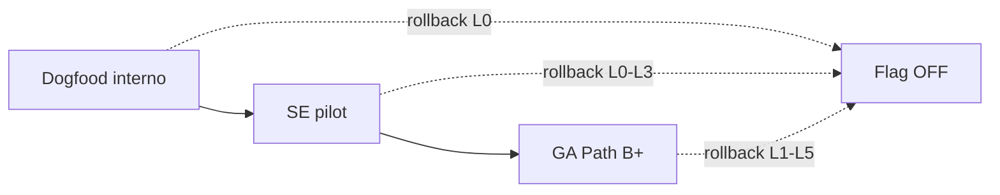

# Cycle 4C — Risks & Rollout (Fork Paperclip on Coolify)

> **Ciclo:** 4C — Hybrid planning  
> **Agente:** #4 risks & rollout  
> **Data:** 2026-07-09  
> **Escopo:** Deploy do fork `QuadriniL/paperclip` em Coolify (`deploymentMode: authenticated`) para Path **B+** (Conference Room + Hybrid Team & Performance)  
> **Evidência primária:** [`cycle-2c-hybrid-confirmation/03-fork-code-confirm.md`](../cycle-2c-hybrid-confirmation/03-fork-code-confirm.md) (9/10 CONFIRMED)  
> **Complementa:** [`cycle-4b-clickup-plan/00-PRODUCT-PLAN-HYBRID.md`](../cycle-4b-clickup-plan/00-PRODUCT-PLAN-HYBRID.md), [`cycle-3c-hybrid-deep-dive/05-implementation-gap-matrix.md`](../cycle-3c-hybrid-deep-dive/05-implementation-gap-matrix.md), SPECs P0–P6 / P1.5–P5.5

`NotebookLM: skip (non-Villa) — Coolify fork rollout planning`

---

## 0. Sumário executivo

O maior risco operacional do Path B+ **não** é o motor A2A (já **REUSE** — Cycle 2C C1/C7/C8). É o **runtime da Conference Room experimental** no Coolify:

| Fato Cycle 2C | Grade | Implicação de rollout |
|---------------|-------|------------------------|
| BoardChat spawna `claude` CLI + skill `paperclip-board` | **C4 CONFIRMED** | Path local-only; **proibido** como runtime Coolify |
| Humano não pode `POST .../delegate` (403 se actor ≠ agent) | **C2 CONFIRMED** | Bridge human-delegate **obrigatória** server-side |
| Board lê qualquer delegation via GET | **C3 CONFIRMED** | Trace UI seguro com auth board — sem JWT de agent no browser |
| Mention issue ≠ join A2A | **C6 CONFIRMED** | Orquestrador de sala não pode “só reusar mention wake” |
| `room-orchestrator` / DelegationTrace ausentes | **C9 CONFIRMED** | BUILD antes de SE pilot com fan-out |
| Routines existem; `proactivity-policy` não | **C10 CONFIRMED** | Ambient fora da Room até P5.5 |

**PR-F3 (promoted Cycle 2C):** path Coolify/remoto **não** depende de spawn local `claude`; migrar para `adapter_wake` / adapters `cursor_cloud` + `opencode_local` (C8 CONFIRMED).

**Veredito de rollout:** dogfood com flag experimental → SE pilot com budgets + bridge auditada → GA só após checklist Coolify sem CLI e rollback ensaiado.

---

## 1. Mapa de riscos (registro)

Severidade: **P0** bloqueia Coolify / segurança · **P1** bloqueia beachhead SE · **P2** degrada UX/custo · **P3** dívida.

| ID | Risco | Sev | Fase gate | Fonte evidência |
|----|-------|-----|-----------|-----------------|
| **RK-01** | Spawn `claude` CLI em BoardChat em Coolify (`DEPLOYMENT_MODE_UNSUPPORTED` ou processo inexistente) | P0 | P0 | Cycle 2C **C4 CONFIRMED** |
| **RK-02** | Feature flag mal ligada → sala experimental em prod sem silent-until-@ | P0 | P0 | SPEC P0 RF-P0-01; D-08 |
| **RK-03** | Browser chama `POST .../delegate` com credencial agent (vazamento JWT / impersonation) | P0 | P1 / P1.5 | Cycle 2C **C2 CONFIRMED** · PR-F1 |
| **RK-04** | Bridge human-delegate amplia superfície (wake arbitrário, company cross-talk) | P0 | P1 | Gap matrix FORBIDDEN + C2/C3 |
| **RK-05** | Fan-out sem rate/budget → storm de wakes / $ | P1 | P2 / P4 | C7 + skill “use sparingly”; D-04 |
| **RK-06** | Join `waitAllSec` sem teste de integração → hang/timeout opaco em pilot | P2 | P2 | Cycle 2C **C1 PARTIAL** |
| **RK-07** | Mention wake independente tratado como A2A join → runs órfãs / sem parentRunId | P1 | P1–P2 | Cycle 2C **C6 CONFIRMED** · PR-F5 |
| **RK-08** | Composer plain (`ChatComposer`) sem `@` → regressão silent-until-@ | P1 | P0 | Cycle 2C **C5 CONFIRMED** · PR-F4 |
| **RK-09** | Ambient Autopilot / routines postando na Room → spam Gartner | P1 | P5.5 / P6 | Cycle 2C **C10** · D-10 |
| **RK-10** | Migração da Conference Room experimental deixa threads/issue “Board Operations” inconsistentes | P2 | P0→P1 | Gap matrix §2.0 |
| **RK-11** | Adapters sem `paperclipChatWake` em path sala → prompt errado / sessão stale | P1 | P1 | Cycle 2C **C8 CONFIRMED** · PR-F7 |
| **RK-12** | Dual performance / Team Panel em GA sem dogfood → vanity metrics / agent washing | P2 | P2.5 / P4.5 / P6 | D-11; anti-hype 4B |
| **RK-13** | Coolify proxy / SSE legado quebra silent JSON path | P2 | P0 | SPEC P0 RNF-P0-04 |
| **RK-14** | Rollback incompleto (flag off mas wakes enfileirados / routines ativas) | P1 | Todos | Este doc §7 |
| **RK-15** | SE pilot sem owner humano visível (assign-as-delegate invertido) | P1 | P1.5 | D-12; Linear CONFIRMED 2C |

---

## 2. RK-01 — Claude CLI spawn → migração `adapter_wake` (CONFIRMED)

### 2.1 Evidência Cycle 2C (C4 CONFIRMED)

Do confirm do fork ([`03-fork-code-confirm.md`](../cycle-2c-hybrid-confirmation/03-fork-code-confirm.md) §C4):

- `board-chat.ts` documenta `POST /board/chat/stream` como relay que **spawna o CLI `claude`** com skill `paperclip-board`.
- Spawn explícito: `spawn("claude", args, { ... })` (L247 no fork verificado 2026-07-09).
- Skill path resolvido no filesystem do servidor — pressupõe binário `claude` no host.

Isso é **incompatível** com Coolify `authenticated`: o endpoint legado retorna `DEPLOYMENT_MODE_UNSUPPORTED` (SPEC P0). Mesmo se o binário existisse no container, seria **anti-padrão** (secrets, CPU, não-reprodutível, fora dos adapters allowlisted BizCursor: `cursor_cloud` / `opencode_local`).

### 2.2 Requisito promoted

| ID | Texto | Origem |
|----|-------|--------|
| **PR-F3** | Path Coolify/remoto: **não** depender de spawn local `claude` + skill board como runtime da Conference Room; migrar para `adapter_wake` / adapters existentes | Cycle 2C C4 → PR-F3 |
| **D-08** | Wake Coolify-safe (`adapter_wake` / flag) | Cycle 4 / 4B LOCKED |

### 2.3 Plano de migração (técnico)

```text
HOJE (experimental / local_trusted)
  BoardChat.send → POST /board/chat/stream
    → spawn("claude") + skill paperclip-board
    → SSE stream

ALVO Coolify (authenticated) — P0/P1
  BoardChat.send
    → extractAgentMentionIds(body)
    → []  → persist comment, mode: "silent"  (sem CLI, sem wakeup)
    → [id] → persist + adapter_wake / room-orchestrator host run
         → heartbeat.wakeup → adapter execute
         → paperclipChatWake (C8) → reply no mesmo thread
```

| Etapa | Entrega | Critério de saída |
|-------|---------|-------------------|
| M0 | Branch `adapter_wake` atrás de flag; silent path JSON | ST-P0-03 / ST-P0-M* Coolify |
| M1 | Host run single-@ (CEO beachhead) | ST-P1-M* reply + cost pill |
| M2 | Remover hot path `spawn("claude")` ou isolar em `enableBoardConciergeCli=false` | Grep deploy image: zero dependência runtime `claude` |
| M3 | Checklist GA Coolify (P6) | Container sobe sem CLI; smoke `@CEO` verde |

### 2.4 Controles de risco na migração

1. **Nunca** reinstalar `claude` CLI no container Coolify “para destravar” a sala.
2. Manter path legado **somente** `local_trusted` + flag interna default off (SPEC P0 RF-P0-11 Opção A).
3. Telemetria: `wake_path=adapter_wake|cli_spawn|silent` — alerta se `cli_spawn > 0` em `authenticated`.
4. Smoke obrigatório pós-deploy: mensagem sem `@` → 0 runs; com `@CEO` → 1 host run via adapter.

### 2.5 Aceite Coolify (gate P0)

- [ ] `deploymentMode: authenticated` + flag ON → sem `DEPLOYMENT_MODE_UNSUPPORTED` em silent e em mention.
- [ ] Process list / image: sem requisito de binário `claude`.
- [ ] Adapters `opencode_local` (CEO) e `cursor_cloud` (Dev) saudáveis no company de staging.
- [ ] Log: zero `spawn("claude")` em tráfego de staging.

---

## 3. Feature flags (estratégia)

### 3.1 Flags canônicas

| Flag | Superfície | Default prod Coolify | Default staging | Graduação |
|------|------------|----------------------|-----------------|-----------|
| `enableConferenceRoomChat` | Nav + `POST` board-chat (403 `FEATURE_DISABLED`) | **OFF** | ON (dogfood) | Experimental → GA em P6 |
| `conference_room_v1` *(alias produto Cycle 4)* | Política silent-until-@ + contrato JSON | OFF | ON | Mesclar semanticamente com a flag acima se já existir no fork |
| `enableBoardConciergeCli` | Spawn `claude` legado | **OFF** sempre em Coolify | OFF | Nunca ON em authenticated |
| `enableRoomFanout` | Multi-@ + join (P2) | OFF | ON pós-P1 DoD | ON em SE pilot canais allowlist |
| `enableHumanDelegateBridge` | Bridge Ask / assign-as-delegate (P1.5) | OFF | ON dogfood | ON SE com audit log |
| `enableHybridTeamPanel` | Roster + lanes (P2.5) | OFF | ON pós-P2 | Soft-launch SE |
| `enableDualPerformance` | Insights fora do stream (P4.5) | OFF | ON late dogfood | GA com anti-washing copy |
| `enableProactivityPolicy` | Editor + whitelist (P5.5) | OFF | ON | GA; Room permanece silent |

**Fonte de verdade UI/API (REUSE):**  
`useConferenceRoomChatEnabled.ts`, `InstanceExperimentalSettings.tsx`, gate em `board-chat.ts` (SPEC P0 RF-P0-01; gap matrix §2.0).

### 3.2 Regras de operação de flags

1. **Uma flag por superfície de risco** — não reutilizar `enableConferenceRoomChat` para fan-out/budget.
2. **Default fail-closed** em prod Coolify: OFF = comportamento seguro (nav oculta / 403 / silent legado sem wake).
3. **Canary por company** (preferível) ou por instance settings — nunca “flag global ON” no primeiro dia de SE.
4. **Changelog ops:** cada flip de flag em prod = entrada no runbook + owner + janela de observação 24–72h.
5. **Compat:** flag OFF deve restaurar estado pré-experimental **sem** exigir redeploy de schema destrutivo (ver §7).

### 3.3 Matriz flag × estágio

| Estágio | Conference Room | Fan-out | Human bridge | Team Panel | Dual perf | Proactivity policy |
|---------|-----------------|---------|--------------|------------|-----------|--------------------|
| Dogfood interno | ON (1 company) | OFF→ON late | ON late | OFF | OFF | OFF |
| SE pilot | ON (N canais) | ON allowlist | ON | Soft ON | Soft ON | Soft ON |
| GA | ON default | ON com caps | ON | ON | ON | ON |

---

## 4. Auth — human-delegate bridge security

### 4.1 Evidência Cycle 2C

| Claim | Grade | Regra de segurança |
|-------|-------|--------------------|
| **C2** POST delegate 403 se actor ≠ agent | **CONFIRMED** | Browser **nunca** obtém identidade de agent run para delegar |
| **C3** GET delegation: board lê qualquer run | **CONFIRMED** | Trace/UI usa auth **board** + `assertCompanyAccess` |
| **PR-F1** Humano não chama POST delegate do browser | Promoted | Orquestração via agent-of-record / host run server-side |

Gap matrix marca **FORBIDDEN:** expor run JWT ao browser; human → delegate via browser JWT.

### 4.2 Modelo de confiança (alvo)

```text
Humano (Board session / Board API key)
  │
  │  POST /api/board/rooms/.../messages  (ou board-chat evoluído)
  │  AuthZ: membership company + flag + rate limit
  ▼
room-orchestrator (server)
  │  Cria / reusa host run com identidade de AGENT
  │  (agent-of-record da sala ou agente mencionado)
  │
  ├─► heartbeat.wakeup (adapter_wake)     — single @
  └─► paperclipDelegate (wait:false)      — fan-out (só de dentro do host run)
        │
        ▼
     GET .../delegation (board)           — UI DelegationTrace (C3)
```

### 4.3 Controles obrigatórios (checklist segurança)

| Controle | Must | Notas |
|----------|------|-------|
| Bridge só aceita actor `board` / `user` autenticado | Must | Nunca agent JWT no WebView |
| `assertCompanyAccess` em todo room message / wake | Must | C3 já assume company scope |
| Allowlist de `targetAgentId` ∈ company + membership canal | Must | Impede wake cross-tenant |
| Cap de profundidade A2A (já no motor) + cap de fan-out por mensagem | Must | P2 |
| Audit log: `actorUserId`, `mentionedAgentIds`, `hostRunId`, `bridgeVersion` | Must | SE pilot |
| Sem privilege escalation: bridge não pode setar `forceFreshSession` abusivo sem policy | Should | Alinhar a C6 freshness guard |
| HITL / quorum antes de ações destrutivas (merge, spend) | Must P3+ | Enterprise-safe |
| Secrets / API keys só no server (adapters) | Must | Princípio BizCursor |

### 4.4 Ameaças e mitigações

| Ameaça | Mitigação |
|--------|-----------|
| Membro malicioso `@` 20 agentes em loop | Rate limit §5 + soft warning P2 + hard budget P4 |
| Replay de `roomMessageId` | Idempotency key por messageId → host run |
| SSRF / wakeup para agentId forjado | Validar UUID + company membership server-side |
| Board key vazada | Rotação Coolify env; escopo company; monitor wakes anômalos |
| Confused deputy (bridge chama delegate como agent errado) | Host run = agente mencionado (single) ou agent-of-record documentado; testes de auth |

### 4.5 Testes de segurança mínimos antes de SE pilot

- [ ] Board session **não** consegue `POST .../heartbeat-runs/:id/delegate` (espera 403 — C2).
- [ ] Bridge com agentId de **outra** company → 403/404.
- [ ] Flag `enableHumanDelegateBridge` OFF → Ask/assign não enfileira wake.
- [ ] Audit log presente em 100% dos wakes de sala no staging.

---

## 5. Rate limits & budget

### 5.1 Por que é risco P1

Skill Paperclip (citada em Cycle 2C C6): *“@-mentions trigger heartbeats — use sparingly, they cost budget”*.  
MCP `paperclipDelegate` (C7 CONFIRMED) facilita fan-out paralelo — sem caps, SE pilot vira storm de `$` e de runs.

### 5.2 Camadas de limite

| Camada | Limite sugerido (dogfood → SE) | Onde enforce | Fase |
|--------|--------------------------------|--------------|------|
| Wakes / minuto / usuário | 3 → 4 (Cycle 4 DoD P1: 4º wake/min) | Bridge / room-orchestrator | P1 |
| Mentions / mensagem | 1 (P1) → N com soft warn (P2) → hard cap env | Parser + orchestrator | P1–P2 |
| Fan-out children / parent | Soft 3 / hard 5 (ajustável) | room-orchestrator antes de `wait:false` | P2 |
| Concurrent host runs / canal | Soft 2 / hard 4 | Policy canal | P2–P4 |
| `$` soft budget / canal / dia | Alerta 80% | Cost service + UI pill | P4 |
| `$` hard budget / canal / dia | Bloqueia novo wake (UX clara) | Bridge gate | P4 |
| HITL wait p50 | Soft alerta se > limiar canal | Dual cost | P4 |
| Routines / webhooks | Reusar rate limit existente (C10) | `routines` public fire | P5.5 — **fora da Room** |

### 5.3 Comportamento UX sob limite

1. **Soft:** toast / banner “custo estimado alto” — send permitido.
2. **Hard wake/min:** 429 ou 200 com `mode: "rate_limited"` + retry-after; **zero** wakeup.
3. **Hard $:** botão send disabled ou erro explícito “budget do canal esgotado — peça ao Board”.
4. **Cancel mid-run:** < 10s (DoD Cycle 4B P1) — reduz sangria após storm.

### 5.4 Observabilidade

Métricas mínimas (antes de dual performance completo):

- `room_wake_attempted_total{agent,company}`
- `room_wake_skipped_silent_total`
- `room_wake_rate_limited_total`
- `room_fanout_children{parentRunId}`
- `room_cost_usd_channel_day`
- Alerta Coolify/ops: spike > 3× baseline 1h.

### 5.5 Dívida C1 (join)

`waitAllSec` implementado mas **sem** teste de integração (Cycle 2C C1 **PARTIAL**).  
**Mitigação rollout:** antes de SE com fan-out, adicionar smoke `getDelegationState({ waitAllSec })` + timeout UX (não hang infinito no BoardChat). Não bloquear P0/P1 single-@.

---

## 6. Migração da Conference Room experimental

### 6.1 Estado atual (experimental)

| Aspecto | Hoje | Alvo B+ |
|---------|------|---------|
| Runtime | Concierge `claude` CLI (C4) | `adapter_wake` + adapters (PR-F3) |
| Composer | `ChatComposer` plain (C5) | `MarkdownEditor` + mentions (PR-F4) |
| Política | Always-on concierge | Silent-until-@ (D-10) |
| Orquestração | Ausente (C9) | `room-orchestrator` BUILD |
| Persistência | Issue “Board Operations” / taskId | Manter issue; versionar `roomSchema` / message modes |
| Flag | `enableConferenceRoomChat` experimental | Graduar em P6 |

### 6.2 Princípios de migração

1. **Não apagar histórico** da issue da sala — threads dogfood são evidência.
2. **Dual-read:** UI nova lê comments existentes; writes novos usam `mode: silent | adapter_wake_pending | host_run`.
3. **Cutover por company:** staging → dogfood company → SE companies allowlist.
4. **Concierge CLI:** desligar antes de ligar fan-out (evita dois runtimes competindo pela mesma mensagem).
5. **Copy:** trocar “board concierge” → “Conference Room” (SPEC P0 RF-P0-12) na mesma janela do cutover UX.

### 6.3 Sequência de cutover (ops)

```text
T-7d  Freeze features experimentais não documentadas; inventário agentes Coolify
T-3d  Deploy P0 (flag OFF em prod); smoke staging
T-1d  Dry-run: flag ON 1h em dogfood company; comparar wakes vs baseline
T0    Flag ON dogfood; concierge CLI confirmado OFF
T+2d  Mentions MarkdownEditor; silent-until-@ métricas = 0 false wakes
T+1w  P1 host run @CEO; gravar demo
T+3w  Avaliar enableRoomFanout em 1 canal SE
...   P2.5 / P3 / P4 conforme DoD
GA    Graduar flag; playbooks; checklist Coolify sem claude
```

### 6.4 Dados e compatibilidade

| Artefato | Ação |
|----------|------|
| Comments antigos (sem `agent://`) | Permanecem; não reprocessar como wake |
| Runs concierge órfãs | Marcar terminal / ignorar na Trace |
| Skills `paperclip-board` | ADAPT → instruções Conference Room (P1); não deletar até M2 |
| InstanceExperimentalSettings | Manter até P6; depois “GA defaults” documentados |

### 6.5 Critérios de migração concluída

- [ ] Zero dependência runtime de `claude` em Coolify (RK-01 fechado).
- [ ] False wakes (sem `@`) = 0 em regressão (P0 DoD).
- [ ] `@CEO` → host run + reply no thread (P1 DoD).
- [ ] Bridge human-delegate auditada (RK-03/04).
- [ ] Runbook rollback ensaiado (§7) com RTO documentado.

---

## 7. Plano de rollback

### 7.1 Objetivos

| Objetivo | Alvo |
|----------|------|
| RTO (sala indisponível → estável) | ≤ **15 min** (flag flip) |
| RPO (perda de mensagens humanas) | **0** (comments já persistidos) |
| RPO (runs agentic) | Best-effort cancel; aceitar runs em voo |

### 7.2 Escadas de rollback

| Nível | Ação | Quando usar | Efeito |
|-------|------|-------------|--------|
| **L0** | Flag `enableConferenceRoomChat` → OFF | Qualquer incidente sala | Nav/API 403; resto do Board intacto |
| **L1** | `enableRoomFanout` / `enableHumanDelegateBridge` → OFF | Storm / auth bridge | Mantém silent + single-@ se estáveis |
| **L2** | Pause agentes no roster (P6) / disable agent | Agente runaway | Sem new wakes daquele agentId |
| **L3** | Cancel runs não-terminais do canal | $ sangrando | Ops API / UI cancel |
| **L4** | Redeploy imagem anterior Coolify | Regressão deploy / crash loop | Volta binário; flags permanecem OFF até revalidar |
| **L5** | Hard budget 0 + routines pause | Incidente custo company-wide | Para ambient + sala |

### 7.3 Procedimento L0 (padrão)

1. Ops Coolify / Instance settings: `enableConferenceRoomChat=false`.
2. Verificar `POST /api/board/chat/stream` → `FEATURE_DISABLED` / 403.
3. Verificar nav Conference Room oculta.
4. **Não** apagar comments; comunicar no canal `#bizcursor-ops` status.
5. Se wakes ainda enfileirados: L3 cancel por `hostRunId` listados no audit log da última hora.
6. Postmortem 48h: root cause, se precisou L4, gap de teste.

### 7.4 O que rollback **não** desfaz

- Comments humanos já gravados (desejável).
- Cost events já emitidos (ledger append-only).
- Child runs A2A já terminalizados.
- Mudanças de schema DB (migrations devem ser **expand/contract** — nunca drop destrutivo na mesma release da flag).

### 7.5 Ensaio obrigatório

Antes de SE pilot:

- [ ] Drill L0 em staging (cronometrado).
- [ ] Drill L1 com fan-out artificial (10 children) + cancel.
- [ ] Verificar que `enableBoardConciergeCli` **não** religa sozinho no rollback.

---

## 8. Estágios de rollout: dogfood → SE pilot → GA

### 8.1 Visão geral



### 8.2 Stage A — Dogfood interno

| Dimensão | Definição |
|----------|-----------|
| **Quem** | Time Paperclip/BizCursor + Sofia (Operator) |
| **Onde** | 1 company staging/prod-canary Coolify |
| **Flags** | Conference Room ON; fan-out OFF até P2 DoD interno; bridge ON só após auth tests |
| **Duração** | ≥ 2 semanas contínuas pós-P1 DoD |
| **Must pass** | ST-P0-* + ST-P1-* Coolify; 0 false wakes; 0 `cli_spawn` |
| **Success** | Demo gravada `@CEO` → reply + cost; silent path usado diariamente |
| **Exit gate** | RK-01/02/03 verdes; runbook rollback ensaiado |

**Fora de escopo dogfood:** Team Panel público, dual performance claims, playbooks SE, ambient na Room.

### 8.3 Stage B — SE pilot (Software Houses beachhead)

| Dimensão | Definição |
|----------|-----------|
| **Quem** | 1–3 design partners SE (evidência vertical Cycle 2C LOCKED) |
| **Onde** | Companies allowlist; canais `#eng-*` limitados |
| **Flags** | Room ON; fan-out ON por canal; bridge ON; Team Panel soft; dual perf opt-in |
| **Duração** | 4–6 semanas |
| **Budgets** | Soft $ desde dia 1; hard $ antes de semana 3 |
| **Must pass** | Auth bridge audit; rate limit; cancel < 10s; join smoke (fecha C1 DEBT) |
| **Success KPIs** | Hybrid cycle time medido; intervention count; co-touch rate; **sem** claim “−FTE” |
| **Exit gate** | NPS/qualitativo Operator; 0 P0 security; playbook rascunho SH |

**Guardrails SE:**

- Owner humano sempre visível (D-12) — RK-15.
- Silent-until-@ na Room; routines só fora (D-10 / C10).
- Máx. agentes mencionáveis por canal documentado (anti-sprawl McKinsey).
- Suporte Support Ops só como secundário (não expandir beachhead no pilot).

### 8.4 Stage C — GA

| Dimensão | Definição |
|----------|-----------|
| **Quem** | Self-serve Board + playbooks empacotados |
| **Flags** | Defaults ON seguros; experimental settings graduados |
| **Must pass** | P6 DoD: a11y, i18n, vazios, Coolify checklist **sem** `claude` CLI |
| **Docs** | Playbook Software House GA + guia Sofia PT-BR + anti-washing |
| **Hybrid** | Team Panel + dual costs + dual performance + proactivity-policy documentados |
| **Success** | Onboarding < 1 dia para canal seed; budgets dual configuráveis por Sofia |

**Anti-GA (NO-GO):**

- Qualquer path Coolify ainda documentando spawn `claude` (viola PR-F3 / C4).
- Human POST delegate do browser (viola C2 / PR-F1).
- Ambient Autopilot no stream da Room (viola D-10).
- Claims de autonomia 80% / ROAS / “substitui o EM”.

---

## 9. Matriz risco × estágio × owner

| Risco | Dogfood | SE pilot | GA | Owner primário |
|-------|---------|----------|-----|----------------|
| RK-01 CLI→adapter_wake | Fechar | Monitor | Checklist | Eng fork |
| RK-02 Flags | Canary 1 company | Allowlist | Defaults | Ops Coolify |
| RK-03/04 Bridge auth | Testes 403 | Audit sample | Pen-test light | Eng + Security |
| RK-05 Rate/budget | Soft only | Soft+hard | Hard default | Eng + Board |
| RK-06 waitAllSec | DEBT ok | Smoke must | CI must | Eng |
| RK-07 Mention≠join | Code review | Trace UI | Docs skill | Eng |
| RK-08 Composer mentions | P0 must | — | — | Frontend |
| RK-09 Ambient | N/A | Policy draft | P5.5 must | Eng + Product |
| RK-10 Migração experimental | Cutover | Freeze schema | Archive concierge | Eng + Ops |
| RK-14 Rollback | Drill | Drill | Quarterly | Ops |

---

## 10. Checklist pré-deploy Coolify (por release)

Usar em **todo** deploy que toque BoardChat / room-orchestrator / bridge:

1. [ ] Image **sem** dependência runtime `claude` (RK-01).
2. [ ] `deploymentMode=authenticated` smoke health.
3. [ ] Flags defaults fail-closed em prod.
4. [ ] ST-P0 silent + mention contract verdes.
5. [ ] Se release ≥ P1: `@CEO` host run + reply.
6. [ ] Se release ≥ P1.5: bridge auth tests (C2 regression).
7. [ ] Se release ≥ P2: fan-out cap + `waitAllSec` smoke (C1).
8. [ ] Rate limit config presente (env/policy).
9. [ ] Rollback L0 ensaiado nesta semana ou documentado “last drill”.
10. [ ] Changelog ops + owner on-call.

---

## 11. Relação com fases do produto (Path B+)

| Fase | Riscos dominantes | Rollout mínimo |
|------|-------------------|----------------|
| **P0** | RK-01, RK-02, RK-08, RK-13 | Dogfood flag ON staging |
| **P1** | RK-07, RK-11 | Dogfood `@CEO` |
| **P1.5** | RK-03, RK-04, RK-15 | Dogfood Ask/assign; SE só após audit |
| **P2** | RK-05, RK-06 | SE 1 canal fan-out |
| **P2.5** | RK-12 | Soft SE |
| **P3** | HITL / enterprise | SE ampliado |
| **P4 / P4.5** | RK-05 hard budget; dual cost | SE → pré-GA |
| **P5 / P5.5** | RK-09 | Policy antes de GA ambient claims |
| **P6** | RK-01 checklist; anti-washing | GA |

Ordem canônica de fechamento (gap matrix):  
`P0 → P1 → P1.5 → P2 → P2.5 → P3 → P4 → P4.5 → P5 → P5.5 → P6`.

---

## 12. Decision log (rollout)

| ID | Decisão | Status | Base |
|----|---------|--------|------|
| **R-01** | Coolify nunca usa spawn `claude` como runtime da Room | **LOCKED** | Cycle 2C C4 CONFIRMED · PR-F3 |
| **R-02** | Human delegate só via bridge server-side | **LOCKED** | Cycle 2C C2 CONFIRMED · PR-F1 |
| **R-03** | Trace UI via GET board (sem agent JWT) | **LOCKED** | Cycle 2C C3 CONFIRMED · PR-F2 |
| **R-04** | Rollout em 3 estágios dogfood → SE → GA | **LOCKED** | Este doc; Cycle 4B ops |
| **R-05** | Rollback primário = feature flag OFF (L0) | **LOCKED** | D-08; SPEC P0 |
| **R-06** | Hard budget obrigatório antes de SE semana 3 | **LOCKED** | Anti-Gartner cost cancel |
| **R-07** | C1 waitAllSec = DEBT até SE fan-out (não bloqueia P0/P1) | **LOCKED** | Cycle 2C C1 PARTIAL |

---

## 13. Referências

| Doc | Uso |
|-----|-----|
| [`../cycle-2c-hybrid-confirmation/03-fork-code-confirm.md`](../cycle-2c-hybrid-confirmation/03-fork-code-confirm.md) | C2–C10, PR-F1–PR-F9 |
| [`../cycle-2c-hybrid-confirmation/00-INDEX.md`](../cycle-2c-hybrid-confirmation/00-INDEX.md) | R-06…R-08, D-09…D-13 |
| [`../cycle-3c-hybrid-deep-dive/05-implementation-gap-matrix.md`](../cycle-3c-hybrid-deep-dive/05-implementation-gap-matrix.md) | REUSE/ADAPT/BUILD/FORBIDDEN |
| [`../cycle-4-plan/00-PRODUCT-PLAN.md`](../cycle-4-plan/00-PRODUCT-PLAN.md) | P0 risks flag/canary |
| [`../cycle-4b-clickup-plan/00-PRODUCT-PLAN-HYBRID.md`](../cycle-4b-clickup-plan/00-PRODUCT-PLAN-HYBRID.md) | Path B+ fases + ops Coolify |
| [`../cycle-5-tech-specs/P0-foundation-SPEC.md`](../cycle-5-tech-specs/P0-foundation-SPEC.md) | RF flags, adapter_wake, Coolify smokes |
| [`../cycle-5-tech-specs/P1-single-mention-SPEC.md`](../cycle-5-tech-specs/P1-single-mention-SPEC.md) | Host run / room-orchestrator |

---

## 14. Exit gate deste artefato (Cycle 4C #4)

- [x] Riscos CLI→`adapter_wake` com citação **C4 CONFIRMED**
- [x] Feature flags e defaults Coolify
- [x] Auth human-delegate bridge (C2/C3/PR-F1)
- [x] Rate limits / budget em camadas
- [x] Migração Conference Room experimental
- [x] Estágios dogfood → SE pilot → GA
- [x] Rollback L0–L5 + ensaio
- [x] ≥200 linhas; path retornável ao orquestrador

**Próximo (Cycle 4C / 5):** SPECs de implementação devem referenciar RK-IDs deste doc nos DoD de P0/P1/P6 e no runbook Coolify do fork.
