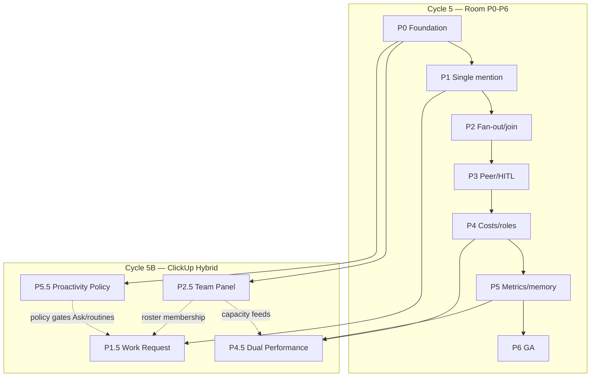

# Ciclo 5B — Tech Specs ClickUp Hybrid (P1.5 / P2.5 / P4.5 / P5.5)

> **Data:** 2026-07-09  
> **Produto:** Hybrid Team & Performance — extensão Path **B+** sobre Conference Room Slack+A2A  
> **Implementação:** fork `/Users/macbook/Projects/paperclip` (`QuadriniL/paperclip`)  
> **BizCursor desktop:** pausado (cherry-pick seletivo de trace/HITL se necessário)  
> **Discovery:** [`../cycle-1b-clickup-discovery/00-INDEX.md`](../cycle-1b-clickup-discovery/00-INDEX.md)  
> **SPECs Room base:** [`../cycle-5-tech-specs/`](../cycle-5-tech-specs/) (P0–P6)

---

## 1. Propósito deste ciclo

Transformar a descoberta ClickUp Hybrid (Ciclo 1B) em **SPECs técnicas executáveis** que complementam P0–P6:

| Gap ClickUp / research | Spec 5B |
|------------------------|---------|
| Pedido fácil humano→IA (Ask + assign + templates) | **P1.5** Work Request |
| Roster unificado humanos+agentes + capacity lanes | **P2.5** Hybrid Team Panel |
| Dual performance (humano \| agente \| room) | **P4.5** Dual Performance Dashboard |
| Proatividade governada (whitelist; Room silent) | **P5.5** Proactivity Policy |

Cada SPEC é **autocontida** o bastante para um subagent implementar sem reler a conversa — mas assume P0–P2 (mínimo) e leitura do Ciclo 1B para contexto de produto.

**Decisões herdadas (D-09…D-13):**

| ID | Decisão |
|----|---------|
| **D-09** | Path **B+**: Conference Room + Hybrid Team & Performance |
| **D-10** | Proatividade **governada** (triggers whitelist); default Room = silent-until-@ |
| **D-11** | Painéis de performance **fora do stream** (aba Team / Insights) |
| **D-12** | Assign-as-delegate: humano = owner; agente = delegate |
| **D-13** | AI Hub-like roster + Workload-like lanes no mesmo produto |

---

## 2. Mapa de fases híbridas

| Fase | Título | Spec | Status doc | Pré-requisito Room |
|------|--------|------|------------|--------------------|
| **P1.5** | Work Request — Ask button, assign-as-delegate, templates | [P1.5-work-request-SPEC.md](./P1.5-work-request-SPEC.md) | **Escrita** | P0 + P1 (single `@` wake) |
| **P2.5** | Hybrid Team Panel — roster, capacity, status, membership | [P2.5-hybrid-team-panel-SPEC.md](./P2.5-hybrid-team-panel-SPEC.md) | **Escrita** | P0 (agentes listáveis + members) |
| **P4.5** | Dual Performance Dashboard — human\|agent\|room + digests | [P4.5-dual-performance-SPEC.md](./P4.5-dual-performance-SPEC.md) | **Escrita** | P4 (costs) + P5-R (room metrics) |
| **P5.5** | Proactivity Policy — whitelist, Room silent, routines/webhooks | [P5.5-proactivity-policy-SPEC.md](./P5.5-proactivity-policy-SPEC.md) | **Escrita** | P0 silent-until-@ + routines existentes |

> **Nomenclatura:** o sufixo `.5` indica **extensão híbrida** paralela à fase Room correspondente, não substituição. P1.5 não substitui P1; P4.5 não substitui P4.

---

## 3. Dependências (DAG) — Room + Hybrid

| Aresta | Motivo |
|--------|--------|
| P0→P2.5 | Roster precisa agents + company members + flag |
| P1→P1.5 | Ask/assign reusa wake single-mention / room-orchestrator |
| P4+P5→P4.5 | Dual dashboard agrega costs + room metrics + human activity |
| P0→P5.5 | Policy reforça silent-until-@; routines já existem |
| P2.5⇢P1.5 | Membership do Team Panel alimenta quem pode pedir a quem |
| P5.5⇢P1.5 | Work Request respeita whitelist (não vira ambient na Room) |
| P2.5⇢P4.5 | Capacity / status alimenta métricas de orchestration |

**Paralelismo permitido:**

- P2.5 ∥ P1.5 após P1 (Team Panel não bloqueia Ask se membership mínima via Agents + CompanyAccess).
- P5.5 pode começar após P0 (editor de policy + gate Room); integração com Ask fecha com P1.5.
- P4.5 espera P4 + telemetria P5-R (pode stub métricas room se P5 parcial).

---

## 4. Índice das SPECs deste pacote

### 4.1 [P1.5 — Work Request](./P1.5-work-request-SPEC.md)

- Botão **Ask / Pedir ao agente** (qualquer humano member).
- **Assign-as-delegate** (Linear-like): humano = owner; agente = delegate.
- Templates de pedido (triage, research, draft, review).
- Reusa: `run-delegation` / room-orchestrator P1, agents list, issues assignment.

### 4.2 [P2.5 — Hybrid Team Panel](./P2.5-hybrid-team-panel-SPEC.md)

- Roster unificado **humanos + agentes** (AI Hub + Members).
- Capacity lanes (Workload-like) no mesmo painel.
- Status (online/idle/busy/paused) + membership room/company.
- Reusa: Agents, OrgChart, CompanyAccess, UserProfile, ActiveAgentsPanel.

### 4.3 [P4.5 — Dual Performance](./P4.5-dual-performance-SPEC.md)

- Dashboard **human \| agent \| room** fora do stream.
- Digest Sofia (baixa densidade) vs Board (denso).
- Reusa: Dashboard, Costs, P5 room metrics, activity.

### 4.4 [P5.5 — Proactivity Policy](./P5.5-proactivity-policy-SPEC.md)

- `ProactivityPolicyEditor` + whitelist de triggers.
- Room = **silent-until-@** (nenhum ambient no chat).
- Routines / webhooks / Autopilot-like **fora** da Room.
- Reusa: Routines, cron, webhooks, instance/company settings.

---

## 5. SPECs Room prévias (P0–P6) — links canônicos

| Fase | Arquivo |
|------|---------|
| INDEX Cycle 5 | [`../cycle-5-tech-specs/00-INDEX.md`](../cycle-5-tech-specs/00-INDEX.md) |
| P0 Foundation | [`../cycle-5-tech-specs/P0-foundation-SPEC.md`](../cycle-5-tech-specs/P0-foundation-SPEC.md) |
| P1 Single mention | [`../cycle-5-tech-specs/P1-single-mention-SPEC.md`](../cycle-5-tech-specs/P1-single-mention-SPEC.md) |
| P2 Fan-out + join | [`../cycle-5-tech-specs/P2-fanout-join-SPEC.md`](../cycle-5-tech-specs/P2-fanout-join-SPEC.md) |
| P3 Peer/HITL/quorum | [`../cycle-5-tech-specs/P3-peer-wait-hitl-SPEC.md`](../cycle-5-tech-specs/P3-peer-wait-hitl-SPEC.md) |
| P4 Costs/roles | [`../cycle-5-tech-specs/P4-costs-roles-SPEC.md`](../cycle-5-tech-specs/P4-costs-roles-SPEC.md) |
| P5 Memory + metrics | [`../cycle-5-tech-specs/P5-memory-metrics-SPEC.md`](../cycle-5-tech-specs/P5-memory-metrics-SPEC.md) |
| P6 GA + playbooks | [`../cycle-5-tech-specs/P6-ga-playbooks-SPEC.md`](../cycle-5-tech-specs/P6-ga-playbooks-SPEC.md) |

---

## 6. Plano de implementação (visão)

| Sprint | Foco | Saída |
|--------|------|-------|
| H0 | P2.5 skeleton + P5.5 policy schema | Team Panel read-only + policy JSON + Room gate |
| H1 | P1.5 Ask + assign-as-delegate | Qualquer member pede trabalho à IA |
| H2 | P1.5 templates + P2.5 capacity lanes | Intake padronizado + workload híbrido |
| H3 | P4.5 dual dashboard + Sofia digest | Prova semanal human\|agent\|room |
| H4 | P5.5 editor UX + routines deep-links | Proatividade governada documentada |

**Execução:** subagent-driven por SPEC. Skills: `subagent-driven-development` / `executing-plans`.

**Repo de código:** somente fork Paperclip — paths absolutos em cada SPEC § Arquitetura.

---

## 7. Links para Cycles anteriores

| Ciclo | Path | Uso |
|-------|------|-----|
| 1 — Discovery | [`../cycle-1-discovery/00-INDEX.md`](../cycle-1-discovery/00-INDEX.md) | Path B; fontes A2A |
| **1B — ClickUp Hybrid** | [`../cycle-1b-clickup-discovery/00-INDEX.md`](../cycle-1b-clickup-discovery/00-INDEX.md) | **Fonte canônica deste 5B** |
| 2 — Confirmation | [`../cycle-2-confirmation/00-INDEX.md`](../cycle-2-confirmation/00-INDEX.md) | Claims BoardChat / delegate |
| 3 — Deep dive | [`../cycle-3-deep-dive/`](../cycle-3-deep-dive/) | UX, verticais, gaps fork |
| 4 — Plan | [`../cycle-4-plan/00-PRODUCT-PLAN.md`](../cycle-4-plan/00-PRODUCT-PLAN.md) | Roadmap P0–P6 |
| 5 — Tech specs Room | [`../cycle-5-tech-specs/00-INDEX.md`](../cycle-5-tech-specs/00-INDEX.md) | SPECs P0–P6 |
| Plano writing-plans | [`../../../superpowers/plans/2026-07-09-paperclip-slack-room-a2a.md`](../../../superpowers/plans/2026-07-09-paperclip-slack-room-a2a.md) | Plano espelho |

---

## 8. Paths âncora no fork (reuso obrigatório)

| Concern | Path absoluto |
|---------|---------------|
| Agents list / detail | `/Users/macbook/Projects/paperclip/ui/src/pages/Agents.tsx`, `AgentDetail.tsx` |
| Active agents panel | `/Users/macbook/Projects/paperclip/ui/src/components/ActiveAgentsPanel.tsx` |
| Org chart | `/Users/macbook/Projects/paperclip/ui/src/pages/OrgChart.tsx` |
| Company members / access | `/Users/macbook/Projects/paperclip/ui/src/pages/CompanyAccess.tsx` |
| User / profile | `/Users/macbook/Projects/paperclip/ui/src/pages/UserProfile.tsx`, `ProfileSettings.tsx` |
| Dashboard | `/Users/macbook/Projects/paperclip/ui/src/pages/Dashboard.tsx`, `DashboardLive.tsx` |
| Costs / budgets | `/Users/macbook/Projects/paperclip/ui/src/pages/Costs.tsx` · `/Users/macbook/Projects/paperclip/server/src/services/costs.ts`, `budgets.ts` |
| Routines | `/Users/macbook/Projects/paperclip/ui/src/pages/Routines.tsx`, `RoutineDetail.tsx` · `/Users/macbook/Projects/paperclip/server/src/services/routines.ts` |
| Cron / webhooks | `/Users/macbook/Projects/paperclip/server/src/services/cron.ts`, `cursor-webhook-ingest.ts`, `webhook-trigger-rate-limit.ts` |
| Run delegation | `/Users/macbook/Projects/paperclip/server/src/services/run-delegation.ts` |
| Agent assignability | `/Users/macbook/Projects/paperclip/server/src/services/agent-assignability.ts` |
| Issue assignment wakeup | `/Users/macbook/Projects/paperclip/server/src/services/issue-assignment-wakeup.ts` |
| Company member roles | `/Users/macbook/Projects/paperclip/server/src/services/company-member-roles.ts` |
| Resource memberships | `/Users/macbook/Projects/paperclip/server/src/services/resource-memberships.ts` |
| User profiles API | `/Users/macbook/Projects/paperclip/server/src/routes/user-profiles.ts` |
| Board chat / room | `/Users/macbook/Projects/paperclip/ui/src/pages/BoardChat.tsx` · `/Users/macbook/Projects/paperclip/server/src/routes/board-chat.ts` |
| Access / authz | `/Users/macbook/Projects/paperclip/server/src/services/access.ts` |
| Dashboard service | `/Users/macbook/Projects/paperclip/server/src/services/dashboard.ts` |
| Team catalog | `/Users/macbook/Projects/paperclip/ui/src/pages/TeamCatalog.tsx` |

---

## 9. Critério de saída do Cycle 5B

- [x] SPECs P1.5, P2.5, P4.5, P5.5 completas (contexto, RF, RNF, MoSCoW, UX, arquitetura paths absolutos, smoke ST-*, DoD, riscos)
- [x] Este INDEX com mapa híbrido, DAG Room↔Hybrid, links P0–P6 e Ciclo 1B
- [ ] Implementação H0–H4 no fork (fora deste pacote de docs)
- [ ] Smoke ST-P15 / ST-P25 / ST-P45 / ST-P55 verdes em staging

---

## 10. Anti-hype (herdado)

> Scoped agents, clear cycle metrics, human gate — porque &gt;40% dos projetos agentic morrem por hype, custo e risco.

- **Não** claim: “substitui o time humano” / “Autopilot na sala”.
- **Sim** claim: “pedido fácil à IA + roster híbrido + performance dual + proatividade fora do chat”.

Detalhe normativo Room: [P6 anti-washing](../cycle-5-tech-specs/P6-ga-playbooks-SPEC.md).

**NotebookLM:** pesquisa Paperclip/Bizcursor Hybrid Team — sem overlap processo Villa (CD/Stock/Financial). **GO** para docs técnicas.
