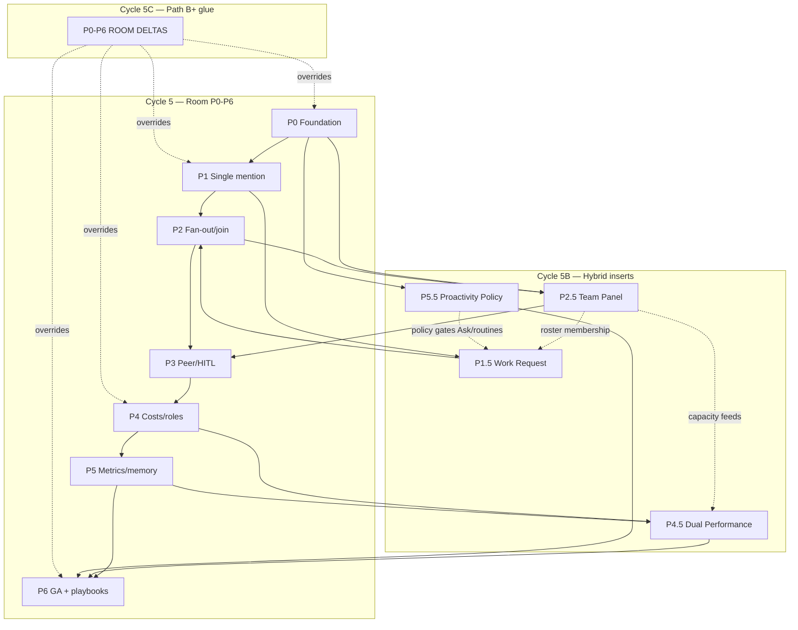

# Ciclo 5C — Tech Specs Path B+ (Room + Hybrid inserts)

> **Data:** 2026-07-09  
> **Produto:** Path **B+** = Conference Room (Slack + `@agents` + A2A) **e** Hybrid Team & Performance  
> **Implementação:** fork `/Users/macbook/Projects/paperclip` (`QuadriniL/paperclip`)  
> **BizCursor desktop:** pausado (cherry-pick seletivo de trace/HITL pós-GA)  
> **Plano canônico:** [`../cycle-4c-hybrid-plan/00-PRODUCT-PLAN-HYBRID-V2.md`](../cycle-4c-hybrid-plan/00-PRODUCT-PLAN-HYBRID-V2.md)  
> **SPECs Room base (válidas):** [`../cycle-5-tech-specs/`](../cycle-5-tech-specs/) P0–P6  
> **SPECs Hybrid inserts (válidas):** [`../cycle-5b-clickup-tech-specs/`](../cycle-5b-clickup-tech-specs/) P1.5 / P2.5 / P4.5 / P5.5

`NotebookLM: skip (non-Villa) — Path B+ tech-spec index (Paperclip/A2A research)`

---

## 1. Propósito deste ciclo

O Cycle **5** já entregou SPECs Room P0–P6. O Cycle **5B** já entregou SPECs Hybrid P1.5 / P2.5 / P4.5 / P5.5. O Cycle **4C** travou a ordem canônica Path B+ e as decisões D-09…D-13.

**Cycle 5C** não reescreve P0–P6. Ele:

1. **Unifica o mapa de fases** Room + inserts híbridos na ordem de fechamento DoD Path B+.
2. Publica o **DAG de dependências** completo (Room ↔ Hybrid).
3. Documenta **deltas** que Path B+ impõe sobre as SPECs Room existentes ([`P0-P6-ROOM-DELTAS.md`](./P0-P6-ROOM-DELTAS.md)).
4. Serve de **handoff de implementação** para orquestração subagent-driven.

### 1.1 Regra de precedência documental

| Camada | Path | Papel |
|--------|------|-------|
| Plano produto | `../cycle-4c-hybrid-plan/00-PRODUCT-PLAN-HYBRID-V2.md` | **Canônico** Path B+ (ordem, KPIs, riscos) |
| SPECs Room | `../cycle-5-tech-specs/P*-SPEC.md` | **Válidas** — RF/RNF/smoke/DoD Room |
| SPECs Hybrid | `../cycle-5b-clickup-tech-specs/P*.5-*-SPEC.md` | **Válidas** — inserts .5 |
| Deltas 5C | [`./P0-P6-ROOM-DELTAS.md`](./P0-P6-ROOM-DELTAS.md) | **Overrides / adds** Path B+ sobre Room |
| Este INDEX | `./00-INDEX.md` | Mapa + DAG + handoff |

**Conflito:** se um RF Room e um delta 5C divergirem, **vence o delta 5C** (Path B+) + plano 4C. Não editar silenciosamente as SPECs Room sem atualizar este pacote.

---

## 2. Mapa de fases P0…P6 com hybrid inserts

Ordem canônica de **fechamento DoD** (Cycle 3C gap matrix + Cycle 4C):

```
P0 → P1 → P1.5 → P2 → P2.5 → P3 → P4 → P4.5 → P5 → P5.5 → P6
```

| Fase | Título | Spec canônica | Pacote | Status doc |
|------|--------|---------------|--------|------------|
| **P0** | Foundation — auth, flag, silent-until-@, `adapter_wake` Coolify | [`../cycle-5-tech-specs/P0-foundation-SPEC.md`](../cycle-5-tech-specs/P0-foundation-SPEC.md) | Room | Escrita + **deltas 5C** |
| **P1** | Single `@mention` + host run + human owner | [`../cycle-5-tech-specs/P1-single-mention-SPEC.md`](../cycle-5-tech-specs/P1-single-mention-SPEC.md) | Room | Escrita + **deltas 5C** |
| **P1.5** | Work Request — Ask, assign-as-delegate, templates | [`../cycle-5b-clickup-tech-specs/P1.5-work-request-SPEC.md`](../cycle-5b-clickup-tech-specs/P1.5-work-request-SPEC.md) | Hybrid | Escrita |
| **P2** | Fan-out `@A @B` + join + bridge room→A2A + Trace | [`../cycle-5-tech-specs/P2-fanout-join-SPEC.md`](../cycle-5-tech-specs/P2-fanout-join-SPEC.md) | Room | Escrita + **deltas 5C** |
| **P2.5** | Hybrid Team Panel — roster, capacity, membership | [`../cycle-5b-clickup-tech-specs/P2.5-hybrid-team-panel-SPEC.md`](../cycle-5b-clickup-tech-specs/P2.5-hybrid-team-panel-SPEC.md) | Hybrid | Escrita |
| **P3** | Peer wait, HITL cards, quorum | [`../cycle-5-tech-specs/P3-peer-wait-hitl-SPEC.md`](../cycle-5-tech-specs/P3-peer-wait-hitl-SPEC.md) | Room | Escrita + **deltas 5C** |
| **P4** | Cost pill hop/session, alerts 80/100, density | [`../cycle-5-tech-specs/P4-costs-roles-SPEC.md`](../cycle-5-tech-specs/P4-costs-roles-SPEC.md) | Room | Escrita + **deltas 5C** |
| **P4.5** | Dual Performance — human \| agent \| room | [`../cycle-5b-clickup-tech-specs/P4.5-dual-performance-SPEC.md`](../cycle-5b-clickup-tech-specs/P4.5-dual-performance-SPEC.md) | Hybrid | Escrita |
| **P5** | Room metrics + spike memória PARA | [`../cycle-5-tech-specs/P5-memory-metrics-SPEC.md`](../cycle-5-tech-specs/P5-memory-metrics-SPEC.md) | Room | Escrita + **deltas 5C** |
| **P5.5** | Proactivity Policy — whitelist; Room silent | [`../cycle-5b-clickup-tech-specs/P5.5-proactivity-policy-SPEC.md`](../cycle-5b-clickup-tech-specs/P5.5-proactivity-policy-SPEC.md) | Hybrid | Escrita |
| **P6** | GA B+, Coolify, playbooks, team mgmt, anti-washing | [`../cycle-5-tech-specs/P6-ga-playbooks-SPEC.md`](../cycle-5-tech-specs/P6-ga-playbooks-SPEC.md) | Room | Escrita + **deltas 5C** |

> **Nomenclatura:** sufixo `.5` = extensão híbrida **paralela** à fase Room correspondente. P1.5 não substitui P1; P4.5 não substitui P4. SPECs Room em `../cycle-5-tech-specs/` **permanecem válidas**; 5C **adiciona/override** via deltas.

### 2.1 O que cada insert híbrido “encaixa”

| Insert | Encaixa após | Entrega Path B+ | Decisão |
|--------|--------------|-----------------|---------|
| P1.5 | P1 (wake single) | Pedido fácil humano→IA sem decorar slug | D-12 |
| P2.5 | P0/P2 (agents + membership) | Roster AI Hub-like + Workload-like unificado | D-13 |
| P4.5 | P4 + P5-R | Insights dual fora do stream | D-11 |
| P5.5 | P0 (silent) + routines | Proatividade governada **fora** da Room | D-10 |

---

## 3. Dependências (DAG)



### 3.1 Arestas (motivo)

| Aresta | Motivo |
|--------|--------|
| P0→P1→P2→P3→P4→P5→P6 | Cadeia Room (Cycle 5) — inalterada |
| P0→P2.5 | Roster precisa agents + members + flag |
| P0→P5.5 | Policy reforça silent-until-@; routines já existem |
| P1→P1.5 | Ask/assign reusa wake single-mention / room-orchestrator |
| P1.5→P2 | Fan-out deve respeitar owner/delegate já modelados no Ask |
| P2→P2.5 | Capacity/status alimentados por runs A2A reais |
| P2.5→P3 | HITL/peer UX referencia roster híbrido (quem espera quem) |
| P4+P5→P4.5 | Dual dashboard agrega costs + room metrics |
| P4.5→P6 / P5.5→P6 | GA B+ exige Insights + policy documentados |
| P2.5⇢P1.5 | Membership alimenta quem pode pedir a quem |
| P5.5⇢P1.5 | Work Request não vira ambient na Room |
| P2.5⇢P4.5 | Capacity / status → métricas de orchestration |
| DELTAS⇢P0/P1/P4/P6 | Overrides Path B+ sem reescrever SPECs Room |

### 3.2 Paralelismo permitido

| Paralelo | Condição | Bloqueio DoD |
|----------|----------|--------------|
| P2.5 ∥ P1.5 | Após P1 (membership mínima via Agents + CompanyAccess) | Fechar DoD P1.5 antes de claim “pedido fácil” |
| P5.5 early | Após P0 (schema + Room gate) | Integração Ask fecha com P1.5 |
| P4.5 stub | P4 + telemetria P5-R parcial | DoD P4.5 espera 7 KPIs P0 ou null+empty |
| Docs P6 draft | ∥ P5 | DoD P6 espera métricas piloto + hybrid GA checklist |

**Não paralelizar:** P1 antes de P0 `adapter_wake`; P2 fan-out antes de P1 host run; P6 GA antes de P4.5 + P5.5 Must.

---

## 4. Índice das SPECs neste pacote (5C)

| Arquivo | Papel |
|---------|-------|
| [`00-INDEX.md`](./00-INDEX.md) | Este mapa + DAG + handoff |
| [`P0-P6-ROOM-DELTAS.md`](./P0-P6-ROOM-DELTAS.md) | Checklist de deltas Path B+ sobre SPECs Room |

### 4.1 SPECs Room (permanecem em `../cycle-5-tech-specs/`)

| Fase | Arquivo |
|------|---------|
| INDEX Cycle 5 | [`../cycle-5-tech-specs/00-INDEX.md`](../cycle-5-tech-specs/00-INDEX.md) |
| P0 | [`../cycle-5-tech-specs/P0-foundation-SPEC.md`](../cycle-5-tech-specs/P0-foundation-SPEC.md) |
| P1 | [`../cycle-5-tech-specs/P1-single-mention-SPEC.md`](../cycle-5-tech-specs/P1-single-mention-SPEC.md) |
| P2 | [`../cycle-5-tech-specs/P2-fanout-join-SPEC.md`](../cycle-5-tech-specs/P2-fanout-join-SPEC.md) |
| P3 | [`../cycle-5-tech-specs/P3-peer-wait-hitl-SPEC.md`](../cycle-5-tech-specs/P3-peer-wait-hitl-SPEC.md) |
| P4 | [`../cycle-5-tech-specs/P4-costs-roles-SPEC.md`](../cycle-5-tech-specs/P4-costs-roles-SPEC.md) |
| P5 | [`../cycle-5-tech-specs/P5-memory-metrics-SPEC.md`](../cycle-5-tech-specs/P5-memory-metrics-SPEC.md) |
| P6 | [`../cycle-5-tech-specs/P6-ga-playbooks-SPEC.md`](../cycle-5-tech-specs/P6-ga-playbooks-SPEC.md) |

### 4.2 SPECs Hybrid (permanecem em `../cycle-5b-clickup-tech-specs/`)

| Fase | Arquivo |
|------|---------|
| INDEX Cycle 5B | [`../cycle-5b-clickup-tech-specs/00-INDEX.md`](../cycle-5b-clickup-tech-specs/00-INDEX.md) |
| P1.5 | [`../cycle-5b-clickup-tech-specs/P1.5-work-request-SPEC.md`](../cycle-5b-clickup-tech-specs/P1.5-work-request-SPEC.md) |
| P2.5 | [`../cycle-5b-clickup-tech-specs/P2.5-hybrid-team-panel-SPEC.md`](../cycle-5b-clickup-tech-specs/P2.5-hybrid-team-panel-SPEC.md) |
| P4.5 | [`../cycle-5b-clickup-tech-specs/P4.5-dual-performance-SPEC.md`](../cycle-5b-clickup-tech-specs/P4.5-dual-performance-SPEC.md) |
| P5.5 | [`../cycle-5b-clickup-tech-specs/P5.5-proactivity-policy-SPEC.md`](../cycle-5b-clickup-tech-specs/P5.5-proactivity-policy-SPEC.md) |

---

## 5. Links Cycle 1C–4C (cadeia Path B+)

| Ciclo | Path | Uso em 5C |
|-------|------|-----------|
| **1C** Discovery | [`../cycle-1c-hybrid-discovery/00-INDEX.md`](../cycle-1c-hybrid-discovery/00-INDEX.md) | Catálogos; hipóteses |
| **1C** Fork catalog | [`../cycle-1c-hybrid-discovery/03-paperclip-fork-capability-catalog.md`](../cycle-1c-hybrid-discovery/03-paperclip-fork-capability-catalog.md) | REUSE/ADAPT/BUILD |
| **1C** Dual sources | [`../cycle-1c-hybrid-discovery/04-dual-performance-sources.md`](../cycle-1c-hybrid-discovery/04-dual-performance-sources.md) | Fontes métricas |
| **2C** Confirmation | [`../cycle-2c-hybrid-confirmation/00-INDEX.md`](../cycle-2c-hybrid-confirmation/00-INDEX.md) | D-09…D-13 LOCKED · R-01…R-10 |
| **2C** Fork code | [`../cycle-2c-hybrid-confirmation/03-fork-code-confirm.md`](../cycle-2c-hybrid-confirmation/03-fork-code-confirm.md) | Claims Coolify / mentions / bridge |
| **2C** Dual confirm | [`../cycle-2c-hybrid-confirmation/04-dual-performance-confirm.md`](../cycle-2c-hybrid-confirmation/04-dual-performance-confirm.md) | P0 metric set (7 KPIs) |
| **3C** Deep dive | [`../cycle-3c-hybrid-deep-dive/00-INDEX.md`](../cycle-3c-hybrid-deep-dive/00-INDEX.md) | UX + flows + policy |
| **3C** Gap matrix | [`../cycle-3c-hybrid-deep-dive/05-implementation-gap-matrix.md`](../cycle-3c-hybrid-deep-dive/05-implementation-gap-matrix.md) | Ordem canônica DoD |
| **4C** Plan INDEX | [`../cycle-4c-hybrid-plan/00-INDEX.md`](../cycle-4c-hybrid-plan/00-INDEX.md) | Exit gate → 5C |
| **4C** Product plan V2 | [`../cycle-4c-hybrid-plan/00-PRODUCT-PLAN-HYBRID-V2.md`](../cycle-4c-hybrid-plan/00-PRODUCT-PLAN-HYBRID-V2.md) | **Plano autoritativo** |
| **4C** Journeys Sofia | [`../cycle-4c-hybrid-plan/01-operator-journeys-sofia.md`](../cycle-4c-hybrid-plan/01-operator-journeys-sofia.md) | J1–J6 → fases |
| **4C** KPIs | [`../cycle-4c-hybrid-plan/02-kpi-and-success-metrics.md`](../cycle-4c-hybrid-plan/02-kpi-and-success-metrics.md) | Success metrics GA |
| **4C** Risks | [`../cycle-4c-hybrid-plan/03-risks-and-rollout.md`](../cycle-4c-hybrid-plan/03-risks-and-rollout.md) | Coolify · flags · rollback |

### 5.1 Cadeia Room legada (ainda útil)

| Ciclo | Path |
|-------|------|
| 1 Discovery | [`../cycle-1-discovery/00-INDEX.md`](../cycle-1-discovery/00-INDEX.md) |
| 2 Confirmation | [`../cycle-2-confirmation/00-INDEX.md`](../cycle-2-confirmation/00-INDEX.md) |
| 3 Deep dive | [`../cycle-3-deep-dive/00-INDEX.md`](../cycle-3-deep-dive/00-INDEX.md) |
| 4 Plan Room | [`../cycle-4-plan/00-PRODUCT-PLAN.md`](../cycle-4-plan/00-PRODUCT-PLAN.md) |
| Espelho agentes | [`../../../superpowers/plans/2026-07-09-paperclip-slack-room-a2a.md`](../../../superpowers/plans/2026-07-09-paperclip-slack-room-a2a.md) |

---

## 6. Implementation handoff (subagent-driven-development)

### 6.1 Como executar

Usar skill **`subagent-driven-development`** (e, se sessão paralela, `executing-plans`):

1. **Um subagent fresco por fase** (P0, depois P1, …) — não herdar histórico da conversa de pesquisa.
2. Prompt do implementer deve citar **paths absolutos**:
   - SPEC Room: `/Users/macbook/Projects/bizcursor/docs/research/slack-a2a-room/cycle-5-tech-specs/P*-SPEC.md`
   - Se fase Room: também `/Users/macbook/Projects/bizcursor/docs/research/slack-a2a-room/cycle-5c-hybrid-tech-specs/P0-P6-ROOM-DELTAS.md` (seção da fase)
   - Se fase `.5`: SPEC em `cycle-5b-clickup-tech-specs/`
   - Plano: `cycle-4c-hybrid-plan/00-PRODUCT-PLAN-HYBRID-V2.md` (só se ambiguidade de produto)
3. **Two-stage review** após cada fase: (a) spec compliance vs SPEC+deltas; (b) code quality no fork.
4. Repo de código: **somente** `/Users/macbook/Projects/paperclip` — paths § Arquitetura de cada SPEC.
5. Smoke `ST-P*` / `ST-P15` / `ST-P25` / `ST-P45` / `ST-P55` verdes em staging antes de avançar DoD.

### 6.2 Ordem de dispatch sugerida (sprints)

| Sprint | Fases | Saída |
|--------|-------|-------|
| S0 | P0 (+ deltas adapter_wake / silent) | Flag + Coolify-safe path + mentions composer baseline |
| S1 | P1 → P1.5 | `@` wake + Ask/assign-as-delegate |
| S2 | P2 → P2.5 | Fan-out/join/trace + Team Panel |
| S3 | P3 | Peer wait + HITL + quorum |
| S4 | P4 → P4.5 | Cost pills + dual hooks + Dual Performance |
| S5 | P5 → P5.5 | Room metrics + proactivity policy |
| S6 | P6 (+ deltas team mgmt / GA B+) | Graduar flags Room+Hybrid; playbooks; anti-washing |

### 6.3 Anti-padrões de implementação

| Forbidden | Por quê |
|-----------|---------|
| Spawn permanente `claude` CLI em Coolify GA | D-08 / PR-F3 — usar `adapter_wake` / `paperclipChatWake` |
| Expor run JWT ao browser | PR-F1 — bridge server-side |
| Ambient Autopilot no stream da Room | D-10 |
| Ledger de custo paralelo | P4 REUSE `costs`/`budgets` |
| Plane-style agent-as-assignee único | D-12 — owner humano + delegate agente |
| Vanity KPIs no hero do chat | D-11 — Dual fora do stream |

---

## 7. Critério de saída do Cycle 5C

- [x] INDEX com mapa P0…P6 + inserts .5
- [x] DAG mermaid Room ↔ Hybrid ↔ deltas
- [x] Nota explícita: SPECs Room P0–P6 em `../cycle-5-tech-specs/` **permanecem válidas**; 5C adds/overrides
- [x] Links Cycle 1C–4C
- [x] [`P0-P6-ROOM-DELTAS.md`](./P0-P6-ROOM-DELTAS.md) com checklist por fase
- [x] Handoff subagent-driven-development
- [ ] Implementação S0–S6 no fork (fora deste pacote de docs)
- [ ] Smokes Path B+ verdes em staging Coolify

---

## 8. Anti-hype (herdado Path B+)

> Scoped agents, clear cycle metrics, human gate — porque &gt;40% dos projetos agentic morrem por hype, custo e risco.

- **Não** claim: “substitui o time” / “Autopilot na sala” / “80% autonomia”.
- **Sim** claim: “sala `@` + A2A auditável + pedido fácil + roster híbrido + performance dual + proatividade fora do chat”.

Detalhe normativo: [P6 anti-washing](../cycle-5-tech-specs/P6-ga-playbooks-SPEC.md) + deltas P6 em [`P0-P6-ROOM-DELTAS.md`](./P0-P6-ROOM-DELTAS.md).
