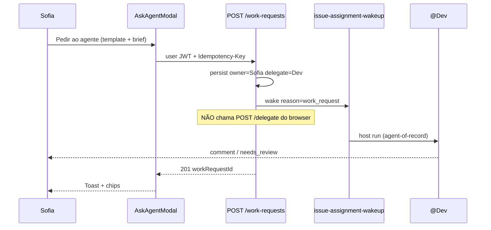
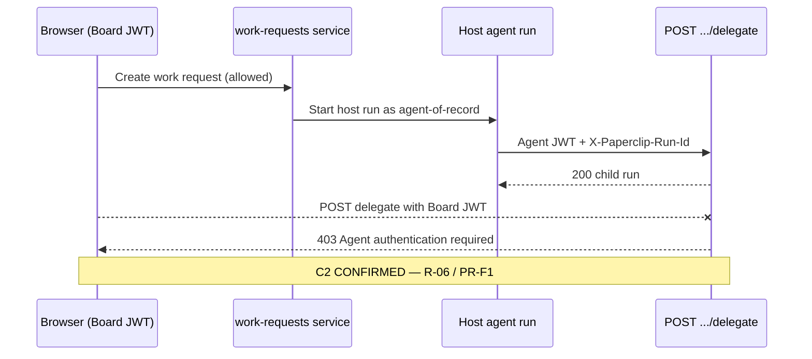

# P1.5 — Work Request: Ask, Assign-as-Delegate, Templates (Path B+)

> **Versão:** 2.0 (supersede Cycle 5B v1.0)  
> **Data:** 2026-07-09  
> **Ciclo:** 5C — Hybrid tech specs (Path B+) · Agent #1  
> **Repo de implementação:** fork `/Users/macbook/Projects/paperclip` (`QuadriniL/paperclip`)  
> **Pré-requisitos hard:** **P0** (silent-until-@, mentions `agent://`) + **P1** (room-orchestrator single `@` wake)  
> **Soft / paralelo:** P2.5 (Team Panel CTA); P5.5 (policy gate — Ask ≠ ambient)  
> **BizCursor desktop UI:** fora de escopo (fork Paperclip first)  
> **Duração estimada:** ~1,5 semanas  
> **Confiança:** Alta — Cycle 2C CONFIRMED (R-01, R-04…R-07, C2/PR-F1) + design 3C + plan 4C  
> **NotebookLM:** skip (non-Villa) — Path B+ hybrid Work Request SPEC

---

## 0. Como usar esta SPEC (subagent sem histórico)

Esta SPEC é **autocontida**. Um subagent de implementação deve:

1. Ler **esta** SPEC ponta a ponta (não depende de chat).  
2. Confirmar DoD de **P0** e **P1** no fork antes de codar.  
3. Implementar no fork Paperclip (paths absolutos em §6).  
4. Passar smoke **ST-P1.5-01…16** (§8) em staging.  
5. Marcar checklist §9.

**Supersede:** [`../cycle-5b-clickup-tech-specs/P1.5-work-request-SPEC.md`](../cycle-5b-clickup-tech-specs/P1.5-work-request-SPEC.md) (v1.0).  
**Design canônico:** [`../cycle-3c-hybrid-deep-dive/02-human-work-request-flows.md`](../cycle-3c-hybrid-deep-dive/02-human-work-request-flows.md).  
**Roadmap:** [`../cycle-4c-hybrid-plan/00-PRODUCT-PLAN-HYBRID-V2.md`](../cycle-4c-hybrid-plan/00-PRODUCT-PLAN-HYBRID-V2.md) §P1.5.

### 0.1 O que mudou vs Cycle 5B

| Tema | 5B v1.0 | 5C v2.0 (esta SPEC) |
|------|---------|---------------------|
| Stack affordances | Ask + assign + templates | **4 camadas** explícitas: `@` Room · Ask · assign-delegate · catalog (3C) |
| Auth bridge | “não chamar POST delegate” | Diagrama + regras **agent-of-record** (C2 CONFIRMED / R-06 / PR-F1) |
| Destino modal | issueId / roomThreadId | Campo **`destination`: `issue` \| `room`** (intent unificado) |
| Owner no modal | implícito = actor | Select **Owner** (default = me; sempre humano — D-12) |
| Composer Room | deferido a P1 | **M9 Must:** mentions ADAPT C5 no composer (parity Claude Tag) |
| Errors / empty | 5 códigos | Matriz completa 3C (§5.4–5.5) + lifecycle states |
| Smoke | ST-P15-01…10 | **ST-P1.5-01…16** (bridge assert + D-12 validator + Room mention) |
| Anti-padrões | Plane / fake JWT | Explicit **Won't** W1–W7 alinhados 3C/4C |
| Métricas | 4 métricas | Alvos 4C: ≥30% wakes via Ask; ≥50% issues owner+delegate |

### 0.2 Decisões travadas (não reabrir em P1.5)

| ID | Decisão | Fonte |
|----|---------|-------|
| **D-09** | Path B+ (Conference Room + Issues) | Plan 4C |
| **D-10** | Silent-until-@ | P0 |
| **D-11** | Custo fora do stream denso (pill na bolha / P4) | Plan 4C |
| **D-12** | Owner humano + delegate agente (nunca agent-as-sole-owner) | Linear / AIG / 2C |
| **R-06** | Humano **nunca** `POST .../delegate` com Board JWT | Fork C2 CONFIRMED |
| **R-05** | Anyone-can-@ / steer no thread Room (Claude Tag) | 2C CONFIRMED |

---

## 1. Purpose & scope

### 1.1 Propósito

Permitir que **qualquer company member** (incluindo Sofia não-técnica) peça trabalho a um agente com a mesma facilidade de pedir a um colega — **mais seguro**: owner humano sempre visível, custo atribuível, silent-until-@ preservado, e orquestração via **bridge server-side** (agent-of-record), nunca com o browser fingindo agent JWT.

Pedir IA = stack de affordances (ordem de acessibilidade, Cycle 3C):

```
① @agent na Room (Claude Tag)          ← power + multiplayer (P1 + M9)
② Ask button / modal (intent unificado) ← baixa fricção (P1.5 core)
③ Assign-as-delegate (Linear D-12)      ← trabalho durável + audit
④ Templates / catalog (ClickUp Super)   ← pedidos repetíveis
```

ClickUp **confirma** intake progressivo sem CTA único “Request work from AI” (Claim 8). Path B+ **adiciona** Ask como diferencial de acessibilidade — não substitui `@` nem assign.

### 1.2 Problema (estado do fork sem P1.5)

| Hoje | Gap |
|------|-----|
| `@CEO` no BoardChat (P1) | Exige mental model Slack + slug; Sofia leiga falha |
| Issue assign → `issue-assignment-wakeup` | Assignee clássico ≠ owner humano + delegate agente |
| `POST /heartbeat-runs/:runId/delegate` | **403** se `actor.type !== "agent"` (C2) — UI humana não pode “delegar” direto |
| Agents list | Descoberta, não intake |
| ChatComposer / mentions | C5: precisa ADAPT MarkdownEditor mention chips |

### 1.3 Escopo

| **Dentro P1.5** | **Fora P1.5** |
|-----------------|---------------|
| CTA Ask em IssueDetail, BoardChat, empty Room, AgentDetail; Team Panel se P2.5 | Fan-out N agentes no modal (P2 → `FANOUT_USE_ROOM`) |
| Modal intent unificado: agent + owner + destination + template + brief | Ambient / Autopilot na Room (D-10 · P5.5) |
| Persist `ownerUserId` + `delegateAgentId` (D-12) + chips UI | Plane-style agent-as-owner |
| ≥5 templates built-in + Blank | CRUD company templates (Should — pode slip) |
| Path A (issue wakeup) + Path B (room-orchestrator) **sem** browser POST delegate | BizCursor desktop UI deste fluxo |
| Composer Room com `@` mentions (ADAPT C5) | Magentic / autonomia sem human gate |
| Feature flag + authz member+ + activity audit + Idempotency-Key | Ledger de custo completo (P4) — só mensagem acionável se budget 100% |
| Error/empty states acionáveis | Forms Zod estruturados ≤5 campos (Could Phase 2) |

### 1.4 Cenário canônico (Sofia)

```
Sofia (operator) na issue ENG-442:
  1. Clica [Pedir ao agente]
  2. Template "Triagem de bug" + agente @CEO + Owner = Sofia + destino = issue
  3. Confirma → POST /work-requests (user JWT + Idempotency-Key)
  4. Server: ownerUserId=Sofia, delegateAgentId=CEO; comment do pedido;
     issue-assignment-wakeup reason=work_request (NÃO POST /delegate do browser)
  5. Toast “Pedido enviado a @CEO”; chip Owner/Delegate; activity work_request.created
  6. Reply do CEO; Sofia permanece accountable
```

### 1.5 Premissas

- P0 DoD: silent-until-@, serialização `[@Nome](agent://<agentId>)`, Coolify-safe adapters.  
- P1 DoD: `room-orchestrator` single-mention → host run + reply no thread.  
- Adapters beachhead: `opencode_local`, `cursor_cloud`.  
- Company members via `company-member-roles` / Access.  
- Flag `enableWorkRequestV1` (ou herdar Room flag) — **default off** em prod Coolify.

### 1.6 Glossário

| Termo | Definição |
|-------|-----------|
| **Work Request** | Pedido estruturado humano→agente (template + prompt + target + destination) |
| **Owner** | User humano accountable (HITL, SLA, Inbox) — **sempre** humano em trabalho agentic |
| **Delegate** | Agente executor do wake/run |
| **Ask** | CTA + modal “Pedir ao agente” / “Ask agent” |
| **Template** | Intent pré-preenchido `{ id, title, description, defaultPromptMarkdown, … }` |
| **Bridge / agent-of-record** | Serviço server-side que inicia host run com identidade de agent; único path legítimo para `POST .../delegate` |
| **Path A** | Issue-centric wakeup (`issue-assignment-wakeup`) |
| **Path B** | Room-centric wake (`room-orchestrator` + mention) |
| **Path C** | Host já em run → `run-delegation` agent-only (P2+; **não** P1.5 human entry) |

### 1.7 Princípio de produto (não negociável)

> Pedir IA deve ser **tão fácil quanto pedir a um colega** — e **mais seguro**: owner humano sempre visível, custo atribuído, silent-until-@, humano **nunca** autentica como agent.

---

## 2. RF — Requisitos funcionais (numerados)

### 2.1 Ask CTA e permissões

| ID | Requisito | MoSCoW |
|----|-----------|--------|
| **RF-P15-01** | Exibir CTA **Pedir ao agente** / **Pedir** / **Pedir trabalho** conforme superfície: (a) `IssueDetail`, (b) header/composer toolbar `BoardChat` quando Room on, (c) empty state Room, (d) `AgentDetail`, (e) row Team Panel se P2.5 existir, (f) ação rápida Inbox/MyIssues (Path A default) | Must |
| **RF-P15-02** | Qualquer **company member** com role ≥ operator **ou** permissão `work_request:create` pode abrir o modal — **não** só Board admin (R-05 anyone-can-Ask no canal, sujeito a membership) | Must |
| **RF-P15-03** | Guest / viewer sem create → CTA **oculto**; API → `403 FORBIDDEN` | Must |
| **RF-P15-04** | Feature flag `enableWorkRequestV1` (env `ENABLE_WORK_REQUEST_V1` / instance setting). Off → CTA ausente; `POST/GET` work-requests → **404** | Must |

### 2.2 Modal Work Request (intent unificado)

| ID | Requisito | MoSCoW |
|----|-----------|--------|
| **RF-P15-05** | Modal campos Must: `targetAgentId` (required), `ownerUserId` (required, humano, default = actor), `destination` (`issue` \| `room`), `templateId` (optional / Blank), `title` (Path A), `prompt` (required, min 1 char, markdown), `priority` (enum, default `normal`), `issueId` (optional), `roomThreadId` (optional), `origin` (`issue` \| `room` \| `team_panel` \| `agent_detail` \| `inbox`) | Must |
| **RF-P15-06** | Defaults de destino: origem Issue → `destination=issue`; origem BoardChat/Room → `destination=room`; Team Panel / AgentDetail → `issue` com opção “também postar na Room” | Must |
| **RF-P15-07** | Autocomplete agentes: só **invokable** + **assignable** na company (`agent-invokability` + `agent-assignability`) | Must |
| **RF-P15-08** | Owner select: só humanos members; **validator rejeita** agent id como owner (`AGENT_CANNOT_BE_OWNER`) | Must |
| **RF-P15-09** | Helper fixo (PT-BR): “Você continua responsável. O agente executa.” Footer: “Custo estimado depende do pedido — você verá o gasto na issue/sala.” | Must |
| **RF-P15-10** | Preview do prompt final = `template.defaultPromptMarkdown` + user brief (concat documentada; brief sempre editável) | Must |
| **RF-P15-11** | Confirmar → `POST /api/companies/:companyId/work-requests` com `Authorization: Bearer <user session>` + header `Idempotency-Key` | Must |
| **RF-P15-12** | Resposta 201: `{ workRequestId, issueId?, ownerUserId, delegateAgentId, hostRunId?, roomMessageId?, status }` | Must |
| **RF-P15-13** | Pós-sucesso: toast “Pedido enviado a @{agent}”; navegar/scroll ao comment (issue) ou bolha (Room); chips Owner/Delegate visíveis | Must |
| **RF-P15-14** | Multi-agent / multi-select no modal → **bloqueado** `400 FANOUT_USE_ROOM` + CTA “Abrir Room e mencionar @A @B” — **0 wakes** | Must |

### 2.3 Assign-as-delegate (D-12)

| ID | Requisito | MoSCoW |
|----|-----------|--------|
| **RF-P15-15** | Persistir `ownerUserId` (humano) + `delegateAgentId` (agente) no issue (colunas ou metadata versionada — §7). Agente **nunca** é o único dono | Must |
| **RF-P15-16** | UI Issue (e Room quando aplicável) mostra: `Owner: {user}` · `Delegate: {agent}` (texto + chip; não só cor) | Must |
| **RF-P15-17** | Wake / reassign de delegate **não** troca owner sem ação explícita do usuário | Must |
| **RF-P15-18** | Compat legado: issue só com `assigneeAgentId` → UI mostra owner = criador / Board fallback + banner “Definir owner humano” | Must |
| **RF-P15-19** | Atalhos Issue: (a) Assign to me + delegate @X → owner=me, delegate=X, wake; (b) só humano → limpa delegate; (c) só eu no loop → owner=me sem delegate; (d) trocar delegate → owner estável | Must |
| **RF-P15-20** | Set/update delegate → assignability check → wake reason `work_request` ou `assignment` | Must |
| **RF-P15-21** | Comentário com `@` na issue menciona **além** do delegate (não substitui o campo delegate) | Must |
| **RF-P15-22** | Board pode reassign delegate em qualquer issue; Operator nos próprios issues (policy access) | Should |
| **RF-P15-23** | Anti-padrão Plane: picker de Assignees **não** lista agentes como “dono”; picker **Delegate** separado | Must |

### 2.4 Templates / catalog

| ID | Requisito | MoSCoW |
|----|-----------|--------|
| **RF-P15-24** | Ship built-in estáveis: `triage_bug`, `code_review`, `research_brief`, `draft_reply`, `status_summary`, `blank` | Must |
| **RF-P15-25** | Schema template: `{ id, title, description, defaultPromptMarkdown, suggestedAgentRole?, vertical?: "sh"|"support"|"ops"|"research"|"generic" }` | Must |
| **RF-P15-26** | Chips no modal com `aria-pressed`; selecionar preenche título + brief; Sofia sempre pode editar | Must |
| **RF-P15-27** | Templates **não** auto-executam sem confirmação; **não** embutem fan-out; **não** agendam Autopilot | Must |
| **RF-P15-28** | CRUD templates company (Board admin) | Should |
| **RF-P15-29** | i18n títulos PT-BR por locale company | Could |
| **RF-P15-30** | Forms estruturados Zod (≤5 campos extras por template) Phase 2 | Could |
| **RF-P15-31** | Campo opcional orçamento máx. no modal (company default) | Could |

### 2.5 Orquestração / wake / bridge

| ID | Requisito | MoSCoW |
|----|-----------|--------|
| **RF-P15-32** | **Path A** (`destination=issue`): cria/atualiza issue + comment do pedido + `issue-assignment-wakeup` / heartbeat com reason `work_request` | Must |
| **RF-P15-33** | **Path B** (`destination=room`): posta mensagem formatada com mention `[@Name](agent://<id>)` + brief; `room-orchestrator` (P1) wake | Must |
| **RF-P15-34** | Browser / Board JWT **nunca** chama `POST /heartbeat-runs/:runId/delegate`. Se vazar tentativa → `403` agent-auth; UI nunca expõe esse path | Must |
| **RF-P15-35** | Bridge server-side: work-request service inicia host run como agent-of-record (user-authorized wakeup / orchestrator). Path C `run-delegation` só quando host agent já em run (P2+) | Must |
| **RF-P15-36** | Correlation: gravar `workRequestId` em comment metadata / contextSnapshot / activity | Must |
| **RF-P15-37** | Respeitar P5.5: se `roomAmbientProactivity=false` (default), Ask **não** agenda routine; só wake sob pedido explícito | Must |
| **RF-P15-38** | Budget 100% / agent paused / not assignable → falhar com código acionável (§5.5); **0** host run parcial | Should (Must para paused/not assignable) |
| **RF-P15-39** | Composer Room: autocomplete `@` agentes + humanos (Agent Cards); serialização canônica `agent://` (ADAPT C5 / PR-F4) | Must |
| **RF-P15-40** | Mention na Room ≠ A2A join automático (C6); single `@` → P1; multi → P2 / `FANOUT_NOT_ENABLED` até P2 | Must |

### 2.6 Auditoria e listagem

| ID | Requisito | MoSCoW |
|----|-----------|--------|
| **RF-P15-41** | Activity: `work_request.created`, `.completed`, `.failed` com owner/delegate/templateId/destination | Must |
| **RF-P15-42** | `GET /api/companies/:companyId/work-requests?mine=1` | Should |
| **RF-P15-43** | CTA “Promover a issue” a partir de bolha Room útil (cria issue + copia brief + owner/delegate) | Should |

### 2.7 Lifecycle (estados visíveis a Sofia)

| ID | Requisito | MoSCoW |
|----|-----------|--------|
| **RF-P15-44** | Estados: `draft` (modal) → `queued` → `running` → `needs_you` \| `done` \| `failed` refletidos em issue/Room/Inbox conforme aplicável | Must |
| **RF-P15-45** | Densidade Sofia: sem `runId` no default; Board density revela IDs no toast expandido | Must |

---

## 3. RNF — Requisitos não funcionais

| ID | Requisito | Métrica / critério |
|----|-----------|-------------------|
| **RNF-P15-01** | Sem secrets / agent JWT / API keys no WebView | Keys só server Paperclip (BizCursor Rust se client desktop — fora escopo) |
| **RNF-P15-02** | Latência modal → API ack | p95 &lt; **800 ms** |
| **RNF-P15-03** | Latência até host run `running` | p50 &lt; **5 s** (parity P0/P1) |
| **RNF-P15-04** | TypeScript strict; Zod no boundary API | Zero `any` novo |
| **RNF-P15-05** | Vertical slice | ≤ **6** arquivos core novos (+ tests); se estourar: fundir templates no service; hook inline no dialog |
| **RNF-P15-06** | Idempotência | Mesmo `Idempotency-Key` → **1** workRequest e **1** wake |
| **RNF-P15-07** | A11y | `role="dialog"`, focus trap, Escape, labels, `aria-pressed` chips, erros `role="alert"` / live region |
| **RNF-P15-08** | Rate limit | Mentions + Ask por user (anti storm) — Should; documentar limites |
| **RNF-P15-09** | Observabilidade | Log estruturado: `workRequestId`, `ownerUserId`, `delegateAgentId`, `destination`, `reason=work_request` |
| **RNF-P15-10** | Feature flag safe | Default **off** em Coolify prod; docs ops para ligar |
| **RNF-P15-11** | Compatibilidade adapters | Beachhead só `opencode_local` + `cursor_cloud` |
| **RNF-P15-12** | i18n | Strings UI EN no fork ok; microcopy PT-BR permitida para beachhead BR — não bloquear ship |

---

## 4. MoSCoW

### 4.1 Must

| ID | Item | Evidência |
|----|------|-----------|
| **M1** | CTA Ask nas superfícies §2.1 | R-01 · Claim 8 diferencial · 4C |
| **M2** | Modal: agent + owner + prompt + template + destination issue\|room | Intent unificado 3C |
| **M3** | Persist `ownerUserId` + `delegateAgentId` (D-12) | Linear Claims 1–2 CONFIRMED |
| **M4** | Chips Owner / Delegate visíveis | AIG accountability |
| **M5** | Wake Path A + Path B **sem** browser POST delegate | C2 / PR-F1 / R-06 |
| **M6** | 5 templates + Blank | Catalog beachhead SH+Support |
| **M7** | Authz member+; guest oculto; feature flag | Segurança |
| **M8** | Bloquear multi-agent no modal (`FANOUT_USE_ROOM`) | P2 boundary |
| **M9** | Composer Room com `@` mentions (ADAPT C5) | PR-F4 · Claude Tag |
| **M10** | Empty/error states acionáveis | Acessibilidade Sofia |
| **M11** | Activity `work_request.created` (+ completed/failed) | Audit |
| **M12** | Idempotency-Key no create | RNF |
| **M13** | Validator: agente não pode ser sole owner | D-12 · 4C DoD |
| **M14** | Assert smoke: 0 `POST .../delegate` do browser | 4C DoD |

### 4.2 Should

| ID | Item |
|----|------|
| **S1** | CRUD templates company (Board) |
| **S2** | Reassign delegate policies finas (Board vs Operator) |
| **S3** | Budget gate `BUDGET_EXCEEDED` alinhada P4 |
| **S4** | `GET /work-requests?mine=1` |
| **S5** | CTA “Promover a issue” a partir de bolha Room |
| **S6** | Rate limit mentions/Ask por user |

### 4.3 Could

| ID | Item |
|----|------|
| **C1** | i18n títulos PT-BR por locale |
| **C2** | Forms estruturados Zod (≤5 campos) Phase 2 |
| **C3** | Orçamento máx. no modal |
| **C4** | Lista avançada de pedidos com filtros |

### 4.4 Won't (P1.5)

| ID | Item | Por quê |
|----|------|---------|
| **W1** | Fan-out N agentes no modal | P2 Room |
| **W2** | Ambient / Autopilot na Room | D-10 · P5.5 |
| **W3** | Board JWT fingindo agent / POST delegate do client | C2 CONFIRMED |
| **W4** | Plane-style agent-as-owner | Anti-padrão D-12 |
| **W5** | BizCursor desktop UI deste fluxo | Fork Paperclip first |
| **W6** | Magentic / autonomia sem human gate | Princípios Path B+ |
| **W7** | Owner-only steer na Room (Cursor Slack) | Conflita Claude Tag R-05 |

### 4.5 Resumo

| Must | Should | Could | Won't |
|------|--------|-------|-------|
| Ask + modal + D-12 + bridge + 5 templates + flag + errors + Room mentions + idempotency + sole-owner validator | CRUD templates · budget · mine list · promote · rate limit | Locale · forms · budget field · filtros | Fan-out modal · ambient · fake JWT · Plane owner · BizCursor · Magentic · owner-only Room |

---

## 5. UX flows

### 5.1 Densidade por persona

| Persona | Experiência |
|---------|-------------|
| **Sofia (Operator)** | “Pedir ao agente”; 2–3 campos (agente, o que precisa, template); owner chip sempre; sem `runId` |
| **Board** | Mesmo fluxo + toast expandido com `workRequestId` / `hostRunId` |
| **Humano não-técnico** | Títulos humanos (“Triagem de bug”); helper “Você continua responsável” |
| **Guest** | Sem CTA |

### 5.2 F1 — `@agent` na Room (Claude Tag) — camada ①

1. Sofia abre Conference Room; empty: “Mencione um agente com @ para pedir trabalho. Sem @, só humanos falam.”  
2. Digita `@` → autocomplete agentes + humanos.  
3. Envia `[@CEO](agent://…) olha o backlog`.  
4. `room-orchestrator` (P1) wake single; “Pensando…” / resposta.  
5. Owner do thread = autora humana da mensagem que iniciou o wake.  
6. Colega pode steer no thread **sem** re-`@` obrigatório (R-05).  
7. Fan-out N≥3: confirm “Vários agentes = custo maior” (P2; até lá `FANOUT_NOT_ENABLED`).

### 5.3 F2 — Ask modal → issue (Path A)

1. IssueDetail / Team Panel / Inbox → **Pedir ao agente**.  
2. Modal: template chips → agente → owner (default me) → brief → destination=issue.  
3. Submit → loading “Acordando @{agent}…”.  
4. Toast + scroll ao comment; chips Owner/Delegate.  
5. Lifecycle `queued` → `running` → `done` / `needs_you` / `failed`.

### 5.4 F3 — Ask modal → Room (Path B)

1. BoardChat toolbar **Pedir** (ou empty CTA).  
2. Mesmo modal; destination=room; submit posta mention formatada.  
3. Orchestrator wake; silent-until-@ preservado para mensagens **sem** Ask/`@`.

### 5.5 F4 — Assign-as-delegate em issue existente

1. IssueDetail: `Owner: [Sofia ▾]` · `Delegate: [@Dev ▾]`.  
2. Set delegate → assignability → wake.  
3. Owner permanece; activity log; se legado sem owner → banner.

### 5.6 Empty states

| Contexto | Copy (PT-BR) | CTA |
|----------|--------------|-----|
| Room sem mensagens | “Mencione @agente ou use Pedir.” | Pedir a um agente |
| Autocomplete vazio | “Nenhum agente invokable nesta company.” | Ir ao roster / pedir ao Board |
| Templates só Blank | “Comece em branco ou peça templates ao Board.” | — |
| Meus pedidos vazio | “Você ainda não pediu trabalho à IA.” | Abrir Ask |
| Issue sem owner (legado) | Banner “Definir owner humano” | Set owner |

### 5.7 Error states (acionáveis)

| Código | Quando | UX Sofia |
|--------|--------|----------|
| `AGENT_NOT_INVOKABLE` | paused / sem adapter | “Este agente está pausado ou sem adapter.” |
| `NOT_ASSIGNABLE` | policy company | “Agente não pode ser delegate nesta company.” |
| `AGENT_CANNOT_BE_OWNER` | owner = agent id | “O responsável deve ser um humano.” |
| `FANOUT_USE_ROOM` | N>1 no modal | “Para vários agentes, use a Room com @A @B.” |
| `BUDGET_EXCEEDED` | 100% créditos | “Budget esgotado — peça ao Board.” |
| `POLICY_BLOCKED` | P5.5 | “Política bloqueia este trigger.” |
| `FORBIDDEN_DELEGATE` | tentativa client POST delegate | Não expor path; se vazar: “Ação não permitida.” |
| `AGENT_BUSY` | jobs altos | “Agente ocupado — enfileirar ou escolher outro?” |
| `NETWORK` / 5xx | infra | “Falha ao enviar — tentar de novo.” + retry |

### 5.8 Sequence — Ask → issue (Path A)



### 5.9 Sequence — Auth bridge (obrigatório)



### 5.10 Matriz — qual affordance?

| Situação | Preferir | Evitar |
|----------|----------|--------|
| “Olha isso rápido, @Dev” | ① Room mention | Form pesado |
| Bug com SLA e histórico | ③ Issue owner+delegate | Só Room efêmera |
| Sofia no Team Panel | ② Ask → issue | Assignee cru |
| Pedido semanal idêntico | ④ Template | Digitar brief do zero |
| Fan-out Dev+QA | ① Room `@Dev @QA` (P2) | Multi-select Ask P1.5 |
| Trabalho 100% humano | Owner + assignee humano | Mentions de agente |
| Steer coletivo | ① Thread Room | Owner-only Cursor Slack |

---

## 6. Architecture / API paths (human-delegate bridge server-side)

### 6.1 Diagrama de alto nível

```
┌─────────────┐   session user JWT    ┌──────────────────────┐
│ Web UI      │ ─────────────────────▶│ POST /work-requests  │
│ (Sofia)     │                       │ (board/user auth)    │
└─────────────┘                       └──────────┬───────────┘
                                                 │
                    ┌────────────────────────────┼────────────────────────────┐
                    ▼                            ▼                            ▼
           issue-assignment-wakeup     room-orchestrator (P1)        host agent run
           (user-authorized)           (server wake)                 (agent JWT interno)
                    │                            │                            │
                    └────────────────────────────┴────────────────────────────┘
                                                 │
                                                 ▼
                                      POST .../delegate  ← só agent-of-record
                                      (nunca do browser)
```

### 6.2 Regras de segurança (R-06)

| Regra | Detalhe |
|-------|---------|
| Human API | Só `POST/GET /work-requests`, issues, comments — auth user/board |
| Agent API | `POST .../delegate` só com agent JWT + `X-Paperclip-Run-Id` == runId |
| Board read | `GET .../delegation` permitido (C3) — UI polishes trace (P2) |
| Secrets | Nunca no WebView |
| Idempotency | `Idempotency-Key` → 1 wake |
| Rate limit | Mentions + Ask por user (S6) |

### 6.3 Paths de wake

| Path | Trigger | Serviço | P1.5? |
|------|---------|---------|-------|
| **A** Issue-centric | Ask / set delegate | `issue-assignment-wakeup` + reason `work_request` | **Sim** |
| **B** Room-centric | Ask room / `@` composer | `room-orchestrator` + `paperclipChatWake` | **Sim** |
| **C** Host já em run | Agent delega peer | `run-delegation` (agent-only) | Não (P2+) |

### 6.4 Novos arquivos (vertical slice sugerido)

| Peça | Path absoluto |
|------|---------------|
| Service | `/Users/macbook/Projects/paperclip/server/src/services/work-request.ts` |
| Route | `/Users/macbook/Projects/paperclip/server/src/routes/work-requests.ts` |
| Templates const | `/Users/macbook/Projects/paperclip/server/src/services/work-request-templates.ts` |
| UI modal | `/Users/macbook/Projects/paperclip/ui/src/components/work-request/WorkRequestDialog.tsx` |
| Hook (ou inline) | `/Users/macbook/Projects/paperclip/ui/src/hooks/useWorkRequest.ts` |
| Schema Zod | `/Users/macbook/Projects/paperclip/packages/shared/src/work-request.ts` **ou** colado no route |

> Cap ≤6: fundir templates no service; hook inline no dialog.

### 6.5 Editar (não duplicar)

| Peça | Path | Mudança |
|------|------|---------|
| Issue detail | `/Users/macbook/Projects/paperclip/ui/src/pages/IssueDetail.tsx` | CTA Ask + chips Owner/Delegate |
| Board chat | `/Users/macbook/Projects/paperclip/ui/src/pages/BoardChat.tsx` | Toolbar Ask + empty CTA |
| Chat composer / editor | `/Users/macbook/Projects/paperclip/ui/src/components/ChatComposer.tsx` · `MarkdownEditor.tsx` | Mentions ADAPT C5 |
| Assignment wakeup | `/Users/macbook/Projects/paperclip/server/src/services/issue-assignment-wakeup.ts` | Reason `work_request` + owner/delegate |
| Agent assignability | `/Users/macbook/Projects/paperclip/server/src/services/agent-assignability.ts` | Reusar checks |
| Agent invokability | `/Users/macbook/Projects/paperclip/server/src/services/agent-invokability.ts` | Reusar checks |
| Agents route gate | `/Users/macbook/Projects/paperclip/server/src/routes/agents.ts` | Manter C2: human ≠ POST delegate |
| Routes index | `/Users/macbook/Projects/paperclip/server/src/routes/index.ts` | Mount work-requests |
| Access / roles | `/Users/macbook/Projects/paperclip/server/src/services/access.ts` · `company-member-roles.ts` | `work_request:create` |
| Feature flag hook | espelhar `/Users/macbook/Projects/paperclip/ui/src/hooks/useConferenceRoomChatEnabled.ts` | `useWorkRequestEnabled` |
| Schema DB | migration drizzle/sql do fork | §7 |

### 6.6 Contrato API

#### Create

```http
POST /api/companies/:companyId/work-requests
Authorization: Bearer <user session>
Idempotency-Key: <uuid>
Content-Type: application/json

{
  "targetAgentId": "uuid",
  "ownerUserId": "uuid",
  "templateId": "triage_bug" | "code_review" | "research_brief" | "draft_reply" | "status_summary" | "blank" | null,
  "title": "string | null",
  "prompt": "string",
  "priority": "low" | "normal" | "high" | "urgent",
  "destination": "issue" | "room",
  "issueId": "uuid | null",
  "roomThreadId": "uuid | null",
  "origin": "issue" | "room" | "team_panel" | "agent_detail" | "inbox",
  "maxBudgetUsd": "number | null"
}
```

**201 Response:**

```json
{
  "workRequestId": "uuid",
  "issueId": "uuid | null",
  "ownerUserId": "uuid",
  "delegateAgentId": "uuid",
  "hostRunId": "uuid | null",
  "roomMessageId": "uuid | null",
  "status": "queued" | "running",
  "templateId": "string | null"
}
```

**Erros:** `400` (`FANOUT_USE_ROOM`, validation), `403`, `404` (flag off), `409` (idempotency conflict body mismatch), `422` (`AGENT_NOT_INVOKABLE`, `NOT_ASSIGNABLE`, `AGENT_CANNOT_BE_OWNER`, `BUDGET_EXCEEDED`, `POLICY_BLOCKED`, `AGENT_BUSY`).

#### Templates list

```http
GET /api/companies/:companyId/work-request-templates
Authorization: Bearer <user session>
```

#### Mine list (Should)

```http
GET /api/companies/:companyId/work-requests?mine=1&status=&limit=
```

#### Patch issue owner/delegate (assign-as-delegate)

```http
PATCH /api/companies/:companyId/issues/:issueId
Authorization: Bearer <user session>
Content-Type: application/json

{
  "ownerUserId": "uuid",
  "delegateAgentId": "uuid | null"
}
```

Validator: se `delegateAgentId` set → `ownerUserId` obrigatório humano; rejeitar agent-as-sole-owner.

### 6.7 Feature flag

- Coolify / instance: `ENABLE_WORK_REQUEST_V1=true`  
- UI: hook espelhando padrão Conference Room.  
- Off = CTA ausente + API 404 (não 403 — evita leak de existência em ambientes sem feature).

### 6.8 Reuso obrigatório (não reinventar)

| Capacidade | Path |
|------------|------|
| Agents list / pick | `/Users/macbook/Projects/paperclip/ui/src/pages/Agents.tsx` |
| Run delegation (após host) | `/Users/macbook/Projects/paperclip/server/src/services/run-delegation.ts` |
| New issue dialog patterns | `/Users/macbook/Projects/paperclip/ui/src/components/NewIssueDialog.tsx` |
| A2A spec fork | `/Users/macbook/Projects/paperclip/doc/spec/agent-delegation-a2a.md` |
| P1 room-orchestrator | conforme [`../cycle-5-tech-specs/P1-single-mention-SPEC.md`](../cycle-5-tech-specs/P1-single-mention-SPEC.md) |

---

## 7. Data model changes

### 7.1 Preferência (mínima)

**Não** criar segundo sistema de issues. Comments existentes carregam o corpo do pedido.

#### Colunas / campos em `issues` (ou metadata versionada)

```ts
ownerUserId: string | null;       // humano accountable
delegateAgentId: string | null;   // agente executor
// legado: assigneeUserId / assigneeAgentId — migrar UX; não apagar histórico
```

#### Tabela `work_requests`

| Coluna | Tipo | Notas |
|--------|------|-------|
| `id` | uuid PK | |
| `companyId` | uuid | index |
| `issueId` | uuid nullable | Path A |
| `ownerUserId` | uuid | NOT NULL |
| `delegateAgentId` | uuid | NOT NULL |
| `templateId` | text nullable | |
| `prompt` | text | |
| `title` | text nullable | |
| `priority` | text | default `normal` |
| `destination` | text | `issue` \| `room` |
| `status` | text | `queued` \| `running` \| `needs_you` \| `done` \| `failed` |
| `hostRunId` | uuid nullable | |
| `roomMessageId` | uuid nullable | Path B |
| `origin` | text | |
| `idempotencyKey` | text | **unique** `(companyId, idempotencyKey)` |
| `createdAt` | timestamptz | |
| `completedAt` | timestamptz nullable | |
| `errorCode` | text nullable | |

### 7.2 Constraints / validators

1. `ownerUserId` deve referenciar user humano (não agent).  
2. Se `delegateAgentId` IS NOT NULL → `ownerUserId` IS NOT NULL (D-12).  
3. Unique idempotency por company.  
4. Migration: issues com só `assigneeAgentId` → UI banner; backfill opcional `ownerUserId = createdByUserId`.

### 7.3 Activity payload (exemplo)

```json
{
  "type": "work_request.created",
  "workRequestId": "…",
  "ownerUserId": "…",
  "delegateAgentId": "…",
  "templateId": "triage_bug",
  "destination": "issue"
}
```

### 7.4 Templates built-in (seed estático)

| ID | Título | Vertical | Agente sugerido |
|----|--------|----------|-----------------|
| `triage_bug` | Triagem de bug | sh | @CEO / @triage |
| `code_review` | Revisar PR | sh | @QA / @Dev |
| `research_brief` | Pesquisa curta | research | @research |
| `draft_reply` | Rascunho de resposta | support | @ops |
| `status_summary` | Resumo de status | ops | @CEO |
| `blank` | Em branco | generic | — |

Phase 1: estáticos no server/client. Phase 2 (S1): tabela `work_request_templates` company-scoped.

### 7.5 Impacto em migrações

- 1 migration forward-only no fork (drizzle/sql).  
- Rollback: dropar tabela `work_requests`; colunas owner/delegate nullable — safe.  
- Sem breaking change na API pública de issues além de campos novos opcionais.

---

## 8. Smoke tests ST-P1.5-XX

| ID | Cenário | Pass criteria |
|----|---------|---------------|
| **ST-P1.5-01** | Member operator Ask em Issue, template Blank, agente CEO | 1 host run; `ownerUserId=user`; `delegateAgentId=CEO`; chips UI |
| **ST-P1.5-02** | Mensagem Room **sem** `@` e **sem** Ask | **0** wakes (regressão P0) |
| **ST-P1.5-03** | Ask na Room (destination=room) | Mention postada + 1 wake; reply no thread (P1 parity) |
| **ST-P1.5-04** | User sem membership / guest | CTA hidden; POST **403** |
| **ST-P1.5-05** | Modal com 2 agentes / fan-out | `FANOUT_USE_ROOM`; **0** wakes |
| **ST-P1.5-06** | Template `triage_bug` | Prompt pré-preenchido; editável |
| **ST-P1.5-07** | Retry mesmo `Idempotency-Key` | 1 `workRequest`; 1 wake |
| **ST-P1.5-08** | Flag off | CTA ausente; POST **404** |
| **ST-P1.5-09** | Agente paused | `AGENT_NOT_INVOKABLE`; no run |
| **ST-P1.5-10** | Activity log | Contém `work_request.created` com owner/delegate/template |
| **ST-P1.5-11** | Network assert browser | **0** requests a `POST .../delegate` durante Ask (DevTools / proxy) |
| **ST-P1.5-12** | Tentar setar owner = agent id | `AGENT_CANNOT_BE_OWNER` / validator; DB sem sole agent owner |
| **ST-P1.5-13** | Assign-as-delegate em issue existente | Owner estável; delegate muda; wake |
| **ST-P1.5-14** | Composer `@` autocomplete | Seleciona agente; serializa `agent://`; single wake |
| **ST-P1.5-15** | Issue legado só `assigneeAgentId` | Banner “Definir owner humano” |
| **ST-P1.5-16** | Agente not assignable | `NOT_ASSIGNABLE`; no run |

### 8.1 Ambiente de teste

- Staging Coolify com flag on.  
- Company com ≥1 member operator + ≥1 agent invokable (`opencode_local` ou `cursor_cloud`).  
- Room P0/P1 já verdes.

---

## 9. Definition of Done

- [ ] RF Must (RF-P15-01…21, 23–27, 32–37, 39–41, 44–45) implementados no fork  
- [ ] RNF-P15-01…07 e 09–11 atendidos ou justificados no PR  
- [ ] ST-P1.5-01…16 verdes em staging  
- [ ] Ask → picker → **1** wake; owner humano gravado  
- [ ] Assign-delegate: owner + delegate ambos visíveis  
- [ ] Agente **nunca** persiste como único dono (validator + ST-P1.5-12)  
- [ ] **0** chamadas `POST .../delegate` a partir do browser (ST-P1.5-11)  
- [ ] ≥5 templates + Blank; flag feature documentada (ops Coolify)  
- [ ] Sem regressão P0 silent-until-@ / P1 single mention  
- [ ] Anti-claim: UI **não** diz “Autopilot” para Ask; messaging sem SWE-Bench 90%  
- [ ] Code review: reusou assignability/wakeup — sem ledger paralelo  
- [ ] Slice ≤6 arquivos core novos (ou justificativa de 1 linha no PR)  
- [ ] SPEC 5B marcada supersedida / link para esta 5C no INDEX 5C  

### 9.1 Success metrics (piloto — 4C)

| Métrica | Alvo |
|---------|------|
| % wakes via Ask (vs só digitar `@`) | ≥ **30%** |
| % issues com owner+delegate nas delegações P1.5 | ≥ **50%** |
| % work requests por non-admin members | ≥ **40%** |
| Time-to-first-run após Ask (p50) | &lt; **5 s** |
| Taxa `AGENT_NOT_INVOKABLE` em staging saudável | &lt; **10%** |
| False wakes Room | **0** |

---

## 10. Risks & open questions

### 10.1 Riscos

| Risco | Impacto | Mitigação |
|-------|---------|-----------|
| Confundir assignee clássico com delegate | Owner humano some | Chips explícitos + banner legado + validator D-12 |
| Humano tenta POST `/delegate` | Security smell / 403 | Só work-request service; ST-P1.5-11 |
| Templates = prompt injection | Agente executa demais | Templates curtos; HITL P3 para ações perigosas |
| Ask contorna silent-until-@ | Spam custo | Ask = mention explícita / reason auditável; P5.5 gate |
| Escopo creep fan-out | Atraso P2 | `FANOUT_USE_ROOM` hard |
| P1 não entregue | Path B quebrado | Hard dep; não ship P1.5 Path B sem P1 DoD |
| Dual write issue metadata vs work_requests | Drift | Source of truth: issue fields para UI; work_requests para audit/idempotency |
| Rate limit ausente | Storm de wakes | S6 Should; monitorar métricas |

### 10.2 Open questions

| # | Pergunta | Default se não responder até kickoff |
|---|----------|--------------------------------------|
| Q1 | Colunas nativas `ownerUserId`/`delegateAgentId` vs JSON metadata? | **Colunas nativas** (query/index) |
| Q2 | `enableWorkRequestV1` independente ou herda Room flag? | **Independente** (default off) |
| Q3 | Ship S1 CRUD templates na mesma sprint? | **Não** — Must first; S1 follow-up |
| Q4 | `AGENT_BUSY` enfileira ou falha? | **Falha acionável** + CTA escolher outro (enqueue = Could) |
| Q5 | Inbox quick-action Path A cria issue nova se sem `issueId`? | **Sim** — title do template/brief truncado |
| Q6 | PT-BR microcopy no fork EN-first? | **Permitir** strings PT-BR beachhead; i18n framework = Could |

---

## 11. Dependencies (P0, P1)

### 11.1 Hard dependencies

| Fase | O que P1.5 precisa | Se ausente |
|------|--------------------|------------|
| **P0** | Silent-until-@; serialização `agent://`; adapters Coolify-safe; feature flag Room pattern | **NO-GO** — não iniciar P1.5 |
| **P1** | `room-orchestrator` single `@` → host run + reply thread | Path B **NO-GO**; Path A (issue-only) pode prototipar mas DoD completo exige P1 |

### 11.2 Soft / paralelo

| Fase | Relação |
|------|---------|
| **P2** | Consome single-agent Work Request; multi = Room; bridge agent-of-record compartilhado |
| **P2.5** | CTA Ask-on-row no Team Panel (RF-P15-01e) |
| **P3** | HITL `needs_you` / peer-wait — lifecycle já preparado |
| **P4** | Cost pills / budget — S3 `BUDGET_EXCEEDED` |
| **P4.5** | Dual performance — fora stream (D-11) |
| **P5.5** | Proactivity policy — Ask não bypassa ambient=false |
| **P6** | GA playbooks — templates viram playbook seeds |

### 11.3 Ordem canônica (4C)

```
P0 → P1 → P1.5 → P2 → P2.5 → P3 → P4 → P4.5 → P5 → P5.5 → P6
```

**Regra:** P1.5 **antes** de P2 — beachhead SH precisa Ask sem esperar fan-out.

### 11.4 Upstream design / plan (leitura opcional)

| Artefato | Uso |
|----------|-----|
| [`../cycle-3c-hybrid-deep-dive/02-human-work-request-flows.md`](../cycle-3c-hybrid-deep-dive/02-human-work-request-flows.md) | Fluxos, MoSCoW design, auth bridge |
| [`../cycle-4c-hybrid-plan/00-PRODUCT-PLAN-HYBRID-V2.md`](../cycle-4c-hybrid-plan/00-PRODUCT-PLAN-HYBRID-V2.md) | Goal, DoD, métricas, deps |
| [`../cycle-5b-clickup-tech-specs/P1.5-work-request-SPEC.md`](../cycle-5b-clickup-tech-specs/P1.5-work-request-SPEC.md) | Superseded v1.0 |
| [`../cycle-5-tech-specs/P1-single-mention-SPEC.md`](../cycle-5-tech-specs/P1-single-mention-SPEC.md) | Contrato room-orchestrator |
| [`../cycle-2c-hybrid-confirmation/03-fork-code-confirm.md`](../cycle-2c-hybrid-confirmation/03-fork-code-confirm.md) | C2 POST delegate agent-only |

### 11.5 Vertical beachhead (aceitação de produto)

- **Software House:** Sofia owner + `@coder` / `@CEO` delegate em issue “implemente / triage”.  
- **Support:** Ask `@ops` / triage com owner = lead; template `draft_reply`.

---

## Metadados

| Item | Valor |
|------|-------|
| Agente | Cycle 5C Tech Spec #1 — P1.5 Work Request |
| Método | Supersede 5B + evidência 2C/3C/4C |
| Quotes inventadas | 0 |
| Linhas-alvo | ≥300 |
| Status | Ready for implementation subagent |
