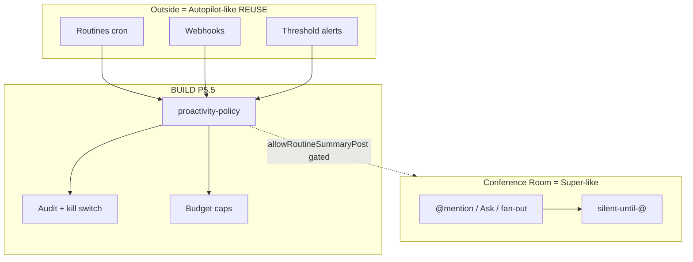

# P5.5 — Proactivity Policy (Path B+): Whitelist, Kill Switch, Audit, Budget

> **Versão:** 1.0  
> **Data:** 2026-07-09  
> **Ciclo:** 5C — Hybrid tech specs (Path B+)  
> **Agente:** Cycle 5 Tech Spec #4  
> **Repo de implementação:** fork `/Users/macbook/Projects/paperclip` (`QuadriniL/paperclip`)  
> **Pré-requisitos hard:** **P5** (métricas Room + spike memória) + **Routines/cron/webhooks** (REUSE C10)  
> **Pré-requisitos soft:** P0 (silent-until-@); P1.5 (Ask ≠ ambient); P2.5 (badge proactive); P4 (budgets/costs)  
> **Design âncora:** [`../cycle-3c-hybrid-deep-dive/04-proactivity-governance.md`](../cycle-3c-hybrid-deep-dive/04-proactivity-governance.md)  
> **Antecessor 5B:** [`../cycle-5b-clickup-tech-specs/P5.5-proactivity-policy-SPEC.md`](../cycle-5b-clickup-tech-specs/P5.5-proactivity-policy-SPEC.md) — este doc **supersede** para Path B+ (kill/AOR/budget)  
> **BizCursor desktop:** fora de escopo  
> **Decisões:** **D-09** Path B+ · **D-10** silent-until-@ + whitelist · **D-11** KPIs fora do stream · **R-02** Autopilot ≠ Super  
> **Confiança:** Alta — C10 routines CONFIRMED; policy BUILD; Claim 5 thresholds CONFIRMED

`NotebookLM: skip (non-Villa) — Paperclip Path B+ P5.5 tech spec`

---

## 1. Contexto

### 1.1 Por que P5.5 existe (Path B+)

Path B+ separa duas superfícies (Cycle 2C Claim 2 **CONFIRMED** + R-02):

| Superfície | Analogia ClickUp | Comportamento |
|------------|------------------|---------------|
| **Conference Room** | Super Agents (human-like) | **Silent-until-`@`** / Ask / fan-out autorizado |
| **Routines / cron / webhook** | Autopilot Agents | Trigger/condition **fora** do stream — **REUSE** |
| **Policy** | Brain usage alerts | **BUILD** `proactivity-policy` + kill + audit + budget |

Sem P5.5:

- Routines “parecem” Autopilot **na sala** (agent washing).  
- Webhooks acordam agentes sem owner.  
- BoardChat legado (C4) pode voltar a concierge sempre ligado.  
- Budget 80/90/100 não tem sink governado (Claim 5).  
- Não há kill switch de um clique para wakes Autopilot-like.

**P5.5 entrega (Must):**

1. Schema + API `ProactivityPolicy` company-scoped + version  
2. Whitelist `TriggerKind` fechado; ambient **nunca** allow  
3. Enforce `assertTriggerAllowed` nos hot paths (heartbeat, routines, webhooks, Ask, BoardChat)  
4. Kill switch L1 (company) + fail-closed Room  
5. Audit log (updated / denied / allowed / kill / budget_blocked / room_post)  
6. Budget caps 80/90/100 → Inbox (não spam Room)  
7. Agent-of-record (AOR) para posts Room **gated, default OFF**  
8. Deep-links Routines/Webhooks — **não** segunda UI de cron

### 1.2 Problema

| Primitive hoje | Risco sem policy |
|----------------|------------------|
| `routines.ts` + UI Routines | Schedule acorda agente; post na Room issue → spam |
| `cron.ts` | Jobs opacos sem audit de kind |
| `cursor-webhook-ingest.ts` | Eventos externos sem whitelist |
| `webhook-trigger-rate-limit.ts` | Rate limit existe; policy não |
| BoardChat P0 | Silent ok — outros paths podem furar |
| C4 board-chat + `claude` skill | Concierge sempre ligado se não migrar |
| C2 `POST delegate` agent-only | Posts “sistema” na Room precisam AOR server-side |
| Costs / budgets | Thresholds sem sink Inbox unificado |

### 1.3 Escopo

| Dentro P5.5 | Fora P5.5 (Won't) |
|-------------|-------------------|
| Policy schema + Editor Board + enforce | Ambient agents na Conference Room |
| Whitelist + blacklist ambient | Autopilot ML “quando ser proativo” |
| Kill L0–L2 (L3 = pause agent já Costs) | Substituir Routines CRUD |
| Audit + budget 80/90/100 Inbox | Fail-open Room se policy corrupt |
| AOR gated default OFF | Spawn `claude` CLI Coolify (PR-F3) |
| Deep-link Routines/Webhooks | Humano browser `POST delegate` (C2) |
| Docs Sofia “Routines ≠ Room” | BizCursor desktop |

### 1.4 Dependências

```
P0 silent-until-@ ──┐
P1.5 work_request ──┤
P4 budgets ─────────┼──► P5 (métricas Room) ──► P5.5 (este) ──► P6 anti-washing
Routines REUSE ─────┘         ▲
                              │
                    cron + webhook ingest (C10)
```

| Dep | Papel em P5.5 |
|-----|---------------|
| **P5** | Métricas `ambient_blocked` / wake counts; KPI K4 = 0 ambient; dashboard fora do stream (D-11) |
| **Routines** | Canal Autopilot-like oficial; `assertTriggerAllowed(routine_schedule)` no fire |
| **P0** | Regra Room imutável; P5.5 reforça + métrica se path tentar furar |
| **P4** | Cap spend; limiares 80/90/100; sink Inbox |
| **P1.5** | Kind `work_request`; `POLICY_BLOCKED` se whitelist off |
| **P2.5** | Badge `proactiveOutsideRoom` (Should) |

### 1.5 Cenário canônico

```
Board → Company Settings → Proactivity:
  Kill switch L1: OFF (proactive wakes ON)
  ✅ mention / work_request / issue_assignment
  ✅ routine_schedule / webhook_event / manual_wakeup / delegation_child
  ☐ threshold_alert auto-run (alerts always on → Inbox)
  Routine → Room post: with_explicit_mention_only
  AOR Room post flag: OFF

Sofia na Room posta sem @: 0 wakes (P0 + P5.5).
Routine 9h: CEO run FORA do chat → issue/Inbox.
Budget 90%: rate-limit routines; 100%: block novos wakes Autopilot-like.
Incident: Board liga Kill L1 → routines/webhooks param; @mention continua.
```

### 1.6 Premissas

- P0 silent path implementado no BoardChat / room-orchestrator.  
- Routines/webhooks já disparam wakes por outros canais (C10 CONFIRMED).  
- Feature flag `enableProactivityPolicyV1` controla **editor**; deny ambient Room é **fail-safe** mesmo com flag off.  
- `enableProactiveRoomPostViaAor` default **false**.

### 1.7 Glossário

| Termo | Definição |
|-------|-----------|
| **Trigger kind** | Tipo de evento que pode iniciar trabalho de agente |
| **Whitelist** | Allow-list; default deny unknown |
| **Room ambient** | Agente responde/posta na Room sem `@` / Ask / mention |
| **Outside room** | Routines, webhooks, heartbeats, issues não-Room, Inbox |
| **Kill switch L1** | Bloqueia kinds Autopilot-like; mantém mention / work_request / issue_assignment |
| **AOR** | Agent-of-record — identidade server-side para post/orquestração (não licença ambient) |
| **Policy** | JSON versionado company + enforce server-side |

---

## 2. Relação com o resto do projeto

```
┌─────────────────────────────────────┐
│ ProactivityPolicyEditor (Board)     │
│  kill · whitelist · AOR · budget UI │
└──────────────┬──────────────────────┘
               │ PUT policy
               ▼
┌─────────────────────────────────────┐
│ proactivity-policy.ts               │
│  validate · cache · assert · audit  │
└──────────────┬──────────────────────┘
               │ checked by
     ┌─────────┼──────────┬────────────┬──────────┐
     ▼         ▼          ▼            ▼          ▼
 BoardChat  routines   webhooks   work-request  heartbeat
 room-orch  cron       ingest     (P1.5)        wakeup
```

### 2.1 REUSE obrigatório (fork — não reinventar Autopilot)

| Capacidade | Path absoluto | Papel Path B+ |
|------------|---------------|---------------|
| Routines service | `/Users/macbook/Projects/paperclip/server/src/services/routines.ts` | Motor schedule + fire |
| Routines routes | `/Users/macbook/Projects/paperclip/server/src/routes/routines.ts` | API CRUD / fire |
| Routines UI | `/Users/macbook/Projects/paperclip/ui/src/pages/Routines.tsx`, `RoutineDetail.tsx` | Superfície Autopilot-like oficial |
| Plugin routines | `/Users/macbook/Projects/paperclip/server/src/services/plugin-managed-routines.ts` | Extensão — mesmo assert |
| Cron | `/Users/macbook/Projects/paperclip/server/src/services/cron.ts` | Scheduler |
| Cursor webhook ingest | `/Users/macbook/Projects/paperclip/server/src/services/cursor-webhook-ingest.ts` | Event proactivity |
| Webhook rate limit | `/Users/macbook/Projects/paperclip/server/src/services/webhook-trigger-rate-limit.ts` | Anti-abuso (já existe) |
| Heartbeat / wakeup | `/Users/macbook/Projects/paperclip/server/src/services/heartbeat.ts` | Hot path `assertTriggerAllowed` |
| Board chat | `/Users/macbook/Projects/paperclip/server/src/routes/board-chat.ts` · UI `BoardChat.tsx` | Silent + métrica |
| Instance / company settings | `/Users/macbook/Projects/paperclip/server/src/services/instance-settings.ts` · `CompanySettings.tsx` | Persistência / embed |
| Access | `/Users/macbook/Projects/paperclip/server/src/services/access.ts` | Board-only PUT |
| Costs / budgets | services Costs (P4) | Limiares 80/90/100 |

**UI copy:** “Rotina” / “Agendamento proativo” — **nunca** “Autopilot na sala”.

---

## 3. Regra de ouro (D-10)

| Superfície | Default | Pode ser proativo? |
|------------|---------|-------------------|
| **Conference Room** | Silent-until-`@` | **Não** — salvo whitelist explícita + AOR gated (§6) |
| **Routines / cron / webhook** | Dispara fora do stream | **Sim** — catálogo + policy |
| **Issue assign / work-request** | Wake por pedido humano | **Sim** — intake, não ambient |
| **Inbox / Approvals / Costs** | Sistema → humano | N/A |

> Ambient “sempre ouvindo o canal” = **REJECT**.



---

## 4. Requisitos funcionais (RF-P55-XX)

### 4.1 Modelo de policy

| ID | Requisito | MoSCoW |
|----|-----------|--------|
| **RF-P55-01** | Persistir `ProactivityPolicy` por `companyId` (JSON versionado + `updatedAt` + `updatedByUserId`) | Must |
| **RF-P55-02** | Schema Zod com `triggerWhitelist: TriggerKind[]` | Must |
| **RF-P55-03** | `TriggerKind` v1 fechado: `mention`, `work_request`, `issue_assignment`, `routine_schedule`, `webhook_event`, `threshold_alert`, `manual_wakeup`, `delegation_child` | Must |
| **RF-P55-04** | Kinds **proibidos** sempre: `room_ambient`, `room_auto_reply` — não aparecem como allow | Must |
| **RF-P55-05** | Default seed: allow todos os kinds humanos + Autopilot-like listados; `threshold_alert` = notify-only (`thresholdAlertAutoRun: false`) | Must |
| **RF-P55-06** | `room.postWithoutMentionWakesAgent: false` **imutável** (sempre false; PUT true → 400) | Must |
| **RF-P55-07** | `room.allowRoutineSummaryPost: "never" \| "as_human_owner_comment" \| "with_explicit_mention_only"` default `with_explicit_mention_only` | Must |
| **RF-P55-08** | Version bump em todo PUT; GET retorna versão | Must |
| **RF-P55-31** | Campo `proactivity.enabled` (kill L1); default `true` | Must |
| **RF-P55-32** | Campo `enableProactiveRoomPostViaAor` default `false` | Must |

### 4.2 ProactivityPolicyEditor UX

| ID | Requisito | MoSCoW |
|----|-----------|--------|
| **RF-P55-09** | Seção Company Settings: **Proactivity** | Must |
| **RF-P55-10** | Checklist whitelist com descrição humana por kind | Must |
| **RF-P55-11** | Callout fixo: “Conference Room nunca responde sem @ / Ask” (não configurável) | Must |
| **RF-P55-12** | Links: Gerenciar Routines · Webhooks/Adapters · Conference Room | Must |
| **RF-P55-13** | Só Board/admin edita; Operator read-only | Must |
| **RF-P55-14** | Preview: “Se desligar routine_schedule, N routines ficam blocked” | Should |
| **RF-P55-15** | Diff da versão anterior | Could |
| **RF-P55-33** | Kill switch L1 **um clique** acima da whitelist | Must |
| **RF-P55-34** | Toggle avançado AOR Room post (default off) + warning | Must |
| **RF-P55-35** | Painel audit: últimos 50 eventos (triggerId, agent, sink, allow/deny) | Must |
| **RF-P55-36** | Indicadores budget 80/90/100 (read-only; deep-link Costs) | Must |

### 4.3 Enforce server-side

| ID | Requisito | MoSCoW |
|----|-----------|--------|
| **RF-P55-16** | Antes de wakeup com reason → `TriggerKind`, chamar `assertTriggerAllowed(companyId, kind, ctx)` | Must |
| **RF-P55-17** | BoardChat / room-orchestrator: msg sem mention/Ask → **não** wakeup + métrica `wake_skipped_policy` / `ambient_blocked` | Must |
| **RF-P55-18** | Routine post Room: respeitar `allowRoutineSummaryPost`; se `never`, só issue não-Room / activity | Must |
| **RF-P55-19** | Webhook → wake: `webhook_event` na whitelist; senão no wake + audit `trigger_denied` | Must |
| **RF-P55-20** | `threshold_alert`: incident/Inbox — **não** auto-run agente se `thresholdAlertAutoRun=false` | Must |
| **RF-P55-21** | Work Request (P1.5): se kind off → `POLICY_BLOCKED` | Must |
| **RF-P55-22** | Fail-open **proibido** para Room ambient; policy corrupt → deny unknown + room silent | Must |
| **RF-P55-23** | Audit: `proactivity_policy.updated`, `proactivity.trigger_denied`, `proactivity.trigger_allowed` | Must |
| **RF-P55-37** | Kill L1 on → deny `routine_schedule`, `webhook_event`, threshold auto-run; **keep** mention / work_request / issue_assignment | Must |
| **RF-P55-38** | Kill L2 (hard freeze): também bloqueia `manual_wakeup` + routines fire público; reason obrigatória | Should |
| **RF-P55-39** | Settings ilegíveis → tratar como L1 para kinds Autopilot-like; Room silent | Must |
| **RF-P55-40** | AOR Room post só se §6.2 (todas condições); senão `room_post_disabled` / `aor_disabled` | Must |
| **RF-P55-41** | Audit `proactivity.kill_switch`, `proactivity.budget_blocked`, `proactivity.room_post` | Must |
| **RF-P55-42** | Rate-limit hit → `trigger_denied` reason `rate_limited` (nunca silenciar sem log) | Must |

### 4.4 Budget caps (Claim 5)

| ID | Requisito | MoSCoW |
|----|-----------|--------|
| **RF-P55-43** | Em **80%** spend: banner + Inbox Board + badge Team Panel; **não** postar na Room | Must |
| **RF-P55-44** | Em **90%**: idem + rate-limit routines (max N runs/h configurável) | Must |
| **RF-P55-45** | Em **100%**: block novos wakes `routine_schedule` / `webhook_event`; audit `budget_blocked` | Must |
| **RF-P55-46** | Soft per-routine: cap diário runs/tokens (REUSE routine config se existir) | Should |

### 4.5 Superfícies outside room

| ID | Requisito | MoSCoW |
|----|-----------|--------|
| **RF-P55-24** | Documentar e linkar Routines como canal Autopilot-like oficial | Must |
| **RF-P55-25** | Webhooks/adapters: seção “Event proactivity” no editor | Must |
| **RF-P55-26** | Team Panel badge `proactiveOutsideRoom` (P2.5) lê routines/webhooks ∩ whitelist | Should |
| **RF-P55-27** | Não criar segunda UI de cron — reusar Routines | Must |

### 4.6 API

| ID | Requisito | MoSCoW |
|----|-----------|--------|
| **RF-P55-28** | `GET /api/companies/:id/proactivity-policy` | Must |
| **RF-P55-29** | `PUT /api/companies/:id/proactivity-policy` (Board only) | Must |
| **RF-P55-30** | `GET /api/companies/:id/proactivity-policy/effective-triggers` (debug Board) | Should |
| **RF-P55-47** | `POST /api/companies/:id/proactivity-policy/kill-switch` body `{ enabled: boolean, level?: "L1"|"L2", reason?: string }` | Must |
| **RF-P55-48** | `GET /api/companies/:id/proactivity-policy/audit?limit=50` | Must |

---

## 5. Requisitos não funcionais (RNF-P55-XX)

| ID | Requisito | Métrica |
|----|-----------|---------|
| **RNF-P55-01** | Check de policy no hot path wakeup | p99 add &lt; 5 ms (cache in-memory TTL 30s) |
| **RNF-P55-02** | Strict TS + Zod | — |
| **RNF-P55-03** | Slice ≤ 6 arquivos core + edits pontuais hot paths | — |
| **RNF-P55-04** | Coolify-safe: default deny ambient mesmo com editor flag off | — |
| **RNF-P55-05** | Testes unitários enum exhaustiveness (`never` check) | — |
| **RNF-P55-06** | Sem secrets na policy JSON | — |
| **RNF-P55-07** | Multi-tenant: sempre `companyId` scoped | — |
| **RNF-P55-08** | Audit append-only; retenção alinhada activity log (≥ 90d beachhead) | — |
| **RNF-P55-09** | Kill L1 latência: próximo wakeup já vê estado (invalidate cache) | &lt; 1s tipicamente |

---

## 6. Agent-of-record (AOR) — posts proativos na Room

### 6.1 Por que existe

Cycle 2C **C2 CONFIRMED:** `POST .../delegate` exige actor = agent. Humano no browser **não** orquestra A2A direto (PR-F1). Qualquer post/orquestração “em nome do sistema” na Room precisa de **AOR** — host run server-side.

AOR é **identidade de execução**, não licença para falar sozinho.

### 6.2 Condições (todas obrigatórias)

1. `room.allowRoutineSummaryPost` ≠ `never`; **e**  
2. Template da rotina inclui ≥1 `agent://` mention **ou** mode `as_human_owner_comment`; **e**  
3. Whitelist contém `routine_schedule` (ou kind mapeado); **e**  
4. `enableProactiveRoomPostViaAor` = **true** (default **false**); **e**  
5. Rate limit por routine/dia + budget OK; **e**  
6. Kill switch L1/L2 **off** para kinds relevantes; **e**  
7. Mensagem marcada `source: routine:<id>` + `aorAgentId` (audit `proactivity.room_post`).

### 6.3 Matriz AOR

| Cenário | AOR | Post Room? |
|---------|-----|------------|
| Sofia `@Ops` | Agent Ops | Sim — pedido humano |
| Routine digest → issue | Agent da rotina | Não (default) |
| Routine digest → Room com `@CEO` no template + flag | AOR = agent rotina | Sim — gated |
| Webhook PR → issue + delegate | AOR no child | Não ambient Room |
| “Concierge responde tudo” | — | **BLOCK** |

### 6.4 Migração BoardChat concierge (C4)

| Hoje | Alvo Path B+ |
|------|--------------|
| Spawna `claude` + skill sempre | 0 `@` → **no agent reply** |
| Skill `paperclip-board` | Skill room: silent-until-@ + delegate |
| Coolify remoto | Adapters `cursor_cloud` / `opencode_local` — **não** CLI local |

Flag `legacyConcierge` só com opt-in Board explícito — **fora** beachhead SH default.

---

## 7. Kill switch, audit, budget — detalhe normativo

### 7.1 Níveis de kill

| Nível | Escopo | Efeito |
|-------|--------|--------|
| **L0 Room ambient** | Sempre (código) | Impossível ligar ambient |
| **L1 Company** | `proactivity.enabled = false` | Bloqueia kinds Autopilot-like; mantém mention / work_request / issue_assignment |
| **L2 Hard freeze** | Incident Board | Também `manual_wakeup` + routines fire; reason obrigatória |
| **L3 Adapter pause** | Por agent | Pause queue (já Costs/ops) — fora do core P5.5 UI |

### 7.2 Audit — campos mínimos

| Evento | Campos |
|--------|--------|
| `proactivity_policy.updated` | companyId, version, actorUserId, diff summary |
| `proactivity.trigger_denied` | kind, reason, agentId?, sink, sourceId |
| `proactivity.trigger_allowed` | kind, sink, triggerId, aorAgentId? |
| `proactivity.room_post` | routineId, aorAgentId, mentionCount |
| `proactivity.kill_switch` | on/off, level, actorUserId, reason? |
| `proactivity.budget_blocked` | window, spend, cap, kind? |

### 7.3 Pseudocontrato de decisão

```ts
type TriggerKind =
  | "mention"
  | "work_request"
  | "issue_assignment"
  | "routine_schedule"
  | "webhook_event"
  | "threshold_alert"
  | "manual_wakeup"
  | "delegation_child";

type DenyReason =
  | "not_whitelisted"
  | "ambient_forbidden"
  | "rate_limited"
  | "budget_blocked"
  | "kill_switch"
  | "room_post_disabled"
  | "aor_disabled";

type ProactivityDecision =
  | { allow: true; sink: "issue" | "inbox" | "room"; triggerId: string; kind: TriggerKind }
  | { allow: false; reason: DenyReason };
```

`room_ambient` / `room_auto_reply` → sempre `{ allow: false, reason: "ambient_forbidden" }`.

---

## 8. MoSCoW (resumo Path B+)

| Must | Should | Could | Won't |
|------|--------|-------|-------|
| Policy + deny ambient + enforce | Preview impact routines | Diff versões | Ambient Room |
| Editor + callout + kill L1 | Effective-triggers API | AOR opt-in post UI polish | Autopilot ML |
| Audit denied/allowed/updated/kill/budget | Team badge P2.5 | Auto-pause `thr.agent_error_rate` | Substituir Routines |
| Budget 80/90/100 Inbox | Soft freeze L2 + reason | Export audit CSV | Fail-open Room |
| AOR gated default OFF | Rate-limit dashboard | — | Claim “sala pensante” / CLI concierge |
| Deep-links Routines | — | — | Browser POST delegate |

---

## 9. UX

### 9.1 Editor (Board)

```
┌ Proactivity ─────────────────────────────────────┐
│ ⚠ Conference Room: silent until @ / Ask          │
│   (não configurável — D-10)                      │
│                                                  │
│ [ Kill switch: Proactive wakes OFF ]  ← L1       │
│                                                  │
│ Allowed triggers (whitelist)                     │
│ [x] @mention / Room Ask                          │
│ [x] Work Request                                 │
│ [x] Issue assignment                             │
│ [x] Routine schedule      → Gerenciar Routines   │
│ [x] Webhook events        → Adapters             │
│ [x] Manual wakeup                                │
│ [x] Delegation child                             │
│ [ ] Threshold → auto-run (alerts always on)      │
│                                                  │
│ Routine → Room post:                             │
│  ( ) never  (•) only with @mention               │
│  ( ) as owner comment (no wake)                  │
│                                                  │
│ Agent-of-record Room post: [ ] enable (advanced) │
│                                                  │
│ Budget: 80% / 90% / 100% alerts → Inbox          │
│ Audit: últimos 50 eventos                        │
│ [Save policy]                                    │
└──────────────────────────────────────────────────┘
```

### 9.2 Sofia

- Não configura triggers.  
- Help Room: “Agentes só falam se você pedir (@ ou Pedir ao agente). Automações ficam em Routines.”  
- Meta K4 = **0** surpresas sem `@`.  
- Ask bloqueado → copy `POLICY_BLOCKED` (P1.5).

### 9.3 Matriz rápida

| Quero… | Use | Não use |
|--------|-----|---------|
| Resposta agora no canal | `@` / Ask | Routine ambient |
| Relatório diário | Routine → issue/Inbox | Post ambient Room |
| Alerta de verba | Threshold 80/90/100 | Agente spam no chat |
| Revisar todo PR | Webhook → issue+delegate | Brain ambient |
| “IA que escuta tudo” | — | **REJECT** |

### 9.4 A11y

- Checkboxes nomeados; callout `role="note"`.  
- Kill switch: confirmação + `aria-pressed`.  
- Save com confirmação se remover `routine_schedule` ou ligar kill L1.

---

## 10. Arquitetura (paths absolutos)

### 10.1 Novos (BUILD)

| Peça | Path |
|------|------|
| Service | `/Users/macbook/Projects/paperclip/server/src/services/proactivity-policy.ts` |
| Types/Zod | colado no service se &lt; 400 linhas, senão `proactivity-policy.types.ts` |
| Route | `/Users/macbook/Projects/paperclip/server/src/routes/proactivity-policy.ts` |
| Editor | `/Users/macbook/Projects/paperclip/ui/src/components/proactivity/ProactivityPolicyEditor.tsx` |
| Hook | `/Users/macbook/Projects/paperclip/ui/src/hooks/useProactivityPolicy.ts` |
| Tests | `/Users/macbook/Projects/paperclip/server/src/services/proactivity-policy.test.ts` |

### 10.2 Editar (hooks de enforce)

| Peça | Path | Mudança |
|------|------|---------|
| Heartbeat wakeup | `.../heartbeat.ts` | `assertTriggerAllowed` |
| Routines | `.../routines.ts` | Gate schedule + room post + AOR |
| Plugin routines | `.../plugin-managed-routines.ts` | Mesmo assert |
| Webhook ingest | `.../cursor-webhook-ingest.ts` | Gate `webhook_event` |
| Board chat / room | `.../board-chat.ts` (+ room-orchestrator) | Ambient deny + metrics |
| Work request | `.../work-request.ts` | Gate `work_request` |
| Company settings | `.../CompanySettings.tsx` | Embed editor |
| Routes index | `.../routes/index.ts` | Mount |
| Costs/budget | P4 services | Emit threshold → policy sink |

### 10.3 Schema normativo

```ts
const TriggerKindSchema = z.enum([
  "mention",
  "work_request",
  "issue_assignment",
  "routine_schedule",
  "webhook_event",
  "threshold_alert",
  "manual_wakeup",
  "delegation_child",
]);

const ProactivityPolicySchema = z.object({
  version: z.number().int().positive(),
  enabled: z.boolean().default(true), // kill L1 inverted: false = killed
  triggerWhitelist: z.array(TriggerKindSchema),
  room: z.object({
    postWithoutMentionWakesAgent: z.literal(false),
    allowRoutineSummaryPost: z.enum([
      "never",
      "as_human_owner_comment",
      "with_explicit_mention_only",
    ]),
  }),
  thresholdAlertAutoRun: z.boolean().default(false),
  enableProactiveRoomPostViaAor: z.boolean().default(false),
  hardFreeze: z
    .object({
      active: z.boolean(),
      reason: z.string().min(1).optional(),
      actorUserId: z.string().optional(),
    })
    .optional(),
});
```

Exhaustive switch ao mapear `wakeupReason → TriggerKind` com `never` check.

### 10.4 Mapeamento reason → kind

| Wakeup / event reason | TriggerKind |
|-----------------------|-------------|
| `conference_room_mentioned` | `mention` |
| `work_request` | `work_request` |
| `issue_assigned` | `issue_assignment` |
| `routine_tick` | `routine_schedule` |
| `cursor_webhook` / generic webhook | `webhook_event` |
| `budget_threshold` | `threshold_alert` |
| `manual` / Board wakeup | `manual_wakeup` |
| `delegation_child_completed` | `delegation_child` |
| `room_ambient_*` | **deny always** |

### 10.5 Catálogo operacional (IDs estáveis)

**Schedule:** `sched.cron` (REUSE agora) · `sched.weekday_digest` · `sched.monthly_cost_report`  
**Event:** `event.issue_labeled` · `event.pr_opened` · `event.approval_timeout` · `event.delegation_child_failed` · `event.cursor_webhook`  
**Threshold:** `thr.budget_80` / `_90` / `_100` · `thr.agent_error_rate` · `thr.queue_depth`  
**Ambient blacklist:** `ambient.room_listen` · `ambient.boardchat_concierge_always` · `ambient.dm_unsolicited` · `ambient.rewrite_others_messages` — todos **BLOCK**

---

## 11. Smoke tests (ST-P5.5-XX)

| ID | Cenário | Pass |
|----|---------|------|
| **ST-P5.5-01** | Room mensagem sem `@` → 0 wakes (policy default) | Regressão P0 + D-10 |
| **ST-P5.5-02** | Remover `routine_schedule` da whitelist → routine tick não cria run | Enforce |
| **ST-P5.5-03** | Webhook com `webhook_event` off → no wake + audit `trigger_denied` | Enforce |
| **ST-P5.5-04** | Ask/Work Request com `work_request` off → `POLICY_BLOCKED` | P1.5 |
| **ST-P5.5-05** | Operator GET policy ok; PUT 403 | Authz |
| **ST-P5.5-06** | PUT `postWithoutMentionWakesAgent: true` → 400 | Immutable |
| **ST-P5.5-07** | `allowRoutineSummaryPost=never` → routine não comenta na Room issue | Post rules |
| **ST-P5.5-08** | `with_explicit_mention_only` → post com `@agent` pode wake; sem `@` não | Post rules |
| **ST-P5.5-09** | Editor mostra callout silent Room + kill switch | UI |
| **ST-P5.5-10** | Policy JSON corrupt → deny unknown + room silent | Fail-closed |
| **ST-P5.5-11** | Deep-link Routines a partir do editor | Nav |
| **ST-P5.5-12** | Threshold alert cria Inbox/incident sem auto-run (`thresholdAlertAutoRun=false`) | Behavior |
| **ST-P5.5-13** | Kill L1 ON → routine/webhook wake denied; `@mention` ainda funciona | Kill |
| **ST-P5.5-14** | Kill L1 ON → audit `proactivity.kill_switch` + `trigger_denied` reason `kill_switch` | Audit |
| **ST-P5.5-15** | Budget 100% → novos `routine_schedule`/`webhook_event` blocked + `budget_blocked` | Budget |
| **ST-P5.5-16** | Budget 80%/90% → Inbox/banner; **0** posts ambient na Room | Budget UX |
| **ST-P5.5-17** | AOR flag OFF → routine não posta na Room mesmo com mention no template | AOR default |
| **ST-P5.5-18** | AOR flag ON + todas condições §6.2 → post Room com `source: routine:` + audit `room_post` | AOR gated |
| **ST-P5.5-19** | Rate-limit webhook → `trigger_denied` `rate_limited` (log presente) | Rate |
| **ST-P5.5-20** | Plugin-managed routine passa pelo mesmo `assertTriggerAllowed` | Parity |
| **ST-P5.5-21** | Métrica P5: `ambient_blocked` incrementa se path tentar ambient | Dep P5 |
| **ST-P5.5-22** | Settings ilegíveis → Autopilot-like denied; Room silent | Fail-safe |

**Nota:** Se P1.5 ainda não merged, **ST-P5.5-04** skip documentado. Se P5 métricas ainda não merged, **ST-P5.5-21** skip com issue de follow-up — enforce Room ainda Must via ST-01/10.

---

## 12. Definição de pronto (DoD)

- [ ] RF Must Path B+ implementados (incl. kill, audit, budget, AOR gated)  
- [ ] ST-P5.5-01…22 verdes (skips documentados se deps parciais)  
- [ ] Editor em Company Settings (Board) com callout + kill + audit 50  
- [ ] Enforce nos hot paths §10.2 (incl. plugin routines)  
- [ ] Routines REUSE — zero segunda UI cron  
- [ ] Docs Sofia PT-BR: “Proatividade fora da sala”  
- [ ] Anti-claim: UI/marketing **não** diz “Autopilot na Conference Room”  
- [ ] Cache policy + testes exhaustive switch  
- [ ] KPI K4 ambient wake count = **0** no beachhead  
- [ ] Dep P5: contadores `ambient_blocked` / wake kind instrumentados ou skip explícito  

---

## 13. Riscos

| Risco | Impacto | Mitigação |
|-------|---------|-----------|
| Path de wakeup esquecido sem gate | Ambient leak | Inventário reasons + deny-by-default unknown |
| Routines “quebram” após save/kill | Ops pain | Preview impact + confirm dialog + audit |
| Confusão Sofia (agente não fala) | UX | Callouts Room + POLICY_BLOCKED |
| Policy complexa demais | Adoção | Whitelist simples v1; sem DSL |
| Plugin-managed routines bypass | Edge | Mesmo assert no plugin path (ST-20) |
| AOR mal configurado → spam Room | Trust | Default OFF + rate + audit |
| Budget false positive 100% | Ops | Soft window + Board override L1 off after review |
| Conflito com legacyConcierge | Regressão | Flag opt-in; beachhead SH default off |

---

## 14. Métricas de sucesso (fora do stream — D-11)

| Métrica | Alvo beachhead |
|---------|----------------|
| K4 Ambient wake count | **0** |
| Routine runs com sink Room | 0 se post disabled / AOR off |
| Wakes com `triggerId` / kind null | → 0 após migração |
| `trigger_denied` rate | monitorar; spikes investigados |
| Kill switch activations | auditável |
| Budget block events | correlacionar com Costs P4 |
| Sofia “surpreendida” sem `@` | 0 (interview / quiz) |

---

## 15. Ordem de implementação sugerida

1. Schema Zod + persistência + seed default + cache TTL.  
2. `assertTriggerAllowed` + unit tests exhaustive.  
3. Hooks: heartbeat → routines → webhook → board-chat → work-request → plugin.  
4. Kill L1 API + invalidate cache.  
5. Budget hooks (P4) → deny + Inbox.  
6. Audit store + GET últimos 50.  
7. Editor UI + callout + deep-links.  
8. AOR gated (flag default off) — último Must.  
9. Should: effective-triggers, preview, L2, badge P2.5.  
10. Docs Sofia + anti-washing checklist → handoff P6.

---

## 16. Referências

- Design 3C: [`../cycle-3c-hybrid-deep-dive/04-proactivity-governance.md`](../cycle-3c-hybrid-deep-dive/04-proactivity-governance.md)  
- Confirm 2C ClickUp: [`../cycle-2c-hybrid-confirmation/01-clickup-claims-confirm.md`](../cycle-2c-hybrid-confirmation/01-clickup-claims-confirm.md) (Claim 2, 5)  
- Confirm 2C Fork C10: [`../cycle-2c-hybrid-confirmation/03-fork-code-confirm.md`](../cycle-2c-hybrid-confirmation/03-fork-code-confirm.md)  
- Plano 4C: [`../cycle-4c-hybrid-plan/00-PRODUCT-PLAN-HYBRID-V2.md`](../cycle-4c-hybrid-plan/00-PRODUCT-PLAN-HYBRID-V2.md) §P5.5  
- SPEC 5B (antecessor): [`../cycle-5b-clickup-tech-specs/P5.5-proactivity-policy-SPEC.md`](../cycle-5b-clickup-tech-specs/P5.5-proactivity-policy-SPEC.md)  
- P5 métricas: [`../cycle-5-tech-specs/P5-memory-metrics-SPEC.md`](../cycle-5-tech-specs/P5-memory-metrics-SPEC.md)  
- P0 silent: [`../cycle-5-tech-specs/P0-foundation-SPEC.md`](../cycle-5-tech-specs/P0-foundation-SPEC.md)  
- P1.5 Ask: [`../cycle-5b-clickup-tech-specs/P1.5-work-request-SPEC.md`](../cycle-5b-clickup-tech-specs/P1.5-work-request-SPEC.md)  
- P6 anti-washing: [`../cycle-5-tech-specs/P6-ga-playbooks-SPEC.md`](../cycle-5-tech-specs/P6-ga-playbooks-SPEC.md)  
- INDEX 5C: [`./00-INDEX.md`](./00-INDEX.md) (quando existir)

---

## Metadados

| Item | Valor |
|------|-------|
| Agente | Cycle 5C Tech Spec #4 |
| Path | `docs/research/slack-a2a-room/cycle-5c-hybrid-tech-specs/P5.5-proactivity-policy-SPEC.md` |
| Deps | P5 + Routines REUSE (+ soft P0/P1.5/P4) |
| Smoke | ST-P5.5-01 … ST-P5.5-22 |
| Quotes inventadas | 0 |
| Confiança | Alta |
