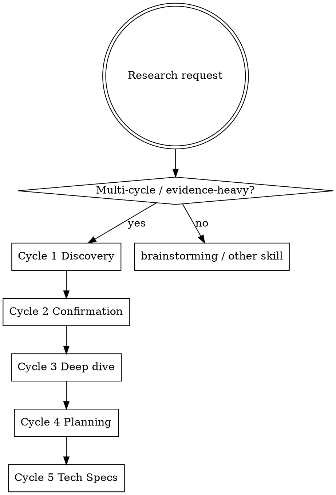

# Five-Cycle Research

Structured research methodology: discover → confirm → deepen → plan → spec. Each cycle writes artifacts to disk before the next starts. Parallel subagents (max ~10 per cycle) keep context lean.

**Core principle:** Unconfirmed discovery is not evidence. Skip confirmation → invent requirements. Invent sources → poison the plan.

**Related:** After Cycle 4, use `writing-plans` for the executable plan mirror. After Cycle 5, use `subagent-driven-development` / `executing-plans` to implement SPECs. For small feature design (not multi-cycle research), use `brainstorming` instead.

## When to Use

**Use when:**
- Product/strategy research before a large build
- User asks for multi-cycle research, source catalogs, claim confirmation, deep-dive docs, phased roadmap, or implementation SPECs
- Need parallel subagents across domains (protocol, academia, industry, codebase, verticals)
- Decision must be evidence-backed (CONFIRMED / PARTIAL / REFUTED)

**Do NOT use when:**
- Single-feature design already scoped → `brainstorming`
- Implementation of an existing SPEC/plan → `executing-plans`
- Quick factual lookup (one WebSearch / docs fetch)
- Pure code exploration without product research → `explorer`



**Hard gate:** Do not start Cycle N+1 until Cycle N artifacts are on disk and indexed. Do not implement code during Cycles 1–5 unless the user explicitly overrides.

## Checklist

Create a todo per item; complete in order:

1. **Scope + folder** — name topic; create `docs/research/<topic>/` + README stub
2. **NotebookLM gate** — Villa process overlap? If no → record skip line (see below)
3. **Cycle 1 — Discovery** — ≤10 parallel subagents; source catalogs + INDEX
4. **Cycle 2 — Confirmation** — primary quotes; grade CONFIRMED / PARTIAL / REFUTED
5. **Cycle 3 — Deep dive** — scoped docs written to disk (protocol, UX, verticals, gaps, …)
6. **Cycle 4 — Planning** — phased plan + DoD + business verticals; optional `writing-plans` mirror
7. **Cycle 5 — Tech Specs** — implementation SPECs per phase (RF/RNF, smoke, DoD)
8. **Commit** — only if user asks; one commit per cycle or one research epic commit

## Output Folder Structure

```
docs/research/<topic>/
  README.md                 # 30s verdict + how to read
  cycle-1-discovery/
    00-INDEX.md             # catalogs table + decisions so far
    <domain>-sources.md     # one catalog per subagent scope
  cycle-2-confirmation/
    00-INDEX.md             # claims matrix + product requirements
    <domain>-confirm.md     # quotes + grades
  cycle-3-deep-dive/
    00-INDEX.md
    01-<scope>.md
    02-<scope>.md
    …
  cycle-4-plan/
    00-PRODUCT-PLAN.md      # phases, DoD, verticals, decision log
  cycle-5-tech-specs/
    00-INDEX.md             # phase map + DAG
    P0-<name>-SPEC.md
    P1-<name>-SPEC.md
    …
```

Optional mirror after Cycle 4: `docs/superpowers/plans/YYYY-MM-DD-<topic>.md` via `writing-plans`.

## Parallelization Rules

- **Max ~10 subagents per cycle** (hard ceiling). Prefer 4–6 focused scopes over 10 thin ones.
- **One scope per subagent** — e.g. protocol / academia / industry / fork+code / verticals.
- **Dispatch in parallel** within a cycle; **synthesize serially** into `00-INDEX.md` before the next cycle.
- Subagents write files (or return structured catalogs the parent writes). Parent owns INDEX + cross-domain decisions.
- Do not nest five-cycle research inside a subagent unless the user asks for a sub-topic research tree.

## Cycle Details

### Cycle 1 — Discovery

**Goal:** Map the territory; collect sources; surface early product decisions.

**Do:**
- Split domains; dispatch ≤10 research subagents
- Each produces a **source catalog** (URL/title/date/why-it-matters; ~15–40 sources when external)
- Parent writes `00-INDEX.md`: catalogs table, key findings, open questions, tentative decisions

**Exit:** INDEX + catalogs on disk. No claim treated as fact yet.

### Cycle 2 — Confirmation

**Goal:** Verify top claims against primary sources and real code.

**Do:**
- Pick top claims from Cycle 1 (typically 6–8 per domain)
- WebFetch / read primary docs / read fork code — **no invented citations**
- Grade each claim: **CONFIRMED** | **PARTIAL** | **REFUTED**
- Promote confirmed findings into product requirements; list code gaps

**Exit:** Claims matrix + requirements list in `00-INDEX.md`. REFUTED items must not drive the plan.

### Cycle 3 — Deep Dive

**Goal:** Turn confirmed evidence into scoped design docs on disk.

**Do:**
- One doc per scope (examples: protocol/orchestration, UX flows, verticals/value, gap analysis REUSAR/ADAPTAR/CONSTRUIR)
- Cite Cycle 2 grades; link primary sources
- Parallelize doc authors (≤10) only after confirmation INDEX exists

**Exit:** All scoped docs + INDEX. Enough depth that planning does not re-research.

### Cycle 4 — Planning

**Goal:** Phased product plan with Definition of Done and business verticals.

**Do:**
- Decision log (locked choices + rationale pointing to Cycles 1–3)
- Roadmap phases (e.g. P0→Pn) with value, deps, DoD
- Beachhead / secondary / non-goals from verticals evidence
- Anti-hype constraints (measurable KPIs, human gate, no fluff claims)
- Optionally invoke `writing-plans` for agent-executable mirror

**Exit:** `00-PRODUCT-PLAN.md` (and optional plans mirror). User can approve before SPECs.

### Cycle 5 — Tech Specs

**Goal:** Autocontained implementation SPECs per phase.

**Do:**
- One SPEC per phase: purpose, RF/RNF, MoSCoW, UX, architecture/paths, smoke tests, DoD, risks
- INDEX with phase map, dependency DAG, links to Cycles 1–4
- SPECs must be implementable by a subagent without re-reading the chat

**Exit:** SPEC pack complete. Hand off to `subagent-driven-development` / `executing-plans`.

## NotebookLM (Villa) Gate

Before Cycle 1 (and again before Cycle 4 if process-sensitive):

| Overlap with Villa CD / Stock / Financial / Sales / §8.5? | Action |
|-----------------------------------------------------------|--------|
| **No** | Skip MCP. Record visibly: `NotebookLM: skip (non-Villa) — <topic> product/tech research` |
| **Yes** | Query NotebookLM MCP; synthesize + GO/NO-GO before continuing |
| **Unclear** | Query NotebookLM; do not assume skip |

Research-only Paperclip/A2A/product topics are typically **non-Villa** → skip with the one-line record.

## Commit Guidance

- **Default:** do not commit unless the user asks
- When asked: prefer **one commit per finished cycle** (clear bisect) or a single epic commit if user wants batch
- Message focuses on why: e.g. `docs: cycle-2 confirmation for <topic> claims`
- Never commit secrets, API keys, or raw PII from research notes

## Quick Reference

| Cycle | Artifact | Parallel? | Quality bar |
|-------|----------|-----------|-------------|
| 1 Discovery | Source catalogs + INDEX | ≤10 subagents | Coverage, not truth |
| 2 Confirmation | Graded claims + quotes | ≤10 fetches/reads | Primary sources only |
| 3 Deep dive | Scoped docs | ≤10 writers | Actionable design |
| 4 Planning | Phased plan + DoD | Mostly serial | Locked decisions |
| 5 Tech Specs | P0…Pn SPECs + INDEX | ≤10 SPEC writers | Autocontained build |

## Anti-Patterns

| Anti-pattern | Instead |
|--------------|---------|
| Skip Cycle 2 “to save time” | Confirmation is mandatory; unconfirmed ≠ requirement |
| Invent sources / fake quotes | Only cite what was fetched or read; mark UNKNOWN if missing |
| Jump to SPECs from Discovery | Complete deepen + plan first |
| One giant chat dump, nothing on disk | Every cycle writes INDEX + artifacts |
| >10 parallel subagents | Cap at ~10; merge scopes |
| Implement during research | Research cycles are docs-only unless user overrides |
| Treat marketing fluff as beachhead | Grade verticals; FLUFF / REFUTED stays out of P0 |
| NotebookLM silence on Villa topics | Query or explicit NO-GO — never quiet skip when overlap exists |

## Red Flags — STOP

- “We already know enough, skip confirmation”
- “I'll cite from memory”
- “SPEC first, research later”
- “Parallelize all five cycles at once”
- Starting Cycle 3 while Cycle 2 INDEX is empty

**All of these mean:** return to the checklist; finish the current cycle on disk before advancing.
