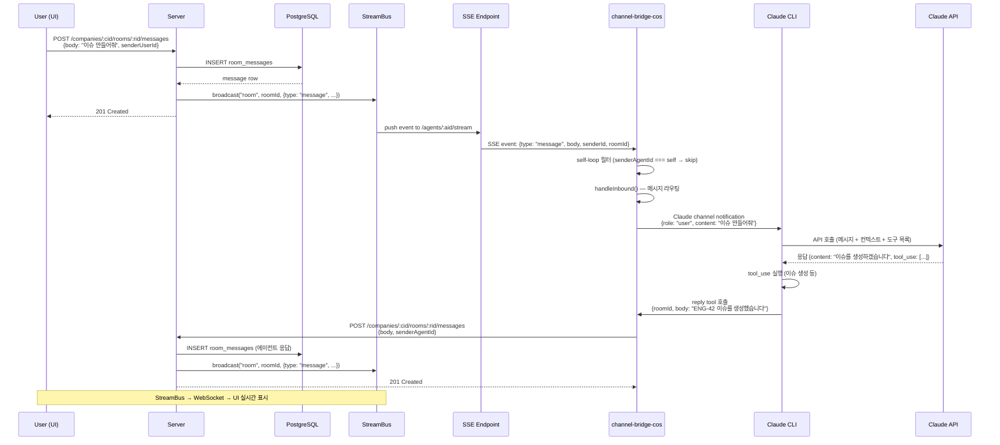
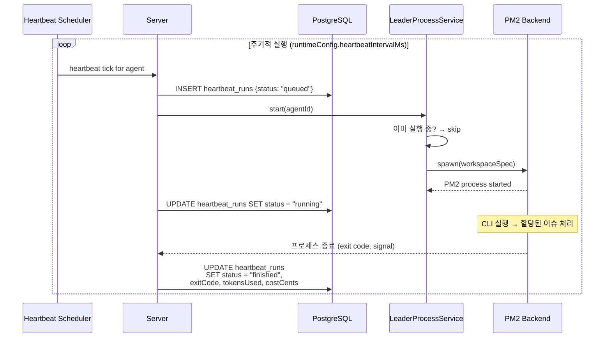
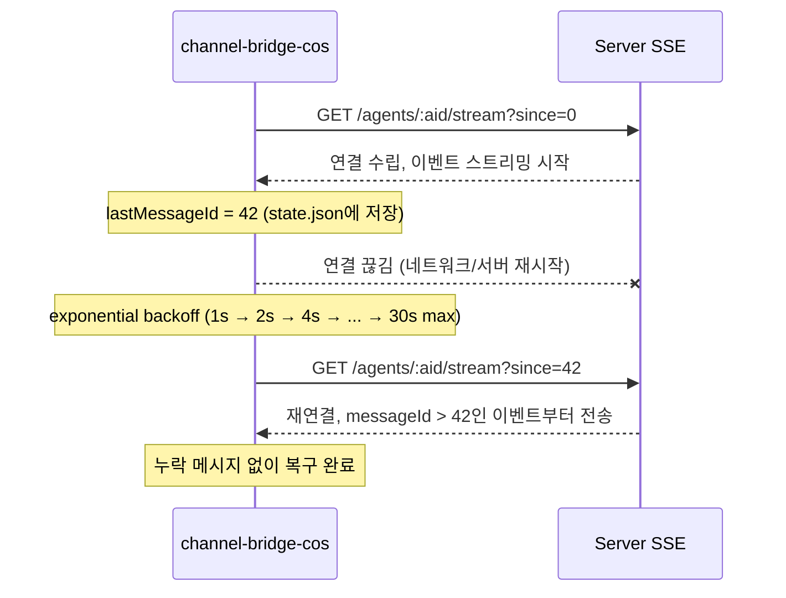
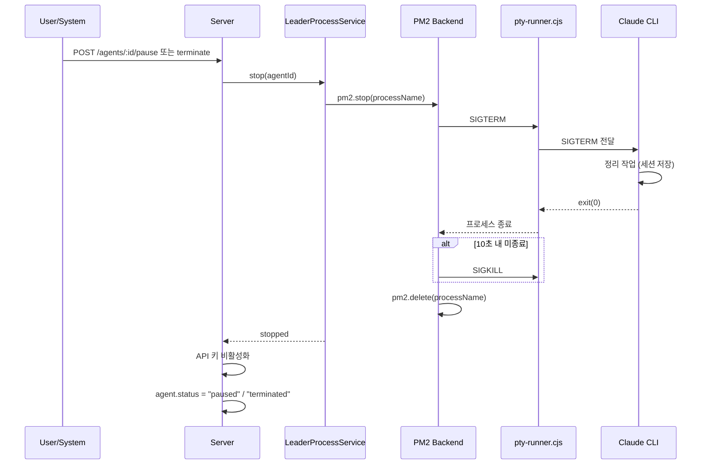

# Agent CLI Pipeline (에이전트 CLI 파이프라인)

## 목적
> 에이전트는 서버가 PM2를 통해 관리하는 **상시 실행 CLI 프로세스**로 동작한다. PTY 할당, SSE 기반 메시지 수신, channel-bridge MCP를 통해 룸 메시지를 주고받으며, 웨이크업/하트비트로 생명주기를 제어한다.

## 목표
- 에이전트별 독립 CLI 프로세스 (PM2 관리, 자동 재시작)
- PTY 할당으로 Claude CLI 인터랙티브 모드 지원
- SSE 커서 기반 메시지 수신 (재접속 시 누락 없음)
- 워크스페이스 격리 (에이전트별 독립 디렉토리, 환경변수, API 키)
- 웨이크업 → 실행 → 슬립 자율 운영 사이클

## 전체 아키텍처

```
┌──────────┐     HTTP      ┌──────────────┐     PM2      ┌──────────────┐
│  UI/User │──────────────→│    Server    │─────────────→│  pty-runner   │
│          │               │  (Express)   │              │  (node-pty)   │
└──────────┘               └──────┬───────┘              └──────┬───────┘
                                  │                             │
                           ┌──────┴───────┐              ┌──────┴───────┐
                           │   SSE 스트림  │←─────────────│  Claude CLI   │
                           │  /agents/:id │  EventSource │  (TTY 모드)   │
                           │  /stream     │              └──────┬───────┘
                           └──────────────┘                     │
                                                         ┌──────┴───────┐
                                                         │channel-bridge│
                                                         │  (MCP 서버)  │
                                                         │  reply/edit  │
                                                         └──────────────┘
```

## 프로세스 스택

```
PM2 Daemon
 └── pty-runner.cjs (node-pty 래퍼)
      └── claude CLI (--channel 모드, TTY 할당)
           └── channel-bridge-cos (MCP 서버, .mcp.json으로 자동 실행)
                └── SSE Client → Server /agents/:aid/stream
```

| 계층 | 파일 | 역할 |
|------|------|------|
| PM2 | `process-backend-pm2.ts` | 프로세스 생성/종료/상태 조회 |
| PTY | `pty-runner.cjs` | node-pty로 TTY 할당, 환경변수 필터링 |
| CLI | `claude` binary | LLM과 대화, MCP 도구 호출 |
| Bridge | `channel-bridge-cos/` | SSE 수신, reply/edit 도구 제공 |

## Sequence Diagrams

### 1. 에이전트 웨이크업 → CLI 프로세스 시작

```mermaid
sequenceDiagram
    participant U as User/System
    participant S as Server
    participant SS as AgentSessionService
    participant WP as WorkspaceProvisioner
    participant PM as PM2 Backend
    participant PTY as pty-runner.cjs
    participant CLI as Claude CLI
    participant CB as channel-bridge-cos

    U->>S: POST /agents/:id/wakeup {source, reason}

    rect rgb(40, 40, 60)
    Note over S,SS: 세션 확보
    S->>SS: ensureActive(agentId)
    SS->>SS: 기존 active 세션 있으면 재사용
    SS-->>S: session {id, workspacePath, status: "active"}
    end

    rect rgb(40, 60, 40)
    Note over S,WP: 워크스페이스 프로비저닝
    S->>WP: provision(agent, session)
    WP->>WP: mkdir ~/.cos-v2/leaders/<slug>/ (0700)
    WP->>WP: 에이전트 API 키 발급
    WP->>WP: .mcp.json 생성 (channel-bridge-cos 경로)
    WP-->>S: WorkspaceSpec {binary, args, env, cwd}
    end

    rect rgb(60, 40, 40)
    Note over S,CLI: 프로세스 시작
    S->>PM: spawn({name, script: pty-runner.cjs, args, env})
    PM->>PM: pm2.start() — fork 모드
    PM->>PTY: 프로세스 생성
    PTY->>PTY: node-pty.spawn(claude, args) — TTY 할당
    PTY->>CLI: Claude CLI 시작 (--channel 모드)
    CLI->>CLI: .mcp.json 읽기 → channel-bridge-cos 실행
    CLI->>CB: MCP 서버 초기화
    CB->>S: SSE 연결: GET /agents/:aid/stream?since=<cursor>
    S-->>CB: EventSource 연결 수립
    end

    Note over CB: 에이전트 대기 상태 — SSE로 메시지 수신 준비 완료
```



### 2. 사용자 메시지 → 에이전트 응답 (전체 흐름)



### 3. 하트비트 기반 자율 실행



### 4. SSE 재접속 및 커서 복구



### 5. 에이전트 종료 흐름



## 핵심 컴포넌트 상세

### PTY Runner (`pty-runner.cjs`)

PM2는 기본적으로 파일 기반 파이프(stdin/stdout)를 사용하지만, Claude CLI는 **인터랙티브 TTY**가 필요하다. `pty-runner.cjs`가 이 간극을 메운다.

```
PM2 → fork → pty-runner.cjs → node-pty.spawn() → Claude CLI (TTY)
```

- **TTY 타입**: `xterm-256color`
- **환경변수 필터링**: PATH, HOME, CLAUDE_PROJECT_DIR, COS_* 만 허용 (서버 시크릿 차단)
- **시그널 처리**: SIGTERM/SIGINT → CLI에 전달 → graceful shutdown
- **로깅**: exit code + signal을 stdout으로 출력 (PM2 로그에 기록)

### PM2 Backend (`process-backend-pm2.ts`)

```typescript
pm2.start({
  name: "<agentShort>-<sessionShort>",   // 프로세스 식별자
  script: "/path/to/pty-runner.cjs",      // PTY 래퍼
  args: ["claude", "--channel", "--workspace", cwd],
  cwd: workspacePath,                      // ~/.cos-v2/leaders/<slug>/
  env: {
    COS_AGENT_ID: "uuid",
    COS_SESSION_ID: "uuid",
    COS_API_URL: "http://localhost:4200",
    COS_COMPANY_ID: "uuid",
    COS_AGENT_KEY: "cos_ak_...",           // 에이전트 전용 API 키
    CLAUDE_PROJECT_DIR: "/path/to/repo",   // .claude/ 디스커버리용
  },
  autorestart: true,                       // 크래시 시 자동 재시작
  max_restarts: 10,
  restart_delay: 2000,
  exp_backoff_restart_delay: 1000,         // 지수 백오프
});
```

### Channel Bridge (`channel-bridge-cos/`)

Claude CLI의 MCP 서버로 실행되며, 서버와 CLI 사이의 **양방향 메시지 브릿지** 역할.

| 파일 | 역할 |
|------|------|
| `index.ts` | MCP 서버 초기화, `claude/channel` capability 선언 |
| `sse-client.ts` | SSE 연결 관리, 지수 백오프 재접속 (1s~30s) |
| `state.ts` | `state.json`에 lastMessageId 커서 원자적 저장 |
| `tools.ts` | `reply`, `edit_message` 도구 → Server API POST |

**수신 흐름** (Server → CLI):
```
Server StreamBus → SSE endpoint → EventSource → handleInbound()
  → self-loop 필터 (자기 메시지 무시)
  → Claude channel notification
```

**발신 흐름** (CLI → Server):
```
Claude CLI → reply tool → channel-bridge POST /rooms/:rid/messages
```

**커서 복구**: `state.json`에 마지막 수신 messageId 저장. 재접속 시 `?since=<cursor>`로 누락 없이 복구.

### Workspace Provisioner (`workspace-provisioner.ts`)

에이전트별 격리된 실행 환경을 준비.

```
~/.cos-v2/leaders/
└── <agentShort>-<sessionShort>/
    ├── .mcp.json          ← channel-bridge-cos MCP 설정
    ├── state.json         ← SSE 커서 상태
    └── (Claude CLI 세션 데이터)
```

1. 디렉토리 생성 (`0700` 퍼미션)
2. 에이전트 API 키 발급 (기존 키도 유효 유지)
3. `.mcp.json` 생성 → channel-bridge-cos를 tsx로 실행하도록 설정
4. `WorkspaceSpec` 반환 (binary path, args, env, cwd)

### Leader Process Service (`leader-processes.ts`)

에이전트 프로세스의 상태 머신.

```
stopped → starting → running → stopping → stopped
                       ↓
                     error → stopped (재시도)
```

- `start(agentId)`: 세션 확보 → 프로비저닝 → PM2 spawn
- `stop(agentId)`: PM2 stop → delete → 정리
- `restart(agentId)`: stop → start
- `isRunning(agentId)`: PM2 describe로 상태 확인

## 환경변수 흐름

```
Server (모든 환경변수 보유)
  ↓ 필터링
PM2 env (COS_* + PATH + HOME + CLAUDE_PROJECT_DIR만 전달)
  ↓
pty-runner.cjs (환경변수 allowlist 재검증)
  ↓
Claude CLI (COS_AGENT_ID, COS_API_URL 등으로 서버 인증)
  ↓
channel-bridge-cos (동일 환경변수 상속, SSE 연결에 COS_AGENT_KEY 사용)
```

## 에러 핸들링

| 시나리오 | 처리 |
|---------|------|
| CLI 크래시 | PM2 autorestart (최대 10회, 지수 백오프) |
| SSE 연결 끊김 | channel-bridge 지수 백오프 재접속 (1s~30s) |
| 서버 재시작 | PM2 데몬 독립 실행, CLI 유지. SSE 재연결 시 커서 복구 |
| PTY 할당 실패 | pty-runner exit(1) → PM2 재시작 시도 |
| API 키 만료/무효 | SSE 401 → 재접속 실패 → 에러 로그 |

## 관련 엔티티
- **Agents**: `agents.status`가 실행 상태 반영
- **Agent Sessions**: `agent_sessions`에 워크스페이스 경로, 세션 상태
- **Heartbeat Runs**: `heartbeat_runs`에 실행 이력 (토큰, 비용, exit code)
- **Rooms**: `room_messages`로 에이전트 ↔ 사용자 대화
- **Agent Wakeup Requests**: `agent_wakeup_requests`로 비동기 실행 요청

## 파일 경로

| 구분 | 경로 |
|------|------|
| PTY Runner | `server/src/services/pty-runner.cjs` |
| PM2 Backend | `server/src/services/process-backend-pm2.ts` |
| Leader Process | `server/src/services/leader-processes.ts` |
| Agent Sessions | `server/src/services/agent-sessions.ts` |
| Workspace Provisioner | `server/src/services/workspace-provisioner.ts` |
| Channel Bridge | `packages/channel-bridge-cos/src/` |
| SSE Client | `packages/channel-bridge-cos/src/sse-client.ts` |
| State Manager | `packages/channel-bridge-cos/src/state.ts` |
| Heartbeat Service | `server/src/services/heartbeat.ts` |
| Agent Routes | `server/src/routes/agents.ts` |
