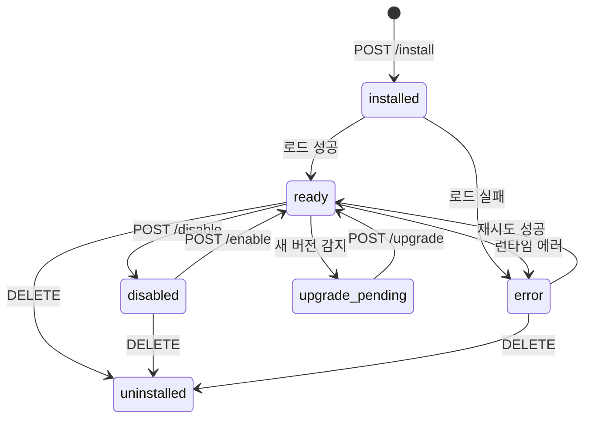

# Plugins (플러그인)

## 목적
> 코어 기능과 분리된 확장 기능을 독립 프로세스로 격리 실행. 견적/CRM, 외부 연동, 커스텀 도구 등 비즈니스 로직을 플러그인으로 관리하여 코어 오염 없이 기능 확장.

## 목표
- 플러그인별 프로세스 격리 (JSON-RPC 2.0 over stdio)
- 13개 UI 마운트 포인트로 프론트엔드 확장
- 에이전트 툴 등록 → LLM이 자연어로 플러그인 기능 호출
- Webhook, 스케줄 Job, 이벤트 버스 지원
- 스코프별 상태 저장 (instance/company/project/agent/issue)

## 아키텍처

```
┌─────────────┐     ┌──────────────┐     ┌─────────────────┐
│   UI (React) │────→│  Server API  │────→│  Plugin Worker   │
│  Bridge hooks│     │  /api/plugins│     │  (별도 프로세스)  │
│  usePluginData     │  Tool Dispatch│     │  JSON-RPC stdio  │
└─────────────┘     └──────────────┘     └─────────────────┘
                           │                      │
                    ┌──────┴──────┐         ┌─────┴─────┐
                    │  Event Bus  │         │State Store │
                    │  Job Sched  │         │Secrets     │
                    │  Stream Bus │         │Logs        │
                    └─────────────┘         └───────────┘
```

## 플러그인 라이프사이클



| 상태 | 설명 |
|------|------|
| `installed` | 설치 완료, 워커 미시작 |
| `ready` | 워커 실행 중, 이벤트/툴 수신 가능 |
| `disabled` | 운영자가 비활성화 |
| `error` | 런타임 실패 (크래시 복구 시도) |
| `upgrade_pending` | 새 버전 대기 (capability 변경 시 승인 필요) |
| `uninstalled` | 삭제됨 |

## UI 마운트 포인트

플러그인 UI는 iframe이 아닌 **같은 DOM에 ES module로 로드**. 호스트 디자인 토큰(색상, 스페이싱, 타이포) 공유.

| 슬롯 | 설명 | 활용 예시 |
|------|------|----------|
| `page` | 풀페이지 (라우트 소유: `/:company/<routePath>`) | 견적 대시보드, CRM |
| `settingsPage` | 플러그인 설정 전용 페이지 | 단가표, API 키 설정 |
| `dashboardWidget` | 회사 대시보드 위젯 | 매출 요약, 최근 견적 |
| `sidebar` | 메인 사이드바 항목 | "견적/계약" 메뉴 |
| `sidebarPanel` | 사이드바 확장 패널 | 고객 목록 |
| `projectSidebarItem` | 프로젝트 사이드바 항목 | 프로젝트별 견적 |
| `detailTab` | 엔티티 상세 탭 | 이슈에서 "견적" 탭 |
| `taskDetailView` | 태스크 상세 뷰 | — |
| `globalToolbarButton` | 상단 글로벌 툴바 버튼 | 빠른 견적 생성 |
| `toolbarButton` | 컨텍스트 툴바 버튼 | — |
| `contextMenuItem` | 우클릭 메뉴 | "이 이슈로 견적 생성" |
| `commentAnnotation` | 코멘트 어노테이션 | — |
| `commentContextMenuItem` | 코멘트 우클릭 메뉴 | — |

### UI Bridge Hooks

```typescript
// 플러그인 UI에서 워커 데이터 요청
const { data, loading } = usePluginData('quotes', { customerId: '...' });

// 워커에 액션 실행 요청
const { execute } = usePluginAction('generateQuote');
await execute({ customerName: '...', items: [...] });

// SSE 스트림 수신
usePluginStream('progress', (event) => { ... });

// 호스트 컨텍스트 (회사, 프로젝트 등)
const { companyId, projectId } = useHostContext();

// 토스트 알림
const toast = usePluginToast();
toast.success('견적서 생성 완료');
```

## 에이전트 툴 연동

플러그인이 등록한 툴은 에이전트가 LLM 대화 중 자동 호출 가능.

```
사용자: "김철수 고객 견적 만들어줘"
  ↓ LLM이 tool_use 결정
  ↓ POST /api/plugins/tools/execute
  ↓ { tool: "quote-crm:generate_quote", parameters: {...} }
  ↓ Tool Dispatcher → Registry → Worker Manager
  ↓ JSON-RPC call("executeTool", params) over stdio
  ↓ Worker 실행 → ToolResult 반환
  ↓ 에이전트가 결과를 룸에 전달
```

### 툴 등록 (Worker 측)

```typescript
// manifest.json
{ "tools": [{ "name": "generate_quote", "displayName": "견적 생성", "parametersSchema": {...} }] }

// worker.ts
ctx.tools.register("generate_quote", { ... }, async (params, runCtx) => {
  return { content: "견적 생성 완료", data: { total: 25000000 } };
});
```

## 동작 구조

### 데이터 모델

```
plugins
├── id: UUID (PK)
├── pluginKey: TEXT (UNIQUE, manifest id 정규화)
├── version: TEXT (semver)
├── apiVersion: INTEGER (default 1)
├── manifestJson: JSONB (전체 매니페스트)
├── status: TEXT (installed|ready|disabled|error|upgrade_pending|uninstalled)
├── packagePath: TEXT (로컬 설치 경로)
├── lastError: TEXT
└── installedAt, updatedAt: TIMESTAMP

plugin_config (1:1)
├── pluginId → plugins.id (CASCADE)
└── configJson: JSONB (운영자 설정)

plugin_state (스코프별 KV 저장소)
├── pluginId → plugins.id (CASCADE)
├── scopeKind: TEXT (instance|company|project|agent|issue|goal|run)
├── scopeId: TEXT
├── namespace: TEXT (default "default")
├── stateKey: TEXT
└── valueJson: JSONB

plugin_jobs (스케줄 작업)
├── pluginId → plugins.id (CASCADE)
├── jobKey: TEXT
├── schedule: TEXT (cron)
├── status: TEXT (active|paused|error)
└── lastRunAt, nextRunAt: TIMESTAMP

plugin_webhook_deliveries (인바운드 웹훅)
├── pluginId → plugins.id (CASCADE)
├── webhookKey: TEXT
├── status: TEXT (pending|processing|succeeded|failed)
├── payload: JSONB
└── headers: JSONB

plugin_logs (워커 로그, 자동 정리)
plugin_company_settings (회사별 설정)
plugin_entities (플러그인 커스텀 데이터)
```

### API

| Method | Endpoint | 설명 |
|--------|----------|------|
| GET | `/api/plugins` | 플러그인 목록 (?status= 필터) |
| GET | `/api/plugins/:id` | 플러그인 상세 (ID 또는 key) |
| POST | `/api/plugins/install` | npm 또는 로컬 경로에서 설치 |
| DELETE | `/api/plugins/:id` | 제거 (?purge=true 데이터 삭제) |
| POST | `/api/plugins/:id/enable` | 활성화 |
| POST | `/api/plugins/:id/disable` | 비활성화 |
| POST | `/api/plugins/:id/upgrade` | 업그레이드 |
| GET | `/api/plugins/:id/health` | 헬스체크 |
| GET | `/api/plugins/:id/config` | 설정 조회 |
| POST | `/api/plugins/:id/config` | 설정 저장 |
| POST | `/api/plugins/:id/config/test` | 설정 유효성 검증 (워커 RPC) |
| GET | `/api/plugins/ui-contributions` | UI 슬롯 기여 목록 |
| GET | `/api/plugins/tools` | 등록된 에이전트 툴 목록 |
| POST | `/api/plugins/tools/execute` | 에이전트 툴 실행 |
| POST | `/api/plugins/:id/webhooks/:key` | 인바운드 웹훅 수신 |
| GET | `/api/plugins/:id/jobs` | Job 목록 |
| POST | `/api/plugins/:id/jobs/:jid/trigger` | Job 수동 실행 |
| POST | `/api/plugins/:id/bridge/data` | UI→Worker 데이터 요청 |
| POST | `/api/plugins/:id/bridge/action` | UI→Worker 액션 실행 |
| GET | `/api/plugins/:id/bridge/stream/:ch` | SSE 스트림 |
| GET | `/api/plugins/:id/dashboard` | 종합 헬스 대시보드 |

### Worker 통신

```
Server ←→ Worker: JSON-RPC 2.0 over stdio (child process)

요청: { jsonrpc: "2.0", id: 1, method: "executeTool", params: {...} }
응답: { jsonrpc: "2.0", id: 1, result: { content: "...", data: {...} } }

크래시 복구: exponential backoff (1s ~ 5min)
종료: SIGTERM → 10s drain → SIGKILL (5s)
```

### Worker API (ctx 객체)

| API | 설명 |
|-----|------|
| `ctx.tools.register()` | 에이전트 툴 핸들러 등록 |
| `ctx.events.on()` / `emit()` | 이벤트 구독/발행 |
| `ctx.state.get()` / `set()` | 스코프별 상태 저장 |
| `ctx.secrets.get()` | 시크릿 조회 |
| `ctx.config` | 운영자 설정 읽기 |
| `ctx.http.fetch()` | 외부 HTTP 요청 |
| `ctx.jobs` | Job 관리 |
| `ctx.launchers` | 에이전트 런처 등록 |
| `ctx.log` | 구조화 로깅 |

## 플러그인 개발

### 디렉토리 구조

```
packages/plugins/my-plugin/
├── package.json
├── manifest.json          ← 메타데이터, 권한, UI 슬롯, 툴, Job 선언
├── src/
│   ├── manifest.ts        ← 타입 안전 매니페스트
│   └── worker.ts          ← definePlugin() + runWorker()
├── ui/                    ← React 컴포넌트 (ESM 빌드)
│   ├── Dashboard.tsx
│   └── Settings.tsx
└── dist/
    ├── worker.js          ← 빌드된 워커
    └── ui/                ← 빌드된 UI 번들
```

### 매니페스트 예시

```json
{
  "id": "com.bbrightcode.quote-crm",
  "version": "1.0.0",
  "apiVersion": 1,
  "displayName": "견적/CRM",
  "description": "견적 생성, 계약서 관리, 고객 CRM",
  "author": "BBrightCode",
  "categories": ["business"],
  "capabilities": ["tools", "ui", "state", "jobs", "webhooks"],
  "entrypoints": {
    "worker": "dist/worker.js",
    "ui": "dist/ui/index.js"
  },
  "tools": [
    {
      "name": "generate_quote",
      "displayName": "견적 생성",
      "description": "고객 정보와 항목으로 견적서 PDF 생성",
      "parametersSchema": { "type": "object", "properties": { "customerName": { "type": "string" } }, "required": ["customerName"] }
    }
  ],
  "ui": {
    "slots": [
      { "type": "page", "id": "quote-dashboard", "displayName": "견적 관리", "exportName": "QuoteDashboard", "routePath": "quotes" },
      { "type": "settingsPage", "id": "quote-settings", "displayName": "견적 설정", "exportName": "QuoteSettings" },
      { "type": "sidebar", "id": "quote-sidebar", "displayName": "견적/계약", "exportName": "QuoteSidebar" }
    ]
  }
}
```

### SDK 제공 UI 컴포넌트

`@paperclipai/plugin-sdk/ui`에서 import:

| 컴포넌트 | 용도 |
|---------|------|
| MetricCard | 숫자 지표 카드 |
| StatusBadge | 상태 배지 |
| DataTable | 데이터 테이블 |
| LogView | 로그 뷰어 |
| ActionBar | 액션 버튼 바 |
| Spinner | 로딩 스피너 |

## 관련 엔티티
- **Agents**: 에이전트가 플러그인 툴을 호출 (tool_use)
- **Companies**: 회사별 플러그인 설정 (plugin_company_settings)
- **Issues**: 이슈 컨텍스트에서 플러그인 detailTab 렌더링
- **Projects**: 프로젝트 스코프 상태 저장, projectSidebarItem
- **Rooms**: 에이전트가 룸에서 툴 결과 전달

## 파일 경로

| 구분 | 경로 |
|------|------|
| 스펙 문서 | `doc/plugins/PLUGIN_SPEC.md` |
| 개발 가이드 | `doc/plugins/PLUGIN_AUTHORING_GUIDE.md` |
| Schema | `packages/db/src/schema/plugin*.ts` |
| SDK | `packages/plugins/sdk/` |
| 예제 | `packages/plugins/examples/` |
| Services | `server/src/services/plugin-*.ts` (21개) |
| Routes | `server/src/routes/plugins.ts`, `plugin-ui-static.ts` |
| UI API | `ui/src/api/plugins.ts` |
| UI Pages | `ui/src/pages/Plugin*.tsx` |

## 제약사항
- 단일 인스턴스 전용 (수평 확장 미지원)
- 플러그인 UI는 same-origin (iframe 아님) → 보안 민감 로직은 worker에서 처리
- 스캐폴딩 도구 없음 → 예제 플러그인 복사로 시작
- `window.fetch` 직접 사용 불가 → Bridge API만 허용
