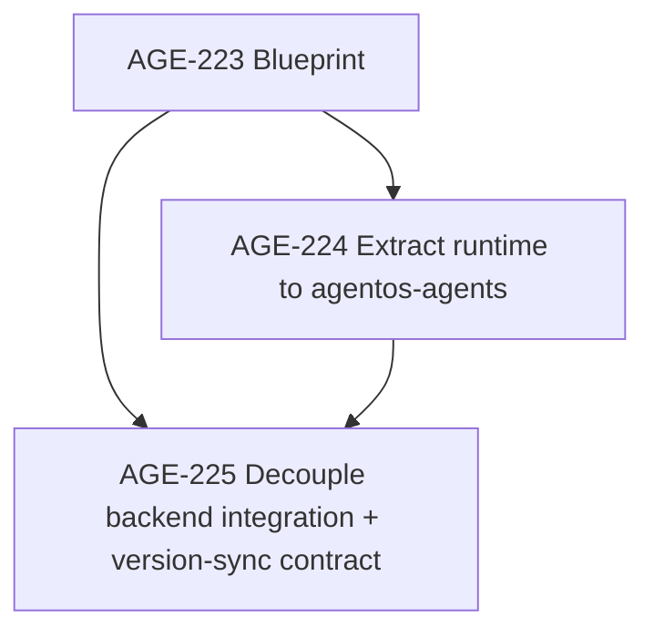

# Architecture Blueprint: Agent Runtime / Backend Separation and Provider Abstraction

Status: Proposed (AGE-223)
Owner: Backend Engineer #1
Date: 2026-05-24

## 1) Goal

Split the agent runtime from the Paperclip backend control plane while keeping model/provider logic loosely coupled so we can:

- keep Azure working now (current default in OpenCode paths),
- add OpenAI/Gemini/Grok/AWS Bedrock without backend rewrites,
- ship the runtime into a separate repo (`agentos-agents`) with a stable integration contract.

## 2) Current-state audit (coupling points)

The codebase already has strong adapter interfaces, but backend and runtime concerns are still intertwined at multiple seams.

### 2.1 Hard coupling between backend and concrete runtimes

1. `server/src/adapters/registry.ts`
   - Backend imports every concrete runtime package (`@paperclipai/adapter-claude-local`, `@paperclipai/adapter-opencode-local`, etc.) and wires model catalogs, execute handlers, skill sync, and env checks directly.
   - Effect: adding/removing providers and runtime families is a backend deployment concern.

2. `server/src/routes/agents.ts`
   - Backend route layer imports adapter-specific constants and validators (for example `DEFAULT_OPENCODE_LOCAL_MODEL`, `requireOpenCodeModelId`).
   - Effect: API behavior and validation are partly runtime-specific instead of contract-driven.

3. `server/src/services/feedback.ts`
   - Feedback parsing imports adapter-specific stream parsers directly.
   - Effect: run-observability path is coupled to concrete runtime implementations.

### 2.2 Provider logic mixed into runtime executors

1. `packages/adapters/opencode-local/src/server/execute.ts`
   - Provider is inferred from `provider/model` strings (`parseModelProvider`) and billing fallback logic is embedded in executor.
   - Effect: provider semantics are repeated per adapter family and are not standardized.

2. `packages/adapters/opencode-local/src/index.ts`
   - Default model is currently Azure (`azure/gpt-5.3-codex`) and provider/model format is adapter-defined.
   - Effect: provider defaults live in package internals rather than a system-level provider policy.

### 2.3 Data contract is runtime-friendly, but not yet runtime-isolated

- `packages/adapter-utils/src/types.ts` provides strong abstractions (`ServerAdapterModule`, model/profile discovery, session codec, runtime command spec).
- This is the right base contract, but it is consumed in-process by backend code today.
- Effect: interface exists, process boundary does not.

## 3) What we should preserve from existing OpenCode patterns

OpenCode already shows patterns we should standardize across all providers:

1. Provider/model identity is explicit (`provider/model`), not implicit.
2. Model discovery is runtime-owned (`opencode models`) and surfaced to backend as data.
3. Backend sends context and wake metadata; runtime owns CLI/process specifics.
4. Runtime validates model availability close to execution target (including remote targets).

These are good patterns; the redesign should generalize them instead of replacing them.

## 4) Target architecture

## 4.1 Boundary split

### A. Backend control plane (this repo)

Owns:

- org, issue, approval, budget, policy, and scheduling state,
- wake decisions and issue lifecycle transitions,
- run ledger, cost ingestion, and activity log persistence,
- authorization and tenancy boundaries.

Does not own:

- provider SDK calls,
- model routing decisions inside runtime,
- CLI/session mechanics for concrete agent tools.

### B. Runtime execution plane (`agentos-agents`)

Owns:

- adapter implementations,
- provider adapters and model discovery,
- session encoding/decoding and resume behavior,
- prompt assembly and runtime process orchestration.

Exposes:

- a versioned runtime API/SDK contract consumed by backend.

### C. Shared contracts package (versioned)

Create a shared package (`@agentos/runtime-contracts`, name provisional) for:

- execution request/response schemas,
- provider/model descriptor schema,
- capability flags,
- event/log envelopes,
- error families and retry hints.

Backend and runtime both depend on this contract package; neither depends on the other repo's internals.

## 4.2 Provider abstraction model

Define a provider-neutral runtime interface:

```ts
interface ProviderAdapter {
  id: string; // azure | openai | gemini | grok | bedrock | ...
  listModels(ctx: ProviderContext): Promise<ModelDescriptor[]>;
  validateModel(modelId: string, ctx: ProviderContext): Promise<ValidationResult>;
  executeTurn(req: ProviderExecutionRequest): Promise<ProviderExecutionResult>;
  quotaWindows?(ctx: ProviderContext): Promise<QuotaWindow[]>;
}
```

Key rule: backend never switches on provider IDs. It only consumes normalized descriptors and execution results.

## 4.3 Integration contract between backend and runtime

Runtime gateway operations (logical contract, transport can be in-proc first then out-of-proc):

1. `ExecuteRun` - execute one heartbeat run
2. `ListModels` - discover models for adapter/provider
3. `RefreshModels` - bypass runtime caches
4. `TestEnvironment` - adapter/env diagnostics
5. `ParseRunOutput` - normalize stdout/stderr/transcript events
6. `SyncSkills` - runtime-specific skill sync

All operations return standardized metadata:

- `provider`, `model`, `biller`, `session`, `usage`, `errorFamily`, `retryHint`.

## 4.4 Repo split plan (`agentos-agents`)

Move to new repo:

- `packages/adapters/*`
- runtime-facing portions of `packages/adapter-utils`
- parser/CLI formatters currently imported by backend for feedback rendering.

Keep in backend repo:

- server routes/services/db/migrations,
- issue lifecycle/policy engines,
- auth/billing/activity and control-plane APIs.

Add in backend repo:

- `server/src/runtime-gateway/` boundary module that is the only backend entry point to runtime execution.

## 5) Migration sequence (incremental + reversible)

### Phase 0: Contract freeze in current repo

- Introduce `runtime-gateway` interface and route all existing adapter calls through it.
- Replace direct adapter imports in route/service layers with gateway calls.
- Keep implementation in-process for zero behavior change.

### Phase 1: Provider abstraction inside runtime layer

- Introduce `ProviderAdapter` abstraction for OpenCode/Pi/Codex/Cursor paths where applicable.
- Normalize model descriptors and provider metadata.
- Keep existing `provider/model` IDs for compatibility.

### Phase 2: Extract runtime to `agentos-agents`

- Move runtime packages and publish versioned runtime bundle.
- Backend consumes runtime through contract package + gateway adapter.
- Initially run via local process bridge (same host), then allow remote runtime workers.

### Phase 3: Backend cleanup and compatibility lock

- Remove backend imports of runtime-specific constants/validators/parsers.
- Keep adapter type identifiers and API fields backward-compatible.
- Add compatibility tests that assert provider swaps require no backend code changes.

## 6) Compatibility strategy (Azure now, others later)

1. Preserve current model IDs and defaults (`azure/...` remains valid).
2. Keep provider routing in runtime config, not backend business logic.
3. Store provider/model in run metadata as plain data for analytics and billing attribution.
4. Add provider onboarding checklist with no backend code touch requirement:
   - implement `ProviderAdapter`
   - register provider in runtime catalog
   - pass contract conformance tests
   - optional billing/quota hooks

Provider targets:

- now: Azure (existing default paths)
- next: OpenAI, Gemini, Grok, AWS Bedrock

## 7) Dependency graph for downstream implementation



Execution dependencies:

1. `AGE-223` (this doc) - defines architecture contract and migration order.
2. `AGE-224` - runtime extraction and provider adapter layer in `agentos-agents`.
3. `AGE-225` - backend runtime-gateway integration, version-sync contract, and data-path migration.

Parallelization guidance:

- `AGE-224` and `AGE-225` can begin contract stubs in parallel,
- but final merge of `AGE-225` depends on runtime contract artifacts from `AGE-224`.

## 8) Risks and rollback plan

### Risks

1. Contract drift between backend and runtime versions.
2. Session resume regressions across process boundary.
3. Model discovery latency/regression when moving remote.
4. Billing metadata mismatch across providers.

### Mitigations

1. Semantic versioning + compatibility matrix in CI.
2. Golden run fixtures for session/resume behavior.
3. Cache + refresh semantics in `ListModels`/`RefreshModels` contract.
4. Contract-level required fields: `provider`, `model`, `biller`, `usage`.

### Rollback

1. Keep in-process runtime gateway implementation behind feature flag (`RUNTIME_GATEWAY_MODE=inproc|external`).
2. If external runtime fails, switch flag back to `inproc` without schema rollback.
3. Preserve old adapter registry path for one release as emergency fallback.

## 9) Verification checklist (provider swap without backend changes)

- [ ] Backend run orchestration compiles/runs without importing any concrete provider package.
- [ ] Switching agent model from `azure/...` to `openai/...` changes runtime config only.
- [ ] `ListModels` and `ExecuteRun` responses include normalized provider/model metadata.
- [ ] Cost/billing ingest path accepts provider-agnostic usage payloads unchanged.
- [ ] At least one conformance test runs same backend test suite against 2+ provider adapters with zero backend code changes.
