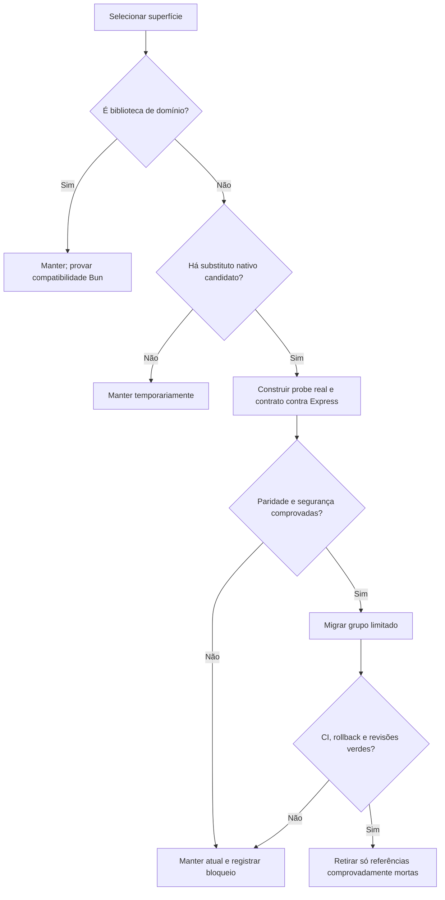
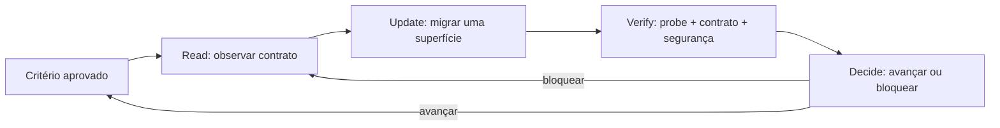
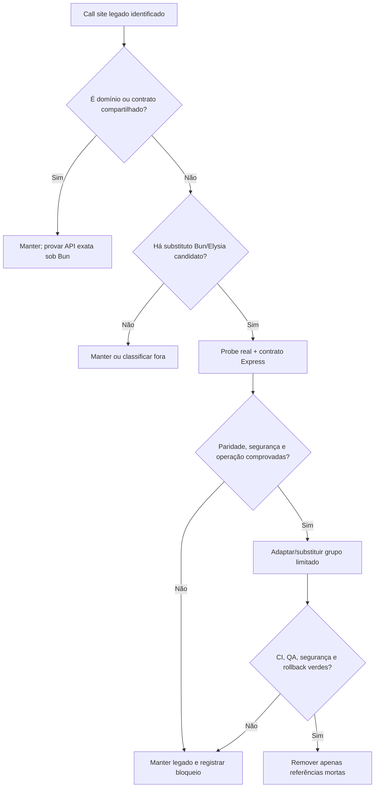
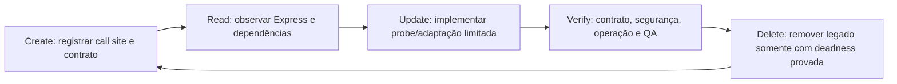
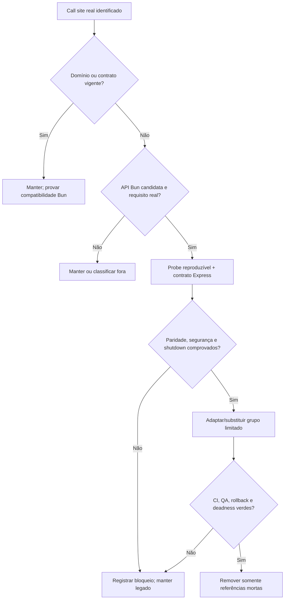
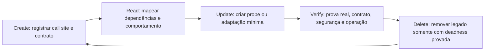

# Bun + Elysia Migration Inventory

**Status:** Discovery/audit only. No production route has been replaced by this inventory.

**Repository:** Paperclip (`/Users/jcafeitosa/Development/nomandyOS`)

**Audit date:** 2026-09-04

## Evidence captured

The repository currently contains:

- 67 files directly under `server/src/routes/`.
- 302 TypeScript service files under `server/src/services/`.
- 125 schema files under `packages/db/src/schema/`.
- 1,497 TypeScript/TSX files under `ui/src/`.
- 14 CI workflow files under `.github/workflows/`.
- 236 source files importing Express when tests and source files are included; direct production coupling is concentrated in:
  - `server/src/app.ts`
  - `server/src/index.ts`
  - `server/src/auth/better-auth.ts`
  - 9 files under `server/src/middleware/`
  - 59 route/authz modules under `server/src/routes/`

Commands used:

```sh
find server/src/routes -maxdepth 1 -name '*.ts' | wc -l
find server/src/services -maxdepth 1 -name '*.ts' | wc -l
find packages/db/src/schema -maxdepth 1 -name '*.ts' | wc -l
find ui/src -type f \( -name '*.ts' -o -name '*.tsx' \) | wc -l
find .github/workflows -type f | wc -l
grep -RIl 'from "express"\|from '\''express'\''' server/src packages cli ui scripts \\
  --exclude-dir=node_modules --include='*.ts' --include='*.tsx' --include='*.mjs'
```

## Classification rules

### Preserve unchanged initially

- Domain services that do not consume Express `Request`, `Response`, `Router`, `NextFunction`, `http.Server`, or Express middleware behavior.
- Drizzle schema, migration SQL, repository queries, and domain validators.
- Shared API contracts and route paths until Elysia contract tests prove byte/semantic parity.
- React components, React Query state, BrowserRouter, and WebSocket browser clients while the backend transport contract remains unchanged.
- Node-compatible dependencies only after runtime smoke tests prove the exact used API under Bun.

### Adapt for Bun, not rewrite

- `node:fs`, `node:path`, `node:url`, `node:crypto`, timers, environment access, and process signal handling where Bun's Node compatibility supports the exact API.
- `child_process` call sites to `Bun.spawn` only when semantics are explicitly preserved: stdio, exit status, signal cancellation, process-group handling, timeouts, and cleanup.
- Static asset serving to `Bun.file`/`Response` or an Elysia static plugin only after cache headers, SPA fallback, MIME handling, and path containment are covered.
- Drizzle connection setup only if the selected driver is proven under Bun; schema and SQL behavior remain unchanged.
- Better Auth through an explicit Elysia request/response bridge; do not replace session semantics with a generic JWT plugin.
- OpenTelemetry/Sentry only after their official Bun support and current server initialization/shutdown behavior are validated.

### Rewrite for Elysia

- `server/src/app.ts`: Express app factory, Router composition, body parser, middleware order, static/Vite integration, error handler, and startup-owned services.
- `server/src/index.ts`: only the HTTP server boundary; preserve DB initialization, migration checks, scheduler startup, plugin lifecycle, WebSocket setup, readiness, signal ordering, and graceful shutdown as separate tested services.
- `server/src/middleware/*.ts`: translate middleware into Elysia `onRequest`, `derive`, `resolve`, `beforeHandle`, `afterHandle`, `onError`, or scoped plugins while preserving order and security behavior.
- `server/src/routes/*.ts`: translate each Express Router into an Elysia plugin/instance. Every route must preserve path, method, params/query/body validation, status codes, response shape, error codes, authz, activity logs, and side effects.
- `server/src/routes/authz.ts`: replace `Request`/`Response` parameters with a typed Elysia actor context, but keep the same company-boundary and responsible-user intersection rules.
- WebSocket servers under `server/src/realtime/`: only after transport authentication, upgrade behavior, close/drain semantics, backpressure, and shutdown behavior are contract-tested.

### Rewrite tests

- Express/Supertest harnesses under `server/src/__tests__/` need Elysia `app.handle(Request)` or real Bun server tests, but assertions must remain contract-compatible.
- Do not mass-replace `vitest` with `bun:test` until mocks, fake timers, module isolation, embedded database lifecycle, worker cleanup, and serial execution behavior have equivalent tests.
- Preserve existing Vitest suites as regression coverage during the transition.

### Delete only after proof of deadness

- `server/src/app.ts`, `server/src/index.ts`, Express, `multer`, `pino-http`, `@types/express`, `@types/supertest`, `supertest`, `tsx`, Vitest, `ws`, and related files must not be removed until:
  1. every production import is gone;
  2. every test import is migrated or intentionally retained;
  3. package scripts, Docker, CI, release scripts, and docs no longer reference them;
  4. full unit/integration/contract/E2E suites pass;
  5. security and red-team checks pass;
  6. rollback and operational runbooks are updated.

## Surface-by-surface migration map

### Server bootstrap

| Path | Current | Target | Required proof |
|---|---|---|---|
| `server/src/app.ts` | Express app factory | Elysia app/plugin composition | Middleware-order, route-contract, static/UI, error, auth, shutdown tests |
| `server/src/index.ts` | Node `http.Server`, startup orchestration | Bun.serve/Elysia startup boundary | DB migration, readiness, scheduler, plugin, signal, hot restart and shutdown tests |
| `server/src/auth/better-auth.ts` | Better Auth + Express handlers | Better Auth + typed Elysia bridge | Cookie/session/trusted-origin/authz parity tests |

### Middleware

| Paths | Required conversion |
|---|---|
| `api-compression.ts` | Elysia response lifecycle or Bun compression; preserve content negotiation |
| `auth.ts` | Elysia request context actor derivation; preserve board/session/API-key/JWT/cloud paths |
| `board-mutation-guard.ts` | `onRequest`/`beforeHandle`; preserve origin/CSRF/host checks |
| `cloud-runtime-identity.ts` | request context derivation; preserve cloud headers and tenancy |
| `error-handler.ts` | `onError`; preserve error class/status/code/redaction |
| `private-hostname-guard.ts` | `onRequest`; preserve exact hostname policy |
| `private-json-etag.ts` | `afterHandle`; preserve private cache behavior |
| `trust-proxy.ts` | replace Express trust-proxy semantics with explicit Bun header policy |
| `validate.ts` | Elysia schema validation or explicit adapter preserving Zod error shape |

### Route groups

All 67 route files require individual conversion and parity evidence. The correct order is:

1. health and OpenAPI metadata
2. read-only catalogs (`llms`, teams, built-in agents)
3. companies/projects/goals/folders
4. agents and access/authz
5. issues, comments, blockers, documents, work products
6. costs, budgets, activity, dashboard, attention/decision queues
7. approvals and governed actions
8. secrets and assets
9. environments and execution workspaces
10. routines, pipelines, heartbeat/issue wakeups
11. plugins, tool gateway, connection intents
12. auth/cloud/onboarding/import/export and specialized routes

The order is about dependency and authorization risk, not line count.

### Services and database

`server/src/services/` and `packages/db/` are not a blanket rewrite. For each module, search for direct framework coupling and classify it independently. Domain logic should remain intact. Particular attention is required for:

- `heartbeat.ts` and scheduler/recovery services;
- plugin worker/job/lifecycle services;
- environment/runtime/workspace process services;
- database backup and embedded PostgreSQL supervision;
- device/setup-token login sessions;
- S3/local storage and multipart handling;
- instrumentation and Sentry startup/shutdown;
- any service accepting Express request/response types.

### Frontend and Astro decision

The current UI is a React/Vite SPA with React Query, BrowserRouter, context providers, same-origin REST, and browser WebSockets. Astro is not a replacement for the Elysia backend and is not required to run this SPA. Astro should remain excluded unless a separate product requirement establishes SSR/SSG/static content that cannot be served by the current Vite build. Any Astro introduction would be a separate project with separate architecture and acceptance criteria, not part of the runtime migration.

### Dependencies requiring individual validation

- **Framework:** Elysia and official OpenAPI/CORS/cookie/JWT/WebSocket plugins.
- **Runtime:** Bun APIs and Node compatibility for every used path.
- **Data:** Drizzle, PostgreSQL driver, `embedded-postgres`, migration tooling.
- **Auth:** Better Auth, cookie/session adapters, trusted origins.
- **Process/native:** `acpx`, `sharp`, `ssh2`, `embedded-postgres`, worker subprocesses.
- **Observability:** OpenTelemetry packages and Sentry server SDK.
- **Transport:** `ws`, native Bun WebSocket, SSE/streaming if used.
- **Tooling:** TypeScript, Vite, Storybook, Playwright, release scripts.

“Latest” is not an automatic upgrade rule. Each dependency needs official release/version evidence, compatibility validation, lockfile review, license review, and regression tests before upgrading.

### Recommended library/documentation matrix

This matrix consolidates only the recommendations and source evidence already recorded during the migration research. An unrecorded version is intentionally shown as **not recorded**, rather than inferred from a current registry lookup.

| Library/runtime surface | Disposition | Recommended use in the migration | Required proof / guardrail | Official source recorded | Version evidence recorded |
|---|---|---|---|---|---|
| Better Auth | **Keep** | Keep session, cookie, trusted-origin, and auth semantics; integrate with Elysia through the official handler `Request`/`Response` bridge. | Cookie/session/authz parity and fail-closed tests; do not replace with a generic JWT plugin. | [Better Auth](https://www.better-auth.com/docs) | Not recorded |
| Zod | **Keep** | Keep existing domain/shared schemas. Use Elysia schemas only at the HTTP edge when they preserve the existing Zod validation/error shape. | Compare status, error codes, issue details, and response shape before replacing any validator. | [Zod](https://zod.dev/) | Not recorded |
| Drizzle + PostgreSQL | **Keep** | Keep schema, migrations, SQL, repositories, and transaction semantics. Prove `bun-sql`/PostgreSQL connectivity before changing the driver or connection setup. | Driver, migration, prepared-statement, transaction, backup/restore, and concurrency probes. | [Drizzle ORM](https://orm.drizzle.team/docs/overview) | Not recorded |
| Elysia + Bun HTTP/lifecycle | **Adopt at the isolated boundary** | Use Elysia for request handling and lifecycle composition, and Bun for the HTTP server boundary, only route group by route group after parity. | Preserve middleware order, authz, error mapping, readiness, graceful shutdown, and startup-owned services. | [Elysia](https://elysiajs.com/table-of-content.html); [Bun](https://bun.com/docs) | Elysia `1.4.30`; Bun `1.4.0` |
| `Bun.spawn` | **Prove before selective adoption** | Replace individual `child_process` call sites only where stdio, exit status, cancellation, timeouts, signals, process groups, and orphan cleanup are explicitly preserved. | Real subprocess probes and parity tests per call site; never perform a blanket replacement. | [Bun child processes](https://bun.com/docs/runtime/child-process) | Bun `1.4.0` |
| Official Elysia plugins: CORS, cookie, OpenAPI, multipart, static | **Prove before adoption** | Use only the official plugin for the corresponding boundary, and only after Express behavior is matched. | Contract tests for headers, cookies, OpenAPI output, multipart limits/cleanup, static cache headers, SPA fallback, MIME handling, and path containment. | [Elysia documentation](https://elysiajs.com/table-of-content.html) | Not recorded |
| Native Bun WebSocket | **Prove before adoption** | Consider only after authenticated upgrade, reconnect, backpressure, close/drain, and shutdown behavior are contract-tested. | Do not remove `ws` while production/test references or parity gaps remain. | [Bun WebSockets](https://bun.com/docs/runtime/http/websockets) | Bun `1.4.0` source family recorded; probe result not recorded |
| `embedded-postgres` | **Keep / prove before runtime change** | Keep the existing embedded PostgreSQL development path until Bun startup, supervision, migrations, and shutdown are proven. | Real database lifecycle, migration, restart, backup/restore, and shutdown evidence. | [embedded-postgres](https://github.com/theseus-rs/postgresql-embedded) | Not recorded |
| `ws` | **Keep / prove before removal** | Retain as the behavioral transport oracle while native WebSocket parity is pending. | Repository-wide reference search plus authenticated transport and shutdown parity. | [ws](https://github.com/websockets/ws) | Not recorded |
| Vitest | **Keep / prove before runner change** | Preserve the existing test runner during migration. Do not mass-replace with `bun:test`. | Equivalent mocks, fake timers, module isolation, embedded DB lifecycle, worker cleanup, and serial-execution tests. | [Vitest](https://vitest.dev/) | Not recorded |
| `sharp` | **Keep / prove before runtime change** | Keep native image processing until the exact Bun/native-addon path is smoke-tested. | Real import and representative processing probe under the target runtime. | [sharp](https://sharp.pixelplumbing.com/) | Not recorded |
| `ssh2` | **Keep / prove before runtime change** | Keep SSH integration until its native/runtime behavior is verified under Bun. | Real connection/auth/stream/cleanup probe appropriate to the supported path. | [ssh2](https://github.com/mscdex/ssh2) | Not recorded |
| `acpx` | **Keep / prove before runtime change** | Keep the adapter/process integration until subprocess, stream, cancellation, and cleanup semantics are proven. | Real adapter/runtime probe; no placeholder implementation. | Not recorded in the captured research | Not recorded |
| OpenTelemetry | **Keep / prove before runtime change** | Keep tracing and no-op-without-endpoint behavior; validate official Bun support and current initialization/shutdown. | Preserve operator endpoint gate and closed span-attribute allowlist. | [OpenTelemetry JS](https://opentelemetry.io/docs/languages/js/) | Not recorded |
| Sentry | **Keep / prove before runtime change** | Keep server error reporting and lifecycle behavior until official Bun support is validated. | Preserve initialization, error capture, shutdown/flush, and redaction behavior. | [Sentry JavaScript](https://docs.sentry.io/platforms/javascript/) | Not recorded |

The matrix is a planning classification, not an upgrade authorization. “Keep” means preserve the current implementation as the oracle; “prove before” means an isolated compatibility and parity gate is required before adoption or removal. No result is claimed where the captured research did not record one.

## Hard migration gates

1. No route conversion without a contract test.
2. No auth middleware conversion without company-isolation and denial tests.
3. No Express/Node dependency removal while any production/test path still uses it.
4. No DB driver change without migration, transaction, prepared-statement, backup/restore, and concurrency evidence.
5. No WebSocket migration without authenticated upgrade, reconnect, backpressure, and shutdown evidence.
6. No worker/process migration without signal, timeout, process-group, exit-code, and orphan cleanup evidence.
7. No test runner cutover until mock/isolation/timer/database semantics are proven.
8. No file deletion without repository-wide reference search and green verification.
9. No production-ready claim until independent code review, QA, security review, red-team review, and GitHub/release review are complete.

## Current disposition

- The temporary `*.elysia.ts` scaffolds were removed because they omitted security and domain behavior.
- The original Express server remains the active implementation.
- A Bun install/typecheck smoke test was previously attempted, but the result is not a sufficient migration gate: Bun package installation alone does not prove runtime compatibility of the server.
- `server/package.json` now declares `elysia@1.4.30` for the isolated boundary, and the root `package.json`/`bun.lock` reflect Bun's workspace resolution. This dependency/lockfile change must still pass package-manager, CI, release, and GitHub review before it is considered part of the production migration.
- The actor resolver composition now distinguishes `miss`, `matched`, and `rejected`; only `miss` falls through to another authority. This closes the previously identified invalid-bearer fallback ambiguity, but it is still a dormant boundary and does not replace `actorMiddleware`.
- A new isolated HTTP boundary exists under `server/src/http/` with no production cutover:
  - `app.ts` exposes only the deliberately narrow health/readiness probe contract;
  - `errors.ts` preserves the existing `HttpError` JSON/status contract, maps Elysia `NOT_FOUND` to 404, and redacts unknown failures;
  - `app.test.ts`, `errors.test.ts`, `server.test.ts`, `actor-context.test.ts`, `authorization.test.ts`, `context.test.ts`, `credential-bridge.test.ts`, `request-headers.test.ts`, `cloud-tenant-actor-resolver.test.ts`, `session-actor-resolver.test.ts`, `actor-resolvers.test.ts`, `agent-credentials.test.ts`, `agent-jwt-runtime.test.ts`, `board-key-actor-resolver.test.ts`, `board-key-resolver-factory.test.ts`, and `bearer-dispatch.test.ts` execute with Bun 1.4.0.
- Verification evidence for the isolated boundary and credential bridges: `/Users/jcafeitosa/.bun/bin/bun test ./src/http` → 65 passed, 0 failed, 103 expectations. The suite covers health, readiness, 404 mapping, domain `HttpError`, redaction of unexpected failures, a real `Bun.serve` listener, actor policy variants, scoped Elysia actor context, header adaptation, credential bridge failure behavior, explicit cloud-tenant actor reconstruction, Better Auth session actor reconstruction, ordered actor-resolver fallback/rejection composition, agent credential/MCP classification, Bun-native JWT signing/expiry/scope, run-id binding, board API-key actor reconstruction/factory wiring, and MCP bearer dispatch classification.
- The full server has not been switched to Bun/Elysia. Credential resolution/actor derivation in `server/src/middleware/auth.ts` remains active; `server/src/http/actor-context.ts` is only a pure policy seam and does not replace that middleware. Its tests cover local board, session board, viewer writes, agent company identity, responsible-user membership, unauthenticated actors, and legacy missing-membership compatibility. `server/src/http/authorization.ts` converts policy denials into the existing `HttpError` hierarchy but is not wired into production routes. `server/src/http/context.ts` provides a scoped, fail-closed actor resolver boundary; it never invents credentials or privileges, and its parent error lifecycle preserves JSON error responses. `server/src/http/credential-bridge.ts` provides a dependency-injected bridge for reusing the existing credential resolver with a Web `Request`; it does not parse tokens, create actors, or replace the current middleware. `server/src/http/app.ts` accepts an optional injected actor resolver without authenticating health/readiness routes, so future protected route groups can opt into the context explicitly. The HTTP policy/context suite currently reports 65 passed tests and 103 expectations under Bun 1.4.0; the isolated HTTP source set typechecks with Bun types using the explicit no-project-config gate when the executor permits the command. Real credential resolution still remains in `server/src/middleware/auth.ts`; all route groups, plugin workers, WebSockets, startup/shutdown, Better Auth, database lifecycle, CI, Docker, and production parity remain pending.
- Official documentation MCP calls and multi-agent orchestration were intermittently unavailable in this session; those gaps must be resolved before claiming documentation coverage or agent-review acceptance.
- The credential-bridge audit and independent critique completed for the cloud-tenant slice; the critique disposition was `CHANGES-REQUIRED`, and its required field-mapping/fail-closed/explicit-test corrections were applied. The following post-implementation reviews remain unaccepted because the executor repeatedly timed out or rate-limited before completion: Code Review, QA, Security/Red Team, and GitHub/release review.
- Independent actor/session/board/agent bridge reviews are not marked accepted while any reviewer is unavailable; local green tests are evidence of behavior only, not a substitute for the required independent gates.
- The dedicated project typecheck remains blocked by the executor in this session. The explicit boundary-source typecheck has passed when run with `bun --bun tsc --ignoreConfig --types node,bun` plus the ambient actor declaration; checks that include the legacy middleware require the full workspace's generated package links and ambient declarations.
- The user-requested official-source fetches for Bun, Elysia, and Astro were also intermittently blocked by executor timeouts. The required source URLs and documentation recording format are preserved in this inventory; no unsupported “latest” compatibility claim is made.
- The current review evidence shows `typecheck:http` is declared in `server/package.json` but is not yet included in CI, and `pnpm-lock.yaml` does not record the new Elysia/@types-bun dependencies while `bun.lock` does. This is a migration blocker, not a reason to delete pnpm: CI and lockfile policy must be designed and reviewed before package-manager cutover.

### Experimental native server lifecycle probe (2026-09-05)

A real, isolated Bun/Elysia lifecycle harness was added at `server/src/http/experimental-server.ts`. It creates the existing narrow Elysia health/readiness app, starts a real `Bun.serve` listener on an ephemeral port, exposes an explicit readiness promise based on the reported listening port, and delegates graceful/forced shutdown to `server.stop(force)`. Its test performs real HTTP requests to `/api/health` and `/api/ready`, then verifies that requests fail after shutdown. It does not import `server/src/index.ts` or `server/src/app.ts`, and therefore intentionally does not initialize the database, migrations, auth, schedulers, workers, WebSockets, UI, or production Express boundary.

Context7 official sources consulted on 2026-09-05:
- Elysia `/elysiajs/documentation`: `app.handle`/`app.fetch` request handling and lifecycle testing without a listener.
- Bun `/oven-sh/bun/bun-v1.4.0`: `Bun.serve`, `server.stop()` graceful drain, `server.stop(true)` forced shutdown, and `ref`/`unref` lifecycle controls.

Validation:
- `bun test src/http` ran 107 tests: 106 passed and 1 unrelated pre-existing/flaky `packages/adapter-utils/src/http2-bridge-server.test.ts` failure (`goaway` expected one record, received two).
- The new experimental lifecycle test passed, as did the existing native HTTP server test.
- Lint diagnostics for both new files were clean.

This is evidence for the isolated native transport lifecycle only. It is not startup parity or production readiness. The full bootstrap remains blocked by its Express/Node boundary and startup-owned dependencies; no route/auth cutover is authorized.
- `server/package.json` now exposes `test:http` as the reproducible Bun test entrypoint for the isolated boundary; it currently runs 17 files with 65 passing tests and 103 expectations. The existing Vitest `test` path remains unchanged until its fake-timer/setup/isolation semantics are ported deliberately.
- The current Code Review pass was interrupted before its final findings report. Its verified intermediate checks found no production call site for the new HTTP boundary, confirmed the local Bun test result, and identified the lockfile/CI gaps above. It also identified that the current `pnpm-lock.yaml` intentionally lacks the new Bun-only dependency entries while `bun.lock` contains them; treat the review as incomplete, not accepted.
- The existing `server/src/__tests__/agent-auth-jwt.test.ts` already contains the source-of-truth JWT coverage for expiry, issuer/audience, per-company isolation, instance isolation, legacy fallback, fallback disablement, TTL, and scope. A native adapter must reuse these functions and port the middleware cases rather than duplicate or weaken these tests.
- The existing `server/src/__tests__/agent-auth-middleware.test.ts` is the source-of-truth for the middleware boundary: local implicit board/run-id, MCP gateway bearer exception and lookalike denial, wrong-company/expired/terminated/pending JWT, signed and legacy responsible-user behavior, `skill_test` scope, run-header mismatch plus activity audit, fork-token isolation, agent-key responsible-user mapping, and missing-responsible-user denial plus audit. These cases are mandatory parity gates before native agent auth.
- Source records to complete before each corresponding implementation gate:
  - Bun — `https://bun.com/docs`: runtime APIs, `Bun.serve`, WebSocket, `Bun.spawn`, `Bun.file`, `bun:test`, `Bun.build`, workspaces, Node compatibility, native addons, signals. **Status:** URL recorded; external fetch pending executor availability.
  - Elysia — `https://elysiajs.com/table-of-content.html`: request context, `resolve`/`derive`, scoped plugins, lifecycle, validation, errors, OpenAPI, cookies/JWT/CORS, WebSocket, multipart/static, `app.handle`. **Status:** installed package `elysia@1.4.30` declarations were inspected; external documentation fetch pending executor availability.
  - Astro — `https://docs.astro.build/es/install-and-setup/`: setup, SSR/SSG/islands and integration boundaries. **Status:** URL recorded; decision remains to keep Astro outside this runtime migration unless a separate SSR/SSG requirement is approved.

## Runtime probe evidence (2026-09-05)

A focused Bun 1.4.0 probe suite was added at `server/src/bun-runtime-probes.test.ts` and is intentionally independent of the production bootstrap and Vitest. It exercises real Bun subprocesses for piped stdin/stdout, exit settlement, `AbortSignal` cancellation, timeout termination, and ordered shutdown callbacks with optional database/observability stages. The probe does not replace `child_process`, does not start the application, and does not claim embedded PostgreSQL/Drizzle compatibility.

Source consulted: official Bun child-process documentation at `https://bun.com/docs/runtime/child-process` (Context7 library `/oven-sh/bun`, resolved 2026-09-05), covering `Bun.spawn`, `stdin`, `stdout`, `exited`, `signal`, `timeout`, and `killSignal`.

Validation command:

```sh
cd server && bun run test:runtime-probes
```

## Naming convention

The migration code uses responsibility-based paths rather than technology names:

- `server/src/http/` is the HTTP boundary;
- `app.ts`, `errors.ts`, and `server.ts` describe responsibilities;
- framework-specific details remain implementation imports inside the boundary, not public directory names;
- domain route names remain domain names (`companies`, `issues`, `agents`, etc.).

This prevents the final architecture from exposing temporary framework naming such as `elysia/` or `*.elysia.ts`.

## Matriz de decisão de bibliotecas (2026-09-05)

Esta matriz registra a decisão de compatibilidade levantada sem transformar a migração em uma troca indiscriminada de dependências. A decisão explícita é **não trocar bibliotecas de domínio por preferência**: Drizzle, PostgreSQL/`pg`, Better Auth e Zod continuam sendo a base funcional enquanto não houver uma incompatibilidade comprovada no caminho efetivamente usado.

| Biblioteca/superfície | Decisão | Critério para manter, substituir ou avançar |
|---|---|---|
| Drizzle + PostgreSQL + `pg` | **Manter temporariamente** | Preservar schema, SQL, transações, migrações, prepared statements e backup/restore. Qualquer mudança exige prova de paridade de dados e concorrência; não há motivo para substituir uma biblioteca de domínio por preferência de runtime. |
| Better Auth | **Manter temporariamente** | Adaptar a ponte request/response para Elysia; comprovar cookies, sessões, trusted origins, logout, falhas e isolamento antes de qualquer decisão adicional. |
| Zod | **Manter temporariamente** | Preservar contratos e formato de erros. Só adaptar o invólucro de validação se a integração Elysia exigir; não trocar schemas por outra biblioteca sem incompatibilidade evidenciada. |
| React + Vite | **Manter** | A UI permanece SPA React/Vite. Astro fica fora desta migração; só pode ser avaliado em projeto separado com requisito aprovado de SSR/SSG. |
| OpenTelemetry + Sentry | **Manter temporariamente** | Revalidar inicialização, no-op sem endpoint, atributos permitidos, flush e shutdown sob Bun. Não alegar suporte Bun sem prova no caminho real. |
| `sharp`, `ssh2`, `acpx` | **Manter temporariamente** | Executar probes reais das APIs usadas, incluindo addons/nativos, subprocessos, streams, sinais e limpeza. A manutenção é preferível a reescrita funcional especulativa. |
| Vitest | **Manter temporariamente** | Preservar testes durante a transição. `bun:test` só será considerado após equivalência de mocks, fake timers, isolamento de módulos, ciclo do banco e limpeza de workers. |
| `pnpm` | **Manter temporariamente** | Continua sendo o gerenciador e caminho oficial do repositório até resolução de lockfiles, CI, scripts, release e documentação. Probes Bun não autorizam cutover do gerenciador. |
| Express e middleware | **Substituir gradualmente** | Migrar por grupos limitados para Elysia (`onRequest`, `derive`/`resolve`, `beforeHandle`, `afterHandle`, `onError` e plugins), mantendo a implementação Express como oráculo comportamental até paridade contratual. |
| `multer` | **Substituir gradualmente por multipart nativo** | Somente após prova real de limites, múltiplos arquivos, streaming, nomes/MIME, erros, limpeza, path containment e contratos de upload. |
| `ws` | **Substituir gradualmente por WebSocket nativo Bun** | Somente após prova de autenticação no upgrade, reconexão, backpressure, close/drain, códigos de encerramento e shutdown. |
| `supertest` | **Substituir nos testes migrados por `app.handle`/`app.fetch`** | Migrar apenas testes ligados a grupos já portados; preservar status, headers, corpo, erros e efeitos colaterais. Testes ainda Express permanecem intactos. |
| `child_process` | **Substituir seletivamente por `Bun.spawn`** | Apenas quando stdio, exit status, cancelamento por sinal, timeout, process group e limpeza de órfãos forem explicitamente preservados. |
| Static serving | **Decidir por superfície após compatibilidade** | Avaliar `Bun.file`/`Response` ou plugin estático Elysia somente com prova de MIME, cache headers, SPA fallback e contenção de caminho; não remover a integração atual antecipadamente. |

### Fontes oficiais e evidência disponível

- Bun: `https://bun.com/docs/runtime/child-process`, consultada via Context7 em 2026-09-05, biblioteca `/oven-sh/bun`; evidencia `Bun.spawn`, `stdin`, `stdout`, `exited`, `signal`, `timeout` e `killSignal`.
- Bun 1.4.0: `/oven-sh/bun/bun-v1.4.0`, consultada via Context7 em 2026-09-05; evidencia `Bun.serve`, `server.stop()`/`server.stop(true)` e controles `ref`/`unref` no probe isolado.
- Elysia: `/elysiajs/documentation`, consultada via Context7 em 2026-09-05; evidencia `app.handle`/`app.fetch` para testes sem listener.
- Elysia: `https://elysiajs.com/table-of-content.html` permanece a fonte oficial registrada para lifecycle, plugins, validação, multipart, static e WebSocket; a consulta externa desses tópicos ainda está pendente. A versão evidenciada no repositório é `elysia@1.4.30` (declarações inspecionadas), sem inferir que seja a versão mais recente.

Nenhuma versão é registrada para as demais bibliotecas nesta decisão porque não há evidência de versão correspondente no levantamento. “Latest” não é critério de atualização.

### Riscos e critérios de prova

Os principais riscos são regressão de autenticação/isolamento por ordem de middleware, mudança silenciosa de status ou formato de erro, perda de semântica de streaming/processos, vazamento de arquivos temporários, quebra de addons nativos e divergência entre testes do oráculo Express e do app Elysia. Cada substituição deve ter um probe reproduzível e teste de contrato antes do avanço:

1. comparar método, rota, parâmetros, headers, status, corpo, erro, atividade e efeitos colaterais contra o Express;
2. exercitar casos positivos, negativos, limites, cancelamento, timeout e shutdown no caminho real;
3. verificar company isolation, actor/authz, CSRF/origin, redaction e auditoria antes de qualquer rota autenticada;
4. executar testes unitários, integração, contrato, segurança/red-team e E2E do grupo migrado;
5. revisar lockfile, CI, scripts, documentação e rollback; só então remover a dependência substituída quando a busca no repositório provar deadness.

### Árvore de decisão e workflow de migração





Esta decisão não autoriza alteração de `package.json`, bootstrap, auth, rotas ou produção. Também não marca o objetivo global da migração como concluído.

## Análise Bun contra o legado — matriz operacional (2026-09-05)

Esta seção é aditiva e consolida somente call sites e evidências já registradas nesta auditoria. A classificação **provar** significa que não há autorização de adoção antes de um probe reproduzível; **fora** significa que a superfície não pertence ao escopo desta migração.

| Categoria Bun | Call sites principais do legado | Classificação | Risco e critério de prova |
|---|---|---|---|
| Runtime/Node compatibility | `server/src/index.ts`, scripts, adapters e serviços com APIs `node:*` | **Adaptar/provar** | Provar cada API usada, sinais, ambiente e resolução de módulos sob Bun; manter Node/pnpm como rollback. |
| HTTP/serve | `server/src/app.ts`, `server/src/index.ts` | **Substituir gradualmente** | Paridade de listener, readiness, headers, compressão, shutdown e ordem de middleware; `Bun.serve` 1.4.0 só está provado no harness isolado. |
| Routing/lifecycle | `server/src/routes/*.ts`, `server/src/middleware/*.ts` | **Substituir gradualmente** | Migrar grupo por grupo com método, path, status, corpo, efeitos e autorização equivalentes; Express permanece oráculo. |
| Cookies/TLS | `server/src/auth/better-auth.ts`, auth, trust-proxy e guards | **Adaptar/provar** | Provar cookies/sessão/trusted origins e política de headers/proxy; TLS/terminação não pode alterar identidade ou origem confiável. |
| Errors/metrics | `server/src/middleware/error-handler.ts`, `server/src/instrumentation.ts`, logging | **Adaptar/provar** | Preservar status/código/redaction, correlação, no-op sem endpoint e atributos permitidos; comparar flush/shutdown. |
| Fetch | Bridges Better Auth, clientes HTTP e integrações `fetch` | **Manter/adaptar** | Preservar `Request`/`Response`, abort, headers, timeouts e erros; provar o caminho real sem trocar semântica por conveniência. |
| WebSocket | `server/src/realtime/*.ts`, clientes WebSocket da UI | **Provar antes** | Upgrade autenticado, company/run scope, reconexão, ordem, backpressure, close/drain e shutdown; manter `ws` como oráculo. |
| Files/static/multipart | static/Vite em `server/src/app.ts`, uploads e `multer` | **Adaptar/provar** | Provar MIME, cache, SPA fallback, limites, streaming, limpeza e path containment com `Bun.file`/plugin. |
| Streams | adapters, `acpx`, SSH, uploads e subprocessos | **Provar antes** | Provar backpressure, cancelamento, fechamento, erros e não perda de dados em streams reais. |
| SQL/PostgreSQL/Drizzle | `packages/db/`, client, migrações e repositórios | **Manter/adaptar** | Manter schema/SQL; provar driver, migração, prepared statements, transações, concorrência e backup/restore sob Bun. |
| S3/object storage | serviços de storage, assets e work products | **Manter/provar** | Provar SDK/HTTP, streaming, multipart, credenciais, retry e cleanup; não trocar armazenamento por hipótese de compatibilidade. |
| Redis | referências de cache/filas, se alcançadas pelos call sites | **Provar ou fora** | Não há evidência registrada para declarar uso Bun; primeiro localizar call sites reais e provar somente a API efetivamente usada. |
| Workers | plugin workers, jobs, scheduler e serviços de heartbeat | **Adaptar/provar** | Provar isolamento, ciclo de vida, cleanup, mensagens, falhas e shutdown ordenado; não cortar workers no bootstrap. |
| `Bun.spawn` | `child_process`, adapters, workspaces, plugins e scripts | **Substituir seletivamente** | Provar stdio, exit, sinais, timeout, process group e órfãos por call site; não fazer substituição em massa. |
| Cron/scheduler | scheduler, heartbeat/recovery e rotinas | **Manter/adaptar** | Preservar idempotência, timers, recuperação, budget checks e drain; provar relógio, cancelamento e restart. |
| Node API/native modules | `node:fs/path/url/crypto`, `sharp`, `ssh2`, `embedded-postgres`, `acpx` | **Manter/provar** | Provar exatamente os addons/APIs usados, incluindo sinais e recursos nativos; nenhuma remoção por inferência. |
| CSRF/origin | `board-mutation-guard.ts`, private-host/trust-proxy middleware | **Adaptar/provar** | Provar allow/deny, forwarded headers, hosts, métodos mutáveis e redaction antes de qualquer rota protegida. |
| Secrets/hash | auth, agent keys/JWT, secrets e crypto | **Manter/adaptar** | Preservar hashing, expiração, escopos, redaction e isolamento por companhia/instância; validar vetores positivos, negativos e expirados. |
| Image processing | `sharp` e assets | **Provar antes** | Import real e processamento representativo sob Bun, inclusive erro, memória e cleanup; manter implementação atual até prova. |
| Utilities | `node:timers`, env, URL, crypto e helpers compartilhados | **Adaptar** | Probe unitário por API usada e comparação de valores/erros; não alterar domínio ou contratos. |
| Astro/SSR/SSG | nenhum call site necessário na SPA React/Vite | **Fora** | Só reabrir com requisito aprovado de SSR/SSG; não é dependência da migração backend. |

### Decisões arquiteturais registradas

- **Boundary HTTP:** adotar Elysia sobre Bun, isoladamente, com migração progressiva e Express como oracle comportamental.
- **Manter/adaptar:** Better Auth (ponte request/response e semântica de sessão), Zod (contratos/erros), Drizzle/PostgreSQL (schema, SQL e transações) e React/Vite (SPA e contrato same-origin).
- **Bun.spawn:** adoção seletiva por call site, somente com equivalência explícita de processo e limpeza.
- **Provar antes:** `ws`, `multer`, `embedded-postgres`, Vitest, módulos nativos, OpenTelemetry e Sentry; manter as implementações atuais durante a prova.
- **Astro:** fora do escopo; não substituir React/Vite nem introduzir SSR/SSG incidentalmente.

### Ordem de execução em seis frentes

1. **Fundação e provas:** Bun runtime/Node compatibility, `Bun.serve`, Elysia `app.handle`, erros, headers e static.
2. **Identidade e segurança:** Better Auth bridge, actor context, cookies, CSRF/origin, secrets, hash e authz.
3. **Dados e arquivos:** Drizzle/PostgreSQL, embedded PostgreSQL, S3, multipart e `sharp`.
4. **Processos e assíncrono:** `Bun.spawn`, streams, workers, scheduler/cron, `acpx` e `ssh2`.
5. **Transporte e observabilidade:** WebSocket nativo versus `ws`, OTel, Sentry, métricas e shutdown.
6. **Rotas e ferramentas:** grupos de rotas em ordem de risco, testes, CI, rollback e remoção somente após prova de deadness.

### Árvore de decisão



### Mini-workflow CRUD de cada superfície



### Dez primeiros probes

1. `Bun.serve` com readiness, `/api/health`, `/api/ready`, `stop()` e `stop(true)`.
2. Elysia `app.handle`/`app.fetch` comparado ao contrato Express de status, headers, corpo e erros.
3. Ordem de `onRequest`/`derive`/`resolve`/`beforeHandle`/`afterHandle`/`onError` com falhas redigidas.
4. Better Auth request/response bridge com cookie, sessão, logout e trusted-origin.
5. CSRF/origin, private-hostname e trust-proxy com headers válidos, inválidos e ambíguos.
6. Drizzle/PostgreSQL com conexão, migração, prepared statements, transação e concorrência.
7. `embedded-postgres` com start, query, restart, migração, backup/restore e stop.
8. Upload/static com `Bun.file`, multipart, MIME, limites, streaming, cache, fallback SPA e containment.
9. WebSocket autenticado com reconexão, backpressure, close/drain e shutdown, mantendo `ws` para comparação.
10. `Bun.spawn` e módulos nativos (`acpx`, `sharp`, `ssh2`) com stdio, stream, sinal, timeout, erro e cleanup reais.

Cada probe deve registrar comando, Bun/Elysia version, entrada, resultado observado e lacunas. Nenhum probe isolado autoriza cutover: o critério mínimo é prova reproduzível no call site, paridade contra Express, casos positivos/negativos/de borda, testes de segurança e operação, revisão de CI/rollback e documentação atualizada.

## Análise Bun completa por categoria (2026-09-05)

Esta seção complementa o inventário anterior sem declarar compatibilidade onde a auditoria não registrou prova. Os call sites abaixo são os principais caminhos reais identificados; referências de teste não autorizam mudança de produção.

| Categoria | APIs Bun candidatas | Call sites principais reais | Decisão | Riscos e critérios de prova |
|---|---|---|---|---|
| Runtime, HTTP e Fetch | `Bun.serve`, `server.stop()`, `Request`/`Response`, `fetch`, Elysia `app.handle`/`app.fetch` | `server/src/app.ts`, `server/src/index.ts`, `server/src/http/experimental-server.ts`, `server/src/auth/better-auth.ts`, integrações HTTP dos adapters | **Substituir gradualmente / adaptar** | Paridade de rotas, headers, erros, readiness, abort, timeout e shutdown contra Express; `Bun.serve` 1.4.0 só está provado no harness isolado. |
| WebSockets | WebSocket nativo de `Bun.serve` e upgrade Elysia | `server/src/realtime/live-events-ws.ts`, `server/src/realtime/runner-prp-ws.ts`, `server/src/realtime/environment-custom-image-terminal-ws.ts`, `ui/src/lib/websocket-url.ts` | **Provar; manter `ws`** | Provar upgrade autenticado, company/run scope, reconexão, backpressure, códigos de fechamento, drain e shutdown; não remover `ws` antes da paridade. |
| Arquivos, streams e multipart | `Bun.file`, `File`, `ReadableStream`, `Response`, multipart Elysia | `server/src/app.ts` (static/Vite), `server/src/storage/index.ts`, `server/src/storage/s3-provider.ts`, `server/src/routes/assets.ts`, uploads com `multer`, adapters/acpx/SSH | **Adaptar/provar** | Provar MIME, cache, fallback SPA, limites, streaming, backpressure, abort, cleanup e path containment; não trocar `multer` sem contrato real. |
| SQL, PostgreSQL e SQLite | `Bun.SQL` (candidato de probe), APIs PostgreSQL Bun, `Bun.sqlite` somente se houver requisito | `packages/db/src/`, `server/src/services/database-backup-health.ts`, `packages/db/src/embedded-postgres-lifecycle.ts` | **Manter Drizzle/PostgreSQL; provar candidato** | `Bun.SQL` é somente candidato de probe e não substitui o domínio. Provar driver, migrações, prepared statements, transações, concorrência, backup/restore e ciclo do embedded PostgreSQL. SQLite fica **fora** sem call site/requisito real. |
| S3/object storage e Redis | `fetch`/streams Bun para transporte; cliente existente; Redis Bun apenas se necessário | `server/src/storage/s3-provider.ts`, `server/src/storage/provider-registry.ts`; não há uso Redis confirmado no inventário | **Manter/provar S3; Redis fora ou provar** | S3: provar credenciais, streaming, multipart, retry e cleanup no provider real. Redis somente após localizar uso real e requisito; não introduzir datastore por hipótese. |
| Workers e spawn | `Bun.spawn`, `Bun.Worker` | `server/src/services/plugin-worker-manager.ts`, `plugin-job-scheduler.ts`, `server/src/services/heartbeat.ts`, `server/src/services/local-service-supervisor.ts`, `packages/adapter-utils/src/acpx-engine/*`, workspaces e adapters | **Adaptar/provar; `child_process` seletivo** | `Bun.spawn` só por call site, preservando stdio, exit, sinais, timeout, process group e órfãos. Workers exigem prova de mensagens, isolamento, falha e cleanup; `child_process` não tem substituição em massa autorizada. |
| Shell e cron | `Bun.spawn`, timers Bun/compatíveis | `server/src/services/cron.ts`, `server/src/services/heartbeat.ts`, `server/src/services/routines.ts`, scripts CLI e supervisores | **Manter/adaptar** | Preservar idempotência, timezone, retries, budget checks, cancelamento, restart e drain; provar relógio e ciclo de vida no scheduler real. |
| Signals e shutdown | `AbortSignal`, `server.stop`, sinais Node-compatíveis | `server/src/shutdown.ts`, `server/src/index.ts`, `server/src/services/hot-restart.ts`, `packages/db/src/embedded-postgres-lifecycle.ts` | **Adaptar/provar** | Provar ordenação: parar novos trabalhos, snapshot/drain, finalizar workers/adapters, flush OTel/Sentry e só então banco; cobrir SIGINT/SIGTERM, hot restart, force stop e perda zero. |
| CSRF, origem e secrets | `Request.headers`, `crypto`/Web Crypto Bun-compatíveis, `AbortSignal` | `server/src/middleware/board-mutation-guard.ts`, `private-hostname-guard.ts`, `trust-proxy.ts`, `server/src/auth/*`, `server/src/services/secrets.ts`, `server/src/redaction.ts` | **Adaptar/provar; manter Better Auth/Zod** | Provar allow/deny de Origin/Host/forwarded headers, métodos mutáveis, cookies/sessões, hashing, expiração, escopos, redaction e isolamento de companhia/instância. Better Auth e Zod permanecem. |
| Utilitários e Node compatibility | `Bun.env`, `Bun.file`, timers, URL, `node:fs/path/url/crypto` compatíveis | `server/src/config.ts`, `server/src/server-info.ts`, `server/src/index.ts`, `cli/src/config/*`, `packages/adapter-utils/src/*` | **Manter/adaptar/provar** | Probar cada API usada, resolução de módulos, valores/erros e comportamento em Node como rollback; não inferir compatibilidade pela existência de um polyfill. |
| Node-API/native modules e observabilidade | Node compatibility, addons nativos; `Bun.spawn` para acpx | `sharp`, `packages/adapter-utils/src/ssh.ts` (`ssh2`), `packages/adapter-utils/src/acpx-engine/*`, `embedded-postgres`, `server/src/instrumentation.ts`, `server/src/services/duplex-observability-recorder.ts`, Sentry | **Manter/provar** | `sharp`, `ssh2`, `acpx`, embedded-postgres, OpenTelemetry e Sentry permanecem até probes reais de import, processamento/conexão, streams, sinais, flush e cleanup; incompatibilidade não pode ser resolvida com placeholder. |
| Bibliotecas/domínio e UI | Drizzle, PostgreSQL/`pg`, Better Auth, Zod, React/Vite | `packages/db/src/`, `server/src/auth/better-auth.ts`, `packages/shared/src/`, `ui/src/` | **Manter** | São contratos/domínio ou SPA vigente. Bun não justifica substituição; qualquer adaptação deve preservar semântica e formato de erro. Astro, GraphQL e WebView ficam **fora** sem uso real/requisito aprovado. |

### Dez primeiros probes priorizados

1. `Bun.serve` 1.4.0 com readiness, health/ready, `stop()` e `stop(true)`.
2. Elysia `app.handle`/`app.fetch` contra status, headers, corpo e erros do Express.
3. Ordem de lifecycle, parsing, erros redigidos e compressão.
4. Better Auth bridge com cookie, sessão, logout e trusted-origin.
5. CSRF/origin, private-hostname e trust-proxy com headers válidos, inválidos e ambíguos.
6. Drizzle/PostgreSQL e candidato `Bun.SQL`: migração, prepared statements, transação e concorrência; sem trocar o domínio.
7. Embedded PostgreSQL: start, query, restart, migração, backup/restore e stop.
8. `Bun.file`/multipart/streams: MIME, limites, cache, fallback, containment e cleanup.
9. WebSocket autenticado: reconexão, backpressure, close/drain e shutdown, comparado com `ws`.
10. `Bun.spawn` e módulos nativos: stdio, stream, sinal, timeout, erro e cleanup reais para acpx, sharp, ssh2 e embedded-postgres.

### Plano máximo de seis frentes

1. **Fundação:** runtime/Node compatibility, HTTP, Fetch, Elysia lifecycle e static.
2. **Segurança:** Better Auth, actor/authz, CSRF/origin, secrets e redaction.
3. **Dados:** Drizzle/PostgreSQL, embedded-postgres, Bun.SQL probe, S3 e arquivos.
4. **Execução:** spawn seletivo, streams, workers, shell, cron e adapters.
5. **Operação:** WebSockets, signals, shutdown, OTel, Sentry e rollback.
6. **Rotas e governança:** migração por grupo, contratos, CI, QA, segurança e deadness.

### Árvore de decisão



### Mini-workflow CRUD por superfície



Esta atualização é exclusivamente documental. Não altera código, manifests, bootstrap, autenticação ou rotas, não inventa resultados e não marca o objetivo global da migração como completo.
