# MAT Report Publishing

## Purpose

Produce and publish recurring market and materials analysis reports for the Blockchain Economics Lab.

## Current Diagram

```mermaid
flowchart LR
  source_collection["Slide PDF intake"]
  research_synthesis["Analysis source confirmation"]
  draft_report["Summary and marketing extraction"]
  summary_marketing_localization["7-language summary and marketing localization"]
  editorial_review["Publication review"]
  website_publish["Website publishing"]
  post_publish_monitoring["Post-publish monitoring"]
  source_collection --> research_synthesis
  research_synthesis --> draft_report
  draft_report --> summary_marketing_localization
  summary_marketing_localization --> editorial_review
  editorial_review --> website_publish
  website_publish --> post_publish_monitoring
```

## Operating State

- Report code: MAT
- Cadence: Recurring report cycle
- Health: unknown
- Runtime architecture: remote-first
- Executable manifest: `pipelines/bcelab-runtime-pipelines.json` in the BCE website repository
- Remote runner: GitHub Actions `.github/workflows/slide-pipeline-cron.yml`
- Runtime verification: `npm run verify:runtime-pipelines`
- Local execution: dry-run, development, or incident reproduction only; production writes must run through the remote workflow
- Slide PDF intake folder: Google Drive Slide/MAT
- Markdown source folder: Google Drive analysis/MAT
- Summary/marketing localization target: 7 languages
- Summary/marketing localization provider: Google free translate endpoint first, Google Cloud Translation v3 fallback
- Full report body translation: not part of the current operating pipeline
- Website publishing target: BCELab website after editorial approval

## Inputs

- New slide-form PDF in Google Drive Slide/MAT
- Matching .md source in Google Drive analysis/MAT

## Outputs

- Published report page that exposes the PDF/report asset
- Extracted summary and marketing copy exposed on the website
- 7-language localized summary and marketing copy exposed on the website
- Publication notes and incident follow-ups

## Owners

- Pipeline owner: CRO
- Slide PDF intake and source checks: DataPlatformEngineer
- Markdown source validation and copy extraction: CRO
- 7-language summary/marketing localization and website integration: FullStackEngineer
- Editorial gate and operations monitoring: COO

## Known Risks

- Summary/marketing localization provider changes can alter teaser terminology and campaign copy in 7 languages.
- Treat full report translation as a new pipeline change request, not as current baseline behavior.
- A new PDF without a matching .md source should block publication.
- New or changed slide publications must be prepared as review-ready first; website publication requires editorial approval.
- Website publishing changes can break report URLs or layout.
- Missing source data should block publication rather than producing a weak report.

## Open Changes

- TODO: Link active Paperclip issues here.

## Update Rule

Agents must update this page when behavior, ownership, dependencies, health, monitoring, or operating rules change.
